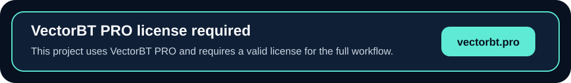

<p align="center">
  
</p>

Aegis RD is a research and development workspace for testing market ideas with reproducible evidence.

It turns raw hypotheses into repeatable experiments: split the data, train or define the signal, simulate the portfolio, price in friction, and write down why the idea survived or failed. The goal is to make research decisions easier to audit and easier to repeat.

The goal is to make the core quantitative loop fast, explicit, and easy to reject:

```text
market data
-> feature and indicator matrix
-> labels
-> validation split
-> model or signal rule
-> portfolio simulation with costs
-> survival report
```

This repo is intentionally thin: config in, evidence out. The local code handles repeatable experiment wiring, validation policy, artifact writing, and public-safe reports.

## Research Engine Resources

- [Feature overview](https://vectorbt.pro/pvt_16ebf9ef/features/overview/)
- [Tutorials](https://vectorbt.pro/pvt_16ebf9ef/tutorials/overview/)
- [Cookbook](https://vectorbt.pro/pvt_16ebf9ef/cookbook/overview/)
- [API documentation](https://vectorbt.pro/pvt_16ebf9ef/api/)
- [Documentation overview](https://vectorbt.pro/pvt_16ebf9ef/documentation/overview/)

## Current Scaffold

```text
research/
  aegis_research/
    config.py        # typed experiment config
    data.py          # synthetic, CSV, YFData, BinanceData, CCXTData loaders
    indicators.py    # indicator matrix builders
    labels.py        # FIXLB, TRENDLB, and PIVOTLB labels
    splits.py        # holdout and vbt.Splitter rolling split policies
    models.py        # sklearn model training and joblib export
    signals.py       # probabilities -> entries/exits
    portfolios.py    # vbt.Portfolio.from_signals wrapper
    validation.py    # train/test evaluation boundary
    reports.py       # survival verdicts and metrics
    experiments.py   # orchestration and artifact writing
    cli.py           # command runner
  configs/
    experiments/
      synthetic_ml_baseline.yaml
runs/
docs/
```

## Run The Baseline

```bash
python -m research.aegis_research.cli run research/configs/experiments/synthetic_ml_baseline.yaml
```

The baseline uses deterministic synthetic OHLCV data, so it does not require exchange credentials or network access. It trains a simple logistic regression model on indicator-derived inputs, converts model probabilities into entries/exits, runs `vbt.Portfolio.from_signals`, and writes a report under `runs/`.

Example output:

```text
Run: runs/20260516T012248Z_synthetic_ml_baseline
Status: rejected
Reason:
- OOS Sharpe below threshold: -1.100812081585402 < 0.5
```

## Research Concepts Used

- `Data`: fetch or load market data through reusable data adapters.
- `Indicators`: compute reusable numeric arrays such as returns, moving-average distance, volatility, and RSI.
- `Labels`: create forward-looking targets such as fixed-horizon, trend, and pivot labels.
- `Signals`: convert model outputs or indicator conditions into entries and exits.
- `Portfolio.from_signals`: simulate orders, positions, fees, slippage, returns, drawdowns, and trade stats.
- `Splitter`: generate rolling walk-forward train/test windows.
- `Stats`: reduce portfolio results into train/test metrics.

## Public Boundary

This repository may contain generic research workflow code, deterministic baselines, public methodology docs, report schemas, and scaffold examples.

This repository must not contain:

- Real profitable strategy parameters.
- Sensitive run outputs for live candidates.
- Exchange credentials, account identifiers, or execution configuration.
- Proprietary data snapshots.
- Live handoff bundles.
- Anything that reveals deployed edge.

## Artifact Policy

Experiment outputs belong under `runs/`, which is ignored by git except for `runs/.gitkeep`.

Typical run artifacts:

```text
runs/<timestamp>_<experiment>/
  config.yaml
  survival_report.json
  probabilities.csv
  signals.csv
  artifacts/
    model.joblib
```

## Next Architecture Moves

- Replace the simple chronological split with `vbt.Splitter`-backed walk-forward validation.
- Add parameter-grid experiments that keep high-cardinality sweeps inside vectorized research primitives.
- Add multi-symbol portfolio handling with grouping and cash-sharing assumptions.
- Add cost sensitivity, regime slicing, bootstrap diagnostics, and handoff bundles only after an idea survives the basic loop.

## Principle

Keep the project thin around the research engine. Use proven primitives directly where they fit, and add local code only where the project needs repeatable configuration, validation policy, artifact writing, or public-safe reporting.

<p align="center">
  <a href="https://vectorbt.pro/">
    
  </a>
</p>
