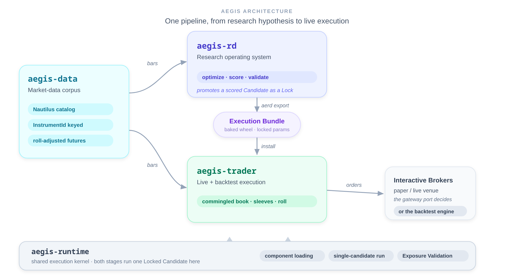

# Aegis

Aegis is a monorepo of bounded contexts for systematic trading: one pipeline
from research hypothesis to live execution. Research scores and promotes a
strategy; execution trades exactly that promoted strategy, with the same
component code running on both sides of the boundary.

Each context owns its own glossary (`CONTEXT.md`); the
[Context Map](./CONTEXT-MAP.md) records what the contexts are and how they
relate.

## Architecture at a glance

<p align="center">
  
</p>

## Contexts

### [`aegis-rd/`](./aegis-rd): Research
A research operating system that turns market hypotheses into reproducible,
scored evidence. Every run writes an immutable manifest recording config,
environment, artifact hashes, and lineage, and promotes validated strategies as
**Locks** that reproduce an exact scored **Candidate**. `aerd export` bakes a
Lock into an **Execution Bundle** wheel for execution. See
[`aegis-rd/README.md`](./aegis-rd/README.md) and
[`aegis-rd/CONTEXT.md`](./aegis-rd/CONTEXT.md).

### [`aegis-data/`](./aegis-data): Market data
The shared **Catalog**: bars keyed by **InstrumentId** in one
`ParquetDataCatalog`, kept in its own layout so nothing translates on read. It
serves both research sourcing and live warmup through the same `DataProvider`
port, lazily filling missing windows through an adapter (IBKR is one adapter
behind the port, not the architecture), and derives back-adjusted
continuous-future series across roll seams. See
[`aegis-data/CONTEXT.md`](./aegis-data/CONTEXT.md).

### [`aegis-runtime/`](./aegis-runtime): Shared kernel
The minimal execution contract shared by research and execution: component
loading, single-candidate orchestration, and the one fail-closed **Exposure
Validation** gate over native **InstrumentId** columns. Depended on by both
Aegis RD and every Execution Bundle, so the research apparatus (optimizer,
Candidate Store, preflight, ranking) never crosses into execution. See
[`aegis-runtime/CONTEXT.md`](./aegis-runtime/CONTEXT.md).

### [`aegis-trader/`](./aegis-trader): Live execution
Trades strategies promoted by Aegis RD against real venues. It runs a
**Commingled Book** of **Sleeves**, each backed by one Execution Bundle and
sized by a risk-budgeting **Allocator**, both offline through Nautilus'
`BacktestEngine` and live against Interactive Brokers. The same
`RebalanceStrategy` drives backtest, paper, and live; paper vs live is decided
only by the gateway port (`IB_PORT`), never by a run mode. See
[`aegis-trader/CONTEXT.md`](./aegis-trader/CONTEXT.md).

## How they relate

Aegis RD is the system of record for *which* strategies are worth trading and
*with what parameters*. It promotes a validated strategy as a **Lock**, a
`run_id[:role]` reference that reproduces one scored **Candidate** with its exact
parameters and **Provenance**, resolved against Aegis RD's **Candidate Store**.

The handoff crosses the boundary as an **Execution Bundle**: `aerd export`
resolves a Lock, bakes the Candidate's parameters, and builds a
versioned wheel carrying the strategy, its wired indicators, and provenance.
Aegis Trader installs the wheel and runs it through **`aegis-runtime`**, feeding
it **InstrumentId**-keyed market data from Aegis Data and getting a
signed target-weight frame back, with no **Candidate Store** access at runtime.
Because both sides gate through the same kernel, a book validated in research and
one traded live enforce identical exposure limits.

## Layout

```
aegis/
├── CONTEXT-MAP.md     # the contexts and their relationships
├── aegis-rd/          # research operating system
├── aegis-data/        # shared market-data Catalog + provider port
├── aegis-runtime/     # shared execution kernel
└── aegis-trader/      # live + backtest execution
```

## Documentation

- [Context Map](./CONTEXT-MAP.md): bounded contexts and their relationships
- Per-context glossaries: [`aegis-rd`](./aegis-rd/CONTEXT.md), [`aegis-data`](./aegis-data/CONTEXT.md), [`aegis-runtime`](./aegis-runtime/CONTEXT.md), [`aegis-trader`](./aegis-trader/CONTEXT.md)
