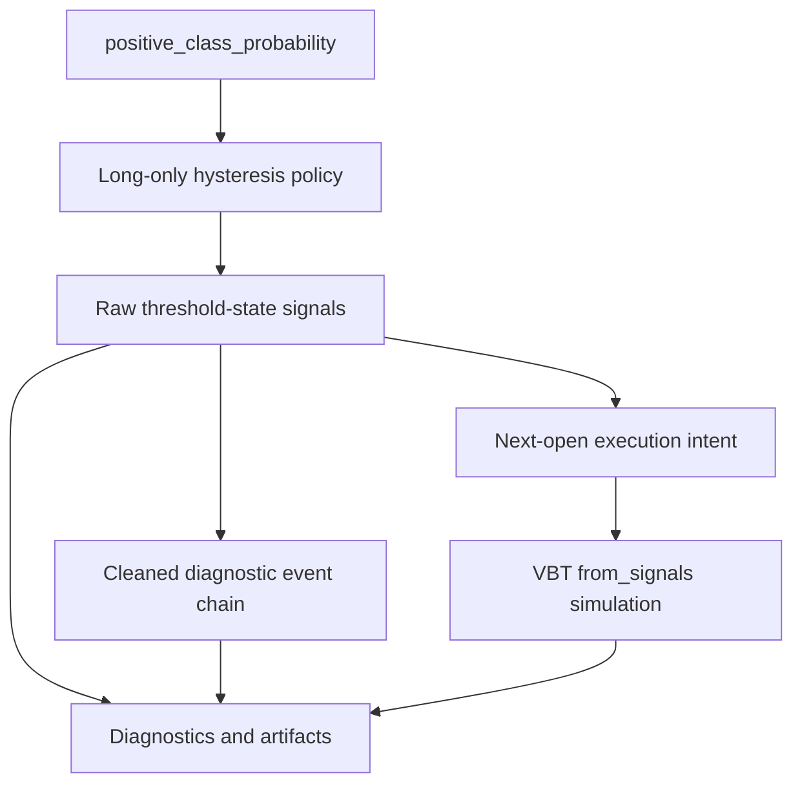

# Signal Generation And Conflict Semantics

## Summary

Issue #11 will define a forward-first signal contract for ETF and ordinary asset research: `positive_class_probability` becomes long-only threshold-state signals with explicit timing, VBT portfolio semantics, and auditable diagnostics. V1 defaults to next-open execution, keeps shorting out of scope, and records enough evidence for reviewers to distinguish model probabilities, raw signal states, diagnostic event chains, and actual portfolio orders.

---

## Problem Frame

`research/aegis_research/signals.py` currently converts probabilities into two boolean panels with a simple threshold pair, and `research/aegis_research/portfolios.py` passes those panels to `Portfolio.from_signals`. That scaffolding is intentionally small, but it leaves important trading semantics implicit: whether signals are threshold states or order events, whether same-bar execution is assumed, whether repeated high probabilities should imply repeated entries, and how VBT resolves conflicts.

Issue #9 shifts the model boundary to `positive_class_probability`, selected by explicit positive-class mapping and marked as uncalibrated unless a future calibration contract exists. That makes the signal layer the first place where model output becomes trading intent. Without a documented signal contract, downstream planning would have to invent decisions about long/short interpretation, threshold hysteresis, execution timing, VBT conflict delegation, missing probabilities, and artifact provenance.

For ETF and ordinary asset research, accidental shorting is the highest-risk ambiguity. VBT can map generic `entries` and `exits` into short or reversal behavior when `direction="both"`, but #9's probability output is not a side-specific short score. V1 should therefore treat the probability as evidence for long exposure versus cash, not as a bidirectional trading instruction.

---

## Actors

- A1. Experiment author: Chooses signal thresholds, execution timing, and portfolio assumptions for a research run.
- A2. Signal stage: Converts model probability panels into long-only signal panels and diagnostics.
- A3. Portfolio stage: Runs VBT portfolio simulation with explicit timing, direction, conflict, and accumulation assumptions.
- A4. Reviewer or automation agent: Inspects artifacts to understand probability meaning, signal policy, timing assumptions, and executed orders without rereading code.
- A5. Future strategy developer: Extends the contract later for shorting or side-specific signals without inheriting ambiguous v1 behavior.

---

## Key Flows

- F1. Generate long-only threshold-state signals
  - **Trigger:** A validation split or experiment run produces a timestamp-by-symbol `positive_class_probability` panel.
  - **Actors:** A1, A2, A4
  - **Steps:** Confirm the probability output identity and metadata, apply the named long-only hysteresis policy, treat missing probabilities as no signal, preserve timestamp-symbol shape, and record threshold-state counts.
  - **Outcome:** The run has raw long-entry and long-exit threshold-state panels with explicit threshold provenance and probability metadata.
  - **Covered by:** R1, R2, R3, R4, R5, R14, R15
- F2. Simulate with explicit VBT execution semantics
  - **Trigger:** Raw signal states are ready for portfolio simulation.
  - **Actors:** A1, A3, A4
  - **Steps:** Apply the default next-open execution policy or require an explicit override, run long-only `Portfolio.from_signals` semantics, delegate repeated-signal and conflict behavior to VBT, and record the resolved portfolio assumptions.
  - **Outcome:** Portfolio results are tied to visible VBT execution semantics rather than hidden same-close or bidirectional defaults.
  - **Covered by:** R6, R7, R8, R9, R10, R11, R18
- F3. Review signal diagnostics and artifacts
  - **Trigger:** A run writes signal and portfolio artifacts.
  - **Actors:** A2, A3, A4, A5
  - **Steps:** Inspect raw threshold-state counts, cleaned diagnostic event-chain counts, missing-probability counts, VBT conflict and accumulation settings, timing mode, and actual order/trade counts.
  - **Outcome:** Reviewers can tell whether a performance result came from model evidence, signal policy, VBT order resolution, or timing assumptions.
  - **Covered by:** R11, R12, R13, R14, R15, R16

---

## Evidence Used

| Evidence | Confirmed behavior or guidance | Requirement impact |
|---|---|---|
| VectorBT PRO docs, Portfolio from signals, Signals: https://vectorbt.pro/pvt_16ebf9ef/documentation/portfolio/from-signals/#signals | VBT has direction-unaware `entries`/`exits` plus `direction`, and direction-aware long/short signal arrays. Direction-unaware is easier when direction is global; direction-aware is more flexible when arrays already encode side. | V1 can safely stay with a long-only direction-unaware contract while reserving direction-aware arrays for future side-specific work. |
| VectorBT PRO docs, Portfolio from signals, Signal resolution: https://vectorbt.pro/pvt_16ebf9ef/documentation/portfolio/from-signals/#signal-resolution | VBT consolidates up to four signals into one final signal through same-direction conflict, direction conflict, and opposite-entry resolution. | #11 must make conflict delegation and resolved settings visible instead of pretending boolean panels map one-to-one to orders. |
| VectorBT PRO docs, Portfolio from signals, Conflicts: https://vectorbt.pro/pvt_16ebf9ef/documentation/portfolio/from-signals/#conflicts | Repeated signals are common. Without accumulation, VBT considers only the first signal and ignores the rest; simultaneous entry/exit conflicts can be ignored or resolved by conflict settings. | Raw signal counts must be labeled as threshold-state counts, not expected order counts. |
| VectorBT PRO docs, Portfolio from signals, Accumulation: https://vectorbt.pro/pvt_16ebf9ef/documentation/portfolio/from-signals/#accumulation | With accumulation enabled, each signal can become an order regardless of current position; without accumulation, repeated entries are ignored while already in position. | V1 must record accumulation mode and avoid interpreting raw signal density as trade density. |
| VectorBT PRO tutorial, Signal Development, Cleaning: https://vectorbt.pro/pvt_16ebf9ef/tutorials/signal-development/pre-analysis/#cleaning | Cleaning removes signals that should not become orders. `SignalsAccessor.clean` selects first valid entry/exit signals, removes same-time conflicts by default, and exposes `force_first`, `keep_conflicts`, and `reverse_order`. | Cleaned signals are useful as diagnostics even when portfolio simulation delegates raw states to VBT. |
| VectorBT PRO tutorial, Superfast SuperTrend, Backtesting: https://vectorbt.pro/pvt_16ebf9ef/tutorials/superfast-supertrend/#backtesting | The tutorial shifts close-derived signals forward by one tick because VBT executes orders immediately and the example wants more realistic backtesting. | V1 should not silently inherit same-close execution for close-derived model probabilities. |
| VectorBT PRO docs, Portfolio from signals, Main order resolution: https://vectorbt.pro/pvt_16ebf9ef/documentation/portfolio/from-signals/#main-order-resolution | `from_signals` can process at most one order per bar and must choose among user, limit, and stop orders by documented order-resolution rules. | Same-bar microstructure and close-then-reopen behavior are out of scope for the v1 signal contract. |
| VectorBT PRO API, `Portfolio.from_signals`: https://vectorbt.pro/pvt_16ebf9ef/api/portfolio/base/#vectorbtpro.portfolio.base.Portfolio.from_signals | `direction` takes effect only if short-side arrays are not provided; `entries` and `exits` become long signals once short-side arrays are supplied. | Future long/short support needs a distinct contract and should not be squeezed into v1 generic `entries`/`exits`. |
| VectorBT PRO API, `dir_signal_func_nb`: https://vectorbt.pro/pvt_16ebf9ef/api/portfolio/nb/from_signals/#vectorbtpro.portfolio.nb.from_signals.dir_signal_func_nb | Direction-unaware entries/exits are routed differently for long-only, short-only, and other directions. | `direction="both"` would change action meaning and is not a safe default for `positive_class_probability`. |
| VectorBT PRO API, `SignalsAccessor.clean`: https://vectorbt.pro/pvt_16ebf9ef/api/signals/accessors/#vectorbtpro.signals.accessors.SignalsAccessor.clean | Cleaning one array selects first signals; cleaning entry/exit arrays uses `clean_enex_nb` and returns cleaned entries/exits. | #11 can require cleaned diagnostic artifacts without making them portfolio inputs. |
| Discord support, same-bar/default execution and next-open options: https://discord.com/channels/918629562441695344/918630948248125512/991066395724894249 | Maintainer confirms VBT executes on the same bar at current close by default; close-derived signals can instead be shifted or use `price="nextopen"`. A support participant notes next-open is more realistic for daily stocks because close execution and overnight gaps matter. | Next-open is the lowest-risk ETF/asset default, while same-close remains an explicit research assumption. |
| Discord support, `price="nextopen"` and shifting: https://discord.com/channels/918629562441695344/918630948248125512/1122184692091850792 | Maintainer says nothing needs to be shifted when using `nextopen`. | Requirements should describe next-open execution intent without requiring both signal shifting and next-open pricing. |
| Discord support, direction-aware custom signals: https://discord.com/channels/918629562441695344/918630948248125512/1433824216733712404 | Maintainer says `direction` has no effect when signals are already direction-aware; if a custom function returns four signal types, the function owns distribution among signal types while conflicts are still handled normally. | V1 should not mix long/short arrays, custom signal distribution, and generic direction policy. |
| Discord support, repeated entries and position state: https://discord.com/channels/918629562441695344/918630948248125512/1239791289286004767 | Maintainer confirms new entries are ignored while already in position; opposite entries can be handled through `upon_opposite_entry`; exit signals are processed. | Diagnostics must explain why repeated raw entries and actual orders can diverge. |
| Discord support, one order per bar: https://discord.com/channels/918629562441695344/918630948248125512/1047195309467504720 and https://discord.com/channels/918629562441695344/918629563469295628/1276713553595994112 | Maintainer confirms `from_signals` allows only one order per bar per column; groups can process multiple columns. | V1 should document one-order-per-bar as a baseline limitation, not try to solve intrabar sequencing. |

The VBT behavior above is confirmed by current docs/API and maintainer/support discussion. One older Discord message from 2022 stated there was no `long_entries` argument, but current official API/docs include long/short direction-aware arrays; treat that older message as stale and prefer current docs/API.

The default choices in this document are project recommendations derived from VBT evidence and ETF/asset assumptions, not VBT mandates. VBT permits same-close, shifted, and next-open execution; this scaffold should choose the conservative default and require explicit overrides for less conservative assumptions.

---

## Requirements

**Long-only signal policy**
- R1. Signal generation must consume the standardized `positive_class_probability` panel from the model stage and must not reinterpret plugin identity, target class meaning, or calibration status.
- R2. V1 signal generation must be long-only: high positive-class probability expresses intent to enter or remain long, low positive-class probability expresses intent to exit or remain out, and no v1 signal implies shorting, reversal, or bearish leverage.
- R3. V1 must define a named long-only hysteresis policy with an action-specific long-entry threshold, an action-specific long-exit threshold, and a hold band between them.
- R4. The long-exit threshold must be lower than the long-entry threshold; invalid threshold ordering must fail before signal generation or artifact completion.
- R5. Missing probabilities must produce no entry and no exit signal, and missing-probability counts must be recorded by split, set, and symbol where that identity exists.
- R6. Threshold artifacts must record threshold values, policy name/version, source probability output name, positive class, and whether the probabilities were calibrated.

**Execution and VBT delegation**
- R7. ETF/asset v1 must default to next-open execution for close-derived model probabilities: a signal observed at one bar is intended to execute at the next tradable open, not the same bar's close.
- R8. If next-open execution is requested but open prices are unavailable or unusable, the run must fail or require an explicit timing override; it must not silently fall back to same-close execution.
- R9. Same-close, next-close, or custom execution timing may be supported only as explicit research assumptions that are recorded in signal and portfolio artifacts.
- R10. Portfolio simulation may delegate repeated-signal, position-state, and conflict behavior to VBT, but the resolved VBT direction, accumulation, conflict, opposite-entry, and timing settings must be visible in artifacts.
- R11. V1 must prevent accidental `direction="both"` or short-side signal use from the single `positive_class_probability` output; future shorting requires a side-specific model output, signed target contract, or separately documented signal contract.
- R12. The v1 contract must document that `Portfolio.from_signals` can process at most one order per bar per column and that same-bar microstructure is outside the baseline simulation model.

**Diagnostics and artifacts**
- R13. Raw signal counts must be labeled as threshold-state counts, not expected trade counts; actual order and trade counts must come from portfolio results.
- R14. Signal artifacts must include raw long-entry and long-exit threshold-state panels, execution timing metadata, missing-probability counts, simultaneous entry/exit counts, and actual portfolio order/trade counts when simulation runs.
- R15. Signal artifacts must include cleaned entry/exit diagnostics computed from raw threshold states for interpretability, but cleaned diagnostics must not become the portfolio input in v1.
- R16. Cleaned diagnostic artifacts must record the cleaning settings used, including whether first-signal forcing, same-time conflict removal, and reverse ordering were enabled.
- R17. Signal artifacts must preserve split identity, set identity, timestamp index identity, and symbol columns from validation through aggregate outputs.
- R18. Diagnostics must make it possible to compare raw threshold-state density, cleaned diagnostic event density, and actual VBT order/trade density without loading private native artifacts.

---

## Acceptance Examples

- AE1. **Covers R1, R2, R3, R6.** Given a split emits uncalibrated `positive_class_probability` values, when signal generation runs, artifacts identify the long-only hysteresis policy, thresholds, source output name, positive class, and calibration status.
- AE2. **Covers R3, R4.** Given a config sets the long-exit threshold greater than or equal to the long-entry threshold, when validation reaches signal configuration, the run fails before producing completed signal artifacts.
- AE3. **Covers R5, R14.** Given a probability panel contains NaN values for one symbol, when signal generation runs, those cells produce no entry and no exit signal and missing-probability diagnostics identify the affected split, set, and symbol.
- AE4. **Covers R7, R8, R9.** Given an ETF run uses close-derived model probabilities and open prices are available, when portfolio simulation runs without a timing override, the run uses next-open execution semantics and records that timing choice.
- AE5. **Covers R8.** Given next-open execution is the selected timing mode but open prices are unavailable, when the portfolio stage prepares simulation, the run fails or requires an explicit alternate timing mode rather than silently using same-close execution.
- AE6. **Covers R10, R13, R18.** Given positive probability stays above the long-entry threshold for twenty consecutive bars, when simulation runs without accumulation, raw signal diagnostics may show twenty entry threshold states while portfolio order counts may show one executed entry.
- AE7. **Covers R11.** Given an experiment attempts to use `direction="both"` with only `positive_class_probability`, when signal or portfolio validation runs, the run rejects that configuration or requires a future side-specific signal contract.
- AE8. **Covers R14, R15, R16.** Given raw threshold states contain repeated entries between exits, when artifacts are written, cleaned diagnostic event-chain counts are available separately from raw threshold-state counts and are marked diagnostics-only.
- AE9. **Covers R12.** Given a strategy expectation requires closing and reopening within the same bar, when reviewed against the v1 contract, the requirement is identified as outside baseline `from_signals` behavior rather than silently modeled by the signal layer.
- AE10. **Covers R17, R18.** Given purged validation produces train and test probability panels across multiple symbols, when aggregate artifacts are written, split/set/symbol identity remains visible through signal diagnostics and portfolio summaries.

---

## Success Criteria

- ETF and ordinary asset experiments cannot accidentally convert a binary positive-class probability into short or reversal behavior.
- Reviewers can tell which behavior came from model probability, hysteresis threshold policy, execution timing, VBT signal resolution, and actual portfolio orders.
- Same-close execution assumptions are no longer hidden defaults for close-derived model probabilities.
- Signal artifacts are interpretable without reading `research/aegis_research/signals.py` or loading private native VBT objects.
- Downstream planning can proceed without inventing v1 direction semantics, threshold semantics, execution timing defaults, cleaning stance, or diagnostic scope.

---

## Scope Boundaries

- No short-only, long/short, `direction="both"`, reversal, borrowing, futures, or leveraged bearish behavior in v1.
- No derivation of short entries from the v1 `positive_class_probability` output.
- No probability calibration, threshold optimization, adaptive thresholds, or per-split threshold tuning in v1.
- No custom order simulator, `from_order_func` migration, intrabar event engine, or same-bar close-then-reopen model in v1.
- No cleaned signal panels as the default portfolio input in v1; cleaned panels are diagnostics only.
- No non-probability prediction-to-signal contract in v1.
- No backward-compatibility shim for ambiguous pre-#9 `long_probability` semantics unless planning discovers a shipped artifact consumer that requires migration handling.

---

## Key Decisions

- Long-only v1: The first production signal contract should match ETF/asset long-or-cash research and avoid accidental short semantics.
- Named hysteresis policy: Action-specific entry and exit thresholds make the contract forward-first instead of preserving ambiguous scaffold terminology as the product concept.
- Next-open default: For close-derived ETF/stock-style probabilities, next-open is the safer baseline; same-close remains possible only as an explicit assumption.
- VBT delegation with visible settings: The portfolio stage can use VBT's documented signal-resolution behavior, but artifacts must expose the assumptions that affect results.
- Cleaned diagnostics only: Cleaned event chains help reviewability, while raw threshold states remain the portfolio signal input for v1.
- Threshold-state count semantics: Raw signal density is model/policy evidence, not a trade-count promise.

---

## Dependencies / Assumptions

- Issue #9 provides standardized `positive_class_probability` panels, positive-class metadata, and calibration metadata.
- Issue #3 and validation artifacts preserve split/set identity that signal artifacts can carry forward.
- ETF/asset v1 assumes long exposure versus cash as the default trading posture.
- Open prices are available from the data stage for runs that use next-open timing; if not, timing must be explicitly overridden or rejected.
- VBT PRO behavior cited here is current as of 2026-05-17.
- Current scaffold docs in `docs/vectorbt-scaffold.md` keep `Portfolio.from_signals` as the baseline portfolio path and defer custom order simulation until signal arrays cannot express the execution model.

---

## Outstanding Questions

### Deferred to Planning

- [Affects R3, R6][Technical] What exact config field names should expose the named hysteresis policy and action-specific thresholds without carrying ambiguous scaffold names forward?
- [Affects R7, R8, R9][Technical] What exact timing modes should be accepted, and how should next-open execution be represented when indexes are irregular or symbols have missing open prices?
- [Affects R10, R14][Technical] Which resolved VBT conflict, direction, and accumulation settings should be persisted directly versus inherited from portfolio config metadata?
- [Affects R14, R15, R16, R18][Technical] What artifact schema should hold raw threshold-state panels, cleaned diagnostic panels, timing metadata, and count summaries without duplicating large data unnecessarily?
- [Affects R17][Technical] How should aggregate artifacts represent split/set identity when signal panels are concatenated or summarized across validation splits?
