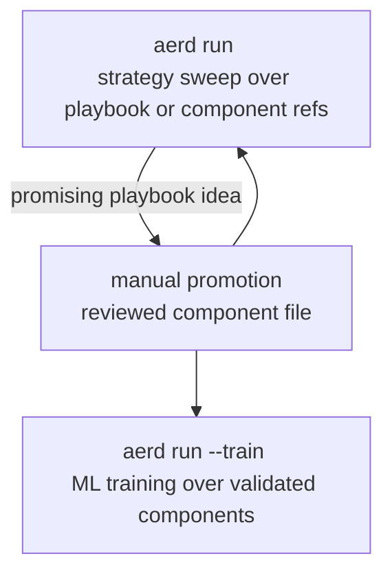

# Research Playbook Component Workflow

## Summary

Add a single-command research workflow: `aerd run` runs strategy and research sweeps over explicitly selected repo-controlled playbooks or promoted components, while `aerd run --train` runs reproducible ML training from the same config contract. Train-specific settings live under a `train:` section that is required only in train mode. Labels, indicators, and strategies become file-scoped plugin-like components that are easy to add, remove, review, and discover without editing central runtime code.

---

## Problem Frame

Aegis RD currently feels too code/config-first for ordinary VectorBT-style research. Researchers cannot easily explore many indicator, threshold, or strategy variations in a fast sweep loop, and reusable feature/indicator work pushes them toward editing main registry code rather than adding a small reviewed component the way model plugins work.

This creates the wrong pressure at both ends of the research loop. Early exploration requires too much structure before an idea has proven itself, while reusable work still carries too much central-code editing after an idea is worth keeping. It also blurs the distinction between exploratory evidence, reproducible strategy validation, and ML training evidence.

Prose is authoritative if this diagram and the requirements disagree.

---

## Actors

- A1. Researcher: Explores label, indicator, threshold, and strategy ideas quickly before deciding what is worth keeping.
- A2. Component author: Promotes reusable labels, indicators, and strategies into reviewed component files with stable IDs and metadata.
- A3. Strategy run reviewer: Compares reproducible strategy sweep results and needs clear variant identity, ranking, metrics, and artifacts.
- A4. ML training reviewer: Runs explicit model-training workflows and needs labels/features/model plugins to be validated and auditable.
- A5. Automation agent: Executes CLI workflows and parses mode-specific outputs without guessing whether evidence is exploratory, strategy-run, or training evidence.

---

## Key Flows

- F1. Playbook-backed strategy run
  - **Trigger:** A researcher calls `aerd run <config>` with playbook strategy or indicator source refs.
  - **Actors:** A1, A5
  - **Steps:** The config selects repo-controlled playbook IDs by explicit source refs, chooses sweep inputs, runs playbook-local exploratory logic through the run lane, computes configured VectorBT metrics, and writes run artifacts that identify playbook-backed evidence.
  - **Outcome:** The researcher gets a top-10 sweep leaderboard without creating reusable runtime dependencies or executing arbitrary notebook paths.
  - **Covered by:** R1, R2, R3, R4, R5, R6, R7, R8, R9, R10
- F2. Manual promotion
  - **Trigger:** A playbook-backed run result or manual experiment produces logic worth reusing.
  - **Actors:** A1, A2
  - **Steps:** The author moves reusable logic into a reviewed label, indicator, or strategy component file with stable ID, metadata, callable behavior, and declared compatibility assumptions.
  - **Outcome:** Reusable research logic becomes a promoted component that `run` or `train` can reference reproducibly.
  - **Covered by:** R11, R12, R13, R14
- F3. Component-backed strategy sweep
  - **Trigger:** A reviewer calls `aerd run <config>`.
  - **Actors:** A2, A3, A5
  - **Steps:** The run config selects promoted indicator and strategy components by stable IDs, provides sweep parameters and portfolio assumptions, evaluates strategy variants, and records metrics, source kinds, and variant identity as reproducible run evidence.
  - **Outcome:** Strategy results can be audited from explicit component source refs and config-owned portfolio assumptions.
  - **Covered by:** R13, R14, R15, R16, R17
- F4. Reproducible ML training
  - **Trigger:** A reviewer calls `aerd run --train <config>`.
  - **Actors:** A2, A4, A5
  - **Steps:** The shared config's `train:` section selects validated labels, indicator-derived features, and a model source. The only active model source in v1 is `source: plugin`; future local model sources need an explicit safe file-boundary contract before they are accepted.
  - **Outcome:** Model training is explicit and reproducible, and it does not depend on playbook state.
  - **Covered by:** R18, R19, R20

---

## Requirements

**Command and config contract**
- R1. The CLI must expose one active workflow command: `aerd run <config>` for strategy/research sweeps and `aerd run --train <config>` / `aerd run -t <config>` for reproducible ML training.
- R2. Each run mode must make its evidence type and source mode visible: strategy mode records whether strategy and indicator evidence came from playbooks or components, and train mode records ML-training evidence.
- R3. `run` modes must not execute playbook notebooks, playbook scripts, inline Python from config, arbitrary external scripts, or unreviewed filesystem paths.
- R4. Configs may select IDs, stages, parameters, sweeps, ranking metrics, data inputs, and portfolio assumptions, but executable research logic must live in repo-controlled playbooks or promoted components.
- R4a. Local configs live in one flat `research/configs/` shelf; mode is selected by the CLI flag, not by subdirectories or a top-level lane field.

**Playbook-backed run workflow**
- R5. `aerd run <config>` must select repo-controlled strategy or indicator playbooks by stable ID through explicit `source: playbook` refs, not by arbitrary notebook or script paths.
- R6. Playbooks may contain temporary exploratory indicator, threshold, strategy, or baseline ideas without requiring promotion up front.
- R7. Run sweep artifacts must include a top-10 leaderboard of sweep configurations ranked by one config-selected allowed VectorBT metric and direction.
- R8. A sweep configuration leaderboard row must identify the full configuration that was evaluated, including relevant indicator source kind, indicator ID, indicator parameters, thresholds, strategy source kind, strategy ID, strategy parameters, and portfolio assumptions.
- R9. Run configs may select playbook indicator IDs, explicit component indicator IDs, and all component indicators in the same run; each indicator playbook ID represents one indicator idea/family and may sweep parameters inside that family.
- R10. When an indicator playbook declares one component indicator baseline and emits baseline evidence, ranking may use direct delta versus that baseline on the configured primary metric; otherwise ranking uses the raw configured metric.

**Promoted components**
- R11. Labels, indicators, and strategies must be promoted as file-scoped plugin-like components with stable IDs, metadata, and callable behavior.
- R12. Adding or removing a promoted label, indicator, or strategy must be component-file-scoped and autodiscovered from project-controlled component locations, not require unrelated central registry edits.
- R13. Promoted component metadata must expose enough identity and compatibility information for reproducibility, including source kind, parameters, outputs, supported role, and relevant alignment or lookahead assumptions.
- R14. Promotion in v1 is manual: the researcher or component author moves reusable logic into a reviewed component file; run artifacts must not be promoted implicitly.

**Strategy sweeps**
- R15. `aerd run <config>` must select strategy source refs by stable ID, where each strategy ref declares `source: playbook` or `source: component`; it must not accept inline strategy rules or arbitrary external paths.
- R16. Strategy components must represent reusable signal or rule logic over data, labels, and indicator outputs; portfolio assumptions such as sizing, costs, execution timing, cash sharing, and direction are owned by config.
- R17. Run artifacts must preserve enough variant identity to compare strategy source kinds, strategy IDs, consumed indicator source kinds, consumed indicator IDs, parameter values, portfolio assumptions, VectorBT metrics, and ranking or survival outcomes.

**ML training mode**
- R18. `aerd run --train <config>` must be the explicit ML mode for model training, separate from strategy sweeps while remaining under the one active `run` command.
- R19. The config's `train:` section must consume promoted or validated labels, indicator-derived model features, and model refs; it must not depend on notebook, playbook, or prior `run` artifact state. In v1, model refs keep a `source` field but only `source: plugin` is executable.
- R20. Features are not a separate first-class component family in v1; indicator outputs and transforms are the promoted source that can become model features for `train`.

---

## Acceptance Examples

- AE1. **Covers R1, R2, R5, R6.** Given a valid run config selecting known playbook strategy or indicator IDs and sweep inputs, when a researcher runs `aerd run <config>`, the playbook-backed logic executes through the run lane and records playbook source evidence.
- AE2. **Covers R3, R5.** Given a run config that attempts to execute an arbitrary notebook or script path, when `aerd run` validates the config, it rejects the config instead of executing the path.
- AE3. **Covers R7, R8, R9.** Given a run sweep over indicator windows and strategy thresholds, when the run completes, the run artifact contains a top-10 leaderboard ranked by the configured VectorBT metric and each row identifies the evaluated source refs, parameters, and portfolio assumptions.
- AE4. **Covers R9.** Given a run config with playbook indicator refs, explicit component indicator refs, and an all-components selector, when `aerd run` resolves indicators, it evaluates the combined indicator set and records each row's indicator source kind and ID.
- AE5. **Covers R10.** Given a playbook with a local baseline, when leaderboard ranking is requested, the ranked metric can be the delta from that baseline; given no baseline, ranking uses the raw configured metric.
- AE6. **Covers R11, R12, R13, R14.** Given a useful exploratory indicator, when it is promoted, it becomes a reviewed component file with stable ID and metadata and is discovered without editing unrelated label or strategy definitions.
- AE7. **Covers R15, R16, R17.** Given a run config selecting a promoted strategy ID and portfolio assumptions, when `aerd run` executes, it evaluates promoted strategy variants and records strategy/component IDs, parameters, portfolio assumptions, and metrics in reproducible artifacts.
- AE8. **Covers R18, R19, R20.** Given a config with a valid `train:` section selecting validated labels, indicator-derived features, and a `source: plugin` model ref, when `aerd run --train` executes, model training runs without depending on prior playbook state or a run artifact.

---

## Success Criteria

- Researchers can do VectorBT-style sweep exploration through `aerd run` without editing central source files or promoting every idea before trying it.
- Promoted labels, indicators, and strategies are easy to add, review, remove, and discover as small component files.
- `run` outputs make it obvious which evidence is playbook-backed, which evidence is component-backed strategy-sweep evidence, and which evidence is ML-training evidence.
- A promising playbook-backed run result has a clear manual promotion path into a stable component, followed by reproducible validation through `aerd run` or `aerd run --train`.
- A planner can implement the lane split without inventing product behavior around playbook selection, promotion, leaderboard ranking, component families, or portfolio ownership.

---

## Scope Boundaries

- No arbitrary notebook/script execution from config; playbooks are selected by stable ID from repo-controlled playbook definitions.
- No inline Python, formulas, or strategy rules in YAML/config for reproducible `run` behavior in either strategy or train mode.
- No implicit promotion from a run artifact into a component; promotion is manual and reviewed in v1.
- No separate first-class feature component registry in v1; indicator outputs/transforms serve the feature role for train mode.
- No `source: local` model file execution in v1; model refs keep `source` for forward compatibility, but only `source: plugin` is accepted until local model file boundaries are designed.
- No composite ranking score in v1; run leaderboards rank by one allowed VectorBT metric selected in config.
- No requirement to treat playbook-backed run artifacts as promoted-component validation evidence; they remain source-labeled as playbook-backed even when they include useful metrics.
- No GUI research builder, optimizer, AutoML system, or automatic strategy tuning in this issue.

---

## Key Decisions

- Single command with explicit mode: `run` owns strategy/research sweeps by default, while `run --train` owns ML training through a required `train:` section.
- Stable playbook IDs: Config-selected playbook IDs preserve ergonomics without opening arbitrary filesystem execution.
- File-scoped promoted components: Component files match the model-plugin mental model better than central registry edits.
- Manual promotion: A human-reviewed component file is the reproducibility boundary between playbook-backed exploration and reusable component-backed run/train-mode behavior.
- Config-owned portfolio assumptions: Strategies produce reusable signal/rule logic, while configs own sizing, fees, slippage, timing, cash sharing, and direction so the same strategy can be evaluated under different assumptions.
- Single ranking metric first: VectorBT provides rich metrics and custom stats hooks, but v1 should rank by one validated metric rather than inventing a composite score prematurely.

---

## Dependencies / Assumptions

- Issue #23 establishes the need for `aerd run` to support reproducible strategy sweeps without forcing model training.
- Existing indicator and label contracts in `docs/brainstorms/2026-05-17-vectorbt-indicator-contract-requirements.md` and `docs/brainstorms/2026-05-17-vectorbt-label-contract-requirements.md` define native-first metadata and lookahead/alignment expectations this workflow should preserve.
- Current CLI wiring in `research/aegis_research/cli.py` exposes `run`; this work removes separate `play`, `train`, and legacy `exp` workflows from the active CLI.
- Current run orchestration in `research/aegis_research/experiments.py` is still model-training-shaped and requires a model registry.
- Current indicator registration in `research/aegis_research/indicator_registry.py` is a central in-code registry, not file-scoped component autodiscovery.
- VectorBT PRO supports portfolio metrics and custom stats APIs that can supply the ranking metrics for run leaderboards.

---

## Outstanding Questions

### Deferred to Planning

- [Affects R5, R11, R12][Technical] What exact project-controlled locations and discovery protocol should playbooks and promoted components use?
- [Affects R8, R10][Technical] Which VectorBT metrics should be allowed for v1 leaderboard ranking, and how should metric direction be validated?
- [Affects R7, R17][Technical] What artifact layout should distinguish playbook-backed run evidence, component-backed run evidence, and train evidence while staying consistent with existing manifest/provenance conventions?
- [Affects R18, R19][Technical] How should the existing `run_experiment` path be reused so default `run` becomes strategy-sweep oriented and `run --train` owns model-plugin training?
