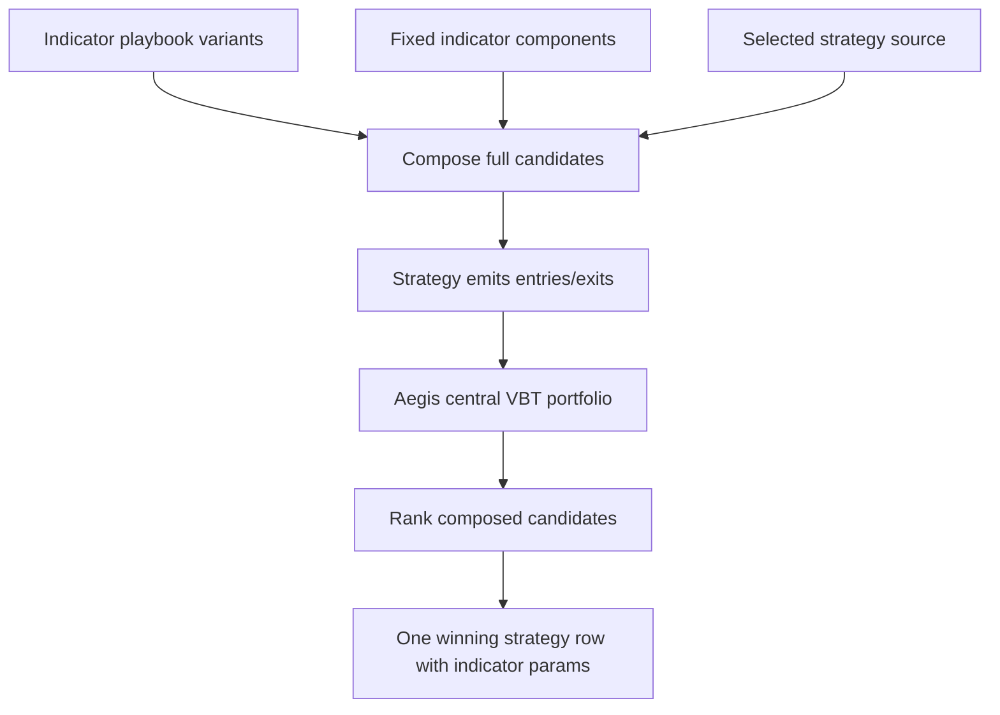

# Composed Indicator Strategy Candidates

## Summary

Aegis should rank complete composed strategy candidates: indicator playbook variants supply indicator outputs and params, strategy sources turn those outputs into entries/exits, and Aegis centrally computes VBT portfolio metrics. The winning row is one strategy candidate with its winning indicator params, not a standalone “best indicator.”

---

## Problem Frame

Indicator logic and strategy logic have different ownership. Indicators produce reusable derived data such as moving averages, RSI, MACD, Bollinger bands, or volume filters. Strategies decide how those data become trades through crossover rules, thresholds, filters, and entry/exit behavior.

Earlier run semantics risked treating indicator playbook variants as either raw evidence that could not participate in ranking or as leaderboard rows with their own metrics. Neither is right for VectorBT-style research. VectorBT users commonly sweep indicator parameters and strategy/portfolio parameters together, but the ranked object is the full backtest candidate after signals and portfolio execution, not the indicator output by itself.

Prose is authoritative if this diagram and the requirements disagree.

---

## Actors

- A1. Researcher: Explores indicator ideas, strategy rules, and parameter sweeps before deciding what is worth promoting.
- A2. Component author: Promotes winning indicator and strategy logic into fixed reviewed components.
- A3. Strategy run reviewer: Reads leaderboards and needs ranked rows to represent comparable full strategy candidates.
- A4. Automation agent: Executes runs, validates candidate composition, and must not infer hidden matrix semantics.

---

## Key Flows

- F1. Indicator sweep through fixed strategy
  - **Trigger:** A run selects one or more indicator playbooks and a fixed strategy component.
  - **Actors:** A1, A3, A4
  - **Steps:** Indicator playbooks produce candidate indicator outputs and params. The fixed strategy consumes each candidate, emits entries/exits, and Aegis computes central VBT metrics for each composed candidate.
  - **Outcome:** Indicator params can be ranked only as part of full strategy candidates.
  - **Covered by:** R1, R2, R3, R4, R6, R8
- F2. Indicator sweep through strategy sweep
  - **Trigger:** A run selects indicator playbooks and a strategy playbook with its own strategy candidate params.
  - **Actors:** A1, A3, A4
  - **Steps:** Aegis composes indicator candidates with strategy candidates, validates the expanded candidate set, executes each full candidate centrally, and ranks the resulting strategy rows.
  - **Outcome:** The leaderboard compares full combinations of indicator params and strategy params under one execution contract.
  - **Covered by:** R1, R2, R3, R4, R5, R6, R7, R8
- F3. Winner promotion
  - **Trigger:** A composed candidate wins or is selected for follow-up.
  - **Actors:** A1, A2, A3
  - **Steps:** The run artifact identifies the winning strategy source/candidate and the consumed indicator source/candidate params. The author can promote the winning indicator logic and strategy logic into fixed components.
  - **Outcome:** Promotion preserves separate ownership of indicator logic and strategy logic while keeping central metric semantics unchanged.
  - **Covered by:** R8, R9, R10

---

## Requirements

**Composition and ranking**
- R1. A ranked run row must represent a complete composed strategy candidate, not a raw indicator candidate.
- R2. Indicator playbook variants may sweep indicator logic and parameters, but they become rankable only when consumed by a strategy source that emits executable entries/exits.
- R3. Strategy playbook variants may sweep trade-rule parameters, but they must still be centrally executed by Aegis before ranking.
- R4. When both indicator and strategy sources have variants, Aegis must make the composition semantics explicit rather than silently treating one axis as authoritative or ignored.
- R5. A composed leaderboard must rank full candidate combinations using Aegis-owned VBT portfolio metrics.

**Ownership boundaries**
- R6. Indicator sources own indicator outputs and indicator params; strategy sources own the trading rule that consumes raw data and indicator outputs to produce entries/exits.
- R7. Components remain fixed promoted implementations. Indicator components and strategy components must not emit parameter sweeps or candidate grids.
- R8. The winning row must preserve both strategy identity/params and consumed indicator identity/params so reviewers can reproduce or promote the result without calling an indicator “best” outside its strategy context.

**Evidence and ergonomics**
- R9. Run artifacts must keep enough provenance to answer which indicator candidate and which strategy candidate produced each ranked metric.
- R10. Promotion from a composed winner should support separate manual promotion of indicator logic and strategy logic into fixed components.
- R11. Candidate expansion must be visible enough that researchers and automation can see when a run is about to evaluate a large matrix of combinations.

---

## Acceptance Examples

- AE1. **Covers R1, R2, R5, R8.** Given an indicator playbook that sweeps moving-average windows and a fixed crossover strategy component, when the run executes, Aegis ranks rows such as “MA window 20 consumed by crossover strategy,” not “MA window 20” by itself.
- AE2. **Covers R1, R3, R5, R8.** Given a strategy playbook that sweeps entry/exit thresholds and fixed indicator components, when the run executes, Aegis ranks full strategy candidates with their strategy params and consumed indicator refs.
- AE3. **Covers R2, R3, R4, R5, R9.** Given an indicator playbook sweep and a strategy playbook sweep, when composition is enabled, every ranked row identifies both axes of the combination and is scored through central VBT execution.
- AE4. **Covers R6, R7.** Given a promoted indicator component or strategy component that emits multiple parameter variants, when Aegis validates the source, it rejects the component and directs the sweep back to playbooks.
- AE5. **Covers R8, R10.** Given a winning composed row, when a reviewer inspects the artifact, the row identifies the winning strategy candidate and the indicator candidate params needed for manual promotion into fixed components.
- AE6. **Covers R11.** Given a run whose indicator and strategy variants would create a large candidate matrix, when Aegis prepares or reports the run, the expanded candidate count is visible before readers interpret the leaderboard.

---

## Success Criteria

- Researchers can use indicator playbooks for indicator sweeps without losing the separation between indicator logic and strategy logic.
- Reviewers can trust that every ranked metric belongs to a complete strategy candidate scored by Aegis central VBT execution.
- The final winner is easy to explain as one strategy result with winning indicator params, not as a context-free best indicator.
- A downstream planner does not need to invent whether indicators can sweep, whether strategies can sweep, or what a leaderboard row represents.

---

## Scope Boundaries

- No raw indicator leaderboard metrics as authoritative strategy performance.
- No claim that an indicator candidate is globally best independent of the strategy that consumed it.
- No component sweeps; components are fixed promoted implementations.
- No playbook-owned authoritative portfolio metrics for ranked rows.
- No automatic promotion from a composed winner into component files.
- No expansion of the baseline portfolio execution model; alternate portfolio contracts require a separate requirements document.
- No requirement to support every possible VectorBT optimization mode in the first implementation; this document defines the candidate semantics, not execution-performance strategy.

---

## Key Decisions

- Ranking unit: The leaderboard ranks composed strategy candidates, not individual indicator outputs.
- Indicator ownership: Indicator playbooks own indicator logic and indicator parameter sweeps.
- Strategy ownership: Strategy playbooks own trade-rule logic and strategy parameter sweeps.
- Component role: Components are fixed promotion targets for reviewed indicator or strategy logic.
- Winner language: Artifacts should describe “winning indicator params within the winning strategy candidate,” not “best indicator.”
- VBT alignment: This follows the common VectorBT pattern of sweeping indicator and rule parameters but ranking portfolio metrics from full backtest candidates.

---

## Dependencies / Assumptions

- `docs/brainstorms/2026-05-20-strategy-playbook-central-execution-requirements.md` establishes that ranked rows must use Aegis-owned portfolio execution and central metric source provenance.
- `docs/brainstorms/2026-05-18-research-playbook-component-workflow-requirements.md` establishes stable playbook/component refs and manual promotion.
- `docs/brainstorms/2026-05-18-portfolio-simulation-contract-requirements.md` establishes the baseline VBT portfolio execution assumptions.
- VectorBT Discord examples align with ranking complete backtest candidates: users sweep indicator params, strategy thresholds, and stop/portfolio params, then rank portfolio stats such as Sharpe ratio or total return.

---

## Outstanding Questions

### Deferred to Planning

- [Affects R4, R11][Technical] How should candidate expansion limits, previews, or failure gates be represented so large matrices do not surprise automation or researchers?
- [Affects R2, R6][Technical] What exact callable boundary should indicator playbooks use to return candidate outputs that strategy sources can consume safely?
- [Affects R3, R6][Technical] What exact callable boundary should strategy playbooks use when strategy candidates depend on composed indicator outputs?
- [Affects R8, R9][Technical] How should artifacts represent composed candidate identity while staying readable in top-N leaderboards?
