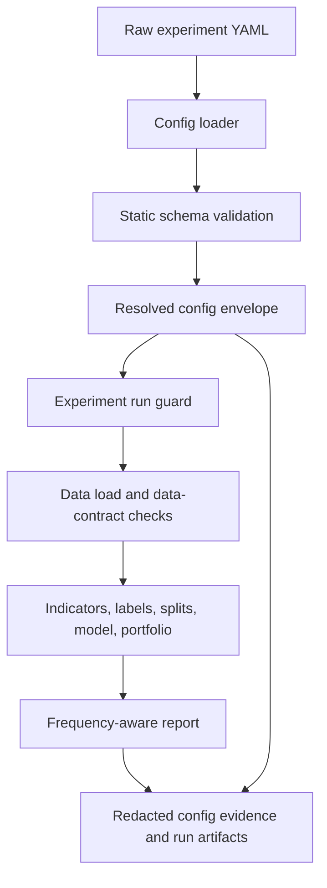
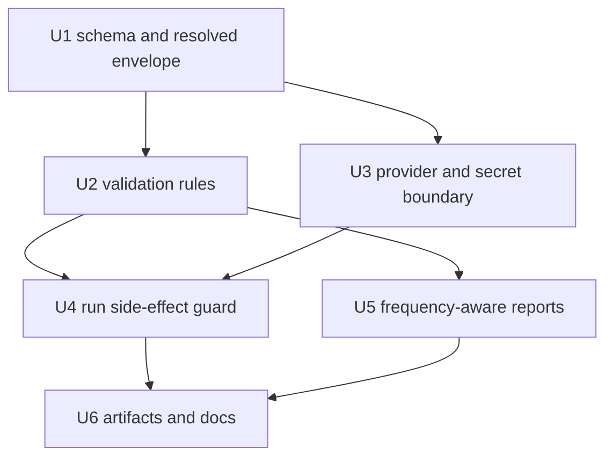

# feat: Harden experiment config contract

## Summary

Implement a strict resolved-config boundary around the existing research scaffold, then thread that boundary through experiment startup, VectorBT-facing validation, provider option handling, frequency-aware reporting, and secret-safe run artifacts. The plan preserves the current small module style while moving public config validity out of downstream execution paths and into an explicit contract.

---

## Problem Frame

The current scaffold loads YAML directly into frozen dataclasses and lets several invalid values fail later in `research/aegis_research/data.py`, `research/aegis_research/labels.py`, `research/aegis_research/splits.py`, `research/aegis_research/models.py`, `research/aegis_research/portfolios.py`, and `research/aegis_research/reports.py`. The origin requirements frame this as a forward-first contract hardening pass while the project has no consumer compatibility burden (see origin: `docs/brainstorms/2026-05-16-experiment-config-contract-requirements.md`).

---

## Requirements

- R1. Static config validation completes before experiment side effects, including run directory creation, remote data fetches, artifact writes, model training, or report generation; data-contract checks that require loaded data run before model training, portfolio simulation, report generation, or public artifact writes.
- R2. Validation failures expose path-aware, actionable messages for config authors and automation.
- R3. Unknown fields fail fast except inside explicit passthrough areas for provider and execution options.
- R4. Wrong scalar, list, mapping, and null shapes fail without broad implicit coercion.
- R5. Centrally enforce allowed values for data source, label kind/mode, split kind, model kind, portfolio size type, portfolio direction, and report status/gate semantics.
- R6. Centrally enforce numeric and collection bounds for windows, thresholds, fees, slippage, row counts, sample counts, split sizes, embargo bars, and validation split counts.
- R7. Enforce source-specific requirements at load time, including CSV path requirements and remote provider requirements.
- R8. Enforce label-specific requirements when knowable at the config or data-contract boundary.
- R9. Enforce split and signal consistency rules centrally.
- R10. Require explicit frequency assumptions for annualized or frequency-sensitive report gates.
- R11. Model provider-specific public options and generic execution options as explicit passthrough areas.
- R12. Define a secret boundary that rejects committed inline credentials from public configs and public artifacts.
- R13. Redact secret-sensitive fields in serialized config and manifest outputs.
- R14. Add a top-level schema version and forward-first evolution policy.
- R15. Persist config evidence that distinguishes raw authored input from resolved/default-applied values.
- R16. Persist stable raw config identity for comparing authored inputs.
- R17. Keep existing baseline experiment configs valid unless tightening is intentional.
- R18. Add positive and negative fixture coverage for schema, value, cross-field, redaction, and artifact behavior.

**Origin actors:** A1 Config author, A2 Experiment runner, A3 Run reviewer, A4 Automation or agent

**Origin flows:** F1 Validate before run, F2 Preserve run config evidence

**Origin acceptance examples:** AE1 unknown fields before side effects, AE2 wrong shapes and bad enums, AE3 missing CSV path, AE4 label/data mismatch, AE5 invalid split settings, AE6 secret rejection/redaction, AE7 run config evidence

---

## Scope Boundaries

- No backward compatibility shims for old configs or persisted runs; the project is still being built (see origin: `docs/brainstorms/2026-05-16-experiment-config-contract-requirements.md`).
- No new data-provider capability beyond explicit config boundaries for VectorBT provider kwargs, execution kwargs, and credential references.
- No broad coercion layer for loosely written YAML; the contract should prefer explicit values and fail-fast errors.
- No expansion into every VectorBT option as first-class config; common scaffold options become first-class, provider-specific options remain in explicit passthrough maps.
- No acceptance of target portfolio size types in the `Portfolio.from_signals` path; target sizing belongs to a future execution-model change.

### Deferred to Follow-Up Work

- Non-binary TRENDLB/PIVOTLB label outputs: defer until the scaffold supports non-binary model targets and report semantics.
- `Portfolio.from_order_func` or richer order execution config: defer until signal arrays cannot express the strategy.
- Full provider-specific schemas for YFinance, Binance, and CCXT: defer until real provider configs justify replacing passthrough maps.

---

## Context & Research

### Relevant Code and Patterns

- `research/aegis_research/config.py` owns the current frozen config dataclasses, YAML loader, and `to_builtin` serialization helper.
- `research/aegis_research/experiments.py` currently creates the run directory before market-data loading or downstream failures; this is the main side-effect ordering risk.
- `research/aegis_research/cli.py` is the user-facing run entry point and should surface config validation failures cleanly through the same load/run boundary.
- `research/aegis_research/data.py` contains current source handling for `synthetic`, `csv`, `yfinance`, `binance`, and `ccxt`, plus the CSV path check.
- `research/aegis_research/labels.py` currently supports `fixlb`, `trendlb`, and `pivotlb`, and converts all outputs to binary labels.
- `research/aegis_research/splits.py` owns holdout and rolling split construction and already has late `train_size` and rolling `n` checks.
- `research/aegis_research/models.py`, `research/aegis_research/signals.py`, `research/aegis_research/portfolios.py`, and `research/aegis_research/reports.py` contain implicit config rules that should move to the config contract or be treated as internal invariants.
- Baseline positive fixtures live in `research/configs/experiments/synthetic_ml_baseline.yaml`, `research/configs/experiments/synthetic_walkforward_baseline.yaml`, and `research/configs/experiments/synthetic_trendlb_baseline.yaml`.
- Existing behavioral tests live under `tests/research/aegis_research/`, with no current negative config-contract coverage.
- `docs/vectorbt-scaffold.md` documents the scaffold flow and should reflect schema versioning, frequency assumptions, and secret-safe config artifacts after implementation.

### Institutional Learnings

- No `docs/solutions/` learnings exist in this repo yet. After this work lands, the validation/redaction/artifact pattern is a good candidate for `/ce-compound`.

### External References

- VectorBT PRO `Portfolio.from_signals` docs: `size_type` accepts non-target signal-compatible sizing modes; target sizing is incompatible with signal semantics.
- VectorBT PRO portfolio enum docs: `SizeType` includes `Amount`, `Value`, `Percent`, `Percent100`, `ValuePercent`, `ValuePercent100`, and target variants; `Direction` includes `LongOnly`, `ShortOnly`, and `Both`.
- VectorBT PRO labels enum docs: `TrendLabelMode` includes `Binary`, `BinaryCont`, `BinaryContSat`, `PctChange`, and `PctChangeNorm`; the current scaffold should keep v1 to binary behavior.
- VectorBT PRO `Data.pull` docs: common pull options include `missing_index`, `missing_columns`, timezone options, wrapper kwargs, execution kwargs, skip/warning controls, cache controls, and provider `**kwargs`; missing policies include `nan`, `drop`, and `raise`.
- VectorBT PRO returns/portfolio metrics docs: Sharpe-style metrics require both frequency and year-frequency assumptions.

---

## Key Technical Decisions

- Use a resolved config envelope at the loader boundary: keep section dataclasses for existing module ergonomics, but carry schema version, raw file identity, and redacted artifact evidence outside the section objects.
- Keep validation dependency-light: implement explicit validation in project code rather than adding a schema library for v1, unless implementation proves the local checks are becoming less clear than the dependency.
- Make the resolved config envelope the public execution input: internal tests or helpers may construct section dataclasses, but they must pass through validation/resolution before experiment execution.
- Split validation into static authoring-contract checks and data-contract checks: static YAML/schema/cross-field checks happen before run directory creation, remote data fetches, artifact writes, or expensive work; data-contract checks may inspect loaded data only after unavoidable data access, but still run before model training, portfolio simulation, report generation, or public artifact writes.
- Accept only signal-compatible portfolio sizing values in v1: `amount`, `value`, `percent`, `percent100`, `valuepercent`, and `valuepercent100`; reject target sizing values in this scaffold path.
- Keep label contract binary in v1: `trendlb` mode should remain `binary` unless implementation introduces explicit non-binary model/report behavior.
- Model VectorBT pull passthrough explicitly: currently scaffold-owned fields remain first-class, while VectorBT pull policies, provider-specific `**kwargs`, and execution settings live in named validated maps.
- Use raw-file SHA-256 for authored-input identity: comments and formatting changes intentionally produce a new raw identity; resolved config remains the semantic/default-applied view.
- Preserve authored-vs-defaulted meaning: artifacts should include a redacted authored-config view or default-provenance section alongside the resolved config so reviewers can distinguish author intent from applied defaults.
- Treat secret values as invalid public config input: credential-like inline values are rejected except explicit environment-variable references shaped as an `env` mapping; artifacts serialize only the authored/redacted reference view, never runtime-resolved secret values.
- Require `report.freq` and `report.year_freq` for Sharpe-style gates: do not infer annualization from `data.timeframe` unless future work defines a clear provider-specific policy.

---

## Open Questions

### Resolved During Planning

- What typed error structure should validation use? Resolve with a project-owned path-aware validation error that can carry one or more `(path, message)` failures and render a concise human message.
- Which VectorBT values should be accepted in schema v1? Resolve with current scaffold-compatible allowlists: non-target `Portfolio.from_signals` size types, `longonly`/`shortonly`/`both` directions, binary TRENDLB mode, and `nan`/`drop`/`raise` missing policies.
- Where should frequency assumptions live? Resolve under report config because the survival report owns the Sharpe-style gates.
- How should secret detection work? Resolve with recursive key-name matching for credential-like names plus explicit environment-reference support; no inline credential values in public configs.
- What raw identity should artifacts use? Resolve with a SHA-256 hash over raw config file bytes, plus a resolved config artifact that applies defaults and redaction.

### Deferred to Implementation

- Exact class/helper names for the resolved config envelope and validation error: choose names that keep `config.py` readable during implementation.
- Exact artifact filenames beyond preserving the existing public `config.yaml` role: choose the smallest file set that clearly separates manifest metadata, resolved config, and redacted public evidence.
- Exact copy/update helper for tests that need to override `output_dir`: update tests with the least indirection needed after the resolved envelope exists.
- Exact error message wording: ensure messages include paths and actionable cause, but tune wording while writing tests.

---

## High-Level Technical Design

> *This illustrates the intended approach and is directional guidance for review, not implementation specification. The implementing agent should treat it as context, not code to reproduce.*

Static config validation is the side-effect gate. Data-dependent checks are still part of the contract, but they run only after data exists and before later stages that would otherwise fail with less actionable messages.

---

## Implementation Units

### U1. Schema Version And Resolved Config Boundary

**Goal:** Establish the v1 config contract boundary: schema version, strict YAML mapping rules, path-aware validation errors, defaults application, raw identity capture, and a resolved config envelope that downstream code can trust.

**Requirements:** R1, R2, R3, R4, R14, R15, R16; F1; AE1, AE2, AE7

**Dependencies:** None

**Files:**
- Modify: `research/aegis_research/config.py`
- Test: `tests/research/aegis_research/test_config_contract.py`
- Test: `tests/research/aegis_research/test_experiments_holdout.py`
- Test: `tests/research/aegis_research/test_experiments_walkforward.py`

**Approach:**
- Keep the current frozen dataclass sections as the resolved config data model, but wrap loaded configs in a small resolved envelope that carries raw-file metadata and artifact-safe views.
- Add top-level `schema_version` and require it to be explicit in authored YAML for v1. If implementation chooses a safe default for existing fixtures, update the baseline YAMLs in the same unit so the committed fixtures show the intended contract.
- Replace direct dataclass unpacking from raw YAML with explicit mapping validation that rejects unknown keys at each known section before construction.
- Make validation errors typed and path-aware, with support for collecting multiple failures when that improves author feedback without hiding fail-fast behavior.
- Preserve `to_builtin` only as serialization support; do not treat it as validation.

**Execution note:** Implement schema loading and negative tests test-first because this unit changes the public contract boundary.

**Patterns to follow:**
- Existing dataclass section definitions in `research/aegis_research/config.py`
- Existing pytest style in `tests/research/aegis_research/test_experiments_holdout.py`

**Test scenarios:**
- Happy path: each baseline YAML loads into a resolved config envelope with schema version, raw config identity, and default-applied dataclass sections.
- Covers AE1. Error path: an unknown top-level key fails with the offending top-level path and no run directory side effect.
- Covers AE1. Error path: an unknown nested section key fails with the offending nested path.
- Covers AE2. Error path: a scalar where a list is required fails with a path-aware type message and no implicit coercion.
- Edge case: a nullable value is accepted only for fields whose absence is meaningful, such as optional date/path fields, and rejected elsewhere.
- Integration: existing experiment tests that override output directories are updated so they still run through the resolved config boundary rather than bypassing validation.

**Verification:**
- Baseline configs load through the new contract.
- Invalid schema shape produces project-owned validation errors, not raw dataclass constructor errors.
- Tests no longer rely on raw dataclass construction as the normal experiment entry path.

### U2. Centralize Allowed Values, Ranges, And Cross-Field Rules

**Goal:** Move core public config rules currently scattered across downstream modules into central validation, including VectorBT-compatible allowlists, numeric bounds, and non-provider cross-field consistency checks.

**Requirements:** R5, R6, R7 for local/CSV source rules, R8, R9, R10, R17, R18; F1; AE2, AE3, AE4, AE5

**Dependencies:** U1

**Files:**
- Modify: `research/aegis_research/config.py`
- Modify: `research/aegis_research/data.py`
- Modify: `research/aegis_research/labels.py`
- Modify: `research/aegis_research/splits.py`
- Modify: `research/aegis_research/models.py`
- Modify: `research/aegis_research/signals.py`
- Modify: `research/aegis_research/portfolios.py`
- Test: `tests/research/aegis_research/test_config_contract.py`
- Test: `tests/research/aegis_research/test_labels.py`

**Approach:**
- Centralize allowlists for source, label kind/mode, split kind, model kind, portfolio sizing, portfolio direction, and report status/gate settings.
- Encode the VectorBT MCP findings directly in the contract: accept `longonly`, `shortonly`, `both`; accept signal-compatible portfolio size types only; keep `trendlb` mode binary in v1.
- Centralize static numeric bounds for positive windows, positive row/sample counts, split sizes, non-negative fees/slippage/embargo, and threshold relationships.
- Keep downstream checks only where they protect internal invariants or data-dependent conditions that cannot be known from YAML alone.
- Leave provider/execution passthrough shape, common VectorBT pull policies, and remote-provider parameter requirements to U3 so provider validation has one owner.
- Add data-contract checks for label/data combinations that become knowable after the data source and feature shape are available.

**Execution note:** Add characterization tests for the existing downstream failure cases before moving checks so behavior becomes earlier and more actionable rather than silently changing.

**Patterns to follow:**
- Current late checks in `research/aegis_research/data.py`, `research/aegis_research/labels.py`, `research/aegis_research/splits.py`, and `research/aegis_research/models.py`
- VectorBT scaffold documentation in `docs/vectorbt-scaffold.md`

**Test scenarios:**
- Covers AE2. Error path: unsupported `data.source`, `labels.kind`, `split.kind`, `model.kind`, `portfolio.direction`, and `portfolio.size_type` each fail at config validation with the relevant path.
- Covers AE2. Happy path: `portfolio.size_type` accepts `amount`, `value`, `percent`, `percent100`, `valuepercent`, and `valuepercent100`.
- Covers AE2. Error path: target portfolio size types are rejected with a message that they are incompatible with signal-based portfolio simulation.
- Covers AE3. Error path: CSV data source without `data.path` fails during config validation.
- Covers AE4. Error path: `trendlb` or `pivotlb` paired with a data contract known not to provide High/Low fails before label generation.
- Covers AE5. Error path: rolling split with `n < 2`, invalid `train_size`, negative embargo, or invalid length settings fails centrally.
- Error path: `signals.exit_threshold >= signals.long_threshold` fails unless a future explicit conflict-producing mode is introduced.
- Error path: non-binary TRENDLB modes fail in v1 because the scaffold currently produces binary labels and binary model targets.
- Edge case: zero or negative indicator windows, synthetic row counts, model sample counts, fees, slippage, and portfolio size values fail according to the contract.

**Verification:**
- Public config validation errors replace late unsupported-value errors for static rules.
- Baseline fixtures remain valid after intentional schema updates.
- Downstream modules are simpler and can assume resolved public config values.

### U3. Model Provider Passthroughs And Secret Boundary

**Goal:** Add explicit public passthrough areas for VectorBT provider/execution options while preventing inline credentials from entering committed configs, CLI/log output, or serialized artifacts.

**Requirements:** R3, R4, R7 for remote-provider rules, R11, R12, R13, R18; F1, F2; AE2, AE6

**Dependencies:** U1

**Files:**
- Modify: `research/aegis_research/config.py`
- Modify: `research/aegis_research/data.py`
- Test: `tests/research/aegis_research/test_config_contract.py`

**Approach:**
- Keep currently scaffold-owned data fields first-class: source, symbols, start/end, timeframe, path, seed, and rows.
- Add named pull, provider, and execution passthrough maps for VectorBT `Data.pull` policy kwargs, provider-specific `**kwargs`, and `execute_kwargs`; unknown fields outside these areas remain invalid.
- Own validation for remote-provider required parameters, provider/execution passthrough maps, and common pull-policy values in this unit.
- Validate missing-data policy values as `nan`, `drop`, or `raise`.
- Use a concrete v1 secret-reference shape: credential-like values must be mappings with a single `env` name, and missing or empty environment variables fail at runtime resolution before provider calls.
- Reject inline credential-like values under any config path unless they are expressed as explicit environment-variable references.
- Treat redaction as a safety layer, not a fallback: invalid inline credentials fail validation before side effects and produce no run artifacts.
- Validate passthrough values recursively as artifact-serializable primitives, arrays, and maps; reject object-like or non-serializable YAML shapes before provider calls.
- Detect secrets by credential-like key names and common value patterns such as authorization headers, credentialed URLs, signed query strings, token query params, and private-key blocks.
- Deny known side-effectful or transport/security-sensitive passthrough keys such as proxy, session, client, credential, and cache-path controls unless they are promoted to first-class validated config later.
- Redact recursively for all accepted serialized public config views, including nested provider and execution maps, without expanding environment-backed secrets into artifacts.
- Resolve environment-backed secrets only into a short-lived runtime provider-options object that is not serializable and is never attached to the public resolved config envelope.
- Keep local VectorBT settings files and real credentials outside the public experiment config contract.

**V1 provider matrix:**

| Source | Required first-class fields | Optional first-class fields | Passthrough boundary |
|---|---|---|---|
| `synthetic` | `rows`, `seed`, `timeframe` | `symbols`, `start`, `end` | No provider kwargs in v1 |
| `csv` | `path` | `symbols`, `timeframe` | No provider kwargs in v1 |
| `yfinance` | non-empty `symbols`, `start`, `end`, `timeframe` | none | Pull policy kwargs, provider kwargs, execution kwargs |
| `binance` | non-empty `symbols`, `start`, `end`, `timeframe` | none | Pull policy kwargs, provider kwargs, execution kwargs, env-backed credential refs |
| `ccxt` | non-empty `symbols`, `start`, `end`, `timeframe` | none | Pull policy kwargs, provider kwargs, execution kwargs, env-backed credential refs |

**Patterns to follow:**
- Current source-specific dispatch in `research/aegis_research/data.py`
- VectorBT `Data.pull` API shape for common pull kwargs and provider `**kwargs`

**Test scenarios:**
- Happy path: a remote provider config with public provider kwargs and execution kwargs validates and passes only through the explicit passthrough areas.
- Error path: a provider-specific option placed as an arbitrary top-level or section-level key fails as unknown.
- Error path: nested `api_key`, `token`, `secret`, `password`, `access_key`, or similar credential-like keys with inline values fail validation.
- Covers AE6. Happy path: credential-like keys expressed as environment-variable references are accepted for runtime resolution but are redacted in serialized config evidence.
- Happy path: an accepted environment-variable reference uses the v1 `env` mapping shape, fails if the environment variable is missing or empty, and resolves only into non-serializable runtime provider options.
- Covers AE6. Edge case: secret-like keys nested inside lists or maps are still detected and redacted or rejected.
- Error path: secret-like values embedded under benign keys, such as authorization headers or credentialed URLs, fail unless expressed as explicit references.
- Error path: passthrough maps containing object-like, unsafe, or non-serializable values fail before provider calls or artifact serialization.
- Error path: cache, proxy, session, client, transport, or credential-like passthrough keys are rejected unless first-class validated support has been added.
- Error path: invalid `missing_index` or `missing_columns` policy fails centrally.

**Verification:**
- Provider flexibility exists only through explicit maps and validated common fields.
- No serialized public config view contains inline secret material.
- Config authors get a clear path for using environment-backed credentials without committing secret values.

### U4. Enforce Validation Before Experiment Side Effects

**Goal:** Ensure every experiment run enters through the resolved contract before creating run directories, fetching remote data, training models, or writing artifacts.

**Requirements:** R1, R2, R7, R8, R9, R17, R18; F1; AE1, AE3, AE4, AE5

**Dependencies:** U1, U2, U3

**Files:**
- Modify: `research/aegis_research/experiments.py`
- Modify: `research/aegis_research/cli.py`
- Modify: `research/aegis_research/validation.py`
- Test: `tests/research/aegis_research/test_config_contract.py`
- Test: `tests/research/aegis_research/test_experiments_holdout.py`
- Test: `tests/research/aegis_research/test_experiments_walkforward.py`

**Approach:**
- Make the resolved config envelope the sole public input accepted by experiment execution before `_make_run_dir` is called.
- Keep CLI behavior simple: load config, run experiment, print result; invalid configs should fail before printing a run path.
- Thread resolved config sections through existing modules so downstream functions retain their small focused signatures where possible.
- Add a post-load contract checkpoint for data-dependent rules that cannot be known from YAML alone, such as actual OHLC feature availability and usable split/sample shape.
- Redact validation and scaffold-owned provider/data-load failure messages before they reach CLI output, failed-run diagnostics, or public artifacts. This does not attempt to sanitize arbitrary third-party logging outside this scaffold's error boundary.
- Ensure errors at this boundary remain validation errors when the fault is config/data-contract related, not generic downstream exceptions.

**Execution note:** Start with an integration test proving invalid configs do not create output directories before changing orchestration.

**Patterns to follow:**
- Current orchestration order in `research/aegis_research/experiments.py`
- Existing CLI entry point in `research/aegis_research/cli.py`

**Test scenarios:**
- Covers AE1. Integration: running with a config that has an unknown field fails and leaves the configured output directory empty or uncreated.
- Covers AE3. Integration: running with CSV source missing `data.path` fails before `_make_run_dir` creates a timestamped run directory.
- Covers AE4. Integration: a config/data combination that cannot supply High/Low for trend or pivot labels fails before label generation writes artifacts.
- Covers AE5. Integration: invalid split settings fail before model training or portfolio simulation.
- Edge case: direct construction of config section dataclasses in tests or internal callers cannot bypass validation at the run boundary.
- Error path: a simulated provider failure containing a token or credentialed URL is rendered through the redaction layer before user-visible output.
- Error path: an env-backed runtime secret that appears verbatim in a simulated provider exception is redacted using the runtime secret redaction context.
- Happy path: the three baseline experiment configs still run and write their expected artifacts.

**Verification:**
- No config-validation failure creates a run directory or partial artifact set.
- CLI and tests exercise the same resolved config boundary.
- Downstream modules receive validated config values in successful runs.

### U5. Make Report Gates Frequency-Aware

**Goal:** Add explicit frequency assumptions for Sharpe-style survival gates and thread them into VectorBT portfolio metrics collection.

**Requirements:** R5, R6, R10, R17, R18; F1; AE2, AE7

**Dependencies:** U2

**Files:**
- Modify: `research/aegis_research/config.py`
- Modify: `research/aegis_research/reports.py`
- Modify: `research/aegis_research/validation.py`
- Modify: `research/configs/experiments/synthetic_ml_baseline.yaml`
- Modify: `research/configs/experiments/synthetic_walkforward_baseline.yaml`
- Modify: `research/configs/experiments/synthetic_trendlb_baseline.yaml`
- Test: `tests/research/aegis_research/test_config_contract.py`
- Test: `tests/research/aegis_research/test_experiments_holdout.py`
- Test: `tests/research/aegis_research/test_experiments_walkforward.py`

**Approach:**
- Add report-level frequency settings that make annualized metrics contractually explicit.
- Validate that Sharpe-style gates cannot be enabled without both data frequency and year-frequency assumptions.
- Pass these assumptions into portfolio metrics collection so VectorBT stats do not rely on missing or implicit defaults.
- Keep current survival statuses fixed to `survived`, `rejected`, and `needs_more_evidence`; do not introduce configurable comparators/statuses unless implementation finds existing report code already needs that abstraction.

**Patterns to follow:**
- Current `portfolio_metrics` and `build_survival_report` split in `research/aegis_research/reports.py`
- Existing report assertions in experiment tests

**Test scenarios:**
- Error path: a config with Sharpe threshold configured but missing report frequency assumptions fails validation.
- Happy path: baseline configs include explicit frequency assumptions and continue to produce survival reports.
- Integration: portfolio metric collection receives frequency assumptions and produces non-null Sharpe values when VectorBT has sufficient return data.
- Edge case: report status values remain one of `survived`, `rejected`, or `needs_more_evidence` after the frequency change.
- Error path: invalid frequency-like config values fail with a path-aware message or are rejected before being passed into VectorBT.

**Verification:**
- Survival report gates no longer depend on implicit annualization behavior.
- Baseline report tests remain deterministic.
- The contract documents why `data.timeframe` is not the sole annualization source.

### U6. Persist Redacted Config Evidence And Update Fixtures/Docs

**Goal:** Write public-safe run config evidence that distinguishes authored input identity from resolved config values, and update tests/docs to make the contract durable.

**Requirements:** R12, R13, R14, R15, R16, R17, R18; F2; AE6, AE7

**Dependencies:** U3, U4, U5

**Files:**
- Modify: `research/aegis_research/experiments.py`
- Modify: `research/aegis_research/config.py`
- Modify: `research/aegis_research/reports.py`
- Modify: `docs/vectorbt-scaffold.md`
- Modify: `research/configs/experiments/synthetic_ml_baseline.yaml`
- Modify: `research/configs/experiments/synthetic_walkforward_baseline.yaml`
- Modify: `research/configs/experiments/synthetic_trendlb_baseline.yaml`
- Test: `tests/research/aegis_research/test_config_contract.py`
- Test: `tests/research/aegis_research/test_experiments_holdout.py`
- Test: `tests/research/aegis_research/test_experiments_walkforward.py`

**Approach:**
- Preserve the existing public resolved config artifact role while adding manifest evidence for schema version and raw config identity.
- Ensure artifact serialization uses the same redaction rules as validation so provider/execution kwargs cannot leak secrets.
- Include schema version, raw config hash, redacted authored-config evidence or default provenance, and resolved config meaning in the run output without persisting raw secret-bearing YAML bytes or runtime-expanded secret values.
- Update baseline YAML fixtures to show the new explicit schema version and report frequency assumptions.
- Update scaffold docs with the new validation lifecycle, accepted v1 VectorBT values, provider/secret boundary, and artifact expectations.

**Patterns to follow:**
- Current artifact writing in `research/aegis_research/experiments.py`
- Current JSON serialization in `research/aegis_research/reports.py`
- Existing scaffold docs in `docs/vectorbt-scaffold.md`

**Test scenarios:**
- Covers AE7. Happy path: a successful baseline run writes schema version, raw config identity, and resolved config values in public-safe artifacts.
- Covers AE6. Error path: secret-like inline provider values fail validation before run artifact creation; no `config.yaml`, manifest, report, or other public artifact is written.
- Covers AE6. Edge case: environment-backed secret references are represented only as redacted references in artifacts.
- Covers AE6. Integration: when a provider secret is resolved at runtime, generated public artifacts contain neither the environment value nor expanded provider kwargs.
- Covers AE7. Integration: an omitted default is absent from the redacted authored-config view or marked as default-provenance, while present in the resolved config view.
- Covers AE6. Regression: committed experiment configs and generated run artifacts are recursively scanned for configured secret patterns and fail if unredacted credential-like values appear.
- Integration: artifact evidence matches the resolved config values used by the run, including defaults.
- Edge case: changing only raw YAML comments or formatting changes raw config identity but not the resolved config view.
- Documentation: `docs/vectorbt-scaffold.md` names schema versioning, frequency assumptions, accepted portfolio sizing/direction values, and provider-secret boundaries.

**Verification:**
- Run reviewers can inspect a completed run and understand schema version, authored-input identity, and effective resolved config.
- Secret-sensitive values are absent from public artifacts.
- Docs and fixtures match the implemented v1 contract.

---

## System-Wide Impact

- **Interaction graph:** `cli.py` and `experiments.py` become guarded entry points into config validation; downstream modules keep focused execution roles.
- **Error propagation:** Config and data-contract faults should surface as path-aware validation errors; internal invariant failures may still raise direct exceptions when callers violate resolved-contract assumptions.
- **State lifecycle risks:** Static config failures must leave no run directory. Data-contract failures that require loaded data may happen after unavoidable data access, but they must not write public artifacts; if scratch space becomes necessary, it should be non-public and cleaned up on failure.
- **API surface parity:** CLI, tests, and direct `run_experiment` callers must all use the same resolved config contract so there is no bypass path.
- **Integration coverage:** End-to-end baseline experiment tests are still needed because config changes affect orchestration, VectorBT portfolio stats, artifact writing, and reports together.
- **Unchanged invariants:** The scaffold remains a local Python research runner with frozen config sections, deterministic synthetic fixtures, and the existing `survived` / `rejected` / `needs_more_evidence` report statuses.

---

## Risks & Dependencies

| Risk | Mitigation |
|------|------------|
| Validation grows too large inside `config.py` | Keep section construction, rule helpers, redaction, and artifact evidence separated by concern while preserving the simple public loader. |
| Strict schema breaks the existing baseline YAMLs | Update baseline fixtures intentionally and cover them as positive schema fixtures. |
| Secret detection either blocks harmless values or misses nested credentials | Use conservative credential-like key matching, explicit environment references, and recursive redaction tests. |
| Secrets appear in provider exception messages or runtime-expanded kwargs | Keep runtime-expanded provider options non-serializable, pass exact runtime secret values into the redaction context, and test simulated secret-bearing failures. |
| Passthrough maps become a broad transport/security control surface | Validate shapes recursively, deny side-effectful or transport-sensitive keys by default, and promote only needed options to first-class config later. |
| Frequency assumptions change Sharpe values | Make frequency/year-frequency explicit in configs and assertions; treat changed metrics as intended contract hardening, not silent drift. |
| Direct dataclass construction bypasses validation | Add a run-boundary guard and update tests to exercise the resolved config path. |
| Provider passthroughs become an untyped dumping ground | Keep passthrough maps explicit, validate common VBT pull policies centrally, and reject unknown fields elsewhere. |

---

## Documentation / Operational Notes

- Update `docs/vectorbt-scaffold.md` after the contract lands; it is the current durable scaffold guide.
- Mention that real provider credentials belong in environment variables or ignored local settings, not committed experiment YAML.
- Consider documenting the finalized validation/redaction/artifact pattern in `docs/solutions/` via `/ce-compound` after implementation succeeds.
- No rollout or migration is required because the project has no current consumers.

---

## Sources & References

- **Origin document:** `docs/brainstorms/2026-05-16-experiment-config-contract-requirements.md`
- **Issue:** #7 Review experiment config schema and validation
- Related code: `research/aegis_research/config.py`
- Related code: `research/aegis_research/experiments.py`
- Related code: `research/aegis_research/data.py`
- Related code: `research/aegis_research/labels.py`
- Related code: `research/aegis_research/splits.py`
- Related code: `research/aegis_research/portfolios.py`
- Related code: `research/aegis_research/reports.py`
- Related docs: `docs/vectorbt-scaffold.md`
- VectorBT PRO: `https://vectorbt.pro/pvt_16ebf9ef/api/portfolio/base/#vectorbtpro.portfolio.base.Portfolio.from_signals`
- VectorBT PRO: `https://vectorbt.pro/pvt_16ebf9ef/api/portfolio/enums/#vectorbtpro.portfolio.enums.SizeType`
- VectorBT PRO: `https://vectorbt.pro/pvt_16ebf9ef/api/portfolio/enums/#vectorbtpro.portfolio.enums.Direction`
- VectorBT PRO: `https://vectorbt.pro/pvt_16ebf9ef/api/labels/enums/#vectorbtpro.labels.enums.TrendLabelMode`
- VectorBT PRO: `https://vectorbt.pro/pvt_16ebf9ef/api/data/base/#vectorbtpro.data.base.Data.pull`
- VectorBT PRO: `https://vectorbt.pro/pvt_16ebf9ef/api/returns/accessors/#vectorbtpro.returns.accessors.ReturnsAccessor.get_ann_factor`
