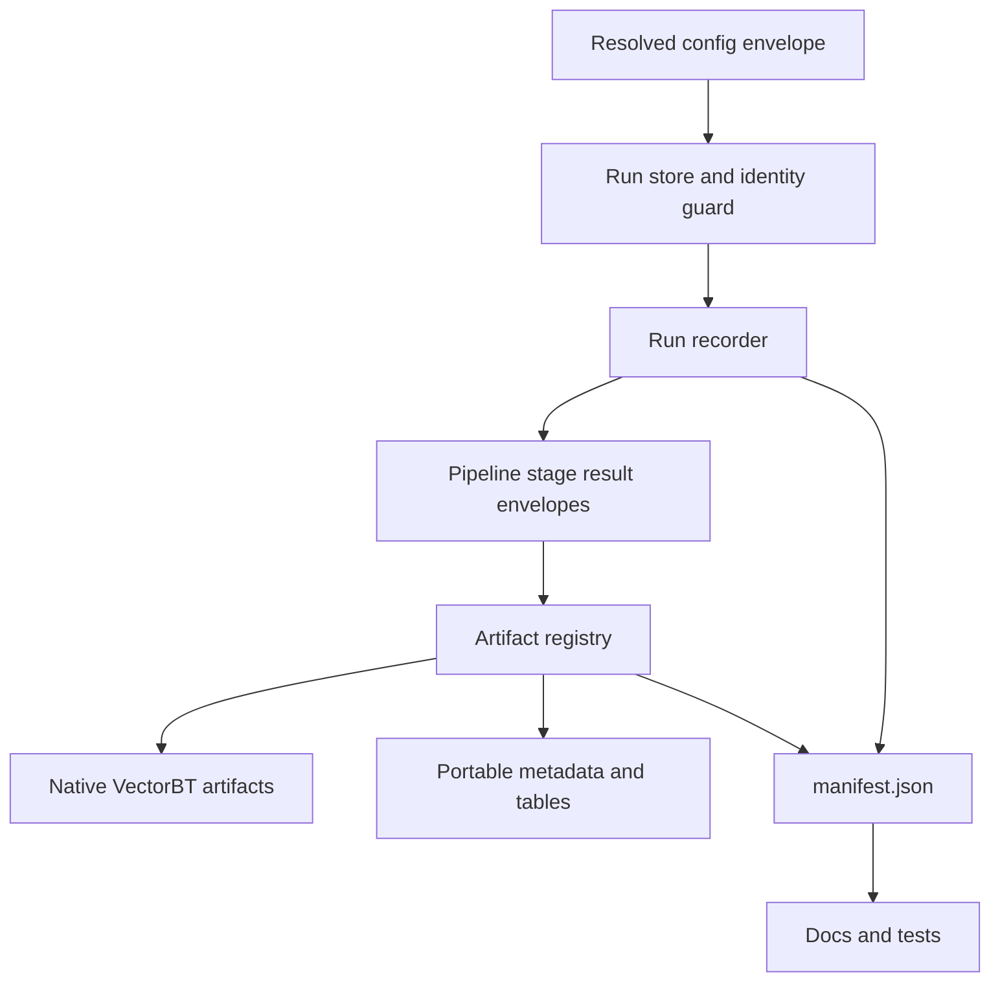
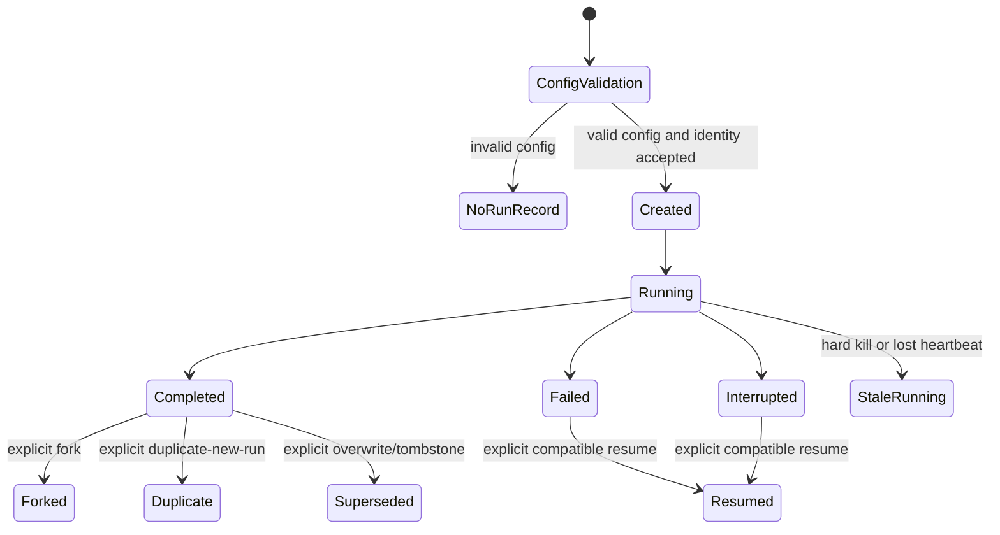
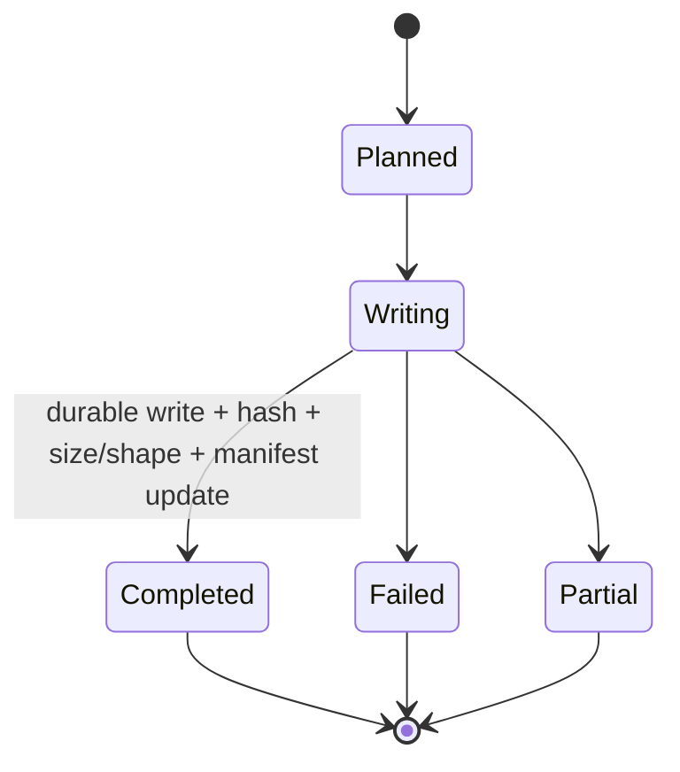
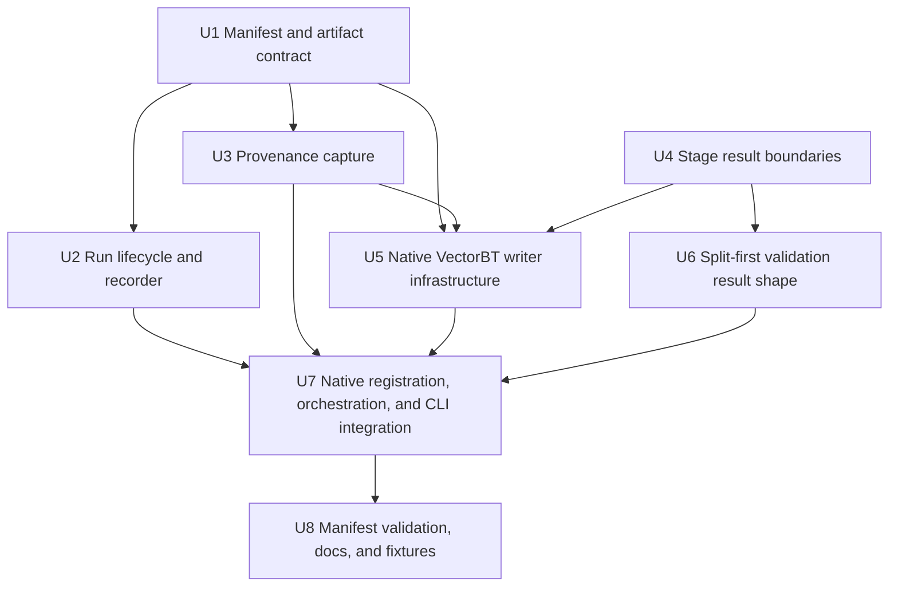

# feat: Add experiment provenance contract

## Summary

Add a local-first run recorder and artifact registry around the existing research pipeline, with `manifest.json` as the machine-readable source of truth. The implementation should keep `experiments.py` as thin orchestration, introduce a small provenance package rather than a god module, move shared market-data shape concerns to a data/schema boundary, persist material VectorBT state through secret-safe native saves plus portable metadata, and make validation splits the canonical artifact units that aggregate outputs summarize.

---

## Problem Frame

The current scaffold can run useful experiments, but its artifact contract is implicit: most stage evidence is held in memory, VectorBT objects are flattened early, the run directory is created late, and walk-forward validation exports the last trained model as if it represented the run. The origin requirements define this as a forward-first provenance contract problem while the project has no historical artifact compatibility burden (see origin: `docs/brainstorms/2026-05-16-experiment-provenance-contract-requirements.md`).

---

## Requirements

- R1. Every run produces a durable run manifest that records identity, lifecycle state, timestamps, config evidence, repository evidence, environment evidence, VectorBT settings evidence, seed policy, stage records, artifact inventory, and lineage.
- R2. Run identity separates human-readable labels, immutable physical run ids, and deterministic fingerprints for comparing effective inputs.
- R3. Fresh immutable runs are the default; collisions fail before expensive stages unless the runner supplies explicit rerun intent.
- R4. Non-default rerun modes are user/API-visible and recorded in the manifest, including duplicate-new-run, resume, fork, and overwrite semantics.
- R5. Manifest and artifact writes are atomic enough that partial files cannot be mistaken for completed evidence.
- R6. Each artifact has an id, role/type, producer stage, source config/upstream references, schema version, run-relative safe path, hash, size, shape/summary when applicable, status, public/private visibility, and lineage links.
- R7. Native VectorBT artifacts are required for material VectorBT state, and each native artifact is paired with portable metadata so validation does not require unpickling binaries.
- R8. Stage modules expose structured stage results and metadata; orchestration assembles provenance instead of inferring private stage internals.
- R9. Data, indicator, label, split, model, signal, portfolio, metrics, and report stages preserve compact portable provenance that is sufficient for downstream audit and comparison.
- R10. Holdout and rolling validation use the same split-child artifact shape; rolling validation produces one child artifact set per split.
- R11. Aggregate probabilities, signals, metrics, portfolios, and reports are derived artifacts that link to split child artifacts.
- R12. No top-level model artifact implies deployability for split validation; deployable models are a distinct explicit stage if added later.
- R13. Failed, interrupted, stale, and partial runs remain auditable with redacted diagnostics and partial artifact state.
- R14. Public manifests, metadata, diagnostics, config evidence, and provider errors must redact secret-sensitive keys and values.
- R15. Experiment orchestration no longer imports private helpers from label internals for primary OHLC selection.
- R16. Documentation and tests reflect the new manifest, artifact, rerun, failed-run, and split-first semantics.

**Origin actors:** A1 Experiment runner, A2 Automation agent or CI, A3 Run reviewer, A4 Future maintainer

**Origin flows:** F1 Start a new run, F2 Produce stage artifacts, F3 Complete/fail/rerun

**Origin acceptance examples:** AE1 manifest inventory, AE2 collision failure, AE3 environment/repo/settings evidence, AE4 native-plus-portable VectorBT artifacts, AE5 stage lineage, AE6 split-first validation, AE7 failed-run preservation, AE8 redaction, AE9 orchestration boundaries

---

## Scope Boundaries

- No hosted experiment-tracking product, dashboard, remote artifact store, or W&B/MLflow/DVC replacement.
- No backward compatibility shims for old run directories or old artifact semantics.
- No default cleanup of failed or partial run evidence; cleanup and retention are explicit future behavior.
- No mutable `latest` symlink or mutable pointer in this plan; self-contained manifests are the durable contract.
- No deployment-model registry semantics for validation models.
- No guarantee that native VectorBT artifacts load across incompatible Python or VectorBT versions; portable metadata and version evidence carry deterministic validation.
- No broad rewrite of model methodology, signal logic, portfolio execution model, or report gate definitions beyond provenance needs.
- No full raw environment capture or raw Git diff persistence in v1; allowlisted environment metadata and dirty/diff hashes are enough.

### Deferred to Follow-Up Work

- Append-only run index or discovery database: useful after the self-contained manifest contract is stable.
- Artifact garbage collection and retention policy: separate operation because failed-run evidence must not disappear by default.
- Remote artifact storage, registry integration, or hosted UI: out of scope for the local scaffold contract.
- Distinct final deployable-model training stage: future feature if research promotion needs a deployment artifact.
- Full reconstruction CLI that reloads native VectorBT artifacts and replays stages: manifest validation comes first.

---

## Context & Research

### Relevant Code and Patterns

- `research/aegis_research/experiments.py` is the current orchestration boundary. It resolves config, runs stages, creates a timestamped directory late, writes config/report/CSV/model artifacts, and imports `labels._primary_close`.
- `research/aegis_research/config.py` already provides `ResolvedExperimentConfig`, raw config hashing, redacted authored/resolved config views, `ConfigValidationError`, recursive passthrough validation, secret refs, and redaction helpers.
- `research/aegis_research/data.py` returns plain Pandas data for every source and calls `.get()` immediately for remote `vbt.Data` objects, which discards provider metadata unless captured first.
- `research/aegis_research/indicators.py` builds a scaffold-composed feature matrix using Pandas plus VectorBT MA/RSI outputs; the coherent stage artifact is the matrix plus parameter metadata, not one native VectorBT object.
- `research/aegis_research/labels.py` creates native VectorBT label generator results but returns only a binary Pandas Series; it also owns the private `_primary_close` helper currently used by orchestration.
- `research/aegis_research/splits.py` always returns a list of `ValidationSplit`, including a single holdout split, and uses `vbt.Splitter.from_n_rolling` for rolling splits.
- `research/aegis_research/validation.py` trains one model per split, builds per-split probabilities/signals/portfolios in memory, then returns only the last model plus aggregate outputs.
- `research/aegis_research/portfolios.py` returns native `vbt.Portfolio` objects, but the current run only persists derived metrics.
- `research/aegis_research/reports.py` writes JSON through a direct `Path.write_text`; this pattern should not be reused for load-bearing manifests without atomic write handling.
- `research/aegis_research/cli.py` exposes only `run CONFIG`; rerun mode needs an explicit CLI/API surface.
- Existing tests under `tests/research/aegis_research/` cover config contract, holdout runs, walk-forward runs, and labels, but not run manifest, artifact lineage, partial artifact state, or per-split artifact sets.

### Institutional Learnings

- `docs/solutions/architecture-patterns/config-contract-security-reproducibility-2026-05-16.md` establishes the adjacent schema-versioned config contract: validate before side effects, preserve authored/resolved config evidence, track raw config content identity with secret-safe public exposure, and keep secrets out of artifacts and tracebacks.
- `docs/brainstorms/2026-05-16-experiment-config-contract-requirements.md` and `docs/plans/2026-05-16-001-feat-experiment-config-contract-plan.md` are upstream-adjacent contract work. This provenance plan should consume their resolved-config boundary rather than duplicate config validation.
- `docs/vectorbt-scaffold.md` is the durable scaffold guide and currently documents aggregate rolling behavior and config artifacts; it must be updated because the public artifact contract changes.
- `README.md` frames Aegis RD as a reproducible-evidence system with audit trail coverage across data, features, labels, splits, models, signals, execution assumptions, costs, reports, and survival decisions. The manifest is the backbone for that product promise.

### VectorBT PRO Research

- `vbt.Data` preserves metadata that plain CSV/JSON does not: `fetch_kwargs`, `returned_kwargs`, `last_index`, `delisted`, timezone policy, missing-index policy, missing-column policy, wrapper information, symbols/features, and data dictionaries. Because provider kwargs can contain credentials or signed URLs, the manifest contract should persist only a source-specific safe projection of this metadata.
- VectorBT Data docs recommend pickling native `Data` objects when metadata matters; tabular exports save data but not associated metadata such as timeframe.
- VectorBT persistence docs state that `vbt.save`, `vbt.load`, and `Pickleable.save/load` can persist native objects, but files may overwrite existing paths and require approximately compatible Python/package/VectorBT versions to load later.
- VectorBT persistence docs recommend compression such as `blosc` for large binary artifacts and note that `settings.pickling` controls default format/compression behavior.
- `vbt.settings` contains run-relevant sections including `data`, `portfolio`, `returns`, `splitter`, `signals`, `numba`, `jitting`, `chunking`, `caching`, and `pickling`; settings can be saved as text configs, but pickled settings are discouraged for frequent upgrades.
- `vbt.set_seed` sets Python `random`, NumPy, and Numba seeds, so a central run seed policy should call it instead of only storing synthetic data seed.
- VectorBT splitters model rolling train/test windows explicitly and support `set_labels`; current holdout can use the same split-child artifact shape because `build_validation_splits` already returns a list.
- VectorBT label generators return native indicator objects for `FIXLB`, `TRENDLB`, and `PIVOTLB`, so label stage provenance should either persist those native results or clearly record why a stage did not produce a material native object.
- `vbt.Portfolio` is a native Pickleable object with rich derived stats and records; per-split train/test portfolios should be native artifacts with portable metadata summaries.

### External Best-Practice Research

- Local-first experiment tracking patterns separate immutable `run_id` from deterministic fingerprints used for comparison. Timestamps help sorting but should not be the sole identity.
- MLflow/W&B-style run states and artifact lineage support explicit completed/failed/killed/running states, config/environment capture, and artifact records with metadata.
- DVC/DataLad patterns reinforce declared inputs/outputs, content hashes, command/run provenance, and explicit rerun/reproduce semantics.
- Sacred-style runs preserve failure status, stacktrace/error information, heartbeat, and machine/package metadata for failed or interrupted experiments.
- BagIt/RO-Crate patterns support complete manifests with checksums, payload references, provenance actions, inputs, outputs, and action status.

---

## Key Technical Decisions

- Thin orchestration plus provenance package: keep `experiments.py` sequencing stages, but split provenance responsibilities across small modules for manifest records/validation, artifact registration, run lifecycle, and evidence capture.
- Single manifest source of truth: root `manifest.json` owns config evidence, stage records, artifact inventory, statuses, lineage, artifact visibility, and environment/repo/settings evidence. Stage sidecars are allowed only when metadata is bulky and must be referenced and hashed by the root manifest.
- Physical run id separate from fingerprints: create a fresh immutable physical run id/path per normal execution, and store deterministic raw/resolved config, code, environment, seed, and data fingerprints for comparison.
- No mutable latest pointer in v1: avoid symlinks or mutable run pointers until the self-contained manifest contract is stable.
- Explicit rerun state machine: default `new` creates an immutable run; duplicate, resume, fork, and overwrite require explicit mode and manifest lineage/state records. Overwrite creates a new physical run with supersession metadata rather than mutating a completed run in place.
- Transition methods are the only mutation path: run status changes go through the recorder, artifact status changes go through the artifact registry, and manifest records are serialized state rather than mutable objects that stage modules edit directly.
- Atomic artifact discipline: register planned/writing intent before durable writes, write temp files in the target directory when a single file can be atomically replaced, flush/fsync the temp file, use `os.replace`, fsync the parent directory, and mark completed only after hash/size/shape/metadata checks and the manifest update succeed. Directory-style native saves require a staging directory, completion marker, and hash inventory before promotion.
- Orphan-safe validation: only manifest-listed completed artifacts with matching hash and size are valid evidence; temp files, staged-but-unregistered files, final-path files missing from the manifest, manifest entries pointing to missing files, and mismatched files are ignored or reported as orphan/partial evidence.
- Native VectorBT whitelist in v1: persist remote `vbt.Data` objects, rolling `vbt.Splitter` evidence, native label generator results, and per-split train/test `vbt.Portfolio` objects when the producing stage exposes them through a stage envelope. Persist synthetic/CSV data as portable artifacts unless implementation naturally wraps them in a native `vbt.Data` object without adding complexity.
- Native artifacts are private/local-first by default: before saving remote/native objects, sanitize or verify that resolved credentials, provider clients, auth headers/cookies, signed URLs, query tokens, account ids, and high-risk provider fields are absent from known serializable state; if this cannot be proven, fail the required native artifact write with a redacted diagnostic rather than producing secret-bearing evidence.
- Portable metadata always accompanies native artifacts: class/type identity, role, schema version, producer stage, upstream ids, shape/summary, package versions, and compatibility expectations are enough for manifest validation without native loading.
- Stage result envelopes are domain-level only: each stage returns data plus portable metadata, warnings, native objects when material, and semantic input/output identities. Stages do not allocate artifact ids, know file paths, receive registry ids from the recorder, or depend on recorder lifecycle code.
- Validation owns split semantics, recorder owns persistence: `validation.py` should return per-split results and aggregate candidates; it should not write files directly.
- Holdout is one split: holdout and rolling validation share the same child artifact schema to avoid branching automation logic.
- Aggregate OOS outputs are test-only by default: per-split artifacts may include train and test rows with explicit set identity, while aggregate OOS artifacts summarize test rows unless named otherwise.
- Central seed policy: add a run-level seed policy and call VectorBT's seed helper at run start; record current seed sources, including model random state and synthetic data seed, so deterministic behavior is visible.
- Settings evidence is a snapshot, not a dependency on reload: record selected `vbt.settings` sections and overrides as portable metadata instead of relying on pickled settings as the reproducibility contract.
- Redaction is fail-closed and allowlist-first: never persist raw `os.environ`, raw provider kwargs, raw traceback locals, raw exception args, raw object reprs, raw Git diffs, unredacted remotes, or absolute/local user paths; if redaction/canonicalization fails, omit the value and record typed unavailable evidence.
- Config identities are secret-aware: use redacted canonical authored/resolved config hashes for public comparison. If a raw config byte hash is retained to support local reproducibility checks, classify it as private/local-only or record that raw bytes existed without exposing a public secret fingerprint when literal secrets may be present.
- Primary OHLC selection belongs in a market-data schema boundary: move `_primary_close`-style selection out of `labels.py` and add a small `data_schema.py` boundary for primary series selection, OHLC availability, index identity, and shape checks.
- Run result envelope: Python and CLI callers receive stable run status evidence including run id, run directory, manifest path, lifecycle status, timestamps, and optional report artifact reference; success is not inferred from report existence.

---

## Issue Question Resolutions

| Issue question cluster | Planning resolution |
|---|---|
| Orchestration boundaries | Keep `experiments.py` thin; introduce a provenance recorder/context for lifecycle and artifact registration; move primary OHLC selection to data/schema; have stages return structured results; fail fast while recording failed-stage diagnostics once a run exists. |
| Run identity and reruns | Use immutable physical run ids for directories and deterministic fingerprints for comparison; default to new immutable runs; fail on collisions; make duplicate, resume, fork, and overwrite explicit and recorded. |
| Latest symlinks or index | Do not add `latest` symlinks or mutable pointers in v1; defer a run index/discovery layer until manifest semantics are stable. |
| Incomplete runs | Preserve failed/interrupted/partial evidence with status, stage state, diagnostics, and artifact status. Invalid configs still fail before run creation. |
| Manifest shape | Use one root manifest as source of truth; artifact sidecars are referenced and hashed, not independent sources of truth. |
| Artifact schema | Version every structured artifact and include id, role, producer stage, upstream ids, source config section, hash, size, shape/summary, path, and status. |
| CSV schemas | Treat CSV outputs as structured artifacts with explicit schema versions and column contracts, not loose inspection files. |
| Config artifacts | Preserve redacted authored and resolved config evidence and record public redacted authored/resolved identities in the root manifest; any raw content identity is private/local-only or unavailable when literal secrets may be present. |
| Data metadata | Capture a safe VectorBT `Data` metadata projection before `.get()` flattens it, including allowlisted returned/fetch metadata summaries, ranges, symbol coverage, timezone/missing policies, wrapper evidence, and availability gaps. Never persist auth headers, cookies, signed URLs, raw request params, provider clients, or unredacted provider kwargs. |
| Native VectorBT persistence | Required for material native objects, but never the sole deterministic evidence; pair with portable metadata and version compatibility fields. |
| Native artifact secret safety | Persist sanitized/verified native artifacts only; native binaries are private/local-first and cannot be treated as public evidence if they may embed credentials. |
| Portfolio persistence | Persist train/test portfolios per split as native VectorBT artifacts plus metrics/summary metadata. |
| Indicator and label metadata | Preserve parameter metadata and stage input hashes; persist native label generator outputs in v1 because the current stage creates native VectorBT label indicators. Indicator matrix remains the stage artifact unless implementation exposes coherent native indicator results without extra complexity. |
| Split artifacts | Preserve exact membership or membership artifacts plus counts, bounds, labels, embargo/purge assumptions, and source index hashes. |
| Environment and settings | Record Python/platform/package versions, VectorBT PRO version, selected `vbt.settings` sections, repository evidence, seed policy, and redacted environment evidence. |
| Dirty Git state | Dirty repositories are allowed but recorded; CI or later policy can reject dirty runs. |
| Raw Git diffs and environment | Store dirty status, changed-file evidence, diff hash, and allowlisted environment metadata by default; raw diffs and full environment snapshots are excluded or explicit future private diagnostics. |
| Walk-forward semantics | Every split is a child artifact set; aggregate outputs link to child artifacts; no generic top-level model for multi-split validation. |
| Failure handling | Fail fast on contract violations, but after manifest initialization convert the terminal run state to failed/interrupted with redacted diagnostics and partial artifact inventory. |

---

## Open Questions

### Resolved During Planning

- What manifest schema shape should implement the contract? Resolve with a root `manifest.json` source of truth plus referenced sidecars for bulky metadata, all schema-versioned and hash-verified.
- What artifact id format should be used? Resolve with stable per-run ids derived from stage, role, split/set when applicable, and sequence/disambiguator; exact string formatting can be chosen during implementation as long as ids are unique and deterministic within a run.
- What hash algorithm should be used? Resolve with SHA-256 for public redacted config identities, optional private raw config content identity, artifact content, metadata sidecars, and canonical portable records.
- What run identity fields should exist? Resolve with physical run id/path, human run label, parent/run lineage ids, public redacted authored/resolved config hashes, optional private raw config content identity, run fingerprint, data fingerprint, code fingerprint, environment fingerprint, and seed policy.
- Which VectorBT settings and package versions must be captured? Resolve with VectorBT PRO version plus selected settings sections: data, portfolio, returns, splitter, signals, numba, jitting, chunking, caching, and pickling; also capture Python, platform, pandas, NumPy, scikit-learn, Numba, joblib, and project package identity.
- Which current objects require native VectorBT persistence? Resolve with remote Data objects, rolling Splitter evidence, native label generator outputs, and per-split train/test Portfolios; synthetic/CSV data and indicator matrices are portable artifacts unless implementation exposes native objects naturally.
- How should native VectorBT artifacts avoid secret leakage? Resolve with sanitizer/verification before native save, private/local artifact classification, known-secret byte/metadata tests, and fail-closed behavior when provider state cannot be made safe.
- How should compact metadata avoid manifest bloat? Resolve with sidecar artifacts for large exact memberships or table schemas; root manifest stores counts, bounds, hashes, shape summaries, and sidecar references.
- What diagnostics should failed manifests store? Resolve with stage id, error type, redacted bounded message, redacted bounded traceback summary when useful, skipped stages, partial artifacts, and terminal status/timestamp.
- What stage-result boundary should be introduced? Resolve with typed stage result envelopes owned by stage modules; orchestration passes them to the recorder and does not inspect private helper internals.
- Should validation own per-split outputs? Resolve yes for computation/semantics; artifact persistence remains with the recorder/artifact registry.
- Should manifest collect typed failed-stage diagnostics or fail fast? Resolve both: fail fast in execution, catch at run boundary to persist typed redacted diagnostics once a manifest exists.
- Should `config_manifest.json` remain source of truth? Resolve no; root manifest becomes source of truth and config evidence files become manifest artifacts. Any retained config sidecar is generated evidence, not a parallel authority.

### Deferred to Implementation

- Exact module and class names for the recorder, manifest, artifact registry, and stage result envelopes: choose the clearest names while keeping modules small.
- Exact directory layout under each run directory: choose the smallest structure that keeps root manifest, config evidence, stage artifacts, split artifacts, native artifacts, and metadata sidecars discoverable.
- Exact CLI option names for rerun modes: expose explicit modes without relying on environment variables or silent defaults.
- Exact canonical JSON serialization helper: implement the minimal stable serializer needed for SHA-256 fingerprints and manifest validation.
- Exact bounded traceback length: choose during implementation while keeping diagnostics useful and secret-safe.
- Exact native artifact compression choice: prefer VectorBT-supported compression such as `blosc` when available, but keep manifest metadata accurate if the environment lacks a compressor.
- Exact safe provider-metadata allowlist for each remote source: choose the smallest source-specific fields that preserve reproducibility without persisting auth headers, signed URLs, cookies, or raw request params.

---

## High-Level Technical Design

> *This illustrates the intended approach and is directional guidance for review, not implementation specification. The implementing agent should treat it as context, not code to reproduce.*

### Component Flow

### Run State Model

Invalid configs intentionally produce no run manifest because the config contract remains the pre-side-effect gate. After a run record is created, every failure path should leave durable status evidence unless the manifest writer itself cannot initialize.

This is a contract model, not a requirement for a state-machine library. Implementation should use small recorder transition methods such as `mark_run_completed`, `mark_run_failed`, and `mark_run_interrupted` so direct status mutation is not scattered across orchestration or stage modules.

### Artifact Lifecycle

Completed artifacts are the only artifacts downstream automation may treat as valid evidence. Partial or failed artifacts may remain on disk, but the manifest must make their status unambiguous.

Artifact status changes should similarly happen only through registry/writer methods such as `plan_artifact`, `begin_artifact_write`, `complete_artifact`, `fail_artifact`, and `mark_artifact_partial`. Stage modules return domain results; they do not set artifact statuses, paths, hashes, or lineage records.

---

## Implementation Units

**Prerequisite:** The schema-versioned config contract in `docs/plans/2026-05-16-001-feat-experiment-config-contract-plan.md` must land first or be implemented as a prerequisite U0. This plan consumes `ResolvedExperimentConfig`, config redaction, secret-ref resolution, and pre-side-effect config validation; it must not duplicate that contract.

### U1. Manifest And Artifact Contract

**Goal:** Define the versioned run manifest and artifact inventory contract that all later units write against.

**Requirements:** R1, R2, R5, R6, R7, R13; F1, F2, F3; AE1, AE4, AE5, AE7

**Dependencies:** None

**Files:**
- Create: `research/aegis_research/provenance/__init__.py`
- Create: `research/aegis_research/provenance/manifest.py`
- Create: `research/aegis_research/provenance/artifacts.py`
- Modify: `research/aegis_research/reports.py`
- Test: `tests/research/aegis_research/test_provenance_manifest.py`

**Approach:**
- Introduce a small provenance package, not one central module: `manifest` owns versioned manifest/stage/artifact record types and validation, while `artifacts` owns artifact registration primitives, hashing, atomic file discipline, path safety, and status transitions.
- Make `manifest.json` the source of truth and treat config files, CSVs, model files, native VectorBT files, metadata sidecars, and reports as artifacts registered in the manifest.
- Use SHA-256 consistently for file contents and canonical portable metadata records.
- Add atomic JSON write behavior for load-bearing manifest and metadata files rather than reusing direct `write_text` for recorder state: temp file in the same directory, flush/fsync, atomic replace, parent-directory fsync, and restrictive file permissions.
- Enforce artifact path invariants in the manifest layer: paths are relative to the run root, normalized, non-absolute, free of `..`, and cannot collide with another artifact path in the same run.
- Include artifact visibility/shareability so public manifest/metadata artifacts are distinguishable from private local-only native binaries.
- Keep field naming and serialization project-owned and dependency-light; do not add a schema library unless implementation clarity suffers without it.

**Execution note:** Start with manifest contract tests so later units can rely on completed/partial artifact semantics.

**Patterns to follow:**
- `ConfigValidationIssue` and `ConfigValidationError` in `research/aegis_research/config.py` for small typed contract objects.
- `to_builtin` in `research/aegis_research/config.py` for JSON-safe values, with stricter canonicalization where hashes require stability.

**Test scenarios:**
- Happy path: a manifest record serializes with schema version, run id, status, timestamps, config references, stage list, and artifact inventory.
- Happy path: completed artifact records include id, role/type, producer stage, path, hash algorithm, hash, size, schema version, status, and upstream artifact ids.
- Error path: an artifact cannot transition to completed without a hash, path/reference, producer stage, and status.
- Error path: manifest validation rejects duplicate artifact ids within one run.
- Error path: manifest validation rejects absolute artifact paths, `..` path traversal, and duplicate normalized artifact paths.
- Error path: write failure during manifest or metadata atomic replace leaves the previous manifest valid and does not accept partial temp output.
- Error path: artifact status cannot become completed until atomic promotion, hash/size registration, metadata sidecar registration when required, and manifest persistence succeed.
- Edge case: large membership metadata is represented by a sidecar reference with hash/count/bounds summary rather than embedded payload.
- Integration: manifest validation can inspect a manifest without importing joblib or loading any VectorBT pickle.

**Verification:**
- The provenance package can create, serialize, and validate a minimal manifest and artifact inventory independently of `run_experiment`.
- No completed artifact can be represented without content identity and schema/status metadata.

### U2. Run Lifecycle, Identity, And Rerun Modes

**Goal:** Create durable run records before expensive stages, enforce collision/rerun policy, and preserve lifecycle state through completed, failed, interrupted, and stale-running outcomes.

**Requirements:** R1, R2, R3, R4, R5, R13; F1, F3; AE2, AE7

**Dependencies:** U1 + resolved config contract

**Files:**
- Create: `research/aegis_research/provenance/recorder.py`
- Create: `research/aegis_research/provenance/run_store.py`
- Modify: `research/aegis_research/experiments.py`
- Modify: `research/aegis_research/cli.py`
- Test: `tests/research/aegis_research/test_run_lifecycle.py`
- Test: `tests/research/aegis_research/test_experiments_holdout.py`

**Approach:**
- Allocate physical run id/path after config validation and collision/rerun checks, before data fetch, model training, portfolio simulation, or public artifact writes.
- Store deterministic fingerprints for comparison rather than using deterministic fingerprints as the sole directory identity.
- Add explicit rerun modes to the Python run entry point and CLI surface. Default mode creates a new immutable record and fails on path collision.
- Model duplicate-new-run and fork as new physical run records with lineage. Model resume as compatible continuation of failed/interrupted/stale-running records only when fingerprints match and all previously completed artifacts still match their recorded hash/size/schema. Model overwrite as a new physical run with `supersedes_run_id` metadata rather than silent or destructive mutation of completed evidence.
- Keep run status mutation behind recorder transition methods. `experiments.py` may ask the recorder to start, complete, fail, interrupt, resume, fork, duplicate, or supersede a run, but must not edit manifest status fields directly.
- Add heartbeat/lock metadata sufficient to detect stale `running` manifests after hard process death without mutating them by default.
- Treat initial manifest creation failure as a hard pre-stage failure: no data fetch or model work may begin if the initial run record cannot be created.
- Create run directories with restrictive local-first permissions, e.g. directory `0700` and manifest/metadata files `0600` unless an explicit future configuration loosens this.
- On resume, quarantine or replace only partial/writing artifacts under explicit resume rules; mismatched completed artifacts fail hard rather than being overwritten.

**Execution note:** Characterize current late directory creation behavior before changing it so tests prove side effects move earlier only after config validation and collision checks.

**Patterns to follow:**
- Current `experiments._make_run_dir` path-safety behavior and `exist_ok=False` collision failure, but move it before expensive stages.
- Config contract tests that assert invalid configs do not create run directories.

**Test scenarios:**
- Covers AE2. Error path: invalid config creates no run directory and no manifest.
- Covers AE2. Error path: existing output path with no rerun mode fails before data loading.
- Happy path: fresh run creates a manifest in `running` state before the data stage and marks it `completed` on success.
- Error path: initial manifest write failure prevents data fetch/model training.
- Error path: resume rejects completed runs.
- Error path: resume rejects failed/interrupted runs when resolved config fingerprint differs.
- Error path: resume rejects a compatible run when any completed artifact hash, size, or schema no longer matches the manifest.
- Happy path: resume of a failed/interrupted/stale run with matching fingerprints and valid completed artifacts records the resume transition, preserves prior completed artifact state, and continues without mutating completed evidence incorrectly.
- Happy path: duplicate-new-run with the same config creates a new physical run id and records duplicate intent.
- Happy path: fork records parent run id and creates a new immutable child run.
- Happy path: explicit overwrite creates a new physical run, records `supersedes_run_id`, and leaves prior completed evidence immutable.
- Edge case: handled `KeyboardInterrupt` or SIGTERM records `interrupted` when the handler can run.
- Edge case: stale `running` manifest can be classified by heartbeat/lock metadata without rewriting the original manifest.

**Verification:**
- Run identity and rerun mode are visible in both CLI and Python usage.
- No expensive stage executes before manifest initialization succeeds for valid configs.
- Existing collision behavior becomes earlier and more explicit rather than disappearing.

### U3. Config, Environment, Repository, Settings, And Seed Evidence

**Goal:** Capture reproducibility evidence at run start and store it as redacted, portable manifest evidence and artifacts.

**Requirements:** R1, R2, R7, R13, R14; F1; AE1, AE3, AE8

**Dependencies:** U1, U2

**Files:**
- Create: `research/aegis_research/provenance/evidence.py`
- Modify: `research/aegis_research/config.py`
- Modify: `research/aegis_research/experiments.py`
- Test: `tests/research/aegis_research/test_provenance_manifest.py`
- Test: `tests/research/aegis_research/test_config_contract.py`

**Approach:**
- Register redacted authored and resolved config files as artifacts in the root manifest, and include public redacted authored/resolved config identities in the manifest.
- Add a resolved config hash alongside the existing authored config identity so authoring changes and effective default-applied changes are distinguishable. If retaining a raw byte hash, classify it private/local-only or mark it unavailable when literal secrets may be present.
- Capture Git commit, sanitized branch, dirty status, sanitized remote identity, changed-file list, and diff hash when available. Do not persist raw diffs by default; full redacted diffs are explicit future private diagnostics if ever needed. Outside a Git checkout, record `unavailable` evidence rather than failing.
- Capture Python, platform, project package identity, VectorBT PRO, pandas, NumPy, scikit-learn, Numba, joblib, PyYAML, and other material package versions that are available.
- Capture selected `vbt.settings` sections as portable metadata: data, portfolio, returns, splitter, signals, numba, jitting, chunking, caching, and pickling.
- Add a central run seed policy. Use VectorBT's seed helper at run start and record data seed, run seed, model seed/random-state behavior, and any stage-specific seeds.
- Never capture raw `os.environ`. Persist only an allowlist of non-secret environment metadata and fingerprints needed for comparison; env var names/values outside the allowlist are omitted, not captured-then-redacted.
- Persist provider metadata through a source-specific allowlist plus recursive redaction and URL sanitization. Never persist auth headers, cookies, signed URLs, raw request params, provider client reprs, or raw `fetch_kwargs`/`returned_kwargs` structures.
- Ensure every persisted diagnostic, config view, provider message, Git remote, path, and evidence value passes through existing redaction functions or equivalent provenance redaction; if canonicalization/redaction fails, record typed unavailable evidence rather than a best-effort raw value.

**Execution note:** Add redaction tests before broad environment capture so implementation never writes secrets and then patches them out later.

**Patterns to follow:**
- `redact_config`, `redact_text`, and secret-ref tests in `research/aegis_research/config.py` and `tests/research/aegis_research/test_config_contract.py`.
- `docs/solutions/architecture-patterns/config-contract-security-reproducibility-2026-05-16.md` for authored/resolved config evidence semantics.

**Test scenarios:**
- Covers AE1. Happy path: manifest records public redacted authored/resolved config hashes, schema version, and redacted config artifact ids; any raw byte identity is private/local-only or unavailable when literal secrets may be present.
- Covers AE3. Happy path: manifest records package versions including VectorBT PRO, pandas, NumPy, scikit-learn, Numba, joblib, and Python/platform evidence.
- Covers AE3. Happy path: manifest records Git commit/sanitized branch/dirty/sanitized remote when run inside Git.
- Covers AE3. Edge case: non-Git execution records repository evidence as unavailable and does not fail the run.
- Covers AE3. Happy path: manifest records selected VectorBT settings sections and pickling compression/format settings.
- Covers AE8. Error path: provider token from config or environment does not appear in manifest, artifact metadata, config artifacts, or failed diagnostics.
- Covers AE8. Error path: raw `os.environ` is never serialized; only allowlisted safe keys/metadata appear in evidence.
- Covers AE8. Error path: dirty Git diff contents containing a secret are not persisted, while dirty status, changed files, and diff hash are preserved.
- Covers AE8. Error path: Git remote credentials/query params, home-directory usernames, URL query secrets, Authorization headers, exception messages, exception reprs, provider kwargs, and environment values are redacted or omitted.
- Covers AE8. Error path: redaction/canonicalization failure records typed unavailable evidence and does not persist the unsafe value.
- Happy path: run directory and manifest/metadata files are created with restrictive local permissions.
- Happy path: run start applies the central seed policy and records the effective seed sources.
- Edge case: package version lookup failure records unavailable package evidence without failing the run.

**Verification:**
- A completed run can be compared to another run on config, code, environment, settings, data, and seed evidence without loading native artifacts.
- Secret-like values are absent from all public run evidence.

### U4. Stage Result Boundaries And Market Data Schema

**Goal:** Make each pipeline stage return structured data and provenance metadata, and move shared market-data shape concerns out of label internals.

**Requirements:** R8, R9, R15; F2; AE5, AE9

**Dependencies:** U1

**Files:**
- Create: `research/aegis_research/data_schema.py`
- Modify: `research/aegis_research/data.py`
- Modify: `research/aegis_research/indicators.py`
- Modify: `research/aegis_research/labels.py`
- Modify: `research/aegis_research/splits.py`
- Modify: `research/aegis_research/models.py`
- Modify: `research/aegis_research/signals.py`
- Modify: `research/aegis_research/portfolios.py`
- Modify: `research/aegis_research/validation.py`
- Test: `tests/research/aegis_research/test_stage_provenance.py`
- Test: `tests/research/aegis_research/test_labels.py`

**Approach:**
- Introduce small stage result envelopes close to the stages they describe. Each result carries output data, compact metadata, warnings when needed, native VectorBT objects when material, and semantic input/output identities. It must not carry artifact ids, file paths, or recorder lifecycle state.
- Make `data.py` return market data plus source metadata before remote `vbt.Data` objects are flattened with `.get()`.
- Move primary series selection, OHLC availability checks, index identity, and shape checks to `data_schema.py` so `experiments.py` no longer imports `labels._primary_close` and provider IO stays in `data.py`.
- Preserve indicator metadata for windows, input data identity, output columns, row/column shape, missing handling, and parameter meaning.
- Preserve label metadata for native label kind, input OHLC requirements, label mode, target conversion, positive value, output shape, and missing-label handling.
- Preserve split metadata for label, set names, counts, exact membership sidecar or membership hash, bounds, embargo/purge assumptions, and source index identity.
- Preserve model, signal, portfolio, and validation metadata through envelopes as well: model class/parameters and training shape, signal thresholds and boolean output shape, portfolio execution assumptions and native object identity, and validation split/aggregate semantics.
- Keep stage functions focused on computation and metadata; the recorder remains responsible for file paths, artifact ids, hashes, and manifest updates.

**Execution note:** Add characterization tests for current labels and split behavior before refactoring return shapes.

**Patterns to follow:**
- Existing `ValidationSplit` dataclass in `research/aegis_research/splits.py` as the simplest current stage-result pattern.
- Existing OHLC helpers in `research/aegis_research/data.py` as behavior to move behind the new `data_schema.py` market-data boundary, leaving provider loading/fetching in `data.py`.

**Test scenarios:**
- Covers AE9. Integration: `experiments.py` no longer imports a private helper from `labels.py` for primary close/high/low selection.
- Covers AE5. Happy path: data stage result includes portable source metadata and table shape.
- Covers AE5. Happy path: remote data stage captures provider metadata before flattening to Pandas.
- Covers AE5. Edge case: unavailable provider metadata is explicitly marked unavailable rather than silently omitted.
- Covers AE5. Happy path: indicator stage metadata records configured windows and output column meanings.
- Covers AE5. Happy path: label stage metadata records VectorBT label kind, input requirements, mode, and derived binary target conversion.
- Covers AE5. Error path: missing required OHLC input is reported as a data/schema stage failure, not a private label helper failure.
- Covers AE5. Happy path: split stage metadata records membership/bounds and embargo assumptions for holdout and rolling splits.
- Covers AE5. Happy path: model, signal, portfolio, and validation result envelopes expose portable metadata, semantic upstream identities, warnings/errors when present, and no private-internal inspection requirements.
- Covers AE9. Architecture: stage modules do not import recorder/run lifecycle modules; provenance infrastructure may import dependency-light shared envelope protocols/types only.

**Verification:**
- Stage boundaries are explicit enough for the recorder to build manifest records without inspecting private helpers or reconstructing stage internals.
- Existing label and split semantics remain unchanged except for earlier, clearer metadata and errors.
- Dependency direction stays one-way: stage modules describe domain outputs, while recorder/artifact modules assign ids, paths, statuses, and lineage.

### U5. Native VectorBT Writer Infrastructure And Portable Metadata

**Goal:** Provide secret-safe native VectorBT write infrastructure and portable metadata primitives; required native artifact production is wired when each producing stage exposes a native object through its stage envelope.

**Requirements:** R6, R7, R9, R13; F2; AE4, AE5, AE8

**Dependencies:** U1, U3, U4

**Files:**
- Create: `research/aegis_research/provenance/native.py`
- Modify: `research/aegis_research/provenance/artifacts.py`
- Modify: `research/aegis_research/data.py`
- Modify: `research/aegis_research/labels.py`
- Modify: `research/aegis_research/splits.py`
- Modify: `research/aegis_research/portfolios.py`
- Test: `tests/research/aegis_research/test_vectorbt_artifacts.py`

**Approach:**
- Split the work into U5a writer infrastructure and U5b registration wiring. U5a provides collision guards, temp-file/temp-directory staging, completion markers for directory saves, portable metadata sidecars, hash inventories, restrictive permissions, and manifest registration. U5b happens through U7 once U6 exposes per-split native portfolios and each stage envelope exposes its material native objects.
- Register `planned`/`writing` artifact intent before starting any durable native save. A final artifact path is marked `completed` only after staging promotion, hash/size or hash-inventory capture, metadata sidecar registration, manifest persistence, and parent-directory fsync succeed.
- Keep artifact status mutation behind artifact registry/writer transition methods. Callers may request artifact planning/writing/completion/failure, but must not edit artifact records directly.
- Do not rely on VectorBT's default overwrite behavior; the run recorder decides whether a path may be written.
- Persist required native artifacts in v1 when the producing stage exposes the native object through its envelope: remote `vbt.Data` objects that pass secret-safety checks, rolling splitter evidence, native label generator results, and per-split train/test `vbt.Portfolio` objects.
- Pair every native artifact with a portable metadata sidecar recording object role, class/type identity, producer stage, upstream artifact ids, package versions, VectorBT version, pickling settings, compression, shape/summary, and compatible-version warning.
- For synthetic/CSV data and scaffold-composed indicator matrices, write portable data/metadata artifacts unless implementation can expose native objects without making the pipeline more complex.
- Treat native persistence failure for a required native artifact as a run failure. A binary file without registered portable metadata is not a completed artifact; a final-path file produced after manifest update failure is orphaned/unregistered evidence, not completed evidence.
- Before saving remote/native objects, inspect and sanitize known serializable state or reject the save. Known provider tokens, headers, cookies, signed URLs, account ids, and client state must be absent from native metadata and known serializable fields before bytes are written.

**Execution note:** Implement native artifact metadata tests with small synthetic runs first; avoid remote-provider dependencies in unit tests.

**Patterns to follow:**
- VectorBT docs for `Pickleable.save/load`, `vbt.save/load`, `Data.save/load`, and `Portfolio.save/load`.
- Existing model export boundary in `research/aegis_research/models.py`, but with manifest registration and no misleading top-level model semantics.

**Test scenarios:**
- Covers AE4. Happy path: a portfolio artifact persists native VectorBT state and a portable metadata sidecar.
- Covers AE4. Happy path: manifest validation succeeds without loading the native VectorBT binary.
- Covers AE4. Error path: native persistence failure for a required VectorBT object marks the artifact failed and the run failed.
- Covers AE4. Error path: native artifact write succeeds but metadata/hash registration fails; artifact is not marked completed.
- Covers AE4. Happy path: native label generator output persistence produces a native artifact plus paired portable metadata and validates without loading the binary.
- Covers AE4. Happy path: rolling `vbt.Splitter` evidence persistence produces a native artifact or exact portable equivalent plus paired metadata and validates without loading the binary.
- Happy path: remote `vbt.Data` metadata includes safe allowlisted provider metadata summaries, last index/range evidence, timezone policy, missing policy, and symbol coverage when available, without raw provider kwargs.
- Edge case: native artifact path collision inside a run fails through the artifact registry instead of allowing VectorBT overwrite behavior.
- Covers AE8. Error path: native artifact metadata and diagnostics do not persist provider credentials or secret-like values.
- Covers AE8. Error path: a known provider token does not appear in native artifact bytes or known serializable provider fields before save; if this cannot be proven, the artifact write fails closed.
- Error path: interrupted native save leaves only staging output or an unregistered orphan, and manifest validation does not treat it as completed evidence.

**Verification:**
- Native artifacts are useful for same-environment recomputation, but automation can still audit completeness and lineage from manifest plus portable metadata.
- VectorBT version sensitivity is explicit in artifact metadata.

### U6. Split-First Validation Result Shape

**Goal:** Replace last-model/aggregate-only validation semantics with first-class split result envelopes for holdout and rolling validation; artifact registration is performed by the recorder after U5 writer infrastructure is available.

**Requirements:** R6, R10, R11, R12; F2; AE5, AE6

**Dependencies:** U1, U4

**Files:**
- Modify: `research/aegis_research/validation.py`
- Modify: `research/aegis_research/models.py`
- Modify: `research/aegis_research/signals.py`
- Modify: `research/aegis_research/portfolios.py`
- Modify: `research/aegis_research/reports.py`
- Modify: `research/aegis_research/experiments.py`
- Test: `tests/research/aegis_research/test_validation_artifacts.py`
- Test: `tests/research/aegis_research/test_experiments_walkforward.py`
- Test: `tests/research/aegis_research/test_experiments_holdout.py`

**Approach:**
- Change validation results to expose a list of split results. Each split result carries model, train/test probabilities, train/test signals, train/test portfolios, metrics, split metadata, and semantic input/output identities.
- Treat holdout as a one-split validation result using the same child artifact shape as rolling validation.
- Expose per-split model outputs under split-specific semantic identities. Remove or rename the generic top-level model result so it cannot imply deployment readiness.
- Expose per-split probabilities and signals with explicit split id, set identity, index bounds, and model semantic identity. Aggregate OOS probabilities/signals are derived test-only outputs by default.
- Expose train/test portfolio native objects and metrics for each split. Aggregate metrics and survival report candidates link back to split metrics and portfolio semantic identities.
- If a later split fails, expose completed earlier split results and a failed current split result so the recorder can preserve completed artifacts, mark the current split failed, skip aggregate/report completion, and mark the run failed.

**Execution note:** Add tests that fail under the current `last_model` behavior before changing validation return shapes.

**Patterns to follow:**
- Current `evaluate_validation_splits` loop in `research/aegis_research/validation.py`, but return split-level evidence instead of only aggregate outputs.
- Current `split_metrics.csv` aggregation behavior for metric names, with lineage added.

**Test scenarios:**
- Covers AE6. Happy path: rolling validation with five splits exposes five split model outputs and no generic canonical top-level model result.
- Covers AE6. Happy path: holdout validation exposes one split child result with the same shape as rolling.
- Covers AE6. Happy path: each per-split probability result records split id, set identity, index range, and model semantic identity.
- Covers AE6. Happy path: aggregate OOS probabilities and signals link only to split test result identities by default.
- Covers AE6. Happy path: survival report candidates link to aggregate metrics, which link to per-split train/test metrics and portfolio semantic identities.
- Covers AE6. Happy path: every split child result has the complete required shape: model, train/test probabilities, train/test signals, train/test native portfolio objects, train/test metrics, metadata, and lineage-ready semantic identities.
- Error path: failure on split 3 preserves split 1 and 2 completed split results, marks split 3 failed, and exposes enough state for the recorder to skip aggregates/report and mark the run failed.
- Error path: validation result cannot claim aggregate/report readiness when any required split child result is partial or failed.
- Edge case: split with no usable samples after embargo fails with split-stage diagnostics and does not produce misleading aggregate outputs.

**Verification:**
- Walk-forward validation is auditable from split artifacts upward.
- No artifact implies a validation model is deployable unless a future explicit deployable-model stage writes it.

### U7. Native Registration, Orchestration, And CLI Integration

**Goal:** Thread the recorder, stage result envelopes, native artifact registration, artifact registry, rerun modes, and failure handling through the public experiment entry points.

**Requirements:** R1, R3, R4, R5, R8, R13, R14, R15; F1, F2, F3; AE1, AE2, AE7, AE8, AE9

**Dependencies:** U2, U3, U4, U5, U6

**Files:**
- Modify: `research/aegis_research/experiments.py`
- Modify: `research/aegis_research/cli.py`
- Modify: `research/aegis_research/data.py`
- Test: `tests/research/aegis_research/test_experiment_provenance.py`
- Test: `tests/research/aegis_research/test_run_lifecycle.py`
- Test: `tests/research/aegis_research/test_experiments_holdout.py`
- Test: `tests/research/aegis_research/test_experiments_walkforward.py`

**Approach:**
- Make `run_experiment` resolve config, initialize the recorder, capture run-start provenance, execute stages, register artifacts as stages complete, and transition terminal status.
- Register required native artifacts from stage envelopes after the producing stage exposes them: safe remote `vbt.Data`, rolling splitter evidence, native label generator results, and per-split train/test portfolios.
- Ensure config validation failures remain pre-run and produce no manifest, matching the config contract.
- Catch stage failures at the run boundary after manifest initialization, redact diagnostics, mark current stage failed, mark later stages skipped when knowable, mark partial artifacts, and re-raise or return failure according to current public API expectations. Failed diagnostics persist error type, stage, sanitized message, and stack frame locations only; never frame locals, config reprs, provider object reprs, raw exception args, or raw object reprs.
- Add CLI/API exposure for rerun mode. Exact flag names are implementation-time, but mode must be visible to automation and recorded in the manifest.
- Make the CLI print the run directory and final status from manifest-backed state rather than assuming a report exists for failed runs.
- Remove dependency on `labels._primary_close` by using data/schema helpers.
- Define a stable run result envelope returned by Python and surfaced by CLI, including at minimum `run_id`, `run_dir`, `manifest_path`, `status`, `started_at`, `finished_at`, and optional `report_artifact_id`. Callers must not infer success from report existence.

**Execution note:** Integration tests should cover both CLI-level and direct Python entry behavior where feasible.

**Patterns to follow:**
- Existing `cli.py` minimal user-facing output style.
- Existing `run_experiment` result shape, adjusted so failed runs with a manifest still provide enough location/status information for callers.

**Test scenarios:**
- Covers AE1. Happy path: `run_experiment` returns a run directory whose manifest validates and whose report artifact is linked in the manifest.
- Covers AE7. Error path: model training failure after split/data artifacts creates a failed manifest with completed/skipped/failed stage records.
- Covers AE7. Error path: portfolio simulation failure records failed stage diagnostics and does not write a completed report.
- Covers AE8. Error path: remote provider exception containing a secret is redacted in failed manifest diagnostics and traceback summary.
- Covers AE2. CLI/API collision without explicit rerun mode fails before data loading.
- Happy path: explicit duplicate-new-run mode records rerun intent and creates a distinct run.
- Happy path: CLI/API resume records a compatible resume transition and reports the resumed run status/location.
- Happy path: CLI/API fork creates a new child run with parent lineage.
- Happy path: CLI/API overwrite creates a new superseding physical run and does not mutate prior completed evidence.
- Happy path: required native artifacts from data, labels, splitter, and per-split portfolios are registered with private visibility, portable metadata, and manifest lineage.
- Happy path: CLI can report failed run location/status even when survival report was never produced.
- Integration: `experiments.py` uses data/schema helpers for primary OHLC selection.

**Verification:**
- Successful, failed, and collision runs all have explicit user-visible behavior.
- Public entry points do not bypass the provenance contract.

### U8. Manifest Validation, Documentation, And Fixtures

**Goal:** Provide durable verification and documentation for the new provenance contract, including updates to existing scaffold docs and tests.

**Requirements:** R1 through R16; all origin flows and acceptance examples

**Dependencies:** U7

**Files:**
- Modify: `docs/vectorbt-scaffold.md`
- Modify: `README.md`
- Modify: `research/configs/experiments/synthetic_ml_baseline.yaml`
- Modify: `research/configs/experiments/synthetic_walkforward_baseline.yaml`
- Modify: `research/configs/experiments/synthetic_trendlb_baseline.yaml`
- Test: `tests/research/aegis_research/test_provenance_manifest.py`
- Test: `tests/research/aegis_research/test_experiment_provenance.py`
- Test: `tests/research/aegis_research/test_validation_artifacts.py`
- Test: `tests/research/aegis_research/test_vectorbt_artifacts.py`

**Approach:**
- Add a manifest validation helper or test utility that checks hashes, required fields, artifact statuses, sidecar references, lineage references, aggregate dependency closure, path safety, public/private visibility, and redaction invariants without loading native binaries.
- Update existing experiment tests to assert manifest-backed artifact semantics rather than only file existence.
- Update `docs/vectorbt-scaffold.md` to describe run manifest, native-plus-portable VectorBT artifacts, rerun modes, failed-run preservation, and split-first validation output.
- Update `README.md` only if a concise note helps align the public product promise with the concrete manifest/audit trail implementation.
- Keep baseline configs valid; only change them if central seed policy or provenance-facing config additions require it.

**Execution note:** Treat docs as contract verification, not marketing copy; update docs after tests define the new semantics.

**Patterns to follow:**
- Existing `docs/vectorbt-scaffold.md` sections for config contract, validation modes, VectorBT notes, and run config artifacts.
- Existing baseline config fixture style under `research/configs/experiments/`.

**Test scenarios:**
- Covers AE1. Manifest validation succeeds on synthetic holdout run without loading native artifacts.
- Covers AE3. Manifest validation detects missing package/settings/repo evidence fields when a completed run claims success.
- Covers AE4. Manifest validation confirms required native VectorBT artifacts have paired portable metadata.
- Covers AE5. Manifest validation checks lineage from report to metrics to portfolios to signals/probabilities/model/data.
- Covers AE5. Manifest validation fails if a completed aggregate/report references a child artifact that is partial, failed, missing, hash-mismatched, or not manifest-listed.
- Covers AE6. Walk-forward fixture validates split child artifact count and absence of misleading top-level model.
- Covers AE7. Failed-run fixture validates failed status, partial artifact state, and redacted diagnostics.
- Covers AE8. Public run evidence scan finds no known secret string from a provider failure test.
- Covers AE8. Public/private fixture proves native artifacts are classified private/local-only while public manifests, sidecars, and diagnostics remain shareable and secret-free.
- Architecture: `experiments.py` does not import private helpers from stage modules.
- Architecture: stage modules do not import recorder/run lifecycle implementation.
- Architecture: provenance manifest/artifact primitives do not import computation-heavy stage modules.
- Architecture: validation owns split semantics while recorder owns persistence/status/lineage.

**Verification:**
- Documentation and tests describe the same public artifact contract.
- Future implementers can use tests to detect missing provenance fields, broken lineage, or leaked secrets.

---

## System-Wide Impact

- **Entry points:** `run_experiment` and `cli.py` gain explicit lifecycle/rerun behavior and failed-run reporting.
- **Stage APIs:** `data.py`, `indicators.py`, `labels.py`, `splits.py`, `validation.py`, `models.py`, `signals.py`, `portfolios.py`, and `reports.py` move from loose values toward structured stage result metadata.
- **Artifact surface:** Existing `config.yaml`, `config_authored.yaml`, `probabilities.csv`, `signals.csv`, `split_metrics.csv`, report JSON, and model artifacts become manifest-registered artifacts with schema/status/lineage meaning.
- **Failure propagation:** Stage failures still raise visibly, but after manifest initialization they also update run status and diagnostics.
- **State lifecycle risks:** Atomic writes, planned/writing/completed artifact states, and stale-running detection prevent ambiguous partial runs.
- **API surface parity:** Python API and CLI both need explicit rerun mode; no environment-variable-only behavior.
- **Integration coverage:** End-to-end tests must cover success, collision, stage failure, native persistence failure, and walk-forward partial failure.
- **Architecture coverage:** Lightweight import/dependency checks must protect the new boundaries: orchestration does not import private stage helpers, stage modules do not import recorder lifecycle, manifest/artifact primitives do not import computation-heavy stages, and validation owns split semantics while recorder owns persistence/status/lineage.
- **Unchanged invariants:** Config validation remains the pre-side-effect gate; runs remain local and ignored by Git; no hosted tracking product is introduced.

---

## Alternative Approaches Considered

- Manifest-only patch: rejected because it would record loose files after the fact without fixing lifecycle, split, native VectorBT, or failure semantics.
- Make `experiments.py` own a large experiment context: rejected because it would concentrate lifecycle, artifact schema, stage metadata, and orchestration in one module. A dedicated recorder keeps SRP clearer.
- Persist only portable CSV/JSON artifacts: rejected because VectorBT Data and Portfolio objects preserve material state that tabular exports lose.
- Persist only native VectorBT pickles: rejected because native artifacts are version-sensitive and cannot be the deterministic contract for CI/agent validation.
- Deterministic run directory from config hash: rejected because repeated valid runs with the same config but different code, environment, data returns, or provider state should not collide silently.
- Always-new timestamp directories with no rerun modes: rejected because it avoids collisions but does not make rerun/resume/fork/overwrite intent auditable.
- Per-split child runs as separate top-level run directories: deferred because split child artifact sets inside one run manifest are simpler and enough for the current scaffold.

---

## Risk Analysis & Mitigation

| Risk | Likelihood | Impact | Mitigation |
|------|------------|--------|------------|
| Manifest writer failure leaves ambiguous evidence | Medium | High | Initialize manifest before stages, use fsync-backed atomic writes, keep previous manifest valid on write failure, and fail before stage execution if initial manifest cannot be durably created. |
| Native VectorBT save overwrites existing files | Medium | High | Artifact registry performs collision checks before calling VectorBT save and records completion only after staging promotion, hash/metadata registration, manifest persistence, and parent-directory fsync. |
| Artifact file and manifest update cannot be truly atomic together | Medium | High | Treat manifest-listed completed records as authoritative; final files without completed manifest records are orphaned/unregistered and never valid evidence by file existence alone. |
| Manifest becomes too large | Medium | Medium | Store exact large memberships/schemas as sidecar artifacts and keep root manifest to hashes, counts, bounds, and references. |
| Secrets leak through diagnostics or metadata | Medium | High | Use allowlist-first capture and fail-closed redaction across config, environment, provider metadata, Git remotes/diffs, paths, errors, and bounded trace summaries; add value-based secret scan tests. |
| Native VectorBT pickles embed provider secrets | Medium | High | Classify native artifacts private/local-only, verify or sanitize known serializable state before save, and fail closed if credential-free native bytes cannot be proven. |
| Split artifact refactor disrupts validation behavior | Medium | High | Characterize current holdout/rolling behavior first, then change return shape while preserving metrics semantics. |
| Run resume corrupts artifacts | Low | High | Limit resume to compatible failed/interrupted/stale runs, verify completed artifact hashes/sizes/schema before reuse, quarantine partial/writing artifacts, and record mode/state transitions explicitly. |
| VBT native artifacts cannot load in future versions | Medium | Medium | Record compatibility metadata and require portable validation evidence; do not make unpickling necessary for manifest validation. |
| Too many responsibilities in provenance package | Medium | Medium | Keep the package split across manifest, artifacts, recorder/run store, evidence, and native writer modules; stage metadata remains near stage modules. |

---

## Documentation / Operational Notes

- Update `docs/vectorbt-scaffold.md` as the durable user-facing artifact contract after implementation.
- Document that `runs/` remains local/ignored, but each run directory is self-contained and manifest-validated.
- Document that native VectorBT artifacts are version-sensitive and intended for same-compatible-environment recomputation.
- Document rerun mode semantics clearly enough that automation can choose default new, duplicate, resume, fork, or overwrite intentionally.
- Add a post-implementation learning under `docs/solutions/` if this establishes the reusable run-manifest pattern for future research modules.

---

## Success Metrics

- A completed run manifest can be validated without loading joblib or native VectorBT artifacts.
- A failed run after manifest initialization preserves enough redacted evidence to identify the failed stage and completed/partial artifacts.
- A rolling validation run with five splits has five model artifacts and per-split portfolio evidence, with aggregate artifacts linked back to split artifacts.
- No public manifest, metadata sidecar, config artifact, or diagnostic includes known secret strings from tests.
- The scaffold docs and tests agree on run identity, rerun modes, artifact statuses, and split-first validation semantics.

---

## Sources & References

- **Origin document:** [docs/brainstorms/2026-05-16-experiment-provenance-contract-requirements.md](../brainstorms/2026-05-16-experiment-provenance-contract-requirements.md)
- Adjacent requirements: [docs/brainstorms/2026-05-16-experiment-config-contract-requirements.md](../brainstorms/2026-05-16-experiment-config-contract-requirements.md)
- Adjacent plan: [docs/plans/2026-05-16-001-feat-experiment-config-contract-plan.md](2026-05-16-001-feat-experiment-config-contract-plan.md)
- Institutional learning: [docs/solutions/architecture-patterns/config-contract-security-reproducibility-2026-05-16.md](../solutions/architecture-patterns/config-contract-security-reproducibility-2026-05-16.md)
- Scaffold docs: [docs/vectorbt-scaffold.md](../vectorbt-scaffold.md)
- Related issue: #8 Review experiment orchestration and artifact provenance
- VectorBT PRO docs via MCP: `vectorbtpro.data.base.Data`, `vectorbtpro.portfolio.base.Portfolio`, `vectorbtpro.generic.splitting.base.Splitter`, `vectorbtpro.utils.pickling.Pickleable`, `vectorbtpro.utils.pickling.save`, `vectorbtpro.utils.pickling.load`, `vectorbtpro.utils.random_.set_seed`, and `vectorbtpro._settings.settings`
- External best-practice references: MLflow Tracking, DVC experiment/pipeline docs, DataLad run/rerun, Sacred experiment status/failure docs, RO-Crate provenance, and BagIt RFC 8493
