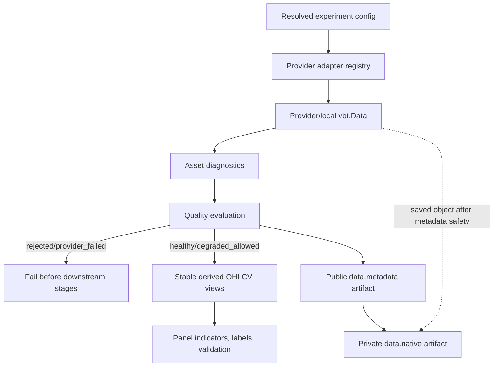
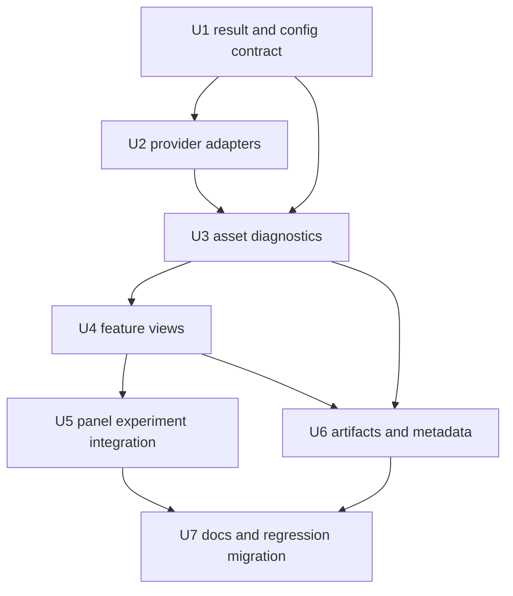

# feat: Add VectorBT market data contract

## Summary

Make `vbt.Data` the canonical market-data object for every source, wrap synthetic and CSV data into the same native contract, and make orchestration consume explicit panel-shaped derived views. The implementation should add a provider adapter registry, feature-oriented OHLCV semantics, asset-level diagnostics before modeling, fail-fast data-quality gates, panel-aware downstream views, and public data metadata that is attempted for every loaded dataset and completed only when it passes public-artifact safety checks.

---

## Problem Frame

The current data boundary in `research/aegis_research/data.py` still flattens market data to Pandas immediately, even when remote providers return rich VectorBT `Data` objects. That loses provider state, makes synthetic/CSV second-class, and lets downstream code silently collapse multi-symbol data through `primary_series` before indicators, labels, splits, and validation run (see origin: `docs/brainstorms/2026-05-16-vectorbt-market-data-contract-requirements.md`).

---

## Requirements

- R1. The canonical market-data result exposes a `vbt.Data` object or provider subclass as the source-of-truth loaded data object.
- R2. The old DataFrame-first contract is not preserved as the primary API; Pandas outputs are derived views with documented semantics.
- R3. Synthetic and CSV sources participate in the same native contract as remote sources.
- R4. Downstream stages receive stable Pandas/sklearn-ready derived views without provider-specific branching.
- R5. Single-symbol and multi-symbol runs have stable feature/symbol semantics and avoid implicit squeezing or first-symbol selection.
- R6. Provider selection supports `synthetic`, `csv`, `yfinance`, `binance`, and `ccxt`, with a clear extension path for future approved VectorBT `Data` subclasses.
- R7. Provider-specific public options pass only through explicit safe boundaries.
- R8. Provider-native symbols remain explicit user input unless a later visible normalization rule is defined.
- R9. Provider credentials, sessions, clients, and live settings stay out of committed public configs and public artifacts.
- R10. Adding a future provider does not require downstream indicator, label, split, portfolio, or reporting code to branch on provider identity.
- R11. OHLCV extraction uses VectorBT-native `Data` properties/accessors or `Data.get` where practical instead of manual flat/MultiIndex probing.
- R12. Non-standard OHLCV names use an explicit feature mapping concept.
- R13. The data contract defines close, high, low, open, and volume exposure, including missing-feature behavior.
- R14. Missing-index, missing-column, timezone, cache, refresh, and error policies are explicit in config or documented defaults before provider data is pulled or wrapped.
- R15. Data quality metadata includes coverage, missingness, duplicate-index handling, timezone, inferred or returned frequency, timestamp bounds, feature availability, per-symbol status, and provider status when available.
- R16. Partial provider failures, skipped symbols, empty fetches, and degraded coverage are never silently swallowed; they fail or become explicit degraded-but-allowed states.
- R17. Provider update/refetch support is preserved in native state when available and visible in metadata when unsupported.
- R18. Market-data metadata preserves safe provider class, source, symbols, features, timeframe, fetch/returned metadata summaries, timezone policy, missing policies, last-index evidence, delisted status, wrapper/frequency evidence, and quality state.
- R19. Native VectorBT data state that materially affects reproducibility is eligible for private native persistence with public metadata sidecars.
- R20. Public metadata and artifacts do not expose provider credentials, secret-bearing kwargs, private clients, local usernames, or non-portable absolute paths.
- R21. Tests cover synthetic, CSV, and mocked/provider-shaped remote data through the native contract, including single-symbol and multi-symbol cases.
- R22. Tests cover stable OHLCV access for flat columns, symbol/feature structures, custom feature mappings, missing features, and non-numeric invalid data.
- R23. Tests cover missing rows, duplicate indexes, timezone normalization, skipped symbols, provider errors, secret-bearing options, and future-provider adapter behavior.

**Origin actors:** A1 Experiment author, A2 Experiment runner, A3 Downstream research stages, A4 Run reviewer or automation agent, A5 Future provider maintainer

**Origin flows:** F1 Load current supported provider data, F2 Add a future VectorBT provider, F3 Handle partial, missing, or misaligned data

**Origin acceptance examples:** AE1 native synthetic/CSV contract, AE2 stable one-symbol and multi-symbol derived views, AE3 safe provider passthrough and secrets, AE4 VectorBT-native OHLCV access and explicit feature maps, AE5 fail/degraded quality handling, AE6 inspectable safe metadata and native sidecar, AE7 future provider adapter path

---

## Scope Boundaries

- No backward compatibility shim for `load_market_data(...)->pd.DataFrame` as the primary market-data API.
- No Databento/BentoData implementation in this issue; Databento remains prior art for future provider extensibility.
- No raw-trade-to-bar construction contract; this plan is for OHLCV-like data sources and explicitly provided OHLCV data.
- No full migration of indicators, labels, splits, portfolios, or reports to `Data.run`; derived Pandas views remain valid at modeling and artifact boundaries.
- No broad provider-specific schema for every YFinance, Binance, or CCXT option; public options remain behind validated passthrough maps.
- No arbitrary provider import strings or user-configured provider classes; future providers are added to an approved in-code registry.
- No committed credentials, private clients, sessions, auth headers, signed URLs, or live provider settings in public configs or public artifacts.
- No broad local cache/data lake system in this issue.

### Deferred to Follow-Up Work

- First-class cache/update/refetch config: keep cache-related passthrough keys denied now, record update/cache capability metadata, and add safe run-relative cache policy later if real workflows need it.
- Advanced cross-asset allocation, ranking, hedging, rebalancing, or portfolio-construction research: this plan should support a baseline multi-asset panel flow, but not invent a full strategy-allocation framework.
- Per-asset model families, cross-sectional rankers, portfolio optimizers, and allocation policies beyond preserving the asset axis: defer until the native data contract and baseline panel flow are stable.
- Provider-normalized symbol aliases: require provider-native symbols now and define visible normalization rules only when real provider UX demands it.
- Production-grade YFinance guarantees: VectorBT docs describe Yahoo Finance data as unstable/demo-quality; this plan keeps it supported but does not position it as production-grade evidence.

---

## Context & Research

### Relevant Code and Patterns

- `research/aegis_research/data.py` defines `MarketDataResult` as `data: pd.DataFrame`, `metadata`, `native_object`, and `known_secrets`; `load_market_data_result` hard-codes source branches and calls `.get()` immediately for `vbt.YFData`, `vbt.BinanceData`, and `vbt.CCXTData`.
- `research/aegis_research/data.py` generates synthetic OHLCV with MultiIndex columns named `symbol` and `feature`, reads CSV with a timezone-naive index localized to UTC, and manually extracts `Close`, `High`, and `Low` through `feature_from_ohlcv`.
- `research/aegis_research/data_schema.py` contains small pure helpers, but `primary_series` silently selects the first DataFrame column. This is the current silent multi-symbol narrowing risk.
- `research/aegis_research/config.py` already has strict dataclass-backed config validation, `DATA_SOURCES`, `REMOTE_DATA_SOURCES`, `MISSING_POLICIES`, path-aware `ConfigValidationIssue`, secret refs, passthrough validation, and denied passthrough keys including `client`, `session`, `cache`, `cache_path`, and `cache_dir`.
- `research/aegis_research/experiments.py` resolves config, initializes run evidence before data loading, calls `load_market_data_result`, extracts close/high/low up front, then builds indicators, labels, splits, validation, and artifacts.
- `research/aegis_research/labels.py` shows current stage-required features: `fixlb` uses close only, while `trendlb` and `pivotlb` require high and low.
- `research/aegis_research/indicators.py` builds indicators from close and can accept Series or DataFrame, but orchestration currently passes a Series after `primary_series`.
- `research/aegis_research/provenance/experiment_artifacts.py` writes `data.native` only when `native_object` exists; local synthetic/CSV runs currently do not get native data artifacts.
- `research/aegis_research/provenance/native.py` already writes private native artifacts with public metadata sidecars and fails closed on secret-bearing native state, secret bytes, path collisions, and metadata serialization failures.
- `tests/research/aegis_research/test_config_contract.py`, `test_stage_provenance.py`, `test_validation_artifacts.py`, and `test_vectorbt_artifacts.py` contain the current migration targets for config validation, DataFrame-first result assertions, helper-based OHLC extraction, and native artifact secret-safety behavior.

### Institutional Learnings

- `docs/solutions/architecture-patterns/config-contract-security-reproducibility-2026-05-16.md` establishes the project pattern for schema-versioned, fail-fast contracts: validate config before side effects, keep passthrough source-aware, reject inline secrets, preserve public/private artifact boundaries, and avoid accepting ignored kwargs.
- `docs/plans/2026-05-16-001-feat-experiment-config-contract-plan.md` and `docs/plans/2026-05-16-002-feat-experiment-provenance-contract-plan.md` are adjacent contract plans. This market-data plan should extend their resolved-config and provenance patterns instead of inventing a parallel framework.

### VectorBT PRO Research

- `Data.pull` supports `features`, `symbols`, `classes`, timezone policies, missing-index/missing-column policies, wrapper kwargs, `skip_on_error`, warning controls, execution kwargs, cache controls, raw return mode, and provider `**kwargs`.
- `Data.from_data` accepts dicts, DataFrames, and Series; supports `columns_are_symbols`, `invert_data`, timezone policies, missing policies, `fetch_kwargs`, `returned_kwargs`, `last_index`, and `delisted`; it aligns data through `align_data`.
- `Data.align_data` prepares timezone-aware datetime indexes, removes duplicate indexes, records `last_index` and `delisted`, and aligns indexes/columns according to `nan`, `drop`, or `raise` policies.
- `Data.get` is the documented orientation-safe extraction surface. It supports `features`, `symbols`, `squeeze_features`, `squeeze_symbols`, grouping `per`, and dictionary output. The docs recommend using `Data.get` to get consistent behavior between symbol-oriented and feature-oriented data.
- VectorBT data can be symbol-oriented or feature-oriented. Feature-oriented data stores each feature as a DataFrame with symbols as columns, which matches the planned derived views.
- `Data` exposes OHLC properties through `OHLCDataMixin`, including `open`, `high`, `low`, `close`, `volume`, `ohlc`, `ohlcv`, `has_ohlc`, and `has_ohlcv`.
- OHLCV accessors search for `open`, `high`, `low`, `close`, and `volume` case-insensitively by default. Non-standard names are supported with `feature_map`; the documented accessor map is source feature name to canonical feature name.
- `Data.update` returns a new `Data` instance instead of mutating in place and relies on preserved fetch/returned/last-index state. Losing native data state loses practical update/refetch capability.
- VectorBT caching is available through `cache`, `refresh_cache`, `clear_cache`, and `cache_kwargs`, but cache paths/settings can expose local state. This reinforces keeping arbitrary cache kwargs denied until a safe first-class cache policy exists.
- Provider notes: `YFData` uses yfinance and docs warn the data may be unstable/demo-quality; `BinanceData` supports client/client_config, regional TLD, kline type, limits and delay; `CCXTData` supports exchange/exchange_config, delay, retries, and exchange-specific fetch params.

### MCP Readiness Update (2026-05-17)

- A follow-up MCP pass confirmed that the preferred VectorBT shape for multiple features and symbols is feature-oriented `Data`: `vbt.Data.from_data(vbt.feature_dict({"Close": close_df, ...}), columns_are_symbols=True)`. Avoid treating one wide OHLCV DataFrame as the canonical multi-symbol shape.
- For stable panel extraction, prefer `Data.get(feature="Close", squeeze_features=False, squeeze_symbols=False)` when requesting one feature. `Data.get(features=["Close"])` returns a tuple even when the list has one feature, so feature-view helpers should avoid list-based calls for single-feature views unless they intentionally normalize the tuple.
- `Data.align_data` sorts non-monotonic indexes and removes duplicate timestamps with `keep="last"` before returning `Data`. If the data contract must report or reject duplicate/non-monotonic local input, local adapters need to inspect raw frames before wrapping or record VectorBT's normalization outcome explicitly.
- `Data.pull` exposes `skip_on_error`, `silence_warnings`, cache controls, wrapper kwargs, provider kwargs, `fetch_kwargs`, `returned_kwargs`, `last_index`, `delisted`, timezone, and frequency evidence. Schema-v1 should pass `skip_on_error=False` explicitly and record cache/update support as metadata-only until a safe first-class cache policy exists.
- Public provider metadata must be allowlisted by meaning, not accepted because it is JSON-serializable. Omit or reject provider clients, sessions, exchange/client objects, auth headers, signed URLs, cache paths, absolute local paths, local usernames, unknown provider objects, and secret-like values.
- The current partial implementation already covers the native/panel baseline, but it does not yet close issue #6 because quality states, asset diagnostics, feature maps, adapter registry, public `data.metadata`, richer safe metadata, multi-layout CSV support, and regression docs/tests are still missing.

### Related Issue

- GitHub issue #6 is open and tracks the market-data contract hardening. Its original problem statement covered the old Pandas-first boundary; the 2026-05-17 issue body now records the partial native/panel implementation and keeps quality diagnostics, feature maps, broader CSV support, public metadata, and richer provider status as remaining closure criteria.

---

## Key Technical Decisions

- Separate provider-native source state from canonical downstream views. `native_data` preserves the raw provider/local VectorBT object and may be provider-oriented; the downstream contract is canonical feature views where each canonical feature (`Open`, `High`, `Low`, `Close`, `Volume`) maps to a timestamp-indexed DataFrame whose columns are symbols. Local adapters should wrap feature-oriented `Data`; remote adapters should derive canonical views without discarding provider update/fetch state.
- Make `MarketDataResult` a frozen domain result with native source data, a canonical derived-view surface, safe public metadata, typed quality state, and known secrets. The old `data` DataFrame field should not remain the primary contract.
- Keep Pandas derived views stable and explicit: feature views are DataFrames with timestamps as index and symbols as columns. Series extraction is only a convenience for truly single-symbol inputs and must never be the orchestration default.
- Make asset diagnostics the first post-load product of the data contract. Before modeling, compute per-symbol/per-feature coverage, missingness, numeric validity, timestamp bounds, timezone/frequency evidence, provider status, delisted/stale evidence, and update/repair support.
- Carry multi-asset panels through the current experiment path instead of collapsing to one asset. Indicators, labels, probabilities, entries, exits, portfolios, metrics, and artifacts should preserve the asset axis.
- Use an asset-stacked training dataset for the baseline model path: convert indicator and label panels into samples indexed by timestamp and symbol, train one global model across asset-time observations, then unstack predictions back to symbol columns. This is the smallest coherent multi-asset baseline and avoids inventing per-asset model orchestration in the data-contract issue.
- Compute required OHLCV features from the experiment config. Close is required for indicators, `fixlb`, validation, and portfolio work; high/low are required only for `trendlb` and `pivotlb`; open and volume are optional until a configured stage requests them.
- Add `data.feature_map` as the public schema for non-standard source names, using logical keys `open`, `high`, `low`, `close`, and `volume` that point to provider/source feature names. The adapter can translate this into VectorBT's source-to-canonical `feature_map` internally.
- Use a static in-code provider adapter registry. Current providers become registry entries; tests can register fake adapters through a controlled test seam, but configs cannot import arbitrary provider classes.
- Wrap synthetic and CSV data through `vbt.Data.from_data` whenever practical. If a local input cannot be represented as native data, fail with a typed unsupported-shape/data-contract error rather than returning `native_object=None` silently.
- Keep `missing_index="raise"`, `missing_columns="raise"`, and `skip_on_error=False` as schema-v1 defaults. `nan` and `drop` can construct data but do not automatically bypass post-load required-feature and downstream usability checks. Skipped-symbol degradation requires an explicit quality policy that authorizes provider partial-fetch behavior; without that opt-in, skipped symbols are rejected or provider-failed.
- Introduce explicit data-quality states for the loaded data boundary: `healthy`, `degraded_allowed`, `rejected`, and `provider_failed`. Non-blocking observations belong in quality metadata warnings, not separate terminal states. Native artifact failure is an artifact/run persistence state, not a data-quality state.
- Degraded data requires explicit opt-in through a small `data.quality` policy. Do not use a blanket silent partial-data opt-in; record degradation reason, affected symbols/features, and policy evidence.
- Reject empty required views, duplicate timestamps, non-monotonic indexes, and non-numeric required features at the data boundary unless a named policy explicitly handles the case.
- Keep arbitrary cache/update kwargs out of passthrough for this issue. Record `update_supported`, `cache_policy`, `last_index`, `fetch_window`, and repair/update limitations in metadata, but defer first-class cache controls.
- Always attempt a public data metadata artifact for every source, separate from private native persistence. Complete it only when the metadata passes public-artifact safety checks. Private native artifacts remain fail-closed and secret-scanned.
- Treat unsafe native data persistence as run-failing by default. Metadata-only continuation for unsafe native state is deferred to a separate follow-up and is not an implementation-time option for this plan.

---

## Open Questions

### Resolved During Planning

- What should `MarketDataResult` expose? Resolve with a native-first result: provider/local `vbt.Data` source state, canonical derived OHLCV/Pandas view access, safe metadata, quality state, and known secrets. Do not preserve `.data` as the primary source of truth.
- How should degraded data work? Resolve with explicit states and fail-fast defaults. Only `healthy` and configured `degraded_allowed` can proceed to downstream stages; non-blocking warnings are metadata attached to those states.
- Which features are required? Resolve from downstream config: close for indicators/fixlb/validation/portfolio, high/low for trendlb/pivotlb, open/volume optional unless requested later.
- What shapes should derived views return? Resolve with stable DataFrames for feature views and panel-preserving downstream outputs; no implicit first-symbol selection.
- How should feature mapping be configured? Resolve with `data.feature_map` using logical OHLCV keys mapped to source/provider feature names, validated against allowed keys and required source columns.
- How should local sources be wrapped? Resolve with `vbt.Data.from_data` in feature-oriented form for synthetic and parsed CSV inputs.
- How should cache/update/refetch be represented? Resolve with metadata-only support in this issue while keeping unsafe cache passthrough keys denied.
- Should public data metadata always be written? Resolve that public `data.metadata` is always attempted after data loading and completed only when public metadata passes safety checks; private `data.native` is attempted separately and completed only when safe.
- What provider extension mechanism should be used? Resolve with a static approved adapter registry.
- How should provider failures be handled? Resolve with typed, redacted failures and no automatic retries by default; partial/skipped data is rejected unless explicitly allowed.
- How should unsafe private native persistence behave? Resolve with fail-closed run failure after public metadata has been safely written; metadata-only continuation is deferred to a separate follow-up.

### Deferred to Implementation

- Exact class and helper names for result/view/quality objects: choose names that keep `data.py` readable, but preserve the contract shape above.
- Exact `data.quality` config field names and enum strings: keep the schema small and path-aware, and make degradation reasons explicit.
- Exact provider error subclasses: introduce only the typed errors needed to distinguish config, provider, quality, feature, and artifact failures without overbuilding an exception hierarchy.
- Exact public data metadata file path and artifact id: follow existing artifact naming conventions and keep paths run-relative.
- Exact provider-specific public metadata allowlists: define the smallest useful source/provider fields during implementation, but never use JSON-serializability or stringification as the safety boundary.

---

## Current Readiness Update

This section records the 2026-05-17 planning audit after the first native/panel implementation slice. It is context for the remaining work, not a progress checklist for individual implementation units.

### Confirmed Baseline To Preserve

- `MarketDataResult` now carries `native_data`, metadata, and known secrets rather than a primary Pandas `.data` field.
- `load_market_data` returns the native VectorBT data object through `load_market_data_result(...).native_data`.
- Synthetic data is already generated as feature panels and wrapped with `vbt.Data.from_data(vbt.feature_dict(...), columns_are_symbols=True)`.
- Flat one-symbol CSV data is wrapped into native `Data`, but broader CSV layout support remains in scope below.
- Remote `yfinance`, `binance`, and `ccxt` paths preserve the native provider `Data.pull(...)` result instead of flattening it at the source boundary.
- Current OHLC helpers use `Data.get(feature=..., squeeze_features=False, squeeze_symbols=False)` for native data and return timestamp-by-symbol DataFrame panels.
- Downstream baseline code now preserves symbol columns through indicators, labels, validation probabilities, signals, portfolios, metrics, and artifacts for the covered synthetic cases.
- Private `data.native` persistence is attempted through the existing native artifact writer and remains secret-scanned/fail-closed.

### Remaining Closure Gates For Issue #6

- Add a first-class data-quality contract: quality state, per-symbol diagnostics, required-feature checks, missingness/coverage evidence, duplicate/non-monotonic evidence, numeric validity, provider/skipped-symbol status, and explicit degraded-but-allowed policy evidence.
- Add `data.feature_map` to config validation and local loading so non-standard source feature names are mapped explicitly to canonical OHLCV features.
- Replace hard-coded source branches with a static approved provider adapter registry and a controlled fake-provider seam for tests.
- Add a public `data.metadata` artifact that is attempted after data load, diagnostics, and quality classification, before downstream modeling and before private native persistence.
- Expand safe metadata projection to include provider class, source, requested symbols/features/timeframe, missing/timezone policies, observed timezone/frequency, feature availability, safe fetch/returned metadata summaries, `last_index`, `delisted`, update support, cache policy, quality state, diagnostics, and omitted-field reasons.
- Expand CSV support beyond flat one-symbol canonical columns: support explicit mapped flat OHLCV and documented `(symbol, feature)` MultiIndex layouts; reject ambiguous or unsupported local layouts with typed data-contract errors.
- Move orchestration from always requesting close/high/low to config-derived required features: `fixlb` should run with close-only data, while `trendlb` and `pivotlb` should fail preflight when high/low are unavailable.
- Add missing contract/quality tests and update durable docs before closing the issue.

### Revised Remaining Execution Order

1. Finish U1: result/config/quality surface, including `feature_map`, minimal `data.quality`, required-feature computation, and recursive safety validation.
2. Finish U2: adapter registry, local/remote adapter contract, explicit `skip_on_error=False`, fake-provider seam, and typed redacted provider failures.
3. Finish U3 and U4 together: asset diagnostics, quality gates, feature-map-aware panel views, and removal of helper-based orchestration as the primary data contract.
4. Finish or verify U5: make orchestration consume only the derived panel contract, compute required features from config, preserve symbol identity through existing baseline artifacts, and fail preflight for unsupported feature requirements.
5. Finish U6: public `data.metadata` artifact, safe metadata allowlists, omitted-field reasons, and private native persistence behavior after public metadata is complete.
6. Finish U7: docs and regression migration, including VectorBT-native lifecycle, feature maps, quality states, provider-native symbols, cache/update deferral, and acceptance-example coverage.
7. Verify with the full contract, quality, artifact, integration, lint, and test suite before updating issue #6 or tracker issue #14.

### Issue #6 Final Closure Checklist

Close or mark issue #6 complete only after each remaining gate has concrete evidence:

- Native source contract: synthetic, CSV, and mocked remote providers expose `native_data`, canonical feature views, safe metadata, quality state, and known-secret handling in contract tests.
- Feature views: single-symbol and multi-symbol close/high/low/open/volume requests return timestamp-by-symbol DataFrame panels without implicit squeezing or first-symbol fallback.
- Feature maps and CSV layouts: standard flat CSV, mapped flat CSV, supported `(symbol, feature)` CSV layouts, missing mapped source columns, and ambiguous/unsupported layouts are covered by tests.
- Quality gates: healthy, rejected, provider_failed, and explicitly degraded_allowed paths are covered, including missing required features, non-numeric required features, missing rows, duplicate/non-monotonic local input, skipped symbols, and close-only `fixlb` versus high/low-dependent labels.
- Provider policy: default `skip_on_error=False`, explicit partial-symbol opt-in, provider-native symbols, cache/update deferral, and safe provider kwargs are documented and tested.
- Public metadata: every successful data load writes public `data.metadata` with diagnostics, quality state, safe provider projections, omitted-field reasons, timezone/frequency/missing policy evidence, and no absolute local paths or secrets.
- Private native artifacts: `data.native` is attempted after public metadata, remains private, is secret-scanned, and fails the run closed when unsafe.
- Orchestration: `run_experiment` consumes derived panels from the market-data result, computes required features from config, preserves symbol identity through current baseline artifacts/metrics, and fails preflight on unsupported required features.
- Docs: `docs/vectorbt-scaffold.md` and `README.md` describe the native data lifecycle, feature maps, quality states, public/private artifacts, provider-native symbols, and cache/update deferral.
- Issue update: the final issue #6 update should cite the tests/docs/artifacts that satisfy each checklist item rather than relying only on a passing full test suite.

---

## High-Level Technical Design

> *This illustrates the intended approach and is directional guidance for review, not implementation specification. The implementing agent should treat it as context, not code to reproduce.*

Public `data.metadata` must complete its safety checks before private `data.native` persistence is attempted. If private native persistence is unsafe, the run fails closed after the safe public metadata outcome is recorded.

Quality-state decisions:

| State | Meaning | Downstream allowed |
|---|---|---|
| `healthy` | Required symbols/features/index/coverage pass; optional non-blocking observations may appear in warnings metadata | Yes |
| `degraded_allowed` | Contract can proceed only because explicit quality policy allows a recorded degradation | Yes |
| `rejected` | Data loaded but violates required feature, shape, index, numeric, or quality policy | No |
| `provider_failed` | Provider/read/pull failed before usable canonical data exists | No |

Derived-view orientation:

| View | Shape |
|---|---|
| Single feature, one or more symbols | DataFrame indexed by timestamp, columns are symbols |
| Single feature, one symbol | One-column DataFrame by default; Series only through an explicit convenience method outside orchestration |
| Multiple features | Mapping/tuple of feature DataFrames or documented full OHLCV view; no ambiguous flattening |
| Downstream current schema v1 | Preserve symbol columns through indicators, labels, probabilities, signals, portfolios, metrics, and artifacts |
| Modeling dataset | Asset-stacked table indexed by timestamp and symbol for baseline global-model training |

---

## Implementation Units

### U1. Result, Config, And Quality Contract

**Goal:** Define the native-first market-data result, explicit feature-map config, asset diagnostics model, and data-quality policy/state contract before changing loaders.

**Requirements:** R1, R2, R4, R5, R7, R12, R13, R14, R16; establishes the contract scaffolding for AE2 and AE4

**Dependencies:** None

**Files:**
- Modify: `research/aegis_research/config.py`
- Modify: `research/aegis_research/data.py`
- Modify: `research/aegis_research/data_schema.py`
- Test: `tests/research/aegis_research/test_config_contract.py`
- Test: `tests/research/aegis_research/test_market_data_contract.py`

**Approach:**
- Replace the DataFrame-first `MarketDataResult` shape with a native-first frozen result that carries native source data, a canonical view contract, safe public metadata, diagnostic fields, a quality object/state, and known secrets.
- Add strict config validation for `feature_map` and a minimal `data.quality` policy. Keep unknown fields rejected and make every new field path-aware in `ConfigValidationError`.
- Do not add target-symbol config in this issue. The data contract and experiment path should preserve all configured symbols unless a later feature defines an explicit symbol-selection use case.
- Validate `feature_map` keys against logical OHLCV names and reject unknown keys before data loading.
- Strengthen recursive provider/passthrough validation for the new contract: deny secret-like nested keys and values, non-JSON/object instances, signed URLs, auth headers, client/session objects, cache path controls, and any provider option that cannot be safely represented in public config.
- Preserve current safe passthrough behavior for remote providers. Local sources should continue rejecting ignored passthrough maps unless this unit intentionally makes wrapper behavior first-class for local wrapping.
- Treat `load_market_data` as a migration target, not a compatibility promise. Downstream callers should move to `load_market_data_result` or an equivalent native-first API.

**Execution note:** Start with contract tests for config validation and result shape so later loader changes cannot drift into multiple APIs.

**Patterns to follow:**
- `DataConfig`, `ConfigValidationIssue`, and `_validate_data` in `research/aegis_research/config.py`
- Frozen stage result objects in `research/aegis_research/data.py`, `research/aegis_research/labels.py`, and `research/aegis_research/indicators.py`
- Secret and passthrough validation tests in `tests/research/aegis_research/test_config_contract.py`

**Test scenarios:**
- Happy path: synthetic config with default quality policy resolves and produces a native-first result contract object with metadata, asset diagnostics, and quality state fields.
- Happy path: `data.feature_map` with allowed logical keys resolves and is available to the loader contract.
- Edge case: unknown `data.feature_map` key fails with a path-aware config error.
- Happy path: multi-symbol config remains valid and the result contract can represent per-symbol diagnostics without adding a target-symbol shortcut.
- Error path: no target-symbol field is accepted as a hidden compatibility shortcut; unknown symbol-selection fields fail until a later issue defines that contract.
- Error path: inline credentials and denied passthrough keys still fail after new fields are added.
- Error path: nested provider options such as `exchange_config.apiKey`, `exchange_config.secret`, auth headers, signed URLs, embedded client/session objects, and cache path controls fail validation with path-aware errors.
- Integration: current baseline configs continue to validate unless intentionally updated for the new native contract.

**Verification:**
- New contract fields are explicit and documented in tests.
- Config validation remains strict and source-aware.
- No test or production path relies on `MarketDataResult.data` as the canonical source of truth.

### U2. Provider Adapter Registry And Native Loading

**Goal:** Replace hard-coded source branches with approved provider adapters that return native `vbt.Data` source objects, adapter evidence needed by diagnostics, or typed failures.

**Requirements:** R1, R3, R6, R7, R8, R9, R10, R14, R16, R17, R18, R21, R23; covers AE1, AE3, AE7

**Dependencies:** U1

**Files:**
- Modify: `research/aegis_research/data.py`
- Modify: `research/aegis_research/config.py`
- Test: `tests/research/aegis_research/test_market_data_contract.py`
- Test: `tests/research/aegis_research/test_config_contract.py`
- Test: `tests/research/aegis_research/test_vectorbt_artifacts.py`

**Approach:**
- Introduce a static adapter registry for `synthetic`, `csv`, `yfinance`, `binance`, and `ccxt`.
- Remote adapters call the provider subclass `pull` with explicit symbols, timeframe, timezone, missing policies, wrapper kwargs, execution kwargs, and provider kwargs. Preserve redaction behavior from `_pull_remote`.
- Pass `skip_on_error=False` explicitly by default. Only an explicit data-quality policy may authorize provider partial-fetch behavior such as skipped symbols, and adapters must record that policy evidence.
- Remote adapters should accept only provider kwargs that passed recursive config validation; do not forward live client/session objects, auth headers, signed URLs, cache paths, or opaque runtime objects through the public experiment config.
- Local adapters validate and record pre-wrap index/shape evidence before converting generated/parsed Pandas data into feature-oriented `vbt.Data.from_data` with canonical feature names and symbols as columns.
- Adapter results should carry the native object plus source evidence needed by diagnostics; downstream stages should consume canonical views rather than assuming every provider-native object is itself feature-oriented.
- Keep provider-native symbols untouched. Do not normalize `BTC-USD`, `BTCUSDT`, or `BTC/USDT` across providers.
- Allow tests to exercise future-provider behavior through a controlled fake adapter seam, not user-supplied import paths.
- Capture provider metadata and update capability from native objects through safe allowlisted fields.

**Execution note:** Add mocked adapter/provider tests before refactoring source dispatch so hard-coded branches can be removed safely.

**Patterns to follow:**
- `_pull_remote` secret resolution and redacted `RemoteDataPullError` in `research/aegis_research/data.py`
- `DATA_SOURCES` and `REMOTE_DATA_SOURCES` allowlists in `research/aegis_research/config.py`
- `_RemoteDataWithSecret` style provider fake in `tests/research/aegis_research/test_vectorbt_artifacts.py`

**Test scenarios:**
- Covers AE1. Synthetic source returns a native `vbt.Data`-compatible object and safe metadata.
- Covers AE1. CSV source returns a native `vbt.Data`-compatible object for flat standard OHLCV input.
- Happy path: mocked yfinance/binance/ccxt providers preserve their native object and safe provider metadata without flattening as canonical data.
- Happy path: fake future provider adapter returns the same result contract and downstream view access does not branch on provider identity.
- Error path: unsupported source is rejected through config validation or registry lookup, not by falling through to generic behavior.
- Error path: provider exception containing known secrets raises a redacted typed provider failure without preserving secret-bearing exception chains.
- Error path: local source that cannot be wrapped into native data fails with an explicit unsupported-shape/data-contract error.
- Integration: denied provider cache/client/session passthrough keys remain denied after adapter registry migration.
- Error path: nested CCXT/Binance-style config containing auth headers, API keys, signed URLs, client/session objects, or cache paths is rejected before provider pull.

**Verification:**
- All current sources flow through the same adapter contract.
- Synthetic and CSV no longer return second-class DataFrame-only results.
- Adding a fake provider in tests does not require changes to downstream indicator, label, split, validation, report, or artifact code.

### U3. Asset Diagnostics And Quality Gates

**Goal:** Make asset-level diagnostics the first product after native loading, then classify whether each symbol and the overall data contract can proceed.

**Requirements:** R5, R13, R14, R15, R16, R17, R21, R22, R23; covers AE2, AE4, AE5

**Dependencies:** U1, U2

**Files:**
- Modify: `research/aegis_research/data.py`
- Modify: `research/aegis_research/data_schema.py`
- Test: `tests/research/aegis_research/test_market_data_quality.py`
- Test: `tests/research/aegis_research/test_market_data_contract.py`

**Approach:**
- Evaluate diagnostics immediately after native data is loaded or wrapped, before any model, label, split, portfolio, or report stage can consume views.
- Compute per-symbol diagnostics for required and optional features: coverage, missingness, first/last timestamp, duplicate-index evidence, monotonicity, timezone, inferred or returned frequency, numeric validity, provider status, delisted/stale evidence, update support, and repair limitations.
- For local adapters, inspect raw frames before `Data.from_data` when duplicate or non-monotonic timestamp evidence must be reported or rejected, because VectorBT's `align_data` can sort and de-duplicate during wrapping.
- For remote provider adapters, record whether diagnostics are based on pre-alignment provider evidence or post-VectorBT-alignment evidence only. Do not claim duplicate/non-monotonic rejection for remote inputs unless the adapter captured raw provider evidence before `Data.pull`/alignment normalized it.
- Compute required features from current downstream config: close for indicators/fixlb/validation/portfolio, high/low for trendlb/pivotlb, open/volume optional.
- Classify overall quality as `healthy`, `degraded_allowed`, `rejected`, or `provider_failed`, with warnings and reasons attached as metadata rather than a separate warning state.
- Keep fail-fast defaults for empty data, duplicate indexes, non-monotonic indexes, missing required symbols/features, non-numeric required features, disallowed missing rows, and provider skipped symbols.
- Allow degradation only when explicit data-quality policy permits the specific condition, and record policy evidence plus affected symbols/features.

**Execution note:** Implement diagnostics tests before derived-view or orchestration migration, because asset diagnostics are the guardrail against recreating silent first-asset behavior elsewhere.

**Patterns to follow:**
- Project fail-fast principles in `AGENTS.md`
- Label feature requirements in `research/aegis_research/labels.py`
- `index_identity` and shape helpers in `research/aegis_research/data_schema.py`
- Redacted diagnostics in `research/aegis_research/experiments.py`

**Test scenarios:**
- Covers AE5. Fully valid multi-symbol synthetic data yields `healthy` quality and one diagnostics record per symbol.
- Happy path: missing optional volume records a warning for each affected symbol and does not fail a close-only experiment.
- Happy path: skipped symbol with explicit allowed partial-symbol degradation yields `degraded_allowed` with affected symbol metadata only when the data-quality policy authorized provider partial-fetch/skip behavior.
- Error path: skipped symbol with default policy is rejected before indicators run.
- Error path: empty native/provider result is rejected or provider_failed with typed reason.
- Error path: duplicate timestamp index is rejected by default.
- Error path: non-monotonic index is rejected unless a named policy normalizes it.
- Error path: missing close fails for indicators/fixlb/validation/portfolio.
- Error path: missing high/low fails for trendlb and pivotlb preflight.
- Happy path: close-only data with fixlb succeeds when high/low are absent.
- Error path: close-only data with trendlb or pivotlb fails before label generator invocation.
- Edge case: `missing_index="nan"` can construct native data but does not bypass downstream usability checks if required views are unusable.
- Edge case: irregular inferred frequency is recorded as warning/degradation/rejection according to policy.
- Edge case: mocked remote provider diagnostics clearly state whether duplicate/non-monotonic evidence is pre-alignment or post-alignment-only.

**Verification:**
- Asset diagnostics are available before downstream stages.
- Required-feature errors point to the data contract rather than VectorBT/Pandas internals.
- Degraded-but-allowed runs are explicit in result metadata and artifacts.

### U4. Stable OHLCV Feature Views And Shape Semantics

**Goal:** Replace manual OHLCV column probing and silent squeezing with VectorBT-native, feature-map-aware panel views.

**Requirements:** R4, R5, R11, R12, R13, R21, R22; covers AE2, AE4

**Dependencies:** U1, U2, U3

**Files:**
- Modify: `research/aegis_research/data.py`
- Modify: `research/aegis_research/data_schema.py`
- Test: `tests/research/aegis_research/test_market_data_contract.py`
- Test: `tests/research/aegis_research/test_stage_provenance.py`

**Approach:**
- Build derived feature views through `Data.get` or OHLC properties with explicit feature and symbol selections. Avoid accidental `Data.get()` defaults that can return different shapes based on cardinality.
- For single-feature panel views, use `feature=<canonical feature>` rather than `features=[...]` so VectorBT returns the feature panel directly instead of a one-item tuple.
- Standardize canonical features to `Open`, `High`, `Low`, `Close`, and `Volume` in native data. Apply configured feature maps before view extraction.
- Return DataFrames for feature views, with timestamps as index and symbols as columns, including one-column DataFrames for single-symbol inputs when used by orchestration.
- Keep Series extraction outside orchestration as an explicit convenience for tests or one-off analysis, never as the primary pipeline contract.
- Replace `feature_from_ohlcv`, `close_from_ohlcv`, `high_from_ohlcv`, and `low_from_ohlcv` as primary downstream APIs. If temporary helpers remain, they should delegate to the native result/view contract rather than inspect columns manually.
- Change `primary_series` semantics or move its use so it cannot silently choose the first symbol from multi-symbol data.

**Execution note:** Characterize the current first-symbol behavior with a failing test, then change the contract so multi-symbol data always preserves the asset axis.

**Patterns to follow:**
- Existing small pure helpers in `research/aegis_research/data_schema.py`, but with fail-fast behavior instead of silent fallback.
- VectorBT `Data.get(feature=..., symbols=[...], squeeze_features=False, squeeze_symbols=False)` semantics from docs for single-feature panels, and tuple-normalization behavior when multiple features are requested.
- VectorBT OHLCV `feature_map` behavior for custom source column names.

**Test scenarios:**
- Covers AE2. Single-symbol close/high/low/open/volume views are one-column DataFrames in orchestration paths.
- Covers AE2. Multi-symbol close view returns a DataFrame with one column per symbol and does not squeeze.
- Error path: asking for a primary series from multi-symbol data fails instead of selecting the first column.
- Happy path: flat standard OHLCV columns map to canonical feature views.
- Happy path: `(symbol, feature)` MultiIndex local input maps to canonical feature views.
- Edge case: `(feature, symbol)` MultiIndex input either maps through a documented adapter rule or fails unless feature mapping/orientation is explicit.
- Covers AE4. Non-standard feature names succeed only with `data.feature_map`.
- Error path: missing required mapped source column fails visibly.
- Error path: non-numeric required `close` data fails at the data boundary.

**Verification:**
- Derived views are independent of provider identity.
- No downstream path depends on manual MultiIndex probing.
- Multi-symbol data cannot be silently narrowed to the first symbol.

### U5. Multi-Asset Experiment Panel Migration

**Goal:** Move `run_experiment` and test helpers onto the market-data result's derived panel contract, preserving symbol identity through the existing baseline labels, model samples, signals, portfolios, metrics, and artifacts without expanding into advanced strategy or model-family design.

**Requirements:** R2, R4, R5, R10, R13, R16, R21, R22; covers AE2, AE4, AE5

**Dependencies:** U3, U4

**Files:**
- Modify: `research/aegis_research/experiments.py`
- Modify: `research/aegis_research/indicators.py`
- Modify: `research/aegis_research/labels.py`
- Modify: `research/aegis_research/models.py`
- Modify: `research/aegis_research/validation.py`
- Modify: `research/aegis_research/signals.py`
- Modify: `research/aegis_research/portfolios.py`
- Modify: `research/aegis_research/reports.py`
- Modify: `research/aegis_research/data_schema.py`
- Test: `tests/research/aegis_research/test_validation_artifacts.py`
- Test: `tests/research/aegis_research/test_stage_provenance.py`
- Test: `tests/research/aegis_research/test_experiments_holdout.py`
- Test: `tests/research/aegis_research/test_experiments_walkforward.py`

**Approach:**
- Have orchestration load the native market-data result, request required feature panels, verify asset diagnostics, and pass DataFrame panels to downstream stages.
- Keep the Pandas/sklearn modeling boundary, but make it panel-aware only to the extent needed for the current baseline: indicators and labels remain timestamp-by-symbol panels, then the validation/model boundary preserves timestamp and symbol identity for each split.
- Train one global baseline model across asset-time samples for schema v1 only as the minimal preservation baseline. Do not add per-asset model families, cross-sectional ranking, allocation policy, or richer portfolio construction in this issue.
- Update validation orchestration so timestamp splits map cleanly to asset-stacked samples, predictions unstack back to timestamp-by-symbol panels, and split artifacts preserve symbol identity.
- Make signal conversion and portfolio simulation accept DataFrames so entries, exits, and close prices remain aligned by timestamp and symbol.
- Update report metrics so multi-column portfolios produce per-asset metrics plus explicit aggregate metrics. Do not use the first stats column as the run metric.
- Ensure `fixlb` can run with close panels and high/low panels are requested only for label kinds that need them.
- Preserve run lifecycle behavior: a failed data contract after run initialization marks the run failed with redacted diagnostics.
- Treat existing panel semantics already implemented in the partial slice as verification targets where applicable; remaining U5 work should close gaps rather than broaden modeling/reporting scope.

**Execution note:** Migrate tests around the public orchestration behavior instead of preserving old helper names.

**Patterns to follow:**
- Thin orchestration style in `research/aegis_research/experiments.py`
- Stage result metadata pattern in `research/aegis_research/indicators.py` and `research/aegis_research/labels.py`
- Existing DataFrame acceptance in `research/aegis_research/indicators.py`
- Run failure redaction in `_redacted_diagnostic`

**Test scenarios:**
- Happy path: baseline synthetic holdout run completes through the new native data result and derived view path.
- Happy path: baseline synthetic walk-forward run completes through the new native data result and derived view path.
- Covers AE2. Multi-symbol synthetic run preserves all symbols through close/high/low panels, indicators, labels, probabilities, entries, exits, and portfolio simulation.
- Happy path: asset-stacked model training records sample counts by symbol and does not mix labels without symbol identity.
- Happy path: validation splits apply timestamp windows to every symbol, then train/test asset-time samples preserve both timestamp and symbol identity.
- Integration: multi-symbol report contains per-asset metrics and explicit aggregate metrics; no metric is selected by first-column fallback.
- Happy path: close-only data with `fixlb` builds indicators, labels, and validation.
- Error path: close-only data with `trendlb` fails preflight with missing high/low.
- Integration: failed data contract marks the manifest failed and redacts any known secrets.
- Integration: downstream modules do not branch on provider identity.

**Verification:**
- `run_experiment` no longer imports or calls DataFrame-first OHLCV helpers as its data contract.
- Validation helper tests use the same panel-derived-view path as real runs.
- Current single-symbol baseline runs still succeed as one-column panel cases.
- Multi-symbol tests prove the asset axis reaches metrics/artifacts without silent first-asset selection.

### U6. Public Data Metadata And Private Native Artifacts

**Goal:** Persist inspectable, secret-safe public data metadata for every source and preserve private native data only when safe.

**Requirements:** R15, R17, R18, R19, R20, R21, R23; covers AE5, AE6

**Dependencies:** U3, U4

**Files:**
- Modify: `research/aegis_research/experiments.py`
- Modify: `research/aegis_research/provenance/experiment_artifacts.py`
- Modify: `research/aegis_research/provenance/native.py`
- Modify: `research/aegis_research/data.py`
- Test: `tests/research/aegis_research/test_vectorbt_artifacts.py`
- Test: `tests/research/aegis_research/test_stage_provenance.py`
- Test: `tests/research/aegis_research/test_experiment_provenance.py`

**Approach:**
- Add a public `data.metadata` JSON artifact attempt for every run that reaches data loading, independent of private native persistence.
- Keep private `data.native` artifact writing for native objects, with current secret byte/state/metadata safety checks.
- Write or register public data metadata immediately after data load, diagnostics, and quality classification, before labels, splits, validation, or private native persistence, so later failures do not erase the public quality/provenance record.
- Metadata should include source, provider class, symbols, canonical features, feature availability, asset diagnostics, timeframe, requested and observed timezone/frequency, missing policies, quality state, degradation reasons, coverage, timestamp bounds, duplicate-index policy outcome, provider status, update support, last-index evidence, delisted status, safe fetch/returned metadata projection, and any omitted-field reasons.
- Use explicit source/provider metadata allowlists for public fetch/returned metadata. JSON-serializable is not enough: omit and record reasons for absolute paths, local usernames, cache paths, signed URLs, auth headers, client/session reprs, exchange/client objects, request params that can carry credentials, and unknown provider objects.
- Treat `last_index`, `delisted`, `missing_index`, `missing_columns`, `tz_localize`, `tz_convert`, observed `freq`, and update/cache support as direct allowlist candidates. For broad containers such as `fetch_kwargs` and `returned_kwargs`, require source/provider-specific projection functions that emit only named safe subfields; do not allow whole nested mappings by default.
- Public metadata must use run-relative or redacted paths. Do not persist absolute CSV paths, local usernames, provider clients, credentials, sessions, auth headers, or secret-bearing kwargs.
- Keep unsafe native persistence fail-closed. If native objects contain unsafe local/provider state, public metadata remains recorded if it already passed safety checks, then private `data.native` fails and the run is marked failed through the existing native artifact writer behavior.

**Execution note:** Add artifact tests before changing write order so failure visibility and secret safety remain locked down.

**Patterns to follow:**
- `NativeArtifactWriter.write_native_artifact` sidecar behavior in `research/aegis_research/provenance/native.py`
- `_write_json_artifact` helper pattern in `research/aegis_research/provenance/experiment_artifacts.py`
- Existing secret-safety tests in `tests/research/aegis_research/test_vectorbt_artifacts.py`

**Test scenarios:**
- Covers AE6. Synthetic run completes public data metadata with native contract, quality state, feature availability, asset diagnostics, shape, and index/timezone evidence.
- Covers AE6. CSV run completes public data metadata without leaking an absolute local path.
- Covers AE6. Remote mocked provider run writes public metadata with provider class, safe fetch/returned metadata projection, missing policies, last-index/update evidence, and no secrets.
- Error path: private native artifact containing secret bytes fails closed and does not write the native binary.
- Error path: public data metadata containing secret-like values fails closed before public artifact completion.
- Error path: fetch/returned metadata containing absolute paths, local usernames, cache paths, auth headers, signed URLs, client/session reprs, or unknown provider objects is omitted with an explicit omitted-field reason and no public leak.
- Error path: native data state containing absolute paths/usernames, cache paths, provider clients/sessions, exchange objects, auth headers, or known secrets fails closed, marks the run failed, and does not persist the native binary.
- Integration: if private native persistence fails, manifest records failed native artifact status and public diagnostics remain redacted.
- Integration: public data metadata is inspectable without unpickling native objects.

**Verification:**
- Every data load attempts a public `data.metadata` artifact and successful metadata safety checks complete it before downstream stages.
- Private native persistence remains local/private and secret-scanned.
- Public artifacts remain portable and path-safe.

### U7. Documentation And Regression Migration

**Goal:** Update durable docs and migrate old DataFrame-first tests to the new native contract so future work starts from the right boundary.

**Requirements:** R1, R2, R5, R6, R10, R14, R18, R20, R21, R22, R23; covers AE1 through AE7

**Dependencies:** U1, U2, U3, U4, U5, U6

**Files:**
- Modify: `README.md`
- Modify: `docs/vectorbt-scaffold.md`
- Modify if schema defaults require authored changes: `research/configs/experiments/synthetic_ml_baseline.yaml`
- Modify if schema defaults require authored changes: `research/configs/experiments/synthetic_walkforward_baseline.yaml`
- Modify if schema defaults require authored changes: `research/configs/experiments/synthetic_trendlb_baseline.yaml`
- Test: `tests/research/aegis_research/test_market_data_contract.py`
- Test: `tests/research/aegis_research/test_market_data_quality.py`
- Test: `tests/research/aegis_research/test_validation_artifacts.py`
- Test: `tests/research/aegis_research/test_stage_provenance.py`
- Test: `tests/research/aegis_research/test_config_contract.py`

**Approach:**
- Document the new market-data lifecycle: configured -> validated -> adapter selected -> native data pulled/wrapped -> asset diagnostics evaluated -> quality classified -> derived views exposed -> public metadata written -> private native persistence attempted.
- Document current source support, provider-native symbols, multi-asset panel shapes, asset diagnostics, feature-map shape, quality-state meanings, missing/timezone defaults, and cache/update deferral.
- Update baseline configs only if the new schema requires quality/default fields to be authored explicitly; do not add target-symbol fields as a shortcut around multi-asset support.
- Remove test expectations that assert `result.data.shape` as the primary contract. Replace them with native data, view shape, quality state, and metadata assertions.
- Keep private VectorBT PRO installation expectations clear without committing license/private package details into public configs.

**Execution note:** Treat old DataFrame-first tests as migration targets, not compatibility constraints.

**Patterns to follow:**
- Existing docs style in `docs/vectorbt-scaffold.md`
- Baseline config patterns in `research/configs/experiments/`
- Contract-style tests in `tests/research/aegis_research/test_config_contract.py`

**Test scenarios:**
- Documentation examples validate under the new config contract.
- Baseline synthetic configs load and run through the native data boundary.
- Tests assert no old DataFrame-first helper remains as the orchestration contract.
- Tests assert all acceptance examples from the origin requirements are covered by at least one contract/integration test.

**Verification:**
- Docs explain how to add a provider adapter without downstream branching.
- Baseline configs and tests reflect the new contract.
- No remaining test depends on silent first-symbol selection.

---

## System-Wide Impact

- **Interaction graph:** `config.py` validates new data contract fields; `data.py` owns adapter loading, asset diagnostics, quality, and native/derived views; `experiments.py` consumes panel feature views; `models.py`, `signals.py`, `portfolios.py`, and `reports.py` preserve the asset axis; `provenance/experiment_artifacts.py` writes public data metadata and private native state.
- **Error propagation:** Config errors fail before side effects; provider/read errors become redacted typed provider failures; data-quality and missing-feature errors fail before indicators/labels; native artifact safety failures fail closed with manifest diagnostics.
- **State lifecycle risks:** Native `vbt.Data` preserves update/fetch state, but public metadata must not serialize secrets or provider clients. Cache/update support is recorded, not activated through unsafe passthrough.
- **API surface parity:** Python callers, tests, and CLI-backed runs should all use the same native-first data result. No separate DataFrame-only helper should remain as the authoritative path.
- **Integration coverage:** Unit tests must cover source adapters and views; integration tests must prove `run_experiment` uses the same derived-view path and artifact metadata path as contract tests.
- **Unchanged invariants:** Rerun lifecycle, split-window construction, portfolio sizing semantics, and survival gate definitions remain outside this issue except where they need panel-aware inputs or per-asset/aggregate metadata.

---

## Risks & Dependencies

| Risk | Mitigation |
|---|---|
| VectorBT PRO is imported but not declared in `pyproject.toml` because it is private/licensed | Document runtime requirement and avoid public package assumptions unless the repo has a sanctioned private dependency mechanism |
| Feature-oriented local wrapping may conflict with provider-native orientation | Use `Data.get` for orientation-safe extraction and adapter tests across local and mocked remote data |
| Multi-symbol behavior can leak single-asset assumptions through downstream stages | Make asset diagnostics and panel shapes first-class; migrate labels, model samples, signals, portfolios, metrics, and artifacts to preserve the symbol axis |
| Quality policy could become too broad | Use fail-fast defaults and named degradation reasons instead of a silent permissive mode |
| Public metadata can leak provider details | Use allowlisted safe projections, redaction, secret scans, and run-relative paths only |
| Native artifacts can embed credentials through provider clients or fetch kwargs | Keep private native artifacts fail-closed and reuse current known-secret byte/state checks |
| Cache/update controls are useful but unsafe as passthrough | Keep denied passthrough keys and record support metadata until safe first-class cache policy is designed |
| Tests may overfit old helper names | Migrate tests to behavior and contract assertions rather than compatibility with `load_market_data(...)->DataFrame` |

---

## Documentation / Operational Notes

- Update `docs/vectorbt-scaffold.md` to state that market data is native VectorBT state plus explicit derived views, not a raw DataFrame boundary.
- Update `README.md` to mention data-quality metadata and safe provider/native artifact behavior as part of reproducible evidence.
- Document that yfinance remains supported for demos/tests but is not production-grade evidence according to VectorBT docs.
- Document that provider-native symbols are required and not normalized across source types in schema v1.
- Document that cache/update/refetch controls are intentionally metadata-only in this issue because arbitrary cache paths/settings remain denied.

---

## Sources & References

- **Origin document:** [docs/brainstorms/2026-05-16-vectorbt-market-data-contract-requirements.md](../brainstorms/2026-05-16-vectorbt-market-data-contract-requirements.md)
- Related issue: GitHub issue #6, "Review VectorBT PRO data provider and OHLCV contracts"
- Related learning: [docs/solutions/architecture-patterns/config-contract-security-reproducibility-2026-05-16.md](../solutions/architecture-patterns/config-contract-security-reproducibility-2026-05-16.md)
- Related code: `research/aegis_research/data.py`
- Related code: `research/aegis_research/data_schema.py`
- Related code: `research/aegis_research/config.py`
- Related code: `research/aegis_research/experiments.py`
- Related code: `research/aegis_research/provenance/experiment_artifacts.py`
- Related code: `research/aegis_research/provenance/native.py`
- Existing tests: `tests/research/aegis_research/test_config_contract.py`
- Existing tests: `tests/research/aegis_research/test_stage_provenance.py`
- Existing tests: `tests/research/aegis_research/test_validation_artifacts.py`
- Existing tests: `tests/research/aegis_research/test_vectorbt_artifacts.py`
- VectorBT PRO docs: `Data.pull` at `https://vectorbt.pro/pvt_16ebf9ef/api/data/base/#vectorbtpro.data.base.Data.pull`
- VectorBT PRO docs: `Data.from_data` at `https://vectorbt.pro/pvt_16ebf9ef/api/data/base/#vectorbtpro.data.base.Data.from_data`
- VectorBT PRO docs: `Data.get` at `https://vectorbt.pro/pvt_16ebf9ef/api/data/base/#vectorbtpro.data.base.Data.get`
- VectorBT PRO docs: `Data.update` at `https://vectorbt.pro/pvt_16ebf9ef/api/data/base/#vectorbtpro.data.base.Data.update`
- VectorBT PRO docs: OHLCV column names and `feature_map` at `https://vectorbt.pro/pvt_16ebf9ef/api/ohlcv/accessors/#column-names`
- VectorBT PRO docs: data extracting/features and symbols at `https://vectorbt.pro/pvt_16ebf9ef/cookbook/data/#extracting`
- VectorBT PRO docs: caching at `https://vectorbt.pro/pvt_16ebf9ef/cookbook/data/#caching`
