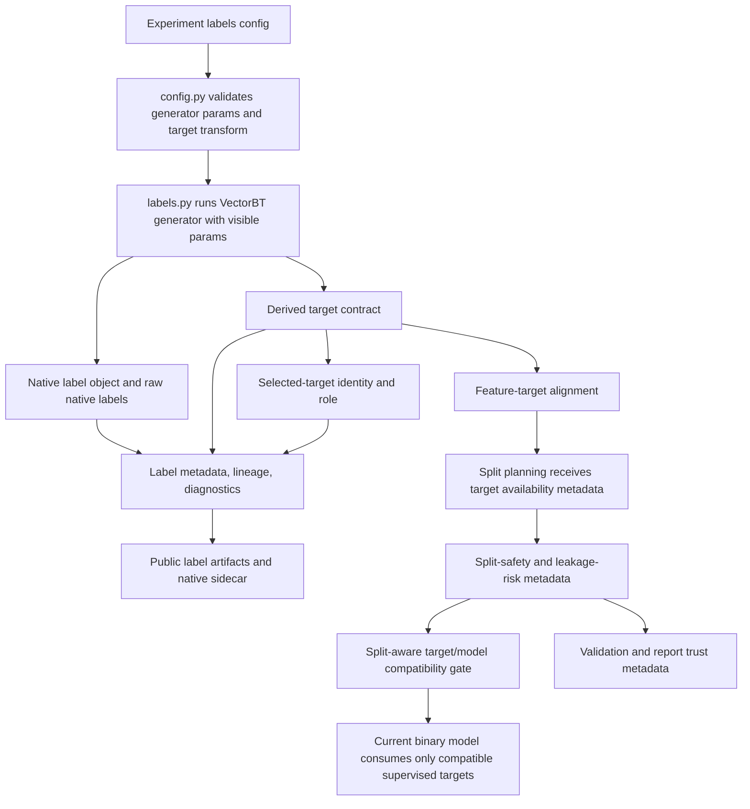

# feat: Implement VectorBT label contract

## Summary

Implement the label stage as a native-first VectorBT boundary with a separate typed target contract: config validation chooses generator and target semantics, `labels.py` preserves raw VectorBT outputs, experiments pass a selected derived model-ready target to downstream stages, split-safety metadata makes validation leakage assumptions explicit, and provenance records label lineage, diagnostics, target schema, and look-ahead metadata before validation or training.

---

## Problem Frame

`research/aegis_research/labels.py` currently collapses distinct VectorBT label families into binary panels and hides parameter identity before model, split, and artifact boundaries can inspect them. The plan must preserve native target semantics while keeping model-family expansion, signal conversion, and purged CV implementation in their dedicated follow-up issues.

---

## Requirements

- R1. Preserve native `FIXLB`, `TRENDLB`, and `PIVOTLB` objects plus raw native `.labels` separately from model-ready targets. Origin: R1, R2, R11, R12, R13, R15.
- R2. Preserve visible label parameter identity, selected-target identity, and stable symbol identity; do not silently select the first symbol, first parameter value, or treat parameter levels as symbols. Origin: R3, R4, R5, R8.
- R3. Add an explicit target contract for derived model targets, including target kind, transform lineage, positive class or threshold semantics, distributions, diagnostics, and compatibility metadata. Origin: R6, R7, R8, R9, R10.
- R4. Keep label-specific look-ahead, target availability, and split-safety metadata available for split planning and reporting without implementing full purged CV in this issue. Origin: R16, R17.
- R5. Verify feature-target alignment before split construction, then run a split-aware model compatibility gate before validation or model training. Origin: R10, R18.
- R6. Add public-safe label artifacts and native sidecar metadata aligned with the existing indicator/provenance pattern. Origin: R20.
- R7. Update config validation, docs, and tests so invalid label modes, unsafe implicit transforms, ambiguous parameter grids, and unsupported target handoffs are explicit. Origin: R19, R21, R22.

**Origin actors:** A1 experiment author, A2 experiment runner, A3 model training stage, A4 validation split stage, A5 run reviewer or automation agent.

**Origin flows:** F1 build native label generator output, F2 derive a typed model target, F3 hand labels to modeling and validation boundaries.

**Origin acceptance examples:** AE1 FIXLB native returns and threshold lineage, AE2 TRENDLB target-kind typing, AE3 TRENDLB regime role and look-ahead metadata, AE4 PIVOTLB sparse event distribution, AE5 multi-symbol alignment, AE6 unsupported continuous target fails before current model training, AE7 FIXLB unavailable tail rows and evaluation metadata, AE8 target-only label functions are not predictor variables.

---

## Scope Boundaries

- Do not implement regression estimators, multiclass classifiers, or event-model families here; model-family support belongs to #9.
- Do not implement trading-signal conversion for non-probability predictions here; signal semantics belong to #11.
- Do not implement the full purged CV engine here; split construction belongs to #3, using metadata emitted by this work.
- Do not add `PIVOTINFO` to the supervised label-generator contract in v1; preserve it as context for future safe feature/regime work.
- Do not use VectorBT label functions as predictor variables in this issue.
- Do not add backward-compatibility shims for the current lossy binary-only label contract unless a concrete persisted artifact or external consumer requires it.
- Do not replace native VectorBT persistence with portable metadata only; keep native label artifacts eligible for private persistence.

### Deferred to Follow-Up Work

- Model-family consumption of continuous, sparse-event, multiclass, and regime targets: tracked by #9.
- Signal policy for predictions that are not positive-class probabilities: tracked by #11.
- Purged CV construction from target prediction/evaluation intervals: tracked by #3.
- Feature/regime use of `PIVOTINFO.conf_*` or `last_*` outputs: separate future feature/regime contract.

---

## Context & Research

### Relevant Code and Patterns

- `research/aegis_research/labels.py` currently owns `LabelResult`, calls VectorBT label generators, hides params, and immediately derives binary panels.
- `research/aegis_research/config.py` centralizes strict path-aware validation through `ConfigValidationIssue`, `ConfigValidationError`, `_validate_raw_config`, and `_validate_labels`.
- `research/aegis_research/data.py` currently derives required OHLCV features from `LabelConfig.kind`; nested generator config must keep data preflight equivalent.
- `research/aegis_research/indicators.py` provides the native-first stage pattern to mirror: rich result object, native outputs, lineage, diagnostics, and a separate model-boundary object.
- `research/aegis_research/experiments.py` currently passes `label_result.labels` directly into model-feature alignment, split construction, validation, and model training.
- `research/aegis_research/models.py` currently assumes a binary label panel and belongs to #9 for broader estimator/prediction semantics.
- `research/aegis_research/splits.py` owns `ValidationSplitsResult.metadata`, making it the right handoff seam for target availability and split-safety metadata without changing split algorithms.
- `research/aegis_research/provenance/experiment_artifacts.py` already writes indicator metadata, lineage, diagnostics, feature schema, and private native artifacts; labels should follow the same public/private artifact shape.
- `docs/vectorbt-scaffold.md` documents the current label behavior and must be updated because it still states `TRENDLB` remains binary-only in schema v1.

### Institutional Learnings

- `docs/solutions/architecture-patterns/config-contract-security-reproducibility-2026-05-16.md` requires schema-versioned config validation before side effects, path-aware errors, redacted config evidence, and public artifact safety.
- `docs/solutions/best-practices/vectorbt-indicatorfactory-output-shape-contract-2026-05-17.md` reinforces preserving stable index/column/parameter shape and not hiding shape-changing semantics behind indicator-like contracts.
- `docs/solutions/best-practices/vectorbt-run-combs-to-combine-params-2026-05-17.md` supports using ordinary `.run(...)` parameter-list semantics and reserving `run_combs` for multiple object instances.
- `docs/solutions/best-practices/vectorbt-combine-params-conditions-levels-2026-05-17.md` supports resolving inspectable parameter combinations before side effects and persisting grid identity in lineage.
- `docs/solutions/logic-errors/vectorbt-allocation-column-alignment-2026-05-17.md` is the same class of boundary risk: exact index/symbol alignment must be asserted before array-like data enters downstream computation.

### External References

- VectorBT PRO API: `FIXLB.run`, `TRENDLB.run`, `PIVOTLB.run`, `TrendLabelMode`, `Pivot`, and label Numba functions.
- VectorBT PRO docs: label Numba functions may introduce look-ahead bias and should be used only for target variables, not predictor variables.
- VectorBT PRO docs: purged splitters require prediction times and evaluation times so overlapping train/test intervals can be purged and embargoed.
- VectorBT Discord support: `TRENDLB` labels are look-ahead target/regime labels; `PIVOTINFO.conf_*` and `last_*` outputs are a separate confirmed/running pivot context, while `pivots` and `modes` are look-ahead/plotting contexts.

---

## Key Technical Decisions

- Use a dedicated target contract rather than passing raw label DataFrames downstream: This preserves native labels while giving models a small, typed input surface.
- Require one selected model target per experiment in v1: Native parameter sweeps can be preserved in artifacts, but the current model path must not infer multiple training targets from parameter levels.
- Make selected-target identity first-class: lineage must record generator kind, native output name, selected generator parameter coordinate, transform name/version, transform params, symbol level name, and final target panel column identity so downstream code never infers selection from column order.
- Build unsupported target kinds but fail before current model training: Continuous, sparse-event, and regime targets should be inspectable and artifacted, while #9 owns making them trainable.
- Keep label target transforms explicit and named: `FIXLB` thresholding, `TRENDLB` binary identity, and `PIVOTLB` positive-event mapping are model-target transforms, not generator semantics.
- Keep target roles explicit: the current model path consumes only `role=supervised_target`; `role=regime` can be artifacted but must not become trainable merely because its values look binary. Context/feature roles remain reserved for future work and are not accepted in v1.
- Use canonical config strings for `TRENDLB` modes and map them explicitly to VectorBT enums: `binary` -> `Binary`, `binary_cont` -> `BinaryCont`, `binary_cont_sat` -> `BinaryContSat`, `pct_change` -> `PctChange`, and `pct_change_norm` -> `PctChangeNorm`.
- Emit conservative look-ahead metadata for variable-window labels: `FIXLB` can expose fixed evaluation offsets; `TRENDLB` and `PIVOTLB` should mark the future window as variable or unknown until #3 implements a stronger purged-CV contract.
- Add a split-safety contract before #3: validation and report metadata should include prediction/evaluation timing shape, unavailable target rows, `purging_required`, `purging_applied=false`, leakage-risk class, and validation suitability status; metrics from required-but-unapplied purging run only as diagnostic/non-decision-grade evidence.
- Mirror indicator artifacts for labels: public metadata, lineage, diagnostics, target schema, and private native objects make label review possible without loading native pickles.
- Write public label metadata before intentional model incompatibility failures: target/model incompatibility should leave complete label diagnostics where target derivation succeeded; target derivation failure may leave only failed status evidence; native sidecar failure should not invalidate safe public target metadata.
- Persist split-aware compatibility outcomes separately: per-split class availability and model-gate failures are discovered after label artifacts, so they need a post-split public artifact rather than mutating completed label diagnostics.
- Keep config validation strict but not model-family-specific: Reject invalid label semantics and unsafe transforms at config time; reject target/model incompatibility at the target/model boundary where current model capabilities are known.

---

## Open Questions

### Resolved During Planning

- When native labels have multiple parameter combinations, should v1 train multiple targets? No. Preserve native sweeps in outputs/artifacts, but require a single selected derived model target for the current experiment path.
- Should continuous or sparse targets be rejected during config validation while #9 is out of scope? No. They can be built and artifacted when semantically valid, then fail at the current binary model boundary with typed compatibility diagnostics.
- Should `PIVOTINFO` enter this implementation? No. It remains contextual guidance for future feature/regime work, not part of the supervised label-generator contract.
- Which `TRENDLB` mode spellings should config accept? Use canonical snake-case config strings and map them explicitly to VectorBT enum names: `binary`, `binary_cont`, `binary_cont_sat`, `pct_change`, and `pct_change_norm`.
- Where should split-safety metadata live before #3? In label target metadata, `ValidationSplitsResult.metadata`, validation metadata, and report artifacts; split algorithms remain unchanged until #3.

### Deferred to Implementation

- Exact Python dataclass and helper names: Implementation should fit existing module style while preserving the public config/artifact fields sketched below.
- Exact native label bundle shape: Implementation should verify the native writer can persist the chosen native object/output bundle and adjust to a simple container if needed.
- Exact fixed/variable evaluation-time encoding internals: Implementation should keep it portable and conservative enough for #3 to consume without over-claiming leakage safety, while preserving the public split-safety fields named in this plan.

---

## High-Level Technical Design

> *This illustrates the intended approach and is directional guidance for review, not implementation specification. The implementing agent should treat it as context, not code to reproduce.*



### V1 Contract Shape

This illustrates the public contract shape and is directional guidance for review, not implementation code. Python class names may change during implementation, but the semantic fields should remain stable unless the plan and docs are updated together.

**Config shape:**

```yaml
labels:
  generator:
    kind: fixlb | trendlb | pivotlb
    params:
      n: [1, 5]
      mode: binary | binary_cont | binary_cont_sat | pct_change | pct_change_norm
      up_th: 0.05
      down_th: 0.05
  target:
    role: supervised_target | regime
    source_output: labels
    select:
      params:
        n: 5
        mode: binary
    transform:
      name: threshold_future_return | identity_binary | continuous_identity | positive_event
      version: 1
      params:
        threshold: 0.0
        positive_value: 1
split:
  diagnostic_validation_allowed: false
```

**Target schema fields:**
- `schema_version`: target-contract schema version.
- `target_kind`: `binary_classification`, `continuous`, `sparse_event`, or `regime`.
- `target_role`: `supervised_target` or `regime`; context/feature roles are reserved for future work and rejected in v1 configs.
- `source`: generator kind, native output name, native params, selected parameter coordinate, and symbol level name.
- `transform`: transform name, version, params, positive class/value, threshold, and native-to-derived value mapping.
- `panel`: timestamp index identity, symbol columns, shape, dtype summary, and selected target panel identity.
- `diagnostics`: native distribution, derived distribution, NaN counts, dropped rows, unavailable target rows, event rate or imbalance where applicable.
- `split_safety`: prediction-time shape, evaluation-time shape or horizon class, `purging_required`, `purging_applied`, leakage-risk class, and validation suitability.
- `model_compatibility`: pre-split static target/model compatibility summary; post-split outcomes live in `labels.compatibility`.

**Public artifact ids:** `labels.metadata`, `labels.lineage`, `labels.diagnostics`, `labels.target.schema`, `labels.compatibility`, and private `labels.native` with a public sidecar.

---

## Implementation Units

Implementation order follows each unit's `Dependencies` field and document order, not numeric U-ID order. U-IDs are stable references preserved after deepening, so `U4` intentionally appears before `U3` because label artifact persistence must exist before split-aware compatibility failures can persist diagnostics.

### U1. Define Label Config And Target Contract

**Goal:** Extend the label configuration contract so generator selection, generator params, target transform, target role, and parameter-grid semantics are explicit and validated before VectorBT calls or artifact writes.

**Requirements:** R2, R3, R7; origin R3, R4, R6, R7, R8, R10, R19, R21; F1, F2; AE1, AE2, AE4, AE8.

**Dependencies:** None.

**Files:**
- Modify: `research/aegis_research/config.py`
- Modify: `research/aegis_research/data.py`
- Test: `tests/research/aegis_research/test_config_contract.py`
- Test: `tests/research/aegis_research/test_market_data_contract.py`

**Approach:**
- Expand `LabelConfig` from implicit scalar fields into a generator-plus-target shape while preserving schema-versioned, forward-first config semantics.
- Use the V1 contract shape in this plan as the public YAML/config baseline: generator kind/params are separate from target role/source/selection/transform.
- Validate label kind, generator params, mode enum values, target transform compatibility, positive class/value, threshold semantics, and grid selection before data loading or native label generation.
- Keep generator params distinct from target transform params so `FIXLB.n`, `TRENDLB.up_th/down_th/mode`, and `PIVOTLB.up_th/down_th` do not get conflated with target thresholds or positive event mapping.
- Introduce explicit selected-target identity in config for native parameter sweeps, including generator parameter coordinate and target transform coordinate.
- Support valid non-binary modes as native labels and typed targets, but do not claim current model compatibility for them.
- Accept canonical `TRENDLB` mode strings `binary`, `binary_cont`, `binary_cont_sat`, `pct_change`, and `pct_change_norm`, and map them to VectorBT `TrendLabelMode` fields `Binary`, `BinaryCont`, `BinaryContSat`, `PctChange`, and `PctChangeNorm`.
- For v1 model training, require the config to select one derived model target from any native parameter sweep.
- Add and validate `split.diagnostic_validation_allowed` as a default-false boolean opt-in for producing non-decision-grade validation metrics when purging is required but not applied.
- Update data requirement preflight so nested generator config still resolves label kind before loading market data: `FIXLB` remains close-only; `TRENDLB` and `PIVOTLB` require high/low.
- Leave shipped baseline YAML migration to U5 so config schema ownership and end-to-end baseline verification do not edit the same files with different intent.

**Execution note:** Start with config-contract tests because invalid label configs must fail before VectorBT calls or run artifacts.

**Patterns to follow:**
- Path-aware validation and issue aggregation in `research/aegis_research/config.py`.
- Indicator spec validation patterns for ids, params, grid semantics, outputs, and transforms in `research/aegis_research/config.py`.
- Config contract learning in `docs/solutions/architecture-patterns/config-contract-security-reproducibility-2026-05-16.md`.

**Test scenarios:**
- Happy path: `FIXLB` config with an explicit future-return threshold target validates and resolves generator params separately from target transform params.
- Happy path: `TRENDLB(mode="binary")` with an identity binary target validates with explicit positive-class metadata.
- Happy path: `TRENDLB(mode="pct_change")` validates as a continuous target but carries current-model incompatibility metadata for later boundary failure.
- Happy path: each canonical `TRENDLB` config mode maps to the intended VectorBT enum field, while legacy typo-like spellings such as `pctchange` fail with path-aware `labels.generator.params.mode` issues.
- Happy path: `PIVOTLB` with valley-event target validates only when positive value maps to supported native pivot semantics.
- Edge case: label config with visible native parameter list and exactly one selected model target validates without treating parameter values as symbols.
- Integration: nested generator config still lets `required_ohlcv_features()` return close-only requirements for `FIXLB` and close/high/low requirements for `TRENDLB` and `PIVOTLB` before data loading.
- Error path: missing `split.diagnostic_validation_allowed` defaults to false, non-boolean values fail config validation, and look-ahead validation cannot silently become decision-grade.
- Error path: unknown label kind, unsupported mode, invalid pivot positive value, ambiguous target transform, or inconsistent grid semantics produce path-aware config issues.
- Error path: config attempting to use label-generator output as a model feature or predictor variable is rejected or requires a future explicit feature/regime contract.

**Verification:**
- Static config validation rejects invalid label semantics before experiment side effects.
- Data preflight reads the new label config shape without changing label-kind-specific OHLCV requirements.

### U2. Build Native-First Label Results

**Goal:** Refactor label generation so `LabelResult` carries native VectorBT objects, raw native label outputs, selected target output, lineage, diagnostics, look-ahead metadata, and portable metadata without collapsing everything into binary labels.

**Requirements:** R1, R2, R3, R4; origin R1, R2, R3, R4, R5, R9, R11, R12, R13, R15, R16, R17; F1, F2; AE1, AE2, AE3, AE4, AE7.

**Dependencies:** U1.

**Files:**
- Modify: `research/aegis_research/labels.py`
- Test: `tests/research/aegis_research/test_labels.py`
- Test: `tests/research/aegis_research/test_stage_provenance.py`

**Approach:**
- Expand `LabelResult` into an immutable stage result that separates raw native labels from derived target panels.
- Run VectorBT label generators with visible parameter settings by default, matching the indicator contract.
- Normalize native label outputs into DataFrames that preserve parameter and symbol levels while keeping a model-target panel shape with exactly one target per configured symbol.
- Resolve selected-target identity before model-boundary normalization, preserving generator parameter identity separately from symbol identity.
- Derive targets through named transforms: future-return thresholding for `FIXLB`, binary identity/mapping for `TRENDLB(mode="binary")`, continuous target typing for continuous `TRENDLB` modes, and sparse event mapping for `PIVOTLB`.
- Record native distribution, target distribution, NaNs, unavailable boundary rows, target kind, role, selected-target identity, and compatibility metadata.
- Treat target role as part of the contract: `supervised_target` is the only role eligible for current model training; regime roles are artifactable but not trainable in this issue; context/feature roles are rejected as reserved future values.
- Emit conservative look-ahead metadata: fixed `FIXLB` horizons should expose unavailable tail rows and evaluation offset; `TRENDLB` and `PIVOTLB` should mark evaluation windows as variable or unknown until #3 consumes a richer contract.

**Execution note:** Characterize current `FIXLB`, `TRENDLB`, and `PIVOTLB` native values first, then replace binary conversion with explicit target transforms.

**Patterns to follow:**
- `IndicatorResult` and `ModelFeatureMatrix` separation in `research/aegis_research/indicators.py`.
- Existing `LabelResult` native-object metadata pattern in `research/aegis_research/labels.py`.
- VectorBT docs for `FIXLB.run`, `TRENDLB.run`, `PIVOTLB.run`, `TrendLabelMode`, and `Pivot`.

**Test scenarios:**
- Covers AE1. Happy path: `FIXLB` with horizons `[1, 5]` preserves both native `n` levels, selects exactly one configured model target horizon, emits a timestamp-by-symbol target panel, and records threshold transform lineage separately from native future returns.
- Covers AE2. Happy path: `TRENDLB(mode="binary")` produces a binary classification target, while `TRENDLB(mode="pct_change")` produces a continuous target contract.
- Covers AE3. Happy path: `TRENDLB(mode="binary")` can be tagged as a regime role separately from a supervised target role, and regime role metadata prevents accidental model training.
- Covers AE4. Happy path: `PIVOTLB` preserves native `-1/0/1` distribution and derived valley/peak event target reports event rate and imbalance.
- Covers AE7. Edge case: `FIXLB(n=5)` records final five rows as unavailable for target evaluation and exposes fixed evaluation offset metadata.
- Edge case: single-symbol inputs remain one-column target panels; multi-symbol inputs preserve all symbols without squeezing or first-column selection.
- Error path: native output with multiple parameter combinations and no selected model target fails before producing a model-ready target panel.
- Error path: selected target resolution fails when a requested parameter coordinate is absent from native labels or when parameter levels are flattened into symbol columns.
- Error path: selected target resolution fails unless the selected parameter coordinate maps one-to-one to exactly one native slice before target-panel normalization; duplicate, unnamed, or non-canonical parameter levels produce path-aware diagnostics.
- Error path: all-NaN target, empty target, or unsupported transform produces explicit diagnostics rather than silent fallback.

**Verification:**
- `build_label_result` returns native labels, derived target, metadata, lineage, diagnostics, and look-ahead metadata for each supported label kind.
- Existing callers that need model-ready labels can get the selected target panel without loading native VectorBT objects.
- Public metadata can identify the selected model target without inspecting native MultiIndex column order.

### U4. Persist Label Metadata, Lineage, Diagnostics, Target Schema, And Native Artifacts

**Goal:** Add label artifact writing so public artifacts explain native labels, derived targets, transforms, diagnostics, and compatibility while private native persistence preserves VectorBT label objects.

**Requirements:** R1, R3, R4, R6; origin R1, R2, R8, R9, R16, R17, R20; F1, F2, F3; AE1, AE4, AE6, AE7.

**Dependencies:** U2.

**Files:**
- Modify: `research/aegis_research/provenance/experiment_artifacts.py`
- Modify: `research/aegis_research/provenance/native.py` if the native bundle needs a small adapter
- Test: `tests/research/aegis_research/test_experiment_provenance.py`
- Test: `tests/research/aegis_research/test_vectorbt_artifacts.py`
- Test: `tests/research/aegis_research/test_stage_provenance.py`

**Approach:**
- Add a label artifact writer method analogous to `write_indicator_artifacts`.
- Write public-safe `labels.metadata`, `labels.lineage`, `labels.diagnostics`, and `labels.target.schema` artifacts before validation artifacts.
- Add a phase-aware compatibility writer for `labels.compatibility`; U3 invokes it for pre-split alignment/eligibility failures and post-split target/model gate failures before raising.
- Keep `labels.native` as a private artifact with a public metadata sidecar; include native object id, native output shape, and selected target identity rather than native object reprs.
- Run public artifact safety checks against all label metadata payloads.
- Link label artifacts into the manifest with upstream references from config/data; downstream validation references can be added by U3/U5 once validation metadata is wired.
- Preserve diagnostic artifacts for target/model incompatibility failures by writing public label artifacts after target derivation succeeds and before split-aware compatibility checks run.
- Distinguish failure states: target derivation failure should not mark complete public target metadata; target/model incompatibility should keep complete public label diagnostics; native sidecar failure should mark `labels.native` failed without invalidating safe public metadata.

**Patterns to follow:**
- `write_indicator_artifacts` in `research/aegis_research/provenance/experiment_artifacts.py`.
- `NativeArtifactWriter.write_native_artifact` in `research/aegis_research/provenance/native.py`.
- Existing manifest/artifact assertions in provenance tests.

**Test scenarios:**
- Happy path: completed run writes label metadata, lineage, diagnostics, target schema, and private native sidecar with correct manifest entries.
- Happy path: public label artifacts include native distribution, derived target distribution, target kind, transform lineage, and look-ahead metadata.
- Error path: secret-like values or absolute paths in public label metadata are rejected by existing public-safety checks.
- Error path: native label persistence failure marks the native artifact failed without leaving a completed partial file.
- Integration: manifest assertions cover `labels.metadata`, `labels.lineage`, `labels.diagnostics`, `labels.target.schema`, `labels.compatibility`, and `labels.native` IDs, statuses, upstream links, and ordering before validation artifacts.
- Integration: target derivation failure does not leave misleadingly completed public target metadata, while target/model incompatibility leaves completed label diagnostics before the run fails.

**Verification:**
- Run manifests expose label evidence before validation artifacts.
- Public metadata can reconstruct the selected target's source generator, params, transform, symbol identity, target kind, and compatibility state.

### U3. Add Target Boundary Alignment And Compatibility Checks

**Goal:** Route downstream stages through the derived target contract, verify feature-target alignment, carry split-safety metadata, and fail before validation/model execution when the target role, kind, shape, or per-split class distribution is unsupported.

**Requirements:** R3, R4, R5; origin R7, R8, R9, R10, R14, R16, R17, R18; F2, F3; AE5, AE6, AE7.

**Dependencies:** U2, U4.

**Files:**
- Modify: `research/aegis_research/indicators.py`
- Modify: `research/aegis_research/experiments.py`
- Modify: `research/aegis_research/models.py`
- Modify: `research/aegis_research/splits.py`
- Modify: `research/aegis_research/validation.py`
- Modify: `research/aegis_research/reports.py`
- Modify: `research/aegis_research/provenance/experiment_artifacts.py`
- Test: `tests/research/aegis_research/test_labels.py`
- Test: `tests/research/aegis_research/test_indicators.py`
- Test: `tests/research/aegis_research/test_models.py`
- Test: `tests/research/aegis_research/test_reports.py`
- Test: `tests/research/aegis_research/test_experiment_provenance.py`
- Test: `tests/research/aegis_research/test_validation_artifacts.py`

**Approach:**
- Update the model-feature boundary to consume a selected target panel and target metadata, not arbitrary native label output columns.
- Preserve exact timestamp and symbol alignment between features and target after invalid-value handling; fail on missing, extra, or reordered symbols before split construction.
- Pass target availability and look-ahead metadata into split metadata through `ValidationSplitsResult.metadata`, without changing split algorithms or implementing purged CV in this issue.
- Add a split-safety contract that records prediction timestamp shape, evaluation timestamp or horizon class, unavailable target rows, `purging_required`, `purging_applied=false`, leakage-risk class, validation suitability status, and whether diagnostic validation was explicitly enabled.
- Add a distinct split-aware compatibility gate after split construction and before validation/model/signal execution: it checks target role, target kind, timestamp-by-symbol shape, model kind, and both-class availability in each training split.
- When `purging_required=true` and `purging_applied=false`, fail closed unless `split.diagnostic_validation_allowed=true`; allowed runs are diagnostic/non-decision-grade, and report/portfolio promotion or other decision-grade consumers must reject them by default.
- Update report status logic so diagnostic/non-decision-grade validation cannot produce a decision-grade survived status solely from metric thresholds.
- Persist phase-aware gate results in `labels.compatibility` before raising, including phase (`pre_split` or `post_split`), target role/kind, model kind when available, split labels and class counts when available, leakage-risk status, validation suitability, diagnostic-validation opt-in status, and failure reason.
- Keep continuous, sparse-event, and regime target contracts buildable and artifactable, but fail with typed incompatibility before training until #9 adds estimator semantics.
- Keep non-probability prediction and signal policy out of scope; diagnostics for unsupported target/prediction semantics should point to #9 and #11 as appropriate.

**Patterns to follow:**
- Existing `_validate_feature_label_symbols` and `build_model_feature_matrix` behavior in `research/aegis_research/indicators.py`.
- Current training dataset shape in `research/aegis_research/models.py`.
- Validation split metadata pattern in `research/aegis_research/validation.py` and `research/aegis_research/splits.py`.

**Test scenarios:**
- Covers AE5. Happy path: multi-symbol feature and target panels with matching symbols align deterministically; for a fixed fixture such as 10 daily rows, 2 feature warmup rows, and `FIXLB(n=2)` final unavailable rows, the eligible index excludes both boundaries and preserves the expected contiguous middle range.
- Covers AE6. Error path: continuous target contract reaches the split-aware compatibility gate after label diagnostics are written, then fails before `train_model` or sklearn treats it as a classifier target.
- Error path: binary target with only one class in any training split fails with class-count diagnostics before sklearn receives data.
- Happy path: valid binary supervised target with both classes in every train split reaches model training through the explicit target contract.
- Error path: `role=regime` or any reserved future role fails the current model path even when the values are binary.
- Error path: a model-compatible binary target with `purging_required=true`, `purging_applied=false`, and no explicit diagnostic opt-in fails closed before validation/model execution.
- Error path: a model-compatible binary target with explicit diagnostic opt-in proceeds only with diagnostic/non-decision-grade validation metadata and is rejected by decision-grade report/portfolio promotion paths by default.
- Error path: `build_survival_report` or its replacement returns a non-decision-grade status for diagnostic validation even when raw OOS metrics clear configured thresholds.
- Error path: target symbols missing from features, feature symbols missing from target, or native parameter levels masquerading as symbols fail before split construction.
- Edge case: target rows dropped due to `FIXLB` horizon are counted separately from feature warmup rows and native label NaNs.
- Integration: pre-split alignment/eligibility failures and post-split target/model gate failures write `labels.compatibility` with phase-appropriate evidence and failure reason before the run is marked failed.
- Integration: `ValidationSplitsResult.metadata`, validation artifacts, and report validation metadata include target kind, compatibility status, selected target schema, unavailable target rows, `purging_required`, `purging_applied=false`, leakage-risk class, and look-ahead availability metadata.

**Verification:**
- Current binary baselines still train through an explicit binary supervised-target contract.
- Unsupported target kinds, roles, shapes, or per-split class distributions fail at the split-aware target/model boundary with diagnostics that point to #9 rather than producing sklearn errors.
- Validation and report artifacts never imply purged or leakage-safe validation unless split metadata proves it.
- Reports cannot mark diagnostic/non-decision-grade validation as survived decision evidence.
- Split-aware incompatibility diagnostics survive as structured public metadata even when the run fails before validation/model execution.

### U5. Integrate Experiment Flow, Docs, And Baseline Behavior

**Goal:** Wire the label contract through `run_experiment`, update scaffold documentation and baseline configs, and keep existing binary baseline experiments exercising the same research intent through explicit target semantics.

**Requirements:** R3, R4, R5, R6, R7; origin R10, R16, R18, R19, R20, R21, R22; F3; AE5, AE6, AE8.

**Dependencies:** U1, U2, U4, U3.

**Files:**
- Modify: `research/aegis_research/experiments.py`
- Modify: `docs/vectorbt-scaffold.md`
- Modify: `research/configs/experiments/synthetic_ml_baseline.yaml`
- Modify: `research/configs/experiments/synthetic_trendlb_baseline.yaml`
- Modify: `research/configs/experiments/synthetic_walkforward_baseline.yaml`
- Test: `tests/research/aegis_research/test_experiments_holdout.py`
- Test: `tests/research/aegis_research/test_experiments_walkforward.py`
- Test: `tests/research/aegis_research/test_reports.py`
- Test: `tests/research/aegis_research/test_validation_artifacts.py`
- Test: `tests/research/aegis_research/test_market_data_quality.py`

**Approach:**
- Update orchestration order explicitly: resolve config, load data requirements, build indicators, build native label result, derive or select the target contract, write safe public label artifacts, perform feature-target alignment, build splits from the cleaned eligible index, run split-aware target/model compatibility, then enter validation/model/signal/portfolio execution only if compatible.
- Keep data requirements intact: `FIXLB` requires close; `TRENDLB` and `PIVOTLB` require high and low.
- Update baseline configs to express their current binary targets explicitly rather than relying on implicit conversion in `labels.py`; U1 owns config schema validation, while U5 owns shipped baseline YAML migration and end-to-end verification.
- Set `split.diagnostic_validation_allowed=true` only for baseline configs that intentionally keep running under unpurged look-ahead diagnostics until #3 supplies purged CV.
- Update `docs/vectorbt-scaffold.md` so label mode documentation reflects native label preservation, typed target transforms, and current model compatibility limits.
- Preserve public API intent where possible: helper methods may expose the selected target panel for existing call sites, but native labels and target contracts remain first-class internally.

**Patterns to follow:**
- Existing orchestration order in `research/aegis_research/experiments.py`.
- Data requirement behavior in `research/aegis_research/data.py` and `required_ohlcv_features`.
- Scaffold documentation style in `docs/vectorbt-scaffold.md`.

**Test scenarios:**
- Happy path: synthetic `FIXLB` baseline runs through explicit target transform and produces the same binary baseline intent.
- Happy path: synthetic `TRENDLB(mode="binary")` baseline runs through explicit binary target semantics.
- Happy path: baseline configs that opt into diagnostic validation produce non-decision-grade validation/report metadata rather than decision-grade survival evidence.
- Integration: existing walkforward/trendlb baseline coverage keeps passing and asserts new label artifact or metadata expectations for `synthetic_trendlb_baseline.yaml` and `synthetic_walkforward_baseline.yaml`.
- Covers AE8. Error path: config or code path that tries to feed native look-ahead labels as model features is rejected before model training.
- Integration: close-only `FIXLB` experiments still allow missing optional high/low features, while `TRENDLB` and `PIVOTLB` still require high/low.
- Integration: validation metadata includes target contract summaries and label artifacts appear before validation artifacts in the manifest.
- Integration: run manifest ordering shows completed public label artifacts and any post-split `labels.compatibility` artifact before validation artifacts, target derivation failure does not mark public target metadata complete, and failed native label persistence marks only the native artifact failed.

**Verification:**
- Existing baseline experiments remain runnable for binary targets through the new explicit contract.
- Documentation no longer claims `TRENDLB` is binary-only as a native label mode; it clarifies that current model training remains binary-only until #9.
- End-to-end run artifacts make validation trust status visible before reviewers interpret metrics.
- Report status honors validation trust status and cannot promote diagnostic validation to decision-grade evidence.

---

## System-Wide Impact

- **Interaction graph:** Config validation feeds data requirements, label generation, target derivation, feature-target alignment, split construction, validation, model training, artifacts, and reports.
- **Sequencing invariant:** Public label metadata, lineage, diagnostics, and target schema are written after target derivation succeeds and before split-aware target/model compatibility can intentionally fail a run.
- **Split-safety seam:** `ValidationSplitsResult.metadata`, validation metadata, and report artifacts carry target availability and leakage-risk status so #3 can add purging without reverse-engineering label semantics.
- **Compatibility evidence seam:** `labels.compatibility` carries phase-aware pre-split alignment/eligibility and post-split target/model gate outcomes that cannot be known when initial label artifacts are written.
- **Error propagation:** Config errors should aggregate before side effects; target derivation errors should avoid completed target artifacts; target/model incompatibility should fail after safe label artifacts are available but before validation/model/signal execution; native persistence failures should follow existing artifact failure behavior.
- **State lifecycle risks:** Runs should not leave completed label artifacts when target derivation fails, and should not mark native sidecars complete after native persistence failure; manifest statuses should remain the source of truth.
- **API surface parity:** `build_labels` may remain as a convenience for selected model targets, but internal orchestration should use the richer label result so native semantics are not lost.
- **Integration coverage:** End-to-end synthetic runs must prove the config-to-label-to-target-to-model path, not just unit-level target transforms.
- **Validation/report trust semantics:** Any validation or report artifact produced from look-ahead labels before #3 must include evaluation-window metadata plus clear `purging_required`, `purging_applied=false`, leakage-risk, and validation-suitability status; reports must not imply purged, leakage-safe, or decision-grade survived validation unless the split contract proves it.
- **Unchanged invariants:** This plan does not change portfolio simulation, probability-to-signal thresholds, model estimator choices, or split algorithms beyond consuming explicit target metadata.

---

## Risks & Dependencies

| Risk | Mitigation |
|------|------------|
| Visible label params create MultiIndex columns that downstream code mistakes for symbols. | Require exactly one selected model target per experiment and normalize selected target panels to timestamp-by-symbol shape before model boundary. |
| Unsupported continuous or sparse targets fail late inside sklearn. | Add explicit target/model compatibility checks before training. |
| Binary-looking regime labels accidentally become supervised model targets. | Require `role=supervised_target` for current model consumption, artifact-only handling for regime roles, and rejection of reserved future roles. |
| Look-ahead metadata over-claims split safety before #3. | Emit conservative fixed/variable/unknown evaluation metadata and `purging_applied=false` rather than claiming purged validation. |
| Diagnostic validation still receives a survived report status. | Update report logic and tests so non-decision-grade validation cannot be promoted by metric thresholds alone. |
| Label artifacts are skipped when a valid but unsupported target fails model compatibility. | Write public label artifacts before split-aware compatibility checks and distinguish target derivation failure from target/model incompatibility. |
| Pre-split or per-split compatibility failures are reduced to a generic run-failed diagnostic. | Persist phase-aware `labels.compatibility` before raising so alignment evidence, class counts, split ids, and failure reasons remain public structured evidence. |
| Artifact payloads leak native object details, paths, or secrets. | Reuse public metadata safety checks and private native sidecar pattern. |
| Config shape churn conflicts with active indicator-contract work. | Mirror indicator config principles but keep label-specific target semantics separate; no backward-compat shims unless a concrete consumer requires them. |
| Baseline docs and configs drift from behavior. | Update `docs/vectorbt-scaffold.md` and shipped synthetic configs in the same integration unit. |

---

## Documentation / Operational Notes

- Update `docs/vectorbt-scaffold.md` label mode documentation to distinguish native label modes, target transforms, current model compatibility, and look-ahead warnings.
- Public run artifacts should make target semantics reviewable without loading private native VectorBT objects.
- Validation/report artifacts should state leakage-risk and `purging_applied=false` until #3 supplies a purged-CV split contract.
- This change is forward-first within schema v1; shipped configs should be migrated in place rather than supported through compatibility branches unless implementation discovers a concrete external consumer.

---

## Sources & References

- **Origin document:** [docs/brainstorms/2026-05-17-vectorbt-label-contract-requirements.md](../brainstorms/2026-05-17-vectorbt-label-contract-requirements.md)
- Related plan: [docs/plans/2026-05-17-001-feat-vectorbt-indicator-contract-plan.md](2026-05-17-001-feat-vectorbt-indicator-contract-plan.md)
- Related issues: #2, #3, #5, #9, #11
- Related code: `research/aegis_research/labels.py`, `research/aegis_research/config.py`, `research/aegis_research/data.py`, `research/aegis_research/experiments.py`, `research/aegis_research/indicators.py`, `research/aegis_research/models.py`, `research/aegis_research/splits.py`, `research/aegis_research/validation.py`, `research/aegis_research/reports.py`, `research/aegis_research/provenance/experiment_artifacts.py`
- VectorBT PRO references: `FIXLB`, `TRENDLB`, `PIVOTLB`, `TrendLabelMode`, `Pivot`, `PIVOTINFO`, purged splitters, and label Numba look-ahead warning
