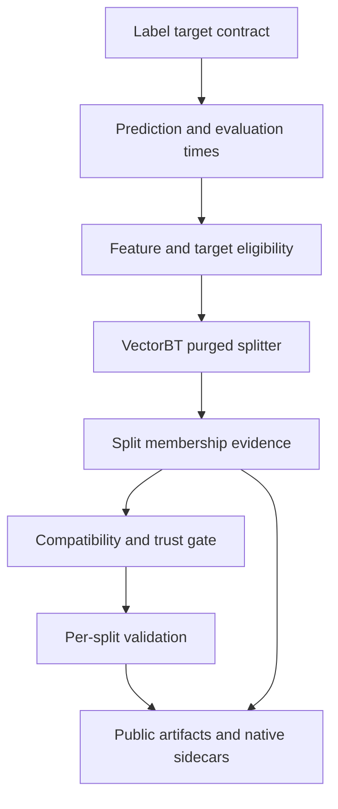
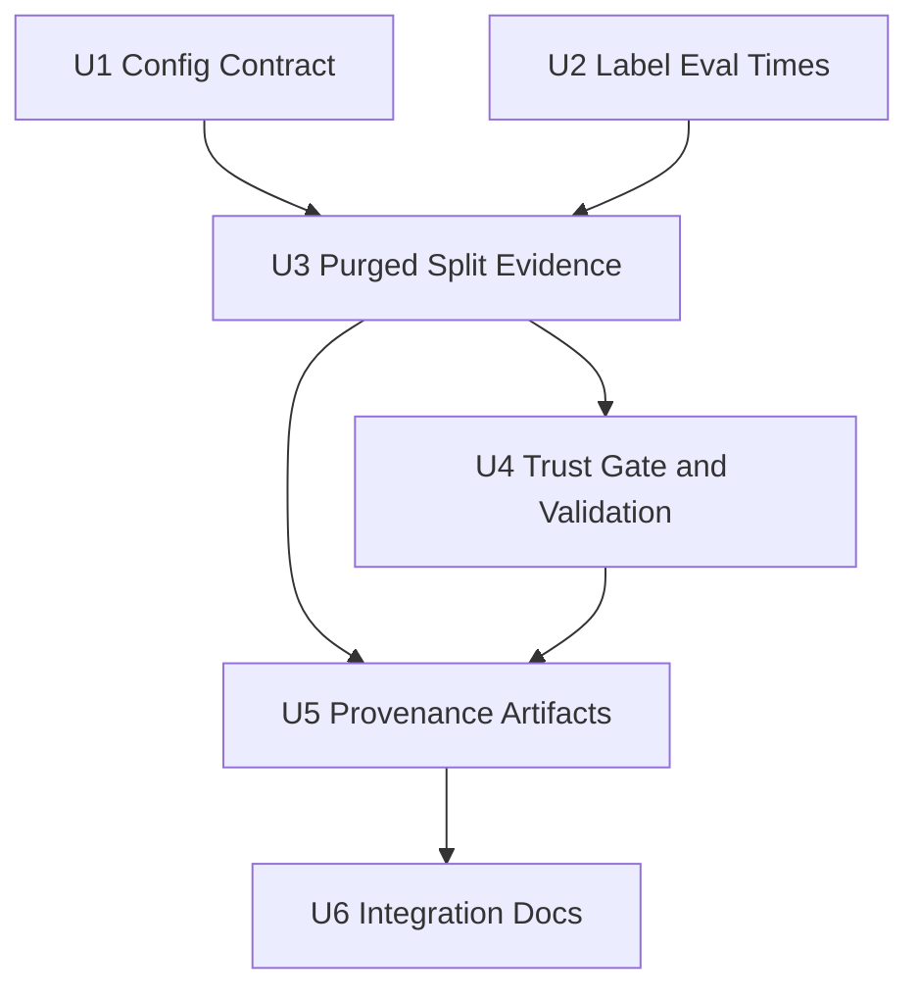

# feat: Add VectorBT Purged Validation Contract

## Summary

Extend the existing research scaffold rather than adding a parallel validation engine: the label stage will emit concrete evaluation-window evidence, split construction will build VectorBT purged memberships from that proof, and validation/provenance/reporting will carry the decision-grade trust state through artifacts.

---

## Problem Frame

The current validation flow can produce diagnostic artifacts for look-ahead labels, but it cannot prove that label evaluation windows were purged before metrics are used as evidence. Issue #3 exists to replace that temporary non-decision-grade state with a single safe purged validation contract (see origin: `docs/brainstorms/2026-05-17-vectorbt-purged-validation-contract-requirements.md`).

---

## Requirements

- R1. Add `purged_kfold` as the decision-grade validation path for supervised look-ahead label targets. Origin: R1, R16.
- R2. Build purged splits from explicit aligned prediction and evaluation time series, with `purge_td` and `embargo_td` recorded as separate VectorBT buffer settings. Origin: R2, R3, R4, R19.
- R3. Support `FIXLB`, `TRENDLB`, and `PIVOTLB` only when exact per-row evaluation times are available; otherwise fail before decision-grade metrics are produced. Origin: R5, R10, R11, R12.
- R4. Preserve one purged split artifact contract with exact membership authoritative and bounds as audit metadata. Origin: R6, R7, R8.
- R5. Preserve split and set identity through probabilities, signals, metrics, portfolio artifacts, aggregate outputs, and manifest evidence. Origin: R9, R13, R14.
- R6. Fail closed on unsafe post-purge states: empty memberships, too few samples, one-class training targets, unsupported metric prerequisites, unknown evaluation windows, ambiguous indexes/times, or incompatible target/model combinations. Origin: R15, R16, R17, R19.
- R7. Update user-facing documentation and implementation notes to answer issue #3's best-practice decisions around split contract, VectorBT splitter use, purging, label look-ahead handoff, artifact identity, and failure conditions. Origin: R18, R20.

**Implementation guardrail from institutional learning:** Emit resource and artifact-size diagnostics after split construction and before expensive purged validation work proceeds, so split count, membership size, and output shape growth are visible before portfolios and aggregate artifacts are produced. Add configurable hard caps for split/output/artifact growth so pathological purged-CV configurations fail before model fitting or portfolio simulation. This is not an added origin requirement, but it keeps the purged validation path operationally reviewable.

**Origin actors:** A1 experiment author, A2 label target stage, A3 split construction stage, A4 validation stage, A5 reviewer or automation agent.
**Origin flows:** F1 build a decision-grade purged split, F2 validate with split/set identity preserved, F3 fail closed when safety cannot be proven.
**Origin acceptance examples:** AE1 FIXLB purged happy path, AE2 TRENDLB unknown eval-time fail-closed, AE3 PIVOTLB exact eval-time panel policy, AE4 gapped membership artifact, AE5 non-purged split kinds are not accepted, AE6 post-purge one-class failure.

---

## Scope Boundaries

- Do not add new estimator families, regression support, multiclass support, or probability semantics; model expansion remains separate from this validation contract.
- Do not add new trading-signal conversion semantics; signal behavior remains downstream work.
- Do not build a custom cross-validation engine while VectorBT splitters can satisfy the contract.
- Do not keep long-lived parallel unpurged validation branches for look-ahead labels.
- Do not treat VectorBT label generators as predictor features.
- Do not claim a label kind is decision-grade merely because the kind is supported; exact evaluation-window evidence is required.

### Deferred to Follow-Up Work

- Test-row-weighted aggregate metrics: preserve current metric-specific aggregate behavior for this issue, record the method per metric, and treat aggregate summaries as descriptive unless/until a weighted or pooled decision metric is explicitly added.
- Explicit non-datetime time mappings: v1 purged validation should require monotonic unique datetime-like indexes unless a future issue defines an auditable mapping from rows to prediction/evaluation times.
- Per-symbol CV paths: v1 should use one conservative row-level membership for panel targets; separate per-symbol split paths can be considered only if row-level policy proves too restrictive.

---

## Context & Research

### Relevant Code and Patterns

- `research/aegis_research/experiments.py` orchestrates label generation, feature alignment, split construction, model compatibility checks, validation, and artifact writes. It is the handoff seam for passing richer label/split metadata and source-specific eligibility diagnostics through the run.
- `research/aegis_research/labels.py` already has a native-first `LabelResult` with `labels`, `native_labels`, `target_schema`, and `split_safety`. Extend this contract instead of deriving safety from transformed target values.
- `research/aegis_research/splits.py` owns `ValidationSplit`, `ValidationSplitsResult`, purged split construction, and split metadata.
- `research/aegis_research/models.py` rejects unpurged look-ahead labels. Preserve the fail-closed posture while recognizing post-split purging proof.
- `research/aegis_research/validation.py` already creates per-split models, train/test probability panels, train/test signals, train/test portfolios, and aggregate metrics. Extend its trust metadata and split/set identity handling instead of collapsing validation into one global output.
- `research/aegis_research/reports.py` consumes validation metadata to decide whether a run survived, was rejected, or needs more evidence. Report trust propagation must be tested alongside validation trust.
- `research/aegis_research/provenance/experiment_artifacts.py` already writes public JSON/CSV artifacts and private native VectorBT artifacts. Follow the existing public sidecar plus private native-object pattern for split evidence.
- `research/aegis_research/config.py` uses strict schema-versioned validation with path-aware errors. New split options should fail before data loading, model training, or VectorBT calls.
- `research/aegis_research/indicators.py` currently owns model feature eligibility. Preserve source-specific feature-invalid and label/evaluation-window-unavailable evidence before the final eligible index collapses rows.
- Existing tests such as `tests/research/aegis_research/test_config_contract.py`, `test_labels.py`, `test_stage_provenance.py`, `test_models.py`, `test_validation_artifacts.py`, `test_reports.py`, and experiment/provenance tests cover most seams this work extends; add `test_splits.py` for the new split-specific contract.

### Institutional Learnings

- `docs/solutions/logic-errors/vectorbt-label-contract-target-lineage-2026-05-17.md`: preserve native VectorBT label semantics and target lineage before model target derivation; issue #3 should consume `split_safety` rather than infer safety from label values.
- `docs/solutions/architecture-patterns/config-contract-security-reproducibility-2026-05-16.md`: validation mode and purging assumptions belong at the strict config boundary and must fail before side effects.
- `docs/solutions/best-practices/vectorbt-indicatorfactory-output-shape-contract-2026-05-17.md`: do not force shape-changing or gapped evidence through a mismatched VectorBT wrapper shape; exact Aegis-owned membership artifacts can be authoritative.
- `docs/solutions/best-practices/vectorbt-execution-timing-nextopen-2026-05-17.md`: purged label validation and portfolio execution timing are distinct assumptions; do not let one imply the other.
- `docs/solutions/performance-issues/vectorbt-large-from-signals-chunking-memory-2026-05-17.md`: purged CV multiplies rows, columns, and portfolio simulations; keep split counts and artifact sizes visible.

### External References

- VectorBT API, `Splitter.from_purged_kfold`: https://vectorbt.pro/pvt_16ebf9ef/api/generic/splitting/base/#vectorbtpro.generic.splitting.base.Splitter.from_purged_kfold.
- VectorBT API, `PurgedKFoldCV`: https://vectorbt.pro/pvt_16ebf9ef/api/generic/splitting/purged/#vectorbtpro.generic.splitting.purged.PurgedKFoldCV.
- VectorBT source, `BasePurgedCV`: requires pandas Series/DataFrame inputs with matching indexes and samples ordered by prediction time; `purge_td` is added to evaluation times for purging training samples.
- VectorBT source, `PurgedKFoldCV`: can produce `C(n_folds, n_test_folds)` split rounds; schema v2 exposes only `n_test_folds: 1` until overlapping CPCV aggregation has non-duplicating decision gates. `embargo_td` excludes training predictions within the embargo period after the latest test evaluation time.
- VectorBT source, `FIXLB`: `fixed_labels_1d_nb` computes `(future close shifted by n - close) / close`, so actual future row timestamps are the correct evaluation times.
- VectorBT source, `PIVOTINFO`: running `conf_pivot` / `conf_idx` expose confirmed pivots, while derived `pivots` and trend labels are look-ahead outputs and cannot alone prove label knowability time.
- VectorBT Cross-validation Applications, "Column stacking": https://vectorbt.pro/pvt_16ebf9ef/tutorials/cross-validation/applications/#column-stacking.
- VectorBT Cross-validation Splitter, "Bounds": https://vectorbt.pro/pvt_16ebf9ef/tutorials/cross-validation/splitter/#bounds.
- VectorBT Cross-validation Splitter, "Scikit-learn": https://vectorbt.pro/pvt_16ebf9ef/tutorials/cross-validation/splitter/#scikit-learn.
- VectorBT Cookbook, "Splitting": https://vectorbt.pro/pvt_16ebf9ef/cookbook/cross-validation/#splitting.
- Discord support on `TRENDLB` future-looking semantics: https://discord.com/channels/918629562441695344/918630948248125512/1104404155361153054.
- Discord support on purged splitter bounds and gapped ranges: https://discord.com/channels/918629562441695344/918630948248125512/1318927881740746833.
- Discord support on manual fold control for `PurgedKFoldCV`: https://discord.com/channels/918629562441695344/918630948248125512/1256246675924717670.

---

## Key Technical Decisions

- Label stage owns evaluation-time proof: `FIXLB`, `TRENDLB`, and `PIVOTLB` semantics are label concerns, so exact per-row evaluation windows should be produced with the selected target contract before split construction.
- Evaluation evidence is a first-class boundary object: the in-memory label result should carry selected-target-aligned prediction/evaluation evidence, and public artifacts should persist compact summaries plus auditable membership/interval evidence after split construction.
- `TRENDLB`/`PIVOTLB` need confirmation-time evidence, not label-value parity: VectorBT source shows pivot/trend labels are written at historical rows but are known only after future pivot confirmation. Decision-grade support is allowed only when Aegis implements an explicit confirmation-time oracle, such as running `PIVOTINFO.conf_idx`/`conf_pivot` semantics or an exact mirrored algorithm, and proves knowability-time parity for supported modes. Otherwise those modes stay fail-closed.
- Terminal/final pivots are unsafe by default: VectorBT pivot outputs can include a final last-pivot marker that has no future confirmation timestamp. Treat such rows as evaluation-time unknown unless the confirmation-time oracle proves otherwise.
- Row-level panel policy: for multi-symbol selected targets, use the latest concrete evaluation time across selected columns for each timestamp and record that policy. This is conservative and keeps one train/test membership per split.
- Datetime-only v1 decision-grade path: because VectorBT purged CV reasons over times, v1 should require monotonic unique datetime-like indexes for `purged_kfold` unless an explicit future row-time mapping contract exists. Also require samples sorted by prediction time, no `NaT`, timezone consistency, `eval_time >= pred_time`, and exact index alignment after feature/target eligibility filtering.
- VectorBT call contract: pass explicit `pd.Series(index=eligible_index)` for `pred_times` and `eval_times`; never rely on VectorBT defaults that substitute the index for missing prediction/evaluation times.
- Strict config extension: expose only purged K-fold fields, with `n_test_folds: 1` as the only decision-grade v2 mode. Include resource caps such as `max_splits`, `max_estimated_output_cells`, and `max_public_artifact_bytes` so oversized purged evidence fails before expensive side effects.
- Membership is authoritative: bounds are useful audit metadata, but gapped purged ranges require exact train/test membership to be preserved and used by validation.
- Trust state is post-split proof, not a label-stage claim: label metadata starts with `purging_required`; split construction can produce `purging_applied` only after VectorBT purged memberships are built from concrete intervals.
- Trust vocabulary must be scoped: issue #3 decision-grade status proves label-window purging and split/set identity for supervised look-ahead labels. It must not imply feature causality, portfolio execution timing, or broader model validity unless separate metadata proves those contracts.
- Compatibility gates split by phase: pre-split checks should validate static target/model compatibility without rejecting purging that is not built yet; post-split checks should enforce purging proof, sample counts, and class counts before fitting.
- Split evidence has its own public schema: add a stable split evidence schema version for memberships, intervals, bounds status, resource estimates, and upstream/downstream artifact links rather than treating this as incidental validation metadata.
- Aggregation stays existing metric-specific for this issue: preserve current aggregate behavior, record the method per metric, and keep per-split test metrics as the decision evidence. Aggregate summaries are descriptive until weighted or pooled decision metrics are added.
- Resource estimates checkpoint expensive validation: after split construction, estimate split/set counts, membership cardinalities, output panel shapes, and artifact volume before running per-split model and portfolio work. Fail closed only for already-invalid states or configured hard caps; otherwise persist diagnostics as reviewable metadata.

---

## Open Questions

### Resolved During Planning

- Should exact evaluation times for `TRENDLB` and `PIVOTLB` be generated in labels or inferred inside split construction? Resolve in labels. The label stage has the native high/low inputs, selected params, target role, and native label output needed to produce auditable evaluation-window metadata.
- What happens when `TRENDLB` or `PIVOTLB` evaluation times remain unknown? Fail closed before decision-grade metrics. Do not use conservative guesses that cannot prove leakage removal.
- What multi-symbol policy should v1 use? Use a conservative latest-evaluation-time-per-row policy and record it. Reject rows or runs where any required selected target column lacks evaluation time.
- How should purged aggregate metrics behave? Preserve current metric-specific aggregate behavior and record the method per metric. Do not introduce weighted aggregation in this issue, and do not let descriptive aggregate summaries replace per-split test evidence.
- When should unavailable rows be excluded and counted? Label unavailable rows and evaluation-window-unavailable rows should be counted before split construction; feature invalid rows should remain model-feature diagnostics; purged rows should be counted per split.
- How should the current pre-split compatibility gate avoid blocking purged validation? Split it into static pre-split target/model checks and post-split trust checks that run after purged memberships exist.
- Who owns report trust propagation? Validation owns decision-grade metadata; report generation must consume it so non-decision-grade runs cannot survive by metrics alone.
- How should exact membership remain auditable without huge artifacts? Use compact portable membership representation where possible, falling back to sparse index arrays for genuinely gapped memberships and recording size diagnostics.
- What does decision-grade mean in this issue? It means the label evaluation windows were purged and split/set identity was preserved; it does not certify feature causality or portfolio execution timing.
- What exact VectorBT time objects should split construction pass? Use explicit `pd.Series` objects for prediction and evaluation times with the eligible index as their index. This makes alignment auditable and prevents VectorBT from silently defaulting missing times to the data index.

### Deferred to Implementation

- Exact helper boundaries for deriving pivot confirmation times: implementation should keep the logic testable and close to label metadata generation, but final helper names and factoring can follow the smallest clear code shape.
- Exact helper and artifact names: follow existing artifact writer conventions and manifest constraints while preserving a stable schema version and clear split evidence role.
- Exact resource thresholds: the plan requires estimates and diagnostics before validation; hard stop thresholds can be tuned during implementation based on existing run sizes and test fixtures.
- Exact split evidence storage representation: prefer compact ranges when memberships are contiguous, but fall back to sparse integer indexes for gapped memberships and record the chosen representation.
- Exact hard-cap defaults: implementation should choose conservative defaults that keep synthetic examples small while allowing explicit config increases for larger research runs.

---

## High-Level Technical Design

> *This illustrates the intended approach and is directional guidance for review, not implementation specification. The implementing agent should treat it as context, not code to reproduce.*

The important ordering is that label evaluation evidence exists before split construction, and decision-grade trust is assigned only after split construction proves purging was applied to concrete intervals.

---

## Implementation Units

**Execution-order note:** U4 contains two gates with different timing. The static pre-split target/model compatibility refactor must land before routing `purged_kfold` through `run_experiment`; the post-split trust/sample/metric checks land after U3 produces purging evidence. U5 also has a pre-validation split-evidence writer that should land with U3, while downstream validation/report artifact links continue after U4.

### U1. Extend Split Config Contract

**Goal:** Add strict config support for `purged_kfold` and remove non-purged experiment split modes from the public validation contract.

**Requirements:** R1, R2, R6, R7

**Dependencies:** None

**Files:**
- Modify: `research/aegis_research/config.py`
- Test: `tests/research/aegis_research/test_config_contract.py`

**Approach:**
- Extend the split kind enum with `purged_kfold`.
- Add explicit fields for fold counts and time-based purge/embargo buffers.
- Reject invalid fold relationships and negative or malformed time buffers.
- Require `n_test_folds: 1`, compute the resulting split count during validation or split construction, and fail before side effects when it exceeds configured caps.
- Add configurable hard caps for split/output/artifact growth, at minimum `max_splits`, `max_estimated_output_cells`, and `max_public_artifact_bytes`.
- Remove the diagnostic-validation escape hatch from the experiment contract; current look-ahead label generators require `purged_kfold`.

**Execution note:** Start with config validation tests because this is a public contract boundary and invalid configs should fail before side effects.

**Patterns to follow:**
- Path-aware validation in `research/aegis_research/config.py`.
- Existing split validation tests in `tests/research/aegis_research/test_config_contract.py`.

**Test scenarios:**
- Happy path: config with `split.kind: purged_kfold`, valid fold counts, and valid time buffers resolves to `SplitConfig` without changing unrelated defaults.
- Error path: `n_folds < 2` or `n_test_folds != 1` fails with a split config path.
- Error path: malformed or negative `purge_td` / `embargo_td` fails before experiment side effects.
- Error path: split count or estimated output/artifact size exceeding configured caps fails before model fitting or portfolio simulation.
- Error path: removed non-purged split fields such as `embargo_bars`, `train_size`, and `length` are rejected as unknown config fields.
- Regression: `holdout` and `rolling` split kinds fail config validation.

**Verification:**
- Config loading has an explicit `purged_kfold` contract, and invalid purged split settings fail at config validation rather than inside VectorBT or validation.

### U2. Emit Concrete Label Evaluation Times

**Goal:** Extend the label target contract so split construction can consume prediction/evaluation windows for `FIXLB`, `TRENDLB`, and `PIVOTLB` without reverse-engineering label semantics.

**Requirements:** R2, R3, R6

**Dependencies:** None

**Files:**
- Modify if required OHLCV availability contracts need tightening: `research/aegis_research/data.py`
- Modify: `research/aegis_research/labels.py`
- Test: `tests/research/aegis_research/test_labels.py`

**Approach:**
- For `FIXLB`, convert the selected fixed horizon into per-row evaluation timestamps using the actual future row timestamps, not a fixed timedelta assumption.
- For `TRENDLB` and `PIVOTLB`, derive pivot confirmation/evaluation timestamps from high/low data and selected thresholds only via an explicit confirmation-time oracle, such as `PIVOTINFO.conf_idx`/`conf_pivot` running semantics or an exact mirrored algorithm.
- Make decision-grade `TRENDLB`/`PIVOTLB` support conditional on knowability-time evidence, not label-value parity alone. If the implementation cannot prove knowability time for a supported mode, parameterization, or terminal pivot, keep that row/mode fail-closed.
- Preserve `variable_unknown` as a fail-closed state only when exact evaluation times cannot be produced.
- Record target availability separately from feature invalid rows and later purged rows.
- Keep native labels, selected target values, target schema, diagnostics, and split-safety metadata aligned by the selected target coordinate.

**Execution note:** Add characterization-style tests against small synthetic price paths before changing trust metadata; the tests should show exactly which rows have labels and when those labels become knowable.

**Patterns to follow:**
- Native-first label flow in `build_label_result`.
- Existing `FIXLB`, `TRENDLB`, and `PIVOTLB` semantic tests in `tests/research/aegis_research/test_labels.py`.
- Label lineage pattern from `docs/solutions/logic-errors/vectorbt-label-contract-target-lineage-2026-05-17.md`.

**Test scenarios:**
- Covers AE1. Happy path: `FIXLB(n=5)` on a datetime index records evaluation timestamps five rows ahead and marks the tail rows unavailable.
- Happy path: irregular datetime index with `FIXLB(n=2)` records actual future row timestamps rather than assuming a constant interval.
- Covers AE2. Error path: `TRENDLB` metadata that cannot derive exact evaluation times fails before validation.
- Covers AE3. Happy path: `PIVOTLB` on a synthetic path records pivot-event evaluation timestamps that correspond to future confirmation, not just the pivot row.
- Adversarial cases: ties, equal highs/lows, threshold boundaries, NaNs, parameter sweeps, and delayed confirmations either match the confirmation-time oracle or remain fail-closed.
- Error path: final/terminal pivot labels without a future confirmation timestamp are marked evaluation-time unknown and cannot become decision-grade evidence.
- Edge case: selected target coordinate from a parameter sweep has evaluation-time metadata matching only the selected coordinate.
- Edge case: multi-symbol target metadata preserves per-column evaluation-time evidence without selecting the first symbol silently.

**Verification:**
- `LabelResult` carries selected-target-aligned evaluation evidence plus summary `target_schema["split_safety"]` metadata for split construction to build explicit `pred_times` and `eval_times`, or it visibly remains fail-closed.

### U3. Build Purged Split Membership Evidence

**Goal:** Add `purged_kfold` split construction using VectorBT purged splitters while making exact train/test membership the authoritative public contract.

**Requirements:** R1, R2, R3, R4, R6

**Dependencies:** U1, U2

**Files:**
- Modify: `research/aegis_research/experiments.py`
- Modify: `research/aegis_research/indicators.py`
- Modify if pre-split static compatibility refactor lands with experiment wiring: `research/aegis_research/models.py`
- Modify: `research/aegis_research/splits.py`
- Modify if reusable identity helpers are needed: `research/aegis_research/data_schema.py`
- Test: `tests/research/aegis_research/test_splits.py`
- Test: `tests/research/aegis_research/test_stage_provenance.py`
- Test: `tests/research/aegis_research/test_validation_artifacts.py`

**Approach:**
- Add a named in-memory evaluation evidence contract, such as `LabelEvaluationEvidence`, instead of relying only on loose `target_schema["split_safety"]` metadata for per-row arrays.
- Add a `purged_kfold` branch that consumes target split-safety metadata plus evaluation evidence and builds explicit `pd.Series(index=eligible_index)` `pred_times` / `eval_times` for VectorBT.
- Preserve source-specific eligibility evidence before the final eligible index collapses rows: label unavailable, evaluation-window unavailable, feature invalid, and later purged-from-train counts should remain distinguishable.
- Use VectorBT's purged splitter as the split generator, preserving its native object privately while extracting public memberships and metadata.
- Use a single conservative row-level panel policy: latest concrete evaluation time across selected target columns for each timestamp, plus proof that every selected `(timestamp, symbol)` target sample has available evaluation-time evidence and follows the row membership consistently.
- Validate time assumptions before VectorBT calls: monotonic unique datetime-like index, samples sorted by prediction time, no `NaT`, timezone consistency, `eval_time >= pred_time`, and exact alignment with the eligible feature/target index.
- Record drop counts by source: label unavailable, feature invalid, purged from train, test membership retained, and post-purge empty results.
- Compute integer and timestamp bounds when safe, but preserve exact membership and bounds fallback metadata for gapped or non-constant ranges.
- Independently recompute the no-overlap/no-embargo invariant from Aegis-owned prediction/evaluation times and exact memberships after VectorBT memberships are extracted. The check must be pairwise or mathematically equivalent at the actual validation sample grain; bounds/min-max-only checks cannot set `purging_applied`.
- Build a pre-validation resource diagnostic record from split count, train/test cardinalities, estimated output panel shapes, compact/sparse membership representation, and expected artifact volume before validation starts.

**Execution note:** Implement membership and trust metadata test-first; do not rely on visual bounds as the only evidence that purging worked.

**Patterns to follow:**
- Existing `ValidationSplitsResult` shape in `research/aegis_research/splits.py`.
- `index_identity` in `research/aegis_research/data_schema.py` only for reusable table/index identity helpers, not split-specific policy.
- Stage provenance tests in `tests/research/aegis_research/test_stage_provenance.py`.

**Test scenarios:**
- Covers AE1. Happy path: `FIXLB` fixed horizon produces purged train/test memberships with no overlapping prediction/evaluation intervals.
- Covers AE4. Edge case: gapped purged train ranges preserve exact membership and record bounds fallback metadata instead of failing silently.
- Edge case: gapped and contiguous memberships choose compact portable representation when possible and sparse indexes when necessary.
- Error path: intentionally overlapping train/test evaluation intervals fail the independent pairwise invariant check even if a VectorBT membership object exists.
- Covers AE5. Error path: rolling or holdout split kinds cannot enter the experiment validation contract.
- Error path: non-monotonic datetime index, duplicate timestamps, non-datetime index, unsorted prediction times, `NaT`, timezone mismatch, or `eval_time < pred_time` fails before VectorBT purged splitting unless an explicit mapping contract exists.
- Edge case: multi-symbol target rows use latest evaluation time and record the row-level policy.
- Edge case: row-level panel membership records sample-grain proof that selected symbols are consistently included/excluded and have no target/evaluation-time gaps after final alignment.
- Error path: exact evaluation time missing for any selected target row fails before model training.
- Diagnostics: overlapping feature-invalid and label/evaluation-window-unavailable rows remain source-specific in split metadata instead of being collapsed into one dropped-row count.
- Diagnostics: resource estimates are available before validation child artifacts and portfolio artifacts are produced.

**Verification:**
- `ValidationSplitsResult.metadata` proves source index identity, split/set identity, exact memberships, interval inputs, purge/embargo parameters, independent leakage-invariant status, drop counts, bounds status, and resource diagnostics for purged splits.

### U4. Update Trust Gates and Validation Semantics

**Goal:** Make decision-grade status depend on post-split purging proof and keep train diagnostics separate from test evidence.

**Requirements:** R1, R5, R6

**Dependencies:** U3

**Files:**
- Modify: `research/aegis_research/models.py`
- Modify: `research/aegis_research/validation.py`
- Modify: `research/aegis_research/reports.py`
- Test: `tests/research/aegis_research/test_models.py`
- Test: `tests/research/aegis_research/test_validation_artifacts.py`
- Test: `tests/research/aegis_research/test_reports.py`

**Approach:**
- Update compatibility logic so unpurged look-ahead labels still fail closed, while successfully purged label targets can proceed without diagnostic opt-in.
- Ensure post-split checks run after purging and fail on empty train/test memberships, too few samples, one-class train targets, and missing prerequisites for any decision-grade metric actually emitted.
- Keep train diagnostics allowed but separate from test metrics and decision evidence.
- Preserve current metric-specific aggregate behavior and record the aggregation method per metric. Reports should treat per-split test metrics as decision evidence and aggregate summaries as descriptive until weighted or pooled decision metrics are explicitly implemented.
- Scope trust metadata so decision-grade label purging cannot be misread as feature causality proof. Add explicit fields for the trust boundary, such as whether feature causality is unchecked/unknown unless another contract proves it.
- Ensure report generation consumes validation trust metadata and split evidence links so non-decision-grade, failed-purging, missing-evidence, or unsupported-metric states cannot be presented as successful decision-grade validation.
- Preserve current model-family limits; this unit should not broaden target kinds or estimator support.

**Patterns to follow:**
- `target_model_compatibility` and `TargetModelCompatibilityError` in `research/aegis_research/models.py`.
- `evaluate_validation_splits` and `_aggregate_metrics` in `research/aegis_research/validation.py`.

**Test scenarios:**
- Covers AE2. Error path: `TRENDLB` with unknown evaluation windows fails without a diagnostic-validation escape hatch.
- Covers AE6. Error path: purged train membership with only one class fails before fitting and records split-level class counts.
- Error path: purged test membership missing prerequisites for a reported decision-grade metric fails or marks the split non-decision-grade before aggregate summaries can hide it.
- Happy path: purged `FIXLB` target with compatible binary classes reaches validation and reports scoped decision-grade status only after split metadata proves label-window purging.
- Regression: unsupported continuous target still fails before sklearn, preserving #9 boundary.
- Regression: unpurged holdout/rolling experiment configs fail at the config boundary.
- Integration: validation aggregate metadata records method per metric and keeps train metrics separate from test metrics.
- Integration: report status and survival/rejection metadata reflect validation trust state, not just metric presence.
- Integration: report rejects missing or inconsistent split evidence links rather than relying only on in-memory metric presence.

**Verification:**
- Decision-grade label-purging validation cannot be produced unless split metadata, target schema, compatibility diagnostics, independent leakage-invariant checks, metric support checks, and report trust metadata all agree that purging was applied to concrete intervals.

### U5. Persist Split Membership and Trust Artifacts

**Goal:** Make purged split evidence inspectable without loading private VectorBT objects.

**Requirements:** R4, R5, R6, R7

**Dependencies:** U3 for pre-validation split evidence; U4 for downstream validation/report artifact links

**Files:**
- Modify: `research/aegis_research/provenance/experiment_artifacts.py`
- Modify if artifact lifecycle invariants need extension: `research/aegis_research/provenance/artifacts.py`
- Modify: `research/aegis_research/provenance/manifest.py`
- Modify if native sidecar handling changes: `research/aegis_research/provenance/native.py`
- Test: `tests/research/aegis_research/test_experiment_provenance.py`
- Test: `tests/research/aegis_research/test_provenance_manifest.py`
- Test: `tests/research/aegis_research/test_validation_artifacts.py`
- Test if native sidecar behavior changes: `tests/research/aegis_research/test_vectorbt_artifacts.py`

**Approach:**
- Add a public pre-validation split evidence writer, separate from post-validation per-split output artifacts, for membership, intervals, bounds status, and trust metadata.
- Persist pre-validation resource diagnostics with the split evidence so reviewers can see expected fold, row, output-shape, and artifact-size growth without loading private native objects.
- Record VectorBT version and source-object names used for split generation and label confirmation evidence.
- Keep native VectorBT splitter persistence as a private sidecar, paired with enough public metadata for reviewers and automation.
- Treat public Aegis membership/interval evidence as authoritative; the private native VectorBT splitter is a replay/debug aid, not the proof reviewers must unpickle.
- Ensure per-split child artifacts and aggregate artifacts link back to split evidence and model artifacts consistently.
- Preserve manifest invariants: stable artifact IDs, no duplicate paths, visibility separation, hash/size metadata, and redacted public content.

**Patterns to follow:**
- Existing artifact writer helpers in `research/aegis_research/provenance/experiment_artifacts.py`.
- Native artifact sidecar pattern in `research/aegis_research/provenance/native.py`.
- Manifest validation tests under `tests/research/aegis_research/`.

**Test scenarios:**
- Covers AE4. Happy path: purged run writes public membership evidence and private native splitter artifact, and the public artifact is enough to identify train/test rows.
- Diagnostics: public split evidence includes resource estimates and the selected compact/sparse membership representation.
- Error path: validation/report artifacts without matching public split evidence links fail closed instead of presenting decision-grade metrics.
- Integration: validation split child artifacts include upstream links to split evidence and model outputs.
- Error path: failed validation after some split child artifacts preserves completed artifact records and marks the run failed with redacted diagnostics.
- Regression: duplicate artifact IDs or paths for new split artifacts are rejected by manifest validation.
- Security: public split artifacts do not expose local private native paths, credentials, or secrets.

**Verification:**
- A reviewer can inspect the manifest and public artifacts to determine whether a validation result is decision-grade without unpickling VectorBT native objects.

### U6. Add End-to-End Coverage and Documentation

**Goal:** Exercise the full experiment path, add a purged synthetic example, and update docs so issue #3's best-practice decisions are answered in the user-facing scaffold.

**Requirements:** R1, R2, R3, R4, R5, R6, R7

**Dependencies:** U1, U2, U3, U4, U5

**Files:**
- Create: `research/configs/experiments/synthetic_purged_fixlb_baseline.yaml`
- Modify: `docs/vectorbt-scaffold.md`
- Test: experiment integration tests
- Test: `tests/research/aegis_research/test_experiment_provenance.py`

**Approach:**
- Exercise the enriched label target split-safety, eligibility, split evidence, validation, report, and artifact lifecycle through the existing experiment runner.
- Add one small synthetic purged baseline that demonstrates decision-grade `FIXLB` validation.
- Remove runnable holdout/rolling examples; document purged K-fold as the only schema v2 validation mode.
- Update docs to distinguish label look-ahead purging from feature causality, portfolio execution timing, and model-family support.

**Patterns to follow:**
- Run orchestration in `research/aegis_research/experiments.py`.
- Current synthetic baseline configs under `research/configs/experiments/`.
- Documentation style in `docs/vectorbt-scaffold.md`.

**Test scenarios:**
- Covers AE1. Integration: synthetic purged `FIXLB` run completes, writes split evidence, and marks scoped label-purging validation decision-grade.
- Covers AE5. Integration: rolling/holdout configs fail instead of writing validation artifacts.
- Error path: synthetic `TRENDLB` or `PIVOTLB` run with unresolved evaluation windows fails before validation artifacts imply safety.
- Regression: completed purged run writes manifest-backed config, label, split, validation, report, and resource diagnostic artifacts.
- Documentation check: docs no longer mention a diagnostic escape hatch as a look-ahead validation path.

**Verification:**
- The repo contains a runnable purged validation example, docs explain when validation is decision-grade for label-window purging, and tests cover both safe and fail-closed paths.

---

## System-Wide Impact

- **Interaction graph:** Label generation, feature alignment, split construction, model compatibility, validation, provenance, and report generation all participate in the trust-state lifecycle.
- **Error propagation:** Unknown evaluation windows, invalid purged config, ambiguous indexes/times, empty memberships, one-class training targets, missing metric prerequisites, and missing split evidence links should raise visible diagnostics before model fitting or report completion.
- **State lifecycle risks:** Do not set `purging_applied` or `decision_grade` at label-build time; those states become true only after split construction and compatibility checks prove the run safe.
- **Trust boundary risks:** Do not let label-window purging metadata imply feature causality, portfolio execution timing, or general strategy validity. Those require separate contracts and metadata.
- **API surface parity:** Config, docs, examples, tests, manifest artifacts, and validation metadata must use the same validation trust vocabulary.
- **Integration coverage:** Unit tests alone are insufficient; at least one synthetic end-to-end purged run must prove label metadata, splits, model compatibility, validation, artifacts, and report metadata line up.
- **Unchanged invariants:** Current model target compatibility remains binary-classification-only, native VectorBT objects remain private artifacts, and public artifacts remain portable/redacted.

---

## Alternative Approaches Considered

- FIXLB-only v1: rejected because the confirmed requirements include `FIXLB`, `TRENDLB`, and `PIVOTLB`; the plan instead supports all three only when exact evaluation times exist.
- Conservative horizon guesses for trend/pivot labels: rejected because guesses cannot prove leakage removal for decision-grade metrics.
- Custom purged CV engine: rejected unless implementation finds a specific VectorBT limitation; VectorBT already provides purged splitters with prediction/evaluation-time inputs.
- Per-symbol purged splits: deferred because the current validation pipeline is timestamp-by-symbol panel oriented; a conservative row-level membership is safer and simpler for v1.

---

## Risks & Dependencies

| Risk | Mitigation |
|------|------------|
| `TRENDLB`/`PIVOTLB` confirmation-time derivation drifts from VectorBT semantics | Require an explicit confirmation-time oracle, adversarial knowability-time tests, and fail-closed handling for unsupported modes, parameters, or terminal pivots before marking these targets decision-grade. |
| Purged ranges are gapped or non-constant and human-readable bounds are misleading | Preserve exact membership as authoritative and record bounds fallback metadata. |
| Existing exploratory configs become accidental decision-grade paths | Keep trust-state checks post-split and require purging proof before setting decision-grade. |
| A purged split artifact exists but still leaks due to extraction, argument alignment, or version drift | Independently recompute pairwise or mathematically equivalent no-overlap/no-embargo invariants from public prediction/evaluation times and exact memberships before setting `purging_applied`. |
| Prediction/evaluation times are malformed but VectorBT defaults hide the issue | Pass explicit aligned `pd.Series` pred/eval times and fail on unsorted prediction time, `NaT`, timezone mismatch, or `eval_time < pred_time`. |
| Users mistake label-window purging for broader feature or execution-timing safety | Scope trust metadata and docs to label purging, and expose feature causality as unchecked/unknown unless separately proven. |
| Multi-symbol evaluation times differ and row-level policy becomes too conservative | Record the latest-evaluation-time policy and defer per-symbol CV paths if needed. |
| Purged CV increases artifact volume and runtime | Add configurable hard caps, visible split counts, row counts, drop counts, and aggregation metadata before model fitting or portfolio simulation. |
| Aggregate summaries are overinterpreted as pooled decision evidence | Preserve per-split test metrics as decision evidence and label current aggregate summaries as descriptive with method recorded per metric. |
| Documentation lags implementation and users keep relying on unpurged look-ahead examples | Update `docs/vectorbt-scaffold.md` and add tests/assertions around decision-grade metadata. |

---

## Documentation / Operational Notes

- Update `docs/vectorbt-scaffold.md` validation examples to introduce `purged_kfold` as the safe path for look-ahead labels.
- Explain that `purge_td` is added to evaluation times for purging overlapping training samples, and `embargo_td` excludes training predictions too close after the latest test evaluation time. Neither setting replaces concrete label evaluation times.
- Document purged K-fold as the only schema v2 validation mode.
- Document that issue #3's decision-grade claim is scoped to label-window purging and split/set identity; feature causality remains unchecked unless a separate feature-timing contract says otherwise.
- Document that portfolio execution timing remains a separate assumption from label purging.
- Document that current aggregate summaries preserve existing metric-specific behavior and are descriptive; per-split test evidence remains the decision-grade basis until weighted or pooled metrics are added.
- Add or update example configs so users see `purged_kfold` as the only runnable look-ahead validation path.

---

## Sources & References

- **Origin document:** [docs/brainstorms/2026-05-17-vectorbt-purged-validation-contract-requirements.md](../brainstorms/2026-05-17-vectorbt-purged-validation-contract-requirements.md)
- GitHub issue: #3
- Follow-up context from #2: `docs/brainstorms/2026-05-17-vectorbt-label-contract-requirements.md`
- Related plan: `docs/plans/2026-05-17-002-feat-vectorbt-label-contract-plan.md`
- Current docs: `docs/vectorbt-scaffold.md`
- Relevant modules: `research/aegis_research/data.py`, `research/aegis_research/labels.py`, `research/aegis_research/indicators.py`, `research/aegis_research/splits.py`, `research/aegis_research/validation.py`, `research/aegis_research/models.py`, `research/aegis_research/reports.py`, `research/aegis_research/config.py`, `research/aegis_research/provenance/experiment_artifacts.py`, `research/aegis_research/provenance/native.py`
- VectorBT API, `Splitter.from_purged_kfold`: https://vectorbt.pro/pvt_16ebf9ef/api/generic/splitting/base/#vectorbtpro.generic.splitting.base.Splitter.from_purged_kfold
- VectorBT API, `PurgedKFoldCV`: https://vectorbt.pro/pvt_16ebf9ef/api/generic/splitting/purged/#vectorbtpro.generic.splitting.purged.PurgedKFoldCV
- VectorBT source objects validated via MCP: `BasePurgedCV`, `PurgedKFoldCV`, `FIXLB`, `fixed_labels_1d_nb`, `TRENDLB`, `trend_labels_1d_nb`, `PIVOTLB`, `PIVOTINFO`, `pivot_info_1d_nb`, `pivots_1d_nb`
- VectorBT Cross-validation Applications, "Column stacking": https://vectorbt.pro/pvt_16ebf9ef/tutorials/cross-validation/applications/#column-stacking
- VectorBT Cross-validation Splitter, "Bounds": https://vectorbt.pro/pvt_16ebf9ef/tutorials/cross-validation/splitter/#bounds
- VectorBT Cross-validation Splitter, "Scikit-learn": https://vectorbt.pro/pvt_16ebf9ef/tutorials/cross-validation/splitter/#scikit-learn
- VectorBT Cookbook, "Splitting": https://vectorbt.pro/pvt_16ebf9ef/cookbook/cross-validation/#splitting
- Discord support thread on `TRENDLB`: https://discord.com/channels/918629562441695344/918630948248125512/1104404155361153054
- Discord support thread on purged splitter bounds: https://discord.com/channels/918629562441695344/918630948248125512/1318927881740746833
- Discord support thread on `PurgedKFoldCV` fold control: https://discord.com/channels/918629562441695344/918630948248125512/1256246675924717670
