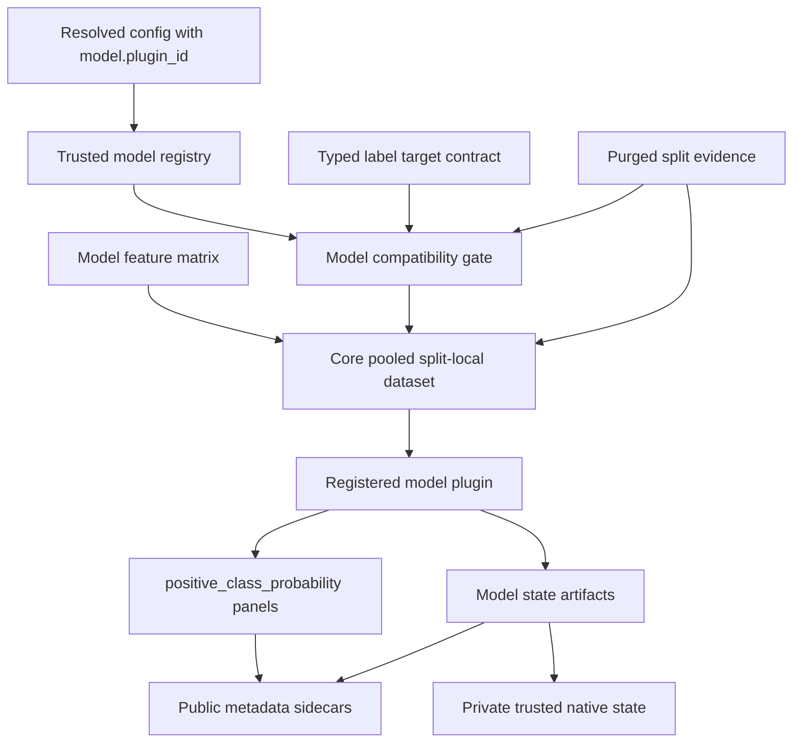
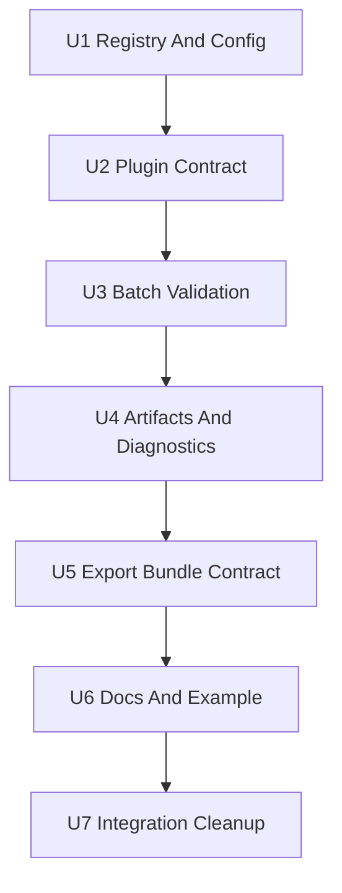

# feat: Add Model Plugin Target And Probability Contract

## Summary

Replace the hard-coded sklearn logistic-regression path with a plugin-only model boundary. Core Aegis code owns registered plugin selection, typed target compatibility, split-local pooled dataset shaping, positive-class probability validation, diagnostics, and portable artifacts; plugins own estimator behavior through a declared trusted-code contract.

---

## Problem Frame

`research/aegis_research/models.py` currently builds a fixed `StandardScaler + LogisticRegression` pipeline, pools timestamp-symbol rows into one training table, assumes binary labels, reads `predict_proba(...)[..., 1]` as `long_probability`, and persists only the fitted joblib object. That hides target meaning, class mapping, calibration status, model identity, and whether a model artifact is split validation evidence or exported prediction state.

Issue #9 should make the model boundary explicit while preserving the current v1 scope where it is end-to-end usable: binary-classification supervised targets, pooled/global model-family behavior, uncalibrated positive-class probabilities, fail-closed incompatible splits, and a producer-side export artifact contract for another runtime project to consume. Exported model artifacts are immutable in this contract; the external runtime project consumes them for prediction only (see origin: `docs/brainstorms/2026-05-17-model-plugin-target-probability-contract-requirements.md`).

---

## Requirements

- R1. Core model orchestration must be plugin-only, with no built-in/default estimator implementation in v1. Origin: R1, R24.
- R2. Experiment config must reference a stable registered model plugin id, not arbitrary imports, inline code, or YAML-defined estimators. Origin: R2.
- R3. Unknown plugin ids, unsupported capabilities, malformed plugin declarations, invalid plugin params, duplicate registry ids, and unsupported state-mutation requests must fail before model training, native state loading, or artifact writes. Origin: R3.
- R4. Plugins must declare supported target roles/kinds, prediction outputs, batch capability, plugin identity/version, state schema, and trusted-loading assumptions. Origin: R4, R5.
- R5. Model execution must consume the typed model-ready target contract from issue #2 and support only binary-classification supervised targets in v1. Origin: R6, R7.
- R6. Binary probability output must be named `positive_class_probability` and selected by explicit positive-class mapping, never probability-column position. Origin: R8, R9.
- R7. V1 probabilities must be recorded as uncalibrated, with no threshold tuning implied by the model stage. Origin: R10.
- R8. Batch validation must train each split only from that split's eligible training membership and record split identity on model and prediction artifacts. Origin: R11.
- R9. V1 must produce a portable export bundle contract for another runtime project: public metadata plus trusted native state links sufficient for that external project to validate plugin/target/feature/probability compatibility before prediction. This repo does not implement the runtime importer. Origin: R12, R13, R16.
- R10. Existing/exported model artifacts are immutable in this contract; requests to modify them must be rejected before native state loading or artifact writes. Origin: R14, R15.
- R11. Model artifacts must preserve enough public metadata for external prediction consumers without allowing validation split models to be modified after export. Origin: R15, R19, R20, R21.
- R12. Diagnostics must include aggregate and per-symbol sample counts, class counts, dropped rows, feature columns, probability summaries, plugin metadata, and plugin-provided diagnostics when public-metadata-safe. Origin: R17, R18.
- R13. Artifacts must distinguish validation split evidence from exported prediction state and make native/binary state interpretable through portable metadata. Origin: R19, R20, R21.
- R14. Add plugin authoring docs and a runnable external example plugin that is explicitly registered for the example and never becomes a hidden default. Origin: R22, R23, R24, R25.

**Origin actors:** A1 experiment author, A2 model plugin author, A3 experiment runner, A4 validation stage, A5 signal stage, A6 reviewer or automation agent.

**Origin flows:** F1 run a registered batch model plugin and F3 author and verify a model plugin. This contract covers train/export only; export artifacts support an external prediction runtime.

**Origin acceptance examples:** AE1 unknown model id fail-closed, AE2 continuous target rejected, AE3 positive-class probability selected by class label, AE4 uncalibrated metadata, AE5 split-local training, AE6 request to modify an existing artifact rejected before native loading, AE7 exported bundle contains compatibility metadata required by the external prediction runtime, AE8 per-symbol pooled diagnostics, AE9 validation/export artifact distinction, AE10 runnable external plugin example.

---

## Scope Boundaries

- Do not ship a core logistic-regression fallback, default model, or hidden auto-registration.
- Do not allow dynamic imports, import strings, notebook snippets, or estimator definitions from YAML.
- Do not add regression, continuous targets, sparse-event targets, regime targets, multiclass classification, ranking outputs, or non-probability signal conversion in v1.
- Do not add AutoML, hyperparameter optimization, estimator selection, calibration, reliability diagrams, or threshold tuning.
- Do not add per-asset or cross-sectional model-family schematics; pooled/global training remains the only v1 family behavior.
- Do not implement modification of existing model artifacts or training behavior in runtime importers.
- Do not treat trusted local model-state loading as secure portable interchange.
- Do not preserve `long_probability` as a compatibility alias unless implementation discovers a concrete persisted external consumer that requires it.

### Deferred to Follow-Up Work

- Entry-point or package auto-discovery for model plugins: v1 should use explicit trusted repo-local registration first; PyPA entry points can be added later if the project needs package-distributed plugins.
- Probability calibration and threshold tuning: future work needs a leakage-safe calibration data contract, class-presence checks, and separate artifact semantics.
- Per-symbol, cross-sectional, multiclass, regression, ranking, sparse-event, and distributional model outputs: future output contracts should avoid squeezing those meanings into `positive_class_probability`.
- Production pointer and registry semantics: pointer advancement or production registry behavior stays deferred unless a future deployment contract creates a concrete need.
- Production model registry semantics and secure portable model interchange: v1 artifacts are trusted local research evidence.

---

## Context & Research

### Relevant Code And Patterns

- `research/aegis_research/models.py` is the main replacement target. It owns fixed sklearn training, hard-coded `long_probability`, stack/unstack helpers, target compatibility checks, and joblib export.
- `research/aegis_research/config.py` currently has `MODEL_KINDS = {"logistic_regression"}` and `ModelConfig(kind, min_train_samples)`. This should become a registered-plugin config contract.
- `research/aegis_research/experiments.py` is the fail-fast orchestration seam. It already resolves config before side effects, writes label artifacts, checks pre/post split compatibility, builds features/splits, and then calls validation.
- `research/aegis_research/validation.py` trains one model per split, predicts train/test probabilities, converts probabilities to signals, simulates portfolios, and stores split metadata.
- `research/aegis_research/labels.py` already separates native VectorBT labels from typed model-ready targets, target role/kind, transform lineage, split-safety metadata, and evaluation evidence.
- `research/aegis_research/provenance/experiment_artifacts.py` writes split model joblib artifacts with no portable model metadata today. It should add public model metadata and distinguish validation split evidence from exported prediction state intended for another project.
- `research/aegis_research/provenance/native.py` provides the trusted native sidecar pattern. Model state should follow this pattern rather than treating the binary object as the only artifact.
- `research/aegis_research/indicator_registry.py` shows the trusted registered-id pattern to mirror for model plugins, while keeping the model registry empty of core estimator implementations.
- `tests/research/aegis_research/test_models.py`, `tests/research/aegis_research/test_config_contract.py`, `tests/research/aegis_research/test_validation_artifacts.py`, `tests/research/aegis_research/test_experiment_provenance.py`, and `tests/research/aegis_research/test_provenance_manifest.py` cover the main seams that this work extends.

### Institutional Learnings

- `docs/solutions/logic-errors/vectorbt-label-contract-target-lineage-2026-05-17.md`: model execution must consume typed target schema and lineage, not native VectorBT labels or silently coerced binary outputs.
- `docs/solutions/architecture-patterns/config-contract-security-reproducibility-2026-05-16.md`: config validation must be schema-versioned, path-aware, fail-fast, and run before data loading, training, artifacts, or native state loading.
- `docs/plans/2026-05-17-003-feat-vectorbt-purged-validation-plan.md`: model fitting must preserve purged split evidence, split/set identity, and per-split decision evidence.
- `docs/plans/2026-05-16-002-feat-experiment-provenance-contract-plan.md`: native/private artifacts are useful, but public manifest-listed metadata is the durable evidence.
- `docs/solutions/best-practices/vectorbt-indicatorfactory-output-shape-contract-2026-05-17.md`: shape-changing outputs should not be forced through a bar-aligned matrix contract, which supports failing closed for future non-probability model outputs.

### VectorBT PRO Evidence

| Evidence | Type | Confirmed behavior or guidance | Plan impact |
|---|---|---|---|
| Cross-validation Applications, "Modeling": https://vectorbt.pro/pvt_16ebf9ef/tutorials/cross-validation/applications/#modeling | Official docs | VBT demonstrates ML with deliberate feature/label design, binary `TRENDLB` labels, simultaneous `X`/`y` row filtering, warns that normalization should run in a per-split sklearn `Pipeline`, and fits/predicts per split before wrapping predictions as pandas Series. | Keep model execution split-local; core must preserve feature/target alignment, dropped-row diagnostics, and per-split preprocessing boundaries. |
| Cross-validation Splitter, "Scikit-learn": https://vectorbt.pro/pvt_16ebf9ef/tutorials/cross-validation/splitter/#scikit-learn | Official docs | VBT warns that time-series observations have temporal dependency and test periods should follow training periods to avoid using future data to forecast the past. | Batch model training must reject future-to-past, validation/test, and unpurged look-ahead membership. Exported artifacts are consumed for prediction only. |
| Purged CV: https://vectorbt.pro/pvt_16ebf9ef/features/optimization/#purged-cv and `PurgedKFoldCV`: https://vectorbt.pro/pvt_16ebf9ef/api/generic/splitting/purged/#vectorbtpro.generic.splitting.purged.PurgedKFoldCV | Official docs/API | VBT supports purged/embargoed CV. `PurgedKFoldCV` samples should have prediction and evaluation times; overlapping train/test intervals are dropped and embargo can enforce a minimum gap. | Model training must rely on split evidence and prediction/evaluation intervals, not timestamp heuristics alone. |
| `FIXLB`: https://vectorbt.pro/pvt_16ebf9ef/api/labels/generators/fixlb/#vectorbtpro.labels.generators.fixlb.FIXLB and `fixed_labels_nb`: https://vectorbt.pro/pvt_16ebf9ef/api/labels/nb/#vectorbtpro.labels.nb.fixed_labels_nb | Official API | `FIXLB` is a look-ahead fixed label generator; `fixed_labels_nb` returns percentage changes from current to future values. | Native fixed labels are not inherently binary classes; plugins consume the typed transformed target only. |
| `TRENDLB`: https://vectorbt.pro/pvt_16ebf9ef/api/labels/generators/trendlb/#vectorbtpro.labels.generators.trendlb.TRENDLB and `TrendLabelMode`: https://vectorbt.pro/pvt_16ebf9ef/api/labels/enums/#vectorbtpro.labels.enums.TrendLabelMode | Official API | Trend label modes include binary, continuous binary-style modes, percentage change, and normalized percentage change. | V1 accepts only typed binary-classification targets; continuous trend modes fail closed. |
| `PIVOTLB`: https://vectorbt.pro/pvt_16ebf9ef/api/labels/generators/pivotlb/#vectorbtpro.labels.generators.pivotlb.PIVOTLB and `Pivot`: https://vectorbt.pro/pvt_16ebf9ef/api/indicators/enums/#vectorbtpro.indicators.enums.Pivot | Official API | Pivot enum values are `Valley=-1` and `Peak=1`. | Sparse pivot events should not be silently treated as dense binary probability targets in v1. |
| Labelers future-looking target variables: https://discord.com/channels/918629562441695344/918630948248125512/1108837628637356242 | Maintainer/support thread | Maintainer says labelers are typically future-looking and used as target variables for ML training. | Do not use labeler outputs as features or model-ready targets without explicit target contracts and split-safety evidence. |
| ML outputs as pandas arrays/signals: https://discord.com/channels/918629562441695344/918629563469295628/1002227531254083705 | Maintainer/support thread | Maintainer says an ML model can output a pandas array with signals and VBT can process pandas arrays. | Aegis can own the plugin/model boundary and pass pandas-compatible outputs downstream; VBT does not need to own model implementations. |
| WFA/CV time-series caution: https://discord.com/channels/918629562441695344/918629563469295628/1040239872717361273 | Maintainer/support thread | Maintainer says WFA is a CV technique, classic k-fold/random splits are not suitable for time series, and training on future data to predict the past is not effective. | Favor split-local and purged/embargoed evidence over generic CV assumptions. |

No docs-vs-Discord disagreement was found in the VBT evidence. Confirmed VBT behavior stops at label semantics, split mechanics, and pandas-compatible outputs; VBT does not prescribe an Aegis model plugin architecture, probability calibration policy, or artifact schema. Those are Aegis recommendations grounded in the official VBT constraints above plus project provenance/config patterns.

### External Framework References

- scikit-learn `predict_proba` docs order class probabilities by `classes_`, so `positive_class_probability` must be selected by class label rather than column position: https://scikit-learn.org/stable/modules/generated/sklearn.linear_model.LogisticRegression.html
- scikit-learn common pitfalls and `Pipeline` docs warn that preprocessing must be learned from training data only and pipelines help avoid train/test leakage: https://scikit-learn.org/stable/common_pitfalls.html and https://scikit-learn.org/stable/modules/generated/sklearn.pipeline.Pipeline.html
- scikit-learn calibration docs say calibration should use data independent from base classifier training and class-presence matters, so v1 should mark probabilities uncalibrated: https://scikit-learn.org/stable/modules/calibration.html
- scikit-learn threshold tuning separates probability estimation from decision thresholds, so signal thresholds remain downstream policy: https://scikit-learn.org/stable/modules/classification_threshold.html
- scikit-learn and joblib persistence docs warn that pickle/joblib loading can execute arbitrary code and requires trusted, version-compatible environments: https://scikit-learn.org/stable/model_persistence.html and https://joblib.readthedocs.io/en/stable/persistence.html
- PyPA plugin guidance and Python `importlib.metadata` support entry-point plugins, but v1 should prefer explicit reviewed registration because config must not load arbitrary code: https://packaging.python.org/guides/creating-and-discovering-plugins/ and https://docs.python.org/3/library/importlib.metadata.html

### Known Failure Modes To Design Against

- `predict_proba(...)[..., 1]` maps to the wrong class when the estimator reports classes in unexpected order.
- Native `FIXLB`, `TRENDLB`, or `PIVOTLB` outputs are accidentally treated as model-ready binary labels without target transform lineage.
- Sparse event labels, regime labels, continuous future returns, or multiclass values are squeezed into `positive_class_probability`.
- Feature/target filtering happens globally or out of order, creating split leakage or silent membership drift.
- Plugin predictions lose pandas index/symbol alignment after numpy/sklearn conversion.
- Probability outputs include NaN/inf, values outside `[0, 1]`, duplicate rows, missing symbols, or extra symbols without diagnostics.
- Calibration or threshold tuning is implied by the word probability even though no independent calibration contract exists.
- Export code treats a validation artifact as a mutable deployment object instead of an immutable prediction bundle.
- Native `joblib` state is treated as portable or secure instead of trusted local replay/debug state.
- Plugin diagnostics leak secrets, local paths, huge payloads, or non-JSON values into public artifacts.

---

## Key Technical Decisions

- Use a dedicated `model_registry.py` rather than overloading the indicator registry. The registry can borrow validation mechanics from `indicator_registry.py`, but model selection should use an explicit `ModelRegistry` runtime object rather than a process-global mutable registry.
- Keep plugin discovery explicit and repo-local in v1. Entry points are a documented future extension, not the default because they still load Python code.
- Add an explicit trusted-plugin bootstrap seam before config validation. Tests, notebooks, examples, and downstream project code pass a registry intentionally; missing bootstrap fails the same way as an unknown `model.plugin_id`, not as an import failure or hidden estimator fallback.
- Freeze the model registry snapshot before config validation and use that exact frozen snapshot for execution and artifact fingerprints. This prevents later registrations in the same process from changing the model contract for an already resolved experiment.
- Keep direct generic CLI behavior explicit: plugin experiments require a process that registers trusted plugins before config validation. In v1, runnable examples may use a notebook/bootstrap runner before calling the experiment API; the generic CLI must fail clearly when no registered plugin matches instead of importing plugin code from YAML.
- Rename config to `model.plugin_id`, `model.min_train_samples`, and `model.params`; reject `model.kind` rather than carrying a compatibility alias. V1 accepts only split-local batch validation training plus export-bundle production behavior, so no user-selectable training mode is exposed. Fields that request modifying an existing model artifact fail closed.
- Keep core responsible for panel-to-tabular shaping. Plugins receive a split-local pooled dataset with a `(timestamp, symbol)` row index, feature columns, model-ready target series, target metadata, feature metadata, and execution context.
- Keep validation/test targets out of plugin calls. Batch plugins fit on train features plus train targets, then predict from feature-only prediction datasets with set identity; validation/test labels stay in core validation and artifact evidence.
- Keep plugins responsible for estimator behavior. Core validates plugin declarations and standardized outputs but does not inspect sklearn internals except through plugin-returned metadata.
- Require plugin declarations to be data, not behavior hidden in docs: id, version, capabilities, supported target contract, supported prediction output, state schema version, and optional plugin param validation.
- Record a plugin implementation fingerprint in model metadata. Plugin id/version and declaration JSON are not enough when trusted repo-local code can change without package-version movement; include at least declaration JSON, factory module/qualname, source file or installed distribution hash when available, repo commit/dirty evidence when available, and relevant dependency versions.
- Treat target schema as the authority for model-ready class semantics. If issue #2 target schema lacks `positive_class` and class labels for binary targets, this work should add those fields to `research/aegis_research/labels.py` and fail closed when they are absent.
- Canonicalize class labels at the model contract boundary. Target labels and plugin-observed classes should compare through a lossless JSON-safe canonical representation; ambiguous coercions such as bool/int/string collisions fail closed.
- Record native target meaning separately from model-ready class meaning. For example, a native `positive_value` in a transform explains source semantics, while `positive_class` identifies the model-ready class to map in probability outputs.
- Select `positive_class_probability` through the target's positive class and the plugin's observed class-to-output mapping. If the positive class is absent, ambiguous, or not mapped to a probability output, fail before producing predictions.
- Define minimal model artifact roles and metadata schema versions before batch validation or export production consumes them. U4 implements full persistence, but U2 should name the validation split model, exported model state, export metadata sidecar, and probability artifact roles so the external runtime project does not invent incompatible ids.
- Treat all v1 probabilities as uncalibrated unless a future calibration contract adds independent calibration data and artifact semantics.
- Keep batch validation split-local. Each validation split produces its own model state and metadata linked to split evidence.
- Keep export behavior explicit and distinct from validation. This repo produces completed model artifacts and public export metadata for another project to load; it does not implement that external runtime consumer in v1.
- Treat modes and fields that would modify an existing model artifact as unsupported. Config validation must reject them before native state loading, data loading side effects, or artifact writes.
- Verify manifest and sidecar evidence before any trusted native model load done inside this repo, and include the same checks in the export contract for the external runtime project. An exported model artifact reference must resolve to a completed manifest artifact with the expected role, visibility, schema version, content hash, size, sidecar link, plugin fingerprint, target schema hash, feature schema hash, positive-class mapping, and trusted-loading assumptions; missing public evidence fails closed rather than falling back to native state inspection.
- Do not modify loaded native model artifacts in place. Exported artifacts are read-only prediction inputs for the external runtime project.
- Keep plugin dump/load hooks inside core-controlled staging. Plugins may return serializable state or write only to locations supplied by core so manifest, sidecar, and native bytes remain bound.
- Store redacted public plugin params plus stable non-secret export compatibility fingerprints. Public metadata should not leak secret-like params, but export compatibility must still be auditable.
- Exclude secret-derived values from public fingerprints. Low-entropy credentials and tokens must not become offline guessing oracles in portable metadata; compare secret-bearing compatibility only through private manifest-bound evidence if absolutely needed.
- Preserve pooled/global behavior while adding per-symbol diagnostics, so multi-asset skew is visible without introducing per-symbol model families.
- Use public metadata as the source of interpretability and native artifacts only as trusted local replay/debug state.

---

## Open Questions

### Resolved During Planning

- Should core include logistic regression as the default plugin? No. Even logistic regression must live outside core, likely as a documented external example or test fixture.
- Should config point at Python imports? No. Config points at stable registered ids; importing and registering trusted project plugins is an application/runtime concern outside YAML.
- Should v1 use entry-point auto-discovery? No. PyPA entry points are viable later, but explicit repo-local registration is the lower-risk v1 default.
- How are trusted plugins registered before config validation? Through an explicit registry/bootstrap seam controlled by tests, examples, or project code; config never imports plugin code directly.
- Can the generic CLI run arbitrary plugin configs by itself? No. The generic CLI can run only when the process has already registered the requested trusted plugin; v1 examples should use a notebook/bootstrap path rather than a YAML import or CLI import string.
- Should config use `model.id` or `model.plugin_id`? Use `model.plugin_id` because it names the trust boundary and avoids confusing model family with registered plugin identity.
- Should `long_probability` remain the output name? No. The model output is `positive_class_probability`; long/short action meaning belongs downstream.
- Should probabilities be considered calibrated? No. Mark uncalibrated in v1 and defer calibration/threshold tuning.
- Should v1 support per-symbol model families? No. Keep pooled/global training, but add per-symbol diagnostics.
- Where should positive-class metadata live? The target schema owns model-ready `positive_class` and class labels; plugin metadata owns observed classes and probability-column mapping; model artifacts record both plus native transform lineage.
- Can the external runtime/importer project modify exported model artifacts through this contract? No. V1 export artifacts are for prediction-only consumption.
- Can validation split models become mutable runtime state? No. Validation split model artifacts remain validation evidence and may be exported for prediction only through the export artifact contract.
- What happens when config requests behavior that modifies an existing model artifact? Fail closed before native state loading, data side effects, or artifact writes.

### Deferred to Implementation

- Exact internal dataclass names and helper boundaries can be chosen during implementation as long as the public contract above remains stable.
- Exact plugin parameter validation implementation can be chosen during implementation, but it must produce path-aware, side-effect-free config issues.
- Exact exported model artifact reference format can follow the existing manifest APIs, preferring artifact ids over arbitrary filesystem paths.
- Exact native persistence hook can be chosen during implementation. Plugins may return serializable state for the existing native writer or provide explicit trusted dump/load hooks that the external runtime project can call for read-only prediction if needed.

---

## Output Structure

The exact module split may adjust during implementation, but the intended new/changed shape is:

```text
research/aegis_research/
  model_contracts.py
  model_registry.py
  model_export.py
  models.py
docs/
  model-plugins.md
examples/
  model_plugins/
    README.md
    sklearn_logistic_plugin.ipynb
tests/research/aegis_research/
  test_model_plugin_example.py
```

`research/aegis_research/models.py`, `research/aegis_research/validation.py`, `research/aegis_research/experiments.py`, `research/aegis_research/config.py`, `research/aegis_research/labels.py`, and provenance modules remain the authoritative integration surfaces listed in the implementation units.

---

## High-Level Technical Design

> This illustrates the intended approach and is directional guidance for review, not implementation specification. The implementing agent should treat it as context, not code to reproduce.



The load-bearing boundary is that core owns validation, shaping, provenance, and artifact meaning, while plugins own estimator behavior through a declared, tested contract.

---

## Implementation Units



### U1. Add Model Registry And Config Contract

**Goal:** Replace hard-coded `model.kind` with a trusted registered plugin id and fail before side effects when the id, declaration, requested mode, or plugin params are invalid.

**Requirements:** R1, R2, R3, R4

**Dependencies:** None

**Files:**
- Create: `research/aegis_research/model_contracts.py`
- Create: `research/aegis_research/model_registry.py`
- Modify: `research/aegis_research/config.py`
- Modify: `research/aegis_research/experiments.py`
- Modify: `research/aegis_research/cli.py`
- Test: `tests/research/aegis_research/test_config_contract.py`
- Test: `tests/research/aegis_research/test_models.py`

**Approach:**
- Add the minimal plugin declaration contract needed for registry/config validation before expanding execution/result contracts in U2.
- Add a model plugin registry with stable ids, plugin versions, capability declarations, state schema versions, and references to trusted plugin factories or objects.
- Implement the registry as an explicit `ModelRegistry` object passed into config resolution and experiment execution, then frozen into an immutable snapshot before validation. Avoid process-global mutable registration as the authoritative runtime contract.
- Add an explicit trusted-plugin bootstrap seam so tests/examples/project code construct and pass a registry before config validation without YAML imports or hidden defaults.
- Define the CLI/runtime behavior: direct CLI runs use the default empty registry and fail clearly unless the caller has launched through an explicit bootstrap path; examples that need custom plugins use an explicit notebook/bootstrap runner.
- Change `ModelConfig` to use `plugin_id`, `min_train_samples`, and `params`. Batch validation is the only v1 behavior and is not a user-selectable config mode; model export is artifact production from completed batch results, not a separate training mode. Reject fields that request modifying existing model artifacts as out of scope.
- Reject `model.kind` in schema v2 instead of aliasing it to `plugin_id`; forward-first behavior is safer unless implementation finds a concrete external persisted consumer.
- Validate unknown plugin ids, unsupported state-mutation requests, malformed declarations, duplicate ids, and side-effect-free plugin-specific param issues before data loading, run directory creation, artifact writes, native state loading, or training.
- Reject arbitrary import-like fields, inline code keys, estimator YAML payloads, and unknown model config fields.
- Keep optional entry-point discovery out of active v1 scope. If implementation needs a bootstrap hook, it must still register trusted definitions before config validation.
- Record or compute a plugin implementation fingerprint from the frozen registry snapshot that downstream model metadata can use for compatibility checks.
- Classify plugin params used in compatibility as public non-secret, redacted public, or private-only; only non-secret values may contribute to public fingerprints.
- Move minimal synthetic config/test fixture updates into this unit so the suite has an explicit registered test plugin path before later units remove hard-coded logistic behavior.

**Execution note:** Start with config tests that prove invalid model ids do not create run artifacts, load data, train models, or mutate prior state.

**Patterns to follow:**
- `research/aegis_research/indicator_registry.py` for registered-id mechanics.
- `research/aegis_research/config.py` for `ConfigValidationIssue` and canonical enum validation.
- `docs/solutions/architecture-patterns/config-contract-security-reproducibility-2026-05-16.md` for fail-fast config boundaries.

**Test scenarios:**
- Covers AE1. Unknown `model.plugin_id` fails before training, native state loading, or artifact writes.
- Error path: a registered plugin with a malformed declaration fails at model registry/config validation.
- Error path: duplicate registered model ids fail before config execution.
- Error path: missing plugin bootstrap for a configured plugin fails like an unknown id, not like an import or estimator runtime error.
- Error path: direct CLI execution of an unregistered plugin config fails before data loading or run directory creation.
- Error path: config containing model import strings, inline estimator code, estimator YAML payloads, or unknown fields fails with model-specific config paths.
- Error path: a request that modifies an existing model artifact fails before plugin resolution, native state loading, or artifact writes because artifact modification is out of scope.
- Regression: `model.kind: logistic_regression` is not accepted as a hidden compatibility alias unless implementation discovers a concrete external consumer.
- Safety: config failure does not write model artifacts, native state files, export bundles, or mutable-state lineage.
- Safety: secret-like plugin params are excluded from public compatibility fingerprints.
- Integration: a synthetic config path can reference an explicitly registered test plugin without requiring a core default estimator.

**Verification:**
- The only way for an experiment to select a model is through an already registered trusted plugin id provided before config validation.

### U2. Define Core Model Dataset And Plugin Contract

**Goal:** Introduce the typed boundary between Aegis orchestration and estimator plugins, including target compatibility, positive-class probability mapping, diagnostics, and plugin output validation.

**Requirements:** R4, R5, R6, R7, R12

**Dependencies:** U1

**Files:**
- Modify: `research/aegis_research/model_contracts.py`
- Modify: `research/aegis_research/models.py`
- Modify: `research/aegis_research/labels.py`
- Test: `tests/research/aegis_research/test_models.py`
- Test: `tests/research/aegis_research/test_labels.py`

**Approach:**
- Add small contract objects for model execution context, pooled dataset, plugin fit result, plugin prediction result, state metadata, and compatibility diagnostics only where they make the boundary clearer.
- Expand the minimal declaration contract from U1 into the full execution/result contract without duplicating ad hoc registry validation shapes.
- Keep core stacking helpers for timestamp-symbol panels, feature-column flattening, symbol alignment, dropped-row counts, class counts, feature contract hashes, and per-symbol diagnostics.
- Build a single pooled tabular dataset per split with `(timestamp, symbol)` rows and deterministic feature columns.
- Add or require target-schema fields for binary class labels and model-ready `positive_class`; preserve native transform meaning such as `positive_value` in target transform lineage.
- Define a lossless class-label canonicalization policy for target labels, plugin-observed classes, JSON metadata, and probability mappings. Ambiguous conversions fail before prediction.
- Define the minimal artifact role and schema vocabulary that U3/U4/U5 will reference: validation split model, exported prediction model state, model metadata sidecar, export bundle manifest, probability panel, and native trusted state.
- Define the minimal persistence seam that U3 can use before U4 enriches artifacts: plugin fit results must expose either serializable state or a core-controlled dump hook plus metadata sufficient to avoid calling the old unconditional joblib exporter.
- Pass typed target metadata to the plugin, including target kind, target role, target lineage, positive class, observed class labels, split identity, and feature contract.
- Require every plugin prediction result to return explicit observed-class metadata and output-to-class mapping. A column named `positive_class_probability` is accepted only when that mapping proves it corresponds to the declared positive class.
- For sklearn-wrapping plugins, require metadata equivalent to `classes_` and resulting class-to-probability-column mapping; core should not assume sklearn is present.
- Reject continuous/regression/regime/sparse-event/multiclass targets before plugin fit.
- Reject missing positive-class metadata, absent positive class in observed classes, one-class batch training targets, plugins that cannot emit binary positive-class probabilities, and probability mappings that omit the positive class.
- Keep v1 class checks batch-oriented: batch fit rejects one-class training targets.
- Validate probability outputs for index/symbol alignment, duplicate rows, missing/extra symbols, finite numeric values, and bounds in `[0, 1]` before downstream signal conversion.
- Mark returned probability metadata as uncalibrated unless a future explicit calibration contract exists.
- Keep plugin diagnostics optional, namespaced, bounded, JSON/public-metadata-safe, and rejected or redacted when unsafe.

**Execution note:** Characterize the current stack/unstack behavior before changing estimator code so the pooled/global row contract remains stable.

**Patterns to follow:**
- `_training_dataset`, `_stack_indicator_panel`, and `_stack_label_panel` in `research/aegis_research/models.py`.
- Target lineage and split-safety fields from `LabelResult.target_schema` in `research/aegis_research/labels.py`.
- Public metadata safety checks used by provenance modules.

**Test scenarios:**
- Covers AE2. Continuous `FIXLB` target fails before plugin `fit` is called.
- Covers AE2. `PIVOTLB` sparse-event target fails closed for v1 binary model execution.
- Covers AE3. A test plugin reporting classes in a non-obvious order still produces the correct `positive_class_probability` by positive class.
- Covers AE4. Successful model metadata records `calibrated: false` and does not include tuned threshold metadata.
- Error path: target schema missing `positive_class` fails before fit or prediction.
- Error path: target positive class and plugin observed classes compare ambiguously across bool/int/string/numpy scalar forms and fail closed.
- Error path: plugin returns a probability mapping that omits the positive class and the run fails.
- Error path: plugin returns a correctly named `positive_class_probability` output without class-mapping evidence and the run fails.
- Error path: probability outputs outside `[0, 1]`, infinite values, duplicate prediction rows, missing symbols, or extra symbols fail before signal conversion.
- Error path: any v1 attempt to call plugin behavior that modifies an existing model artifact fails before native state loading or artifact writes.
- Edge case: feature names that collide after flattening still fail visibly rather than silently merging columns.
- Diagnostics: class counts, dropped rows by reason, feature columns, feature contract hash, and per-symbol counts are available before/after plugin fit.

**Verification:**
- Core no longer needs to know about sklearn classes to validate target compatibility or probability semantics.

### U3. Route Batch Validation Through Registered Plugins

**Goal:** Replace `train_model` and `predict_long_probability` usage with split-local plugin execution that emits `positive_class_probability` panels.

**Requirements:** R1, R5, R6, R7, R8, R12

**Dependencies:** U1, U2

**Files:**
- Modify: `research/aegis_research/models.py`
- Modify: `research/aegis_research/validation.py`
- Modify: `research/aegis_research/signals.py`
- Modify: `research/aegis_research/experiments.py`
- Modify: `research/aegis_research/provenance/experiment_artifacts.py`
- Test: `tests/research/aegis_research/test_models.py`
- Test: `tests/research/aegis_research/test_validation_artifacts.py`

**Approach:**
- Resolve the plugin definition once per run and pass a model runner or plugin handle into validation instead of letting validation infer estimator behavior from config.
- For each validation split, build fit data only from `split.train_index` and predict only on the union of that split's train/test membership as currently done.
- Ensure `plugin.fit` receives train features and train targets only, while `plugin.predict` receives feature-only datasets separated by set identity. Test/validation targets never pass into plugin calls.
- Apply simultaneous feature/target filtering per split and count missing target rows, missing feature rows, and rows excluded by split eligibility separately.
- Return train/test `positive_class_probability` panels with the same timestamp-by-symbol shape expected by signal and portfolio stages.
- Replace the old unconditional `model.joblib` writer path with the minimal plugin state persistence seam defined in U2, so validation with a registered plugin is not forced through hard-coded joblib export before U5 adds full metadata enrichment.
- Update metadata and artifact schema names from generic/long probability semantics to positive-class probability semantics.
- Preserve current signal thresholds as downstream signal policy, but ensure docs and metadata say thresholds consume uncalibrated positive-class probability.
- Preserve split identity and set identity through validation split results, aggregate probabilities, signals, metrics, and report metadata.
- Keep plugin fit/predict failures observable through run failure diagnostics without marking partial model artifacts complete.

**Execution note:** Keep signal conversion changes minimal. The model stage should rename and document the probability semantic without expanding signal policy.

**Patterns to follow:**
- `evaluate_validation_splits` in `research/aegis_research/validation.py`.
- Existing split metadata and `decision_grade_scope` fields.
- VectorBT official CV Modeling docs for per-split fit/predict and pandas prediction alignment.

**Test scenarios:**
- Covers AE5. Batch plugin fit receives only split train rows and never sees test membership.
- Covers AE5. Plugin calls never receive validation/test target labels, even when predicting for test rows.
- Covers AE3. Aggregate and per-split probability panels contain positive-class probabilities selected by class mapping.
- Edge case: a split with enough raw rows but too few post-filter training rows fails with dropped-row diagnostics.
- Edge case: a split with both classes before filtering but one class after filtering fails before fit.
- Error path: train/test feature column mismatch fails before prediction.
- Error path: plugin fit raises a typed failure that is recorded in run failure diagnostics without writing partial success metadata.
- Regression: current pooled/global row order remains deterministic for multi-symbol panels.
- Regression: train probabilities, test probabilities, train signals, and test signals keep split/set identity.
- Integration: VBT/pandas-compatible probability panels can still feed the existing signal and portfolio stages.
- Integration: split artifact writing no longer requires the old hard-coded sklearn pipeline object or unconditional `export_model` path.

**Verification:**
- Validation can run with a registered test plugin without any core estimator implementation or sklearn-specific branch.

### U4. Persist Model Metadata, Diagnostics, And Native State Safely

**Goal:** Make model artifacts interpretable without loading native state and distinguish split-validation evidence from exported prediction state.

**Requirements:** R6, R7, R8, R11, R12, R13

**Dependencies:** U3

**Files:**
- Modify: `research/aegis_research/provenance/experiment_artifacts.py`
- Modify: `research/aegis_research/provenance/native.py`
- Modify: `research/aegis_research/provenance/manifest.py`
- Test: `tests/research/aegis_research/test_validation_artifacts.py`
- Test: `tests/research/aegis_research/test_experiment_provenance.py`
- Test: `tests/research/aegis_research/test_provenance_manifest.py`

**Approach:**
- Add public per-split model metadata artifacts alongside native model state, such as `splits/<split>/model_metadata.json`.
- Add public export metadata artifacts for completed model states intended for another project to consume, separate from validation split evidence.
- Use staged writes and atomic promotion for native state, public sidecar metadata, and manifest registration. Public metadata must validate before completed manifest links are promoted.
- Include plugin id/version, capabilities, target role/kind, target lineage hash, positive class, observed classes, class-to-probability mapping, `probability_output_name: positive_class_probability`, `calibrated: false`, feature columns/hash, split/set identity, trusted-loading assumptions, diagnostics, and native artifact links.
- Include plugin implementation fingerprint so reviewers can detect trusted code drift even when plugin id/version are unchanged.
- Include model metadata schema version and fail-closed behavior for unknown or missing schema versions before native loading.
- Include dependency evidence relevant to native loading, at minimum Python and plugin package versions when available, plus sklearn/numpy/pandas/joblib versions for sklearn-backed plugins.
- Bind public metadata to native artifacts through manifest artifact id, role, visibility, schema version, content hash, size, and expected sidecar link.
- Include aggregate and per-symbol diagnostics: train/test rows, dropped rows by reason, class counts, probability summaries, feature columns, plugin fit diagnostics, and package/environment evidence already captured by run provenance where available.
- Update probability artifact schema versions to make positive-class semantics explicit.
- Ensure public metadata is safe through `assert_public_metadata_safe` and does not expose local native paths, credentials, secret-like plugin params, or unbounded plugin diagnostics.
- Keep native artifacts private/trusted, with public metadata as the authoritative interpretation layer.
- Ensure manifest links connect config, labels, feature schema, split evidence, model metadata, native model state, probabilities, signals, metrics, and reports.
- Preserve completed split artifacts on later split failures and never mark incomplete model artifacts as completed evidence.
- Record redacted plugin params plus compatibility fingerprints so public metadata stays safe without losing state-compatibility evidence.
- Exclude secret-classified plugin params from public fingerprints; if secret-bearing compatibility must be checked, keep that evidence private and manifest-bound rather than portable/public.

**Execution note:** Avoid stuffing all model metadata into validation metadata only. Reviewers and agents need a stable model artifact role they can inspect directly.

**Patterns to follow:**
- Existing public JSON plus private native sidecar pattern for labels, indicators, data, portfolios, and splits.
- Manifest uniqueness, path-safety, status transition, and visibility tests.
- scikit-learn/joblib persistence docs for trusted-only native loading caveats.

**Test scenarios:**
- Covers AE8. Multi-symbol pooled run writes aggregate and per-symbol sample/class/drop/probability diagnostics.
- Covers AE9. A reviewer can tell validation split model artifacts from exported prediction-state artifacts using public metadata and manifest roles.
- Covers AE4. Metadata marks probabilities uncalibrated and records no tuned threshold.
- Error path: model metadata containing unsafe public values fails before public artifact completion.
- Error path: plugin id/version matches but implementation fingerprint differs and compatibility checks fail before native loading.
- Error path: secret-like plugin params are not present in public metadata or public compatibility fingerprints.
- Error path: public sidecar schema version is missing or unknown and fails native-load compatibility checks.
- Error path: native state hash/size in metadata or manifest does not match the file selected for loading.
- Error path: non-JSON plugin diagnostics fail or are rejected before public metadata is completed.
- Regression: duplicate model artifact ids or paths fail manifest validation.
- Regression: probability artifacts link upstream to model metadata, not only native model state.
- Failure handling: a later split failure preserves completed earlier split metadata and leaves incomplete model artifacts non-completed.
- Failure handling: crash or failure between staged native write and manifest promotion leaves no completed evidence artifact.

**Verification:**
- Native model state is never the only place to understand target compatibility, class mapping, feature contract, plugin identity, or state lineage.

### U5. Define Export Bundle Contract

**Goal:** Produce a completed model export bundle that another project can consume for prediction without importing experiment internals or guessing artifact semantics.

**Requirements:** R9, R10, R11, R13

**Dependencies:** U4

**Files:**
- Create: `research/aegis_research/model_export.py`
- Modify: `research/aegis_research/provenance/experiment_artifacts.py`
- Modify: `research/aegis_research/provenance/manifest.py`
- Test: `tests/research/aegis_research/test_model_export.py`
- Test: `tests/research/aegis_research/test_provenance_manifest.py`

**Approach:**
- Add a small producer-side export API that builds an export bundle from completed model artifacts and public metadata. It should not implement the external runtime importer.
- Export only completed artifacts with validated public metadata, manifest links, content hashes, native sidecar bindings, and plugin implementation fingerprints.
- Include the contract fields the external runtime project needs before prediction: plugin id/version, implementation fingerprint, trusted-loading assumptions, target role/kind, target schema hash, positive class, observed classes, class-to-probability mapping, feature columns/hash, model metadata schema version, dependency evidence, and `calibrated: false`.
- Include native state by manifest-bound reference or staged bundle copy with hash/size evidence; do not expose local absolute paths, credentials, or private diagnostics in public export metadata.
- Treat export bundles as immutable evidence artifacts, not latest pointers, promotion records, deployment registry entries, or mutable state parents.
- Reject export requests for incomplete model artifacts, missing metadata, unsafe metadata, mismatched native hashes, unknown metadata schema versions, or requests to modify existing artifacts.
- Preserve split/set identity when exporting validation split models so the external project can tell whether an artifact is validation evidence or an explicitly exported prediction artifact.
- Document that exported bundles are trusted-local artifacts: loading native state can execute code and requires a reviewed plugin/environment in the consuming project.

**Test scenarios:**
- Covers AE7. Export bundle contains all compatibility metadata required by the external prediction runtime.
- Covers AE9. Exported prediction artifacts are distinguishable from validation split evidence through manifest roles and public metadata.
- Error path: export from an incomplete or failed split artifact is rejected.
- Error path: export metadata with local paths, secrets, non-JSON values, or unsafe plugin diagnostics fails before artifact completion.
- Error path: native state hash/size or sidecar binding mismatch fails export.
- Error path: export requests that would modify existing artifacts fail as out of scope.
- Regression: export bundle does not require importing the notebook example or any default estimator.

**Verification:**
- Another project can implement prediction-only loading from the documented export metadata without relying on private experiment internals.

### U6. Add Plugin Authoring Guide And Runnable External Example

**Goal:** Make the contract usable by plugin authors without relying on hidden core behavior or default model implementations.

**Requirements:** R14

**Dependencies:** U1, U2, U3, U5

**Files:**
- Create: `docs/model-plugins.md`
- Create: `examples/model_plugins/README.md`
- Create: `examples/model_plugins/sklearn_logistic_plugin.ipynb`
- Modify: `docs/vectorbt-scaffold.md`
- Modify: `pyproject.toml`
- Test: `tests/research/aegis_research/test_model_plugin_example.py`

**Approach:**
- Document required plugin declaration fields, batch fit operation, prediction output semantics, positive-class mapping, diagnostics, artifact metadata, unsupported-capability failures, and the immutable-export behavior in v1.
- Document confirmed VBT constraints separately from Aegis recommendations: labelers are future-looking target generators, split-local CV and pandas-compatible outputs are VBT-supported, and plugin architecture/calibration policy are Aegis-owned.
- Document that plugin code is trusted project code registered before config execution; YAML does not import or define plugins.
- Document the v1 runtime shape: examples needing custom plugins should run through an explicit notebook/bootstrap runner that registers plugins before config resolution; the generic CLI does not load plugins from YAML.
- Provide a small sklearn logistic-regression notebook example in `examples/model_plugins/` that defines and registers the plugin explicitly when the notebook is run.
- Include a clearly marked pure-Python adaptation path in the notebook or adjacent README so users can move the same registration flow into a script, service, or custom CLI bootstrap without relying on notebook execution.
- Keep the logistic-regression example batch-only and do not document any path that modifies existing model artifacts.
- Ensure the example demonstrates batch training, binary positive-class probability prediction, uncalibrated probability metadata, public artifact metadata, class-order mapping, and at least one unsupported-capability failure.
- Keep the example out of core imports and out of the default registry.
- Add the minimal dev dependencies needed to execute the notebook in tests, such as `nbclient` and `nbformat`, or explicitly scope the test to a generated Python smoke path if notebook execution is not adopted. Do not leave the notebook's runnable status untested.
- Add a reusable conformance-style test harness that exercises the documented contract using only public helpers: declaration validation, method presence, side-effect-free param validation, reversed-class probability mapping, unsafe diagnostics rejection, and explicit rejection of hooks that modify existing model artifacts.

**Execution note:** The notebook example can use sklearn, but the core must not depend on the example or use it as a fallback.

**Patterns to follow:**
- Existing docs style in `docs/vectorbt-scaffold.md`.
- Existing config/example organization under `research/configs/experiments/` only if examples can explicitly register plugins without hidden defaults.

**Test scenarios:**
- Covers AE10. Example notebook registers the plugin explicitly, runs batch fit/predict, and writes required metadata.
- Covers AE10. Example notebook unsupported artifact-modification mode fails with a clear out-of-scope error.
- Documentation check: authoring guide includes target compatibility, positive class, uncalibrated probabilities, diagnostics, native state trust boundary, and no-default behavior.
- Documentation check: authoring guide explains CLI/bootstrap behavior and states that generic CLI execution does not import plugin code from config.
- Regression: importing core Aegis does not auto-register the example plugin.
- Regression: the example notebook does not import private core helpers that are not part of the documented plugin contract.
- Conformance: the example plugin passes the reusable plugin conformance harness.

**Verification:**
- A plugin author can follow the guide and runnable notebook example without private helper imports or undocumented side effects.

### U7. Update Integration Fixtures And Remove Hard-Coded Model Assumptions

**Goal:** Align tests, example configs, docs, and report language with plugin-only model semantics.

**Requirements:** R1, R2, R5, R6, R7, R12, R14

**Dependencies:** U1, U2, U3, U4, U5, U6

**Files:**
- Modify: `tests/research/aegis_research/test_experiments_purged.py`
- Modify: `tests/research/aegis_research/test_stage_provenance.py`
- Modify: `tests/research/aegis_research/test_reports.py`
- Modify: `research/aegis_research/cli.py`
- Modify: `research/configs/experiments/synthetic_ml_baseline.yaml`
- Modify: `docs/vectorbt-scaffold.md`

**Approach:**
- Finish replacing direct logistic-regression assumptions in tests with explicit test plugin registration; U1/U3 should already establish the minimal registered-plugin integration path.
- Finish updating synthetic integration paths so they either register a test/example plugin explicitly or are marked as config-only examples requiring plugin registration.
- Ensure CLI/help/docs communicate the explicit bootstrap requirement and that generic CLI runs fail clearly when the requested plugin is not registered.
- Rename references from `long_probability` to `positive_class_probability` in code, schemas, docs, and tests.
- Keep signal-threshold config names unchanged if changing them would expand scope, but document that they consume positive-class probability rather than calibrated long-trade probability.
- Ensure the full experiment path can run with a registered test plugin and no built-in estimator.
- Ensure failing plugin ids or incompatible target schemas stop before expensive stages and before artifact writes.
- Ensure report language does not imply calibrated probabilities, tuned thresholds, or deployment-ready model state.

**Test scenarios:**
- Integration: a synthetic purged `FIXLB` run with an explicitly registered test plugin completes and writes model metadata, probabilities, signals, metrics, and report artifacts.
- Integration: the same config without plugin registration fails before data/model side effects.
- Integration: generic CLI execution of a plugin config without prior bootstrap fails clearly before run artifacts or data loading.
- Regression: unsupported continuous target still fails before plugin fit.
- Regression: split-local purged validation still preserves decision-grade label-purging metadata from issue #3.
- Regression: survival report language does not imply calibrated probabilities or tuned thresholds.
- Regression: no remaining tests depend on a hidden core logistic-regression default.

**Verification:**
- No remaining core code path can train a model without resolving a registered plugin id.

---

## System-Wide Impact

- **Config:** Model config becomes a registry contract, not an estimator enum. Invalid ids and unsupported modes must fail before side effects.
- **Labels:** Target schema must expose enough binary-class metadata for positive-class probability mapping, or model compatibility fails.
- **Splits:** Split membership and prediction/evaluation intervals remain authoritative for training eligibility, and model execution must not bypass split evidence.
- **Validation:** Per-split model state is still produced, but estimator behavior flows through plugins rather than core sklearn code.
- **Signals:** Signal policy should consume `positive_class_probability` without assuming calibration or tuned thresholds.
- **Artifacts:** Model metadata becomes a first-class public artifact; native state remains private/trusted and non-authoritative for interpretation.
- **Native loading:** Trusted native state is loaded only after manifest, sidecar, schema version, hash/size, artifact role, plugin fingerprint, and public compatibility checks pass; missing required public evidence fails closed before unpickling.
- **Export:** Export bundles are producer-side artifacts for another project to consume; this repo does not implement the runtime importer or modify existing exported artifacts.
- **Docs/examples:** Runnable model examples require explicit plugin registration. No example should be imported as a default.
- **Downstream issues:** Issue #11 can consume model probability semantics without inheriting long/short action meaning from the model stage.

---

## Dependencies / Prerequisites

- Issue #2 target contract must provide or be extended to provide binary class labels, model-ready positive class, target role/kind, native label provenance, transform lineage, and look-ahead/evaluation-window metadata.
- Issue #3 split evidence must provide train/test membership, prediction/evaluation interval evidence, purging status, and embargo status sufficient for batch fit.
- Issue #11 remains responsible for converting model predictions to trading entries/exits and for any threshold policy beyond consuming `positive_class_probability`.
- Provenance manifest APIs must continue supporting public/private artifact roles, status transitions, content hashes, visibility, and upstream links.
- Plugin code is trusted project code loaded before config execution; untrusted plugin loading is not a v1 requirement.

---

## Alternative Approaches Considered

- Keep logistic regression as a built-in default plugin: rejected because the origin requirements explicitly make v1 plugin-only with no core defaults.
- Allow YAML import strings for plugin classes: rejected because config contracts should not execute arbitrary code and should stay reviewable/reproducible.
- Use PyPA entry points for v1 plugin discovery: rejected for active scope because they are useful packaging infrastructure but still load Python code; explicit reviewed registration is simpler and safer for trusted local research.
- Let plugins own panel stacking: rejected for v1 because pooled/global behavior, split membership, dropped rows, and per-symbol diagnostics are core contract evidence.
- Keep `long_probability` as an alias: rejected unless a concrete external persisted consumer is found, because the name conflates model target semantics with downstream trade action.
- Add calibration now: rejected because calibration needs an independent leakage-safe data contract and is outside issue #9.
- Build a production model registry: rejected because trusted local research artifacts and plugin registration are sufficient for v1.

---

## Risk Analysis & Mitigation

| Risk | Likelihood | Impact | Mitigation |
|---|---|---|---|
| Removing the default logistic-regression path makes existing example configs fail | High | Medium | Update examples/docs to explicitly register an example plugin, and keep tests clear that this is an intentional forward-first contract change. |
| Plugin declarations become too loose to validate safely | Medium | High | Require a small typed declaration object and registry validation before config execution. |
| Plugin code changes without plugin id/version changes | Medium | High | Record implementation fingerprints from the frozen registry snapshot, including declaration JSON, factory identity, source/distribution hash when available, repo evidence, and dependency versions. |
| Positive-class probability is still selected by column position inside plugins | Medium | High | Require plugin prediction metadata with explicit class mapping and add adversarial tests with reversed class order. |
| Target schema lacks positive-class metadata needed by #9 | Medium | High | Extend `LabelResult.target_schema` for binary targets and fail closed when metadata is absent. |
| Existing artifact modification sneaks into v1 through plugin hooks | Medium | High | Reject modes or plugin hooks that would modify existing model artifacts before native state loading or artifact writes. |
| Export metadata describes one artifact while a stale or swapped native binary is loaded | Medium | High | Verify manifest role, visibility, schema version, hash, size, and sidecar binding before trusted native loading or export completion. |
| External runtime treats export bundles as a production registry | Low | Medium | Document that export bundles are immutable artifacts, not latest pointers, promotion records, or production registry entries. |
| Native state loading executes untrusted or incompatible pickle/joblib payloads | Medium | High | Treat native state as trusted local only, validate required public sidecar and manifest metadata before loading, and fail closed on missing version/fingerprint/role/hash evidence. |
| Native model artifacts become the only source of truth | Medium | High | Add public model metadata artifacts and manifest links that are sufficient for audit without unpickling. |
| Plugin-specific params or diagnostics leak secrets into public artifacts | Medium | High | Reuse config redaction and public metadata safety checks for model metadata and diagnostics. |
| Users overinterpret uncalibrated probabilities | High | Medium | Record `calibrated: false`, avoid tuned threshold metadata, and update docs/report language. |
| Pooled training hides multi-asset skew | High | Medium | Add per-symbol diagnostics for sample counts, class counts, dropped rows, and probability summaries. |
| Export compatibility fingerprints are under-specified | Medium | High | Include plugin id/version, implementation fingerprint, state schema, target hash, feature hash, positive class, class universe, and environment/package evidence, with plugin-provided extensions. |
| Probability panels lose pandas alignment after sklearn/numpy conversion | Medium | High | Validate index/column alignment before and after prediction, reconstruct panels onto split membership, and fail on duplicate/missing/extra rows. |

---

## Documentation / Operational Notes

- Add `docs/model-plugins.md` as the authoring contract for model plugins.
- Update `docs/vectorbt-scaffold.md` to explain registered model ids, no default models, `positive_class_probability`, uncalibrated probabilities, pooled/global model-family behavior, and export trust boundaries.
- Add `examples/model_plugins/` with a runnable sklearn logistic notebook example that explicitly registers itself for the example only.
- Document how to adapt the notebook registration code into a normal Python bootstrap path for CI, services, or custom CLI entrypoints.
- Document that importing core Aegis does not register any estimator implementation.
- Document how experiment authors ensure plugins are registered before config resolution.
- Document how CLI users should handle plugin experiments: direct generic CLI requires an already bootstrapped process, while runnable examples use explicit notebook/bootstrap code.
- Document the trusted local nature of native model-state loading and the need to inspect public sidecar metadata first.
- Document the evidence boundary: VBT confirms label/split/pandas-output constraints; Aegis owns plugin architecture, artifact schema, probability naming, and calibration disclosure.

---

## Sources & References

- **Origin document:** [docs/brainstorms/2026-05-17-model-plugin-target-probability-contract-requirements.md](../brainstorms/2026-05-17-model-plugin-target-probability-contract-requirements.md)
- GitHub issue: #9
- Follow-up context from #2: `docs/solutions/logic-errors/vectorbt-label-contract-target-lineage-2026-05-17.md`
- Config/provenance pattern: `docs/solutions/architecture-patterns/config-contract-security-reproducibility-2026-05-16.md`
- Purged validation plan: `docs/plans/2026-05-17-003-feat-vectorbt-purged-validation-plan.md`
- Relevant modules: `research/aegis_research/models.py`, `research/aegis_research/config.py`, `research/aegis_research/experiments.py`, `research/aegis_research/validation.py`, `research/aegis_research/labels.py`, `research/aegis_research/indicator_registry.py`, `research/aegis_research/provenance/experiment_artifacts.py`, `research/aegis_research/provenance/native.py`
- VectorBT PRO Cross-validation Applications, "Modeling": https://vectorbt.pro/pvt_16ebf9ef/tutorials/cross-validation/applications/#modeling
- VectorBT PRO Cross-validation Splitter, "Scikit-learn": https://vectorbt.pro/pvt_16ebf9ef/tutorials/cross-validation/splitter/#scikit-learn
- VectorBT PRO Purged CV feature: https://vectorbt.pro/pvt_16ebf9ef/features/optimization/#purged-cv
- VectorBT PRO `PurgedKFoldCV` API: https://vectorbt.pro/pvt_16ebf9ef/api/generic/splitting/purged/#vectorbtpro.generic.splitting.purged.PurgedKFoldCV
- VectorBT PRO `SplitterCV` API: https://vectorbt.pro/pvt_16ebf9ef/api/generic/splitting/sklearn_/#vectorbtpro.generic.splitting.sklearn_.SplitterCV
- VectorBT PRO `FIXLB` API: https://vectorbt.pro/pvt_16ebf9ef/api/labels/generators/fixlb/#vectorbtpro.labels.generators.fixlb.FIXLB
- VectorBT PRO `fixed_labels_nb` API: https://vectorbt.pro/pvt_16ebf9ef/api/labels/nb/#vectorbtpro.labels.nb.fixed_labels_nb
- VectorBT PRO `TRENDLB` API: https://vectorbt.pro/pvt_16ebf9ef/api/labels/generators/trendlb/#vectorbtpro.labels.generators.trendlb.TRENDLB
- VectorBT PRO `TrendLabelMode` API: https://vectorbt.pro/pvt_16ebf9ef/api/labels/enums/#vectorbtpro.labels.enums.TrendLabelMode
- VectorBT PRO `PIVOTLB` API: https://vectorbt.pro/pvt_16ebf9ef/api/labels/generators/pivotlb/#vectorbtpro.labels.generators.pivotlb.PIVOTLB
- VectorBT PRO `Pivot` API: https://vectorbt.pro/pvt_16ebf9ef/api/indicators/enums/#vectorbtpro.indicators.enums.Pivot
- Discord support, labelers are future-looking ML targets: https://discord.com/channels/918629562441695344/918630948248125512/1108837628637356242
- Discord general, ML models can output pandas arrays/signals for VBT: https://discord.com/channels/918629562441695344/918629563469295628/1002227531254083705
- Discord general, WFA/CV time-series caution: https://discord.com/channels/918629562441695344/918629563469295628/1040239872717361273
- PyPA plugin discovery: https://packaging.python.org/guides/creating-and-discovering-plugins/
- Python entry points via `importlib.metadata`: https://docs.python.org/3/library/importlib.metadata.html#entry-points
- scikit-learn `LogisticRegression`: https://scikit-learn.org/stable/modules/generated/sklearn.linear_model.LogisticRegression.html
- scikit-learn `Pipeline`: https://scikit-learn.org/stable/modules/generated/sklearn.pipeline.Pipeline.html
- scikit-learn common pitfalls, data leakage: https://scikit-learn.org/stable/common_pitfalls.html
- scikit-learn calibration: https://scikit-learn.org/stable/modules/calibration.html
- scikit-learn threshold tuning: https://scikit-learn.org/stable/modules/classification_threshold.html
- scikit-learn model persistence: https://scikit-learn.org/stable/model_persistence.html
- joblib persistence: https://joblib.readthedocs.io/en/stable/persistence.html
