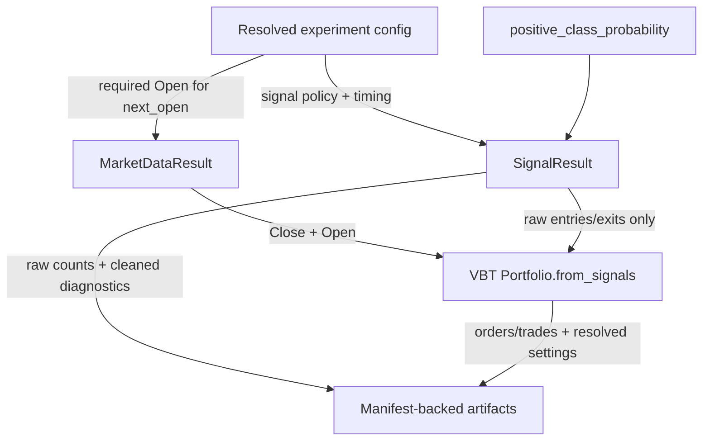

# feat: Add Signal Generation Contract

## Summary

Implement issue #11 by turning the current probability-to-signal scaffold into an explicit long-only signal contract. The plan adds a named hysteresis signal policy, next-open execution defaults, VBT delegation metadata, compact signal diagnostics, and split-aware artifact evidence while preserving `Portfolio.from_signals` as the v1 simulation path.

---

## Problem Frame

`research/aegis_research/signals.py` currently emits only raw `entries` and `exits`, while `research/aegis_research/portfolios.py` runs VBT with current-close default behavior. That leaves direction, timing, conflict, cleaning, and raw-count meaning implicit at the point where #9's `positive_class_probability` becomes trading intent.

---

## Requirements

- R1. Signal generation must consume standardized `positive_class_probability` panels and preserve probability metadata through diagnostics. Origin: R1, R6.
- R2. V1 signal generation must be long-only and must not imply shorting, reversal, or bearish leverage. Origin: R2, R11.
- R3. Signal policy must be a named long-only hysteresis policy with explicit long-entry and long-exit thresholds plus a no-action hold band. Origin: R3, R4.
- R4. Missing probabilities must emit no entry/exit signal and must be counted by split, set, and symbol where available. Origin: R5, AE3.
- R5. ETF/asset runs must default close-derived model probabilities to next-open execution and fail rather than silently falling back when open prices are missing. Origin: R7, R8, AE4, AE5.
- R6. Non-default timing may exist only as an explicit recorded assumption; v1 actively supports explicit `same_close`, while `next_close` and custom timing are deferred. Origin: R9.
- R7. Portfolio simulation may delegate repeated-signal, position-state, and conflict behavior to VBT, but resolved VBT settings must be visible in artifacts. Origin: R10, R12.
- R8. Raw signal counts must be labeled threshold-state counts, not expected order counts. Origin: R13, AE6.
- R9. Signal artifacts must include raw threshold-state signals, compact cleaned-diagnostic summaries, timing metadata, missing/simultaneous counts, and portfolio order/trade counts when simulation runs. Origin: R14, R15, R16, R18.
- R10. Split, set, timestamp, and symbol identity must remain visible through per-split and aggregate signal artifacts. Origin: R17, AE10.
- R11. Baseline docs/config examples must explain the v1 signal policy, timing default, VBT delegation, and out-of-scope shorting. Origin: success criteria and Scope Boundaries.

**Origin actors:** A1 experiment author, A2 signal stage, A3 portfolio stage, A4 reviewer or automation agent, A5 future strategy developer.

**Origin flows:** F1 generate long-only threshold-state signals, F2 simulate with explicit VBT execution semantics, F3 review signal diagnostics and artifacts.

**Origin acceptance examples:** AE1 policy/provenance metadata, AE2 invalid thresholds fail, AE3 NaN probabilities become no signal, AE4 next-open default, AE5 missing open rejects/fails explicit, AE6 repeated threshold states diverge from orders, AE7 reject `direction="both"`, AE8 cleaned diagnostics only, AE9 same-bar microstructure out of scope, AE10 split/set/symbol preservation.

---

## Scope Boundaries

- Do not add short-only, long/short, `direction="both"`, reversal, borrowing, futures, or bearish leverage behavior in v1.
- Do not derive short entries from `positive_class_probability`.
- Do not add probability calibration, threshold optimization, adaptive thresholds, or per-split tuning.
- Do not move to `from_order_func`, custom order simulation, intrabar event modeling, or same-bar close-then-reopen behavior.
- Do not introduce a custom VBT `signal_func_nb` for v1; the long-only hysteresis policy is representable as precomputed arrays, which keep `from_signals` cacheable and simpler.
- Do not use cleaned diagnostic signals as default portfolio inputs.
- Do not use VBT `nextvalidopen` or similar valid-price skipping modes as a silent substitute for missing Open data in v1.
- Do not add non-probability prediction-to-signal behavior.
- Do not preserve ambiguous pre-#9 `long_probability` naming unless implementation discovers a concrete persisted external consumer.

### Deferred to Follow-Up Work

- Full cleaned signal panels as separate public artifacts: v1 should start with compact cleaned diagnostics unless implementation proves reviewers need full duplicate panels.
- Long/short side-specific signal contracts: future work should start from a side-specific model output, signed target, or explicit short-score contract.
- `next_close` and custom execution timing modes: v1 should ship only `next_open` and explicit `same_close` until alternate timing modes have their own artifact and VBT semantics.
- Resource tuning for large matrices beyond diagnostics: chunking and `max_order_records` knobs can be planned separately if #11 exposes a concrete performance issue.

---

## Context & Research

### Relevant Code And Patterns

- `research/aegis_research/config.py` owns strict schema validation. `SignalConfig` currently has `long_threshold` and `exit_threshold`; `_validate_signals` already enforces `exit_threshold < long_threshold`.
- `research/aegis_research/signals.py` currently returns only `(entries, exits)` from `probabilities_to_signals`; this is the right seam for a signal result object and diagnostics.
- `research/aegis_research/portfolios.py` aligns close, entries, and exits before `vbt.Portfolio.from_signals`; this is the right seam for open-price alignment, next-open timing, and resolved VBT settings.
- `research/aegis_research/validation.py` holds `SplitValidationResult` and `ValidationResult`; it currently stores train/test probabilities, entries, exits, portfolios, metrics, and validation metadata.
- `research/aegis_research/experiments.py` chooses required OHLCV features, loads data, extracts `Close`, and passes close-only data into validation.
- `research/aegis_research/data.py` exposes `MarketDataResult.feature("Open")`; `required_ohlcv_features` currently depends only on label requirements.
- `research/aegis_research/provenance/experiment_artifacts.py` writes split probabilities, `signals_{set}.csv`, metrics, native portfolios, and aggregate probabilities/signals/metrics through manifest-backed atomic writes.
- `tests/research/aegis_research/test_config_contract.py`, `tests/research/aegis_research/test_validation_artifacts.py`, `tests/research/aegis_research/test_experiment_provenance.py`, and new focused signal/portfolio tests should cover the main seams.

### Institutional Learnings

- `docs/solutions/best-practices/vectorbt-execution-timing-nextopen-2026-05-17.md`: VBT defaults to same-bar current-close execution; close-derived daily signals should use next-open or explicit shifted timing.
- `docs/solutions/logic-errors/vectorbt-same-bar-stop-limitations-2026-05-17.md`: `Portfolio.from_signals` cannot execute two orders in one bar; same-bar microstructure must stay out of v1.
- `docs/solutions/performance-issues/vectorbt-large-from-signals-chunking-memory-2026-05-17.md`: signal and portfolio matrices can get large; diagnostics should be compact and resource-aware.
- `docs/solutions/logic-errors/vectorbt-allocation-column-alignment-2026-05-17.md`: align asset-shaped inputs by index and columns immediately before simulation and fail loudly on missing symbols.
- `docs/solutions/architecture-patterns/config-contract-security-reproducibility-2026-05-16.md`: config validation should be forward-first, path-aware, and fail before side effects.
- `docs/plans/2026-05-17-004-feat-model-plugin-target-probability-plan.md`: #9 establishes `positive_class_probability`, positive-class metadata, and uncalibrated probability status as upstream signal inputs.

### VectorBT PRO Evidence From Origin

- VBT supports direction-unaware `entries`/`exits` plus `direction`, and direction-aware long/short arrays. Origin evidence: `https://vectorbt.pro/pvt_16ebf9ef/documentation/portfolio/from-signals/#signals`.
- VBT consolidates signals through documented conflict resolution and can ignore repeated entries while already in position unless accumulation is enabled. Origin evidence: `https://vectorbt.pro/pvt_16ebf9ef/documentation/portfolio/from-signals/#signal-resolution`, `https://vectorbt.pro/pvt_16ebf9ef/documentation/portfolio/from-signals/#conflicts`, `https://vectorbt.pro/pvt_16ebf9ef/documentation/portfolio/from-signals/#accumulation`.
- `SignalsAccessor.clean` is appropriate for diagnostic event-chain summaries. Origin evidence: `https://vectorbt.pro/pvt_16ebf9ef/tutorials/signal-development/pre-analysis/#cleaning`.
- VBT defaults to same-bar current-close execution, and `price="nextopen"` expresses next-open behavior without separately shifting signals. Origin evidence: Discord threads in `docs/brainstorms/2026-05-17-signal-generation-conflict-semantics-requirements.md`.
- Official order-delay docs confirm VBT executes at the current bar by default and supports `price="nextopen"` / `price="nextclose"` to delay execution without manually shifting arrays: `https://vectorbt.pro/pvt_16ebf9ef/features/portfolio/#order-delays`.
- `Portfolio.from_signals` API confirms `entries` and `exits` are direction-unaware unless short-side arrays are provided, and `direction` takes effect only when `short_entries`/`short_exits` are absent: `https://vectorbt.pro/pvt_16ebf9ef/api/portfolio/base/#vectorbtpro.portfolio.base.Portfolio.from_signals`.
- `PriceType` API confirms `NextOpen` maps to Open with `from_ago=1`, and also exposes `NextValidOpen`; v1 should not use `NextValidOpen` silently because that would turn missing Open into implicit data skipping: `https://vectorbt.pro/pvt_16ebf9ef/api/portfolio/enums/#vectorbtpro.portfolio.enums.PriceType`.
- Maintainer support confirms no manual signal shift is needed when using `nextopen`: `https://discord.com/channels/918629562441695344/918630948248125512/1122187719695679529`.
- Maintainer support confirms array-based `from_signals` is cacheable and callbacks are slower; use callbacks only when a strategy cannot be represented with arrays: `https://discord.com/channels/918629562441695344/918630948248125512/1122185372298911805`.
- A small VBT MCP runtime check confirmed terminal-bar `price="nextopen"` entries produce no order because there is no next bar; this supports the plan's terminal non-executable diagnostic count. This is implementation evidence, not official product documentation.

---

## Key Technical Decisions

- Replace ambiguous threshold field names in the public signal contract with action-specific names: use a named `long_only_hysteresis` policy, `long_entry_threshold`, and `long_exit_threshold`; do not add compatibility aliases unless implementation finds a real persisted external consumer.
- Reject legacy `long_threshold` and `exit_threshold` public config fields rather than silently ignoring or aliasing them; the migration should be explicit and path-aware.
- Use strict threshold semantics for raw states: probability greater than `long_entry_threshold` emits entry state, probability less than `long_exit_threshold` emits exit state, and equality remains in the no-action hold band.
- Put execution timing under the signal policy contract, because timing is part of converting model probabilities into tradable intent; the portfolio stage should consume the resolved timing setting.
- Use `next_open` as the default timing mode, implemented through VBT's next-open order price semantics when open prices are available. Do not shift signals and also use next-open.
- Support only `next_open` and explicit `same_close` timing in v1; reject `next_close` and custom timing as follow-up work.
- Reject `next_valid_open` / VBT `NextValidOpen` behavior in v1 unless a future contract explicitly chooses valid-price skipping; missing Open should remain visible as data-quality failure or terminal non-executable evidence.
- For per-split `next_open` simulation, do not borrow execution rows from adjacent train/test slices. A terminal-bar raw signal with no following in-split Open remains part of raw signal diagnostics but is non-executable for that split and should be counted in portfolio diagnostics.
- Keep `portfolio.direction` effectively fixed to `longonly` in v1; config validation should reject `shortonly` and `both` while #11 has only one positive-class probability output.
- Keep raw threshold-state signals as the portfolio inputs. Compute cleaned diagnostics from raw entries/exits for interpretability, but keep them out of simulation.
- Keep signal generation array-based for v1 and avoid VBT `signal_func_nb`; the policy is not path-dependent and precomputed arrays preserve the simpler cached `from_signals` path.
- Use compact public JSON diagnostics for cleaned event-chain counts and policy metadata instead of adding full cleaned panel CSVs in v1. This satisfies reviewability while limiting artifact growth.
- Preserve existing raw signal CSV shape where practical, but version schema names to distinguish raw threshold-state signals from prior ambiguous `signals.v1` semantics.
- Record resolved VBT settings in public metadata even if they are defaults: direction, accumulation, conflict modes, opposite-entry behavior, timing mode, and one-order-per-bar limitation.
- Treat open-price availability as a data requirement when `next_open` timing is selected. Missing or unusable Open fails before portfolio simulation rather than falling back; unusable means missing aligned symbols or rows, null execution prices, or prices that violate existing market-data validity rules.

---

## Open Questions

### Resolved During Planning

- Should cleaned diagnostics be full bar-aligned panels? Draft resolution: no for v1. Store compact cleaned counts/settings in JSON; defer full panels until a reviewer need appears.
- Should v1 preserve old `long_threshold` and `exit_threshold` names? Draft resolution: no. Use forward-first action-specific names and update examples/tests.
- Should next-open timing shift signals before passing to VBT? No. VBT support guidance says `price="nextopen"` does not require separate shifting.
- Which timing modes are accepted in v1? Draft resolution: `next_open` by default and explicit `same_close` as an override; reject `next_close` and custom timing until a separate contract pins their semantics.
- Should v1 use VBT `NextValidOpen` when Open has gaps? Draft resolution: no. Treat missing or unusable Open as visible data-quality evidence instead of silently skipping to a later valid price.
- What happens at exact threshold equality? Draft resolution: strict comparisons keep equality in the hold band, so equality emits neither entry nor exit.
- How should next-open handle terminal split bars? Draft resolution: preserve split purity by not adding adjacent-set rows; terminal raw signals without a following in-split Open are diagnostics-only and counted as non-executable.

### Deferred to Implementation

- Exact VBT conflict-mode enum strings to persist: verify current VBT defaults during implementation and persist explicit resolved values rather than relying on implicit library defaults.
- Exact portfolio order-count extraction path: choose the least brittle VBT accessor during implementation and cover it with tests.
- Exact aggregate diagnostics shape: choose the smallest JSON shape that preserves split/set/symbol identity without duplicating large panels.

---

## High-Level Technical Design

> *This illustrates the intended approach and is directional guidance for review, not implementation specification. The implementing agent should treat it as context, not code to reproduce.*

---

## Implementation Units

### U1. Define Signal Config Contract

**Goal:** Add the forward-first v1 signal configuration shape and fail-fast validation for policy, thresholds, timing, and long-only portfolio direction.

**Requirements:** R2, R3, R5, R6, R7, R11; origin AE2, AE5, AE7.

**Dependencies:** None.

**Files:**
- Modify: `research/aegis_research/config.py`
- Modify: `research/configs/experiments/synthetic_ml_baseline.yaml`
- Modify: `research/configs/experiments/synthetic_purged_fixlb_baseline.yaml`
- Test: `tests/research/aegis_research/test_config_contract.py`

**Approach:**
- Introduce a named long-only hysteresis signal policy with action-specific threshold fields and a timing mode defaulting to `next_open`.
- Define accepted v1 timing modes explicitly: `next_open` requires Open prices, `same_close` is an explicit research override that does not require Open, and other timing strings fail in v1.
- Reject `next_valid_open` and equivalent valid-price-skipping timing strings in v1 so data gaps cannot silently change execution delay.
- Pin strict threshold comparison semantics in the config contract docs: equality with either threshold is part of the hold band, not an entry or exit.
- Reject invalid threshold ordering with path-aware errors on the new long-exit threshold path.
- Reject legacy `signals.long_threshold` and `signals.exit_threshold` keys with a path-aware forward-first migration error unless implementation discovers a concrete external consumer.
- Reject unsupported signal policies and unsupported timing modes before data loading or artifact writes.
- Reject `portfolio.direction` values other than `longonly` while the signal contract has only `positive_class_probability`.
- Update baseline experiment configs to the new forward-first signal field names rather than preserving old aliases.

**Execution note:** Start with config-contract tests so invalid public YAML cannot reach runtime stages.

**Patterns to follow:**
- Path-aware validation patterns in `research/aegis_research/config.py`.
- Existing enum casing tests in `tests/research/aegis_research/test_config_contract.py`.

**Test scenarios:**
- Happy path: minimal config resolves with default `long_only_hysteresis`, default thresholds, and `next_open` timing.
- Happy path: explicit `same_close` timing resolves as an explicit recorded override.
- Happy path: baseline YAML configs load after replacing old signal threshold fields.
- Error path: `long_exit_threshold >= long_entry_threshold` fails with the new exit-threshold config path.
- Error path: legacy `signals.long_threshold` or `signals.exit_threshold` fields fail with an explicit migration message.
- Error path: unknown signal policy fails before model registry or data loading is needed.
- Error path: unknown timing mode, `next_close`, `next_valid_open`, or custom timing fails with a path-aware config error in v1.
- Error path: `portfolio.direction: both` or `shortonly` fails for v1 with an explicit long-only contract message.
- Covers AE2. Invalid threshold ordering fails before signal artifacts can be produced.
- Covers AE7. `direction="both"` is rejected with only `positive_class_probability`.

**Verification:**
- Config resolution exposes the new signal policy and timing fields.
- Old ambiguous threshold names no longer appear in baseline configs or tests except in intentional rejection coverage.

---

### U2. Build Signal Result And Diagnostics

**Goal:** Replace the tuple-only signal conversion with a structured signal result carrying raw threshold-state panels, cleaned diagnostic counts, policy metadata, and missing/conflict counts.

**Requirements:** R1, R3, R4, R8, R9, R10; origin F1, F3, AE1, AE3, AE6, AE8.

**Dependencies:** U1.

**Files:**
- Modify: `research/aegis_research/signals.py`
- Test: `tests/research/aegis_research/test_signals.py`

**Approach:**
- Add a signal result data structure that exposes raw `entries` and `exits` as the simulation inputs plus diagnostics metadata.
- Change signal result creation to accept explicit probability metadata from validation, including source output name, positive-class metadata, and calibration status.
- Use strict threshold comparisons for raw states: above entry threshold enters, below exit threshold exits, and equality emits no raw signal.
- Keep NaNs as no-signal in raw outputs while counting missing probabilities by symbol.
- Count raw entry states, raw exit states, simultaneous entry/exit states, and total cells by symbol.
- Compute cleaned diagnostic counts from raw entries/exits using VBT signal cleaning defaults chosen for this contract; record cleaning settings with the diagnostics.
- Include policy name/version, threshold values, source probability output name, positive-class metadata when supplied by upstream metadata, and calibration status.
- Include split and set identity in diagnostics when validation supplies that context, so artifact writing does not need to infer it later.

**Execution note:** Implement behavior test-first because signal count semantics are easy to misread later.

**Patterns to follow:**
- Current `probabilities_to_signals` public seam in `research/aegis_research/signals.py`.
- Public-safe dictionary payload style used by label and indicator diagnostics.

**Test scenarios:**
- Happy path: probabilities above entry threshold produce raw entries, below exit threshold produce raw exits, and band values produce no signal.
- Edge case: probabilities exactly equal to `long_entry_threshold` or `long_exit_threshold` produce no raw entry or exit.
- Edge case: NaN probabilities produce no raw signal and increment missing counts.
- Edge case: multi-symbol missing values are counted by affected symbol and retain split/set identity when supplied.
- Edge case: repeated high probabilities produce repeated raw entry threshold states and cleaned diagnostic count lower than raw count.
- Edge case: a threshold configuration with a true simultaneous raw entry/exit is impossible under validated hysteresis; a synthetic diagnostic helper test can still prove simultaneous counts if raw masks are supplied directly.
- Metadata case: diagnostics preserve `positive_class_probability`, positive class, and uncalibrated status from supplied metadata.
- Covers AE1. Diagnostics include policy name, thresholds, source output name, positive class when available, and calibration status.
- Covers AE3. Missing probability cells become no signal and are counted.
- Covers AE6. Raw threshold-state counts are distinct from order expectations.
- Covers AE8. Cleaned diagnostics are separate from raw signals and marked diagnostics-only.

**Verification:**
- Callers can still access bar-aligned raw entries/exits for simulation.
- Diagnostics can be serialized as public JSON without private VBT/native objects.

---

### U3. Add Next-Open Portfolio Simulation Contract

**Goal:** Make portfolio simulation consume raw signal states with explicit next-open timing, open-price validation, long-only direction, and resolved VBT settings.

**Requirements:** R5, R6, R7, R8, R9; origin F2, AE4, AE5, AE6, AE9.

**Dependencies:** U1, U2.

**Files:**
- Modify: `research/aegis_research/portfolios.py`
- Modify: `research/aegis_research/reports.py`
- Test: `tests/research/aegis_research/test_portfolios.py`

**Approach:**
- Extend portfolio simulation to accept open prices when timing is `next_open`.
- Align close, open, raw entries, and raw exits by index and symbol before calling VBT; fail if required common columns or rows are missing.
- Define unusable Open for v1 as a missing Open panel, missing expected symbol, missing aligned row, null execution price, or any price that violates existing market-data validity rules.
- Do not switch to VBT `NextValidOpen` when Open contains gaps; fail or record terminal non-executable diagnostics according to the split-boundary rule.
- Prefer strict rejection over silent symbol dropping when close, open, and signal panels disagree about required symbols.
- Preserve split purity for `next_open`: do not append adjacent train/test rows only to satisfy a terminal execution price.
- Count terminal-bar raw signals that have no following in-split Open as non-executable diagnostics rather than treating them as orders.
- Pass raw entries/exits into `Portfolio.from_signals`; do not substitute cleaned diagnostics.
- Apply VBT next-open order price behavior for `next_open` without separately shifting signals; support explicit `same_close` only as the v1 override.
- Resolve and return or expose portfolio diagnostics: timing mode, direction, accumulation mode, conflict settings, opposite-entry setting, order count, trade count, and shape information.

**Execution note:** Add characterization coverage around current raw-entry delegation before changing timing behavior.

**Patterns to follow:**
- Existing alignment and fail-fast error in `research/aegis_research/portfolios.py`.
- Metrics extraction pattern in `research/aegis_research/reports.py`.

**Test scenarios:**
- Happy path: next-open timing with valid open/close panels passes open prices to VBT and returns diagnostics that identify `next_open`.
- Happy path: explicit `same_close` simulation does not require Open and records the override.
- Happy path: repeated raw entries are passed through to VBT while order/trade counts come from the resulting portfolio.
- Error path: next-open timing with missing open prices fails before VBT simulation.
- Error path: Open exists but contains null execution prices in required aligned rows.
- Error path: a null Open gap is rejected rather than skipped with `nextvalidopen` semantics.
- Error path: Open exists but lacks a signal/close symbol required for simulation.
- Error path: open/close/signal columns with no common symbols fail with an explicit portfolio input error.
- Edge case: entries/exits with extra symbols are rejected rather than silently dropped unless implementation documents a stricter upstream alignment invariant.
- Edge case: a last-bar raw signal under `next_open` remains in raw diagnostics, produces no cross-split execution, and increments a terminal non-executable count.
- Covers AE4. Default ETF run uses next-open when open prices are available.
- Covers AE5. Missing open does not silently degrade to same-close.
- Covers AE9. Same-bar close-and-reopen remains outside the simulation model.

**Verification:**
- Portfolio simulation no longer relies on VBT's same-close default for the default config.
- Portfolio diagnostics explain why raw signal counts can diverge from actual orders/trades.

---

### U4. Thread Signal Results Through Validation

**Goal:** Carry structured signal results and portfolio diagnostics through per-split and aggregate validation outputs while preserving split/set/symbol identity.

**Requirements:** R1, R4, R5, R7, R8, R9, R10; origin F1, F2, F3, AE3, AE6, AE10.

**Dependencies:** U2, U3.

**Files:**
- Modify: `research/aegis_research/validation.py`
- Modify: `tests/research/aegis_research/test_validation_artifacts.py`

**Approach:**
- Extend split and aggregate validation dataclasses to keep signal result data or diagnostics in addition to raw entries/exits.
- Add an explicit Open-price validation input for timing modes that require it.
- Make direct `evaluate_validation_splits` calls fail before portfolio simulation when `next_open` is selected and Open prices are omitted or unusable.
- Build the probability metadata passed into signal generation from target schema, model metadata, and validation metadata, including `positive_class_probability`, positive class, and calibration status.
- Pass open-price panels into validation when timing requires them.
- Keep train/test portfolio simulations bounded to their own split/set rows; do not add adjacent execution-only rows for terminal next-open signals.
- Split signal diagnostics into train/test views consistently with probability and raw signal panels.
- Store portfolio diagnostics with train/test split metadata so artifact writing can publish them without importing portfolio internals.
- Set validation metadata so `portfolio_execution_timing_checked` reflects the enforced timing contract.
- Preserve existing aggregate `entries`/`exits` behavior as raw threshold-state aggregate panels.

**Execution note:** Keep validation orchestration changes small and test with the existing synthetic purged flow.

**Patterns to follow:**
- `SplitValidationResult` and `ValidationResult` in `research/aegis_research/validation.py`.
- Existing `_concat_split_frames` aggregate behavior.

**Test scenarios:**
- Happy path: each split result includes raw entries/exits, signal diagnostics, portfolio diagnostics, and train/test probability identity.
- Happy path: direct validation with Open prices succeeds under default `next_open` and marks `portfolio_execution_timing_checked` true.
- Error path: direct validation with default `next_open` and no Open prices fails clearly before portfolio simulation.
- Integration: synthetic purged baseline still produces five split results with train/test signal diagnostics.
- Edge case: train/test terminal-bar next-open signals are visible in raw diagnostics and terminal non-executable counts without crossing split boundaries.
- Edge case: aggregate raw entries/exits preserve split labels and symbol columns.
- Covers AE3. Split diagnostics count missing probabilities in train/test sets when present.
- Covers AE6. Split diagnostics expose raw signal counts separately from portfolio order/trade counts.
- Covers AE10. Split/set/symbol identity is visible in validation metadata and aggregate outputs.

**Verification:**
- Validation result consumers can write artifacts without recomputing signal diagnostics.
- Existing report-building still receives train/test metrics in the same shape.

---

### U5. Require Open Data For Next-Open Runs

**Goal:** Make experiment orchestration request and pass Open prices whenever the resolved signal timing requires next-open execution.

**Requirements:** R5, R6; origin AE4, AE5.

**Dependencies:** U1, U3, U4.

**Files:**
- Modify: `research/aegis_research/data.py`
- Modify: `research/aegis_research/experiments.py`
- Test: `tests/research/aegis_research/test_market_data_quality.py`
- Test: `tests/research/aegis_research/test_experiment_provenance.py`

**Approach:**
- Add a timing-aware orchestration feature requirement helper that unions label-required OHLCV features with signal/portfolio timing requirements, rather than overloading label-only behavior unless that signature is intentionally expanded.
- For default `next_open`, require `Open` and pass the resulting open panel into validation.
- If a configured data source lacks Open while next-open is selected, fail at the data-quality boundary before portfolio simulation.
- Preserve existing label requirements for High/Low when `trendlb` or `pivotlb` are used.

**Patterns to follow:**
- `required_ohlcv_features` and `MarketDataResult.feature` in `research/aegis_research/data.py`.
- Data-quality failure tests in `tests/research/aegis_research/test_market_data_quality.py`.

**Test scenarios:**
- Happy path: default synthetic config requests and passes Open for next-open timing.
- Happy path: `fixlb` plus `next_open` requests `Close` and `Open`.
- Happy path: `trendlb` or `pivotlb` plus `next_open` requests `Close`, `High`, `Low`, and `Open`.
- Error path: a CSV or synthetic fixture missing Open fails when next-open timing is selected.
- Happy path: close-only data succeeds only under an explicit `same_close` timing override.
- Integration: `run_experiment` completes with the updated baseline config and writes completed manifest artifacts.
- Covers AE4. Open prices available means default run can use next-open.
- Covers AE5. Missing Open blocks next-open rather than falling back.

**Verification:**
- Open-price availability is established before validation starts.
- Run failure diagnostics remain redacted and manifest-safe if data quality fails.

---

### U6. Write Signal Diagnostics And Versioned Artifacts

**Goal:** Persist raw signal-state artifacts and public signal diagnostics with policy, timing, VBT settings, cleaned counts, and lineage.

**Requirements:** R1, R4, R7, R8, R9, R10; origin F3, AE1, AE3, AE6, AE8, AE10.

**Dependencies:** U2, U3, U4.

**Files:**
- Modify: `research/aegis_research/provenance/experiment_artifacts.py`
- Test: `tests/research/aegis_research/test_experiment_provenance.py`
- Test: `tests/research/aegis_research/test_vectorbt_artifacts.py`

**Approach:**
- Version the raw signal CSV schema to make threshold-state semantics explicit, for example `long_only_threshold_state_signals.v1`.
- Add per-split, per-set signal diagnostics JSON artifacts linked upstream to probabilities and downstream to metrics/portfolio artifacts.
- Write per-split signal diagnostics inside `ExperimentArtifactWriter.write_split_artifacts` immediately after raw signal CSV artifacts so manifest ordering and links remain local to the split callback.
- Add aggregate signal diagnostics JSON linked from per-split test diagnostics.
- Make aggregate diagnostics serialize validation-provided diagnostics instead of recomputing signal or portfolio semantics in the artifact writer.
- Include policy metadata, threshold values, source probability output, calibration status, missing counts, raw counts, cleaned counts, cleaning settings, timing mode, resolved VBT settings, order/trade counts, split/set/symbol identity, and shape summaries.
- Include terminal non-executable next-open signal counts so reviewers can separate raw threshold states from signals that had an in-split execution opportunity.
- Keep native portfolio artifacts private; public diagnostics must be sufficient for review without unpickling native VBT objects.
- Preserve artifact failure behavior: failed writes mark artifacts failed and remove partial files.

**Execution note:** Add provenance tests before changing artifact IDs because manifest ordering and upstream links are easy to break.

**Patterns to follow:**
- `_write_csv_artifact`, `_write_json_artifact`, and `_signals_frame` in `research/aegis_research/provenance/experiment_artifacts.py`.
- Manifest-backed artifact tests in `tests/research/aegis_research/test_experiment_provenance.py`.

**Test scenarios:**
- Happy path: a completed run manifest includes per-split signal CSVs and signal diagnostics JSON artifacts.
- Happy path: aggregate signal diagnostics links to split test diagnostics.
- Integration: manifest ordering and upstream/downstream links reflect raw signals, diagnostics, metrics, and portfolio metadata without dangling artifact IDs.
- Error path: diagnostics JSON write failure marks the artifact failed and does not leave an untracked partial file.
- Integration: native portfolio metadata sidecars include resolved signal/portfolio diagnostics without leaking private native objects.
- Covers AE1. Signal diagnostics include policy/provenance metadata.
- Covers AE8. Cleaned diagnostics are present and marked diagnostics-only.
- Covers AE10. Aggregate signal diagnostics preserve split/set/symbol evidence.

**Verification:**
- Reviewers can inspect public artifacts to compare raw signal density, cleaned diagnostic density, and actual order/trade density.
- Manifest validation passes for completed and failure-path runs.

---

### U7. Update Docs And Baseline Expectations

**Goal:** Document the signal contract and update scaffold docs so future planners and implementers do not reintroduce same-close or shorting assumptions.

**Requirements:** R11 and all origin success criteria.

**Dependencies:** U1, U2, U3, U6.

**Files:**
- Modify: `docs/vectorbt-scaffold.md`
- Modify: `docs/model-plugins.md`
- Modify: `research/configs/experiments/synthetic_ml_baseline.yaml`
- Modify: `research/configs/experiments/synthetic_purged_fixlb_baseline.yaml`
- Test: `tests/research/aegis_research/test_config_contract.py`

**Approach:**
- Explain that signal thresholds consume uncalibrated `positive_class_probability` and produce long-only threshold states.
- Document strict threshold equality semantics: equality with either threshold is hold/no-action.
- Document the accepted v1 timing enum values, default `next_open`, and explicit `same_close` override.
- Document next-open as the default for close-derived ETF/asset runs and same-close as an explicit override.
- Document that `next_valid_open` / `NextValidOpen` is intentionally not a v1 fallback for Open gaps.
- Document that next-open simulation does not borrow adjacent split rows; terminal split-bar raw signals without a following in-split Open are diagnostics-only.
- Document that raw signal counts are threshold-state counts, not order counts.
- Document that cleaned diagnostics are review evidence, not simulation inputs.
- Document that shorting and `direction="both"` require a future side-specific contract.
- Document that legacy `long_threshold` and `exit_threshold` config names are rejected, not aliases.

**Patterns to follow:**
- Existing module descriptions and config-contract prose in `docs/vectorbt-scaffold.md`.
- Probability metadata language in `docs/model-plugins.md`.

**Test scenarios:**
- Test expectation: no dedicated doc parser test unless existing docs tests are added later; baseline config load tests cover YAML updates.

**Verification:**
- Docs describe the same policy and timing defaults implemented by config and artifacts.
- Baseline configs are runnable examples of the new contract.

---

## System-Wide Impact

- **Interaction graph:** Config affects data feature requirements, signal generation, portfolio simulation, validation result shape, artifact writing, and report evidence.
- **Error propagation:** Invalid policy/timing/direction should fail during config validation; missing Open should fail at data quality or pre-simulation boundary; artifact failures should keep existing manifest failure semantics.
- **State lifecycle risks:** Per-split artifacts are written incrementally; failures after completed splits must preserve completed split artifacts without marking later split artifacts complete.
- **API surface parity:** Programmatic callers of `evaluate_validation_splits` need an open-price input or explicit timing override in tests and examples.
- **Integration coverage:** End-to-end `run_experiment` coverage is required because unit tests alone will not prove config-to-data-to-validation-to-artifact wiring.
- **Unchanged invariants:** Model training remains split-local; portfolio simulation remains VBT `from_signals`; native VBT portfolios remain private sidecars with public metadata as review evidence.

---

## Risks & Dependencies

| Risk | Mitigation |
|------|------------|
| Next-open default breaks existing close-only configs or tests. | Update baseline configs and require Open only when timing needs it; add explicit same-close override coverage. |
| Artifact volume grows with raw plus cleaned panels. | Store raw panels as CSV and cleaned diagnostics as compact JSON counts/settings in v1. |
| VBT defaults differ by installed version. | Persist resolved VBT settings explicitly and add tests against the configured behavior. |
| Raw counts are mistaken for orders. | Label raw counts as threshold-state counts and include actual order/trade counts side by side. |
| New dataclass fields break artifact callbacks. | Update `SplitValidationResult`, `ValidationResult`, and artifact writer tests together in U4/U6. |
| Open-price alignment silently drops symbols. | Align close/open/signals strictly and test missing or mismatched symbols. |

---

## Documentation / Operational Notes

- Update `docs/vectorbt-scaffold.md` as the durable contract for signal policy, timing, and portfolio assumptions.
- Keep docs clear that VBT evidence supports multiple timing modes; this project chooses next-open as its conservative ETF/asset default.
- If implementation discovers a real external artifact consumer relying on old threshold names, stop and document the compatibility need before adding any shim.

---

## Sources & References

- **Origin document:** `docs/brainstorms/2026-05-17-signal-generation-conflict-semantics-requirements.md`
- Related plan: `docs/plans/2026-05-17-004-feat-model-plugin-target-probability-plan.md`
- Project scaffold: `docs/vectorbt-scaffold.md`
- Execution timing learning: `docs/solutions/best-practices/vectorbt-execution-timing-nextopen-2026-05-17.md`
- Same-bar limitation learning: `docs/solutions/logic-errors/vectorbt-same-bar-stop-limitations-2026-05-17.md`
- Config/provenance learning: `docs/solutions/architecture-patterns/config-contract-security-reproducibility-2026-05-16.md`
- VectorBT from signals docs: `https://vectorbt.pro/pvt_16ebf9ef/documentation/portfolio/from-signals/`
- VectorBT order delays docs: `https://vectorbt.pro/pvt_16ebf9ef/features/portfolio/#order-delays`
- VectorBT `Portfolio.from_signals` API: `https://vectorbt.pro/pvt_16ebf9ef/api/portfolio/base/#vectorbtpro.portfolio.base.Portfolio.from_signals`
- VectorBT `PriceType` API: `https://vectorbt.pro/pvt_16ebf9ef/api/portfolio/enums/#vectorbtpro.portfolio.enums.PriceType`
- Discord support, `nextopen` needs no manual shifting: `https://discord.com/channels/918629562441695344/918630948248125512/1122187719695679529`
- Discord support, array signals preferred over callbacks when representable: `https://discord.com/channels/918629562441695344/918630948248125512/1122185372298911805`
