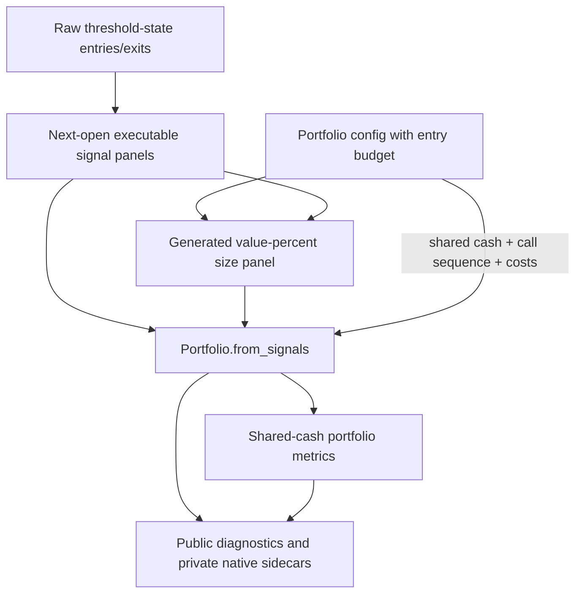

# feat: Add Shared-Cash Portfolio Simulation Contract

## Summary

Implement issue #4 by replacing the generic per-signal portfolio sizing surface with an explicit shared-cash entry-budget contract. The plan keeps the existing `Portfolio.from_signals` path, generates a value-percent size panel from executable entry signals, runs one shared-cash group with sell-before-buy ordering, and makes metrics/artifacts report the resulting assumptions clearly.

---

## Problem Frame

The scaffold now has explicit long-only signal semantics and next-open timing, but portfolio PnL can still be misread when multiple symbols share one cash pool. The plan addresses the implementation gap between event-style signals and target-weight allocation so shared-cash results do not silently behave like independent per-symbol backtests or hidden rebalancing systems.

---

## Requirements

- R1. V1 portfolio simulation must use one shared cash pool for configured symbol columns. Origin: R1, F1.
- R2. Portfolio simulation remains event-style: entries open exposure and exits close exposure, with no automatic rebalance of existing positions. Origin: R2, R3, AE3.
- R3. Experiment configs must state an explicit entry budget for signal-sized portfolio entries. Origin: R4, R6, AE2.
- R4. Entry sizing must split the explicit budget across executable same-bar entry signals using value-percent sizing against portfolio value. Origin: R5, AE1.
- R5. Same-bar shared-cash execution must use sell-before-buy ordering and record VectorBT's predetermined-price caveat. Origin: R7, R8, AE4.
- R6. Public diagnostics must record portfolio factory, sizing, shared-cash grouping, order sequence, timing, costs, raw/simulation signal counts, and actual order/trade counts. Origin: R9, R10, R14, R16, AE5.
- R7. Equal-weight active books, ranked top-N allocation, target-weight matrices, and continuous rebalancing stay outside the baseline signal simulator. Origin: R11, R12, R13, AE6.
- R8. Metrics artifacts must identify frequency, annualization, benchmark status, and shared-cash metric scope. Origin: R15, AE7.

**Origin actors:** A1 experiment author, A2 portfolio stage, A3 run reviewer or automation agent, A4 future allocation-strategy developer.

**Origin flows:** F1 run shared-cash signal simulation, F2 reject or defer target-weight allocation behavior, F3 review portfolio evidence.

**Origin acceptance examples:** AE1 split entry budget across same-bar entries, AE2 missing budget fails, AE3 no implicit rebalance, AE4 sell-before-buy diagnostics, AE5 public portfolio evidence, AE6 defer allocation modes, AE7 metric assumptions visible.

---

## Scope Boundaries

- Do not add equal-weight active-book rebalancing, ranked top-N selection, optimizer allocation, or target-weight matrices to the baseline portfolio path.
- Do not automatically shrink existing positions when new entries appear.
- Do not introduce a custom `from_order_func` simulator or dynamic cash-aware callback in this issue.
- Do not add short-only, long/short, reversal, leverage, margin, borrowing, futures multiplier, or side-specific allocation behavior beyond the existing long-only v1 signal contract.
- Do not expand advanced stop-loss or take-profit behavior; the existing VectorBT limitations and signal contract remain authoritative.
- Do not keep backward-compatibility shims for generic `portfolio.size` or public `portfolio.size_type` unless implementation discovers a persisted external consumer that requires migration handling.

### Deferred to Follow-Up Work

- Target-weight allocation mode: plan separately around `from_orders`, PortfolioOptimizer, or an allocation-specific contract.
- Ranked or probability-scored selection: plan separately once the product defines a ranking source and selection rule.
- Dynamic cash-aware execution: plan separately around `from_order_func` or callbacks when a strategy needs path-dependent caps, retry-on-cash-available behavior, or custom fill logic.
- Benchmark inputs: add a benchmark config and `bm_close` flow later; this plan records benchmark status as `none` until that exists.
- Rejection/log detail beyond order/trade counts: add VBT logs or rejection diagnostics later if shared-cash runs expose real `NoCash` or partial-fill review needs.

---

## Context & Research

### Relevant Code and Patterns

- `research/aegis_research/config.py` owns frozen config dataclasses, strict unknown-field rejection, and path-aware validation before side effects.
- `research/aegis_research/portfolios.py` is the shared-cash implementation seam: it validates price/signal frame alignment, filters non-executable next-open signals, calls `Portfolio.from_signals`, and builds portfolio diagnostics.
- `research/aegis_research/validation.py` passes per-split train/test close, entries, exits, and Open panels into `simulate_portfolio`, then passes native portfolios into `portfolio_metrics`.
- `research/aegis_research/reports.py` owns portfolio metric extraction and currently uses `ReportConfig.freq` / `year_freq` for Sharpe calculation.
- `research/aegis_research/provenance/experiment_artifacts.py` already publishes portfolio diagnostics and metrics as public JSON and stores native portfolios privately with diagnostics sidecars.
- `tests/research/aegis_research/test_portfolios.py` covers timing, input alignment, non-executable next-open signals, and raw-vs-order count divergence.
- `tests/research/aegis_research/test_config_contract.py`, `tests/research/aegis_research/test_validation_artifacts.py`, `tests/research/aegis_research/test_experiment_provenance.py`, and `tests/research/aegis_research/test_reports.py` cover the config, validation, artifact, and report seams that this plan extends.

### Institutional Learnings

- `docs/solutions/best-practices/vectorbt-weights-from-signals-vs-orders-2026-05-17.md`: keep real entry/exit signals on `from_signals` with `valuepercent`; target weights/rebalancing belong elsewhere.
- `docs/solutions/best-practices/vectorbt-targetpercent-nocash-rejections-2026-05-17.md`: `call_seq="auto"` helps ordering but does not guarantee cash availability; avoid promising target-rebalance outcomes.
- `docs/solutions/best-practices/vectorbt-execution-timing-nextopen-2026-05-17.md`: timing must stay explicit for close-derived signals.
- `docs/solutions/logic-errors/vectorbt-allocation-column-alignment-2026-05-17.md`: asset-shaped arrays must match price index and columns exactly before VectorBT simulation.
- `docs/solutions/logic-errors/vectorbt-same-bar-stop-limitations-2026-05-17.md`: same-bar multi-order microstructure stays outside `from_signals` v1.
- `docs/solutions/performance-issues/vectorbt-large-from-signals-chunking-memory-2026-05-17.md`: public diagnostics should summarize generated matrices instead of writing large redundant panels by default.
- `docs/solutions/architecture-patterns/config-contract-security-reproducibility-2026-05-16.md`: config changes should be schema-versioned, fail-fast, and reproducible through redacted public artifacts.

### External References

- VectorBT PRO `Portfolio.from_signals` API: supports broadcastable `size`, `size_type`, `cash_sharing`, `group_by`, `call_seq`, timing prices, and benchmark inputs.
- VectorBT PRO cash-sharing docs: `cash_sharing=True` creates cross-asset dependencies and assumes grouped orders execute in the same tick while retaining predetermined prices.
- VectorBT PRO call-sequence docs: `call_seq="auto"` can sort sell orders before buy orders but carries predetermined-price and flexible-execution caveats.
- VectorBT PRO support context: `percent` sizes against available cash, while `valuepercent` sizes against portfolio value and is the correct fit for event-style signal entries.

---

## Key Technical Decisions

- Replace public generic sizing with `entry_budget`: configs state the total portfolio-value share available to signal entries, while the implementation generates the VectorBT size panel internally.
- Treat `size_type` as resolved implementation metadata: shared-cash v1 always uses VectorBT `valuepercent` sizing, so public configs should not accept arbitrary size-type selection for this path.
- Require explicit entry budget for all v1 portfolio configs: this avoids hidden 100% allocation in both one-symbol and multi-symbol runs and keeps examples honest.
- Split budget after next-open executability filtering: terminal and market-gap signals remain raw diagnostic evidence, but they receive no budget because they cannot execute in that split.
- Count executable current-bar entry states for budget splitting: repeated entries and same-symbol entry/exit conflicts may still be ignored by VectorBT order resolution, so diagnostics must preserve the difference between simulation entries and actual orders.
- Use one all-symbol shared-cash group: pass VectorBT shared-cash grouping for all columns and serialize the resolved grouping as a single portfolio cash pool.
- Use sell-before-buy ordering: pass VectorBT automatic call sequencing and record the predetermined-price caveat; do not build custom ordering in v1.
- Keep metrics report-owned: public metrics artifacts should record `freq`, `year_freq`, benchmark status, and shared-cash metric scope; portfolio construction does not need report config just to satisfy auditability.
- Make shared-cash metrics group-level first: headline metrics should describe the shared portfolio, not an average of independent per-symbol simulations.

---

## Open Questions

### Resolved During Planning

- What config shape expresses explicit entry budget? Use a distinct `portfolio.entry_budget` field and remove/reject the generic public `portfolio.size` / `portfolio.size_type` surface for this v1 path.
- Which signals receive budget? Executable simulation entries after next-open terminal/gap filtering, not raw entries that cannot execute in the split.
- Do repeated entries or same-symbol conflicts consume budget? They count at the simulation-entry layer; actual order/trade counts remain the evidence of what VectorBT executed.
- What VectorBT grouping values should the baseline use? One shared group across all symbol columns with `cash_sharing=True`, all-symbol grouping, and automatic call sequence.
- Where do metric assumptions live? In metrics payloads and validation/report metadata, with benchmark status recorded as `none` until benchmark data support exists.

### Deferred to Implementation

- Exact helper names for sizing, diagnostics, and metric-scope extraction should be chosen during implementation to fit the touched code cleanly.
- Exact VBT accessor calls for group-level shared-cash metrics should be verified against current VectorBT behavior while adding focused tests.
- Exact rejected/partial-order diagnostics are deferred unless VectorBT exposes them cheaply without enabling large log artifacts.

---

## High-Level Technical Design

> *This illustrates the intended approach and is directional guidance for review, not implementation specification. The implementing agent should treat it as context, not code to reproduce.*

Decision matrix for v1 behavior:

| Strategy intent | Baseline path | Resulting behavior |
|---|---|---|
| Event-style long entries/exits | `from_signals` | Entry budget is split across executable current-bar entries |
| Equal-weight active book | Deferred allocation mode | Existing positions are not automatically resized |
| Ranked top-N allocation | Deferred allocation mode | Ranking source and selection rule must be planned separately |
| Path-dependent cash caps or retries | Deferred dynamic execution mode | Requires callback or `from_order_func` planning |

---

## Implementation Units

### U1. Define Entry-Budget Config Contract

**Goal:** Replace the generic signal sizing config surface with an explicit entry-budget contract that fails before runtime when portfolio assumptions are ambiguous.

**Requirements:** R3, R4, R7; origin AE1, AE2, AE6.

**Dependencies:** None.

**Files:**
- Modify: `research/aegis_research/config.py`
- Modify: `research/configs/experiments/synthetic_ml_baseline.yaml`
- Modify: `research/configs/experiments/synthetic_purged_fixlb_baseline.yaml`
- Test: `tests/research/aegis_research/test_config_contract.py`

**Approach:**
- Add `entry_budget` to `PortfolioConfig` as the public sizing contract for v1 signal entries.
- Require `entry_budget` to be finite, numeric, greater than zero, and no greater than one.
- Remove or explicitly reject public `portfolio.size` and `portfolio.size_type` for schema v2 shared-cash signal runs; diagnostics will still record the internally resolved VectorBT size type.
- Keep existing validation for `init_cash`, `fees`, `slippage`, and long-only `direction`.
- Keep target-size types rejected, but reframe the error around allocation modes being deferred rather than accepted inside the baseline signal path.
- Update baseline experiment YAML files to declare the explicit entry budget instead of relying on `size: 1.0` and `size_type: valuepercent`.

**Execution note:** Start with config-contract tests so invalid public configs cannot reach VectorBT construction.

**Patterns to follow:**
- `_validate_portfolio` path-aware validation in `research/aegis_research/config.py`.
- Unknown-field rejection through `_section` in `research/aegis_research/config.py`.

**Test scenarios:**
- Happy path: baseline configs resolve with explicit `portfolio.entry_budget` and no public `portfolio.size_type`.
- Happy path: direct config resolution preserves `init_cash`, costs, entry budget, and `direction: longonly`.
- Error path: missing `portfolio.entry_budget` fails with a path-specific validation issue.
- Error path: `entry_budget` equal to zero, negative, greater than one, non-numeric, NaN, or infinite fails before config resolution returns.
- Error path: public `portfolio.size` or `portfolio.size_type` in schema v2 fails with a forward-first migration message.
- Error path: explicit target-allocation sizing such as target-percent is rejected as an allocation-mode concern.
- Covers AE2. A config without explicit budget fails before portfolio artifacts can be written.
- Covers AE6. Target-weight allocation intent is rejected or deferred rather than squeezed into signal sizing.

**Verification:**
- Valid experiment configs expose an explicit entry budget.
- No production config example depends on implicit 100% entry sizing.

---

### U2. Generate Shared-Cash Signal Sizes

**Goal:** Build the generated value-percent size panel and pass explicit shared-cash VectorBT settings into the existing `from_signals` simulation seam.

**Requirements:** R1, R2, R4, R5, R6; origin F1, AE1, AE3, AE4, AE5.

**Dependencies:** U1.

**Files:**
- Modify: `research/aegis_research/portfolios.py`
- Test: `tests/research/aegis_research/test_portfolios.py`

**Approach:**
- Generate the VectorBT `size` input from executable `simulation_entries` after terminal/gap filtering.
- For each row with one or more executable entries, divide `entry_budget` by the active executable entry count and assign that value only to entry cells for that row.
- Avoid divide-by-zero on no-entry rows and avoid assigning budget to terminal/gap-filtered raw signals.
- Pass the generated size panel to `Portfolio.from_signals` with internally resolved `valuepercent` sizing.
- Pass one shared cash group across all symbol columns and automatic call sequencing so exits/sells can free cash before buys.
- Keep existing long-only settings, accumulation disabled, and next-open / same-close timing behavior.
- Preserve exact index/column validation for close, entries, exits, Open, and generated size inputs.
- Record enough sizing summaries to audit behavior without writing the full size matrix as a public artifact.

**Execution note:** Add focused tests around the generated size panel and resulting order behavior before broad validation tests.

**Patterns to follow:**
- `_simulation_signals`, `_assert_same_index`, `_assert_same_columns`, and `_true_count` in `research/aegis_research/portfolios.py`.
- Existing raw-vs-order count tests in `tests/research/aegis_research/test_portfolios.py`.

**Test scenarios:**
- Happy path: two executable entries on the same bar with `entry_budget=0.6` each receive 30% value-percent sizing.
- Happy path: one executable entry with `entry_budget=0.6` receives 60%, not an implicit 100%.
- Edge case: no active entries on a row produces no divide-by-zero and no unexpected orders.
- Edge case: terminal next-open entry receives no budget and produces no order.
- Edge case: market-index gap entry receives no budget and preserves gap non-executable diagnostics.
- Edge case: repeated entry while already long remains in simulation-entry counts, while actual order count stays lower because accumulation is disabled.
- Edge case: same-symbol simultaneous entry/exit state is counted consistently at the simulation-entry layer and actual VectorBT order behavior is visible through diagnostics.
- Integration: one symbol exits and another enters on the same bar; automatic call sequence is passed and diagnostics record sell-before-buy semantics.
- Integration: multi-symbol shared-cash run uses one cash pool rather than independent per-symbol cash pools.
- Covers AE1. Same-bar entries split the explicit budget.
- Covers AE3. New entries do not shrink existing positions into target weights.
- Covers AE4. Sell-before-buy ordering is applied and recorded.

**Verification:**
- `simulate_portfolio` no longer passes a scalar public size directly to VectorBT.
- Shared-cash tests prove budget splitting and one-cash-pool behavior independently of validation orchestration.

---

### U3. Expand Portfolio Diagnostics

**Goal:** Make public portfolio diagnostics describe the shared-cash simulation contract without requiring private VectorBT portfolio objects.

**Requirements:** R5, R6; origin F3, AE4, AE5.

**Dependencies:** U2.

**Files:**
- Modify: `research/aegis_research/portfolios.py`
- Modify: `research/aegis_research/provenance/experiment_artifacts.py`
- Test: `tests/research/aegis_research/test_portfolios.py`
- Test: `tests/research/aegis_research/test_experiment_provenance.py`
- Test: `tests/research/aegis_research/test_validation_artifacts.py`

**Approach:**
- Extend `PORTFOLIO_DIAGNOSTICS_SCHEMA_VERSION` only if the payload shape changes incompatibly enough to warrant a new version.
- Add diagnostics for portfolio factory, internal sizing mode, explicit entry budget, entry-budget interpretation, generated size summary, shared-cash setting, resolved grouping, call sequence, order-sequence caveat, timing mode, costs, direction, accumulation, and one-order-per-bar limitation.
- Keep raw signal counts, simulation signal counts, and actual order/trade counts distinct.
- Separate shared-group record totals from symbol-level record counts so grouped VectorBT results are not mislabeled as per-symbol diagnostics.
- Add allocation-boundary metadata that states the mode is event-style signals and does not rebalance existing positions.
- Keep native portfolio artifacts private/local, but ensure their metadata sidecars include the same public diagnostics already written as JSON.
- Avoid public full size-matrix artifacts unless implementation discovers reviewers need them; summary diagnostics are the v1 default.

**Patterns to follow:**
- Existing `portfolio_diagnostics` payload construction in `research/aegis_research/portfolios.py`.
- `assert_public_metadata_safe` checks in `research/aegis_research/provenance/experiment_artifacts.py`.
- Manifest-backed artifact assertions in `tests/research/aegis_research/test_experiment_provenance.py`.

**Test scenarios:**
- Happy path: portfolio diagnostics include factory, generated size type, entry budget, shared cash, grouping, call sequence, timing, fees, slippage, direction, accumulation, and event-style allocation mode.
- Happy path: generated sizing summary includes active-entry row counts and min/max nonzero per-entry value-percent values without writing a full public matrix.
- Happy path: grouped portfolio diagnostics expose group-level order/trade totals and per-symbol order/trade counts under distinct names.
- Edge case: raw entries, simulation entries, and executed orders diverge, and diagnostics preserve all three counts.
- Integration: split portfolio diagnostics written by `ExperimentArtifactWriter` include the shared-cash contract fields.
- Integration: native portfolio metadata sidecar duplicates public portfolio diagnostics safely.
- Integration: aggregate validation portfolio diagnostics preserve per-split shared-cash assumptions.
- Covers AE5. A reviewer can audit shared-cash assumptions from public artifacts and native sidecars without loading a pickle.

**Verification:**
- Public diagnostics are JSON-safe and contain no native VectorBT objects.
- Existing manifest ordering still links signals to portfolio diagnostics to metrics.

---

### U4. Make Metrics Shared-Cash Aware

**Goal:** Ensure reported metrics describe the shared portfolio/group rather than an average of independent symbol results, and record frequency/benchmark assumptions in public artifacts.

**Requirements:** R8; origin AE7.

**Dependencies:** U2, U3.

**Files:**
- Modify: `research/aegis_research/reports.py`
- Modify: `research/aegis_research/validation.py`
- Test: `tests/research/aegis_research/test_reports.py`
- Test: `tests/research/aegis_research/test_validation_artifacts.py`
- Test: `tests/research/aegis_research/test_experiment_provenance.py`

**Approach:**
- Treat shared-cash group/portfolio metrics as the primary values used by survival reporting.
- Keep symbol-level information only as diagnostic detail where VectorBT exposes it meaningfully, not as the headline aggregate for a shared-cash run.
- Add metric assumptions to metrics payloads: frequency, annualization frequency, benchmark status, benchmark source, and metric scope.
- Record benchmark status as absent/none until a future benchmark-close input is planned.
- Preserve the existing top-level metric keys consumed by `build_survival_report`, while clarifying their shared-cash scope in metadata.
- Keep aggregate split metrics descriptive, consistent with the existing validation contract.

**Patterns to follow:**
- Current `portfolio_metrics` / `build_survival_report` separation in `research/aegis_research/reports.py`.
- Validation metadata construction in `research/aegis_research/validation.py`.

**Test scenarios:**
- Happy path: shared-cash portfolio metrics return primary total return, Sharpe, drawdown, trade count, win rate, and fees at portfolio/group scope.
- Happy path: metrics payload includes `freq`, `year_freq`, benchmark status, and metric scope.
- Edge case: no benchmark input records benchmark status as none rather than implying a relative benchmark exists.
- Integration: validation split metrics and survival report continue to consume top-level metric fields after shared-cash metric semantics change.
- Integration: metrics artifact written through provenance includes metric assumptions.
- Covers AE7. Sharpe and benchmark-related assumptions are inspectable in public metrics/report artifacts.

**Verification:**
- Survival report thresholds still evaluate against top-level OOS metrics.
- Shared-cash headline metrics are not computed as a mean of independent per-symbol portfolios.

---

### U5. Update Documentation And Examples

**Goal:** Align public docs and examples with the shared-cash entry-budget contract and the boundary to allocation modes.

**Requirements:** R1, R2, R3, R7, R8; origin success criteria and Scope Boundaries.

**Dependencies:** U1, U2, U3, U4.

**Files:**
- Modify: `docs/vectorbt-scaffold.md`
- Modify: `README.md`
- Modify: `research/configs/experiments/synthetic_ml_baseline.yaml`
- Modify: `research/configs/experiments/synthetic_purged_fixlb_baseline.yaml`

**Approach:**
- Update the scaffold docs to state that v1 portfolio simulation uses one shared cash pool and event-style signal entries.
- Document `entry_budget` as total portfolio-value share allocated across executable same-bar entries.
- Explain that entries do not rebalance existing positions and that equal-weight or ranked allocation belongs to a future allocation mode.
- Document sell-before-buy ordering and the VectorBT predetermined-price caveat at a reviewer-friendly level.
- Document metric scope, frequency assumptions, and benchmark status.
- Update example configs to show the forward-first portfolio section without generic `size` / `size_type` fields.

**Patterns to follow:**
- Existing signal and portfolio sections in `docs/vectorbt-scaffold.md`.
- README's concise scaffold capability list.

**Test scenarios:**
- Test expectation: none -- documentation and example YAML behavior is covered by config-contract and end-to-end artifact tests in U1 through U4.

**Verification:**
- Docs no longer imply independent per-symbol cash or hidden 100% entry allocation.
- Docs clearly direct target-weight/rebalance strategies away from the baseline `from_signals` path.

---

## System-Wide Impact

- **Interaction graph:** Config validation changes flow into validation, portfolio simulation, metrics, artifact sidecars, README/docs, and baseline experiment configs.
- **Error propagation:** Missing or invalid entry-budget config should fail during config resolution; panel alignment and missing Open failures remain runtime validation errors at the portfolio seam.
- **State lifecycle risks:** Artifact order remains unchanged: signal diagnostics precede portfolio diagnostics, which precede metrics. Native portfolio sidecars should not become the only place where assumptions are stored.
- **API surface parity:** CLI behavior changes through config validation and artifacts, not through a new command surface.
- **Integration coverage:** End-to-end run tests must prove per-split and aggregate artifacts expose the shared-cash contract.
- **Unchanged invariants:** The model, signal threshold policy, next-open timing default, long-only direction, and purged-validation split semantics stay governed by earlier contracts.

---

## Risks & Dependencies

| Risk | Mitigation |
|------|------------|
| Shared-cash metrics accidentally remain per-symbol averages | Add focused report tests and mark metric scope in payloads |
| Entry-budget sizing is computed from raw non-executable signals | Generate sizing only after existing `_simulation_signals` filtering |
| `call_seq="auto"` is mistaken for a custom realistic execution engine | Record the VectorBT caveat and defer dynamic execution modes |
| Removing `size` / `size_type` breaks existing example configs | Update all in-repo configs and tests; avoid compatibility shims unless a persisted external consumer is found |
| Public diagnostics grow too large if full size matrices are serialized | Store summaries by default and keep full matrices private or absent in v1 |
| Fees/slippage cause order rejections near full budget | Record costs and actual order/trade counts; defer detailed rejection logs unless real review needs appear |

---

## Documentation / Operational Notes

- Update `docs/vectorbt-scaffold.md` before implementation is considered complete so future agents understand the entry-budget contract.
- The plan changes public config semantics; any existing local experiment YAML outside the tracked examples will need to replace generic `size` / `size_type` with `entry_budget`.
- No run-artifact migration is planned; existing historical run directories are not part of the public compatibility contract.

---

## Sources & References

- **Origin document:** [docs/brainstorms/2026-05-18-portfolio-simulation-contract-requirements.md](../brainstorms/2026-05-18-portfolio-simulation-contract-requirements.md)
- Related requirements: [docs/brainstorms/2026-05-17-signal-generation-conflict-semantics-requirements.md](../brainstorms/2026-05-17-signal-generation-conflict-semantics-requirements.md)
- Scaffold docs: [docs/vectorbt-scaffold.md](../vectorbt-scaffold.md)
- Related code: `research/aegis_research/config.py`
- Related code: `research/aegis_research/portfolios.py`
- Related code: `research/aegis_research/reports.py`
- Related code: `research/aegis_research/validation.py`
- Related artifacts: `research/aegis_research/provenance/experiment_artifacts.py`
- VectorBT learning: [docs/solutions/best-practices/vectorbt-weights-from-signals-vs-orders-2026-05-17.md](../solutions/best-practices/vectorbt-weights-from-signals-vs-orders-2026-05-17.md)
- VectorBT learning: [docs/solutions/best-practices/vectorbt-targetpercent-nocash-rejections-2026-05-17.md](../solutions/best-practices/vectorbt-targetpercent-nocash-rejections-2026-05-17.md)
- VectorBT learning: [docs/solutions/logic-errors/vectorbt-allocation-column-alignment-2026-05-17.md](../solutions/logic-errors/vectorbt-allocation-column-alignment-2026-05-17.md)
