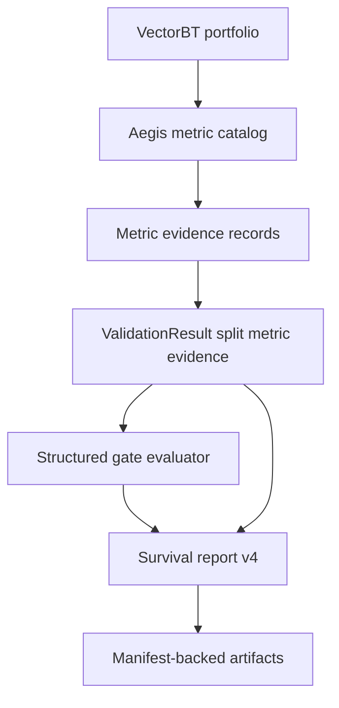

# feat: Add Split-First Survival Gate Contract

## Summary

Implement issue #10 by keeping VectorBT PRO as the metric engine, adding an Aegis metric evidence layer around VectorBT outputs, and changing survival reports to evaluate structured gates from per-split out-of-sample evidence. The plan preserves aggregate train/test metrics as descriptive summaries while making gate outcomes, metric settings, availability, warnings, and provenance explicit in `survival_report.json`.

---

## Problem Frame

The current report path computes useful VectorBT metrics, but the survival verdict still depends on aggregate test metrics and free-form reason strings. That conflicts with the existing validation metadata that already marks per-split test metrics as decision evidence and aggregate metrics as descriptive summaries.

---

## Requirements

- R1. VectorBT PRO remains the canonical engine for supported portfolio, trade, return, drawdown, benchmark, and uncertainty metrics. Origin: R1, F1.
- R2. Report metrics are selected by VectorBT metric identity and normalized into Aegis-owned metric names with recorded source identities and settings. Origin: R2, R3, AE1.
- R3. Annualized metrics require explicit `freq` and `year_freq` assumptions in metric evidence. Origin: R4, AE2.
- R4. Benchmark-dependent metrics record benchmark availability and do not imply benchmark evidence when no benchmark exists. Origin: R5, AE3.
- R5. Metric warnings, skipped metrics, non-finite values, and unavailable metrics are visible as evidence rather than silent `None` values. Origin: R6, AE1, AE2.
- R6. Per-split test metrics are the survival decision source for validation runs. Origin: R7, R8, R10, R12, F2, AE4.
- R7. Split aggregation policy remains recorded per metric and aggregate metrics are labeled descriptive unless explicitly promoted to a gate input. Origin: R8, R9, R10, R23, AE4, AE7.
- R8. Survival verdicts are derived from structured gate outcomes with source metric, evidence scope, value or availability state, threshold, comparator, status, and reason. Origin: R13, R14, R25, AE5, AE6, AE7.
- R9. Gate statuses distinguish pass, fail, insufficient evidence, unavailable metric, and invalid or non-decision-grade validation. Origin: R15, R16, R17, R18, AE2, AE5, AE6.
- R10. Optional uncertainty diagnostics such as probabilistic or deflated Sharpe are recorded when meaningful but are not first-pass hard gates. Origin: R19, R20, R21, AE3.
- R11. Survival report artifacts include metric settings, frequency/year-frequency assumptions, benchmark assumptions, split aggregation policy, metric availability, warnings, validation metadata, and structured gate outcomes. Origin: R22, R24, AE7.

**Origin actors:** A1 experiment author, A2 validation stage, A3 report stage, A4 reviewer or automation agent, A5 future planner or maintainer.

**Origin flows:** F1 compute and normalize portfolio metrics, F2 evaluate survival gates from split-first evidence, F3 preserve report provenance and diagnostics.

**Origin acceptance examples:** AE1 metric identity/settings and availability, AE2 missing annualization evidence is inconclusive, AE3 benchmark/uncertainty diagnostics are optional evidence, AE4 per-split test evidence drives gates, AE5 valid threshold failure rejects, AE6 insufficient trades are inconclusive, AE7 report artifact is auditable.

---

## Scope Boundaries

- Do not replace VectorBT PRO portfolio, trade, return, drawdown, benchmark, or uncertainty calculations with broad custom Aegis metric implementations.
- Do not make probabilistic or deflated Sharpe mandatory hard gates for every survival report in issue #10.
- Do not build a full statistical-significance, multiple-hypothesis-correction, or live-trading-readiness methodology framework.
- Do not make train metrics part of survival decisions; train metrics remain diagnostics.
- Do not add backward-compatibility shims for pre-contract survival reports unless implementation discovers a concrete persisted consumer.
- Do not introduce benchmark inputs or benchmark configuration in this issue; record benchmark status accurately and keep benchmark-relative metrics unavailable until that contract exists.

### Deferred to Follow-Up Work

- Configurable split gate policy: add pass-rate, worst-split, or duration-weighted policies only after the first structured gate contract lands.
- Benchmark data contract: plan separately around benchmark source, alignment, missing data, and `bm_close` / `bm_returns` handoff.
- Statistical methodology gates: plan separately if probabilistic Sharpe, deflated Sharpe, confidence intervals, or multiple-testing correction should become required survival gates.
- Dedicated aggregate per-symbol JSON artifact: add if future gates need symbol-level decisions beyond existing per-split metric JSON and native sidecars.

---

## Context & Research

### Relevant Code and Patterns

- `research/aegis_research/reports.py` is the report boundary. `portfolio_metrics()` already requests VectorBT stats by metric keys but extracts values using display labels; `build_survival_report()` currently evaluates aggregate `test_metrics` and emits free-form reasons.
- `research/aegis_research/validation.py` already produces `ValidationResult.split_results`, `split_metrics`, aggregate train/test metrics, and validation metadata that says `decision_evidence: "per_split_test_metrics"` and `aggregate_metrics_role: "descriptive_summary"`.
- `research/aegis_research/experiments.py` currently calls `build_survival_report()` with aggregate metrics and validation metadata only; it does not pass `validation.split_metrics` into the report boundary.
- `research/aegis_research/provenance/experiment_artifacts.py` writes per-split metric JSON artifacts with schema `metrics.v2`, aggregate scalar `validation.split_metrics` CSV with schema `split_metrics.v2`, and the survival report with schema `survival_report.v3`.
- `research/aegis_research/config.py` owns `ReportConfig` thresholds and validates finite numeric gates plus positive Timedelta-compatible `freq` and `year_freq` before execution.
- `tests/research/aegis_research/test_reports.py`, `tests/research/aegis_research/test_validation_artifacts.py`, and `tests/research/aegis_research/test_experiment_provenance.py` are the main coverage seams for metric evidence, split metadata, gate behavior, and artifact schema links.

### Institutional Learnings

- `docs/solutions/architecture-patterns/config-contract-security-reproducibility-2026-05-16.md`: report config is part of the schema-versioned experiment contract; invalid report gates and frequency assumptions should fail before side effects.
- `docs/solutions/logic-errors/vectorbt-label-contract-target-lineage-2026-05-17.md`: survival-report validation must fail closed when split-safety or decision-grade evidence is missing; exploratory metrics should not share the trusted survival path.
- `docs/solutions/architecture-patterns/model-plugin-target-probability-contract-2026-05-17.md`: validation artifacts should remain split-local and carry public metadata sufficient for audit without private native objects.
- `docs/solutions/best-practices/forward-first-long-only-signal-contract-2026-05-18.md`: forward-first contracts should reject old or ambiguous inputs instead of adding compatibility shims, and diagnostics should explain non-executable evidence.
- `docs/solutions/best-practices/vectorbt-close-optimizer-positions-at-end-2026-05-17.md`: report comparability depends on explicit terminal position policy; issue #10 should preserve existing portfolio diagnostics rather than hiding realized-vs-mark-to-market assumptions.
- `docs/solutions/performance-issues/vectorbt-large-from-signals-chunking-memory-2026-05-17.md`: large VectorBT outputs need explicit diagnostics and failure visibility; report generation should not silently produce partial evidence.

### VectorBT PRO Evidence

**Confirmed VBT behavior:**
- `StatsBuilderMixin.stats` accepts metric names, `settings`, `metric_settings`, `filters`, `silence_warnings`, `per_column`, `split_columns`, and `agg_func`; `agg_func=None` returns all columns as a DataFrame while the default aggregates by mean. Source: StatsBuilderMixin.stats API, https://vectorbt.pro/pvt_16ebf9ef/api/generic/stats_builder/#vectorbtpro.generic.stats_builder.StatsBuilderMixin.stats.
- `Portfolio.metrics` is the authoritative metrics configuration and exposes metric identities including `total_return`, `bm_return`, `max_dd`, `total_orders`, `total_fees_paid`, `total_trades`, `win_rate`, `profit_factor`, `expectancy`, `sharpe_ratio`, `calmar_ratio`, `omega_ratio`, and `sortino_ratio`. The ratio metrics have frequency/year-frequency checks. Source: Portfolio.metrics API, https://vectorbt.pro/pvt_16ebf9ef/api/portfolio/base/#vectorbtpro.portfolio.base.Portfolio.metrics.
- If VectorBT cannot parse data frequency, it will not return duration metrics in time units, will not return metrics requiring annualization, and will emit warnings. Passing `freq` through stats settings works but may copy the portfolio; setting frequency during simulation is preferred for cache reuse. Source: "Column, group, and tag selection", https://vectorbt.pro/pvt_16ebf9ef/api/portfolio/base/#column-group-and-tag-selection.
- Year frequency defaults to 365 days and should be changed for stocks or other calendars; the annualization factor is `year_freq / data_freq`. Source: "Metrics", https://vectorbt.pro/pvt_16ebf9ef/cookbook/portfolio/#metrics.
- `Portfolio.returns_stats` computes return-focused stats and accepts `bm_returns`, `freq`, `year_freq`, `sim_start`, and `sim_end`; it is the official surface for alpha/beta-style return stats. Source: Portfolio.returns_stats API, https://vectorbt.pro/pvt_16ebf9ef/api/portfolio/base/#vectorbtpro.portfolio.base.Portfolio.returns_stats.
- Simulation ranges affect portfolio analysis and return methods; `rec_sim_range=True` recursively applies the date range to dependent metrics so the whole analysis chain is consistent. Source: "Simulation ranges", https://vectorbt.pro/pvt_16ebf9ef/features/analysis/#simulation-ranges.
- `cv_split` runs training grids, selects a parameter combination, and validates on test data; `selection` defaults to max/min-style selection but can be customized. Source: cv_split API, https://vectorbt.pro/pvt_16ebf9ef/api/generic/splitting/decorators/#vectorbtpro.generic.splitting.decorators.cv_split and "CV decorator", https://vectorbt.pro/pvt_16ebf9ef/features/optimization/#cv-decorator.
- `ReturnsAccessor.prob_sharpe_ratio` computes the probability that Sharpe exceeds a benchmark; `ReturnsAccessor.deflated_sharpe_ratio` adjusts Sharpe for bias and sample variability. Source: ReturnsAccessor API, https://vectorbt.pro/pvt_16ebf9ef/api/returns/accessors/#vectorbtpro.returns.accessors.ReturnsAccessor.prob_sharpe_ratio and https://vectorbt.pro/pvt_16ebf9ef/api/returns/accessors/#vectorbtpro.returns.accessors.ReturnsAccessor.deflated_sharpe_ratio.

**Maintainer/support guidance and failure modes:**
- Multi-metric `cv_split` results need an explicit custom selection or a combined single score; VBT cannot infer the best combination from multiple metrics. Sources: https://discord.com/channels/918629562441695344/918629995415502888/1185654738826567782 and https://discord.com/channels/918629562441695344/918629563469295628/1375014072436789279.
- Missing frequency explains warnings and missing Sharpe/annualized metrics; maintainer guidance is to set frequency because annualization cannot be computed without it. Source: https://discord.com/channels/918629562441695344/918630948248125512/1234416079019966545.
- Sharpe can be `NaN` when there are no trades and returns are all zero; this is a degenerate evidence condition, not a successful metric. Source: https://discord.com/channels/918629562441695344/918629563469295628/1123299673642377237.
- Deflated Sharpe can return `NaN` when source Sharpe values are invalid, and the maintainer states deflated Sharpe should only be used with a large number of columns. Sources: https://discord.com/channels/918629562441695344/918630948248125512/1047506861894664202 and https://discord.com/channels/918629562441695344/918630948248125512/1372120552462090272.
- Metric names must be actual registered metric keys, not display titles. Support examples show `sortino_ratio` works while `Sortino Ratio` raises `KeyError`, and custom metrics must be registered before constructing the portfolio that uses them. Sources: https://discord.com/channels/918629562441695344/918630948248125512/1259975839299272854 and https://discord.com/channels/918629562441695344/918630948248125512/1359967652717658132.

**Aegis recommendations from VBT evidence:**
- Use VectorBT metric identities as the source of truth; display titles may be used only as a derived extraction label from the resolved metric config.
- Capture warnings around each VectorBT metric operation and classify non-finite results before threshold comparisons.
- Keep the survival policy in Aegis because VectorBT provides metric and CV primitives, not this project's report verdict semantics.
- Treat probabilistic and deflated Sharpe as optional diagnostics until Aegis defines a methodology-specific gate.

No docs-vs-support contradiction was found. Support guidance mostly clarifies official documented behavior and highlights edge cases; where VBT docs do not prescribe an Aegis survival policy, this plan uses the lowest-risk conservative default.

---

## Key Technical Decisions

- Use a project-owned metric catalog: each normalized Aegis metric maps to a VectorBT metric identity or direct VectorBT method, expected unit, source scope, required settings, report-output role, and gate-input role.
- Derive display labels from VectorBT metric config only for extraction: labels are not the source of truth, but `pf.stats()` returns title-labeled rows/columns, so extraction should validate the key-to-title mapping rather than hard-code titles as the contract.
- Capture metric evidence separately from metric values: each metric records value, availability, source identity, settings, warnings, and optional non-finite classification.
- Keep `ReportConfig` thresholds unchanged for this issue: use existing Sharpe, drawdown, and trade gates while changing the evidence source and verdict structure.
- Use split-first gate policy: Sharpe and drawdown use `all_splits_pass`; total-trade sufficiency uses `sum_across_test_splits` because the current config names total OOS trades.
- Classify before comparing: configuration/catalog contract failures fail fast before artifacts, while runtime metric warnings, skips, benchmark absence, and non-finite metric values become evidence statuses before numeric threshold comparisons run.
- Use deterministic status precedence: any required gate with decision-grade `fail` yields `rejected`; if there is no required failure, invalid/unavailable/insufficient required gates yield `needs_more_evidence`; otherwise all required gates passing yields `survived`.
- Persist a report-level decision policy that names the policy id, metric applicability, aggregation method, rationale, and policy version instead of requiring readers to infer policy from individual gate rows.
- Keep aggregates in the payload but label their role next to the values, not only inside nested validation metadata.
- Bump metric JSON artifacts from current `metrics.v2` to `metrics.v3` and the survival report artifact from current `survival_report.v3` to `survival_report.v4` because evidence and gate structures materially change. Keep aggregate scalar `split_metrics.v2` CSV unchanged unless implementation adds evidence columns to that artifact.

---

## Open Questions

### Resolved During Planning

- What metric catalog should the first contract expose? Use the existing report outputs: total return, Sharpe, max drawdown, total trades, win rate, and fees. Only decision-grade validation, Sharpe, max drawdown, and total OOS trades are required gate inputs in the first contract; optional return/uncertainty diagnostics are recorded separately when available.
- What split gate policy should the first contract use? Use the lowest-risk conservative default: every test split must have available passing Sharpe and drawdown evidence; total OOS trades must meet the configured total threshold using split rows as the source.
- What gate statuses should the schema expose? Use `pass`, `fail`, `insufficient_evidence`, `unavailable_metric`, and `invalid_validation`, with the existing top-level statuses preserved.
- Should probabilistic or deflated Sharpe become gates? No; record them as optional diagnostics only until a future methodology contract promotes them.
- How should VectorBT warnings be handled? Capture scoped warnings around metric calls and persist warning records in metric evidence; do not silence them without recording their effect.
- How should frequency/year-frequency failures be split? Invalid configured `ReportConfig.freq` or `year_freq` remains a fail-fast configuration error before artifacts; valid configuration with VectorBT annualization warnings, skipped outputs, or non-finite annualized metrics becomes unavailable metric evidence and an inconclusive gate unless a valid required failure also exists.

### Deferred to Implementation

- Exact helper/dataclass names for metric evidence and gate outcomes should be chosen to fit `research/aegis_research/reports.py` cleanly.
- Exact warning message taxonomy should be kept minimal at first: record raw warning category/message and classify only known annualization/availability warnings required by tests.
- Exact optional diagnostic call set should be constrained by what can be computed cheaply and safely from the existing portfolio objects during implementation.

---

## High-Level Technical Design

> *This illustrates the intended approach and is directional guidance for review, not implementation specification. The implementing agent should treat it as context, not code to reproduce.*

Gate policy matrix:

| Gate | Source | Pass rule | Evidence gap behavior |
|---|---|---|---|
| Decision grade | Validation metadata | Decision-grade evidence is true and required purging evidence passes | `needs_more_evidence` |
| OOS Sharpe | Each test split row | Every split has finite Sharpe at or above threshold | `needs_more_evidence` only when no required gate has valid failed evidence |
| OOS drawdown | Each test split row | Every split has finite normalized loss magnitude at or below threshold | `needs_more_evidence` only when no required gate has valid failed evidence |
| OOS trades | Test split rows summed | Total finite OOS trades meet configured minimum | `needs_more_evidence` |
| Optional uncertainty | Metric diagnostics | Recorded only | Never affects first-pass status |

---

## Implementation Units

### U1. Add VectorBT Metric Evidence Catalog

**Goal:** Make `portfolio_metrics()` produce normalized values plus auditable VectorBT metric evidence without making display labels the contract.

**Requirements:** R1, R2, R3, R4, R5, R10, R11; origin F1, AE1, AE2, AE3.

**Dependencies:** None.

**Files:**
- Modify: `research/aegis_research/reports.py`
- Test: `tests/research/aegis_research/test_reports.py`

**Approach:**
- Define a small metric catalog for the existing first-pass metrics: `total_return_pct`, `max_drawdown_pct`, `total_trades`, `win_rate_pct`, `total_fees_paid`, and `sharpe_ratio`.
- Record each metric's VectorBT identity, normalized Aegis name, unit, source method, required settings, whether it is a required report output, and whether it is a required survival gate input.
- For metrics pulled through `pf.stats()`, look up the VectorBT metric identity in `pf.metrics`, derive its title for result extraction, and fail fast only when the catalog references an unknown VectorBT identity. A valid identity that VectorBT skips, warns about, or returns as non-finite becomes metric evidence rather than a silent value.
- Normalize drawdown evidence to a loss-magnitude convention before comparison: preserve the raw VectorBT value in evidence, record the normalized unit/sign, and compare normalized `max_drawdown_pct` against `ReportConfig.max_oos_drawdown` exactly once.
- Continue computing headline metrics at shared-cash group scope and per-symbol metrics with `group_by=False`.
- Add a `metric_sources` or equivalent evidence block that records source metric identities and the report frequency/year-frequency settings used for annualized methods.
- Preserve the existing `metric_scope` and `metric_assumptions` contract so current validation aggregation tests still have a stable assumptions surface.
- Bump `METRICS_SCHEMA_VERSION` from `metrics.v2` to `metrics.v3` because metric JSON artifacts gain evidence, availability, and warning fields.

**Execution note:** Start with characterization tests around current metric output shape before changing extraction internals.

**Patterns to follow:**
- `PORTFOLIO_STATS_METRICS` and `METRICS_SCHEMA_VERSION` in `research/aegis_research/reports.py`.
- Shared-cash fail-fast behavior in `test_portfolio_metrics_fail_fast_without_single_shared_cash_group`.
- VectorBT metric identity guidance from `Portfolio.metrics` API.

**Test scenarios:**
- Happy path: `portfolio_metrics()` returns the existing normalized metric values and adds evidence mapping normalized names to VectorBT metric identities.
- Happy path: metric evidence distinguishes report-required outputs from gate-required inputs so total return, win rate, and fees cannot accidentally become survival gates.
- Happy path: per-symbol metric evidence uses the same metric catalog and preserves symbol keys.
- Edge case: a metric catalog identity missing from `pf.metrics` fails visibly rather than returning silent `None`.
- Edge case: a VectorBT result missing a derived metric title after a valid metric request produces an unavailable metric evidence record, not an unannotated missing value.
- Edge case: raw positive and raw negative drawdown representations normalize to the same loss-magnitude comparison before gate evaluation.
- Integration: existing shared-cash two-symbol portfolio still reports headline return as the shared group and per-symbol returns separately.
- Covers AE1. Metric evidence records normalized Aegis names, VectorBT source identities, and availability.

**Verification:**
- Required metrics are no longer hard-coded from display titles as the report contract.
- Existing callers still receive normalized metric keys used by validation aggregation.

---

### U2. Capture Metric Availability, Warnings, And Optional Diagnostics

**Goal:** Classify VectorBT metric outputs before gate evaluation so warnings, missing annualization, non-finite values, benchmark absence, and optional uncertainty diagnostics are explicit.

**Requirements:** R3, R4, R5, R10, R11; origin AE2, AE3.

**Dependencies:** U1.

**Files:**
- Modify: `research/aegis_research/reports.py`
- Test: `tests/research/aegis_research/test_reports.py`

**Approach:**
- Wrap VectorBT stats and direct ratio calls in scoped Python warning capture.
- Convert scalar metric outputs through an availability classifier before converting to plain JSON values.
- Apply an explicit error taxonomy: invalid report config or unknown catalog identities fail fast before artifacts, while VectorBT warning/skipped output, missing annualization evidence, benchmark absence, and non-finite metric values become report evidence.
- Treat missing, `NaN`, positive infinity, and negative infinity as unavailable evidence for required survival metrics unless a metric-specific rule says otherwise.
- Keep benchmark status as `none` for the current config contract and classify benchmark-relative metrics as unavailable or not configured rather than failed.
- Add optional diagnostics for probabilistic Sharpe and deflated Sharpe only when required inputs are available and the result is finite; otherwise record diagnostic availability without affecting required gates.
- Keep optional diagnostics small and report-local so this unit does not expand into a methodology framework.

**Patterns to follow:**
- `_scalar_metric()` conversion in `research/aegis_research/reports.py`, but extend it so non-finite results do not become context-free `None`.
- `portfolio_metric_assumptions()` for frequency/year-frequency and benchmark status metadata.
- VectorBT docs on missing frequency warnings and support guidance on NaN Sharpe / deflated Sharpe limits.

**Test scenarios:**
- Happy path: finite Sharpe records `available` evidence with `freq` and `year_freq` settings.
- Edge case: `NaN` Sharpe records unavailable evidence and keeps a JSON-safe value.
- Edge case: infinite metric values record unavailable evidence rather than passing threshold comparisons.
- Error path: invalid configured `freq` or `year_freq` remains a config validation failure before artifact write.
- Edge case: captured VectorBT annualization warnings from otherwise valid report configuration appear in metric evidence and make required annualized gates inconclusive when no required gate has valid failed evidence.
- Happy path: benchmark status `none` remains explicit and benchmark-relative diagnostics are not implied.
- Edge case: deflated Sharpe unavailable or `NaN` is recorded as optional diagnostic unavailability and does not affect report status.
- Covers AE2. Missing or invalid annualized ratio evidence becomes inconclusive gate input.
- Covers AE3. Missing benchmark/uncertainty evidence does not reject an otherwise valid report.

**Verification:**
- Required metric values cannot silently pass gates when non-finite.
- Optional diagnostics can be absent without changing top-level survival status.

---

### U3. Add Structured Split-First Gate Evaluation

**Goal:** Replace aggregate-threshold verdict logic with structured gate outcomes evaluated from per-split test evidence.

**Requirements:** R6, R7, R8, R9; origin F2, AE4, AE5, AE6.

**Dependencies:** U1, U2.

**Files:**
- Modify: `research/aegis_research/reports.py`
- Test: `tests/research/aegis_research/test_reports.py`

**Approach:**
- Extend `build_survival_report()` to accept split-level metric evidence in addition to aggregate train/test metrics and validation metadata.
- Define a stable gate outcome shape with fields for gate name, metric, source scope, split where applicable, actual value or availability state, threshold, comparator, status, and reason.
- Define a report-level `decision_policy` or equivalent block with policy id, policy version, per-metric aggregation method, applicability, and rationale. The first policy uses `all_splits_pass` for Sharpe/drawdown and `sum_across_test_splits` for total trades.
- Evaluate decision-grade and purging evidence as explicit gates before metric thresholds.
- Evaluate Sharpe and drawdown gates against each test split row.
- Compare drawdown through the catalog's normalized loss-magnitude value so percent/fraction and positive/negative raw VectorBT representations cannot invert the threshold.
- Evaluate `min_oos_trades` by summing finite test split trade counts from split rows, preserving the split rows as evidence rather than reading aggregate `test_metrics`.
- Derive human-readable `reasons` from gate outcomes so strings remain helpful but no longer carry the only verdict evidence.
- Apply deterministic top-level status precedence: a valid required gate failure produces `rejected`; if no required gate failed but required evidence is invalid, unavailable, or insufficient, the status is `needs_more_evidence`; all required gates passing produces `survived`.

**Execution note:** Implement gate evaluator tests before changing the experiment call site so status precedence is locked independently.

**Patterns to follow:**
- Existing `build_survival_report()` status constants from `research/aegis_research/config.py`.
- `split_purging_passed()` use for label-window purging evidence.
- Existing tests for non-decision-grade and missing split evidence in `tests/research/aegis_research/test_reports.py`.

**Test scenarios:**
- Happy path: all decision-grade split gates pass and report status is `survived` with passing gate outcomes.
- Error path: one finite split Sharpe below threshold records a failed gate and report status is `rejected`.
- Error path: aggregate Sharpe passes but one split Sharpe fails, proving aggregate metrics are not the decision source.
- Edge case: one split Sharpe is `NaN` and report status is `needs_more_evidence` with unavailable metric status.
- Error path: total OOS trades summed from split rows falls below threshold and report status is `needs_more_evidence` with insufficient-evidence gate.
- Error path: non-decision-grade validation records an invalid-validation gate and cannot survive even if metrics pass.
- Edge case: both a valid threshold failure and an unavailable required metric are present; gate outcomes preserve both and top-level status is `rejected` because decisive failure outranks evidence gaps.
- Integration: report payload includes a decision policy block naming `all_splits_pass` for Sharpe/drawdown and `sum_across_test_splits` for trades.
- Covers AE4. Per-split test evidence drives gate outcomes while aggregate summaries are descriptive.
- Covers AE5. A valid metric threshold failure rejects rather than becoming inconclusive.
- Covers AE6. Insufficient trade evidence produces an inconclusive verdict with structured details.

**Verification:**
- `build_survival_report()` no longer needs aggregate `test_metrics` to decide Sharpe or drawdown survival.
- Report `reasons` are derived from gate outcomes.

---

### U4. Thread Split Evidence Through Validation And Report Boundaries

**Goal:** Make the experiment pipeline pass JSON-safe split-level evidence into the survival report and label aggregate metrics as summaries at the report surface.

**Requirements:** R6, R7, R11; origin F2, F3, AE4, AE7.

**Dependencies:** U3.

**Files:**
- Modify: `research/aegis_research/experiments.py`
- Modify: `research/aegis_research/reports.py`
- Modify: `research/aegis_research/validation.py`
- Test: `tests/research/aegis_research/test_validation_artifacts.py`
- Test: `tests/research/aegis_research/test_experiment_provenance.py`

**Approach:**
- Add a JSON-safe split metric evidence boundary separate from the scalar `validation.split_metrics` CSV. The evidence structure should carry the availability, warning, source, and settings records that gate evaluation uses, without relying on DataFrame object columns to round-trip through CSV.
- Pass the split metric evidence from `run_experiment()` into `build_survival_report()` and keep `validation.split_metrics` focused on scalar aggregate rows unless implementation explicitly bumps its CSV schema.
- Keep `validation.train_metrics` and `validation.test_metrics` in the report payload as descriptive summaries for reviewer convenience.
- Add a report-level metric role block that states aggregate train/test metrics are summaries and gate evidence comes from per-split test rows.
- Preserve existing validation metadata fields such as `decision_evidence`, `aggregate_metrics_role`, `aggregation_methods`, and `portfolio_metric_assumptions`.
- Ensure split rows used by gate evaluation retain split label, set label, metric assumptions, and per-symbol diagnostic metrics where already present.

**Patterns to follow:**
- `ValidationResult.split_metrics` and `split_results` in `research/aegis_research/validation.py`.
- Existing artifact upstream link from report to `validation.split_metrics` in `research/aegis_research/provenance/experiment_artifacts.py`.
- Existing aggregate role metadata in `validation.validation_metadata`.

**Test scenarios:**
- Integration: `run_experiment()` passes split metric evidence to the survival report builder and report gate outcomes cite per-split test evidence.
- Integration: persisted per-split metric JSON evidence contains the same availability, warning, source, and settings records used by gate evaluation.
- Happy path: aggregate train/test metrics still appear in the report with a descriptive role label.
- Edge case: validation result with mixed metric assumptions still fails before report generation through existing aggregation safeguards.
- Integration: per-split metric JSON artifacts continue to contain `per_symbol` evidence by split and set.
- Covers AE4. Report payload identifies per-split test rows as decision evidence.
- Covers AE7. Automation can locate schema version, split aggregation policy, gate outcomes, and reasons in the report artifact.

**Verification:**
- The experiment pipeline no longer has a report-builder boundary that hides split-level test evidence.
- Reviewers do not need to infer aggregate metric roles from nested validation metadata alone.

---

### U5. Version Metrics And Survival Report Artifacts

**Goal:** Persist the new metric and report contracts as schema-versioned, manifest-backed artifacts with tests that prove the artifacts are auditable without private VectorBT objects.

**Requirements:** R8, R9, R11; origin F3, AE7.

**Dependencies:** U1, U2, U3, U4.

**Files:**
- Modify: `research/aegis_research/provenance/experiment_artifacts.py`
- Test: `tests/research/aegis_research/test_experiment_provenance.py`
- Test: `tests/research/aegis_research/test_experiments_purged.py`

**Approach:**
- Bump per-split metric JSON artifacts from current `metrics.v2` to `metrics.v3` and assert they contain metric evidence, availability, warnings, source identities, and settings.
- Keep aggregate `validation.split_metrics` at `split_metrics.v2` only if it remains a scalar CSV summary; if implementation adds evidence-bearing columns there, bump its schema and document the normalization.
- Bump the survival report schema from current `survival_report.v3` to `survival_report.v4`.
- Keep the existing `report.survival` artifact id and upstream links to `validation.split_metrics`, `splits.evidence`, and `labels.compatibility`.
- Assert that `survival_report.json` contains structured gate outcomes, metric evidence summaries, metric roles, decision policy, validation metadata, and derived human reasons.
- Preserve existing manifest validation and artifact failure behavior; do not add compatibility branches for old survival reports.
- Add an end-to-end purged validation test that asserts status is derived from gate outcomes rather than aggregate metrics alone.

**Patterns to follow:**
- `_write_json_artifact()` manifest-backed JSON writing in `research/aegis_research/provenance/experiment_artifacts.py`.
- Existing schema assertions in `tests/research/aegis_research/test_experiment_provenance.py`.
- Existing purged experiment fixtures in `tests/research/aegis_research/test_experiments_purged.py`.

**Test scenarios:**
- Happy path: purged run writes per-split metric JSON artifacts with schema `metrics.v3` and `report.survival` with schema `survival_report.v4`.
- Happy path: report payload contains gate outcomes with stable fields for name, metric, source scope, comparator, threshold, status, and reason.
- Happy path: report payload contains a decision policy block with stable policy identifiers and metric applicability.
- Integration: report payload names per-split test metrics as the decision evidence source and aggregate metrics as descriptive summaries.
- Integration: evidence used by gate evaluation is present in persisted public artifacts and does not require private native VectorBT objects.
- Integration: manifest validation succeeds with the new schema and artifact link structure.
- Error path: a manipulated or fixture-based failing split produces a rejected report with failed gate outcome if feasible without brittle test setup.
- Covers AE7. Automation can inspect report structure and reasons without loading private native VectorBT artifacts.

**Verification:**
- End-to-end runs produce a survival report whose schema and gate evidence match the issue #10 contract.
- Existing manifest and artifact status invariants remain unchanged.

---

## System-Wide Impact

- **Interaction graph:** `validation.py` continues producing scalar split metrics and adds JSON-safe split metric evidence; `experiments.py` passes that evidence into `reports.py`; `experiment_artifacts.py` persists metric and report artifacts with bumped schemas.
- **Error propagation:** Unknown metric identities and invalid report config should fail fast before artifacts; non-finite required runtime metrics and invalid validation evidence should become explicit gate/evidence statuses rather than hidden `None` values.
- **State lifecycle risks:** No persistent database state changes. Artifact schema changes are forward-first and apply to newly produced reports only.
- **API surface parity:** Public Python call sites of `build_survival_report()` in tests must be updated for split evidence and decision policy output; no CLI or external API surface exists.
- **Integration coverage:** Unit tests must prove gate precedence and non-finite classification; end-to-end tests must prove manifest-backed report artifacts carry the new evidence.
- **Unchanged invariants:** VectorBT remains the computation engine, existing top-level report statuses remain `survived`, `rejected`, and `needs_more_evidence`, and train metrics remain diagnostics.

---

## Risks & Dependencies

| Risk | Mitigation |
|------|------------|
| Gate implementation keeps using aggregate metrics accidentally | Add a regression where aggregate Sharpe passes but one split fails; assert rejection from split evidence. |
| Display-title extraction remains hidden in the metric path | Use a metric catalog keyed by VectorBT identities and derive titles from `pf.metrics` only as extraction metadata. |
| Warning capture becomes noisy or nondeterministic | Capture warnings in tight scopes around metric calls and persist raw warning category/message without over-classifying. |
| Non-finite metrics pass Python comparisons | Classify availability before every numeric gate comparison and test `NaN` / `inf` cases explicitly. |
| Deflated Sharpe expands scope into statistical methodology | Keep PSR/DSR optional diagnostics with no first-pass status effect. |
| Report schema churn follows immediately after implementation | Define the gate outcome fields before coding and assert stable fields in provenance tests. |
| Trade gate semantics become too strict | Preserve existing config semantics by summing OOS trades from split rows rather than inventing a per-split minimum. |
| Evidence stored in DataFrame object columns fails artifact round-trip | Keep nested evidence in JSON-safe structures and public metric JSON artifacts; keep `split_metrics.v2` as scalar CSV unless explicitly bumped. |
| Mixed failures and evidence gaps produce misleading top-level status | Make valid required gate failures decisive while still preserving unavailable/invalid gates in structured outcomes. |

---

## Documentation / Operational Notes

- Update any issue or developer-facing notes that describe `survival_report.json` or per-split metric JSON artifacts so they reference structured gates, split-first evidence, and the `metrics.v3` / `survival_report.v4` schema versions.
- No migration or rollout mechanism is needed for old reports unless a concrete consumer appears during implementation.
- If the plan reveals that benchmark-relative metrics are desired immediately, pause and create a separate benchmark contract rather than folding benchmark inputs into this issue.

---

## Sources & References

- **Origin document:** `docs/brainstorms/2026-05-18-report-metrics-survival-verdict-contract-requirements.md`
- Related code: `research/aegis_research/reports.py`
- Related code: `research/aegis_research/validation.py`
- Related code: `research/aegis_research/experiments.py`
- Related code: `research/aegis_research/provenance/experiment_artifacts.py`
- Related tests: `tests/research/aegis_research/test_reports.py`
- Related tests: `tests/research/aegis_research/test_validation_artifacts.py`
- Related tests: `tests/research/aegis_research/test_experiment_provenance.py`
- GitHub issue: #10
- VectorBT PRO `StatsBuilderMixin.stats`: https://vectorbt.pro/pvt_16ebf9ef/api/generic/stats_builder/#vectorbtpro.generic.stats_builder.StatsBuilderMixin.stats
- VectorBT PRO `Portfolio.metrics`: https://vectorbt.pro/pvt_16ebf9ef/api/portfolio/base/#vectorbtpro.portfolio.base.Portfolio.metrics
- VectorBT PRO column/group stats and frequency warnings: https://vectorbt.pro/pvt_16ebf9ef/api/portfolio/base/#column-group-and-tag-selection
- VectorBT PRO portfolio metrics cookbook: https://vectorbt.pro/pvt_16ebf9ef/cookbook/portfolio/#metrics
- VectorBT PRO `Portfolio.returns_stats`: https://vectorbt.pro/pvt_16ebf9ef/api/portfolio/base/#vectorbtpro.portfolio.base.Portfolio.returns_stats
- VectorBT PRO simulation ranges: https://vectorbt.pro/pvt_16ebf9ef/features/analysis/#simulation-ranges
- VectorBT PRO `cv_split`: https://vectorbt.pro/pvt_16ebf9ef/api/generic/splitting/decorators/#vectorbtpro.generic.splitting.decorators.cv_split
- VectorBT PRO CV decorator: https://vectorbt.pro/pvt_16ebf9ef/features/optimization/#cv-decorator
- VectorBT PRO probabilistic Sharpe: https://vectorbt.pro/pvt_16ebf9ef/api/returns/accessors/#vectorbtpro.returns.accessors.ReturnsAccessor.prob_sharpe_ratio
- VectorBT PRO deflated Sharpe: https://vectorbt.pro/pvt_16ebf9ef/api/returns/accessors/#vectorbtpro.returns.accessors.ReturnsAccessor.deflated_sharpe_ratio
- VBT support, multi-metric CV needs explicit selection: https://discord.com/channels/918629562441695344/918629995415502888/1185654738826567782
- VBT support, metric-key vs display-title failure: https://discord.com/channels/918629562441695344/918630948248125512/1259975839299272854
- VBT support, missing frequency for Sharpe: https://discord.com/channels/918629562441695344/918630948248125512/1234416079019966545
- VBT support, NaN Sharpe and no trades: https://discord.com/channels/918629562441695344/918629563469295628/1123299673642377237
- VBT support, deflated Sharpe NaN / many columns: https://discord.com/channels/918629562441695344/918630948248125512/1047506861894664202 and https://discord.com/channels/918629562441695344/918630948248125512/1372120552462090272
