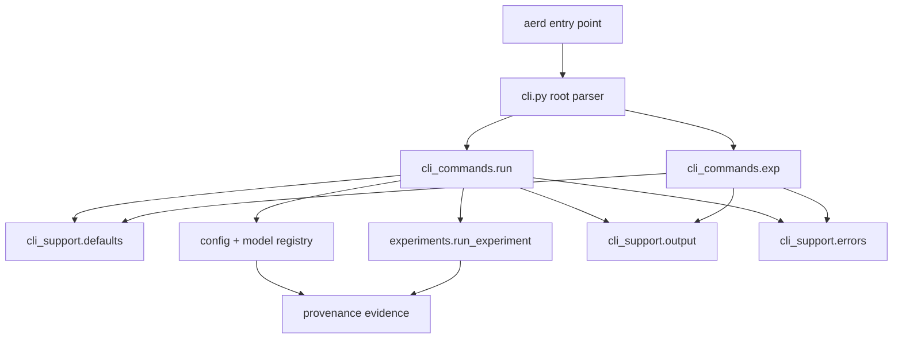

# feat: Add Modular Aerd CLI Runner

## Summary

Expose `aerd` as the installed CLI, split command behavior into modular command packages, and add shared support for local experiment defaults, JSON-safe output, and stable error handling. `aerd run --json` should stay a thin entry point over existing experiment/config/provenance APIs while `aerd exp defaults set` manages repo-scoped private defaults for local iteration.

---

## Problem Frame

The current CLI is a single `main()` in `research/aegis_research/cli.py` with one required-config `run` command and human-only output. Issue #12 needs the CLI to become a stable agent/CI surface without turning command parsing into a second experiment orchestration layer.

---

## Requirements

- R1. Add canonical installed command `aerd`, while preserving module invocation as an implementation path during transition. Origin: R1, F1, AE1.
- R2. Keep `aerd run [experiment-config]` as the main execution command and preserve existing rerun/lineage controls. Origin: R2, R5, Scope Boundaries.
- R3. Add `aerd exp defaults set <experiment-config>` for repo-scoped private local experiment defaults, without editing the experiment YAML. Origin: R3, R4, F3, AE2.
- R4. Make explicit experiment config arguments win over any configured default, and do not read or validate the default when an explicit config is supplied. Origin: R5, AE3.
- R5. When no config is supplied, resolve the repo-scoped local default; fail before run artifacts when no usable default exists. Origin: R6, R7, F2, AE4.
- R6. Fully validate a default experiment through the existing side-effect-free config/model registry boundary before storing it. Origin: R3, R4, R9, AE5; planning decision.
- R7. Make local-default application visible in command JSON and manifest-backed run evidence without dumping raw configs or default-store contents. Origin: R8, R12, F2, AE2.
- R8. Add stable JSON output for `aerd run --json` success and failure paths, with safe run/report/provenance summaries and no mixed human text on JSON stdout. Origin: R10, R11, R12, R13, R14, AE1, AE4, AE5, AE6.
- R9. Separate execution success from research verdicts: completed rejected or inconclusive reports still exit `0`. Origin: R15, R17, AE7.
- R10. Document and implement stable non-zero behavior for invocation, missing default, config/registry validation, execution failure, interruption, and internal errors. Origin: R13, R16.
- R11. Keep the root CLI as a thin dispatcher; command modules own command behavior and shared support modules own output, errors, redaction, and defaults. Origin: R18, R19, R20, F4, AE8.
- R12. Command handlers must call existing domain APIs for config resolution, model registry validation, experiment execution, artifacts, and reports. Origin: R21, R22.

**Origin actors:** A1 experiment iteration agent, A2 local researcher, A3 CI or automation runner, A4 CLI maintainer, A5 run reviewer.

**Origin flows:** F1 explicit JSON run, F2 local-default run, F3 set local default, F4 modular CLI command maintenance.

**Origin acceptance examples:** AE1 explicit JSON run, AE2 default-backed run, AE3 explicit config overrides default, AE4 missing default failure, AE5 config/registry failure before artifacts, AE6 post-manifest failure refs, AE7 rejected verdict exits `0`, AE8 modular command architecture.

---

## Scope Boundaries

- Do not add `validate`, `dry-run`, broad preflight, provider-check, or strict-warning command modes in this issue.
- Do not make rejected or inconclusive survival verdicts fail the process by default.
- Do not add project-shared defaults, named profiles, team-level defaults, or layered overlays beyond repo-scoped private local default selection.
- Do not add rich terminal UI, interactive prompts, quiet/verbose modes, or a full human CLI redesign.
- Do not duplicate `manifest.json` as a full artifact inventory in CLI JSON; return safe summaries and pointers only.
- Do not print raw configs, credentials, secret-like values, trusted native state contents, large tables, or private artifact payloads.
- Do not add a backward-compatible `aegis-rd` alias unless implementation discovers a concrete existing consumer.
- Do not introduce plugin loading from YAML or dynamic import strings; use the existing trusted default model registry seam.

### Deferred to Follow-Up Work

- CI verdict gating: add a future explicit flag if CI needs rejected/inconclusive research verdicts to produce non-zero process exits.
- Validation and dry-run commands: revisit after the run-first JSON iteration loop is stable.
- Project-shared defaults or named profiles: consider only if local private defaults are insufficient for team workflows.

---

## Context & Research

### Relevant Code and Patterns

- `research/aegis_research/cli.py` currently owns all parsing and output in one `main()` function with `prog="aegis-research"` and one required-config `run` subcommand.
- `pyproject.toml` has no `[project.scripts]` or build-system configuration, so `aerd` is new public CLI surface.
- `research/aegis_research/config.py` owns path-aware `ConfigValidationError`, `load_experiment_config(...)`, `resolve_experiment_config(...)`, `redact_config(...)`, `redact_text(...)`, and `ResolvedExperimentConfig.manifest()`.
- `research/aegis_research/model_plugins/__init__.py` exposes `make_default_model_registry()`, which current CLI already uses before config load.
- `research/aegis_research/experiments.py` owns full run orchestration and trains plugin models inside `run_experiment(...)` after data, labels, indicators, and split evidence are prepared.
- `research/aegis_research/provenance/evidence.py` captures config evidence, including source path, redacted authored/resolved config hashes, and private raw config identity.
- `research/aegis_research/provenance/recorder.py` and `research/aegis_research/provenance/run_store.py` already preserve failed/interrupted run manifests, collision behavior, safe run IDs, and rerun lineage.
- Existing CLI-adjacent coverage lives in `tests/integration/research/aegis_research/test_config_contract.py`; issue #12 should add dedicated CLI integration tests rather than burying new command behavior in config-contract tests.

### Institutional Learnings

- `docs/solutions/architecture-patterns/config-contract-security-reproducibility-2026-05-16.md`: config loading is a public side-effect-free contract; default resolution must feed the same validation boundary rather than bypass it.
- `docs/solutions/architecture-patterns/model-plugin-target-probability-contract-2026-05-17.md`: YAML remains inert and selects registered plugin ids only; CLI must not add import-string or hidden plugin loading.
- `docs/brainstorms/2026-05-16-experiment-provenance-contract-requirements.md`: `manifest.json` is the source of truth for detailed run/artifact evidence; CLI JSON should summarize and point to it.
- `docs/brainstorms/2026-05-18-report-metrics-survival-verdict-contract-requirements.md`: survival verdicts are structured research outcomes, not process execution status.
- `docs/plans/2026-05-18-003-feat-experiment-config-example-boundary-plan.md`: `research/configs/experiments/` is intended for local untracked experiment configs, reinforcing local-private defaults rather than committed defaults.

### External References

- Python 3.12 `argparse` supports required subparsers and `set_defaults(...)` dispatch for modular command handlers: https://docs.python.org/3.12/library/argparse.html#sub-commands
- PyPA recommends `[project.scripts]` for installed command entry points: https://packaging.python.org/en/latest/guides/writing-pyproject-toml/#creating-executable-scripts
- uv entry point guidance requires the project to be installable through a build system before `uv run aerd` can work reliably: https://docs.astral.sh/uv/concepts/projects/config/#entry-points
- Python `json.dump(..., allow_nan=False)` supports standards-compliant JSON output for automation: https://docs.python.org/3.12/library/json.html
- Private git-local metadata avoids a new runtime dependency for repo-scoped defaults; `platformdirs` remains a useful future option if defaults later become user-global or profile-based.

---

## Key Technical Decisions

- Use `argparse` rather than Click/Typer: the current CLI is small, Python stdlib is enough for subcommands, and this avoids a new CLI framework dependency.
- Expose `aerd` through `[project.scripts]`: this is the standard packaging path and keeps scripts/docs shorter than module invocation.
- Use setuptools package discovery for the first package-enabled build: the repo already has importable `research*` packages at the repository root, and setuptools can expose the console script without restructuring sources.
- Keep `research/aegis_research/cli.py` as the root entry point: it preserves a stable import target while becoming a thin parser/dispatcher.
- Use `research/aegis_research/cli_commands/` for command behavior and `research/aegis_research/cli_support/` for shared infrastructure: command growth stays isolated and support code is reused.
- Store local defaults as git-local private state under the current worktree's private Git metadata: this avoids committed defaults, avoids a new runtime dependency, follows the checkout when it moves, and prevents one checkout from silently affecting another checkout.
- Store and validate selected experiment references, not resolved config payloads: defaults select an experiment source, while config content remains in the experiment YAML and existing evidence artifacts.
- Emit JSON success on stdout and JSON failure on stderr when JSON mode is active: stdout remains data for successful automation, and errors remain diagnostics without requiring human scraping.
- Support JSON intent detection both before and after subcommand parsing so malformed invocations with `--json` still receive structured JSON failures.
- Preserve current rerun flags: issue #12 should not silently remove existing explicit rerun, run id, fork, or overwrite behavior.
- Capture post-manifest run references without duplicating orchestration: the CLI needs safe refs for failure JSON, but `run_experiment(...)` should remain the domain execution boundary.
- Keep config-selection evidence domain-neutral: CLI modules may map local-default behavior into selection metadata, but domain modules must not import from `cli_support`.
- Treat invocation parsing as part of the error contract: JSON-mode argument failures must route through shared error/output behavior instead of raw argparse text.

---

## Open Questions

### Resolved During Planning

- Should the command be `aerd` or `aegis-rd`? Use `aerd`; the user confirmed this command name.
- Should experiment defaults use `config set`, `exp set`, or `exp defaults set`? Use `aerd exp defaults set`; the user confirmed this namespace.
- Should defaults be project-shared or local private? Use local private defaults; the user confirmed this scope.
- Should local defaults be global across all checkouts? No. Planning narrows this to repo-scoped private defaults so one checkout does not affect another.
- Should `aerd run` train models? Yes. Current `run_experiment(...)` trains split-local plugin models during full runs; the MVP optimizes this run-first loop.
- Should default-setting validate the config fully? Yes. Full side-effect-free validation prevents storing a known-bad default and aligns with the config contract.
- Which build backend should expose the first `aerd` entry point? Use setuptools with package discovery including `research*`, plus `[project.scripts]` pointing `aerd` at `research.aegis_research.cli:main`.

### Deferred to Implementation

- Exact field names inside the git-local default state: use the planned private git-local storage boundary, but settle secondary keys while implementing tests.
- Exact optional JSON fields beyond the minimum envelope: keep the envelope stable and additive, but settle secondary names while implementing output helpers and tests.
- Exact numeric values for non-zero exit codes: named categories are planned here, but final integers should be chosen and documented during implementation.

---

## Output Structure

```text
research/aegis_research/
  cli.py
  cli_commands/
    __init__.py
    exp.py
    run.py
  cli_support/
    __init__.py
    defaults.py
    errors.py
    output.py

tests/integration/research/aegis_research/
  test_cli.py
  test_cli_defaults.py
  test_cli_docs.py
```

---

## High-Level Technical Design

> *This illustrates the intended approach and is directional guidance for review, not implementation specification. The implementing agent should treat it as context, not code to reproduce.*



Command modules own command intent. Support modules own default resolution, output rendering, and error categorization. Domain modules continue owning config validation, registry checks, training, artifacts, reports, and manifest persistence.

### CLI JSON Envelope Contract

The exact field names can be finalized during implementation, but the first version must have a stable minimum envelope so command units do not invent incompatible shapes:

- Schema/version metadata for the CLI result envelope.
- Command identity and success/failure status.
- Config selection summary, including explicit versus local-default source when relevant.
- Run summary when a run exists: run id, lifecycle status, run directory reference, and manifest path.
- Report summary when a report exists: verdict/status and concise reasons or gate summary.
- Safe artifact summary, not a full manifest clone.
- Error object for failures: named category, redacted message, optional safe details, and safe run refs when a manifest exists.

JSON rendering should build the complete document in memory before writing to stdout or stderr so serialization failures cannot leave truncated success output.

Path-like JSON references should be privacy-preserving by default: prefer run ids and repo-relative paths when references are inside the repo, never emit default-store paths, and sanitize home-directory/temp prefixes before including local paths in JSON errors or summaries.

### Implementation Order

The dependency order is U1, U2, U3, U5, U4, U6. U5 intentionally defines the domain seams before U4 consumes them in the user-facing `run` command.

---

## Implementation Units

### U1. Add `aerd` Packaging Entry And Thin Dispatcher

**Goal:** Expose `aerd` as the installed command and convert the current CLI entry point into a modular dispatcher.

**Requirements:** R1, R2, R11, R12; origin F1, F4, AE1, AE8.

**Dependencies:** None.

**Files:**
- Modify: `pyproject.toml`
- Modify: `research/aegis_research/cli.py`
- Create: `research/aegis_research/cli_commands/__init__.py`
- Create: `research/aegis_research/cli_support/__init__.py`
- Test: `tests/integration/research/aegis_research/test_cli.py`

**Approach:**
- Add the package entry-point metadata for `aerd` and the minimal build-system configuration needed for uv to install the current package layout.
- Use setuptools package discovery for `research*` packages rather than restructuring the repo or adopting a new source layout.
- Refactor `cli.py` around a testable `main(argv=None) -> int` shape that builds the root parser, registers command modules, dispatches through handler defaults, and returns exit codes.
- Set the root program name to `aerd` and use strict argument parsing behavior suitable for automation.
- Route parser errors through a non-exiting invocation-error path so JSON-mode parse failures can use the shared error/output contract.
- Ensure module invocation propagates `main()` return codes rather than ignoring them.
- Keep module invocation viable through the same `main()` path rather than creating a separate legacy runner.

**Patterns to follow:**
- Current `research/aegis_research/cli.py` rerun flag definitions.
- Python `argparse` subparser dispatch through handler defaults.
- Existing tests that call `cli.main()` with monkeypatched `sys.argv`, updated toward direct argv where useful.

**Test scenarios:**
- Happy path: root help identifies `aerd` and uses the modular dispatcher without running experiment logic.
- Happy path: `main([...])` returns an integer exit code rather than requiring deep command modules to call process exit.
- Integration: package metadata exposes an `aerd` script target pointing at the root CLI entry point.
- Integration: installed command and module invocation both propagate the same non-zero exit code for an invocation failure.
- Error path: unknown top-level commands fail with the documented invocation category and no experiment run artifacts.
- Error path: JSON-mode invocation errors emit exactly one structured JSON error to stderr and leave stdout empty.

**Verification:**
- `aerd` is an installable command target for the package.
- The root dispatcher has no experiment execution or default persistence logic beyond command registration and dispatch.

---

### U2. Add Shared CLI Error And Output Infrastructure

**Goal:** Create one place for JSON/human output, redaction-safe summaries, named error categories, and exit-code mapping.

**Requirements:** R8, R9, R10, R11, R12; origin F1, F2, F4, AE1, AE4, AE5, AE6, AE7, AE8.

**Dependencies:** U1.

**Files:**
- Create: `research/aegis_research/cli_support/errors.py`
- Create: `research/aegis_research/cli_support/output.py`
- Test: `tests/integration/research/aegis_research/test_cli.py`

**Approach:**
- Define named command-result and command-error categories before mapping them to exit codes, so command handlers do not each invent their own classification.
- Include a documented category-to-exit-code table covering invocation, missing default, default storage/resolution, config/registry validation, execution failure, interruption, and internal error.
- Add shared JSON-mode detection that recognizes `--json` before normal parser validation, including placement before or after the subcommand, so invocation failures can be structured.
- Render JSON success results to stdout and JSON failures to stderr when JSON mode is active; keep non-JSON output concise and human-readable.
- Use JSON settings that reject non-standard values and produce deterministic output for tests.
- Build JSON output in memory before writing to stdout or stderr so serialization failures do not produce partial documents.
- Redact and length-bound exception-derived messages and details before they enter JSON output.
- Build run-summary helpers from the `run_experiment(...)` result, report content, and manifest artifact metadata, but keep the manifest as the detailed source of truth.
- Reuse existing redaction utilities and avoid serializing raw configs, secret-like values, private native artifact contents, or large payloads.

**Patterns to follow:**
- `research/aegis_research/config.py` redaction helpers.
- `research/aegis_research/provenance/manifest.py` JSON serialization and artifact visibility/status conventions.
- `research/aegis_research/reports.py` report status, reasons, and gate outcome fields.

**Test scenarios:**
- Happy path: output helpers render a successful command result as one valid JSON document on stdout.
- Happy path: error helpers render each named error category as one valid JSON document on stderr with the planned exit category.
- Error path: JSON-mode failures emit one structured error document to stderr and do not mix human lines into stdout.
- Error path: malformed invocations with `--json` before or after the subcommand route through the shared invocation error category.
- Error path: JSON serialization rejects or normalizes non-standard numeric values rather than emitting invalid JSON.
- Error path: JSON serialization failure emits a structured internal-error JSON document to stderr without partial stdout.
- Error path: `KeyboardInterrupt` before and after manifest initialization is classified as interruption, not internal error, and JSON output includes run refs only when available.
- Safety: exception messages containing known or secret-like values are redacted before JSON rendering.
- Safety: JSON output does not contain raw authored config, environment secret values, private native artifact contents, or large table payloads.

**Verification:**
- All CLI commands use the shared output/error helpers rather than direct ad hoc prints for result and failure bodies.

---

### U3. Add Repo-Scoped Local Experiment Defaults

**Goal:** Implement private local default experiment selection for `aerd exp defaults set` and default-backed `aerd run`.

**Requirements:** R3, R4, R5, R6, R7; origin F2, F3, AE2, AE3, AE4, AE5.

**Dependencies:** U1, U2.

**Files:**
- Create: `research/aegis_research/cli_support/defaults.py`
- Create: `research/aegis_research/cli_commands/exp.py`
- Test: `tests/integration/research/aegis_research/test_cli_defaults.py`
- Test: `tests/integration/research/aegis_research/test_cli.py`

**Approach:**
- Store defaults in a private git-local state file for the current worktree, such as a resolved Git metadata `info/aerd-default.json` file, not in tracked repo files and not in global user config.
- Resolve the current Git worktree root so running from a subdirectory finds the same default; outside a recognized Git worktree, fail with a structured default-resolution error rather than inventing a global fallback.
- Store selected experiment references relative to the worktree root, plus schema/version metadata and enough diagnostics to detect stale or invalid defaults; do not store resolved config content as the default.
- Reject default selections outside the current worktree in the MVP; explicit `aerd run <experiment-config>` remains the path for one-off external configs.
- Derive any storage key or filename from private git-local location or a stable hash rather than embedding raw absolute checkout paths in public command output.
- Write defaults with same-directory temp files, restrictive permissions where supported, flush/fsync before atomic replace, and preserve the previous valid default if validation or writing fails.
- Have `aerd exp defaults set <experiment-config>` perform full side-effect-free config and model-registry validation before persisting the selection.
- Support `--json` for `aerd exp defaults set` through the same shared output path used by `run`.
- Keep default resolution separate from experiment execution so missing/stale/default-permission failures happen before `run_experiment(...)` can create artifacts.

**Patterns to follow:**
- Existing config load behavior in `load_experiment_config(...)`.
- Existing model registry setup through `make_default_model_registry()`.
- Current `.gitignore` local/untracked experiment config posture for `research/configs/experiments/`.

**Test scenarios:**
- Happy path: setting a default with a valid config persists a repo-scoped default and returns a parseable command result.
- Happy path: `aerd exp defaults set <config> --json` emits a structured result through shared JSON output.
- Happy path: default storage is isolated per mocked repo identity, so another checkout identity does not inherit the first default.
- Happy path: setting a default from repo root and running from a nested directory resolves the same selected experiment.
- Happy path: moving a checkout with git-local private state preserves repo-relative default selection.
- Error path: setting a nonexistent, unreadable, malformed, or registry-invalid config fails without writing or replacing the prior valid default.
- Error path: setting a default to a config outside the current worktree fails with a structured default-resolution error.
- Error path: setting or reading defaults outside a recognized Git worktree fails with a structured default-resolution error.
- Error path: default write permission failure returns a structured default-storage failure.
- Error path: corrupt default state, unsupported default schema version, unreadable default-store file/directory, or default-store path that is a directory fails before artifacts with a structured default-resolution/storage error.
- Error path: interrupted or failed default write leaves the prior valid default usable.
- Edge case: stale default pointing to a moved/deleted config fails before run artifacts are created.
- Safety: persisted default state does not contain raw resolved config payloads or secret values.

**Verification:**
- `aerd exp defaults set` manages only local selector state and never edits experiment YAML files.

---

### U4. Implement `aerd run` Config Selection And Execution

**Goal:** Add optional experiment config handling, local-default fallback, preserved rerun controls, and full-run execution through existing domain APIs.

**Requirements:** R2, R4, R5, R6, R8, R9, R10, R12; origin F1, F2, AE1, AE2, AE3, AE4, AE5, AE7.

**Dependencies:** U2, U3, U5.

**Files:**
- Create: `research/aegis_research/cli_commands/run.py`
- Modify: `research/aegis_research/cli.py`
- Test: `tests/integration/research/aegis_research/test_cli.py`
- Test: `tests/integration/research/aegis_research/test_cli_defaults.py`

**Approach:**
- Move `run` parser registration and command handling into `cli_commands/run.py`.
- Make the config argument optional for `run`; explicit config arguments bypass local-default lookup entirely.
- Preserve `--rerun-mode`, `--run-id`, `--parent-run-id`, and `--supersedes-run-id` behavior and pass them through to `run_experiment(...)`.
- Use the default model registry when resolving the selected config before execution.
- Call `run_experiment(...)` with the resolved config rather than reimplementing any training, artifact, report, or manifest behavior in the CLI.
- Ensure static config/default/registry errors are classified before artifacts are created.

**Patterns to follow:**
- Current `cli.py` run flag behavior.
- `tests/integration/research/aegis_research/test_config_contract.py::test_cli_rejects_unregistered_model_before_run_directory`.
- `tests/integration/research/aegis_research/test_run_lifecycle.py` run id and failure-before/after-manifest patterns.

**Test scenarios:**
- Covers AE1. Happy path: `aerd run <config> --json` executes a valid fixture config and emits parseable JSON with exit `0`.
- Covers AE2. Happy path: `aerd run --json` uses the repo-scoped default when no config argument is passed and JSON identifies local-default selection.
- Covers AE3. Happy path: explicit config wins even when a stale or invalid local default exists; the default is not read or validated and JSON identifies explicit selection.
- Covers AE4. Error path: no config plus no usable default fails before creating a run directory.
- Covers AE5. Error path: selected config with an unknown model plugin fails before creating a run directory.
- Covers AE7. Happy path: a completed rejected report exits `0`, emits valid JSON on stdout, leaves stderr empty, and exposes the rejected verdict/status.
- Happy path: `--run-id` and rerun lineage flags retain current behavior under the new command module.
- Error path: run id collision or invalid lineage is classified consistently and does not produce misleading success JSON.

**Verification:**
- `aerd run` remains a command wrapper over existing domain execution and does not duplicate experiment stages.

---

### U5. Record Config Selection Evidence And Failure Run References

**Goal:** Make default application auditable and make post-manifest failures usable from CLI JSON.

**Requirements:** R7, R8, R10, R11, R12; origin F1, F2, AE2, AE6.

**Dependencies:** U2.

**Files:**
- Modify: `research/aegis_research/experiments.py`
- Modify: `research/aegis_research/provenance/evidence.py`
- Modify: `research/aegis_research/config.py`
- Test: `tests/integration/research/aegis_research/test_run_lifecycle.py`
- Test: `tests/integration/research/aegis_research/test_experiment_provenance.py`
- Test: `tests/integration/research/aegis_research/test_cli.py`

**Approach:**
- Add a narrow way for CLI-selected config source metadata to reach run-start config evidence without altering the authored experiment YAML.
- Keep that metadata as a domain-neutral config-selection evidence value, so `experiments.py`, `config.py`, and provenance modules do not depend on CLI support modules.
- Record whether a run used an explicit config or local default, plus the selected config identity already produced by the config contract.
- Do not record local default store contents or private default storage paths in public artifacts.
- Redact or normalize path-like config-selection evidence before writing public-safe command JSON.
- Expose safe run references to the CLI immediately after `run_experiment(...)` has initialized a manifest and before later I/O or experiment stages can fail, while preserving the existing domain behavior that marks failed/interrupted manifests and re-raises failures.
- Prefer a minimal callback or execution-reference seam over changing the whole experiment return contract.

**Patterns to follow:**
- `capture_config_evidence(...)` source path and hash behavior.
- `RunRecorder.mark_run_failed(...)` and `RunRecorder.mark_run_interrupted(...)` preservation behavior.
- `tests/integration/research/aegis_research/test_run_lifecycle.py::test_run_experiment_initializes_manifest_before_data_loading`.

**Test scenarios:**
- Covers AE2. Integration: a run supplied with local-default selection metadata records that source in manifest evidence.
- Covers AE3. Integration: a run supplied with explicit selection metadata records explicit selection in manifest evidence.
- Covers AE6. Error path: a failure after manifest initialization emits JSON containing safe run id/run directory/manifest reference.
- Covers AE6. Error path: the first failure after manifest creation still yields safe refs in JSON output.
- Covers AE6. Error path: post-manifest JSON failure leaves stdout empty and writes exactly one valid JSON error document to stderr.
- Error path: a `KeyboardInterrupt` after manifest initialization marks the run interrupted and exposes safe refs to JSON-mode callers.
- Safety: manifest evidence and CLI JSON do not expose default-store raw contents or known secret values.

**Verification:**
- Failed-run manifests remain the source of diagnostic detail, while CLI JSON gives agents enough safe pointers to inspect them.

---

### U6. Document `aerd` Usage And CLI Contracts

**Goal:** Update active docs to present `aerd` as the canonical CLI and document the agent-facing run/default/error behavior.

**Requirements:** R1, R2, R3, R8, R9, R10; origin Success Criteria, Scope Boundaries.

**Dependencies:** U1, U2, U3, U4, U5.

**Files:**
- Modify: `docs/vectorbt-scaffold.md`
- Modify: `docs/model-plugins.md`
- Test: `tests/integration/research/aegis_research/test_cli.py`
- Test: `tests/integration/research/aegis_research/test_cli_docs.py`

**Approach:**
- Replace active module-invocation CLI guidance with `aerd` guidance where the docs describe current CLI behavior.
- Document that `aerd run` trains/evaluates through the full run pipeline and that `--json` is the agent/CI parsing surface.
- Document `aerd exp defaults set <experiment-config>`, explicit-config precedence, and missing-default failure behavior.
- Document that completed research verdicts exit `0`; agents and CI should parse JSON for survival status.
- Keep plugin docs aligned with default registry behavior and avoid implying YAML can import or load plugins.

**Patterns to follow:**
- Existing CLI section in `docs/vectorbt-scaffold.md`.
- Existing registration contract language in `docs/model-plugins.md`.

**Test scenarios:**
- Documentation check: active CLI docs mention `aerd` as canonical and do not instruct users to rely on the old `aegis-research` program name.
- Documentation check: docs state explicit config wins over local default.
- Documentation check: docs state rejected/inconclusive verdicts are JSON results, not default process failures.
- Documentation check: docs mention `aerd exp defaults set` as local private default selection and do not imply defaults are shared project config.

**Verification:**
- A reader can discover how to set a local default and run an experiment through `aerd` without learning implementation module paths.

---

## System-Wide Impact

- **Interaction graph:** CLI parsing routes through `cli.py` into `cli_commands/*`, shared support modules, existing config/model registry APIs, and `run_experiment(...)`.
- **Error propagation:** Config/default failures stop before run creation; post-manifest failures preserve manifest state and are summarized by CLI JSON with safe references.
- **State lifecycle risks:** Local defaults become durable private state inside Git-local metadata but outside tracked files; writes must be atomic and stale defaults must fail clearly.
- **API surface parity:** Module invocation and installed `aerd` should exercise the same root `main()` path; Python callers of `run_experiment(...)` should not need to adopt CLI result wrappers.
- **Integration coverage:** CLI tests need both pre-artifact failures and post-manifest failures because unit tests of output helpers alone will not prove recovery behavior.
- **Unchanged invariants:** Experiment YAML remains inert, default model registry remains trusted code, and the manifest remains the detailed artifact source of truth.

---

## Alternative Approaches Considered

- Platform user config via `platformdirs`: Rejected for the MVP because repo-scoped defaults would still require inventing a checkout identity key, cleanup semantics, and path-privacy rules. Git-local private state is simpler, follows the checkout, and avoids a new runtime dependency.
- Project-tracked default config: Rejected because the origin explicitly chose local private defaults and excluded project-shared defaults or profiles.
- Wrapping `run_experiment(...)` in a CLI-specific orchestration layer: Rejected because the domain runner already owns training, artifacts, and failure preservation; CLI should add selection/output/error behavior only.

---

## Risks & Dependencies

| Risk | Mitigation |
|------|------------|
| Packaging entry point does not install under uv because the project lacks build-system config | Add and verify minimal build backend configuration as part of U1 before relying on `uv run aerd`. |
| Local defaults leak across checkouts or users misunderstand them as project-shared | Store defaults in git-local private state, document local-private scope, and record default application in run evidence. |
| Corrupt or partial default state breaks future runs | Use atomic replacement, schema-versioned default state, structured default-resolution errors, and tests that preserve the previous valid default after failed writes. |
| CLI JSON becomes a second manifest schema | Keep JSON as a compact envelope with safe summaries and pointers; leave full artifact traversal to `manifest.json`. |
| JSON output leaks usernames, checkout names, or default-store paths | Prefer run ids and repo-relative paths, redact home/temp prefixes, and never emit default-store paths. |
| Post-manifest failures lose run refs for generated run ids | Add a minimal run-start reference seam so CLI can include manifest pointers after failures. |
| Error categories drift across commands | Centralize named error categories and exit-code mapping in shared support code. |
| Default validation stores a config that later becomes invalid after plugin/config changes | Validate on set and again on run; stale or invalid defaults fail before artifact creation. |
| New CLI modularity over-abstracts a small codebase | Keep only two packages: command handlers and shared support. Do not add framework/plugin discovery machinery. |

---

## Documentation / Operational Notes

- New active docs should use `aerd` rather than `python -m research.aegis_research.cli` or `aegis-research`.
- Local defaults are private convenience state, not a reproducibility substitute; every run still records resolved config evidence in artifacts.
- Default state lives in private git-local metadata for the current worktree and is not a tracked project config.
- JSON output is the intended agent/CI interface; human output can remain concise and secondary.
- Future CI verdict gating should be explicit opt-in so it does not break experimentation loops.

---

## Sources & References

- **Origin document:** `docs/brainstorms/2026-05-18-cli-runner-agent-ux-contract-requirements.md`
- Related code: `research/aegis_research/cli.py`
- Related code: `research/aegis_research/config.py`
- Related code: `research/aegis_research/experiments.py`
- Related code: `research/aegis_research/provenance/evidence.py`
- Related tests: `tests/integration/research/aegis_research/test_config_contract.py`
- Related tests: `tests/integration/research/aegis_research/test_run_lifecycle.py`
- Related tests: `tests/integration/research/aegis_research/test_experiment_provenance.py`
- GitHub issue: #12
- Python argparse docs: https://docs.python.org/3.12/library/argparse.html#sub-commands
- PyPA scripts docs: https://packaging.python.org/en/latest/guides/writing-pyproject-toml/#creating-executable-scripts
- uv entry point docs: https://docs.astral.sh/uv/concepts/projects/config/#entry-points
- Python JSON docs: https://docs.python.org/3.12/library/json.html
