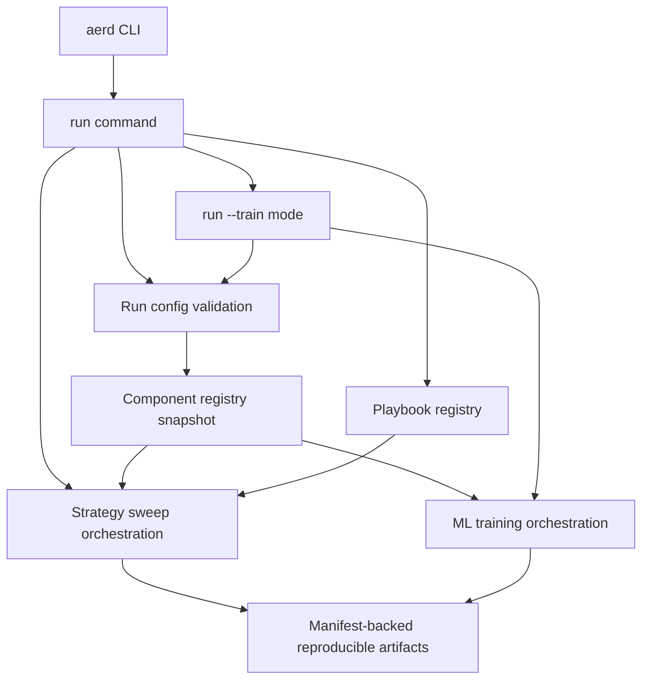
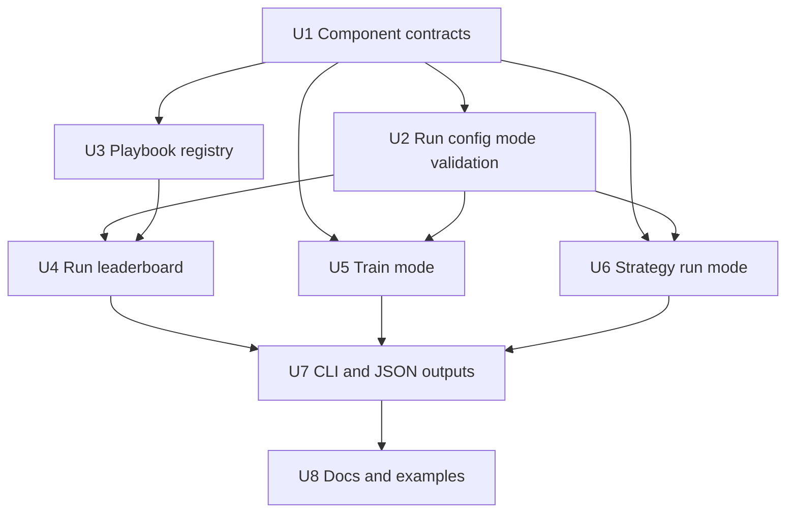

# feat: Add Research Playbook Component Workflow

## Summary

Implement the single-command research workflow by introducing deterministic component/playbook registries, run config source refs for playbook or component strategies/indicators, a strategy/research-sweep `aerd run`, and an explicit ML training mode through `aerd run --train`. The plan reuses existing config, CLI, portfolio, metric, model-plugin, and artifact patterns while moving train-specific settings under a required `train:` section for train mode.

---

## Problem Frame

The current codebase has strong contracts for ML-shaped experiment runs, but the execution path still makes default `run` train models and keeps indicators/labels mostly centralized. The origin document defines the product split; this plan defines the technical path to let `run` select playbook or component research sources explicitly while keeping ML training behind an explicit `--train` mode and without opening the config surface to arbitrary code.

---

## Requirements

- R1. Add strategy/research-oriented `aerd run <config>` and explicit ML `aerd run --train <config>` / `aerd run -t <config>` behavior under the single active `run` command. Origin: R1, F1, F3, F4, AE1, AE7, AE8.
- R2. Preserve explicit evidence so CLI output and artifacts distinguish playbook-backed run evidence, component-backed strategy-sweep evidence, and ML-training evidence. Origin: R2, A3, A4, A5.
- R3. Keep configs inert: no inline Python, formulas, arbitrary notebook/script paths, external import strings, or playbook state in reproducible `run` modes. Origin: R3, R4, R5, R15, R19, AE2.
- R4. Add file-scoped, plugin-like promoted component discovery for labels, indicators, and strategies with stable IDs, non-executing metadata discovery, callable behavior loaded only after validation, deterministic ordering, duplicate-ID rejection, and source identity. Origin: R11, R12, R13, R14, F2, AE6.
- R5. Add repo-controlled, family-scoped notebook playbook selection by stable ID under `research/playbooks/{labels,indicators,strategies}/`, with playbook-local temporary exploratory logic and no promotion side effects. Origin: R5, R6, R14, F1, AE1.
- R6. Add top-10 run leaderboards ranked by one validated VectorBT metric/direction, including variant identity, primary metric value, optional indicator-baseline metric/delta fields, optional baseline-delta ranking, attempted/succeeded/failed counts, failure-gating status, and sanitized failed-variant evidence. Origin: R7, R8, R9, R10, AE3, AE5.
- R7. Make `aerd run` evaluate explicit strategy and indicator source refs over config-owned portfolio assumptions and record strategy source, indicator source, parameters, portfolio, metric, ranking, and survival evidence. Origin: R15, R16, R17, F3, AE7.
- R9. Make `aerd run --train` own the existing model-plugin training mode over explicit train-section label source refs, indicator-derived model features, and model refs. Model refs retain `source`, but only `source: plugin` is accepted in v1. Origin: R18, R19, R20, F4, AE8.
- R10. Keep fixed repo-controlled component roots under `research/components/` and notebook playbook roots under `research/playbooks/` gitignored except for tracked README placeholders so proprietary or local research logic is not committed accidentally. Origin: user correction during planning.

**Origin actors:** A1 researcher, A2 component author, A3 strategy run reviewer, A4 ML training reviewer, A5 automation agent.

**Origin flows:** F1 exploratory playbook run, F2 manual promotion, F3 reproducible strategy sweep, F4 reproducible ML training.

**Origin acceptance examples:** AE1 playbook-backed run execution, AE2 arbitrary path rejection, AE3 top-10 leaderboard, AE4 mixed indicator source selection, AE5 baseline delta, AE6 file-scoped promotion, AE7 strategy run, AE8 train mode.

---

## Scope Boundaries

- No arbitrary notebook/script execution from config; `aerd run` executes only repo-controlled notebook playbooks discovered under `research/playbooks/` and selected by stable ID source refs.
- No inline Python, formula DSL, import strings, or temporary strategy rules in reproducible `run` configs.
- No prior run artifact paths, last-run refs, leaderboard-row refs, generated exploratory state, arbitrary notebook paths, or arbitrary scripts as inputs to either `run` mode; stable playbook source refs are allowed only when the run config explicitly selects `source: playbook` by ID.
- No automatic promotion from run artifacts into component files.
- No separate first-class feature component family in v1; indicator outputs/transforms remain the feature source. Run configs can select multiple indicator playbooks by ID, component indicators by explicit ID list, and all component indicators by `all`/empty-string selection. Each indicator playbook represents one indicator idea/family; if a baseline exists, it is defined by the indicator playbook as one component indicator ID and emitted by the playbook, not selected as a separate config ref.
- No composite score in v1; ranking uses one validated VectorBT metric and direction.
- No GUI research builder, optimizer, AutoML behavior, or automatic threshold optimization; user-configured exploratory threshold sweeps through playbook-backed `run` remain in scope.
- No backward-compatibility shim that keeps ML training silently available under default `aerd run`; model-shaped configs should fail fast unless `--train` is passed and train-specific settings are under `train:`.
- No `source: local` model file execution in v1; model refs keep `source` for future local model support, but only `source: plugin` is accepted until a safe repo-relative file contract exists.
- No automatic commit path for user-created labels, indicators, or strategies; the scaffold should track instructions/placeholders, not private strategy code.

### Deferred to Follow-Up Work

- Rich notebook execution features beyond the controlled playbook contract: v1 supports only repo-controlled notebook playbooks selected by stable ID, not arbitrary notebook paths, ad hoc scripts, or user-supplied import strings.
- Composite or registered ranking scores: revisit after single-metric leaderboards produce enough evidence about desired scoring recipes.
- Broader strategy side support: keep current long-only portfolio constraints unless a future side-specific signal/strategy contract expands them.
- Run defaults: v1 requires explicit config paths for `aerd run` in both default and `--train` modes; there is no local default experiment workflow.
- Portable source snapshots for sharing private run artifacts: v1 records component IDs, manifests, and source hashes but does not embed component source; future work can add optional source bundles if reviewers need artifacts to be self-contained across machines.

---

## Context & Research

### Relevant Code and Patterns

- `research/aegis_research/cli.py` is a thin argparse dispatcher that registers active commands under `cli_commands/*`.
- `research/aegis_research/cli_commands/run.py` currently validates configs with `make_default_model_registry()` and calls `run_experiment(...)`; this command must become strategy-sweep oriented by default while ML behavior moves behind `--train`.
- `research/aegis_research/config.py` owns schema-versioned, path-aware, side-effect-free config validation and already rejects inline indicator code keys.
- `research/aegis_research/model_contracts.py`, `research/aegis_research/model_registry.py`, and `research/aegis_research/model_plugins/sklearn_logistic.py` provide the declaration, registry, frozen fingerprint, and validation model to mirror for promoted components.
- `research/aegis_research/indicator_registry.py` is a central in-code registry; source refs should move to deterministic discovery from `research/components/` for component sources and `research/playbooks/` for playbook sources, while preserving the existing VectorBT-native execution patterns (`vbt.MA`, `vbt.RSI`, primitive returns/volatility, and `vbt.IF` custom indicators) as reusable infrastructure.
- `research/aegis_research/labels.py` already uses VectorBT-native label generators (`vbt.FIXLB`, `vbt.TRENDLB`, `vbt.PIVOTLB`) and preserves native label semantics, target schemas, lookahead, target role, and split-safety metadata; label components/playbooks should reuse that path where possible.
- `research/aegis_research/signals.py` and `research/aegis_research/portfolios.py` centralize VectorBT-native signal/portfolio boundaries (`vbt.SignalsAccessor.clean`, `vbt.Portfolio.from_signals`), config-owned sizing/cost/timing/direction, and portfolio diagnostics; strategy components should feed this boundary rather than own portfolio assumptions.
- `research/aegis_research/reports.py` exposes `PORTFOLIO_METRIC_CATALOG`, `portfolio_metrics(...)`, optional diagnostics, and metric assumptions; use this as the v1 ranking allowlist source before adding custom score recipes.
- `research/aegis_research/provenance/manifest.py`, `recorder.py`, `run_store.py`, and `experiment_artifacts.py` provide manifest-backed reproducible artifact patterns for run evidence.

### Institutional Learnings

- `docs/solutions/architecture-patterns/config-contract-security-reproducibility-2026-05-16.md`: configs are public contracts; invalid IDs, unsafe paths, secret-like values, and unsupported VectorBT assumptions must fail before data loading or artifacts.
- `docs/solutions/architecture-patterns/model-plugin-target-probability-contract-2026-05-17.md`: YAML selects trusted IDs and params only; core owns registry snapshots, compatibility validation, and artifact metadata.
- `docs/solutions/logic-errors/vectorbt-label-contract-target-lineage-2026-05-17.md`: preserve native labels and target lineage before deriving model targets; exploratory metrics must not share decision-grade validation semantics.
- `docs/solutions/best-practices/forward-first-long-only-signal-contract-2026-05-18.md`: keep signal and portfolio contracts forward-first, reject removed/unsupported fields, and record unsupported VectorBT settings as diagnostics rather than active behavior.
- `docs/solutions/best-practices/vectorbt-combine-params-conditions-levels-2026-05-17.md`: resolve parameter grids into explicit concrete variant identities before indicator/simulation execution.
- `docs/solutions/performance-issues/vectorbt-large-from-signals-chunking-memory-2026-05-17.md`: sweeps can explode memory; expose and validate sweep-size limits before launching large VectorBT portfolios.

### External References

- VectorBT PRO `Portfolio` supports ranking parameterized strategy outputs through portfolio metrics such as total return, Sharpe, Sortino, Calmar, Omega, drawdown, and trades.
- VectorBT PRO `pf.stats(..., agg_func=None)` can compute per-column metric tables, and custom metrics exist, but no single canonical composite score was identified.
- VectorBT PRO returns/portfolio accessors include probabilistic and deflated Sharpe diagnostics; keep these diagnostic until explicitly allowed for ranking.

---

## Key Technical Decisions

- Use one run config envelope with mode-specific sections rather than forcing all behavior through one `ExperimentConfig`: default `run` requires strategy/indicator/ranking refs, while `run --train` requires a `train:` section.
- Move current ML-shaped `run_experiment(...)` behind `aerd run --train`: this is the forward-first split required by the origin document and prevents default `run` from staying ambiguously ML-first.
- Create shared component declarations before lane orchestration: labels, indicators, and strategies need one registry/discovery model so config validation can fail before side effects.
- Keep package code limited to registry/validation/execution infrastructure; source definitions live outside the package under `research/components/` for component refs and `research/playbooks/` for playbook refs. Indicator and label implementations should use reusable VectorBT-native helpers, while strategies should produce signal states for the existing VectorBT portfolio boundary rather than reimplementing execution.
- Treat local component discovery as a reviewed source-code extension mechanism with a non-executing metadata phase: discovery roots are fixed, repo-controlled, non-symlinked locations; configs cannot provide paths or import strings, and registry snapshots must not import arbitrary component Python.
- Use family-scoped component identity: labels, indicators, and strategies each have their own ID namespace, while artifacts record both family and ID to avoid ambiguous cross-family references.
- Require run configs to declare source kind explicitly wherever more than one source is legal. Strategy refs choose `source: component` or `source: playbook` plus an ID; label refs choose a component labeler ID or a label playbook ID; run indicator refs may include playbook indicator IDs, component indicator IDs, and an all-components selector in the same run. Indicator baselines are optional playbook-owned metadata/results; when present, they name exactly one component indicator ID.
- Keep user/project component and playbook roots gitignored except README placeholders: local research strategy/indicator/label files and notebooks should not be committed by default.
- Record component source identity simply: run artifacts use component family, component ID, manifest fingerprint, and implementation source hash; Git tracked/dirty status is not a validity condition.
- Classify artifact source fields as public or private with a field-level allowlist: public CLI JSON and shared artifacts use only family, component ID, manifest fingerprint, and implementation hash, while repo-relative paths, local filenames, manifest locations, and detailed source metadata remain local/private or redacted by default.
- Carry mode identity and schema/version evidence in every resolved config envelope: `aerd run` and `aerd run --train` reject missing mode-specific sections instead of reinterpreting one another's configs.
- Store playbook-backed and component-backed run artifacts under immutable run directories; do not add a separate mutable play last-run store.
- Rank only variants that pass failure gating by a validated scalar metric: config validation failures fail the whole command; per-variant runtime failures are recorded as sanitized typed evidence, included in success-ratio summaries, and can invalidate the sweep when thresholds or strict-mode rules are violated.
- Preserve portfolio ownership in config: strategy components output aligned signal/rule results; portfolio settings, execution timing, costs, sizing, and direction stay with config.
- Validate sweep scale twice: static variant-count limits run during config resolution, then data-shape/order-record/memory budgets are checked after data loading but before `Portfolio.from_signals`.
- Compute only the ranking metric for the full sweep by default, then write richer metric evidence for top-ranked or selected variants so large sweeps do not pay full-report cost for every variant.

---

## Open Questions

### Resolved During Planning

- What discovery locations should the plan target? Use package-owned registry modules plus fixed repo-controlled roots under `research/components/` and family-scoped `research/playbooks/`; configs still cannot add paths or imports.
- Should old ML-shaped default `aerd run` remain accepted? No. Default `run` should reject model-training configs and direct the user to `aerd run --train` with a `train:` section.
- Which metric source should rank run sweeps? Start with `PORTFOLIO_METRIC_CATALOG` and explicit metric direction; do not include custom/composite scores in v1.
- Should per-variant runtime failures fail the whole sweep? Static config/component/playbook failures fail the command; per-variant runtime failures are sanitized, summarized, and controlled by strict/failure-gating policy before any leaderboard is treated as valid.

### Deferred to Implementation

- Exact component file layout and helper names: the plan fixes package-owned discovery and registry semantics, but final module names should be chosen while implementing tests.
- Exact JSON response field names beyond lane/evidence summaries: keep command outputs stable and additive, but avoid over-specifying secondary fields in the plan.

---

## Output Structure

```text
research/aegis_research/
  cli_commands/
    run.py
  component_registry/
    contracts.py
    manifests.py
    registry.py
  playbook_registry/
    contracts.py
    registry.py
  strategy_runs.py
  training.py
research/components/
  labels/README.md
  indicators/README.md
  strategies/README.md
research/playbooks/
  labels/README.md
  indicators/README.md
  strategies/README.md
research/configs/
  README.md
docs/examples/
  label_component_example.py
  indicator_component_example.py
  strategy_component_example.py
  label_playbook_example.ipynb
  indicator_playbook_example.ipynb
  strategy_playbook_example.ipynb
```

This tree is directional. The implementing agent may adjust names if tests reveal a clearer shape, but the plan expects separate component, playbook registry, strategy-run, and training boundaries.

---

## High-Level Technical Design

> *This illustrates the intended approach and is directional guidance for review, not implementation specification. The implementing agent should treat it as context, not code to reproduce.*



The key separation is source semantics: default `run` writes immutable sweep evidence that identifies playbook-backed and component-backed sources, while `run --train` writes ML-training evidence from the config's `train:` section.

---

## Implementation Units



### U1. Define Promoted Component Contracts And Discovery

**Goal:** Create the shared declaration and registry infrastructure for file-scoped labels, indicators, and strategies, including deterministic discovery, duplicate-ID rejection, metadata validation, and source identity.

**Requirements:** R3, R4, R8, R9, R10; origin R3, R4, R11, R12, R13, R14, R15, R19, AE6.

**Dependencies:** None.

**Files:**
- Create: `research/aegis_research/component_registry/contracts.py`
- Create: `research/aegis_research/component_registry/manifests.py`
- Create: `research/aegis_research/component_registry/registry.py`
- Create: `research/aegis_research/component_registry/__init__.py`
- Create: `research/components/labels/README.md`
- Create: `research/components/indicators/README.md`
- Create: `research/components/strategies/README.md`
- Modify: `.gitignore`
- Modify: `research/aegis_research/indicator_registry.py`
- Modify: `research/aegis_research/indicators.py`
- Modify: `research/aegis_research/labels.py`
- Modify: `research/aegis_research/model_registry.py`
- Test: `tests/unit/research/aegis_research/test_component_registry.py`
- Test: `tests/integration/research/aegis_research/test_component_autodiscovery.py`

**Approach:**
- Mirror the model-plugin pattern for declarations, but do not mirror import-time discovery: component manifests carry stable ID, version/source kind, supported role, parameter metadata, outputs, assumptions, and a constrained callable binding that is validated without importing component Python.
- Use one concrete static metadata format for Python component files: a top-level `COMPONENT_MANIFEST = {...}` literal and `COMPONENT_CALLABLE = "symbol_name"` literal parsed through `ast`/literal validation only. Discovery rejects expressions, calls, imports, interpolation, decorators-as-metadata, or computed metadata; the callable symbol is imported only after selected component IDs pass lane validation.
- Share only registry plumbing across component families; define separate `LabelManifest`, `IndicatorManifest`, and `StrategyManifest` validators so lookahead/split-safety, indicator output/feature semantics, and signal-only strategy constraints stay family-specific.
- Build a frozen component registry snapshot with deterministic ordering and a fingerprint derived from manifest metadata plus source identity; constructing the snapshot must not execute component callables or arbitrary module top-level code.
- Import callable implementations only after a selected component ID has passed run config validation, path/root checks, source-hash checks, and reproducibility policy checks.
- Migrate component-source selection away from the central in-code indicator registry; component definitions come only from files under `research/components/`.
- Extract or preserve reusable VectorBT-native indicator execution helpers from the existing registry/pipeline so component and playbook indicator code can use `vbt.MA`, `vbt.RSI`, `vbt.IF` custom indicators, primitive returns, volatility, output normalization, transforms, lineage, and native-output handling without central package-side component definitions.
- Preserve reusable VectorBT-native label execution helpers so label components/playbooks can use `vbt.FIXLB`, `vbt.TRENDLB`, `vbt.PIVOTLB`, target selection, target schema, split-safety, and evaluation-evidence handling without duplicating label semantics.
- Preserve reusable VectorBT-native strategy execution boundaries so strategy components/playbooks emit signal states that flow through existing signal diagnostics, `vbt.SignalsAccessor.clean`, `simulate_portfolio(...)`, and `vbt.Portfolio.from_signals` rather than embedding portfolio execution.
- Add strategy and label component declaration types even if the initial scaffold has no tracked component implementations; later units depend on these contracts for config validation.
- Validate component manifests at discovery time, before any run mode loads data or writes artifacts, using static parsing rather than Python import side effects.
- Discover components only from the fixed repo-controlled `research/components/` root; configs never provide discovery paths, module names, or import strings.
- Reject symlinked discovery roots or files that resolve outside approved roots; source identity should use canonical repo-relative paths and source hashes.
- Treat Python component files as executable implementation code, not metadata; discovery reads manifests only, and tests should prove registry snapshot creation does not run component module top-level code.
- Scope duplicate-ID checks by component family, and persist artifact identity as `{family, id}` so label, indicator, and strategy IDs cannot be confused.
- Add root `.gitignore` rules so everything under `research/components/{labels,indicators,strategies}/` is ignored by default except each directory's tracked `README.md` placeholder.
- Write component README placeholders using the same warning pattern as local config READMEs: tracked local component files are intentionally absent, the README points to the relevant `docs/examples/*_component_example.py`, local component files are ignored by git, ignored files are not secret management, and force-adds should be intentionally reviewed.
- Define only the shared strategy component declaration shell here; U6 owns the concrete `StrategyInputs`, signal-only output contract, and portfolio-boundary validation where the strategy-run consumer exists.
- Record run-mode source identity during registry selection without consulting Git tracked/dirty status: component family, component ID, manifest fingerprint, and implementation source hash.

**Execution note:** Implement registry behavior test-first because duplicate IDs and source fingerprints are reproducibility boundaries.

**Patterns to follow:**
- `research/aegis_research/model_contracts.py`
- `research/aegis_research/model_registry.py`
- `research/aegis_research/model_plugins/sklearn_logistic.py`
- `research/aegis_research/indicator_registry.py`
- Existing VectorBT-native execution in `research/aegis_research/indicators.py`
- Existing VectorBT-native label execution in `research/aegis_research/labels.py`
- Existing signal/portfolio execution in `research/aegis_research/signals.py` and `research/aegis_research/portfolios.py`

**Test scenarios:**
- Happy path: discovering one label, indicator, and strategy component produces a frozen registry with stable IDs and deterministic ordering.
- Happy path: a component fixture under `research/components/indicators/` becomes discoverable without package-code registration.
- Happy path: an indicator component fixture uses existing VectorBT-native helper execution and records native output/source identity evidence.
- Happy path: a label component fixture uses existing VectorBT-native label helper execution and records native label/source identity evidence.
- Error path: duplicate component IDs across files fail before execution with a component-specific diagnostic.
- Error path: duplicate IDs within the same family fail; identical short IDs across different families remain distinguishable by family in artifacts.
- Error path: missing required metadata fails with field-specific diagnostics.
- Error path: a component declaring unsupported role/output/alignment assumptions is rejected before config resolution succeeds.
- Error path: symlinked or path-escaping component roots/files are rejected before discovery.
- Error path: a component Python file with top-level side effects is not executed during discovery; the test plants a side-effecting fixture and asserts registry snapshot creation remains side-effect-free.
- Error path: a reproducible run-mode selection outside approved roots, without a valid manifest, or without source hash evidence fails before execution.
- Integration: adding a component file makes its ID discoverable without editing unrelated central registry code; removing the file removes the ID.
- Integration: registry fingerprint changes when component manifest or selected source hash changes.
- Integration: local component roots are gitignored except README placeholders.
- Docs integration: component README placeholders point to their docs examples and include the ignored-files-not-secret-management warning.
- Integration: public CLI JSON and shared artifacts do not emit local proprietary paths, filenames, or unredacted source metadata from gitignored roots.

**Verification:**
- Component discovery is deterministic, non-executing, and safe enough to use from config validation.
- Component-source resolution depends only on files discovered under `research/components/`.

### U2. Add Run Config Mode Contracts

**Goal:** Add side-effect-free config validation for default strategy/research `run` and `run --train`, sharing existing data/portfolio/report validation while enforcing mode-specific executable boundaries.

**Requirements:** R1, R2, R3, R5, R7, R8, R9; origin R1, R2, R3, R4, R5, R8, R15, R16, R18, R19, R20, AE1, AE2, AE7, AE8.

**Dependencies:** U1.

**Files:**
- Modify: `research/aegis_research/config.py`
- Modify: `research/aegis_research/cli_support/output.py`
- Create: `tests/integration/research/aegis_research/test_lane_config_contract.py`
- Modify: `tests/integration/research/aegis_research/test_config_contract.py`
- Modify: `tests/integration/research/aegis_research/test_cli_docs.py`

**Approach:**
- Add mode-aware config loading/resolution helpers rather than widening `ExperimentConfig` until it has unrelated optional fields for all modes.
- Require every resolved run config to carry mode identity and schema/version evidence; `aerd run` chooses the mode from `--train` rather than from subdirectories or a top-level lane field.
- Reuse existing validation helpers for data, indicators, labels, signals, portfolio, report, duplicate keys, unknown fields, path-safe names, secret redaction, and finite numeric checks.
- Add a shared `SourceRef` config contract. Strategy refs must declare `source: component` or `source: playbook` plus an ID. Label refs must declare a component labeler ID or a label playbook ID. Run indicator selection can include playbook indicator refs, component indicator ID lists, and `all` or empty-string component selection for all component indicators in the same config. Indicator baseline selection is not a config source ref; each indicator playbook may declare exactly one component indicator ID as its baseline and emit baseline evidence for it.
- For strategy `run`, require explicit strategy source refs and validated indicator inputs; reject model plugin fields, ambiguous source refs, run artifact paths, last-run refs, leaderboard-row refs, generated state, arbitrary notebook/script path keys, and inline code recursively.
- For `run --train`, require a `train:` section with model source selection, explicit label source refs, and indicator-derived model features; reject run artifact references as inputs.
- Model refs keep `source` because future local model files may need a controlled source boundary, but v1 accepts only `source: plugin`.
- Make no-config behavior explicit in run config resolution: both default `run` and `run --train` require config paths in v1, with no local default fallback.
- Validate ranking metrics against an allowlist derived from the existing portfolio metric catalog, with explicit direction and unavailable metric rules.
- Define YAML inertness at the parser boundary: safe loader only, no custom object tags, duplicate keys rejected, merge keys/anchors/aliases bounded or rejected, and size/depth limits enforced where practical.
- Validate artifact/output roots for all modes: reject absolute paths, parent traversal, symlink escapes, device paths, and final/staging/backup paths outside approved roots.
- Establish the minimal shared success/error payload helpers here so later mode handlers do not invent incompatible output shapes before U7 hardens them.
- Do not wire root parser command behavior in U2; U3, U5, and U6 own the first executable CLI path for their respective modes.

**Execution note:** Start with failing integration tests that assert invalid configs fail before run artifact creation.

**Patterns to follow:**
- `ConfigValidationIssue` and `ConfigValidationError` in `research/aegis_research/config.py`
- `_validate_indicators(...)`, `_validate_labels(...)`, `_validate_signals(...)`, and `_validate_portfolio(...)` in `research/aegis_research/config.py`
- Config safety guidance in `docs/solutions/architecture-patterns/config-contract-security-reproducibility-2026-05-16.md`

**Test scenarios:**
- Happy path: valid default run and train-mode configs resolve through side-effect-free validation.
- Covers AE2. Error path: run config with notebook/script path keys fails before execution.
- Error path: any run config with inline Python/formula/import/function keys fails with a path-aware issue.
- Error path: malicious YAML tags, unsafe constructors, duplicate keys, merge keys/aliases, or resource-heavy YAML structures are rejected or bounded before dataclass construction.
- Error path: run configs with arbitrary script/notebook/import path fields fail before data loading or artifact creation.
- Error path: default `aerd run` receiving a model-training config fails fast and directs users toward `aerd run --train` with a `train:` section.
- Error path: `aerd run --train` receiving a strategy-sweep-only config fails fast and explains the missing `train:` contract.
- Error path: missing or ambiguous component source refs fail before data loading.
- Error path: run config references unknown playbook indicator IDs, unknown component indicator IDs, or invalid all-components selectors and fails before execution.
- Error path: `aerd run` receiving run artifact paths, last-run refs, leaderboard-row refs, or generated state fails before data loading.
- Error path: unknown component or playbook IDs fail before data loading.
- Error path: invalid ranking metric or direction fails before run execution.
- Error path: output, staging, or backup roots that escape approved artifact roots fail before writes.
- Edge case: fewer than ten successful variants remains valid because leaderboard size is “up to 10,” not exactly 10.
- Edge case: `aerd run` and `aerd run --train` without explicit config fail in v1.

**Verification:**
- Each mode has a clear resolved config object or envelope before side effects.
- Existing config tests still pass for train-compatible ML configs after migration.

### U3. Add Repo-Controlled Notebook Playbook Registry

**Goal:** Add the stable-ID notebook playbook execution boundary for `aerd run` to select repo-controlled notebooks under `research/playbooks/`, without shipping a built-in playbook implementation.

**Requirements:** R1, R2, R3, R5, R7; origin R1, R2, R3, R4, R5, R6, R8, R9, R10, AE1, AE2, AE3, AE5.

**Dependencies:** U1, U2.

**Files:**
- Create: `research/aegis_research/playbook_registry/contracts.py`
- Create: `research/aegis_research/playbook_registry/registry.py`
- Create: `research/aegis_research/playbook_registry/__init__.py`
- Create: `research/playbooks/labels/README.md`
- Create: `research/playbooks/indicators/README.md`
- Create: `research/playbooks/strategies/README.md`
- Modify: `.gitignore`
- Modify: `research/aegis_research/strategy_runs.py`
- Modify: `research/aegis_research/cli_commands/run.py`
- Modify: `research/aegis_research/cli.py`
- Test: `tests/unit/research/aegis_research/test_playbooks.py`
- Test: `tests/integration/research/aegis_research/test_play_cli.py`

**Approach:**
- Define a notebook playbook declaration with family, stable ID, notebook filename, supported stages, accepted inputs, optional baseline component indicator ID, and expected result schema.
- For `research/playbooks/indicators/`, enforce one indicator idea/family per playbook ID: a notebook playbook may sweep parameters for that indicator, but it must not hide multiple unrelated indicator definitions behind one ID. If it has a baseline, the declaration names exactly one component indicator ID from `research/components/indicators/`.
- Keep executable exploratory logic inside repo-controlled notebooks under `research/playbooks/{labels,indicators,strategies}/`; run configs select playbook family, ID, and parameters only through source refs.
- Keep playbook discovery simpler than local component discovery: playbooks are trusted repo-controlled notebook declarations registered by family-scoped stable ID, with duplicate-ID rejection and config validation before the selected notebook executes. Configs still cannot provide playbook paths, modules, arbitrary notebook paths, scripts, or import strings.
- Do not ship a built-in playbook in v1; playbook integration tests create notebook fixtures under isolated `research/playbooks/{labels,indicators,strategies}/` fixture roots.
- Add root `.gitignore` rules so notebook files under `research/playbooks/{labels,indicators,strategies}/` are ignored by default except each directory's tracked `README.md` placeholder.
- Write playbook README placeholders using the same warning pattern as local config READMEs: tracked local playbook notebooks are intentionally absent, each README points to the corresponding `docs/examples/*_playbook_example.ipynb`, local notebooks are ignored by git, ignored files are not secret management, and force-adds should be intentionally reviewed.
- A project notebook playbook can implement the exploratory MVP outside package code: build temporary playbook-local indicator/threshold/strategy variants, optionally compute and emit its declared component-indicator baseline, run VectorBT portfolio metrics, and emit variant rows for the run artifact unit.
- Treat playbook-local ideas as temporary: they can inform manual promotion, but the playbook must not create, mutate, or register promoted component files.
- Keep arbitrary notebook-path support out of the CLI path; the CLI executes only discovered playbook IDs from `research/playbooks/` through `aerd run` source refs.
- Register enough thin run behavior here for integration tests to call playbook-backed execution through `aerd run`; U7 can still harden output and docs globally.

**Execution note:** Add unit coverage for playbook ID lookup and capability validation before writing integration-level playbook-backed runs.

**Patterns to follow:**
- Model plugin declaration/registry pattern in `research/aegis_research/model_plugins/`
- Data and portfolio loading patterns in `research/aegis_research/experiments.py`
- VectorBT sweep guidance in `docs/solutions/best-practices/vectorbt-combine-params-conditions-levels-2026-05-17.md`

**Test scenarios:**
- Covers AE1. Happy path: a valid run config selects a notebook playbook ID from a test fixture and runs selected exploratory logic through `aerd run`.
- Happy path: a playbook-owned baseline is consumed when the notebook declares one component indicator ID and emits baseline evidence for it.
- Happy path: a notebook playbook fixture includes at least one playbook-local target-threshold or strategy dimension so exploration is not deferred.
- Error path: unknown playbook ID fails before data loading.
- Error path: requesting an unsupported stage fails during config validation.
- Error path: playbook registry rejects duplicate, malformed, or missing notebook playbook declarations before data loading.
- Error path: indicator playbook declaration attempts to advertise multiple unrelated indicator families under one playbook ID and fails validation.
- Error path: indicator playbook declaration attempts to name more than one baseline component indicator ID, or names an unknown component indicator ID, and fails validation.
- Integration: `research/playbooks/{labels,indicators,strategies}/` are gitignored except README placeholders.
- Docs integration: playbook READMEs point to their docs example notebooks and include the ignored-files-not-secret-management warning.
- Error path: playbook attempts to promote or mutate component files is not part of the execution contract and has no code path.
- Integration: notebook playbook fixture can run a small synthetic sweep over windows/thresholds and produce variant records for run ranking.

**Verification:**
- `aerd run` has repo-controlled playbook executable targets by stable ID.
- Playbook execution can produce metrics and variant identities while optionally combining playbook indicator refs with component indicator selections; any baseline evidence comes from the playbook-declared single component indicator baseline.

### U4. Implement Run Leaderboards

**Goal:** Persist run sweep outputs in immutable run artifacts with top-10 metric ranking across playbook-backed and component-backed variant records.

**Requirements:** R2, R6, R7; origin R2, R7, R8, R9, R10, AE3, AE4, AE5.

**Dependencies:** U2, U3.

**Files:**
- Create: `research/aegis_research/run_leaderboard.py`
- Modify: `research/aegis_research/strategy_runs.py`
- Modify: `research/aegis_research/cli_commands/run.py`
- Modify: `research/aegis_research/cli_support/output.py`
- Test: `tests/unit/research/aegis_research/test_run_leaderboard.py`
- Test: `tests/integration/research/aegis_research/test_run_playbook_sources.py`

**Approach:**
- Write playbook-backed and component-backed sweep results into the normal immutable run directory and manifest, not a mutable last-run location.
- Rank successful variants by the configured metric/direction; record evaluated, succeeded, failed, and excluded counts.
- For every evaluated indicator variant, record an indicator source field (`playbook` or `component`), indicator ID, configured primary metric value, and any source-specific evidence needed to distinguish who computed it.
- If the indicator playbook declares and emits baseline evidence, record the configured primary metric value, baseline primary metric value, raw delta, baseline component indicator ID, and direction-adjusted delta as informational leaderboard fields. Rank by the configured primary metric unless the config explicitly selects baseline-delta ranking; if no baseline exists, record that no baseline was applied and rank by the primary metric.
- Record per-variant runtime failures as typed, sanitized error codes and summaries; failed variants are excluded from ranking, all-failed sweeps fail clearly, and any partial-success leaderboard is explicitly marked exploratory/partial.
- Include total attempted variants, succeeded variants, failed variants, excluded variants, success ratio, and partial-leaderboard status in the leaderboard summary so top-10 rows are not presented without survivor context.
- Cap failure evidence using representative sanitized examples so large failed sweeps do not produce unbounded public JSON. Deeper grouped failure analytics are follow-up hardening.
- Use bounded variant batches for sweeps; merge compact ranking/metric evidence instead of requiring one giant portfolio object for every configuration.
- Compute the configured ranking metric for all variants, then write richer metric evidence only for top-ranked variants or configured diagnostics.
- Use existing safe path/redaction helpers for CLI output, artifact metadata, diagnostics, exception summaries, failure samples, and JSON stderr; never persist raw tracebacks, raw `repr(exception)`, environment variables, credential-bearing URLs, raw config fragments, or unredacted filesystem paths.

**Execution note:** Start with leaderboard shape and source-evidence tests because source confusion is the highest-risk part of merging playbooks into `run`.

**Patterns to follow:**
- `research/aegis_research/provenance/manifest.py` safe path and completion validation concepts
- `research/aegis_research/provenance/experiment_artifacts.py` staged write discipline
- `research/aegis_research/cli_support/output.py` safe JSON value/path helpers
- Metric catalog in `research/aegis_research/reports.py`

**Test scenarios:**
- Covers AE3. Happy path: successful run writes an immutable run artifact with a top-10 leaderboard, variant identities, metric values, and source evidence.
- Covers AE4. Happy path: run config evaluates playbook indicators and component indicators in the same run, including an all-components selector, and leaderboard rows identify `indicator_source` for each metric row.
- Happy path: run config selects a playbook strategy by stable ID and records strategy source evidence in the run artifact.
- Error path: all variants fail and the command fails with failed-variant evidence.
- Error path: all variants fail or all ranking metrics are unavailable and the command fails while marking only the current run failed.
- Error path: runtime exception messages containing secret-like values, raw local paths, or private strategy names are redacted in artifacts and JSON stderr.
- Error path: interrupted run marks the immutable run manifest interrupted.
- Error path: non-finite, unavailable, or warning-producing ranking metrics are excluded with evidence; all-unavailable rankings fail clearly.
- Edge case: fewer than 10 successful variants emits all successful variants and correct counts.
- Edge case: metric ties are sorted deterministically using variant identity as the stable tie-breaker.
- Edge case: leaderboard rows include the evaluated portfolio assumptions, not just indicator/strategy parameters.
- Edge case: indicator baseline exists for a higher-is-better or lower-is-better metric; leaderboard rows include indicator source, primary metric, baseline metric, raw delta, and direction-adjusted delta, and delta direction is interpreted consistently.
- Edge case: most variants fail and artifact output remains bounded through sanitized failure samples, explicit attempted/succeeded/failed counts, and partial-leaderboard status.
- Integration: JSON success output points to the exploratory artifact without dumping large leaderboard payloads.

**Verification:**
- Run artifacts are safe for repeated local exploration because each attempt writes a separate immutable run directory.
- Leaderboards are reproducible from the run config and artifact content while preserving whether rows came from playbooks or components.

### U5. Move Existing ML Experiment Execution To `aerd run --train`

**Goal:** Preserve the existing ML-shaped pipeline under an explicit training mode and keep train artifacts distinct from strategy sweeps.

**Requirements:** R1, R2, R3, R9; origin R1, R2, R3, R18, R19, R20, F4, AE8.

**Dependencies:** U2 for the train-mode migration checkpoint; U1 before the promoted-component train integration checkpoint.

**Files:**
- Modify: `research/aegis_research/cli_commands/run.py`
- Create: `research/aegis_research/training.py`
- Modify: `research/aegis_research/experiments.py`
- Modify: `research/aegis_research/labels.py`
- Modify: `research/aegis_research/indicators.py`
- Modify: `research/aegis_research/models.py`
- Modify: `research/aegis_research/cli.py`
- Modify: `research/aegis_research/cli_support/output.py`
- Test: `tests/integration/research/aegis_research/test_train_cli.py`
- Test: `tests/integration/research/aegis_research/test_config_contract.py`
- Test: `tests/e2e/research/aegis_research/test_experiment_provenance.py`

**Approach:**
- Extract or wrap the current `run_experiment(...)` behavior as train mode without changing core label/indicator/model/split/portfolio semantics more than necessary.
- Register `--train` / `-t` on the `run` command and keep the command handler thin: resolve the shared config in train mode, attach selection evidence, call domain training orchestration, render success/failure through shared output helpers.
- Preserve model registry validation, target compatibility, split-local model fitting, positive-class probability mapping, and existing artifact writers.
- Add train-specific mode/evidence metadata to outputs and manifests so reviewers do not confuse training evidence with strategy-sweep evidence.
- Update tests and docs that currently treat default `aerd run` as ML training to use `aerd run --train` where the behavior is explicitly about model plugins.
- Deliver this unit in two checkpoints: first expose the existing ML pipeline through `aerd run --train` with characterization coverage, then integrate explicit label source refs and indicator-derived features without adding a separate feature registry.
- Record the same component source identity evidence as strategy `run` before training artifacts are written.
- Add lightweight resource/timing evidence around the extracted training stages so the refactor does not hide duplicate data loading, duplicate indicator computation, or split/model fitting costs.

**Execution note:** Add characterization coverage around current `aerd run` ML behavior before moving it behind `train` so the migration preserves the training contract.

**Patterns to follow:**
- `research/aegis_research/cli_commands/run.py`
- `research/aegis_research/experiments.py`
- `research/aegis_research/models.py`
- `research/aegis_research/model_registry.py`
- `docs/solutions/architecture-patterns/model-plugin-target-probability-contract-2026-05-17.md`

**Test scenarios:**
- Covers AE8. Happy path: valid `train:` section runs the current ML pipeline through `aerd run --train` and records training mode evidence.
- Integration: train mode uses the default model registry and rejects unknown model plugin IDs before run artifacts.
- Integration: train mode selects a label source ref and indicator-derived model features; artifacts record label source identity and indicator feature evidence.
- Error path: train mode config references a run artifact as input and validation rejects it.
- Error path: train mode config attempts to use a first-class feature component or import path and validation rejects it.
- Error path: train mode config selects a component outside approved roots or without source hash evidence and fails before model fitting.
- Error path: unsupported label target/model compatibility fails before model fitting.
- Edge case: train extraction does not duplicate data loading or indicator/model feature computation relative to the current pipeline.
- Integration: existing provenance artifacts for labels, indicators, splits, models, probabilities, signals, portfolios, metrics, and reports still exist for train runs.
- CLI: train-mode JSON success uses the same stable envelope pattern as run success.

**Verification:**
- Existing ML behavior is available through `aerd run --train` and no longer depends on default `aerd run` semantics.
- Train artifacts are visibly ML-training evidence.

### U6. Implement Promoted Strategy Sweep Default `aerd run`

**Goal:** Replace `aerd run` with a strategy/research-sweep command over explicit playbook or component source refs and config-owned portfolio assumptions.

**Requirements:** R1, R2, R3, R4, R8; origin R1, R2, R3, R4, R11, R12, R13, R15, R16, R17, F3, AE7.

**Dependencies:** U1, U2.

**Files:**
- Modify: `research/aegis_research/cli_commands/run.py`
- Create: `research/aegis_research/strategy_runs.py`
- Modify: `research/aegis_research/portfolios.py`
- Modify: `research/aegis_research/signals.py`
- Modify: `research/aegis_research/reports.py`
- Modify: `research/aegis_research/provenance/experiment_artifacts.py`
- Modify: `research/aegis_research/provenance/manifest.py`
- Modify: `research/aegis_research/provenance/recorder.py`
- Test: `tests/integration/research/aegis_research/test_strategy_run.py`
- Test: `tests/unit/research/aegis_research/test_strategy_components.py`
- Test: `tests/integration/research/aegis_research/test_provenance_manifest.py`

**Approach:**
- Define the v1 component strategy callable boundary around `StrategyInputs`: market data fields available to strategies, raw indicator outputs, optional transformed indicator-derived model features only when declared, parameter-combination identity, and index/symbol alignment metadata.
- Resolve the configured strategy source ref explicitly: `source: component` loads a strategy from `research/components/strategies/` by ID, while `source: playbook` loads a strategy notebook declaration from `research/playbooks/strategies/` by ID.
- Treat indicator inputs for strategy experimentation as a combined run selection in v1: configs may include playbook indicator refs, explicit component indicator ID lists, and `all`/empty-string component selectors in the same run. Metrics must record whether each indicator result was computed by a playbook or a component; baseline evidence is emitted by playbooks that declare exactly one component indicator baseline.
- Define the v1 strategy output boundary as aligned boolean/enum entries/exits or equivalent signal states over the same timestamp/symbol panel as market data; outputs must not include size, cost, slippage, direction, execution timing, or portfolio construction fields.
- Reject strategy component metadata, manifests, config, or output schemas that attempt to own portfolio sizing, costs, slippage, direction, execution timing, or non-signal portfolio behavior.
- Add runtime signal diagnostics that record entry/exit counts, alignment checks, declared lag/timing assumptions, direction exposure implied by emitted states, and the external portfolio config applied.
- Validate enforceable timing boundaries only: reject declared pre-shifted execution timing, forbidden timing metadata, output schema timing fields, and obvious alignment violations. Hidden lookahead inside reviewed Python code is a component-review responsibility; runtime diagnostics should surface suspicious lag/alignment evidence but must not claim to prove arbitrary code is lookahead-free.
- Resolve indicator and strategy parameter sweeps into explicit variant identities before execution; apply safety limits to prevent unbounded VectorBT runs.
- Execute sweeps in bounded variant batches and merge compact metric/leaderboard evidence; do not require one wide portfolio object for all variants.
- Apply the same static variant-count and post-data shape/order-record/memory budget checks planned for play sweeps.
- Reuse `simulate_portfolio(...)` for config-owned portfolio execution and `portfolio_metrics(...)` for metric evidence.
- Write manifest-backed reproducible artifacts for strategy variant identity, component registry snapshot, compact metrics, ranking, portfolio diagnostics, signal diagnostics, and survival/report evidence.
- Keep public strategy-run artifacts bounded: full detail for top-ranked or selected variants, compact attempted/succeeded/failed counts for non-survivors, sanitized representative failures, and explicit truncation metadata when limits are reached.
- Fail static config/component errors before data loading; record per-variant runtime failures as typed sanitized evidence and apply strict failure gating before ranking.
- Default reproducible `run` to strict mode where unexpected variant execution failures fail the command; all runs record attempted/succeeded/failed counts, success ratio, and failure-gating status. Allowed-exclusion policies and correlated-failure invalidation are follow-up hardening, not MVP behavior.
- Reject model-training configs under default `aerd run` with a clear validation diagnostic pointing to `aerd run --train` and the `train:` section.
- Reject run artifact refs, last-run refs, leaderboard-row refs, generated exploratory state, arbitrary notebook paths, and script refs under `aerd run`; only explicit source refs plus config-owned parameters and portfolio assumptions are valid inputs.
- Record component source identity before selected strategy/indicator callables execute.

**Execution note:** Implement the strategy output boundary test-first; it is the guardrail that prevents strategy components from swallowing portfolio semantics.

**Patterns to follow:**
- `research/aegis_research/signals.py` for entries/exits semantics
- `research/aegis_research/portfolios.py` for portfolio config ownership
- `research/aegis_research/validation.py` for split metric evidence and aggregation patterns
- `docs/solutions/best-practices/forward-first-long-only-signal-contract-2026-05-18.md`
- `docs/solutions/best-practices/vectorbt-combine-params-conditions-levels-2026-05-17.md`

**Test scenarios:**
- Covers AE7. Happy path: valid run config selects an explicit strategy source ref, mixed playbook/component indicator inputs, sweep params, and portfolio assumptions; artifacts record variant identity, indicator source, and metrics.
- Test setup: run happy-path tests create temporary component files and notebook playbook fixtures under isolated `research/components/` and `research/playbooks/` fixture roots.
- Error path: run config omits strategy source kind, selects an unknown strategy ID, or references the wrong family and fails before execution.
- Error path: run config selects a run artifact, last-run ref, leaderboard-row ref, or generated playbook state and fails before execution.
- Error path: run config contains inline strategy logic and fails validation.
- Error path: strategy component attempts to declare portfolio assumptions as owned behavior and registry validation rejects it.
- Error path: strategy output includes size/cost/timing/direction fields, forbidden timing metadata, or misdeclared pre-shifted execution semantics and fails before portfolio simulation.
- Error path: strategy output has misaligned timestamps or symbols and fails before portfolio simulation.
- Error path: model-training config passed to default `aerd run` fails fast and directs users to `aerd run --train`.
- Error path: component source outside approved roots or without source hash evidence is selected and fails before execution.
- Error path: unexpected variant failures in strict mode fail the reproducible run instead of producing a survivor-biased leaderboard.
- Edge case: some variants fail at runtime; failed variants are recorded as sanitized evidence, and ranking proceeds only if strict failure policy permits it.
- Edge case: large configured sweeps are rejected or batched before VectorBT execution exceeds configured budgets.
- Edge case: non-finite, unavailable, warning-producing, or zero-trade primary metrics are excluded or marked unavailable with evidence.
- Edge case: ranked strategy-sweep summary records configured primary metric/direction, deterministic tie-breaker, failed-variant counts, and survival/verdict outcome.
- Integration: manifest records component IDs, registry fingerprint, parameter values, portfolio assumptions, signal diagnostics, metrics, failure-gating evidence, and lane evidence type.

**Verification:**
- `aerd run` no longer trains models by default.
- Reproducible strategy sweeps can be audited from promoted component identity and run artifacts.

### U7. Harden CLI Output, Errors, And Docs-Backed Contracts

**Goal:** Stabilize cross-mode JSON/human output, errors, explicit-config behavior, and docs-backed CLI contracts after each mode unit has added its minimal executable command path.

**Requirements:** R1, R2, R3, R5, R6, R7, R8, R9; origin all acceptance examples.

**Dependencies:** U4, U5, U6.

**Files:**
- Modify: `research/aegis_research/cli.py`
- Modify: `research/aegis_research/cli_support/output.py`
- Modify: `research/aegis_research/cli_support/errors.py`
- Modify: `research/aegis_research/cli_commands/__init__.py`
- Modify: `tests/integration/research/aegis_research/test_cli.py`
- Modify: `tests/integration/research/aegis_research/test_cli_docs.py`

**Approach:**
- Audit the minimal CLI handlers added by U3, U5, and U6 and normalize parser help, JSON envelopes, human output, and error categories across default `run` and `run --train`.
- Keep command handlers thin: parse CLI args, resolve run config, call domain API, render success/failure.
- Extend success payload helpers so each mode emits safe refs, mode/evidence summaries, and artifact pointers without dumping large tables, raw configs, secrets, private source paths, or private native state.
- Extend error categories only if existing config/execution categories cannot describe run artifact failures or discovery failures clearly.
- Remove legacy default config behavior from the active CLI; `run` must require explicit config paths in both default and `--train` modes.
- Route every stored error, failure sample, diagnostic, and JSON stderr payload through the same redaction/safe-value pipeline as success payloads.
- Treat the `aerd run` semantic cutover as incomplete until this unit and U8 migration docs/diagnostics land with U5/U6; avoid merging a state where default `run` rejects ML configs before `run --train` guidance and examples are in place.

**Execution note:** Characterize current CLI JSON/human output before extending helpers to avoid breaking existing automation shape unnecessarily.

**Patterns to follow:**
- `research/aegis_research/cli.py`
- `research/aegis_research/cli_support/output.py`
- `research/aegis_research/cli_support/errors.py`
- `tests/integration/research/aegis_research/test_cli.py`

**Test scenarios:**
- Happy path: root help lists `run`, but not `play`, `train`, or `exp`; run help lists `--train` / `-t`.
- Happy path: each mode emits a safe JSON success envelope with command, mode/evidence summary, and artifact refs.
- Happy path: human success output includes the mode and evidence type without printing large leaderboards or private artifact contents.
- Error path: config validation failures use structured JSON stderr in JSON mode.
- Error path: post-artifact failures include safe refs for both run modes.
- Error path: exception text, tracebacks, credential-bearing URLs, environment variable values, raw filesystem paths, and private component metadata are not persisted in failure artifacts or JSON stderr.
- Integration: docs tests reject examples that imply YAML can execute inline Python, arbitrary scripts, or model training via `run`.
- Edge case: bare `aerd run` and bare `aerd run --train` fail with explicit-config guidance.

**Verification:**
- CLI behavior is stable enough for automation agents to distinguish lane results without scraping human text.

### U8. Update Documentation, Example Configs, And Migration Guidance

**Goal:** Document the single-command workflow, component authoring/promotion, playbook-backed run artifacts, leaderboard semantics, and the `run --train` migration.

**Requirements:** R1, R2, R3, R4, R5, R6, R7, R8, R9, R10; origin success criteria and scope boundaries.

**Dependencies:** U7.

**Files:**
- Modify: `README.md`
- Modify: `docs/vectorbt-scaffold.md`
- Modify: `docs/model-plugins.md`
- Create: `docs/components.md`
- Create: `docs/playbooks.md`
- Create: `docs/examples/label_component_example.py`
- Create: `docs/examples/indicator_component_example.py`
- Create: `docs/examples/strategy_component_example.py`
- Create: `docs/examples/label_playbook_example.ipynb`
- Create: `docs/examples/indicator_playbook_example.ipynb`
- Create: `docs/examples/strategy_playbook_example.ipynb`
- Modify: `research/components/labels/README.md`
- Modify: `research/components/indicators/README.md`
- Modify: `research/components/strategies/README.md`
- Modify: `research/playbooks/labels/README.md`
- Modify: `research/playbooks/indicators/README.md`
- Modify: `research/playbooks/strategies/README.md`
- Create: `research/configs/README.md`
- Test: `tests/integration/research/aegis_research/test_cli_docs.py`

**Approach:**
- Update public docs to use the new command meanings: `run` for playbook-backed or component-backed strategy/research sweeps, `run --train` for model-plugin training.
- Document manual promotion as a reviewed component-file workflow, not a command that mutates source files.
- Document that local labels, indicators, strategies, and notebook playbooks live under `research/components/` and `research/playbooks/`, where each local-work directory tracks only a placeholder `README.md` and ignores everything else by default.
- Make each placeholder README point to its public docs/example path, explain local ignored files are private drafts, warn ignored files are not secret management, and discourage force-adding local research unless intentionally reviewed.
- Document source identity semantics: `run`/`train` record component IDs, manifest fingerprints, and source hashes; Git tracked/dirty status is not a validity condition.
- Document playbook-backed run artifacts as source-labeled evidence under immutable run directories.
- Document leaderboard ranking by a single allowed VectorBT metric, including indicator baseline fields shown alongside the primary metric and baseline-delta behavior when explicitly selected.
- Document component metadata expectations and the no-inline-code/no-arbitrary-path security boundary.
- Document explicit source refs with examples for component-backed strategy/label refs, playbook-backed strategy/label refs, one-indicator-per-playbook indicator refs, mixed playbook/component indicator selections, `all`/empty-string component indicator selection, playbook-owned single component baseline IDs, and indicator source fields in metric rows.
- Document that indicator components/playbooks should prefer the existing VectorBT-native helper path for MA/RSI/custom `vbt.IF`/primitive indicators, label components/playbooks should prefer `vbt.FIXLB`/`vbt.TRENDLB`/`vbt.PIVOTLB` helpers, and strategy components/playbooks should emit signals for the existing `Portfolio.from_signals` boundary so research definitions stay thin while execution remains consistent.
- Move or rename example config docs so ML examples point at `run --train` and strategy/playbook exploration examples point at default `run`.

**Patterns to follow:**
- `docs/vectorbt-scaffold.md`
- `docs/model-plugins.md`
- `tests/integration/research/aegis_research/test_cli_docs.py`

**Test scenarios:**
- Docs integration: active docs mention `aerd run` and `aerd run --train` with the correct mode meanings and do not mention `aerd play`, `aerd train`, or `aerd exp` as active CLI.
- Docs integration: docs do not imply YAML can load arbitrary code, arbitrary paths, or notebooks.
- Docs integration: docs show source refs explicitly, including mixed indicator selections and metric source fields, and do not imply the CLI guesses between component and playbook sources.
- Docs integration: indicator playbook docs state that each indicator playbook ID represents one indicator idea/family, parameter sweeps inside that family are allowed, and any baseline is exactly one component indicator ID declared by the playbook.
- Docs integration: indicator examples use the VectorBT-native helper path rather than duplicating indicator execution logic inline.
- Docs integration: label examples use the VectorBT-native label helper path, and strategy examples show signal output feeding the existing portfolio boundary rather than embedding portfolio simulation.
- Docs integration: ML model-plugin docs point to `aerd run --train` for model training.
- Docs integration: component and playbook placeholder READMEs point to their docs/examples learning paths and carry the ignored-files warning pattern.
- Test expectation: no runtime behavior beyond docs assertions; feature behavior is covered by U1-U7 tests.

**Verification:**
- A new contributor can understand how to explore, promote, run strategy sweeps, and train models without reading implementation code first.

---

## System-Wide Impact

- **Interaction graph:** CLI parsing routes to the run command and optional train mode; config validation consults component/playbook registries; both modes write immutable evidence.
- **Error propagation:** Static config, component, playbook, metric, and registry failures must surface as path-aware validation errors before data/artifact side effects.
- **State lifecycle risks:** Playbook-backed exploration now writes normal run manifests, so failed attempts must mark their own run failed without mutating prior evidence.
- **Resource lifecycle risks:** Sweeps need static variant checks, post-data budget checks, bounded batching, bounded failure evidence, and public artifact byte limits.
- **API surface parity:** JSON and human CLI output should preserve the existing envelope style while adding mode-specific summaries.
- **Integration coverage:** Unit tests alone will not prove mode separation; integration tests must cover CLI-to-config-to-artifact paths for default `run` and `run --train`.
- **Unchanged invariants:** YAML remains inert; model plugin training remains trusted-ID-based; portfolio assumptions remain config-owned; native VectorBT state remains private/local where applicable.

---

## Risks & Dependencies

| Risk | Likelihood | Impact | Mitigation |
|------|------------|--------|------------|
| `aerd run` semantic migration breaks expectations | High | High | Make the change forward-first, update docs/tests, and provide clear validation directing ML configs to `aerd run --train`. |
| Component autodiscovery becomes arbitrary code loading | Medium | High | Use non-executing manifest discovery from fixed package-owned and repo-controlled roots only; configs cannot provide paths/imports, and callable imports occur only after validation. |
| Playbook-backed exploration is confused with promoted-component validation | Medium | Medium | Record strategy and indicator source kinds in run artifacts and leaderboard rows. |
| Artifact paths escape approved roots | Low | High | Validate final, staging, and backup paths against approved roots; reject absolute paths, traversal, symlink escapes, and cross-root promotion. |
| Strategy components smuggle portfolio assumptions | Medium | High | Validate manifests/config/output schemas, enforce `StrategyInputs` and signal-only outputs, record signal diagnostics, and test malicious timing/sizing/direction fixtures. |
| Sweep variants explode memory or runtime | Medium | Medium | Add sweep-size validation, variant counts, failed-variant evidence, and reuse VectorBT grid guidance. |
| Failed-variant evidence or metrics artifacts become too large or leak private data | Medium | Medium | Cap public artifact bytes, group failures, store representative sanitized examples, apply redaction to diagnostics/stderr, and emit truncation evidence. |
| Ranking metric semantics are ambiguous | Medium | Medium | Use an allowlist from the portfolio metric catalog with explicit direction, availability, tie, and baseline-delta handling. |
| Train/default-run share too much duplicated orchestration | Medium | Medium | Extract shared data/label/indicator/portfolio helpers while preserving behavior through characterization tests. |

---

## Phased Delivery

### Phase 1: Contracts First
- Land U1 and U2 so all later execution paths share safe component discovery, run config validation, and the minimal shared CLI/output envelope.

### Phase 2: Playbook-Backed Run
- Land U3 and U4 so researchers get playbook-backed `run` sweeps and leaderboards without waiting for the full component-backed `run`/`train` split.

### Phase 3: Reproducible Modes
- Land U5 first so existing ML behavior is available through `run --train`; land U6 only after that so strategy sweeps can become the default `run` behavior without stranding model-training users.

### Phase 4: CLI/Docs Hardening
- Land U7 and U8 atomically with the `run` semantic cutover if phases are split across PRs; docs, examples, and migration diagnostics must not lag behind the breaking command meaning.

---

## Documentation / Operational Notes

- Update docs in the same PR as command behavior because the command meanings are public API.
- Keep old ML example configs available only if they are clearly documented as `run --train` configs with train-specific settings under `train:`.
- Treat this as a breaking command-semantics change for local users; there is no persistence migration, but docs and errors must make the `--train` mode choice obvious.
- Do not commit generated run artifacts beyond intentional fixture files; runtime output directories should remain local evidence.

---

## Sources & References

- **Origin document:** [docs/brainstorms/2026-05-18-research-playbook-component-workflow-requirements.md](../brainstorms/2026-05-18-research-playbook-component-workflow-requirements.md)
- Related issue: #24 Add indicator registry and notebook playground workflow.
- Related issue: #23 Add indicator-first strategy sweep mode.
- Related plan: [docs/plans/2026-05-18-004-feat-modular-aerd-cli-runner-plan.md](2026-05-18-004-feat-modular-aerd-cli-runner-plan.md)
- Related docs: [docs/vectorbt-scaffold.md](../vectorbt-scaffold.md)
- Related docs: [docs/model-plugins.md](../model-plugins.md)
- Learning: [docs/solutions/architecture-patterns/config-contract-security-reproducibility-2026-05-16.md](../solutions/architecture-patterns/config-contract-security-reproducibility-2026-05-16.md)
- Learning: [docs/solutions/architecture-patterns/model-plugin-target-probability-contract-2026-05-17.md](../solutions/architecture-patterns/model-plugin-target-probability-contract-2026-05-17.md)
- Learning: [docs/solutions/logic-errors/vectorbt-label-contract-target-lineage-2026-05-17.md](../solutions/logic-errors/vectorbt-label-contract-target-lineage-2026-05-17.md)
- Learning: [docs/solutions/best-practices/forward-first-long-only-signal-contract-2026-05-18.md](../solutions/best-practices/forward-first-long-only-signal-contract-2026-05-18.md)
- Learning: [docs/solutions/best-practices/vectorbt-combine-params-conditions-levels-2026-05-17.md](../solutions/best-practices/vectorbt-combine-params-conditions-levels-2026-05-17.md)
- Learning: [docs/solutions/performance-issues/vectorbt-large-from-signals-chunking-memory-2026-05-17.md](../solutions/performance-issues/vectorbt-large-from-signals-chunking-memory-2026-05-17.md)
