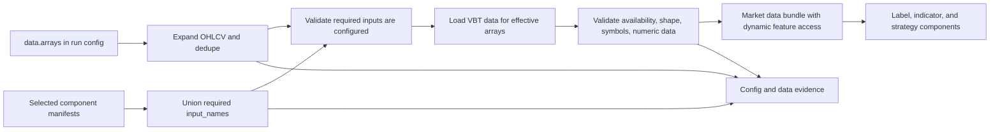

# feat: Add VBT data array contract

## Summary

Implement the VBT-first data array contract by replacing config-level feature mapping with explicit `data.arrays`, validating selected component input requirements against those arrays, loading requested VBT features dynamically, and recording the authored/effective/loaded array sets for review.

---

## Problem Frame

The current market-data path is VBT-native in places, but still centers on fixed OHLCV extraction and the legacy `feature_map` escape hatch. The origin requirements define a forward-first contract where configs name VBT features directly and components declare their required inputs (see origin: `docs/brainstorms/2026-05-19-vbt-data-array-contract-requirements.md`).

---

## Requirements

- R1. Run configs declare expected data arrays using VBT feature names.
- R2. The `OHLCV` shortcut expands to Open, High, Low, Close, and Volume.
- R3. `OHLCV` can be mixed with additional exact VBT feature names.
- R4. The effective configured array set is deterministic, deduplicated, and visible to reviewers and automation.
- R5. Close is not an implicit universal default when configs are required to declare arrays.
- R6. Component manifests declare required input arrays using the same VBT feature names as configs.
- R7. The runner validates every selected component's required arrays against the effective configured array set before component execution.
- R8. Missing configured arrays fail as config/data-contract errors before component execution.
- R9. Component code reads arrays from the runner-provided data object, not from a fixed close-only input or run-config params.
- R10. Data sources expose requested arrays through VBT feature semantics rather than project aliases.
- R11. Run config does not provide generic feature or column mapping; non-standard local data must be normalized before the run or inside source adaptation.
- R12. Loaded data is validated for every configured array required by the run or selected components.
- R13. The component-facing data object supports dynamic array access by VBT feature name while retaining common convenience accessors.
- R14. Missing, empty, mis-shaped, or non-numeric required arrays fail visibly before downstream outputs are produced.
- R15. Metadata or artifacts record the authored array declaration and effective expanded array set.
- R16. Reviewers can compare configured arrays, component-required arrays, and loaded arrays without inspecting component code.
- R17. Removing old feature-map behavior is a forward contract change, not a compatibility shim.

**Origin actors:** A1 Experiment author, A2 Component author, A3 Experiment runner, A4 Run reviewer or automation agent, A5 Provider or data-source maintainer

**Origin flows:** F1 Configure a run's data arrays, F2 Validate selected components against data arrays, F3 Load provider data for requested arrays

**Origin acceptance examples:** AE1 OHLCV expansion evidence, AE2 OHLCV plus extra VBT feature, AE3 component/config mismatch preflight, AE4 feature-map rejection, AE5 loaded-array validation failure, AE6 reviewable array evidence

---

## Scope Boundaries

- No config-level feature-map or generic column-renaming DSL.
- No provider-specific alias language in run configs.
- No implicit inference of all required arrays solely from selected components.
- No per-component params in run config.
- No backward-compatibility shim for configs that rely on `data.feature_map`.
- No support for arbitrary local CSV column names unless the input already exposes VBT feature names or is normalized before ingestion.

### Deferred to Follow-Up Work

- Notebook playbook input declarations: current playbooks are self-contained evidence producers; extending playbook metadata with data-array requirements should be a separate plan if playbooks start consuming runner-provided market data.
- Provider-specific extra-array cataloging: implementation should support arbitrary VBT feature names, but documenting each provider's extra features can happen after the core contract lands.

---

## Context & Research

### Relevant Code and Patterns

- `research/aegis_research/configuration/schema.py`: owns `DataConfig`, `CONFIG_SCHEMA_VERSION`, and current legacy `feature_map` field.
- `research/aegis_research/configuration/validation.py`: central path-aware validation surface; currently validates `data.feature_map` and rejects unknown config keys through dataclass field sets.
- `research/aegis_research/market_data/loading.py`: loads VBT data, builds available panels, validates required features, and currently limits discovery to OHLCV features.
- `research/aegis_research/market_data/contracts.py`: owns `MarketDataResult`, the partially introduced `MarketDataBundle`, and dynamic `feature(...)` access seam.
- `research/aegis_research/component_registry/manifests.py`: parses component metadata statically without executing component code; indicator manifests already include `input_names`.
- `research/aegis_research/experiments.py` and `research/aegis_research/strategy_runs.py`: train and strategy runners currently compute required features before component input preflight.
- `research/aegis_research/cli_commands/run.py`: builds component-backed label and indicator builders for `aerd run --train`.
- `tests/integration/research/aegis_research/test_market_data_contract.py`, `test_market_data_quality.py`, `test_config_contract.py`, `test_lane_config_contract.py`, `test_indicators.py`, `test_strategy_run.py`, and `test_train_cli.py`: main test surfaces for this contract.

### Institutional Learnings

- `docs/solutions/architecture-patterns/config-contract-security-reproducibility-2026-05-16.md`: config changes must be schema-versioned, path-aware, validated before side effects, and persisted as authored/resolved evidence.
- `docs/solutions/best-practices/forward-first-long-only-signal-contract-2026-05-18.md`: removed config fields should fail loudly rather than linger as compatibility aliases.
- `docs/solutions/best-practices/vectorbt-indicatorfactory-output-shape-contract-2026-05-17.md`: VBT indicator inputs and outputs must preserve aligned index/column shape; shape-changing transforms need a separate contract.
- `docs/solutions/logic-errors/vectorbt-allocation-column-alignment-2026-05-17.md`: asset-shaped inputs must share index and column order, not merely labels.
- `docs/solutions/logic-errors/vectorbt-label-contract-target-lineage-2026-05-17.md`: native VBT semantics and provenance should be preserved until intentional downstream derivation.

### External References

- VectorBT PRO `Data.get` supports feature-oriented retrieval with `feature` / `features` plus `squeeze_features=False` and `squeeze_symbols=False`.
- VectorBT PRO `Data.from_data` supports `vbt.feature_dict(...)`, which aligns with keeping arrays as named VBT features instead of project aliases.

---

## Key Technical Decisions

- Use `data.arrays` as the authored config surface: this matches the origin language and keeps data dependencies visible in the run config.
- Treat `OHLCV` as a mixable shortcut token: this satisfies the common case without hiding the expanded effective array set from artifacts.
- Use exact VBT feature names in component manifests: this removes the lower-case project alias layer and makes manifest/config comparison direct.
- Add input declarations to label and strategy component manifests, not only indicators: otherwise train and strategy components could still depend on undeclared arrays.
- Validate component requirements before component execution and before unnecessary provider use where practical: component/config mismatch is a contract error, not an indicator runtime error.
- Keep the data bundle dynamic-only: component code requests every raw feature through `data.feature("FeatureName")`, including OHLCV features, so non-OHLCV arrays never require new hardcoded fields.

---

## Open Questions

### Resolved During Planning

- Exact authored syntax: configs use `data.arrays`, accepting either the scalar shortcut `OHLCV` or a list of exact VBT feature names and/or the `OHLCV` shortcut token.
- Feature-map behavior: `data.feature_map` is removed and rejected as a forward-first schema change.
- Non-standard CSV columns: local files must expose VBT feature names or be normalized before ingestion; run config will not remap arbitrary columns.

### Deferred to Implementation

- Exact helper names and issue wording: choose names that fit existing modules while preserving path-aware validation and forward-first error behavior.
- Provider-specific missing-feature exceptions: normalize common VBT/provider failure modes during implementation after observing the actual exceptions each source raises.
- Final artifact location for array evidence: prefer existing config/data metadata artifacts, but the exact split can be chosen while touching the artifact writers.

---

## High-Level Technical Design

> *This illustrates the intended approach and is directional guidance for review, not implementation specification. The implementing agent should treat it as context, not code to reproduce.*



Directional contract sketch:

```text
data.arrays: OHLCV
data.arrays: [OHLCV, FundingRate]
data.arrays: [Close, FundingRate, OpenInterest]
```

The effective array set is expanded before validation and is what data loading and artifact evidence consume.

---

## Implementation Units

### U1. Add Explicit Data Array Config

**Goal:** Add `data.arrays`, remove `data.feature_map`, and make the authored/effective data-array contract path-aware and schema-versioned.

**Requirements:** R1, R2, R3, R4, R5, R11, R17; supports F1, AE1, AE4

**Dependencies:** None

**Files:**
- Modify: `research/aegis_research/configuration/schema.py`
- Modify: `research/aegis_research/configuration/builders.py`
- Modify: `research/aegis_research/configuration/validation.py`
- Modify: `research/aegis_research/config.py`
- Modify: `tests/support/research/aegis_research/fixtures/experiments/synthetic_ml_scaffold_fixture.yaml`
- Modify: `tests/support/research/aegis_research/fixtures/experiments/synthetic_purged_fixlb_scaffold_fixture.yaml`
- Test: `tests/integration/research/aegis_research/test_config_contract.py`
- Test: `tests/integration/research/aegis_research/test_lane_config_contract.py`

**Approach:**
- Add an array declaration to the data config contract that accepts exact VBT feature names plus the `OHLCV` shortcut.
- Bump the schema version because `feature_map` is removed and configs now need explicit arrays.
- Implement one canonical expansion/normalization path that preserves authored values separately from the deterministic effective set.
- Reject `data.feature_map` through existing unknown-field/path-aware validation rather than translating it.
- Update scaffold fixtures to declare arrays explicitly.

**Execution note:** Start with failing config-contract tests for `OHLCV` expansion, mixed shortcut expansion, duplicate dedupe, missing arrays, and rejected `feature_map`.

**Patterns to follow:**
- Path-aware `ConfigValidationIssue` aggregation in `research/aegis_research/configuration/validation.py`.
- Forward-first removed-field handling from legacy signal/config tests.

**Test scenarios:**
- Covers AE1. Happy path: `data.arrays: OHLCV` validates and resolves to Open, High, Low, Close, Volume.
- Covers AE2. Happy path: `data.arrays: [OHLCV, FundingRate]` validates and dedupes the effective set.
- Edge case: duplicate feature names and duplicate `OHLCV` tokens resolve deterministically without duplicate evidence rows.
- Error path: missing `data.arrays` fails for run/train lane configs that require the new contract.
- Covers AE4. Error path: `data.feature_map` in a config fails as an unknown/removed field.
- Error path: non-string array values, empty strings, or unknown shortcut tokens fail with paths under `data.arrays`.

**Verification:**
- Resolved configs expose authored arrays and effective arrays.
- No public config API exports the legacy `feature_map` constant or dataclass field.

---

### U2. Load Dynamic VBT Feature Arrays

**Goal:** Make market data loading validate arbitrary requested VBT feature names, not only the hardcoded OHLCV set.

**Requirements:** R10, R11, R12, R13, R14; supports F3, AE2, AE5

**Dependencies:** U1

**Files:**
- Modify: `research/aegis_research/market_data/contracts.py`
- Modify: `research/aegis_research/market_data/loading.py`
- Modify: `research/aegis_research/data.py`
- Test: `tests/integration/research/aegis_research/test_market_data_contract.py`
- Test: `tests/integration/research/aegis_research/test_market_data_quality.py`

**Approach:**
- Replace OHLCV-only panel discovery with requested-array discovery using VBT feature access.
- Preserve common convenience accessors on the bundle, but make dynamic feature retrieval work for every loaded requested array.
- Treat CSV/local ingestion as VBT-name-first: standard VBT feature names succeed; non-standard local column names fail unless normalized before ingestion.
- Keep existing quality checks for emptiness, missing symbols, missing values, non-numeric data, and shape alignment, but apply them to the effective configured array set.
- Record loaded feature names in metadata distinctly from authored/effective config arrays.

**Execution note:** Characterize current OHLCV behavior before removing `feature_map` paths so equivalent VBT-name inputs remain covered.

**Patterns to follow:**
- Current `Data.get(feature=..., squeeze_features=False, squeeze_symbols=False)` access in `research/aegis_research/market_data/loading.py`.
- Existing `_evaluate_quality` required-feature checks.

**Test scenarios:**
- Happy path: synthetic data with `OHLCV` effective arrays loads and validates all five arrays.
- Covers AE2. Happy path: a mocked VBT/provider-shaped source exposing `FundingRate` loads that array and returns it through dynamic bundle access.
- Covers AE5. Error path: configured `FundingRate` is absent from native data and the run is rejected as a data-quality failure.
- Covers AE5. Error path: a configured array exists but contains missing, empty, non-numeric, or misaligned symbol data and the quality result is rejected.
- Covers AE4. Error path: CSV with non-VBT column names and no prior normalization fails instead of using `feature_map`.
- Integration: multi-symbol feature panels preserve timestamp index and symbol columns for every requested array.

**Verification:**
- `MarketDataResult` and `MarketDataBundle` can serve dynamic VBT features by name.
- Public metadata distinguishes requested, loaded, and unavailable arrays.

---

### U3. Promote Component Input Declarations

**Goal:** Make component manifests the source of truth for required data arrays across indicators, labels, and strategies.

**Requirements:** R6, R7, R8, R9, R16; supports F2, AE3, AE6

**Dependencies:** U1

**Files:**
- Modify: `research/aegis_research/component_registry/contracts.py`
- Modify: `research/aegis_research/component_registry/manifests.py`
- Modify: `docs/examples/components/indicator_component_example.py`
- Modify: `docs/examples/components/label_component_example.py`
- Modify: `docs/examples/components/strategy_component_example.py`
- Test: `tests/unit/research/aegis_research/test_component_registry.py`
- Test: `tests/integration/research/aegis_research/test_component_autodiscovery.py`
- Test: `tests/integration/research/aegis_research/test_indicators.py`
- Test: `tests/integration/research/aegis_research/test_strategy_run.py`

**Approach:**
- Require or validate manifest `input_names` for every component family that consumes runner-provided market data.
- Migrate existing manifest examples/tests from lower-case project aliases to exact VBT feature names.
- Keep component callables data-bundle based; do not add config params or fixed close-only inputs.
- Add component-registry tests that prove manifests are discovered statically and input names are available without importing component code.

**Patterns to follow:**
- Existing literal-only manifest parser in `research/aegis_research/component_registry/manifests.py`.
- Current indicator manifest `input_names` parsing and family-specific manifest validation.

**Test scenarios:**
- Happy path: indicator, label, and strategy manifests with exact VBT input names are discovered and frozen into registry definitions.
- Covers AE3. Error path: selected component requires High, Low, Close while config only declares Close; validation fails before component code runs.
- Error path: manifest `input_names` with empty strings or non-string values fails during component discovery.
- Integration: a component that reads a non-OHLCV dynamic array from the bundle succeeds when the config and loaded data provide that array.
- Error path: component code is not imported while validating manifest input metadata.

**Verification:**
- Selected component definitions expose data input requirements uniformly enough for runners to preflight them.

---

### U4. Wire Preflight Into Train And Run Orchestration

**Goal:** Validate configured arrays, component-required arrays, and loaded arrays before executing labels, indicators, strategies, models, or portfolios.

**Requirements:** R4, R7, R8, R12, R14, R15, R16; supports F2, F3, AE3, AE5, AE6

**Dependencies:** U1, U2, U3

**Files:**
- Modify: `research/aegis_research/cli_commands/run.py`
- Modify: `research/aegis_research/experiments.py`
- Modify: `research/aegis_research/strategy_runs.py`
- Modify: `research/aegis_research/provenance/experiment_artifacts.py`
- Modify: `research/aegis_research/provenance/manifest.py`
- Test: `tests/integration/research/aegis_research/test_train_cli.py`
- Test: `tests/integration/research/aegis_research/test_cli.py`
- Test: `tests/integration/research/aegis_research/test_strategy_run.py`
- Test: `tests/integration/research/aegis_research/test_provenance_manifest.py`
- Test: `tests/integration/research/aegis_research/test_vectorbt_artifacts.py`

**Approach:**
- Compute effective configured arrays as part of config resolution or early CLI run setup.
- Resolve selected component definitions before component execution and compare their required inputs to the effective configured array set.
- Feed the effective configured array set into market-data loading rather than deriving required arrays from hardcoded label/signal defaults alone.
- Preserve mandatory pipeline needs such as portfolio execution price requirements by validating them against `data.arrays` instead of silently adding them.
- Record authored arrays, effective arrays, component-required arrays, and loaded arrays in existing config/data evidence surfaces.

**Execution note:** Implement orchestration preflight test-first; these are the contract tests most likely to catch silent data drift.

**Patterns to follow:**
- Existing run lifecycle failure marking in `research/aegis_research/experiments.py` and `research/aegis_research/strategy_runs.py`.
- Existing config and data artifact writers in `research/aegis_research/provenance/experiment_artifacts.py`.

**Test scenarios:**
- Covers AE3. Train lane: label or indicator component requires an undeclared array and CLI exits with a config/data-contract error before component callable execution.
- Covers AE3. Run lane: strategy component requires an undeclared array and the run fails before strategy callable execution.
- Error path: `next_open` portfolio execution requires Open but config arrays omit Open; validation fails before portfolio simulation.
- Covers AE5. Error path: configured array is declared and component-required but missing from loaded data; run records a failed status without producing labels/models/portfolio outputs.
- Covers AE6. Integration: completed run artifacts include authored arrays, expanded arrays, component-required arrays, and loaded arrays.
- Edge case: direct `run_experiment` callers using custom builders still rely on explicit config arrays for data loading and quality validation.

**Verification:**
- No runner hardcodes Close/Open as the entire data dependency without checking the configured array set.
- Review evidence shows enough array data for A4 without reading component source.

---

### U5. Migrate Documentation, Examples, And Legacy Tests

**Goal:** Remove `feature_map` guidance and update public examples to the explicit VBT data-array model.

**Requirements:** R1, R2, R3, R9, R11, R15, R17; supports AE1, AE4, AE6

**Dependencies:** U1, U2, U3, U4

**Files:**
- Modify: `README.md`
- Modify: `docs/vectorbt-scaffold.md`
- Modify: `docs/components.md`
- Modify: `docs/playbooks.md`
- Modify: `docs/examples/scaffold_experiment_walkthrough.ipynb`
- Modify: `docs/examples/model_plugins/sklearn_logistic_plugin.ipynb`
- Modify: `docs/examples/components/indicator_component_example.py`
- Modify: `docs/examples/components/label_component_example.py`
- Modify: `docs/examples/components/strategy_component_example.py`
- Test: `tests/e2e/research/aegis_research/test_model_plugin_example.py`
- Test: `tests/integration/research/aegis_research/test_cli_docs.py`

**Approach:**
- Replace docs that describe `data.feature_map` with explicit `data.arrays` and VBT-name normalization guidance.
- Show `OHLCV` shortcut usage and mixed shortcut-plus-extra-array examples.
- Update component examples to declare exact VBT input names and read data arrays through the bundle.
- Keep playbook docs clear that run-config data arrays apply to runner-provided data; self-contained playbook data access is not expanded by this plan.

**Patterns to follow:**
- Existing docs tests that prevent stale config paths and stale examples from reappearing.
- Current public notebook examples under `docs/examples/`.

**Test scenarios:**
- Happy path: public notebooks execute with `data.arrays` and no `feature_map` references.
- Covers AE1. Documentation check: OHLCV shortcut expansion is documented with the effective array set.
- Covers AE4. Documentation check: docs do not instruct users to use config-level feature mapping for non-standard columns.
- Integration: component examples import and execute with the current component callable contract.
- Error path: docs tests fail if active docs reintroduce `feature_map` as a supported run-config field.

**Verification:**
- Active docs, fixtures, and examples describe one data-array contract consistently.

---

## System-Wide Impact

- **Interaction graph:** Config validation, data loading, component registry metadata, train orchestration, strategy orchestration, and provenance artifacts all participate in the same array contract.
- **Error propagation:** Config/component mismatches should surface as config/data-contract errors; provider missing-feature issues should surface as data-quality failures before downstream artifacts are produced.
- **State lifecycle risks:** Runs currently persist manifests early; failures after preflight should still mark the run failed and redact diagnostics as existing lifecycle code does.
- **API surface parity:** `aerd run`, `aerd run --train`, direct `run_experiment` callers, component examples, and docs must all use the same `data.arrays` semantics.
- **Integration coverage:** Unit tests alone will not prove the contract; CLI and e2e notebook tests are needed to show config, registry, data loading, and artifacts agree.
- **Unchanged invariants:** YAML remains non-executable, components own fixed params, playbooks own sweeps, model plugin params remain separate, and VBT native data remains the source-of-truth market-data object.

---

## Risks & Dependencies

| Risk | Mitigation |
|------|------------|
| Removing `feature_map` breaks existing fixture/docs/tests | Treat as intentional forward-first schema break; update fixtures and assert old field rejection. |
| VBT providers expose extra arrays inconsistently | Implement against generic `Data.get(feature=...)`, add mocked provider tests, and defer provider catalog docs. |
| Component input validation misses labels or strategies | Promote input declarations across all component families that consume runner data. |
| Required pipeline arrays are silently added despite explicit config | Validate pipeline-required arrays against `data.arrays` and fail when omitted. |
| Artifact evidence becomes split across too many files | Prefer existing config/data metadata artifacts and keep the same array terminology everywhere. |

---

## Documentation / Operational Notes

- The older market-data brainstorm and plan mention `feature_map`; this plan supersedes that part of the earlier direction while preserving the VBT-native data result goal.
- Public docs should say local data must already expose VBT feature names or be normalized before ingestion.
- Release/PR notes should call out the config schema break clearly because `feature_map` removal is intentional and not backward-compatible.

---

## Sources & References

- **Origin document:** [docs/brainstorms/2026-05-19-vbt-data-array-contract-requirements.md](../brainstorms/2026-05-19-vbt-data-array-contract-requirements.md)
- Related requirements: [docs/brainstorms/2026-05-16-vectorbt-market-data-contract-requirements.md](../brainstorms/2026-05-16-vectorbt-market-data-contract-requirements.md)
- Related requirements: [docs/brainstorms/2026-05-17-vectorbt-indicator-contract-requirements.md](../brainstorms/2026-05-17-vectorbt-indicator-contract-requirements.md)
- Related plan to supersede in part: [docs/plans/2026-05-16-003-feat-vectorbt-market-data-contract-plan.md](2026-05-16-003-feat-vectorbt-market-data-contract-plan.md)
- Relevant learning: [docs/solutions/architecture-patterns/config-contract-security-reproducibility-2026-05-16.md](../solutions/architecture-patterns/config-contract-security-reproducibility-2026-05-16.md)
- Relevant learning: [docs/solutions/best-practices/forward-first-long-only-signal-contract-2026-05-18.md](../solutions/best-practices/forward-first-long-only-signal-contract-2026-05-18.md)
- Relevant learning: [docs/solutions/best-practices/vectorbt-indicatorfactory-output-shape-contract-2026-05-17.md](../solutions/best-practices/vectorbt-indicatorfactory-output-shape-contract-2026-05-17.md)
- External docs: VectorBT PRO `Data.get` API and `Data.from_data` / `feature_dict` examples.
