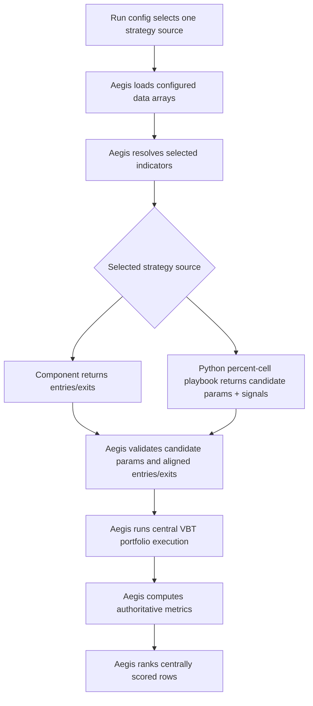

# feat: Centralize Strategy Playbook Execution

## Summary

This plan makes Aegis' existing strategy-run execution boundary the only accepted metric source for ranked run rows. Strategy playbooks will produce centrally executable candidates, while Aegis reuses the same signal validation, VBT portfolio simulation, metric calculation, and leaderboard path already used for promoted strategy components.

---

## Problem Frame

The current branch already centralizes promoted strategy component execution through Aegis, but strategy playbooks and indicator playbooks can still emit precomputed metrics that the run leaderboard ranks directly. That creates mixed-authority results: source identity is visible, but portfolio assumptions and metric computation may differ across rows.

---

## Requirements

- R1. Any row that appears in the Aegis run leaderboard must use Aegis-owned portfolio execution for authoritative metrics and ranking.
- R2. Playbook-computed metrics must not be accepted as authoritative leaderboard metrics for ranked run rows.
- R3. Strategy playbooks and strategy components must share the same portfolio execution assumptions for their ranked rows, even though a run config selects one strategy source.
- R4. Strategy playbooks must provide candidate params and signal outputs sufficient for Aegis to execute and score each ranked candidate centrally.
- R5. Aegis must reject strategy playbook candidates that cannot be centrally executed under the shared strategy-run contract.
- R6. Aegis must reject playbook output that attempts to make playbook-computed metrics the source of ranked results.
- R7. Each ranked playbook candidate must preserve enough params and source identity to reproduce the signal idea and promote a winner into a strategy component without relying on hidden local state.
- R8. Run artifacts must preserve source identity so reviewers can distinguish playbook-backed signal ideas from component-backed signal ideas while trusting the same execution and metric source for both.

**Origin actors:** A1 Researcher, A2 Strategy component author, A3 Strategy run reviewer, A4 Automation agent
**Origin flows:** F1 Ranked strategy playbook candidate, F2 Invalid playbook metric source, F3 Promotion from playbook winner to component
**Origin acceptance examples:** AE1 central execution for ranked playbook rows, AE2 reject playbook-computed metrics, AE3 reject non-executable candidates, AE4 preserve promotion evidence

---

## Scope Boundaries

- Keep the current one-selected-strategy run shape. This plan does not add multi-strategy source selection to one run config, so central execution parity is proven within the selected strategy source rather than by mixed playbook/component rows in one run.
- Do not allow playbook-owned authoritative metrics for rows that appear in the run leaderboard.
- Do not publish mixed-authority leaderboards where some rows are scored by Aegis and others by playbook-local metric code.
- Do not execute `.ipynb` files as registered playbook sources. Registered playbooks are Jupytext-compatible Python percent-cell scripts.
- Do not add automatic promotion from playbook winner to component.
- Do not expand the baseline portfolio execution model; alternate execution models need a separate contract.
- Do not restrict freeform notebook exploration outside `aerd run`; this plan only governs Aegis-ranked run evidence.

### Deferred to Follow-Up Work

- Centrally executable indicator playbook sweeps: Indicator playbook variants currently do not feed the selected strategy through a central combinatorial execution path. This plan should prevent them from contributing playbook-scored leaderboard rows, then leave richer indicator-playbook candidate execution to a separate plan.
- Multi-strategy comparison in one run: Equivalent playbook/component comparison remains possible through shared metric source provenance across equivalent single-source runs, but direct playbook-vs-component strategy comparison in one config requires a future config shape change.

---

## Context & Research

### Relevant Code and Patterns

- `research/aegis_research/strategy_runs.py`: central run-lane orchestration; component strategies already use `validate_strategy_output(...)`, `simulate_portfolio(...)`, and `portfolio_metrics(...)`; playbook strategies currently bypass that path by converting playbook `variant_records` directly into leaderboard records.
- `research/aegis_research/portfolios.py`: owns the current central VBT execution contract through `Portfolio.from_signals`, including shared cash, `entry_budget`, timing, fees, slippage, direction, and diagnostics.
- `research/aegis_research/run_leaderboard.py`: ranks generic `variant_records` by `metrics`; it currently cannot distinguish Aegis-computed metrics from playbook-computed metrics.
- `research/aegis_research/playbook_registry/registry.py`: discovers registered playbooks by stable ID; this plan migrates the registered source format to Python `.py` percent-cell modules that return in-process records.
- `research/aegis_research/component_registry/manifests.py`: strategy components already declare signal outputs and cannot own portfolio behavior.
- `tests/integration/research/aegis_research/test_run_playbook_sources.py`: current playbook fixtures emit precomputed `metrics`; this is the primary behavior to reverse.
- `tests/integration/research/aegis_research/test_strategy_run.py`: existing component strategy tests are the pattern for central signal validation and portfolio execution.

### Institutional Learnings

- `docs/brainstorms/2026-05-18-portfolio-simulation-contract-requirements.md`: baseline v1 portfolio execution is event-style `Portfolio.from_signals`, not target-weight allocation.
- `docs/brainstorms/2026-05-17-signal-generation-conflict-semantics-requirements.md`: entries/exits have explicit long-only signal semantics and timing assumptions that central execution should preserve.
- `docs/solutions/best-practices/vectorbt-weights-from-signals-vs-orders-2026-05-17.md`: target allocation and rebalancing are not part of the `from_signals` contract.
- `docs/solutions/best-practices/forward-first-long-only-signal-contract-2026-05-18.md`: strategy output must not smuggle short-side or reversal behavior through generic entries/exits.
- `docs/solutions/architecture-patterns/config-contract-security-reproducibility-2026-05-16.md`: public artifacts should be portable, manifest-backed evidence; native VBT objects can remain private, but public sidecars must be enough to audit assumptions.

### External References

- Not used. Local project contracts and VectorBT-specific institutional docs are sufficient for this plan.

---

## Key Technical Decisions

- Reuse the component strategy execution seam: Strategy playbook candidates should converge on the same signal validation and `simulate_portfolio(...)` path as components instead of introducing a separate scorer.
- Use Python percent-cell playbooks for registered execution: Keep one `.py` source of truth that can run interactively in Jupytext-compatible tools and can be imported by Aegis as a normal Python callable.
- Fail fast on playbook metric source violations: A strategy playbook candidate that supplies ranked metrics or portfolio outputs should fail the run before leaderboard publication, not become a failure sample in a partial leaderboard.
- Keep selected strategy singular for this plan: The existing config shape is one selected strategy. The plan centralizes playbook execution within that shape and defers multi-strategy comparison to follow-up work.
- Remove direct playbook-scored indicator rows from ranked leaderboards: Until indicator playbook variants can be centrally executed through a selected strategy, they should remain source evidence rather than metric-authoritative leaderboard rows.

---

## Open Questions

### Resolved During Planning

- Should run configs support multiple strategy sources in one leaderboard now? Keep one selected strategy for this plan; multi-strategy comparison is deferred.
- Should invalid playbook metric source fail the whole run or create a partial leaderboard? Fail the run before publishing ranked rows because the issue is contract violation, not an ordinary failed candidate.
- Should playbook-computed strategy metrics be kept as diagnostics? No for ranked strategy rows; metrics have one owner in the run leaderboard path.

### Deferred to Implementation

- Exact Python playbook registry details: Reuse the component callable-loading pattern where possible, while keeping playbook manifests distinct from promoted component manifests.
- Exact helper names and factoring: The component scorer should be extracted only as far as needed to avoid duplicating central execution logic.

---

## High-Level Technical Design

> *This illustrates the intended approach and is directional guidance for review, not implementation specification. The implementing agent should treat it as context, not code to reproduce.*

The important boundary is metric ownership: playbooks and components may differ in how they produce candidates, but they converge before portfolio execution and ranking.

---

## Implementation Units

### U1. Define Ranked Playbook Candidate Validation

**Goal:** Establish the validation boundary for playbook candidates before they can enter central execution.

**Requirements:** R2, R4, R5, R6, R7; F2; AE2, AE3

**Dependencies:** None

**Files:**
- Modify: `research/aegis_research/strategy_runs.py`
- Modify: `research/aegis_research/run_leaderboard.py` to enforce central metric source provenance at the ranking boundary
- Test: `tests/integration/research/aegis_research/test_run_playbook_sources.py`
- Test: `tests/unit/research/aegis_research/test_playbooks.py`

**Approach:**
- Add a strategy-playbook candidate validation path separate from the generic `_playbook_variant_records(...)` passthrough.
- Require each ranked candidate to provide stable candidate identity, params, entries, and exits sufficient for central execution.
- Reject candidate fields that would make the playbook the metric or portfolio authority, including ranked metrics and portfolio/execution outputs.
- Treat missing params, missing signals, forbidden playbook metric fields, and empty candidate sets as contract failures before publishing a leaderboard.

**Execution note:** Start with failing integration tests that reflect the current undesired behavior: playbook `metrics` are accepted and ranked.

**Patterns to follow:**
- `validate_strategy_output(...)` in `strategy_runs.py` for signal-output boundary behavior.
- `STRATEGY_OUTPUT_FORBIDDEN_KEYS` in `strategy_runs.py` for explicit forbidden strategy output fields.
- `ComponentRegistryError` / `PlaybookRegistryError` style fail-fast contract messages.

**Test scenarios:**
- Covers AE2. Error path: a strategy playbook candidate includes a `metrics` mapping; the run fails before writing a leaderboard row.
- Covers AE3. Error path: a strategy playbook candidate omits params; the run fails with a playbook output contract error.
- Covers AE3. Error path: a strategy playbook emits zero executable candidates; the run fails visibly instead of producing an empty success leaderboard.
- Error path: a candidate includes portfolio/execution ownership fields such as portfolio, sizing, costs, or execution timing; validation rejects it.
- Edge case: duplicate candidate IDs inside one playbook are rejected so promotion evidence remains unambiguous.

**Verification:**
- Playbook-computed metrics can no longer affect sort order or appear as authoritative metric input to `build_run_leaderboard(...)`.
- Invalid playbook candidate output produces a failed run, not a mixed-authority partial leaderboard.

### U2. Add Python Percent-Cell Playbook Sources

**Goal:** Make registered playbooks executable as reviewable Python `.py` percent-cell sources. Strategy playbooks receive `StrategyInputs` and return candidate params plus entries/exits directly.

**Requirements:** R4, R5, R7; F1, F3; AE1, AE3, AE4

**Dependencies:** U1

**Files:**
- Modify: `research/aegis_research/playbook_registry/registry.py`
- Modify: `research/aegis_research/playbook_registry/contracts.py` to describe Python strategy playbook definitions if needed
- Modify: `research/aegis_research/strategy_runs.py`
- Test: `tests/unit/research/aegis_research/test_playbooks.py`
- Test: `tests/integration/research/aegis_research/test_run_playbook_sources.py`

**Approach:**
- Discover registered playbooks from Python `.py` files with `# %%` percent cells and `PLAYBOOK_MANIFEST`, not from `.ipynb` execution.
- Reuse the existing strategy-run input context semantics used by component strategies: current market data, selected indicator outputs, and source metadata should mean the same thing for playbook-backed signal generation.
- Load a strategy playbook callable with a pattern close to `load_component_callable(...)`, then call it with `StrategyInputs`.
- Require the callable to return candidate records containing stable candidate identity, params, entries, and exits.
- Pass returned entries/exits through the same validation path as component strategy outputs.
- Require signal frames to align with the market data `Close` panel's timestamps and symbols before portfolio simulation.

**Patterns to follow:**
- `load_component_callable(...)` is the import-and-call pattern to mirror without turning playbooks into promoted components.
- `StrategyInputs` is the in-process component pattern to reuse for strategy playbooks.
- `market_data_bundle(...).feature("Close")` is the source of the authoritative market index and symbol shape.
- Existing artifact portability checks in provenance code should guide any persisted playbook source evidence.

**Test scenarios:**
- Covers AE1. Happy path: a Python percent-cell strategy playbook returns one candidate with params and signals; Aegis validates alignment, executes centrally, and ranks the candidate.
- Covers AE3. Error path: entries are missing; Aegis rejects the candidate before portfolio execution.
- Covers AE3. Error path: exits have different timestamps than `Close`; Aegis rejects the candidate before portfolio execution.
- Edge case: signal outputs contain non-boolean or null states; Aegis rejects or normalizes only according to the same strategy signal boundary used for components.

**Verification:**
- Strategy playbooks can produce centrally executable candidates without notebook JSON output or file-backed signal transport.
- Signal validation failures are reported as playbook output contract failures, not as obscure VBT portfolio errors.

### U3. Reuse Central Portfolio Scoring for Strategy Playbooks

**Goal:** Route valid strategy playbook candidates through the same VBT portfolio execution and metric computation path as strategy components.

**Requirements:** R1, R3, R4, R8; F1; AE1, AE4

**Dependencies:** U1, U2

**Files:**
- Modify: `research/aegis_research/strategy_runs.py`
- Modify: `research/aegis_research/portfolios.py` only if existing diagnostics need a source-neutral hook
- Modify: `research/aegis_research/reports.py` only if metric evidence needs a source-neutral extension
- Test: `tests/integration/research/aegis_research/test_run_playbook_sources.py`
- Test: `tests/integration/research/aegis_research/test_strategy_run.py`

**Approach:**
- Extract the existing component strategy scoring path into a source-neutral scorer that accepts validated signals plus source metadata.
- Use the scorer for both component strategies and strategy playbook candidates.
- Preserve playbook source identity, source hash, version, candidate ID, and params while replacing playbook-owned metrics with Aegis-computed metrics.
- Keep signal diagnostics and portfolio diagnostics shaped consistently across component and playbook strategy sources.

**Patterns to follow:**
- Current component branch in `_resolve_strategy_ref(...)`: `validate_strategy_output(...)` → `simulate_portfolio(...)` → `portfolio_metrics(...)` → leaderboard record.
- `portfolio_metrics(...)` as the only source for ranked metrics.
- `data_array_evidence_payload(...)` for preserving source-neutral evidence alongside run artifacts.

**Test scenarios:**
- Covers AE1. Happy path: a strategy playbook candidate and an equivalent component strategy candidate produce identical signals under equivalent single-source configs; their central metrics match within deterministic tolerance.
- Covers AE4. Happy path: a winning playbook row preserves source kind, playbook ID, source hash, candidate ID, params, portfolio assumptions, and central metric values.
- Integration: next-open execution requires `Open` and uses the same central timing diagnostics for playbook and component strategy candidates.
- Integration: component strategy runs continue to pass without behavior change after scorer extraction.

**Verification:**
- The only path that creates ranked strategy metrics is the Aegis central scorer.
- Strategy playbook rows and component strategy rows share portfolio diagnostics structure and ranking semantics.

### U4. Remove Playbook-Scored Rows from Run Leaderboards

**Goal:** Prevent any playbook `variant_records` with playbook-computed metrics from entering the ranked run leaderboard.

**Requirements:** R1, R2, R6, R8; F2; AE2

**Dependencies:** U1

**Files:**
- Modify: `research/aegis_research/strategy_runs.py`
- Modify: `research/aegis_research/run_leaderboard.py` to require explicit central metric source markers
- Modify: `docs/playbooks.md`
- Test: `tests/integration/research/aegis_research/test_run_playbook_sources.py`
- Test: `tests/unit/research/aegis_research/test_run_leaderboard.py` if leaderboard authority checks move into the leaderboard builder

**Approach:**
- Stop merging indicator playbook metric records directly into the strategy run leaderboard unless those records have gone through central execution.
- Preserve indicator playbook source evidence in run artifacts, but do not treat playbook-emitted metric rows as comparable ranked rows.
- Require a lightweight authority marker on centrally scored records so `build_run_leaderboard(...)` rejects records whose metric source is missing or not Aegis.

**Patterns to follow:**
- Existing leaderboard failure handling for excluded rows, while recognizing that metric source violations should fail before publication.
- `docs/playbooks.md` distinction between playbook exploration and Aegis-ranked run evidence.

**Test scenarios:**
- Error path: an indicator playbook emits precomputed metrics for leaderboard-bound variant records; the run fails visibly instead of publishing a successful leaderboard with omitted rows.
- Error path: a generic playbook row reaches `build_run_leaderboard(...)` without central metric source; the row is rejected rather than sorted.
- Happy path: component indicator evidence remains present in artifacts while strategy scoring still uses central metrics.
- Regression: baseline-delta ranking does not use playbook-computed baseline metrics; any baseline metric used for ranking must be centrally computed or unsupported for now.

**Verification:**
- There is no run path where playbook-provided `metrics` are accepted as leaderboard ranking input.
- Existing source identity remains visible even when playbook metric rows are no longer leaderboard-authoritative.

### U5. Update Docs and Playbook Examples for Candidate-First Strategy Playbooks

**Goal:** Align public guidance and examples with the one-source-of-truth execution contract.

**Requirements:** R4, R7, R8; F1, F3; AE4

**Dependencies:** U1, U2, U3, U4

**Files:**
- Modify: `docs/playbooks.md`
- Modify: `docs/vectorbt-scaffold.md`
- Modify: `docs/examples/playbooks/strategy_playbook_example.py`
- Modify: `docs/examples/playbooks/indicator_playbook_example.py` if indicator playbook leaderboard semantics change
- Modify: `docs/brainstorms/2026-05-18-research-playbook-component-workflow-requirements.md` only if an explicit superseding note is needed
- Test: `tests/integration/research/aegis_research/test_cli_docs.py`

**Approach:**
- Document that playbooks may compute exploratory metrics locally, but Aegis-ranked rows must provide candidates for central execution.
- Show strategy playbook examples as Python `.py` percent-cell scripts producing candidate params and signals rather than ranked metrics.
- Clarify that promotion uses the winning candidate's params and source evidence, while execution semantics remain Aegis-owned after promotion.
- Update docs that describe indicator playbook baseline metrics so they do not imply playbook-computed metrics are ranking authority.

**Patterns to follow:**
- Existing docs language that configs own fees, slippage, sizing, direction, and timing.
- Existing component strategy example that returns only signals.

**Test scenarios:**
- Docs contract: examples no longer show strategy playbook `metrics` as authoritative output.
- Docs contract: docs state that ranked playbook rows are centrally executed and scored by Aegis.
- Python percent-cell example smoke: the strategy playbook example uses the new candidate-first output shape.

**Verification:**
- A reader can tell that playbooks and components differ in source form, not in portfolio metric source.
- Docs no longer teach playbook-scored leaderboard rows as the strategy playbook pattern.

---

## System-Wide Impact

- **Interaction graph:** `run` CLI → playbook registry → strategy run orchestration → portfolio simulation → report metrics → leaderboard. The plan changes the playbook branch so it converges with the component branch before portfolio execution.
- **Error propagation:** Invalid playbook metric source or non-executable signals should fail the run after manifest creation but before writing a success leaderboard. Config-level playbook ID errors remain config validation failures.
- **State lifecycle risks:** Python playbook modules must not depend on interactive-local state or hidden side effects; ranked candidates must be returned from the selected callable.
- **API surface parity:** Component strategy execution remains signal-only. Strategy playbook execution becomes candidate-and-signal-only for ranked rows.
- **Integration coverage:** Unit tests alone will not prove the strategy playbook import path. Integration tests must execute a real Python percent-cell playbook and verify central portfolio metrics.
- **Unchanged invariants:** Configs still select stable IDs, not arbitrary source paths. Portfolio assumptions remain config-owned. The plan does not change the current single selected strategy shape.

---

## Risks & Dependencies

| Risk | Mitigation |
|------|------------|
| Playbook files need to remain pleasant for exploration without becoming notebooks. | Use Python `# %%` percent cells and document Jupytext-compatible editor workflows. |
| Removing indicator playbook metric rows reduces current leaderboard behavior. | Preserve source evidence and document that centrally executable indicator-playbook combinations need a follow-up contract. |
| Central scorer extraction could accidentally change component strategy behavior. | Add regression tests around existing component strategy execution and compare equivalent playbook/component signal outputs. |
| Playbook validation errors may be hard for researchers to repair. | Classify failures by missing params, forbidden metrics, missing signals, and alignment so CLI diagnostics are actionable. |
| Baseline-delta ranking currently assumes metric records can come from playbooks. | Require central metric source provenance for baseline values as well, and disable playbook-computed baseline ranking values until baselines can be centrally recomputed. |

---

## Documentation / Operational Notes

- Update playbook docs and examples in the same PR as runtime behavior so researchers do not copy the old playbook-computed `metrics` pattern.
- The PR description should call out the behavior break: ranked playbook output must be centrally executable and may no longer supply authoritative metrics.
- No production rollout is needed; this is a research CLI/scaffold contract change.

---

## Sources & References

- **Origin document:** [docs/brainstorms/2026-05-20-strategy-playbook-central-execution-requirements.md](../brainstorms/2026-05-20-strategy-playbook-central-execution-requirements.md)
- Related requirements: [docs/brainstorms/2026-05-18-research-playbook-component-workflow-requirements.md](../brainstorms/2026-05-18-research-playbook-component-workflow-requirements.md)
- Related requirements: [docs/brainstorms/2026-05-18-portfolio-simulation-contract-requirements.md](../brainstorms/2026-05-18-portfolio-simulation-contract-requirements.md)
- Related requirements: [docs/brainstorms/2026-05-17-signal-generation-conflict-semantics-requirements.md](../brainstorms/2026-05-17-signal-generation-conflict-semantics-requirements.md)
- Related code: `research/aegis_research/strategy_runs.py`
- Related code: `research/aegis_research/portfolios.py`
- Related code: `research/aegis_research/run_leaderboard.py`
- Related code: `research/aegis_research/playbook_registry/registry.py`
- Related tests: `tests/integration/research/aegis_research/test_run_playbook_sources.py`
- Related tests: `tests/integration/research/aegis_research/test_strategy_run.py`
