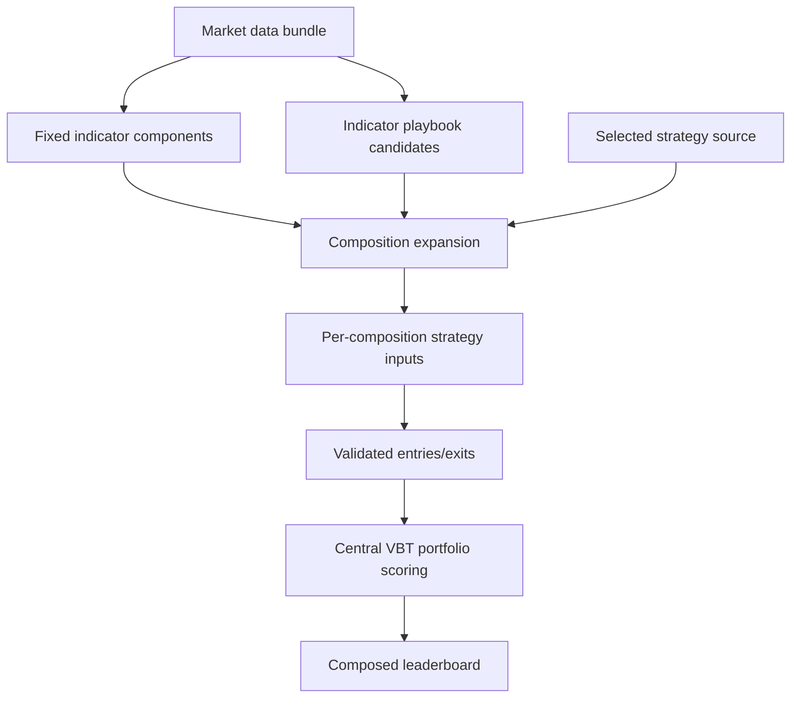

# feat: Compose Indicator and Strategy Candidates

## Summary

Implement composed candidate execution for `aerd run`: indicator playbook variants become strategy-consumable indicator outputs, strategy sources emit entries/exits for each composition, and Aegis centrally scores complete strategy candidates through the existing VBT portfolio path.

---

## Problem Frame

Current run execution can centrally rank strategy playbook candidates, but indicator playbook variants remain evidence-only and cannot participate in leaderboard ranking without blurring indicator and strategy ownership. This plan adds an explicit composition boundary so indicator sweeps are rankable only as part of full strategy candidates.

---

## Requirements

- R1. A ranked run row must represent a complete composed strategy candidate, not a raw indicator candidate.
- R2. Indicator playbook variants may sweep indicator logic and parameters, but they become rankable only when consumed by a strategy source that emits executable entries/exits.
- R3. Strategy playbook variants may sweep trade-rule parameters, but they must still be centrally executed by Aegis before ranking.
- R4. When both indicator and strategy sources have variants, Aegis must make the composition semantics explicit rather than silently treating one axis as authoritative or ignored.
- R5. A composed leaderboard must rank full candidate combinations using Aegis-owned VBT portfolio metrics.
- R6. Indicator sources own indicator outputs and indicator params; strategy sources own the trading rule that consumes raw data and indicator outputs to produce entries/exits.
- R7. Components remain fixed promoted implementations. Indicator components and strategy components must not emit parameter sweeps or candidate grids.
- R8. The winning row must preserve both strategy identity/params and consumed indicator identity/params so reviewers can reproduce or promote the result without calling an indicator “best” outside its strategy context.
- R9. Run artifacts must keep enough provenance to answer which indicator candidate and which strategy candidate produced each ranked metric.
- R10. Promotion from a composed winner should support separate manual promotion of indicator logic and strategy logic into fixed components.
- R11. Candidate expansion must be visible enough that researchers and automation can see when a run is about to evaluate a large matrix of combinations.

**Origin actors:** A1 Researcher, A2 Component author, A3 Strategy run reviewer, A4 Automation agent
**Origin flows:** F1 Indicator sweep through fixed strategy, F2 Indicator sweep through strategy sweep, F3 Winner promotion
**Origin acceptance examples:** AE1 indicator sweep through fixed strategy, AE2 strategy sweep through fixed indicators, AE3 cross-product composition, AE4 reject component sweeps, AE5 promotion data, AE6 candidate count visibility

---

## Scope Boundaries

- No raw indicator leaderboard metrics as authoritative strategy performance.
- No claim that an indicator candidate is globally best independent of the strategy that consumed it.
- No component sweeps; components are fixed promoted implementations.
- No playbook-owned authoritative portfolio metrics for ranked rows.
- No automatic promotion from a composed winner into component files; promotion remains a manual follow-up using artifact evidence.
- No expansion of the baseline portfolio execution model; alternate portfolio contracts require a separate requirements document.
- No requirement to support every possible VectorBT optimization mode in this implementation; this plan defines candidate semantics and a safe central execution path.

### Deferred to Follow-Up Work

- Alternative composition modes such as zipped candidate matching or named joins: start with explicit Cartesian expansion across selected playbook candidate axes.
- Candidate-count enforcement and user-configurable matrix execution limits: v1 makes expansion counts visible; hard limits and config knobs are deferred until usage proves the need.
- Advanced VBT memory/performance strategies: defer new chunking or optimization behavior until real matrix sizes require them.

---

## Context & Research

### Relevant Code and Patterns

- `research/aegis_research/strategy_runs.py` owns `run_strategy_sweep`, indicator/source resolution, `StrategyInputs`, strategy validation, and central scoring through `_score_strategy_signals`.
- `research/aegis_research/strategy_runs.py` currently validates strategy playbook `variant_records` with params, entries, and exits, then routes them through central portfolio scoring.
- `research/aegis_research/strategy_runs.py` currently calls indicator playbooks and rejects metrics, but does not materialize their variants into strategy-consumable outputs.
- `research/aegis_research/indicators.py` has `IndicatorResult` and fixed component indicator lineage/shape handling; component indicator sweeps are rejected.
- `research/aegis_research/run_leaderboard.py` enforces central metric source provenance and keeps only top leaderboard rows.
- `research/aegis_research/playbook_registry/registry.py` discovers Python percent-cell playbooks with stable IDs and literal manifests.
- `tests/integration/research/aegis_research/test_strategy_run.py` covers component indicators feeding strategies and central strategy execution.
- `tests/integration/research/aegis_research/test_run_playbook_sources.py` covers playbook execution, strategy playbook metrics rejection, and failed playbook run manifests.
- `tests/unit/research/aegis_research/test_run_leaderboard.py` covers leaderboard metric source boundaries.

### Institutional Learnings

- `docs/solutions/best-practices/vectorbt-run-combs-to-combine-params-2026-05-17.md`: build explicit inspectable parameter grids instead of hidden combination behavior.
- `docs/solutions/best-practices/vectorbt-combine-params-conditions-levels-2026-05-17.md`: parameter combinations should preserve meaningful levels and conditions.
- `docs/solutions/best-practices/vectorbt-indicatorfactory-output-shape-contract-2026-05-17.md`: indicator outputs should stay bar-aligned with input index and symbol shape.
- `docs/solutions/best-practices/forward-first-long-only-signal-contract-2026-05-18.md`: strategies should emit explicit long-only entries/exits and reject unsupported fields.
- `docs/solutions/best-practices/vectorbt-execution-timing-nextopen-2026-05-17.md`: execution timing affects comparability and must remain central.
- `docs/solutions/logic-errors/vectorbt-allocation-column-alignment-2026-05-17.md`: asset-shaped inputs must be aligned before simulation.
- `docs/solutions/performance-issues/vectorbt-large-from-signals-chunking-memory-2026-05-17.md`: large `Portfolio.from_signals` matrices need visible limits and memory-aware execution.

### External References

- VectorBT PRO Discord examples found via VectorBT MCP show users optimizing full backtest candidates by sweeping indicator params, strategy thresholds, and stops, then ranking portfolio stats. This supports Aegis ranking composed candidates rather than raw indicator outputs.

---

## Key Technical Decisions

- Composition mode: Use Cartesian expansion across selected indicator playbook candidate axes in v1. For strategy playbooks, materialize strategy candidates per indicator-composition context rather than pretending there is one global strategy axis known up front.
- Ranking boundary: Keep `build_run_leaderboard(...)` ranking only centrally scored Aegis metric records. Indicator playbook candidate records never enter the leaderboard directly.
- Candidate identity: Represent composed identity with separate strategy candidate evidence and indicator candidate evidence, not one flattened params map. This avoids collisions like `window` or `threshold` across sources.
- Failure model: Treat invalid composed candidates as run contract failures for v1. Partial leaderboards would make provenance and promotion evidence ambiguous.
- Expansion visibility: Record planned indicator-axis counts before strategy invocation, then record actual per-context strategy candidate counts and total composed candidates before leaderboard interpretation. Do not add new YAML knobs or hard matrix limits in v1.
- Indicator output contract: Indicator playbook candidates must produce aligned named outputs exposed through source-scoped strategy inputs, not flattened global names.
- Strategy playbook composition: Invoke strategy playbooks once per indicator-composition context so returned entries/exits reflect the selected indicator candidate outputs.
- Indicator consumption evidence: Selected indicator playbook axes must be consumed by the selected strategy source through an explicit dependency/consumption contract; otherwise the run must fail rather than attaching unused indicator params to scored rows.
- Composed identity: Use one canonical composed candidate ID, built from the strategy source/candidate plus the ordered indicator source/candidate refs, as the primary key for leaderboard rows, diagnostics, and artifacts.

---

## Open Questions

### Resolved During Planning

- Should indicator and strategy playbook axes be crossed or zipped? Use Cartesian expansion first; zipped or named-join semantics are deferred until a concrete use case exists.
- Should one invalid composed candidate fail the whole run? Yes for v1; this preserves fail-fast contract semantics and avoids mixed-quality leaderboards.
- Should candidate-count limits be config-owned now? No; v1 records expanded counts and defers hard limits or user-configurable limits.

### Deferred to Implementation

- Exact helper names and factoring: choose during implementation while keeping composition logic readable and source-neutral.
- Exact candidate-count ceiling: deferred until a follow-up introduces hard matrix limits.
- Exact artifact field names: decide while preserving the requirement that strategy and indicator candidate provenance stay separate and readable.

---

## High-Level Technical Design

> *This illustrates the intended approach and is directional guidance for review, not implementation specification. The implementing agent should treat it as context, not code to reproduce.*



Candidate shape at the planning level:

```text
indicator candidate = indicator source identity + candidate id + params + aligned named outputs
strategy candidate = strategy source identity + candidate id + params + entries/exits
composed candidate = strategy candidate + selected indicator candidates + central metrics
```

Strategy input shape at the planning level:

```text
inputs.indicators = {
  "component:<source-id>": <fixed component indicator output>,
  "playbook:<source-id>": {
    "candidate_id": "<indicator-candidate-id>",
    "params": {...},
    "outputs": {
      "<output-name>": <bar-aligned Series/DataFrame>
    }
  }
}
```

The exact Python wrapper can be chosen during implementation, but the behavior is part of the contract: playbook indicator outputs are source-scoped, candidate metadata stays attached to the selected source, and strategies do not read playbook outputs from one flattened global indicator namespace.

Canonical composed identity at the planning level:

```text
composed_candidate_id =
  strategy:<strategy-source-kind>:<strategy-source-id>:<strategy-candidate-id>
  + indicators:[
      <indicator-source-kind>:<indicator-source-id>:<indicator-candidate-id>,
      ...
    ]
```

Raw candidate IDs only need to be unique within their source/context. Leaderboard rows, signal diagnostics, portfolio diagnostics, and strategy artifacts should use the canonical composed ID when they need a primary key.

---

## Implementation Units

### U1. Define Composed Candidate Contracts

**Goal:** Establish source-neutral contracts for indicator candidates, strategy candidates, and composed candidate identity before changing execution flow.

**Requirements:** R1, R2, R3, R4, R6, R8, R9; F1, F2, F3; AE1, AE2, AE3, AE5

**Dependencies:** None

**Files:**
- Modify: `research/aegis_research/strategy_runs.py`
- Modify: `research/aegis_research/playbook_registry/contracts.py` only if existing contracts need clearer exported types
- Test: `tests/integration/research/aegis_research/test_run_playbook_sources.py`
- Test: `tests/integration/research/aegis_research/test_strategy_run.py`

**Approach:**
- Introduce planning-level concepts in code for fixed indicator evidence, indicator playbook candidates, strategy candidates, and composed candidates.
- Prefer extending existing strategy-run record validation and evidence shapes before introducing new exported contract types. Any new type or helper should remove duplicated validation logic or have multiple immediate consumers.
- Keep strategy params and indicator params separate in candidate records and diagnostics.
- Require every playbook candidate that participates in composition to carry a stable, non-empty candidate identity and a present mapping-shaped `params` field. Allow `{}` for named logic variants that have no tunable parameters.
- Reject metric and portfolio authority fields on any playbook candidate before composition.

**Execution note:** Start test-first with validation cases for missing params, duplicate candidate IDs, and forbidden metrics before adding happy-path composition.

**Patterns to follow:**
- `_strategy_playbook_candidate_records(...)` for fail-fast playbook output validation.
- `ComponentDefinition.identity` and existing source evidence rows for source hash/version provenance.
- `METRIC_SOURCE_CENTRAL_PORTFOLIO` and `_assert_central_metric_source(...)` for the central metric source boundary.

**Test scenarios:**
- Error path: an indicator playbook candidate missing `params` fails before strategy execution.
- Edge case: an indicator playbook candidate with `params: {}` and a stable candidate ID remains valid.
- Error path: an indicator playbook candidate includes `metrics` or portfolio fields and is rejected.
- Error path: duplicate indicator candidate IDs inside one playbook fail with source context.
- Edge case: strategy candidate params and indicator candidate params share the same key name; composed identity preserves both without flattening collisions.

**Verification:**
- Implementers can represent a composed candidate without losing either strategy or indicator candidate provenance.
- No raw indicator candidate can pass as a ranked leaderboard record.

### U2. Materialize Indicator Playbook Candidates

**Goal:** Make indicator playbook variants produce aligned outputs that strategies can consume, instead of preserving only parameter evidence.

**Requirements:** R2, R6, R7, R8, R9; F1, F2; AE1, AE3, AE4

**Dependencies:** U1

**Files:**
- Modify: `research/aegis_research/strategy_runs.py`
- Modify: `research/aegis_research/indicators.py` only if shared output-normalization helpers are needed
- Test: `tests/integration/research/aegis_research/test_run_playbook_sources.py`
- Test: `tests/integration/research/aegis_research/test_strategy_run.py`
- Test: `tests/unit/research/aegis_research/test_playbooks.py`

**Approach:**
- Extend indicator playbook handling so each variant returns strategy-consumable named indicator outputs in addition to params.
- Normalize candidate outputs to the same bar-aligned timestamp/symbol expectations used for component indicator outputs.
- Expose indicator candidates to strategies through source-scoped indicator keys rather than flattening candidate outputs into the global indicator map.
- Reject duplicate effective indicator keys before strategy execution unless source identity already disambiguates them.
- Preserve fixed indicator components as always-present inputs, then layer one selected candidate from each selected indicator playbook axis per composed candidate.
- Keep indicator family metadata and optional baseline IDs as provenance, not metric source evidence.

**Execution note:** Add characterization coverage showing current indicator playbook variants are evidence-only before changing them into materialized candidates.

**Patterns to follow:**
- `_validate_indicator_output(...)` for shape and alignment checks.
- `IndicatorResult` for rich indicator output and lineage patterns.
- Component indicator fixture style in `tests/integration/research/aegis_research/test_strategy_run.py`.

**Test scenarios:**
- Covers AE1. Happy path: an MA indicator playbook emits two candidate outputs and a fixed strategy component produces two centrally scored rows.
- Error path: an indicator candidate output has missing timestamps and fails before strategy execution.
- Error path: an indicator candidate output has symbols that do not match `Close` and fails with source/candidate context.
- Edge case: fixed component indicators and playbook indicator candidates are both present; strategy receives both and provenance distinguishes them.
- Edge case: two selected indicator sources emit the same output name; strategy inputs remain source-scoped or the run rejects the ambiguity before execution.
- Error path: a selected indicator playbook axis is not consumed by the selected strategy source; the run fails rather than publishing repeated rows with unused indicator provenance.
- Error path: indicator component attempts to emit multiple parameter sets and remains rejected as a component sweep.

**Verification:**
- Indicator playbook candidates can feed strategy execution only after producing aligned outputs.
- Indicator playbook metrics remain rejected and cannot influence leaderboard ranking.

### U3. Add Explicit Composition Expansion

**Goal:** Build the composed candidate matrix from fixed indicators, indicator playbook candidate axes, and the selected strategy source.

**Requirements:** R1, R2, R3, R4, R5, R11; F1, F2; AE1, AE2, AE3, AE6

**Dependencies:** U1, U2

**Files:**
- Modify: `research/aegis_research/strategy_runs.py`
- Modify: `research/aegis_research/provenance/run_store.py` only if run-level candidate-count evidence needs manifest support
- Test: `tests/integration/research/aegis_research/test_run_playbook_sources.py`
- Test: `tests/integration/research/aegis_research/test_strategy_run.py`

**Approach:**
- Expand selected indicator playbook candidates with Cartesian semantics across playbook axes.
- Build a per-composition `StrategyInputs` instance containing fixed indicators plus the selected indicator candidates for that row.
- Add two-stage expansion diagnostics: planned indicator-axis counts before strategy invocation, then actual per-context strategy candidate counts and total composed candidate counts before leaderboard interpretation.
- Persist planned indicator expansion diagnostics before strategy execution so matrix size remains visible even when later validation fails; persist final composed counts after strategy candidates are emitted.
- Fail fast when a selected playbook axis is empty.

**Technical design:** *(directional only)*

```text
fixed indicators = component outputs
indicator axes = [playbook A candidates] x [playbook B candidates] x ...
indicator contexts = one selected candidate from each indicator axis
strategy candidates = produced by the selected strategy source for each indicator context
composed candidates = indicator context + per-context strategy candidate
```

**Patterns to follow:**
- Existing `expanded_ids(...)` source-ref expansion for `ids: all` and explicit IDs.
- `build_run_leaderboard(...)` summary shape for attempted/succeeded/failed counters.
- `docs/solutions/performance-issues/vectorbt-large-from-signals-chunking-memory-2026-05-17.md` for matrix-size risk.

**Test scenarios:**
- Covers AE3. Happy path: two indicator candidates crossed with three strategy candidates produces six attempted composed candidates after strategy candidates are emitted for each indicator context.
- Covers AE6. Happy path: expansion diagnostics record planned indicator-axis counts, per-context strategy candidate counts, and final attempted composed candidates.
- Edge case: multiple indicator playbooks produce a Cartesian product with stable composed candidate identities.
- Edge case: a strategy playbook emits different candidate counts for different indicator contexts; diagnostics preserve per-context counts and final totals.
- Error path: a selected indicator playbook axis returns zero candidates and fails visibly before leaderboard publication.
- Regression: a run with no indicator playbook axis, using fixed indicators or no indicator outputs as currently supported, still executes normally.

**Verification:**
- Composition semantics are visible in artifacts and test expectations.
- No selected playbook axis is silently ignored.

### U4. Route Composed Candidates Through Central Strategy Scoring

**Goal:** Reuse the existing central VBT scoring boundary for fixed strategy components, strategy playbook candidates, and composed indicator/strategy candidate matrices.

**Requirements:** R1, R3, R5, R6, R8, R9; F1, F2, F3; AE1, AE2, AE3, AE5

**Dependencies:** U1, U2, U3

**Files:**
- Modify: `research/aegis_research/strategy_runs.py`
- Modify: `research/aegis_research/run_leaderboard.py` only if row summarization needs composed provenance fields
- Test: `tests/integration/research/aegis_research/test_strategy_run.py`
- Test: `tests/integration/research/aegis_research/test_run_playbook_sources.py`
- Test: `tests/unit/research/aegis_research/test_run_leaderboard.py`

**Approach:**
- Adapt strategy component execution to run once per composed indicator candidate context.
- Invoke strategy playbooks once per composed indicator candidate context with `StrategyInputs` containing fixed indicators plus that context's selected indicator candidate outputs.
- Scope returned strategy variant IDs under the composed candidate identity so the same strategy variant ID can safely appear under multiple indicator compositions.
- Continue passing final entries/exits through `validate_strategy_output(...)` and `_score_strategy_signals(...)`.
- Store composed candidate params and source fields separately from the flat metrics map.
- Record or validate which source-scoped indicator keys the strategy consumed before accepting a composed row with indicator playbook provenance.

**Patterns to follow:**
- `_score_strategy_signals(...)` as the single central scoring seam.
- `validate_strategy_output(...)` for strategy signal boundary checks.
- Existing strategy playbook candidate validation for entries/exits and duplicate strategy candidate IDs.

**Test scenarios:**
- Covers AE1. Happy path: indicator playbook sweep plus fixed strategy component produces one centrally scored row per indicator candidate.
- Covers AE2. Happy path: fixed indicator components plus strategy playbook sweep preserves current centrally scored strategy-candidate behavior.
- Covers AE3. Happy path: indicator playbook sweep plus strategy playbook sweep produces centrally scored rows for each combination.
- Integration: two indicator candidates intentionally produce different signal outcomes through the same strategy rule, and the resulting rows differ in signals or central metrics tied to the corresponding indicator candidate IDs.
- Error path: a fixed strategy ignores the selected indicator playbook axis; the run fails and does not publish duplicated composed rows as ranked indicator evidence.
- Error path: one composed candidate emits misaligned strategy signals and fails the run before a partial leaderboard is accepted.
- Error path: a strategy playbook candidate includes metrics and remains rejected under composition.
- Integration: after a composed candidate fails validation after run directory creation, the run manifest is marked failed with source/candidate context and no successful partial leaderboard is published.

**Verification:**
- Every ranked composed row has `metric_source: "central_portfolio"`.
- Portfolio diagnostics preserve enough per-composed-candidate context to debug scoring failures and reproduce ranked rows, reusing existing diagnostic shapes where possible.
- Existing component-only and strategy-playbook-only runs continue to behave as before.

### U5. Extend Leaderboard and Artifact Provenance

**Goal:** Make composed candidate identity readable in top-N leaderboards and complete enough in artifacts for audit and promotion.

**Requirements:** R5, R8, R9, R10, R11; F3; AE3, AE5, AE6

**Dependencies:** U1, U3, U4

**Files:**
- Modify: `research/aegis_research/run_leaderboard.py`
- Modify: `research/aegis_research/strategy_runs.py`
- Modify: `research/aegis_research/provenance/run_store.py` only if run manifest evidence must expose expansion counts
- Test: `tests/unit/research/aegis_research/test_run_leaderboard.py`
- Test: `tests/integration/research/aegis_research/test_run_playbook_sources.py`
- Test: `tests/integration/research/aegis_research/test_run_lifecycle.py`

**Approach:**
- Add composed provenance fields to leaderboard rows without flattening indicator and strategy params into one ambiguous map.
- Keep top rows compact while preserving full source/candidate/params evidence in the strategy artifact.
- Include expansion counts and candidate-axis evidence near the run artifact summary so automation can inspect matrix size.
- Avoid language or fields that imply a standalone “best indicator”; winner evidence should be tied to the winning strategy candidate.

**Patterns to follow:**
- Existing `_leaderboard_row(...)` compact top-N behavior.
- Strategy artifact payload structure in `run_strategy_sweep(...)`.
- `data_array_evidence_payload(...)` style of source-neutral evidence blocks.

**Test scenarios:**
- Covers AE5. Winning row includes canonical composed candidate ID, strategy source kind/id/hash, strategy candidate id/params, consumed indicator source kind/id/hash, indicator candidate id/params, portfolio config, and metric source.
- Collision case: two indicator playbooks reuse the same candidate ID and one strategy playbook reuses the same variant ID across indicator contexts; artifacts remain unique through the canonical composed candidate ID.
- Covers AE6. Candidate expansion counts are present in artifact evidence or strategy artifact diagnostics.
- Integration: more than ten composed candidates produce top-N leaderboard rows while preserving full attempted/succeeded counts.
- Regression: leaderboard rejects a composed row missing central metric source.
- Copy/field semantics: artifact labels avoid calling an indicator candidate “best” outside the composed strategy context.

**Verification:**
- A reviewer can reproduce the winning composed row from artifact evidence.
- Leaderboard rows remain comparable and metric-authority guarded.

### U6. Update Documentation and Examples

**Goal:** Teach the composed-candidate model clearly and keep public examples aligned with fixed components and playbook sweeps.

**Requirements:** R2, R6, R7, R8, R10; F1, F2, F3; AE1, AE2, AE5

**Dependencies:** U1, U2, U3, U4, U5

**Files:**
- Modify: `docs/playbooks.md`
- Modify: `docs/components.md`
- Modify: `docs/vectorbt-scaffold.md`
- Modify: `README.md`
- Modify: `docs/examples/playbooks/indicator_playbook_example.py`
- Modify: `docs/examples/playbooks/strategy_playbook_example.py`
- Modify: `docs/examples/components/indicator_component_example.py` only if promotion examples need composed-winner context
- Modify: `docs/examples/components/strategy_component_example.py` only if promotion examples need composed-winner context
- Test: `tests/integration/research/aegis_research/test_cli_docs.py`

**Approach:**
- Document that indicator playbooks own indicator sweeps, strategy playbooks own strategy-rule sweeps, and components are fixed.
- Show that Aegis ranks complete composed strategy candidates and centrally computes metrics.
- Update examples so indicator playbook variants return strategy-consumable outputs rather than metrics-only evidence.
- Clarify manual promotion language: a composed winner provides evidence for a human/component author to promote winning indicator params and winning strategy params separately into fixed components; Aegis does not auto-write promoted component files.
- Add a concrete “Promoting a composed winner” walkthrough showing how to read a winning row, map indicator source/candidate/params into a fixed indicator component, map strategy source/candidate/params into a fixed strategy component, and rerun with those fixed components.
- Add a small leaderboard table or JSON snippet where each row is clearly a composed strategy candidate with strategy evidence, consumed indicator evidence, central VBT metrics, and `metric_source: "central_portfolio"`.
- Update only docs/examples that currently teach indicator playbook metrics, component sweeps, or ambiguous winner language; broaden to README or scaffold docs only when their current wording conflicts with composed-candidate semantics.

**Patterns to follow:**
- Existing percent-cell source examples under `docs/examples/playbooks/` and `docs/examples/components/`.
- `docs/brainstorms/2026-05-20-composed-indicator-strategy-candidates-requirements.md` for precise winner language.

**Test scenarios:**
- Docs integration: active docs mention composed strategy candidates, fixed components, and playbook-owned sweeps.
- Docs integration: active docs do not teach raw indicator metrics as authoritative leaderboard performance.
- Docs integration: active docs describe promotion as manual and include a composed leaderboard example rather than an indicator-only winner example.
- Example smoke: public playbook examples use purposeful percent cells and callable docstrings.

**Verification:**
- A researcher reading docs can tell where indicator sweeps live, where strategy sweeps live, and what the leaderboard ranks.

---

## System-Wide Impact

- **Interaction graph:** `aerd run` config resolution, playbook/component registries, market-data loading, indicator source execution, strategy source execution, central portfolio simulation, run artifact writing, and leaderboard ranking all participate in the composed flow.
- **Error propagation:** Invalid playbook output, output misalignment, forbidden playbook metric fields, and duplicate candidate IDs should fail the run visibly and mark run manifests failed rather than publishing partial ranked evidence.
- **State lifecycle risks:** Run directories may already exist before composition failures occur; manifest failure evidence must remain intact and should include enough context to repair the offending source.
- **API surface parity:** Component-only strategy runs, strategy-playbook-only runs, and train-mode component indicator use must remain compatible with the current config shape.
- **Integration coverage:** Unit tests alone will not prove composition because the behavior crosses registry loading, playbook execution, strategy validation, VBT portfolio simulation, artifact writing, and leaderboard ranking.
- **Unchanged invariants:** YAML stays inert; data arrays remain explicit; portfolio assumptions remain config-owned; playbook metrics are not accepted as leaderboard authority; components stay fixed-param promotion targets.

---

## Risks & Dependencies

| Risk | Mitigation |
|------|------------|
| Candidate matrix explosion creates slow or memory-heavy runs | Add visible expansion counts in v1 and defer hard limits until real matrix sizes require them. |
| Flattened params make promotion ambiguous | Preserve nested strategy candidate and indicator candidate evidence separately. |
| Indicator playbook output contracts become too loose | Normalize to aligned named outputs and reuse existing indicator shape validation patterns. |
| Partial failures produce misleading winners | Use fail-fast whole-run failure for invalid composed candidates in v1. |
| Docs imply “best indicator” independent of strategy | Update wording and tests to describe winning indicator params within the winning strategy candidate. |

---

## Documentation / Operational Notes

- Update public docs before or alongside behavior changes so researchers do not copy stale metrics-only indicator playbook examples.
- Keep candidate-count diagnostics visible in CLI JSON and run artifacts so automation can understand matrix size before interpreting results.
- Preserve current plan and requirements docs as the audit trail for why composition uses central metrics and fixed component promotion targets.

---

## Alternative Approaches Considered

- Strategy playbooks own all sweeps: rejected as the only model because it collapses indicator ownership into strategy code and weakens indicator promotion/reuse.
- Indicator playbooks remain evidence-only: rejected because it prevents indicator sweeps from participating in performance-ranked research despite being normal VectorBT practice when composed into signals.
- Full framework composition with multiple join modes immediately: deferred because Cartesian expansion is the simplest explicit model and more join semantics add config and artifact complexity before there is a demonstrated need.
- Partial leaderboards with failed candidate samples: rejected for v1 because composed provenance and promotion evidence are clearer when invalid candidate contracts fail the run.

---

## Sources & References

- **Origin document:** [docs/brainstorms/2026-05-20-composed-indicator-strategy-candidates-requirements.md](../brainstorms/2026-05-20-composed-indicator-strategy-candidates-requirements.md)
- Related requirements: [docs/brainstorms/2026-05-20-strategy-playbook-central-execution-requirements.md](../brainstorms/2026-05-20-strategy-playbook-central-execution-requirements.md)
- Related plan: [docs/plans/2026-05-20-001-feat-central-strategy-playbook-execution-plan.md](2026-05-20-001-feat-central-strategy-playbook-execution-plan.md)
- Related docs: [docs/playbooks.md](../playbooks.md), [docs/components.md](../components.md), [docs/vectorbt-scaffold.md](../vectorbt-scaffold.md)
- Related code: `research/aegis_research/strategy_runs.py`, `research/aegis_research/run_leaderboard.py`, `research/aegis_research/indicators.py`, `research/aegis_research/playbook_registry/registry.py`
- Related tests: `tests/integration/research/aegis_research/test_strategy_run.py`, `tests/integration/research/aegis_research/test_run_playbook_sources.py`, `tests/unit/research/aegis_research/test_run_leaderboard.py`, `tests/integration/research/aegis_research/test_cli_docs.py`
