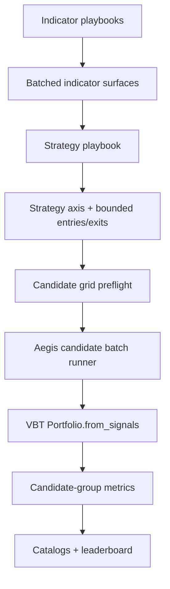
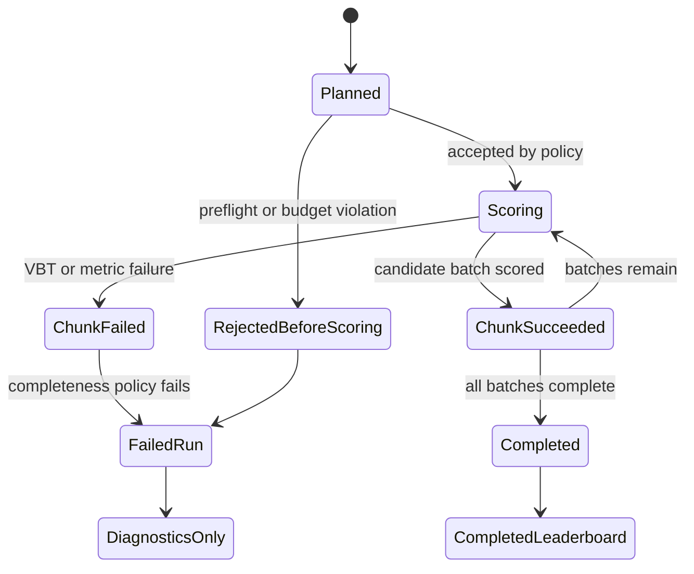

# feat: Add VBT Native Batched Playbook Contract

## Summary

Replace the record-oriented playbook sweep path with a VBT-native batched contract: playbooks expose candidate-indexed indicator and signal surfaces, Aegis validates the candidate grid, scores candidate groups in bounded VBT batches, and records compact authoritative leaderboard evidence plus machine-readable full provenance.

---

## Problem Frame

The composed-candidate PR made ranking semantics correct, but it still expands candidate grids through Python records and calls central portfolio simulation per candidate. The next step is to make candidate axes native to the data shape before simulation so Aegis can use VectorBT's grouping, broadcasting, and chunking patterns without changing central metric provenance.

---

## Requirements

**Batched playbook contracts**
- R1. Indicator and strategy playbook sweeps must use batched candidate surfaces as the forward contract, not lists of independently executable candidate records.
- R2. Indicator playbooks must emit candidate-indexed indicator outputs plus candidate metadata; they must not emit strategy signals, portfolio settings, or leaderboard metrics.
- R3. Indicator candidate outputs must remain aligned to the runner's bar index and symbol shape across every candidate dimension.
- R4. Strategy playbooks must consume batched runner data and batched indicator outputs, then emit candidate-indexed entry and exit signals plus strategy candidate metadata.
- R5. Candidate metadata must preserve indicator source identity, indicator params, strategy source identity, and strategy params as separate concepts so overlapping parameter names do not collide.
- R6. The batched contract must make candidate axes and planned candidate counts inspectable before portfolio simulation begins.

**VBT-native scoring semantics**
- R7. A ranked row must still represent a complete composed strategy candidate: selected indicator candidates, selected strategy candidate, centrally simulated portfolio, and Aegis-owned metrics.
- R8. Aegis must score batched candidates through central VBT portfolio execution in chunks or batches where feasible, instead of defaulting to one portfolio simulation per composed candidate.
- R9. Batched scoring must preserve per-candidate portfolio isolation and shared-cash semantics so candidate results remain comparable with the current central execution contract.
- R10. Metric extraction must operate at candidate-group scope and preserve the existing metric source, metric evidence, and per-symbol evidence expectations.
- R11. Candidate-grid size, chunk execution, memory budget decisions, and skipped or failed chunks must be visible to reviewers and automation.

**Artifacts and failure policy**
- R12. Run artifacts must preserve complete candidate provenance in a form that remains practical for large candidate grids.
- R13. The top leaderboard may stay compact, but full candidate evidence must remain machine-readable without requiring agents to reconstruct hidden batch dimensions.
- R14. Official ranked artifacts must not publish partial winners as completed evidence when the run violates the configured completeness policy.
- R15. Failed or rejected candidate batches must include enough candidate context for reproduction and debugging without turning failed results into authoritative leaderboard rows.

**Transition and ownership boundaries**
- R16. The redesign should be forward-first: new playbooks should target the batched contract, and the per-record sweep contract should not remain the long-term strategy-playbook shape.
- R17. Fixed components remain fixed promoted implementations and must not become sweep/candidate-grid producers.
- R18. Promotion from a batched winner remains manual and source-specific; Aegis does not auto-write promoted components.

**Origin actors:** A1 Researcher, A2 Indicator playbook author, A3 Strategy playbook author, A4 Strategy run reviewer, A5 Automation agent
**Origin flows:** F1 Batched indicator sweep authoring, F2 Batched strategy signal generation, F3 Chunked central scoring, F4 Review and promotion evidence
**Origin acceptance examples:** AE1 batched indicator axis inspection, AE2 composed metadata preservation, AE3 chunked VBT scoring, AE4 oversize/failure visibility, AE5 promotion evidence, AE6 layer-boundary rejection

---

## Scope Boundaries

- Do not keep the current per-record strategy sweep contract as the long-term primary path.
- Do not make runner-owned stacking the primary authoring model for this redesign.
- Do not replace VBT with a custom simulator.
- Do not let playbooks provide authoritative portfolio metrics or leaderboard rows.
- Do not add automatic promotion from winning batched candidates into component files.
- Do not require this redesign to land inside the current composed-candidate PR.
- Do not introduce component sweeps; components remain fixed implementations.
- Do not add retry/resume for failed chunks in the first implementation; failed chunk diagnostics must be enough for manual reproduction.

### Deferred to Follow-Up Work

- Chunk retry/resume: consider after initial chunk catalogs and deterministic candidate ranges are proven.
- Advanced artifact compression: add only after normalized artifacts expose real size pressure.
- Strategy-owned candidate pruning: defer unless a concrete use case requires explicit preflight filtering semantics.

---

## Context & Research

### Relevant Code and Patterns

- `research/aegis_research/strategy_runs.py` owns `run_strategy_sweep`, playbook execution, candidate validation, composition diagnostics, central scoring handoff, and strategy artifacts.
- `research/aegis_research/portfolios.py` owns `simulate_portfolio`, execution timing, generated entry sizing, shared-cash settings, and VBT `Portfolio.from_signals` calls.
- `research/aegis_research/reports.py` owns `portfolio_metrics`, metric source evidence, shared-cash metric scope, and per-symbol metric evidence.
- `research/aegis_research/run_leaderboard.py` owns ranking, central metric source enforcement, partial leaderboard summaries, and compact top rows.
- `research/aegis_research/playbook_registry/registry.py` and `research/aegis_research/playbook_registry/contracts.py` own playbook discovery, manifest validation, source identity, and callable loading.
- `research/aegis_research/configuration/schema.py` and `research/aegis_research/configuration/validation.py` own run config shape and validation for any chunk or memory-budget settings.
- `tests/integration/research/aegis_research/test_run_playbook_sources.py` is the primary existing coverage for playbook execution, composed candidates, invalid playbook fields, unused indicator axes, and artifact behavior.
- `tests/integration/research/aegis_research/test_portfolios.py` and `tests/unit/research/aegis_research/test_reports.py` cover portfolio execution semantics and metric extraction assumptions that the batched path must preserve.

### Institutional Learnings

- `docs/solutions/performance-issues/vectorbt-large-from-signals-chunking-memory-2026-05-17.md`: large `from_signals` runs need explicit memory budgets, chunk settings, matrix shape diagnostics, signal-density estimates, and order-record limits.
- `docs/solutions/best-practices/vectorbt-combine-params-conditions-levels-2026-05-17.md`: build explicit parameter grids before simulation, especially when constraints or linked parameters matter.
- `docs/solutions/best-practices/vectorbt-run-combs-to-combine-params-2026-05-17.md`: prefer `combine_params` over older combination helpers so candidate grids stay inspectable.
- `docs/solutions/best-practices/vectorbt-indicatorfactory-output-shape-contract-2026-05-17.md`: indicator outputs should preserve bar and symbol shape; shape-changing outputs need a separate contract.
- `docs/solutions/logic-errors/vectorbt-allocation-column-alignment-2026-05-17.md`: every asset-shaped input must be explicitly aligned before simulation.
- `docs/solutions/best-practices/forward-first-long-only-signal-contract-2026-05-18.md`: strategy outputs remain long-only entries/exits; playbooks must not smuggle portfolio behavior.
- `docs/solutions/best-practices/vectorbt-execution-timing-nextopen-2026-05-17.md`: execution timing and Open-price requirements remain central portfolio concerns.

### External References

- VectorBT PRO docs and MCP findings confirm that `Portfolio.from_signals` supports `group_by`, `cash_sharing`, and `chunked` execution settings.
- VectorBT PRO docs and MCP findings confirm that `vbt.Param` and `vbt.combine_params` support explicit parameter products, keys, levels, constraints, and inspectable candidate indexes.
- VectorBT PRO guidance favors candidate groups where symbol columns remain the asset level and non-symbol levels identify parameter/candidate groups.

---

## Key Technical Decisions

- Candidate grouping convention: batched signal surfaces should use one symbol/asset level and treat every non-symbol level as candidate identity. Candidate groups must be monolithic and deterministic so VBT portfolio grouping maps one group to one composed candidate.
- Candidate-level portfolio isolation: batched portfolio execution should group by the non-symbol candidate levels with shared cash inside each candidate group, never across all candidates.
- Aegis-owned batching over one giant portfolio: Aegis should split candidate groups into bounded batches, run VBT inside each batch, extract metrics, and discard batch-local portfolio objects.
- All-or-nothing official scoring: a completed leaderboard requires all planned candidates to score and produce required ranking metrics. Failed or skipped batches may write diagnostics but not authoritative completed leaderboard evidence.
- No first-pass resume: chunk retry/resume is deferred; chunk diagnostics must identify the failed candidate range/context clearly enough to reproduce manually.
- Forward-first transition: legacy per-record sweep playbooks should be rejected with migration guidance in the new batched run path rather than silently adapted as a second primary contract.
- Normalized full evidence: top leaderboard rows can be denormalized for readability, but full candidate, source, chunk, and metric evidence should use catalogs/references to avoid repeating static metadata on every row.

---

## Open Questions

### Resolved During Planning

- What VBT grouping convention should the plan target? Use symbol as the asset level and all non-symbol levels as candidate identity, so each candidate group contains that candidate's full symbol set.
- Should official scoring allow partial leaderboard publication? No. Partial or failed chunks can produce diagnostic artifacts, but official completed leaderboard evidence requires completeness.
- Should first implementation support chunk retry/resume? No. Defer resume until chunk catalogs and deterministic candidate ranges are stable.
- Should legacy record playbooks be auto-adapted? No. The batched path is forward-first and should reject/migrate legacy sweep shapes explicitly.
- Where should full provenance live for large grids? Use normalized catalogs and compact leaderboard refs rather than repeating full evidence in every ranked/candidate row.

### Deferred to Implementation

- Exact helper/module names: choose while implementing, but keep batched contract and batch portfolio runner separated enough to avoid growing `strategy_runs.py` further.
- Default chunk sizes and memory thresholds: derive from small representative benchmarks and conservative defaults during implementation.
- Exact artifact file split: decide after the first normalized catalog shape is implemented, while preserving the catalog/ref principle.

---

## High-Level Technical Design

> *This illustrates the intended approach and is directional guidance for review, not implementation specification. The implementing agent should treat it as context, not code to reproduce.*



Indicator-surface shape at the planning level:

```text
rows = market bars
symbol level = asset/symbol identity
candidate levels = indicator source/candidate identity
indicator candidate group = all symbols for one indicator candidate output
```

Composed strategy signal/scoring surface at the planning level:

```text
rows = market bars
symbol level = asset/symbol identity
candidate levels = indicator source/candidate + strategy source/candidate identity
candidate group = all symbols for one complete composed strategy candidate
```

Batched run state at the planning level:



Prose requirements govern if these diagrams and the implementation units disagree.

---

## Implementation Units

### U1. Define Batched Candidate Axis Contract

**Goal:** Establish the new batched playbook contract and candidate-axis model before changing scoring behavior.

**Requirements:** R1, R2, R3, R4, R5, R6, R16; F1, F2; AE1, AE2, AE6

**Dependencies:** None

**Files:**
- Create: `research/aegis_research/batched_candidates.py`
- Modify: `research/aegis_research/strategy_runs.py`
- Modify: `research/aegis_research/playbook_registry/contracts.py` if a manifest/result marker is needed for the new contract
- Test: `tests/unit/research/aegis_research/test_playbooks.py`
- Test: `tests/integration/research/aegis_research/test_run_playbook_sources.py`

**Approach:**
- Define a source-neutral batched candidate contract for candidate surfaces, candidate catalogs, and composed candidate identity.
- Make the symbol/asset dimension explicit and require all non-symbol candidate levels to map to deterministic candidate metadata.
- Preserve separate indicator and strategy metadata rather than flattening params into a single map.
- Define strategy playbook batching as a two-phase protocol: discover the strategy candidate axis first, then materialize entries/exits for an explicit candidate range or candidate ID set.
- Require materialized strategy candidate IDs to reconcile exactly with the discovered/planned candidate axis.
- Add a forward-first contract marker or result discriminator so legacy `variant_records` are not accidentally accepted as the new batched path.
- Keep the new contract narrow: indicator playbooks produce indicator surfaces; strategy playbooks produce entries/exits; neither owns metrics or portfolio settings.

**Execution note:** Start with contract tests for accepted batched surfaces and rejected legacy/ambiguous result shapes before wiring into run execution.

**Patterns to follow:**
- Current `IndicatorPlaybookCandidate` and `IndicatorPlaybookAxis` concepts in `research/aegis_research/strategy_runs.py`.
- Current candidate ID safety checks and metric-authority rejection in `research/aegis_research/strategy_runs.py`.
- Playbook manifest parsing in `research/aegis_research/playbook_registry/registry.py`.

**Test scenarios:**
- Happy path: a batched indicator result with stable candidate IDs, params, aligned outputs, and source metadata validates and exposes a candidate axis count.
- Happy path: a batched strategy contract discovers strategy candidate metadata, then materializes candidate-indexed entries/exits for a requested candidate range without portfolio metrics.
- Error path: a legacy per-record `variant_records` strategy playbook is rejected in batched mode with migration-oriented diagnostics.
- Error path: duplicate candidate IDs or duplicate composed IDs fail before scoring.
- Error path: indicator or strategy batched outputs containing playbook-owned metrics, portfolio settings, sizing fields, or unsupported signal fields are rejected.
- Error path: strategy signal materialization returns candidate IDs outside the requested range or omits requested IDs; validation rejects before scoring.
- Edge case: candidates with empty params remain valid when they have stable IDs and aligned surfaces.

**Verification:**
- The batched contract can be validated independently of portfolio simulation.
- Legacy record output cannot silently enter the new batched path.
- Candidate metadata remains separated by indicator source and strategy source.

---

### U2. Validate Batched Indicator Surfaces and Preflight Grids

**Goal:** Replace eager Cartesian indicator contexts with inspectable batched indicator axes and preflight diagnostics.

**Requirements:** R2, R3, R5, R6, R11, R12; F1, F3; AE1, AE4, AE6

**Dependencies:** U1

**Files:**
- Modify: `research/aegis_research/strategy_runs.py`
- Modify: `research/aegis_research/batched_candidates.py`
- Modify: `research/aegis_research/configuration/schema.py`
- Modify: `research/aegis_research/configuration/validation.py`
- Test: `tests/integration/research/aegis_research/test_run_playbook_sources.py`
- Test: `tests/integration/research/aegis_research/test_config_contract.py`

**Approach:**
- Materialize indicator candidate catalogs and output surfaces once per source rather than once per Cartesian context.
- Validate every indicator output against runner bar index, symbol set, symbol ordering, output names, and candidate-axis metadata.
- Compute source-level indicator candidate counts and indicator-surface shape before strategy invocation.
- Add configuration-owned policy for candidate-grid or memory-budget limits, with conservative defaults and visible diagnostics.
- Treat fixed indicator components as non-multiplying inputs: they contribute evidence but no candidate axis.

**Patterns to follow:**
- `_assert_indicator_frame(...)` and `_indicator_output_frame(...)` in `research/aegis_research/strategy_runs.py`.
- Data-array fail-fast validation patterns in `research/aegis_research/data_arrays.py`.
- Config validation conventions in `research/aegis_research/configuration/validation.py`.

**Test scenarios:**
- Covers AE1. Happy path: one indicator playbook emits 100 aligned candidates; pre-strategy preflight reports 100 indicator candidates and no raw indicator candidate enters the leaderboard.
- Error path: an indicator output has fewer rows than runner data; validation rejects before strategy invocation with source/candidate/output context.
- Error path: an indicator output has the same symbols in a different order; validation rejects before grid composition.
- Error path: an indicator playbook emits an empty candidate axis; run rejects before scoring.
- Edge case: one fixed indicator component plus one 100-candidate indicator playbook produces 100 planned composed contexts, not a multiplied fixed-component axis.
- Error path: estimated matrix size exceeds configured policy; run fails before scoring and records preflight diagnostics without completed leaderboard evidence.

**Verification:**
- Indicator-axis counts are visible before strategy execution; final composed counts are resolved after strategy-axis discovery and before portfolio simulation.
- Indicator surfaces are validated once and reused as read-only batched inputs.
- Oversize grids fail closed before VBT simulation starts.

---

### U3. Implement Batched Strategy Axis Discovery and Signal Validation

**Goal:** Let strategy playbooks consume batched indicator surfaces, expose an inspectable strategy candidate axis, and materialize bounded candidate-indexed entries/exits under the central signal contract.

**Requirements:** R1, R4, R5, R6, R7, R16; F2; AE2, AE6

**Dependencies:** U1, U2

**Files:**
- Modify: `research/aegis_research/strategy_runs.py`
- Modify: `research/aegis_research/batched_candidates.py`
- Modify: `docs/examples/playbooks/strategy_playbook_example.py`
- Test: `tests/integration/research/aegis_research/test_run_playbook_sources.py`
- Test: `tests/integration/research/aegis_research/test_strategy_run.py`

**Approach:**
- Introduce a batched strategy input shape that exposes runner data and batched source-scoped indicator surfaces.
- Validate a strategy-axis discovery result before requesting signal data so final composed candidate counts and planned IDs are known before portfolio simulation.
- Validate materialized batched entries/exits for an explicit candidate range or candidate ID set so they share bar index, requested candidate axis, symbol axis, and boolean signal semantics.
- Reject materialized signal batches whose candidate IDs do not reconcile exactly with the requested range and the discovered strategy axis.
- Preserve current long-only signal boundary and reject playbook-owned portfolio semantics.
- Require selected indicator axes to be consumed as complete axes; partial candidate-axis consumption is out of scope for the first implementation.
- Preserve deterministic composed candidate IDs that map from signal columns/groups to candidate catalogs and artifacts.

**Patterns to follow:**
- `validate_strategy_output(...)` and `_signal_frame(...)` in `research/aegis_research/strategy_runs.py`.
- Unused indicator-axis rejection tests in `tests/integration/research/aegis_research/test_run_playbook_sources.py`.
- Signal boundary tests in `tests/integration/research/aegis_research/test_strategy_run.py`.

**Test scenarios:**
- Covers AE2. Happy path: 100 indicator candidates and 10 discovered strategy candidates produce 1,000 planned composed candidates with separated indicator and strategy metadata.
- Happy path: A requested strategy candidate range materializes only that range's entries/exits while preserving exact composed candidate IDs.
- Error path: entries and exits expose different candidate axes; validation rejects before portfolio scoring.
- Error path: entries and exits expose different symbol sets or symbol order; validation rejects before portfolio scoring.
- Error path: strategy receives a selected indicator axis but does not consume it; run fails before scoring.
- Error path: strategy consumes only part of a selected indicator axis; run fails before scoring, with no first-pass filtering or pruning semantics.
- Error path: strategy emits portfolio settings, metrics, or unsupported sizing fields; validation rejects before scoring.
- Error path: materialized entries/exits omit a requested candidate or include an undiscovered candidate; validation rejects before portfolio scoring.

**Verification:**
- Strategy playbooks expose candidate-axis metadata separately from bounded signal materialization.
- Strategy playbooks can materialize one batched signal surface for the requested candidate batch.
- Every signal group maps to one complete composed candidate.
- Final composed candidate counts and estimated scoring shape are visible before portfolio simulation.
- Legacy record candidates are not the primary batched strategy path.

---

### U4. Add Chunk-Aware Signal Materialization

**Goal:** Wire the two-phase strategy signal protocol into chunk policy so large strategy playbooks do not materialize the entire composed signal surface before scoring.

**Requirements:** R4, R6, R8, R11, R14; F2, F3; AE2, AE3, AE4

**Dependencies:** U2, U3

**Files:**
- Modify: `research/aegis_research/strategy_runs.py`
- Modify: `research/aegis_research/batched_candidates.py`
- Test: `tests/integration/research/aegis_research/test_run_playbook_sources.py`
- Test: `tests/integration/research/aegis_research/test_batched_playbook_scalability.py`

**Approach:**
- Use the U3 strategy-axis discovery result to plan final composed candidate counts and scoring batches before requesting signal data.
- Request strategy signals for bounded candidate ranges or batches rather than one full composed signal matrix.
- Treat a smaller final candidate batch as complete when all assigned candidates are materialized, scored, and metric-complete.
- Preserve no hidden pruning: planned candidate counts must reconcile with materialized/scored/metric candidate counts under the all-or-nothing policy.

**Patterns to follow:**
- Current composition diagnostics in `research/aegis_research/strategy_runs.py`.
- VectorBT chunking guidance in `docs/solutions/performance-issues/vectorbt-large-from-signals-chunking-memory-2026-05-17.md`.

**Test scenarios:**
- Happy path: 2,005 composed candidates with chunk size 1,000 materialize and score as batches of 1,000, 1,000, and 5.
- Error path: strategy-axis discovery reports 1,000 candidates but a materialized chunk omits one candidate; run fails completeness policy before official leaderboard publication.
- Error path: strategy tries to filter candidate ranges implicitly; run rejects unless planned and materialized counts reconcile exactly.
- Integration: peak signal materialization scope is bounded to the active candidate batch for a test fixture that would otherwise exceed the configured policy.

**Verification:**
- Signal generation can be bounded by candidate batch before VBT scoring.
- Final composed counts are known before portfolio simulation without requiring full signal surface materialization.

---

### U5. Add Candidate-Group Portfolio Batch Runner

**Goal:** Score batched candidate groups through central VBT portfolio execution while preserving per-candidate isolation, shared cash within each candidate, execution timing, and entry-budget semantics.

**Requirements:** R7, R8, R9, R11, R14; F3; AE3, AE4

**Dependencies:** U2, U3, U4

**Files:**
- Modify: `research/aegis_research/portfolios.py`
- Modify: `research/aegis_research/strategy_runs.py`
- Modify: `research/aegis_research/configuration/schema.py`
- Modify: `research/aegis_research/configuration/validation.py`
- Test: `tests/integration/research/aegis_research/test_portfolios.py`
- Test: `tests/integration/research/aegis_research/test_run_playbook_sources.py`

**Approach:**
- Add a batch portfolio runner that accepts candidate-grouped close, entries, exits, size inputs, and candidate metadata.
- Expand runner-owned market data features such as Close and required Open prices onto the same candidate-grouped column convention as entries and exits before VBT execution.
- Validate exact index, candidate-axis, and symbol-axis alignment across close, open, entries, exits, and generated size before calling VBT.
- Batch by complete candidate groups, never by raw columns that split one candidate's symbols across chunks.
- Use VBT grouping so each candidate group has its own portfolio and shared cash does not leak across candidates.
- Generate entry size within each candidate group so existing entry-budget semantics are preserved per candidate rather than across the whole batch.
- Reuse central execution timing rules and Open-price requirements from the existing single-candidate path.
- Record rows, candidate count, symbol count, total columns, signal density estimate, chunk settings, and execution outcome for each batch.

**Patterns to follow:**
- `simulate_portfolio(...)`, `_simulation_signals(...)`, `_execution_timing_kwargs(...)`, and `_entry_size_frame(...)` in `research/aegis_research/portfolios.py`.
- Same-bar shared-cash and next-open timing tests in `tests/integration/research/aegis_research/test_portfolios.py`.
- VBT chunking guidance in `docs/solutions/performance-issues/vectorbt-large-from-signals-chunking-memory-2026-05-17.md`.

**Test scenarios:**
- Covers AE3. Happy path: a multi-candidate, multi-symbol batch produces per-candidate portfolios with no cash sharing between candidates.
- Integration: batched scoring of a small candidate set matches existing per-candidate scoring metrics for equivalent signals.
- Integration: same-close execution expands Close to candidate-grouped columns and preserves symbol order for every candidate group.
- Integration: next-open execution expands Open to candidate-grouped columns with the same candidate/symbol ordering as Close and signals.
- Edge case: final chunk is smaller than configured batch size and still counts as complete when all assigned candidates score.
- Error path: one batch fails during VBT execution; run writes diagnostic context and no official completed leaderboard.
- Error path: next-open timing is configured without required Open prices; batched path fails with the same central timing semantics as single-candidate scoring.
- Error path: entries/exits use a symbol order that cannot align with candidate-expanded market frames; run rejects before VBT execution.
- Edge case: candidates trading the same symbols at the same timestamps do not affect each other's cash or metrics.

**Verification:**
- Batched portfolio scoring preserves existing single-candidate behavior for batch size 1 and equivalent behavior for small multi-candidate fixtures.
- Candidate groups are never split across chunks.
- Chunk diagnostics make scoring scale and failures visible.

---

### U6. Extract Candidate-Group Metrics and Ranking Records

**Goal:** Convert grouped VBT portfolio results into authoritative Aegis metric records and leaderboard rows without losing per-symbol evidence.

**Requirements:** R7, R10, R12, R13, R14; F3, F4; AE3, AE5

**Dependencies:** U5

**Files:**
- Modify: `research/aegis_research/reports.py`
- Modify: `research/aegis_research/run_leaderboard.py`
- Modify: `research/aegis_research/strategy_runs.py`
- Test: `tests/unit/research/aegis_research/test_reports.py`
- Test: `tests/unit/research/aegis_research/test_run_leaderboard.py`
- Test: `tests/integration/research/aegis_research/test_run_playbook_sources.py`

**Approach:**
- Add a batched metric extraction path that returns metrics keyed by composed candidate ID.
- Introduce candidate-group metric extraction as a sibling to the existing single-portfolio metric path rather than reusing the single shared-cash headline assumption directly.
- Either slice grouped portfolio results to one candidate group before using existing single-portfolio helpers, or add group-aware raw-value mapping that never applies single-headline helpers to multi-group values.
- For each candidate group, produce the same authoritative metric payload shape expected by leaderboard records, including aggregate metric evidence and per-symbol evidence under that candidate.
- Preserve `metric_source: "central_portfolio"`, metric assumptions, metric roles, optional diagnostics, and per-symbol metric evidence under each candidate.
- Keep one official leaderboard row per composed candidate; per-symbol stats are evidence, not separate leaderboard candidates.
- Reuse `build_run_leaderboard(...)` authority checks where possible, but feed it candidate records produced by grouped metric extraction.
- Treat missing, non-finite, or unavailable ranking metrics as completeness failures under the official all-or-nothing policy.

**Patterns to follow:**
- `portfolio_metrics(...)` in `research/aegis_research/reports.py`.
- `build_run_leaderboard(...)` and `_assert_central_metric_source(...)` in `research/aegis_research/run_leaderboard.py`.
- Existing report tests in `tests/unit/research/aegis_research/test_reports.py`.

**Test scenarios:**
- Covers AE3. Happy path: grouped batched portfolio returns one metric record per composed candidate with central portfolio metric source.
- Happy path: batch size 1 produces metric payloads equivalent to the existing single-candidate metric path.
- Happy path: a two-candidate, multi-symbol fixture extracts two aggregate candidate metric payloads and candidate-scoped per-symbol evidence.
- Happy path: a two-candidate grouped portfolio produces candidate-scoped `optional_diagnostics` without applying single-headline helpers to multi-group values.
- Error path: one candidate's optional diagnostic is unavailable; the warning/evidence is attached only to that candidate's metric payload.
- Happy path: multi-symbol candidate metrics include aggregate ranking metrics plus per-symbol evidence under the same candidate.
- Error path: one candidate lacks the configured ranking metric; official leaderboard is not completed.
- Error path: every candidate has no trades and ranking metric is unavailable; diagnostics are recorded and no completed leaderboard publishes.
- Edge case: tied ranking metrics remain deterministic using existing stable ranking behavior.

**Verification:**
- Candidate-group metrics are comparable to existing single-candidate metrics.
- Metric evidence remains inspectable by reviewers and automation.
- Leaderboard rows preserve complete composed candidate semantics.

---

### U7. Normalize Batched Artifacts and Failure Diagnostics

**Goal:** Make large batched runs machine-readable without duplicating static evidence across every row, while preserving completed-vs-failed artifact semantics.

**Requirements:** R11, R12, R13, R14, R15, R18; F4; AE4, AE5

**Dependencies:** U2, U5, U6

**Files:**
- Modify: `research/aegis_research/strategy_runs.py`
- Modify: `research/aegis_research/provenance/manifest.py` if new artifact statuses or shapes are needed
- Modify: `research/aegis_research/provenance/experiment_artifacts.py` if new artifact helpers are useful
- Modify: `research/aegis_research/run_leaderboard.py`
- Test: `tests/integration/research/aegis_research/test_provenance_manifest.py`
- Test: `tests/integration/research/aegis_research/test_run_playbook_sources.py`
- Test: `tests/unit/research/aegis_research/test_run_leaderboard.py`

**Approach:**
- Split full evidence into normalized catalogs for sources, indicator candidates, strategy candidates, composed candidates, chunks, and metrics.
- Keep top leaderboard rows compact but resolvable through catalog references.
- Record preflight diagnostics before scoring and chunk diagnostics as chunks run.
- On rejected or failed runs, write diagnostic artifacts and manifest status without completing official strategy/leaderboard evidence.
- Ensure completed artifact shape metadata includes candidate counts, chunk counts, success/failure counts, and leaderboard row counts.

**Patterns to follow:**
- Artifact planning/completion in `_write_strategy_artifact(...)` in `research/aegis_research/strategy_runs.py`.
- Manifest validation in `research/aegis_research/provenance/manifest.py`.
- Current partial leaderboard tests in `tests/integration/research/aegis_research/test_strategy_run.py` and `tests/integration/research/aegis_research/test_run_playbook_sources.py`.

**Test scenarios:**
- Covers AE4. Preflight-rejected oversize grid records preflight diagnostics and no completed strategy leaderboard artifact.
- Covers AE5. Completed run artifacts let an agent resolve a top row to indicator source/candidate, strategy source/candidate, params, chunk ID, and metric evidence.
- Error path: chunk 3 fails after chunks 1 and 2 succeed; run status is failed, official leaderboard is absent, and failed chunk context is recorded.
- Edge case: 2,005 candidates with chunk size 1,000 produces chunk sizes 1,000, 1,000, and 5, and completes when all chunks succeed.
- Error path: artifact persistence failure prevents publishing official completed leaderboard evidence.
- Integration: promotion documentation can identify only completed-run winners as promotable evidence.

**Verification:**
- Artifacts remain practical for large grids through catalogs/references.
- Failed and partial runs do not masquerade as completed leaderboard evidence.
- Automation can resolve provenance without reconstructing hidden VBT dimensions.

---

### U8. Migrate Docs and Example Playbooks to Batched Contract

**Goal:** Make the batched contract the documented forward path and remove ambiguity around legacy per-record sweeps.

**Requirements:** R1, R2, R4, R16, R17, R18; A1, A2, A3, A5; AE1, AE2, AE5, AE6

**Dependencies:** U1, U2, U3, U7

**Files:**
- Modify: `docs/playbooks.md`
- Modify: `docs/components.md`
- Modify: `docs/vectorbt-scaffold.md`
- Modify: `README.md`
- Modify: `docs/examples/playbooks/indicator_playbook_example.py`
- Modify: `docs/examples/playbooks/strategy_playbook_example.py`
- Modify: `research/playbooks/indicators/README.md`
- Modify: `research/playbooks/strategies/README.md`
- Test: `tests/integration/research/aegis_research/test_cli_docs.py`
- Test: `tests/integration/research/aegis_research/test_run_playbook_sources.py`

**Approach:**
- Update docs to describe batched indicator surfaces, batched strategy signal surfaces, candidate axes, chunked central scoring, and artifact catalogs.
- Convert example playbooks to the batched contract and mark per-record sweep examples as legacy only if they must remain for historical context.
- Make component docs clear that components remain fixed implementations and do not emit candidate axes.
- Document migration behavior for legacy per-record playbooks: rejected/migration-guided in the batched path rather than silently adapted.
- Preserve manual promotion language: a winning batched row identifies source/candidate evidence, but Aegis does not auto-write components.

**Patterns to follow:**
- Current composed-candidate docs in `docs/playbooks.md` and `docs/components.md`.
- Jupytext-compatible percent-cell examples in `docs/examples/playbooks/indicator_playbook_example.py` and `docs/examples/playbooks/strategy_playbook_example.py`.
- Existing docs assertions in `tests/integration/research/aegis_research/test_cli_docs.py`.

**Test scenarios:**
- Happy path: docs mention batched playbook surfaces, central Aegis/VBT scoring, candidate-grid diagnostics, and manual promotion.
- Happy path: example indicator and strategy playbooks execute through the batched path in integration tests.
- Error path: legacy per-record examples are not presented as the primary forward contract.
- Error path: docs do not imply playbooks can provide authoritative metrics or portfolio settings.

**Verification:**
- A new playbook author can understand the batched shape from docs/examples without reading runner internals.
- Documentation preserves forward-first and no-component-sweeps boundaries.

---

### U9. Add Representative Scalability Characterization

**Goal:** Provide enough measurable coverage to tune chunk policy and guard against regressions without turning tests into long-running benchmarks.

**Requirements:** R8, R9, R11, R12; Success criteria; AE3, AE4

**Dependencies:** U5, U6, U7

**Files:**
- Create: `tests/integration/research/aegis_research/test_batched_playbook_scalability.py`
- Modify: `docs/solutions/performance-issues/vectorbt-large-from-signals-chunking-memory-2026-05-17.md` only if implementation reveals a reusable new pattern
- Modify: `docs/vectorbt-scaffold.md`

**Approach:**
- Add small deterministic fixtures that exercise many candidate groups with few rows/symbols so CI stays fast while proving chunking, final-chunk behavior, and diagnostic counts.
- Add optional local benchmark guidance for larger rows/symbols/candidates, but do not make heavyweight benchmarks part of the normal test suite.
- Capture expected diagnostics: planned candidates, scored candidates, chunk sizes, signal density estimate, and metric row count.
- Compare small batched scoring to known per-candidate expectations where feasible.

**Patterns to follow:**
- Existing lightweight synthetic-data integration tests in `tests/integration/research/aegis_research/test_run_playbook_sources.py`.
- Performance-learning format in `docs/solutions/performance-issues/vectorbt-large-from-signals-chunking-memory-2026-05-17.md` if a new documented solution is warranted after implementation.

**Test scenarios:**
- Happy path: a multi-candidate fixture runs in multiple chunks and reports exact planned/scored/chunk counts.
- Edge case: final chunk smaller than configured batch size is treated as complete.
- Error path: configured budget below fixture size rejects before scoring with preflight diagnostics.
- Integration: batched path avoids one completed portfolio artifact per candidate and records chunk-level scoring evidence instead.

**Verification:**
- CI coverage proves the scaling state machine without relying on wall-clock performance assertions.
- Local benchmark guidance is available for tuning real-world chunk defaults.

---

## System-Wide Impact

- **Interaction graph:** Run execution, playbook contracts, portfolio simulation, report metrics, leaderboard construction, artifact provenance, docs, and examples all change together. The implementation should preserve a clear boundary between playbook output validation and central portfolio authority.
- **Error propagation:** Contract violations fail before scoring; preflight budget failures fail before VBT execution; chunk failures fail the run and write diagnostics only; metric incompleteness prevents official completed leaderboard evidence.
- **State lifecycle risks:** Partial batch success must not leave completed artifacts that look authoritative. Manifest status and artifact completion must reflect run completeness policy.
- **API surface parity:** CLI `aerd run`, docs examples, playbook registry contracts, and automation-consuming artifacts must tell the same batched-contract story.
- **Integration coverage:** Unit tests alone will not prove candidate isolation, shared-cash grouping, metric extraction, and artifact state; integration tests must cover multi-symbol and multi-candidate batched runs.
- **Unchanged invariants:** Aegis remains the central metric computation boundary, strategy candidates remain long-only entries/exits, portfolio config stays run-owned, components stay fixed, and promotion remains manual.

---

## Alternative Approaches Considered

- Batch portfolio scoring only: rejected as the target architecture because it leaves indicator/strategy composition in Python records and only optimizes the final hot path.
- Runner-owned stacking as primary authoring model: rejected by the origin decision. It improves author ergonomics but makes Aegis responsible for more hidden transformation machinery.
- Additive fast path beside record sweeps: rejected because the user confirmed a forward replacement over compatibility layering.
- Custom simulator: out of scope because the requirement is specifically to become more VBT-native, not less.

---

## Success Metrics

- A representative composed run can score many candidates through VBT batches instead of one VBT portfolio simulation per candidate.
- Preflight diagnostics report planned candidate count, estimated matrix shape, and chunk policy before scoring starts.
- Completed leaderboard candidate counts match planned/scored/metric counts under the all-or-nothing policy.
- A top leaderboard row can be resolved to full indicator candidate, strategy candidate, source, params, chunk, and metric evidence from artifacts.
- Existing single-candidate and small composed-run semantics remain comparable to the pre-batched implementation.

---

## Risks & Dependencies

| Risk | Mitigation |
|------|------------|
| Wrong VBT grouping shares cash across candidates | Make symbol the asset level, group by candidate identity, and add multi-candidate shared-cash isolation tests. |
| Batched entry sizing changes portfolio semantics | Generate entry budgets within each candidate group and compare small fixtures against existing per-candidate scoring. |
| Artifact normalization makes top rows harder to inspect | Keep compact leaderboard rows denormalized enough for review while full evidence lives in catalogs. |
| Chunking still creates too-large VBT objects | Use Aegis-owned candidate batching first, VBT chunking inside each batch second, and fail closed on preflight limits. |
| Legacy playbooks linger as a second contract | Add explicit validation and docs that reject or migrate legacy per-record sweep shapes in the batched path. |
| Metric extraction loses per-symbol evidence | Add candidate-group metric extraction tests that verify aggregate and per-symbol evidence together. |

---

## Documentation / Operational Notes

- Update playbook docs before or alongside examples so authors see the batched contract as the forward path.
- Document that chunk defaults are conservative and should be tuned with representative local benchmarks before large research runs.
- Document failure-state semantics: failed or partial batched runs may produce diagnostics but not official completed leaderboard evidence.
- Update any PR description or release notes for this feature to call out the breaking playbook contract change.

---

## Sources & References

- **Origin document:** [docs/brainstorms/2026-05-20-vbt-native-batched-playbook-contract-requirements.md](../brainstorms/2026-05-20-vbt-native-batched-playbook-contract-requirements.md)
- Related code: `research/aegis_research/strategy_runs.py`
- Related code: `research/aegis_research/portfolios.py`
- Related code: `research/aegis_research/reports.py`
- Related code: `research/aegis_research/run_leaderboard.py`
- Related tests: `tests/integration/research/aegis_research/test_run_playbook_sources.py`
- Related tests: `tests/integration/research/aegis_research/test_portfolios.py`
- Related tests: `tests/unit/research/aegis_research/test_reports.py`
- Institutional learning: `docs/solutions/performance-issues/vectorbt-large-from-signals-chunking-memory-2026-05-17.md`
- Institutional learning: `docs/solutions/best-practices/vectorbt-combine-params-conditions-levels-2026-05-17.md`
- Institutional learning: `docs/solutions/best-practices/vectorbt-run-combs-to-combine-params-2026-05-17.md`
- Institutional learning: `docs/solutions/best-practices/vectorbt-indicatorfactory-output-shape-contract-2026-05-17.md`
- Institutional learning: `docs/solutions/logic-errors/vectorbt-allocation-column-alignment-2026-05-17.md`
- External docs: VectorBT PRO `Portfolio.from_signals`, `vbt.Param`, and `vbt.combine_params` documentation
