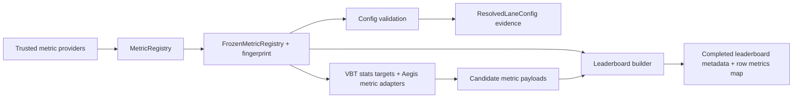

# feat: Add VBT-style metric registry

## Summary

Create a dedicated metric registry package, migrate ranking validation and leaderboards from Aegis-normalized metric keys to VBT-style metric IDs, and introduce secondary metrics as required leaderboard row values. The plan dynamically registers supported native VBT metrics by name, keeps YAML inert, and layers trusted custom metric plugins through a generic custom-metrics composition point.

---

## Problem Frame

Ranking currently depends on report-owned normalized metric names such as `total_return_pct`, which couples config validation, reports, and leaderboard behavior. The origin requirements define a separate registry boundary so native VBT metrics and trusted custom VBT-style metrics can share one config-facing namespace without forcing future metric additions into main orchestration files.

---

## Requirements

- R1. Metric definitions and registry mechanics live under a dedicated metrics package, not report/config/run main files.
- R2. Native VBT and trusted custom VBT-style metrics share one globally unique string ID namespace.
- R3. Duplicate registration fails before config resolution.
- R4. Metric definitions carry validation and audit metadata: ID, title, source type, value semantics, unit, supported lanes, primary/secondary eligibility, direction hint, and required inputs.
- R5. The metric registry freezes before config validation and execution uses that same frozen snapshot.
- R6. Resolved config/run evidence includes metric registry identity.
- R7. Custom metrics are registered through trusted Python providers before config resolution; YAML never names code or imports.
- R8. Adding a custom metric does not require editing config validation, report generation, leaderboard construction, or lane orchestration files.
- R9. Built-in native VBT metrics are dynamically registered from supported VBT stats targets by native metric ID, similar to the data-provider discovery pattern.
- R10. Built-in custom metrics such as `baseline_delta` are represented as custom VBT-style metric plugins.
- R11. Each built-in custom metric plugin lives in its own file and is collected by the generic custom-metrics composition point.
- R12. Custom metric plugins use VBT's generic StatsBuilder/custom-metric shape when their target object supports `stats()`, and otherwise provide an Aegis adapter that exposes lane data as a VBT-compatible metric target.
- R13. Config authors call native and custom metrics by name only and never specify metric implementation source.
- R14. Ranking config selects one primary-eligible metric by VBT-style metric ID string.
- R15. `direction` remains explicit leaderboard sort policy: `desc` ranks larger values higher and `asc` ranks smaller values higher.
- R16. `secondary_metrics` is an optional list of secondary-eligible VBT-style metric IDs displayed on leaderboard rows without affecting primary ordering.
- R17. Ranking metric selections are strings-only; metric params and calc functions do not belong in the ranking block.
- R18. Primary-in-secondary and duplicate secondary metrics are rejected.
- R19. Legacy normalized config names such as `total_return_pct` are not part of the target contract.
- R20. Unknown metric IDs fail config validation.
- R21. Lane-incompatible registered metrics fail config validation when the lane can never compute them.
- R22. Data-dependent missing inputs fail runtime preflight before completed leaderboard publication.
- R23. Primary and secondary metrics are required outputs for completed leaderboards.
- R24. Metric-specific parameters come from lane/provider contracts, not ranking config.
- R25. Leaderboard metadata declares primary metric, direction, secondary metrics, and registry identity.
- R26. Leaderboard rows expose a single `metrics` map with primary and secondary metric values.
- R27. Ordering is primary metric plus direction; `baseline_delta` is a contextual secondary metric and not a primary ranking target or separate `rank_by` mode.
- R28. Consumers can read metric values without special-casing native versus custom metric source.

**Origin actors:** A1 Config author, A2 Metric author, A3 Experiment runner, A4 Leaderboard consumer, A5 Planning or automation agent

**Origin flows:** F1 Register trusted metrics, F2 Validate ranking selection, F3 Publish leaderboard metric values

**Origin acceptance examples:** AE1 unknown metric failure, AE2 duplicate secondary failure, AE3 lane-incompatible custom metric failure, AE4 missing runtime inputs, AE5 trusted provider registration, AE6 one custom metric per file, AE7 dynamic native metric selection by name, AE8 metrics-map row shape, AE9 primary-only sort behavior, AE10 baseline delta as secondary metric

---

## Scope Boundaries

- No inline Python, import paths, formulas, metric settings, or object-shaped metric definitions in experiment YAML.
- No arbitrary runtime custom metrics outside trusted registry registration.
- No compatibility aliases for normalized metric config keys such as `total_return_pct` in this plan.
- No secondary-metric ordering, weighted composites, tie-break tuning, or multi-objective optimization.
- No flat top-level metric columns in leaderboard rows.
- No broad report redesign beyond making metric catalog knowledge registry-backed and preserving current report evidence semantics.
- No automatic package entry-point discovery for external project metric providers in v1; built-in/native metric discovery is dynamic, but third-party/project providers still enter through explicit trusted registration before config resolution.

### Deferred to Follow-Up Work

- Full train-lane leaderboard UX: Train ranking and feature-quality custom metrics are deferred until their formula and input contracts are planned.
- External provider discovery: Package entry points or repo-local plugin autodiscovery can be added after explicit registration proves the trusted-code boundary.
- Additional custom metric families: Future VBT-friendly custom metrics should use the same `metrics/custom/` layout but are not part of this plan.

---

## Context & Research

### Relevant Code and Patterns

- `research/aegis_research/model_registry.py` provides the closest registry precedent: mutable registry, validation on register, duplicate ID failure, freeze to immutable mapping, and deterministic fingerprint.
- `research/aegis_research/model_plugins/__init__.py` composes a default registry from built-in trusted providers.
- `research/aegis_research/component_registry/registry.py` provides a second registry precedent with deterministic public snapshots and source identity.
- `research/aegis_research/configuration/resolution.py` already carries component/model registries through config resolution and resolved config manifests.
- `research/aegis_research/configuration/validation.py` currently validates `ranking.metric` against `_portfolio_metric_ids()` imported from `reports.py` and needs to depend on the frozen dynamically composed metric registry instead.
- `research/aegis_research/configuration/schema.py` currently models `RankingConfig` as `metric`, `direction`, and `rank_by`; the target contract keeps `metric`, removes special rank modes, and adds `secondary_metrics`.
- `research/aegis_research/reports.py` owns `PORTFOLIO_METRIC_CATALOG`, `PORTFOLIO_STATS_METRICS`, and metric evidence extraction; catalog ownership should move to the metrics package while evidence extraction remains report-owned.
- `research/aegis_research/market_data/sources.py` dynamically discovers VBT data providers from `vbt.*Data` classes; native metric discovery should follow this spirit by deriving supported metric names from VBT stats targets instead of hand-maintaining config-facing names.
- `research/aegis_research/run_leaderboard.py` already ranks by `metric` and `direction`, but rows use `primary_metric` and `primary_metric_value` instead of a metrics map.
- `research/aegis_research/strategy_runs.py` calls `build_run_leaderboard` for component and playbook strategy sweeps and is the integration point for registry-backed leaderboard construction.
- `docs/playbooks.md` states Aegis computes portfolio metrics centrally and playbook-provided metrics are not accepted as leaderboard metrics; the metric source boundary must preserve that rule.

### Institutional Learnings

- `docs/solutions/architecture-patterns/model-plugin-target-probability-contract-2026-05-17.md`: trusted code should register before config resolution, configs should select inert IDs, and frozen registry fingerprints should be persisted for reproducibility.
- `docs/solutions/architecture-patterns/config-contract-security-reproducibility-2026-05-16.md`: validate public config contracts before side effects, keep YAML declarative, and make third-party library assumptions explicit at the scaffold boundary.
- `docs/solutions/logic-errors/vectorbt-label-contract-target-lineage-2026-05-17.md`: preserve native VectorBT semantics and lineage before deriving simplified outputs; custom metrics need auditable inputs and evidence, not just final scalar values.
- `docs/solutions/best-practices/vectorbt-indicatorfactory-output-shape-contract-2026-05-17.md`: not every custom output should be forced into a VBT wrapper; registry metadata should distinguish VBT-native stats metrics, generic StatsBuilder-compatible custom metrics, and Aegis-adapted metric targets.
- `docs/solutions/best-practices/vectorbt-close-optimizer-positions-at-end-2026-05-17.md`: metric values can be misleading when portfolio construction assumptions are implicit, so metric definitions and evidence should preserve value semantics and assumptions.

### External References

- VectorBT PRO `StatsBuilderMixin.stats` is generic across VBT objects that expose `stats()`, not portfolio-only. It supports metric IDs and custom metric definitions with titles and calculation functions; Aegis should use that VBT-style model through trusted providers where the metric target supports it.
- VectorBT PRO portfolio stats use metric IDs such as `total_return`, `max_dd`, `win_rate`, and `sharpe_ratio`; config should use IDs, not display titles such as `Total Return [%]`.

---

## Key Technical Decisions

- Keep `ranking.metric` as the primary metric key: This preserves the simple existing config shape while changing the accepted value set to dynamically registered VBT-style IDs.
- Dynamically register native VBT metrics: Config authors should write `metric: total_return`, like `data.source: yf`; the registry resolves the name to the native metric implementation.
- Add `ranking.secondary_metrics`: Secondary metrics are required row values and never participate in ordering.
- Model baseline comparison as one secondary metric: Existing `baseline_delta` behavior is useful, but it should be one registry-backed contextual secondary metric named `baseline_delta`, not per-primary metric IDs and not a parallel `rank_by` path.
- Reject legacy normalized metric aliases: `total_return_pct` and `max_drawdown_pct` should fail config validation unless a future migration decision adds aliases.
- Use exact, case-sensitive metric IDs: Do not trim, normalize, title-match, or accept VBT display labels.
- Treat required leaderboard metrics as finite numeric values by default: Missing, `NaN`, or infinite primary/secondary values block completed leaderboard publication unless a metric definition explicitly declares a different valid value type.
- Avoid global VBT metric mutation: Custom metric definitions should be passed or adapted through Aegis-controlled registry paths rather than mutating global VBT metrics on `Portfolio` or other StatsBuilder targets in a way that leaks across runs/tests.
- Persist selected metric definition evidence, not only the registry fingerprint: A hash alone is hard to audit without reconstructing code; selected definitions should expose safe metadata such as ID, title, source type, provider identity, supported lanes, required inputs, direction hint, and value semantics.

---

## Open Questions

### Resolved During Planning

- Should the primary key be renamed from `metric` to `primary_metric`? Keep `metric`; the origin examples and existing config shape already use it, and the field can be documented as primary metric.
- Should `rank_by: baseline_delta` survive? No as a config mode. Keep the capability by using `baseline_delta` as a secondary metric computed against the selected primary metric when the candidate has a configured baseline.
- Should project/external custom metric providers be autodiscovered? No for v1; built-in/native metrics are discovered dynamically, while external trusted providers are explicitly registered before config resolution.
- Should custom VBT metrics mutate global VBT metrics? Avoid global mutation unless implementation proves an isolated/reset-safe adapter is necessary.

### Deferred to Implementation

- Future custom metric formulas and aggregation details: Defer train-lane feature-quality metrics until a dedicated requirements pass defines their semantics.
- Exact internal helper and method names: Follow existing registry/config naming conventions while keeping the public config contract unchanged.
- Exact artifact embedding format for selected metric definitions: Choose the smallest public-safe shape that satisfies auditability without leaking local paths or executable internals.

---

## Output Structure

```text
research/aegis_research/metrics/
  __init__.py
  adapters.py
  contracts.py
  stats.py
  registry.py
  validation.py
  custom/
    __init__.py
    baseline_delta.py
```

---

## High-Level Technical Design

> *This illustrates the intended approach and is directional guidance for review, not implementation specification. The implementing agent should treat it as context, not code to reproduce.*



---

## Implementation Units

### U1. Add Metric Registry Contracts

**Goal:** Create the dedicated metrics package boundary with immutable registry mechanics, metric definition metadata, duplicate validation, and deterministic provenance.

**Requirements:** R1, R2, R3, R4, R5, R6, R7, R8, F1, AE5

**Dependencies:** None

**Files:**
- Create: `research/aegis_research/metrics/contracts.py`
- Create: `research/aegis_research/metrics/registry.py`
- Create: `research/aegis_research/metrics/__init__.py`
- Test: `tests/unit/research/aegis_research/test_metric_registry.py`

**Approach:**
- Model metric definitions as explicit metadata records with source type, value semantics, lane support, required inputs, direction hint, and safe public identity.
- Mirror `ModelRegistry` for register/freeze behavior and duplicate ID rejection.
- Mirror component/model registry fingerprint style for deterministic registry identity.
- Keep registry validation strict enough to reject malformed definitions before config validation sees them.

**Patterns to follow:**
- `research/aegis_research/model_registry.py`
- `research/aegis_research/component_registry/registry.py`
- `tests/unit/research/aegis_research/test_model_plugins.py`

**Test scenarios:**
- Happy path: registering two valid definitions with different IDs then freezing exposes both definitions and a stable fingerprint.
- Error path: registering a duplicate ID fails before freeze.
- Error path: registering a definition missing required metadata fails with a visible registry error.
- Edge case: freezing makes the registry and nested definition mapping immutable to callers.
- Edge case: fingerprint is deterministic regardless of registration order and changes when public definition metadata changes.

**Verification:**
- Metric registry tests prove duplicate handling, freeze immutability, and fingerprint determinism without touching config/report code.

---

### U2. Discover Native Metrics And Register Custom Metrics

**Goal:** Populate the default metric registry by dynamically discovering supported native VBT metrics from stats targets and layering generic custom metric plugin files collected through `metrics/custom/__init__.py`.

**Requirements:** R2, R4, R7, R8, R9, R10, R11, R12, R13, F1, AE5, AE6, AE7

**Dependencies:** U1

**Files:**
- Create: `research/aegis_research/metrics/stats.py`
- Create: `research/aegis_research/metrics/adapters.py`
- Create: `research/aegis_research/metrics/custom/__init__.py`
- Create: `research/aegis_research/metrics/custom/baseline_delta.py`
- Modify: `research/aegis_research/metrics/__init__.py`
- Test: `tests/unit/research/aegis_research/test_metric_registry.py`

**Approach:**
- Dynamically discover supported native metric definitions from VBT stats targets using their native metric IDs, mirroring the data-provider pattern in `market_data/sources.py`.
- Apply Aegis metadata overlays where native VBT metrics need lane support, primary/secondary eligibility, value semantics, units, or required inputs that VBT does not expose directly.
- Add one contextual `baseline_delta` custom metric plugin with metadata and calculation logic.
- Define `baseline_delta` as a secondary-only metric computed against the selected primary metric and the candidate's trusted baseline metrics. The metrics-map value is the raw candidate-primary-minus-baseline-primary delta; direction-adjusted improvement can stay as row evidence.
- Avoid global VBT stats mutation unless isolated by the adapter and covered by tests.

**Patterns to follow:**
- `research/aegis_research/model_plugins/__init__.py`
- `research/aegis_research/market_data/sources.py`
- `research/aegis_research/reports.py` for current VBT metric identities and evidence settings
- VectorBT custom stats metric shape confirmed during brainstorming

**Test scenarios:**
- Happy path: default metric registry dynamically contains supported native VBT metrics such as `total_return`, `max_dd`, `total_trades`, `win_rate`, `total_fees_paid`, and `sharpe_ratio`, plus custom metric `baseline_delta`.
- Happy path: config-facing native metric IDs come from VBT metric keys, not display titles or Aegis-normalized aliases.
- Error path: a custom metric plugin colliding with a native VBT metric ID fails duplicate registration.
- Happy path: each custom metric is registered through `metrics/custom/__init__.py` rather than directly from default registry composition.
- Happy path: each custom metric declares whether it runs against an existing VBT `stats()` target or an Aegis adapter target.
- Edge case: selected metric definition metadata includes source type, supported lanes, required inputs, value semantics, and direction hint.
- Edge case: `baseline_delta` declares secondary-only eligibility and its contextual dependency on the selected primary metric plus baseline metric payload.
- Error path: no test mutates global VBT metric state in a way that leaks into later tests.

**Verification:**
- Default registry composition discovers native metrics by name, applies Aegis metadata, and collects custom metric files from one public composition point.

---

### U3. Integrate Metric Registry With Config Resolution And Validation

**Goal:** Validate `ranking.metric`, `direction`, and `secondary_metrics` against the frozen metric registry, reject removed special rank modes, and carry metric registry identity through resolved config evidence.

**Requirements:** R5, R6, R13, R14, R15, R16, R17, R18, R19, R20, R21, F2, AE1, AE2, AE3

**Dependencies:** U1, U2

**Files:**
- Modify: `research/aegis_research/configuration/schema.py`
- Modify: `research/aegis_research/configuration/builders.py`
- Modify: `research/aegis_research/configuration/resolution.py`
- Modify: `research/aegis_research/configuration/validation.py`
- Modify: `research/aegis_research/config.py`
- Test: `tests/integration/research/aegis_research/test_lane_config_contract.py`
- Test: `tests/integration/research/aegis_research/test_config_contract.py`

**Approach:**
- Add `secondary_metrics` to `RankingConfig` with an empty-list default.
- Thread an optional metric registry through config loading/resolution; if absent, use the default frozen metric registry.
- Store the frozen metric registry on the resolved config object or equivalent execution context so validation and execution share the exact same registry snapshot.
- Keep ranking validation scoped to the run lane in this slice; train-lane metric ranking is deferred.
- Replace `_portfolio_metric_ids()` with registry-backed validation scoped to the effective lane.
- Validate `secondary_metrics` as a list of exact, non-empty strings; reject non-list shapes, non-string entries, duplicates, primary duplication, unknown IDs, and lane-incompatible IDs with path-specific issues.
- Remove `rank_by` from the target ranking contract; configs that need baseline comparison should include `baseline_delta` in `secondary_metrics` instead.

**Execution note:** Add config contract tests before changing implementation because invalid YAML behavior is the public boundary.

**Patterns to follow:**
- `research/aegis_research/configuration/resolution.py` registry threading for model registry
- `research/aegis_research/configuration/validation.py` path-aware `ConfigValidationIssue` style
- `docs/solutions/architecture-patterns/config-contract-security-reproducibility-2026-05-16.md`

**Test scenarios:**
- Covers AE1. Error path: `ranking.metric: total_return_pct` fails as an unknown metric ID before run side effects.
- Happy path: `ranking.metric: total_return` and secondary metrics `sharpe_ratio`, `max_dd` resolve for run lane.
- Error path: display title `Total Return [%]`, case variants, or whitespace variants fail exact ID validation.
- Error path: `secondary_metrics` as a scalar, mapping, non-string entry, or empty string fails with a path-specific issue.
- Covers AE2. Error path: primary metric repeated in `secondary_metrics` fails.
- Error path: duplicate secondary metrics fail without silent deduplication.
- Covers AE3. Error path: selecting a registry metric that does not support the run lane fails lane-support validation.
- Error path: train lane rejects a top-level ranking block until train metric ranking has its own contract.
- Error path: object-shaped metric settings or import path entries in ranking fail because metric selections are strings-only.
- Error path: `ranking.rank_by` fails as a removed special rank mode with guidance to include `baseline_delta` in `secondary_metrics` when baseline comparison is intended.
- Error path: `ranking.metric: baseline_delta` fails because `baseline_delta` is secondary-only.
- Integration: a caller-supplied frozen metric registry containing `my_alpha_score` lets config validation accept that metric without edits to main validation/report/leaderboard modules.
- Integration: resolved config manifest includes metric registry fingerprint alongside existing component/model registry fingerprints.

**Verification:**
- Existing config fixtures use VBT-style metric IDs and invalid ranking tests cover the new exact-ID and secondary-metric contract.

---

### U4. Move Native Metric Metadata Into Metrics Package

**Goal:** Make reports consume metric definitions from the metrics package while preserving current portfolio metric evidence, warning capture, assumptions, and optional diagnostics behavior.

**Requirements:** R1, R4, R8, R9, R19, R23, R28

**Dependencies:** U1, U2

**Files:**
- Modify: `research/aegis_research/reports.py`
- Modify: `research/aegis_research/validation.py`
- Modify: `research/aegis_research/metrics/stats.py`
- Test: `tests/unit/research/aegis_research/test_reports.py`
- Test: `tests/unit/research/aegis_research/test_validation_artifacts.py`

**Approach:**
- Move report-owned catalog constants to metric definitions while leaving report evidence assembly in `reports.py`.
- Convert existing normalized report output keys to VBT-style metric IDs where they are metric identifiers, while preserving any human/report-only evidence fields that are not metric IDs.
- Preserve current VBT-specific handling for stats-based metrics versus direct Sharpe calculation until the adapter can safely unify them.
- Keep central metric source enforcement; playbook-provided metrics still must not satisfy leaderboard metrics.

**Patterns to follow:**
- `research/aegis_research/reports.py::portfolio_metrics`
- `research/aegis_research/reports.py::portfolio_metrics_by_candidate_group`
- `docs/playbooks.md` central-metrics rule

**Test scenarios:**
- Happy path: native portfolio-derived metrics still include all built-in VBT-style IDs and evidence after catalog migration.
- Happy path: `sharpe_ratio` still records frequency/year-frequency settings and warning evidence.
- Edge case: `max_dd` value semantics are stable and documented through metric definition metadata.
- Error path: report extraction still fails fast when a configured VBT metric ID is not registered on the Portfolio object.
- Integration: validation artifact aggregation reads the registry-backed metric IDs instead of duplicated normalized names.

**Verification:**
- Existing portfolio report tests pass after replacing normalized metric key expectations with VBT-style IDs where appropriate.

---

### U5. Update Leaderboard Contract For Metrics Map And Required Secondaries

**Goal:** Change leaderboard construction to sort by the selected primary metric, require selected plus secondary metric values, publish row values through a single `metrics` map, and compute `baseline_delta` as a contextual secondary when selected.

**Requirements:** R10, R14, R15, R22, R23, R24, R25, R26, R27, F3, AE4, AE8, AE9, AE10

**Dependencies:** U1, U2, U3, U4

**Files:**
- Modify: `research/aegis_research/run_leaderboard.py`
- Modify: `research/aegis_research/strategy_runs.py`
- Test: `tests/unit/research/aegis_research/test_run_leaderboard.py`
- Test: `tests/integration/research/aegis_research/test_strategy_run.py`
- Test: `tests/integration/research/aegis_research/test_run_playbook_sources.py`

**Approach:**
- Extend leaderboard inputs to include selected secondary metrics and metric registry identity.
- Build row `metrics` maps containing only primary plus selected secondary metrics, not every metric payload available on the candidate.
- Treat missing or non-finite required primary/secondary values as failure conditions that prevent a completed leaderboard from being published.
- Persist or attach required-metric failure diagnostics before raising from the completion gate, so failed metric publication is auditable rather than disappearing behind an exception.
- Keep deterministic ordering for ties using the existing row-key behavior unless implementation reveals a clearer invariant.
- Compute `baseline_delta` through its registered metric definition using the selected primary metric, the matching baseline metric value, and trusted metric-source markers; if baseline values are absent, `baseline_delta` is unavailable and completed leaderboard publication fails when it was selected.

**Execution note:** Characterize existing baseline-delta behavior before migrating it so useful baseline comparison semantics are preserved under the new secondary metric.

**Patterns to follow:**
- `research/aegis_research/run_leaderboard.py::build_run_leaderboard`
- `research/aegis_research/strategy_runs.py::run_strategy_sweep`
- `research/aegis_research/strategy_runs.py::_assert_leaderboard_complete`

**Test scenarios:**
- Covers AE8. Happy path: completed rows contain `metrics` with `total_return`, `sharpe_ratio`, and `max_dd` when selected.
- Covers AE9. Happy path: `max_dd` with `direction: asc` sorts smaller canonical values first.
- Happy path: secondary metric values do not affect row ordering when primary values differ.
- Edge case: tied primary values produce deterministic order matching the chosen invariant.
- Covers AE4. Error path: missing primary metric blocks completed leaderboard publication.
- Covers AE4. Error path: missing secondary metric blocks completed leaderboard publication.
- Error path: non-finite primary or secondary metric values block completed leaderboard publication.
- Integration: partial candidate failures write diagnostics but do not create a completed-looking leaderboard artifact.
- Integration: missing required metric diagnostics are persisted or exposed in run evidence before the run raises.
- Integration: leaderboard metadata includes primary metric, direction, secondary metrics, and metric registry fingerprint.
- Covers AE10. Regression: `secondary_metrics: [baseline_delta]` computes the delta against the selected primary metric and does not affect ordering.
- Error path: selecting `baseline_delta` without trusted baseline metric values fails before completed leaderboard publication.

**Verification:**
- Strategy run and playbook run tests prove the completed leaderboard artifact uses VBT-style metric IDs and row metrics maps.

---

### U6. Defer Train-Lane Custom Metric Inputs

**Goal:** Keep train-lane custom metric input contracts out of this slice while preserving the registry extension point for future planned metrics.

**Requirements:** R7, R8, R12, R16, R20, R21, R24, F1, F2

**Dependencies:** U1, U2, U3

**Files:**
- Modify: `research/aegis_research/validation.py`
- Test: `tests/unit/research/aegis_research/test_metric_registry.py`
- Test: `tests/integration/research/aegis_research/test_config_contract.py`

**Approach:**
- Do not add built-in train metrics until their formulas and lane-owned inputs are explicitly planned.
- Keep the registry API generic enough that trusted project providers can register future metric definitions.
- Keep YAML strings-only and reject unsupported train ranking config rather than accepting placeholder metrics.

**Patterns to follow:**
- `research/aegis_research/models.py::target_model_compatibility`
- `research/aegis_research/experiments.py::run_experiment` evidence writing before validation/training steps
- `docs/solutions/logic-errors/vectorbt-label-contract-target-lineage-2026-05-17.md`

**Test scenarios:**
- Error path: train lane top-level ranking remains rejected as an unknown field.
- Error path: metric-specific params inside run ranking config fail validation.
- Happy path: registry definitions still expose required-input and target metadata for future custom metrics.

**Verification:**
- Train-lane custom metric work is explicitly deferred without placeholder built-ins.

---

### U7. Update Docs, Fixtures, And Examples

**Goal:** Align public examples, fixtures, and documentation with VBT-style metric IDs, `secondary_metrics`, registry-backed custom metrics, and metrics-map leaderboard output.

**Requirements:** R13, R14, R15, R16, R18, R19, R25, R26, R27, AE1, AE7, AE8

**Dependencies:** U3, U5

**Files:**
- Modify: `docs/playbooks.md`
- Modify: `research/configs/rsi_playbook_dry_run.yaml`
- Modify: `tests/support/research/aegis_research/fixtures/experiments/synthetic_ml_scaffold_fixture.yaml`
- Modify: `tests/support/research/aegis_research/fixtures/experiments/synthetic_purged_fixlb_scaffold_fixture.yaml`
- Modify: `tests/support/research/aegis_research/experiment_config_fixtures.py`
- Test: `tests/integration/research/aegis_research/test_cli_docs.py`
- Test: `tests/integration/research/aegis_research/test_config_contract.py`

**Approach:**
- Replace config-facing normalized metric IDs with VBT-style metric IDs in docs and fixtures.
- Add a small `secondary_metrics` example where it clarifies the contract without bloating examples.
- Update leaderboard JSON examples to show the `metrics` map and registry-backed metric metadata.
- Keep docs clear that custom metric code is registered by trusted Python providers, never authored in YAML.

**Patterns to follow:**
- `docs/playbooks.md` concise YAML examples and leaderboard evidence prose
- `tests/integration/research/aegis_research/test_cli_docs.py` docs contract checks

**Test scenarios:**
- Happy path: documented run config examples validate with `metric: total_return`.
- Happy path: a docs snippet with `secondary_metrics` shows values that exist in the default metric registry.
- Error path: docs do not include legacy normalized ranking metric IDs such as `total_return_pct`.
- Integration: CLI docs tests continue to prove YAML remains inert and registry selection is explicit.

**Verification:**
- Public examples, support fixtures, and docs consistently use VBT-style metric IDs and metrics-map leaderboard shape.

---

## System-Wide Impact

- **Interaction graph:** Config resolution now depends on component, model, and metric registries; strategy execution and report generation consume the same frozen metric registry snapshot rather than report-owned metric IDs.
- **Error propagation:** Unknown and lane-impossible metrics surface as `ConfigValidationError`; data-dependent missing inputs surface as runtime preflight/run failures before completed leaderboard publication.
- **State lifecycle risks:** Registry mutation after freeze and global VBT metric mutation are the main state risks; tests should prove frozen registry immutability and avoid leaked VBT global state.
- **API surface parity:** CLI config loading, in-memory config resolution, strategy run flows, playbook strategy runs, docs, and support fixtures all need the same VBT-style metric contract.
- **Integration coverage:** Unit tests for registry and leaderboard are not enough; integration tests must prove config validation, strategy run artifacts, playbook artifacts, and docs examples agree.
- **Unchanged invariants:** YAML stays inert; playbook-provided metrics do not satisfy leaderboard metrics; existing component/model registries retain their current behavior.

---

## Risks & Dependencies

| Risk | Mitigation |
|------|------------|
| Normalized metric names are embedded across reports, validation, tests, docs, and examples | Stage migration through registry definitions first, then update config validation, reports, leaderboard, and docs in dependent units. |
| Custom metrics could leak mutable VBT global state | Prefer per-call/adapted metric definitions and include tests proving no cross-test/run mutation leak. |
| Required secondary metrics conflict with existing partial leaderboard behavior | Treat missing required metrics as failed/preflight diagnostics and keep completed leaderboard publication gated by `_assert_leaderboard_complete` semantics. |
| Future train metrics need domain choices not settled here | Keep them out of the default registry until formulas, inputs, and artifact contracts are planned. |
| Registry fingerprint without definition evidence is hard to audit | Persist selected metric definition snapshots or safe public metadata alongside the fingerprint. |
| Migrating `rank_by: baseline_delta` could lose useful baseline comparison behavior | Capture the old behavior with characterization tests, then express it as the single secondary metric `baseline_delta` with explicit metadata and row evidence. |

---

## Documentation / Operational Notes

- Update `docs/playbooks.md` so ranking examples use VBT-style IDs and explain `secondary_metrics` display-only behavior.
- If implementation adds or changes completed artifact schemas, ensure generated docs/examples show `metrics` maps rather than `primary_metric_value` as the primary consumer path.
- Public evidence should include registry fingerprint and selected metric metadata but avoid local file paths, executable code, or secrets.

---

## Sources & References

- **Origin document:** [docs/brainstorms/2026-05-20-vbt-style-metric-registry-requirements.md](../brainstorms/2026-05-20-vbt-style-metric-registry-requirements.md)
- Related code: `research/aegis_research/model_registry.py`
- Related code: `research/aegis_research/configuration/resolution.py`
- Related code: `research/aegis_research/configuration/validation.py`
- Related code: `research/aegis_research/reports.py`
- Related code: `research/aegis_research/run_leaderboard.py`
- Related code: `research/aegis_research/strategy_runs.py`
- Institutional learning: [docs/solutions/architecture-patterns/model-plugin-target-probability-contract-2026-05-17.md](../solutions/architecture-patterns/model-plugin-target-probability-contract-2026-05-17.md)
- Institutional learning: [docs/solutions/architecture-patterns/config-contract-security-reproducibility-2026-05-16.md](../solutions/architecture-patterns/config-contract-security-reproducibility-2026-05-16.md)
