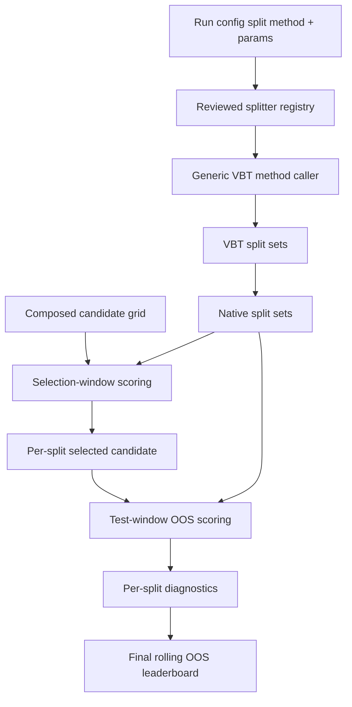
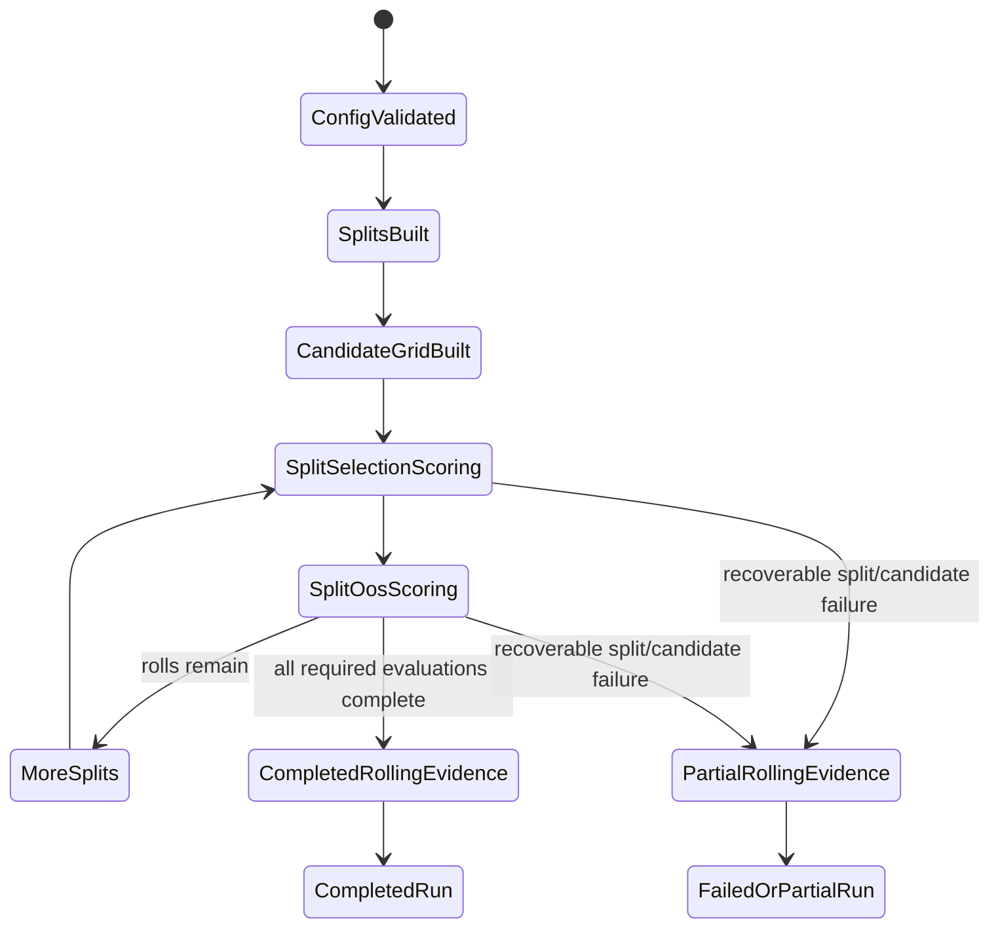

# feat: Add Run-Lane Rolling OOS Selection

## Summary

Add generic VBT splitter-method support to `aerd run` by extending the run-lane config contract, dynamically discovering VBT methods and params, generating public split-set evidence, normalizing fixed and sweep runs into candidate sets, scoring candidates through in-split windows, evaluating selected candidates on held-out windows, and publishing one concise split-based leaderboard with per-split diagnostics.

---

## Problem Frame

The current run lane ranks composed strategy candidates over one full historical sample. That is useful for exploration, but it does not answer whether a candidate selected from past data would have survived the next future window.

The existing train lane is legacy context, not a second surface this work should preserve. This plan improves run-lane OOS evidence without adding ML side support, and treats train-lane deletion as a near-term follow-up rather than a compatibility constraint.

---

## Requirements

**Run-lane rolling selection**
- R1. Run-lane configs support an optional top-level split block for strategy runs.
- R2. Run-lane split support calls VBT splitter constructor classmethods dynamically from config; current VBT splitter constructors are named `from_*`, so methods such as `from_rolling`, `from_purged_kfold`, and later compatible constructors can work through the same pipeline when their required params are supplied.
- R3. Config and evidence preserve exact VBT splitter method IDs such as `from_rolling`.
- R4. Aegis discovers VBT splitter method names and params for catalog, validation, and `aerd show splitters <method>` output, while denying only unsafe/internal params or methods that cannot be satisfied from config plus the source index.
- R5. Rolling selection/evaluation operates on the run's candidate set: playbook sweeps produce many composed strategy x indicator candidates, and fixed component runs are the same shape with one fixed candidate.
- R6. Candidate selection for each roll uses only that roll's selection window.
- R7. OOS leaderboard evidence is visibly distinct from the existing full-period historical leaderboard.
- R8. Public evidence records the VBT splitter identity plus enough split bounds or membership data for review.
- R9. Run-lane wording uses selection or optimization window language, not ML training language.

**Leaderboard and artifacts**
- R10. Output contains one concise final rolling OOS leaderboard plus per-split diagnostics, not a separate user-facing leaderboard artifact for every roll.
- R11. Candidate selection coverage is visible so one selected split is not presented as equivalent to repeated selection.
- R12. Partial split/candidate evidence is preserved when later rolling evaluations fail or are excluded.

**Train lane boundary**
- R13. This work does not add train-lane support or design abstractions around preserving label/model ML side support.
- R14. Train-lane split config, labelers, model plugins, train logic, and `--train` deletion are the intended near-term follow-up.

**Origin actors:** A1 Research user, A2 Planning or review agent, A3 Aegis run lane
**Origin flows:** F1 Rolling composed-candidate selection, F2 VBT splitter catalog selection
**Origin acceptance examples:** AE1 run-lane splitter method execution, AE2 split isolation, AE3 dynamic splitter method/param discovery, AE4 final leaderboard plus per-split diagnostics, AE5 partial evidence preservation, AE6 no train-lane expansion

---

## Scope Boundaries

- Do not add train-lane functionality, train-lane split support, label/model training support, or ML compatibility shims.
- Do not make the existing train `SplitConfig` the long-term abstraction for run-lane rolling OOS.
- Do not create a separate user-facing leaderboard artifact for every roll; keep per-roll output as diagnostics feeding one final OOS leaderboard.
- Do not pass unsafe/internal VBT kwargs just because they are discoverable.
- Do not imply `from_purged_kfold` or other VBT splitters require separate run-lane scoring routes; they should use the same scoring pipeline when VBT can build their split sets from config plus the source index.
- Do not add RL, contextual bandits, live allocation policy learning, or NautilusTrader runtime validation.
- Do not add automatic candidate promotion into component files.
- Do not make indicator-only promotion the primary v1 outcome.
- Do not create source-specific rolling semantics; component and playbook runs should normalize into the same candidate-set contract before rolling evaluation.

### Deferred to Follow-Up Work

- Train-lane removal: delete train split config, labelers, model plugins, train-lane execution logic, train docs/examples, and the `--train` flag in a separate near-term plan/PR.
- Additional VBT splitter methods: support dynamically when their VBT method signature can be satisfied safely; no separate scoring route should be needed.
- Candidate promotion persistence: add immutable approved-candidate definitions after OOS evidence is stable.
- Rolling retry/resume: add only after split/chunk diagnostics make failed work reproducible.

---

## Context & Research

### Relevant Code and Patterns

- `research/aegis_research/configuration/schema.py` owns lane config dataclasses; `StrategyRunLaneConfig` currently has no run split while `TrainLaneConfig` owns the legacy `SplitConfig`.
- `research/aegis_research/configuration/builders.py` builds typed lane configs and is the seam for an optional top-level run split.
- `research/aegis_research/configuration/validation.py` owns fail-fast path-aware config validation; `_lane_allowed_top_level_keys`, `_validate_strategy_run_lane`, and `_validate_split` are the relevant boundaries.
- `research/aegis_research/splits.py` contains train-oriented `vbt.Splitter.from_purged_kfold` support and public membership metadata helpers that can inform, but should not own, run-lane rolling semantics.
- `research/aegis_research/strategy_runs.py` owns `run_strategy_sweep`, playbook composed candidate orchestration, chunk diagnostics, artifact payloads, and leaderboard handoff.
- `research/aegis_research/candidate_sweeps.py` owns composed candidate IDs, candidate axes, and batched strategy signal materialization.
- `research/aegis_research/portfolios.py` owns VBT `Portfolio.from_signals` simulation and already accepts `market_index` so window slicing can preserve `next_open` non-executable signal semantics.
- `research/aegis_research/reports.py` owns central portfolio metrics and candidate-group metric extraction.
- `research/aegis_research/run_leaderboard.py` owns compact top-row ranking, central metric source enforcement, failure samples, and partial leaderboard summaries.
- `research/aegis_research/provenance/manifest.py` already has `ArtifactStatus.PARTIAL`, while run status currently has no partial state.
- `tests/integration/research/aegis_research/test_run_playbook_sources.py` is the primary integration test pattern for playbook run artifacts, composed candidate provenance, chunk failures, and no completed artifact on existing hard failures.
- `tests/integration/research/aegis_research/test_lane_config_contract.py` is the primary config validation and lane-boundary test pattern.
- `tests/unit/research/aegis_research/test_splits.py` is the existing splitter membership/resource-guard test pattern.
- `tests/unit/research/aegis_research/test_run_leaderboard.py` is the existing leaderboard ranking, provenance, and failure-summary test pattern.

### Institutional Learnings

- `docs/solutions/architecture-patterns/config-contract-security-reproducibility-2026-05-16.md`: validate config as a public fail-fast contract before data loading, side effects, VBT calls, or artifact writes.
- `docs/solutions/logic-errors/vectorbt-label-contract-target-lineage-2026-05-17.md`: preserve native VBT lineage and public split evidence before deriving simplified downstream artifacts.
- `docs/solutions/best-practices/forward-first-long-only-signal-contract-2026-05-18.md`: preserve full-market execution semantics when slicing windows so `next_open` does not bridge gaps or make terminal signals executable incorrectly.
- `docs/solutions/best-practices/vectorbt-combine-params-conditions-levels-2026-05-17.md`: keep concrete candidate params and identity inspectable before simulation.
- `docs/solutions/performance-issues/vectorbt-large-from-signals-chunking-memory-2026-05-17.md`: rolling OOS multiplies candidate workload, so budget checks and chunk diagnostics must be explicit.

### External References

- VectorBT PRO API source for `vectorbtpro.generic.splitting.base.Splitter.from_rolling`: method accepts `length`, `offset`, `offset_anchor`, `offset_anchor_set`, `split`, `freq`, and `set_labels` via `Splitter.from_splits` kwargs.
- VectorBT PRO examples commonly use `vbt.Splitter.from_rolling(index, length=..., split=..., set_labels=["train", "test"])`; Aegis should preserve the native method ID and native set labels in evidence while v1 run scoring requires exactly two materialized sets per split.

---

## Key Technical Decisions

- Run-specific split config: add an optional run-lane split config instead of expanding the train-lane `SplitConfig` abstraction, because train-lane removal is the intended near follow-up and rolling run semantics are different.
- Generic splitter invocation: config stores the exact VBT splitter `method` plus params, and Aegis calls the matching `vbt.Splitter` method through one generic invocation path.
- Dynamic param catalog: discover VBT splitter method params from Python signatures for validation and `aerd show splitters <method>` output, while keeping only a small safety layer for denied/internal params and required non-config context.
- Dynamic method support: any VBT splitter constructor classmethod can use the shared run-lane scoring and leaderboard pipeline when the method exists, params validate against its signature, Aegis can supply required context, and VBT returns usable split sets. In the current VBT API, these constructor methods are the `from_*` classmethods.
- Native split evidence: preserve VBT method ID, authored params, resolved defaults, native split labels, and public membership/bounds evidence; do not invent separate Aegis routes for `from_rolling`, `from_purged_kfold`, or other compatible methods.
- Selection/test isolation: reset portfolio state for each selection-window and test-window evaluation rather than carrying cash or positions from the selection window into OOS scoring.
- Candidate promotion unit: select candidate IDs, not standalone strategy params or indicator params; a fixed component run is a one-candidate set that should flow through the same rolling evaluator as a sweep.
- Per-roll output shape: compute per-split selection rankings and OOS metrics as diagnostics, then publish one final rolling OOS leaderboard.
- Primary OOS aggregation: rank the final rolling leaderboard by OOS-row-count-weighted mean of split-level OOS metric values, with the `weight_basis` recorded and stitched-window or stability evidence recorded as diagnostics rather than the first ranking key.
- Partial evidence policy: write recoverable rolling diagnostics as partial artifact evidence when some split/candidate evaluations fail, while avoiding a normal completed promotion-ready artifact for incomplete required evidence.
- Train-lane reviewer framing: do not preserve train-lane split, labeler, model plugin, or `--train` surfaces as side support for this work; removal is separate only for sequencing.

---

## Open Questions

### Resolved During Planning

- Does R10 mean a leaderboard per roll? No. Each roll records selection ranking and OOS diagnostics, and those diagnostics feed one final rolling OOS leaderboard.
- Should OOS evaluation inherit portfolio state from selection? No. Each selection and test evaluation resets portfolio state so test metrics are not contaminated by in-sample positions or cash.
- What is the primary OOS ranking aggregation? Use weighted mean of split-level OOS metric values as the final leaderboard primary metric, with selected split count and stability diagnostics alongside it.
- How should unsupported VBT splitters appear? A method is unsupported only when it is not a VBT splitter method, requires unsafe/internal params, or needs runtime context Aegis cannot supply from config plus the source index.
- Should train-lane removal be bundled into this implementation? No. This plan should not expand train-lane support, and removal should be a near-term separate plan/PR.
- Should rolling split care whether candidates came from a playbook or component? No. It should normalize both into the same candidate-set contract; fixed components are simply one-candidate runs.

### Deferred to Implementation

- Exact helper names and module factoring: keep rolling OOS orchestration out of the already-large `strategy_runs.py` where practical, but let implementation choose the smallest clear extraction.
- Exact default rolling step values: choose conservative defaults during implementation after verifying VBT `from_rolling` membership evidence; defaults should advance from the previous test/rightmost set rather than producing accidental test-window overlap unless explicitly configured otherwise.
- Exact partial artifact writer API: use the existing artifact status model where sufficient, and choose the smallest rolling-specific write path that can persist partial public evidence without introducing a broad provenance framework.
- Exact CLI output formatting: choose compact human and JSON shapes during implementation, but include method name, signature-derived params, defaults, required params, denied/internal params, and examples where available.

---

## High-Level Technical Design

> *This illustrates the intended approach and is directional guidance for review, not implementation specification. The implementing agent should treat it as context, not code to reproduce.*

Run split config shape at the planning level:

```yaml
split:
  method: from_rolling
  params:
    length: 252
    split: 0.8
    offset_anchor_set: -1
  max_splits: 100
  max_estimated_output_cells: 25000000
  max_public_artifact_bytes: 10000000
```

`method` names the VBT `Splitter` method to call. `params` are signature-valid kwargs passed to that VBT method. Aegis-owned guard fields stay outside `params` so they are not mistaken for VBT kwargs.
Only method-required or intentionally overridden evidence-shaping kwargs need to be authored; omitted optional kwargs use VBT defaults unless Aegis explicitly owns an internal safety override.



Rolling run state at the planning level:



---

## Implementation Units

### U1. Run Split Config and Dynamic Splitter Catalog

**Goal:** Add the public run-lane split contract, dynamic VBT splitter param catalog, and small safety denylist without treating the legacy train split as a reusable abstraction.

**Requirements:** R1, R2, R3, R4, R8, R9, R13, R14; F2; AE1, AE3, AE6

**Dependencies:** None

**Files:**
- Create: `research/aegis_research/run_splits.py`
- Create: `research/aegis_research/cli_commands/splitters.py`
- Modify: `research/aegis_research/cli.py`
- Modify: `research/aegis_research/configuration/schema.py`
- Modify: `research/aegis_research/configuration/builders.py`
- Modify: `research/aegis_research/configuration/validation.py`
- Modify: `research/aegis_research/config.py`
- Test: `tests/integration/research/aegis_research/test_lane_config_contract.py`
- Test: `tests/integration/research/aegis_research/test_cli.py`

**Approach:**
- Add optional top-level run `split` support to `StrategyRunLaneConfig` and the raw config builder.
- Use exact VBT splitter method naming for the runnable ID, with validation accepting real VBT splitter constructor classmethods. For the current VBT API, that means `vbt.Splitter.from_*` methods unless the method or params require unsafe/internal handling.
- Accept rolling splits for both playbook sweeps and fixed component runs by requiring both paths to normalize into the same candidate-set contract before rolling evaluation.
- Keep train-lane split config separate for now only because it still exists in the current code; do not add shared train/run split abstractions.
- Add dynamic discovery for VBT `Splitter` constructor classmethod names and their Python signatures; in current VBT these are `from_*` methods.
- Model method support as discovered method metadata plus generic VBT method invocation, not as a separate scoring or artifact pipeline.
- Keep a small deny/internal metadata layer for denied params and required context that cannot come from config; do not maintain a full static param list by hand.
- Add `aerd show splitters <method>` so users can inspect dynamically built params, defaults, denied/internal params, and examples before authoring config.
- Validate split params at the config boundary with path-aware `ConfigValidationError`s, JSON-like values, no executable/path keys, finite positive limits, and no aliases such as `walk_forward`.
- Validate authored params against the discovered method signature, deny unsafe/internal kwargs, and let VBT raise method-specific errors for invalid method combinations.

**Patterns to follow:**
- `configuration/validation.py` path-aware enum validation and `_validate_no_lane_executable_keys`.
- `docs/solutions/architecture-patterns/config-contract-security-reproducibility-2026-05-16.md` fail-fast config boundary guidance.

**Test scenarios:**
- Happy path: a run config with top-level `split.method: from_rolling` and `split.params` resolves as lane `run` and preserves the split config on `StrategyRunLaneConfig`.
- Error path: a run config with `split.method: walk_forward` fails before data loading and names supported run-lane IDs.
- Happy path: a run config with `split.method: from_purged_kfold` and signature-valid params can build VBT splits and enter the same scoring pipeline.
- Error path: a run config naming a method that is not a `vbt.Splitter.from_*` method fails before data loading.
- Error path: split params containing executable/path-like keys fail with path-aware config errors.
- Happy path: a component strategy run with `split.method: from_rolling` resolves as a valid one-candidate rolling run.
- Happy path: `aerd show splitters from_rolling --json` returns signature-derived params, defaults, required params, and denied/internal params.
- Error path: `aerd show splitters missing_method --json` returns a structured invocation/config error without importing run-lane execution.
- Integration: existing train-looking configs remain rejected by default `aerd run`, but error wording no longer implies train-lane preservation is strategic side support.

**Verification:**
- The run-lane resolver and `aerd show splitters` use the same dynamic splitter catalog, so users can discover params before config validation rejects missing, unsupported, or unsafe split input.

---

### U2. Generic Splitter Invocation and Public Evidence

**Goal:** Invoke configured VBT splitter methods, preserve their native split sets, and record portable evidence that reviewers can inspect without native object access.

**Requirements:** R2, R3, R4, R6, R8, R9, R10; F1, F2; AE1, AE2, AE3

**Dependencies:** U1

**Files:**
- Modify: `research/aegis_research/run_splits.py`
- Modify: `research/aegis_research/splits.py` if shared public membership helpers should be promoted instead of copied
- Test: `tests/unit/research/aegis_research/test_run_splits.py`

**Approach:**
- Add a run-specific split result type that preserves native VBT split/set labels and positions in evidence.
- Use one generic `vbt.Splitter` method caller: lookup `split.method`, pass the source index plus signature-valid `split.params`, then convert `splitter.take(index)` into normalized run split records.
- Normalize VBT splitter output into one common split-record shape consumed by scoring; no splitter-specific scoring or artifact path should be needed for compatible methods.
- Validate generic output invariants that the scoring pipeline needs: exactly two non-empty split sets per split, first set for in-split ranking, second set for held-out evaluation, split count/resource limits, and bounded public evidence size.
- Record the exact VBT method ID, accepted params, native set labels, source index identity, split count, per-split row counts, bounds, and compact membership representation.
- Keep native splitter objects out of durable public artifacts; public metadata should be enough to audit split membership.

**Patterns to follow:**
- `splits.py` `_membership_representation`, `_resource_estimate`, and `_public_time_value` patterns.
- `docs/solutions/logic-errors/vectorbt-label-contract-target-lineage-2026-05-17.md` native lineage preservation guidance.

**Test scenarios:**
- Happy path: generic invocation calls `vbt.Splitter.from_rolling` from `split.method`/`split.params` and creates multiple split records with exact VBT method ID and native set labels.
- Happy path: generic invocation calls `vbt.Splitter.from_purged_kfold` from `split.method`/`split.params` and produces split records through the same output normalization path.
- Happy path: split evidence includes row counts, source index identity, bounds, and membership representation under artifact limits.
- Edge case: empty selection or empty test output from an invalid rolling config fails before candidate scoring.
- Edge case: output with anything other than two sets, or empty required sets, fails before candidate scoring because the scoring pipeline cannot separate ranking from held-out evaluation unambiguously.
- Edge case: split count above the configured max fails with a resource-guard error.
- Error path: non-monotonic or duplicate time indexes fail if VBT or Aegis cannot produce auditable rolling windows safely.

**Verification:**
- Run-lane split construction is independent from train-lane state; methods that need optional prediction/evaluation times can use VBT defaults or future config-supplied context without invoking the train lane.

---

### U3. Rolling Candidate Selection and OOS Scoring

**Goal:** Insert rolling OOS orchestration after candidate normalization so each split selects from the run's candidate set on selection-window metrics and evaluates the selected candidate on the next test window.

**Requirements:** R5, R6, R7, R9, R10, R11, R12; F1; AE1, AE2, AE4, AE5

**Dependencies:** U1, U2

**Files:**
- Create: `research/aegis_research/rolling_oos.py`
- Modify: `research/aegis_research/strategy_runs.py`
- Modify: `research/aegis_research/portfolios.py` only if a small window-simulation helper is needed
- Test: `tests/integration/research/aegis_research/test_run_playbook_sources.py`

**Approach:**
- Branch the strategy run path when `config.split` is present, replacing the normal full-period leaderboard with rolling OOS output unless implementation also adds clearly labeled historical diagnostics.
- Normalize fixed component output and playbook sweep output into one candidate-set contract before rolling scoring: fixed component runs produce one candidate with one signal surface, while playbook sweeps produce many candidate IDs and batched signal surfaces.
- Use a batch-outer loop where practical: materialize full-index candidate signals once per candidate or candidate batch, then slice entries, exits, market data, and Open prices per selection/test window for portfolio and metric evaluation.
- Score all candidates for each selection window using existing VBT portfolio simulation and central metric extraction patterns.
- Select the top candidate per split by the configured run ranking metric and direction, with deterministic candidate-ID tie handling.
- For a one-candidate fixed run, the same selection rule selects that candidate in each split where its selection-window metric is available.
- Evaluate the selected candidate on that split's future test window with clean portfolio state and central metric extraction.
- Slice market, entries, exits, and Open prices to the active window while preserving the full market index for `next_open` executability diagnostics.
- Add split-aware preflight diagnostics estimating batch candidate count, symbol count, materialized frame count, split count, and total selection/test rows so rolling workloads fail before expensive portfolio simulation when over budget.
- Record failed, excluded, missing-metric, and selected states per split/candidate so partial evidence survives without becoming a completed false winner.
- Keep full-period historical scoring either absent in rolling mode or clearly separated as historical diagnostics; do not mix it into the rolling OOS leaderboard.

**Execution note:** Start with characterization or integration tests that prove test-window performance cannot change which candidate was selected for that split.

**Patterns to follow:**
- `strategy_runs.py` `_resolve_strategy_ref`, `_run_playbook_strategy_sweep`, candidate records, candidate batching, and chunk diagnostics.
- `candidate_sweeps.py` composed candidate IDs and materialized candidate signal contract for multi-candidate sweeps.
- `portfolios.py` `simulate_portfolio_batch` and `market_index` execution-timing contract.

**Test scenarios:**
- Covers AE1. Happy path: `aerd run` with `split.method: from_rolling` evaluates playbook composed candidates through rolling windows and writes run-lane rolling evidence.
- Covers AE1. Happy path: `aerd run` with `split.method: from_rolling` evaluates a fixed component strategy as a one-candidate rolling run and writes the same rolling evidence shape.
- Covers AE2. Leakage guard: construct candidates where one candidate wins only because of test-window performance, and assert selection still chooses the candidate with better selection-window metric.
- Covers AE2. OOS guard: mutate selection-window performance after selection and assert the reported OOS value still comes from the test window.
- Edge case: a candidate missing the primary ranking metric in a selection window is excluded for that split and recorded with a reason.
- Edge case: a split with no selectable candidates records split-level failure/exclusion evidence and does not produce a selected OOS row.
- Error path: rolling preflight rejects excessive split x candidate x symbol x row workloads before portfolio simulation.
- Error path: a signal materialization or portfolio failure in one split records split/candidate context and preserves previous successful split evidence.
- Integration: component strategy run behavior without `split` remains the existing full-period run path; component strategy runs with `split` use rolling OOS evaluation with a one-candidate set.

**Verification:**
- Rolling selection and OOS scoring use the same central portfolio/metric source as the current run lane while enforcing selection/test isolation per split.

---

### U4. Final Rolling OOS Leaderboard Aggregation

**Goal:** Build one concise final rolling OOS leaderboard from split-level OOS evidence while exposing selection coverage and stability diagnostics.

**Requirements:** R7, R10, R11, R12; F1; AE2, AE4, AE5

**Dependencies:** U3

**Files:**
- Modify: `research/aegis_research/run_leaderboard.py`
- Create: `research/aegis_research/rolling_leaderboard.py` only if extending the existing leaderboard module would make the shared ranking code unclear
- Modify: `research/aegis_research/strategy_runs.py`
- Test: `tests/unit/research/aegis_research/test_run_leaderboard.py`
- Test: `tests/integration/research/aegis_research/test_run_playbook_sources.py`

**Approach:**
- Aggregate split-level OOS records by candidate ID.
- Rank final rows by OOS-row-count-weighted mean of the configured OOS metric across successful selected test windows, and record `weight_basis` in leaderboard provenance.
- Include selected split count, eligible split count, failed/excluded count, OOS metric dispersion, and references to per-split diagnostics so repeated selection is visibly different from one-off selection.
- Preserve central metric source expectations and compact top-row behavior from the current run leaderboard.
- Keep per-split selection rankings as diagnostics feeding the final leaderboard, not as separate official leaderboard artifacts per roll.
- Record whether the final leaderboard is complete or partial based on split/candidate failures and missing required metrics.

**Patterns to follow:**
- `run_leaderboard.py` ranking direction, top-row limit, failure samples, central metric source enforcement, and compact provenance rows.
- `docs/plans/2026-05-20-003-feat-vbt-native-batched-playbooks-plan.md` normalized catalogs plus compact leaderboard refs.

**Test scenarios:**
- Happy path: a candidate selected in six splits ranks with `selected_split_count` visibly greater than a candidate selected once.
- Happy path: final rows are ordered by weighted mean OOS metric according to configured direction.
- Edge case: unequal test-window lengths produce ranking according to the documented OOS row-count weight basis.
- Edge case: a candidate selected once with an excellent OOS metric does not hide its low selection coverage.
- Edge case: rows preserve candidate provenance, strategy params, indicator candidate refs when present, metric refs, and central metric source.
- Error path: missing OOS metric excludes a split/candidate from final ranking and records a failure sample.
- Integration: rolling artifact contains one final OOS leaderboard plus per-split diagnostics rather than multiple user-facing leaderboard artifacts.

**Verification:**
- Research users can distinguish rolling OOS survivors from full-period historical winners and can inspect how many rolls contributed to each final row.

---

### U5. Rolling Artifact and Partial Evidence Policy

**Goal:** Persist rolling split, scoring, diagnostics, and partial-failure evidence without confusing incomplete runs with promotion-ready completed artifacts.

**Requirements:** R7, R8, R10, R11, R12, R13, R14; F1, F2; AE3, AE4, AE5, AE6

**Dependencies:** U2, U3, U4

**Files:**
- Modify: `research/aegis_research/strategy_runs.py`
- Modify: `research/aegis_research/provenance/experiment_artifacts.py` only if the existing strategy artifact path cannot mark rolling evidence partial cleanly
- Modify: `research/aegis_research/provenance/manifest.py` only if existing artifact status and shape metadata are insufficient
- Test: `tests/integration/research/aegis_research/test_run_playbook_sources.py`
- Test: `tests/integration/research/aegis_research/test_provenance.py` if artifact partial status behavior needs direct coverage

**Approach:**
- Extend strategy run artifacts to include rolling splitter evidence, rolling diagnostics, OOS leaderboard, candidate catalogs or records, chunk diagnostics, signal diagnostics, and portfolio diagnostics.
- Plan the rolling strategy artifact before rolling evaluation begins, persist partial `strategy_run.json` evidence after completed splits or chunks where feasible, and mark incomplete rolling evidence with existing artifact partial status when required split/candidate evaluations did not all complete.
- Preserve manifest evidence for the active split/chunk stage as the run progresses so failures before final artifact write still expose context.
- Keep completed artifact semantics strict: a normal completed rolling artifact means required rolling evaluations and final OOS leaderboard gates completed.
- Ensure partial evidence includes enough context for debugging and review, but does not appear as an authoritative completed promotion result.

**Patterns to follow:**
- `strategy_runs.py` `_write_strategy_artifact`, `_strategy_artifact_shape`, chunk diagnostics, and manifest evidence updates.
- `provenance/manifest.py` `ArtifactStatus.PARTIAL` and artifact shape metadata.
- Existing `test_run_cli_records_failed_batched_chunk_candidate_context` expectations for failure context preservation.

**Test scenarios:**
- Happy path: completed rolling run writes `strategy_run.json` with splitter evidence, final OOS leaderboard, per-split diagnostics, and rolling-aware shape metadata.
- Covers AE5. Partial path: a later split/candidate failure preserves earlier successful split diagnostics and marks the artifact/evidence as partial rather than completed.
- Error path: failure before splits are built records config or split preflight failure in manifest evidence and writes no misleading completed strategy artifact.
- Error path: a partial rolling artifact cannot be consumed as a completed native/public artifact by existing provenance validation.
- Integration: existing non-rolling full-period run artifacts keep their current schema behavior unless rolling mode is enabled.

**Verification:**
- Partial rolling evidence is visible and reproducible, while completed rolling evidence remains strict enough for candidate promotion decisions.

---

### U6. Docs, Examples, and Reviewer Guidance

**Goal:** Document the run-lane rolling OOS contract and prevent review confusion about train-lane side support.

**Requirements:** R3, R4, R7, R9, R10, R13, R14; F1, F2; AE3, AE4, AE6

**Dependencies:** U1, U2, U3, U4, U5

**Files:**
- Modify: `research/configs/README.md`
- Modify: `research/configs/rsi_playbook_dry_run.yaml` or add a nearby rolling example if mutating the dry-run config would disrupt existing examples
- Modify: `docs/playbooks.md`
- Modify: `README.md` if CLI-level run-lane docs mention train-lane guidance
- Test expectation: none -- documentation-only changes should be reviewed against implemented artifact and config names

**Approach:**
- Document that `split.method` names the VBT splitter method, `split.params` are discovered dynamically through `aerd show splitters <method>`, and compatible VBT methods use the same run-lane scoring pipeline.
- Explain that each roll produces selection/OOS diagnostics and one final rolling OOS leaderboard, not a separate official leaderboard artifact per roll.
- Use selection/test wording and avoid train/test language for run-lane rolling evidence.
- State clearly that label/model train-lane support is legacy and scheduled for removal, not side support that rolling OOS must preserve.

**Patterns to follow:**
- Existing config docs that show schema-versioned YAML and lane-specific examples.
- The updated origin requirements doc at `docs/brainstorms/2026-05-21-run-lane-vbt-rolling-splitter-requirements.md`.

**Test scenarios:**
- Test expectation: none -- documentation should be checked manually against config validation and artifact output tests from U1 through U5.

**Verification:**
- A reviewer can understand the rolling run-lane contract, final leaderboard shape, and train-lane removal framing without reading implementation code.

---

## System-Wide Impact

- **Interaction graph:** Run config validation, VBT splitter method invocation, candidate normalization, portfolio simulation, metric extraction, leaderboard aggregation, artifact writing, and CLI run output all interact in rolling mode.
- **Error propagation:** Config and split-catalog errors should fail before side effects; split/candidate execution errors should preserve manifest and partial artifact evidence when recoverable; completed rolling artifacts should remain strict.
- **State lifecycle risks:** Rolling mode multiplies evaluation loops, so split/chunk diagnostics must be updated incrementally enough to survive mid-run failure without leaving stale completed artifacts.
- **API surface parity:** Typed config constructors, raw YAML loading, resolved config reexports, CLI output, public artifacts, and docs need the same run split vocabulary.
- **Integration coverage:** Unit tests prove split and leaderboard math, but integration tests must prove end-to-end selection/test isolation through fixed component signals, playbook sweep signals, VBT portfolio simulation, metrics, and artifacts.
- **Unchanged invariants:** Existing no-split run-lane behavior remains full-period historical scoring; strategy and indicator playbooks still cannot provide authoritative portfolio metrics; central VBT portfolio metrics remain the ranking source.

---

## Risks & Dependencies

| Risk | Mitigation |
|------|------------|
| Selection/test leakage through full-period portfolio state | Reset portfolio state per selection/test window and test that test-window performance cannot influence selection. |
| Signal or `next_open` semantics drift when slicing windows | Preserve full market index in window simulations and carry forward existing non-executable signal diagnostics. |
| Rolling OOS multiplies runtime and memory costs | Add split-aware preflight budgets and reuse candidate batching/chunk diagnostics. |
| VBT splitter parameter flexibility produces ambiguous or unusable outputs | Validate params against the VBT signature, deny unsafe/internal kwargs, and validate actual VBT-generated split evidence before scoring. |
| Partial artifacts look like promotion-ready results | Use artifact partial status and explicit leaderboard completeness/failure status for incomplete rolling evidence. |
| Reviewers infer train-lane side support is required | State in requirements, plan, and docs that train lane is legacy and scheduled for removal, not a support constraint. |

---

## Alternative Approaches Considered

- Reuse train `SplitConfig` for run rolling splits: rejected because train-lane removal is planned soon and run-lane selection/test semantics should not inherit ML validation language.
- Publish a leaderboard per roll: rejected because the desired UX is one final leaderboard plus inspectable per-split diagnostics.
- Simulate full-period portfolios once and slice metrics after the fact: rejected because portfolio state, cash, and positions can leak across selection/test boundaries.
- Use stitched test-window portfolio as primary rank: rejected for v1 primary ranking because selected split coverage and per-window metric availability are clearer with weighted split-level aggregation; stitched evidence can remain diagnostic.
- Bundle train-lane deletion into this feature: rejected for sequencing because it would turn a rolling OOS implementation into a broad CLI/config/model removal, but the removal should follow soon.

---

## Success Metrics

- A run config using `split.method: from_rolling` produces rolling OOS evidence without invoking or expanding train-lane code.
- The final rolling leaderboard can be read as OOS evidence and cannot be confused with full-period historical ranking.
- Per-split diagnostics prove which candidate was selected in each roll, why it was selected, and how it performed OOS.
- Unsupported VBT splitters fail validation before execution even when their method names are discoverable.
- Partial rolling failures preserve successful split evidence without producing a normal completed promotion-ready artifact.

---

## Documentation / Operational Notes

- Update docs and examples after implementation names are final so users see the exact accepted run split fields.
- Add a follow-up plan for train-lane removal immediately after this plan if it is not already covered by a separate issue.
- Do not add train-lane compatibility language to the rolling OOS docs; describe train-lane surfaces as legacy pending deletion.

---

## Sources & References

- **Origin document:** [docs/brainstorms/2026-05-21-run-lane-vbt-rolling-splitter-requirements.md](../brainstorms/2026-05-21-run-lane-vbt-rolling-splitter-requirements.md)
- Related code: `research/aegis_research/configuration/schema.py`
- Related code: `research/aegis_research/configuration/builders.py`
- Related code: `research/aegis_research/configuration/validation.py`
- Related code: `research/aegis_research/splits.py`
- Related code: `research/aegis_research/strategy_runs.py`
- Related code: `research/aegis_research/candidate_sweeps.py`
- Related code: `research/aegis_research/portfolios.py`
- Related code: `research/aegis_research/run_leaderboard.py`
- Related tests: `tests/integration/research/aegis_research/test_lane_config_contract.py`
- Related tests: `tests/integration/research/aegis_research/test_run_playbook_sources.py`
- Related tests: `tests/unit/research/aegis_research/test_splits.py`
- Related tests: `tests/unit/research/aegis_research/test_run_leaderboard.py`
- Institutional learning: `docs/solutions/architecture-patterns/config-contract-security-reproducibility-2026-05-16.md`
- Institutional learning: `docs/solutions/logic-errors/vectorbt-label-contract-target-lineage-2026-05-17.md`
- Institutional learning: `docs/solutions/best-practices/forward-first-long-only-signal-contract-2026-05-18.md`
- Institutional learning: `docs/solutions/performance-issues/vectorbt-large-from-signals-chunking-memory-2026-05-17.md`
- External API: `vectorbtpro.generic.splitting.base.Splitter.from_rolling`
