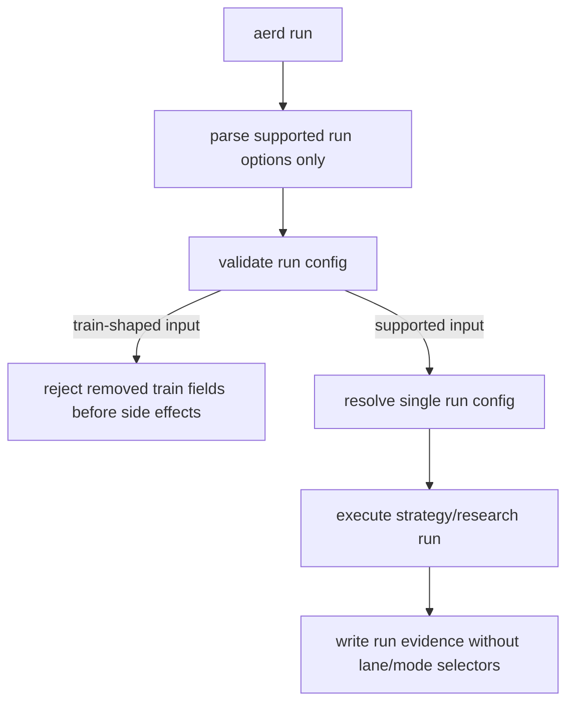
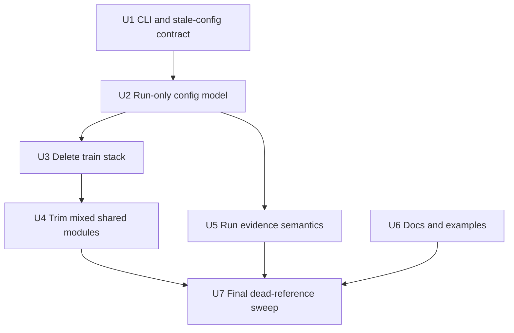

# refactor: Remove Train Lane

## Summary

Collapse Aegis to a single `aerd run` execution path by deleting the train command branch, train config model, model-plugin/label training stack, train-only artifacts, and active docs/examples. Preserve the existing strategy/research run path while removing `lane`/`mode` selectors that only existed to distinguish run from train.

---

## Problem Frame

The origin requirements define train/model/label support as legacy carrying cost, not a supported second product path. The plan must therefore remove both user-facing train affordances and importable train execution APIs while protecting the current strategy/research run behavior.

---

## Requirements

- R1. `aerd run` remains the only supported command path for executing Aegis research configs.
- R2. `--train` is removed from the active CLI contract.
- R3. Active command output, structured results, artifacts, config evidence, and docs do not describe `run` as one lane or mode among multiple active execution paths.
- R4. Existing strategy/research run behavior remains supported.
- R5. Model-plugin training, registry, built-in plugin path, training orchestration, probability validation, and model export surfaces are removed as active capabilities.
- R6. Train labels, labeler config semantics, label components, label target artifacts, and label/model compatibility behavior are removed as active capabilities.
- R7. Stale train-shaped configs fail fast as unsupported inputs, without compatibility shims or guidance to use another active training command.
- R8. Active docs and examples describe the single run path and remove train-mode/model-plugin/train-label guidance.
- R9. Active code and tests prefer single-path naming where practical.
- R10. Historical brainstorms, plans, and solution notes may remain as dated records.
- R11. The cleanup introduces no compatibility shims, migration adapters, or legacy fallback execution.
- R12. Shared utilities survive only when still required by the single run path.

**Origin actors:** A1 Research user, A2 Planning or implementation agent, A3 Aegis run path
**Origin flows:** F1 Single canonical run execution, F2 Legacy train-shaped config rejection, F3 Documentation and example cleanup
**Origin acceptance examples:** AE1 valid strategy/research run, AE2 removed `--train`, AE3 stale train config rejection, AE4 active docs/examples cleanup, AE5 historical records preserved

---

## Scope Boundaries

- Do not add a replacement supervised ML training workflow.
- Do not migrate old train configs or preserve them through compatibility behavior.
- Do not expand rolling OOS implementation while performing this cleanup.
- Do not redesign live trading, NautilusTrader execution, RL, contextual bandits, or allocation policy learning.
- Do not rewrite historical `docs/brainstorms/`, `docs/plans/`, or `docs/solutions/` records except to avoid current-doc confusion.
- Do not delete strategy, indicator, candidate, portfolio, metric, leaderboard, manifest, or provenance behavior still required by supported `aerd run` research execution.

### Deferred to Follow-Up Work

- Optional deeper naming polish after deletion: If implementation leaves harmless internal names such as `SignalConfig` or `StrategyRunLaneConfig` temporarily to avoid broad churn, a later refactor can rename them after the train stack is gone and tests are green.

---

## Context & Research

### Relevant Code and Patterns

- `research/aegis_research/cli_commands/run.py` is the command split point: `--train`, `args.train`, `_handle_train_run()`, `_human_train_lines()`, `_label_result_builder()`, and `_indicator_result_builder()` are train-path surfaces; `_handle_strategy_run()` and `run_strategy_sweep()` are the path to preserve.
- `research/aegis_research/configuration/schema.py`, `research/aegis_research/configuration/builders.py`, `research/aegis_research/configuration/resolution.py`, and `research/aegis_research/configuration/validation.py` encode the lane split, `TrainLaneConfig`, train model config, labeler config, and stale train guidance.
- `research/aegis_research/strategy_runs.py` is the canonical run engine to preserve, but it currently emits `lane: run`, checks `config.lane`, and writes strategy artifacts with lane evidence. The current run-split diff adds more `"lane": "run"` returns and artifact payload fields in split execution paths; remove those alongside the pre-existing lane evidence.
- New run-split support in `research/aegis_research/cli_commands/splitters.py`, `research/aegis_research/run_splits.py`, `research/aegis_research/split_leaderboard.py`, and `tests/unit/research/aegis_research/test_run_splits.py` is run-path infrastructure to preserve, not train-lane support.
- Train-only stack to delete: `research/aegis_research/training.py`, `research/aegis_research/experiments.py`, `research/aegis_research/validation.py`, `research/aegis_research/splits.py`, `research/aegis_research/labels.py`, `research/aegis_research/models.py`, `research/aegis_research/model_contracts.py`, `research/aegis_research/model_registry.py`, `research/aegis_research/model_export.py`, and `research/aegis_research/model_plugins/`.
- Mixed modules to trim carefully: `research/aegis_research/provenance/experiment_artifacts.py`, `research/aegis_research/reports.py`, `research/aegis_research/indicators.py`, `research/aegis_research/market_data/loading.py`, `research/aegis_research/component_registry/`, and `research/aegis_research/metrics/`.
- Run-specific split support lives in `research/aegis_research/run_splits.py` and should not be confused with train-only `research/aegis_research/splits.py`.
- Active docs/examples with train references include `README.md`, `docs/vectorbt-scaffold.md`, `docs/components.md`, `docs/playbooks.md`, `docs/model-plugins.md`, `docs/examples/model_plugins/`, `docs/examples/components/label_component_example.py`, and `docs/examples/scaffold_experiment_walkthrough.ipynb`. The current `docs/vectorbt-scaffold.md` diff bumps the schema version while still saying configs declare `lane: run` or `lane: train`; rewrite that guidance rather than only updating the version.

### Institutional Learnings

- `docs/solutions/architecture-patterns/config-contract-security-reproducibility-2026-05-16.md`: keep config validation path-aware, inert, and pre-side-effect; removed train fields should fail before run directories, downloads, or artifacts.
- `docs/solutions/best-practices/forward-first-long-only-signal-contract-2026-05-18.md`: removed config fields should stay removed; do not add compatibility branches for old train surfaces.
- `docs/solutions/architecture-patterns/model-plugin-target-probability-contract-2026-05-17.md` and `docs/solutions/logic-errors/vectorbt-label-contract-target-lineage-2026-05-17.md`: these describe the train stack being removed; treat them as historical context for deletion boundaries, not as reasons to preserve model plugins or train labels.

### External References

- No external research used; this is an internal simplification grounded in the origin requirements and current codebase.

---

## Key Technical Decisions

- Remove `lane` as a public selector, not just `train`: A single path does not need users or artifacts to distinguish `run` from a removed path. Active configs should no longer require or accept `lane: run`; stale `lane: train` is rejected as unsupported training config.
- Remove output `mode`/`lane` evidence where it only expresses the old split: Human output and JSON payloads should report run identity, status, artifacts, and evidence type without claiming a mode or lane.
- Preserve evidence names that describe artifacts, not modes: Terms like strategy evidence, leaderboard, split evidence, and portfolio diagnostics can remain because they describe what was produced rather than which command lane was selected.
- Preserve run-split roles while avoiding train semantics: Split scoring should expose Aegis roles such as selection and held-out; any native VBT set labels like `train`/`test` should remain clearly native splitter labels, not user-facing Aegis train/run mode language.
- Delete importable train APIs: Removing only the CLI would leave a hidden supported path. `run_training`, `run_experiment`, model registries, model exports, labels, train splits, validation, and model plugins should be deleted unless a symbol is demonstrably required by the run path.
- Keep run-path execution timing behavior: `SignalConfig` is train-adjacent in history but still carries execution timing into portfolio simulation. Preserve the behavior first; rename only if it can be done without widening the cleanup.
- Bump the config schema version from the current in-code value: Removing `lane` and train fields is a public config contract change, so the active schema version should advance with docs/examples updated to the new shape.
- Delete train tests instead of rewriting them into compatibility tests: New tests should assert unsupported train inputs fail fast; old successful train execution tests should be removed.

---

## Open Questions

### Resolved During Planning

- Should `lane: run` remain accepted as harmless metadata? No. The plan treats single-path semantics as removing `lane` from active configs, while preserving historical docs that mention it.
- Should model plugins or train labels survive as hidden Python APIs? No. The origin explicitly removes model plugins and train labels, so importable train execution surfaces should be deleted.
- Should active docs be cleaned but dated plans/brainstorms rewritten? No. Active guidance changes; historical records remain dated context.
- Should stale train configs create failed run manifests? No. They should fail during config/CLI validation before execution and before run directory creation.
- Should `aerd show splitters` be removed because `aerd run` is the only execution path? No. It is a catalog/inspection command for run split config, not an alternate execution lane.

### Deferred to Implementation

- Exact replacement names for remaining run config dataclasses and resolver functions: Choose the smallest clear names while removing lane semantics; avoid broad renames that do not improve the single-path contract.
- Exact structured parse error shape for removed `--train`: Preserve the CLI support layer's existing JSON/text error conventions where possible.
- Exact split between deleting and renaming mixed artifact helpers: If a mixed module becomes a one-method shell after train deletion, either fold it into the run path or rename it to a neutral artifact writer.

---

## High-Level Technical Design

> *This illustrates the intended approach and is directional guidance for review, not implementation specification. The implementing agent should treat it as context, not code to reproduce.*

---

## Implementation Units

### U1. CLI and Stale-Config Contract

**Goal:** Remove `--train` from the command surface and lock the failure behavior for train-shaped inputs before deleting deeper train code.

**Requirements:** R1, R2, R3, R7, R11; covers F1, F2, AE1, AE2, AE3

**Dependencies:** None

**Files:**
- Modify: `research/aegis_research/cli_commands/run.py`
- Modify: `research/aegis_research/cli.py`
- Preserve/update: `research/aegis_research/cli_commands/splitters.py`
- Modify: `research/aegis_research/cli_support/errors.py` if parse-error routing needs existing structured-output support
- Test: `tests/integration/research/aegis_research/test_cli.py`
- Test: `tests/integration/research/aegis_research/test_lane_config_contract.py`
- Test: `tests/integration/research/aegis_research/test_strategy_run.py`

**Approach:**
- Delete the parser registration for `-t` / `--train`, the `args.train` branch, train-specific imports, train human output, and train result payload enrichment.
- Replace model-training guidance with fail-fast unsupported-training errors for train-shaped config fields.
- Keep run invocation behavior and run error handling intact.
- Keep `aerd show splitters` available as a non-execution helper command, while avoiding any wording that implies train is an executable lane.
- Assert stale train configs are rejected before run start callbacks, run directory creation, data loading, component execution, or artifact writes.

**Execution note:** Start with characterization tests for removed `--train` and stale train-shaped configs so later deletions are guarded by expected failure behavior.

**Patterns to follow:**
- `ConfigCliError` and `ConfigValidationIssue` path-aware failures.
- Existing `--json` structured error behavior in CLI integration tests.

**Test scenarios:**
- Covers AE1. Happy path: a valid strategy/research config passed to `aerd run` still completes and returns run status plus leaderboard evidence.
- Covers AE2. Error path: `aerd run --train <config>` is rejected as an unsupported option or invocation, with no train execution attempted.
- Covers AE2. Error path: `aerd run <config> --train` is rejected consistently with the removed flag contract.
- Covers AE3. Error path: a stale config with top-level `train`, `model`, `labeler`, `labels`, `label`, `signals`, or `lane: train` fails before any run directory exists.
- Error path: JSON-mode invocation reports a structured error without suggesting `aerd run --train`.

**Verification:**
- CLI users have no accepted `--train` path.
- Train-shaped configs fail as unsupported inputs before side effects.
- Existing supported run CLI tests still pass after expected output updates.

### U2. Run-Only Config Model

**Goal:** Collapse config schema, builders, resolution, validation, and public exports from dual-lane to single-run semantics.

**Requirements:** R1, R3, R4, R7, R9, R11, R12; covers F1, F2, AE1, AE3

**Dependencies:** U1

**Files:**
- Modify: `research/aegis_research/configuration/schema.py`
- Modify: `research/aegis_research/configuration/builders.py`
- Modify: `research/aegis_research/configuration/resolution.py`
- Modify: `research/aegis_research/configuration/validation.py`
- Modify: `research/aegis_research/config.py`
- Modify: `research/aegis_research/metrics/contracts.py`
- Modify: `research/aegis_research/metrics/registry.py`
- Test: `tests/integration/research/aegis_research/test_config_contract.py`
- Test: `tests/integration/research/aegis_research/test_lane_config_contract.py`
- Test: `tests/integration/research/aegis_research/test_cli_docs.py`

**Approach:**
- Remove `LANES`, `TrainLaneConfig`, `TrainModelConfig`, `LabelerConfig`, train-only `SplitConfig`, label/model constants, train source kinds, and train validation helpers.
- Convert resolution to build only the supported run config shape and remove `expected_lane` as an active selector.
- Remove top-level `lane` from accepted config keys; reject both `lane: train` and stale `lane: run` as removed lane semantics.
- Bump the config schema version and update current fixtures/examples to the new run-only shape.
- Collapse metric registry lane support to the single active run context, or remove the lane filter entirely if every metric is now run-only.

**Patterns to follow:**
- `_validate_known_keys()` and path-specific `ConfigValidationIssue` errors.
- Existing config resolution provenance with authored/resolved redaction.

**Test scenarios:**
- Happy path: resolving a current run config without `lane` returns the supported run config object and preserves config manifest evidence.
- Error path: `lane: train` fails as unsupported training configuration before config object construction.
- Error path: `lane: run` fails as removed lane selector rather than being silently tolerated.
- Error path: `train.model`, top-level `model`, `labeler`, and `labels` each produce path-specific unsupported-field issues.
- Integration: metric ranking validation still accepts run metrics after train metric lanes are removed.

**Verification:**
- Public config exports no longer expose train or lane types.
- Config fixtures and active examples use the new schema version and no `lane` key.
- Run config validation remains fail-fast and side-effect-free.

### U3. Delete Train Execution, Model, and Label Stack

**Goal:** Remove the importable train execution path and train-only model/label modules so there is no hidden supported ML training capability.

**Requirements:** R5, R6, R11, R12; covers F2, AE2, AE3

**Dependencies:** U2

**Files:**
- Delete: `research/aegis_research/training.py`
- Delete: `research/aegis_research/experiments.py`
- Delete: `research/aegis_research/validation.py`
- Delete: `research/aegis_research/splits.py`
- Delete: `research/aegis_research/labels.py`
- Delete: `research/aegis_research/models.py`
- Delete: `research/aegis_research/model_contracts.py`
- Delete: `research/aegis_research/model_registry.py`
- Delete: `research/aegis_research/model_export.py`
- Delete: `research/aegis_research/model_plugins/`
- Delete: `tests/integration/research/aegis_research/test_train_cli.py`
- Delete: `tests/unit/research/aegis_research/test_labels.py`
- Delete: `tests/unit/research/aegis_research/test_models.py`
- Delete: `tests/unit/research/aegis_research/test_model_plugins.py`
- Delete: `tests/unit/research/aegis_research/test_splits.py`
- Delete: `tests/unit/research/aegis_research/test_signals.py`
- Delete: `tests/unit/research/aegis_research/test_validation_artifacts.py`
- Delete: `tests/e2e/research/aegis_research/test_experiment_provenance.py`
- Delete: `tests/e2e/research/aegis_research/test_experiments_purged.py`
- Delete: `tests/e2e/research/aegis_research/test_model_export.py`
- Delete: `tests/e2e/research/aegis_research/test_model_plugin_example.py`
- Delete: `tests/support/research/aegis_research/model_plugin_fixtures.py`
- Delete: `tests/support/research/aegis_research/label_result_fixtures.py`
- Delete: `tests/support/research/aegis_research/fixtures/experiments/synthetic_ml_scaffold_fixture.yaml`
- Delete: `tests/support/research/aegis_research/fixtures/experiments/synthetic_purged_fixlb_scaffold_fixture.yaml`

**Approach:**
- Delete train modules only after U1 and U2 provide unsupported-input coverage.
- Remove imports from package exports and tests rather than leaving aliases or stub modules.
- Keep similarly named run split code in `research/aegis_research/run_splits.py` intact.

**Patterns to follow:**
- Forward-first deletion: no placeholder modules that keep old imports alive.
- Preserve run-path tests as the source of truth for supported behavior.

**Test scenarios:**
- Error path: importing public config exports no longer exposes train/model/label objects.
- Integration: train-shaped configs still fail through validation after modules are deleted.
- Integration: run split tests continue to use `research/aegis_research/run_splits.py`, proving old train split deletion did not remove run split support.

**Verification:**
- No active source import references remain for deleted train modules.
- No successful train execution tests remain.
- Supported run tests still execute without model registry or label fixtures.

### U4. Trim Mixed Shared Modules

**Goal:** Remove train-only branches from modules that also contain run-path behavior, preserving only utilities still required by `aerd run`.

**Requirements:** R4, R5, R6, R9, R12; covers F1, F2, AE1, AE3

**Dependencies:** U3

**Files:**
- Modify: `research/aegis_research/provenance/experiment_artifacts.py`
- Modify: `research/aegis_research/reports.py`
- Modify: `research/aegis_research/indicators.py`
- Modify: `research/aegis_research/market_data/loading.py`
- Modify: `research/aegis_research/component_registry/contracts.py`
- Modify: `research/aegis_research/component_registry/manifests.py`
- Modify: `research/aegis_research/component_registry/registry.py`
- Modify: `research/aegis_research/component_registry/__init__.py`
- Modify: `research/aegis_research/playbook_registry/registry.py`
- Delete: `research/components/labels/README.md`
- Test: `tests/unit/research/aegis_research/test_component_registry.py`
- Test: `tests/integration/research/aegis_research/test_indicators.py`
- Test: `tests/integration/research/aegis_research/test_vectorbt_artifacts.py`
- Test: `tests/unit/research/aegis_research/test_stage_provenance.py`

**Approach:**
- Remove label component family support from component manifests and registry discovery; keep indicator and strategy component families.
- Remove train artifact writer methods and imports from `experiment_artifacts.py`; if only data artifact methods remain, either fold them into a neutral run artifact helper or keep the smallest neutral writer.
- Remove survival-report and split-purging dependencies from `reports.py`, preserving portfolio metrics and candidate metrics used by run leaderboards.
- Remove model-feature matrix construction from `indicators.py` if no run path uses it; preserve component indicator result construction.
- Remove label-specific required OHLCV helpers from market data loading while preserving run-required Close/Open behavior.
- Update playbook registry language that only exists to reject label playbooks as a current train concept.

**Patterns to follow:**
- Tell, don't ask: preserve high-level run orchestration and let registries validate their own active families.
- Fail fast on unknown component families rather than preserving label-specific special cases.

**Test scenarios:**
- Happy path: indicator and strategy component registry discovery still finds valid active components.
- Error path: a label component file or `labels` component family is rejected as an unsupported family.
- Happy path: run portfolio metric and leaderboard tests still receive metrics after survival-report deletion.
- Integration: vectorbt artifact tests still cover data metadata/native artifact behavior needed by run.
- Error path: no import of deleted label/model modules remains in mixed modules.

**Verification:**
- Mixed modules have no train-only imports.
- Run path still loads market data, components, portfolios, metrics, and provenance evidence.
- Component registry supports only active families.

### U5. Run Evidence and Output Semantics

**Goal:** Remove old lane/mode evidence from active run output and artifacts while preserving useful strategy/research evidence.

**Requirements:** R3, R4, R9, R12; covers F1, AE1

**Dependencies:** U2

**Files:**
- Modify: `research/aegis_research/cli_commands/run.py`
- Modify: `research/aegis_research/strategy_runs.py`
- Modify: `research/aegis_research/run_splits.py`
- Modify: `research/aegis_research/split_leaderboard.py`
- Modify: `research/aegis_research/provenance/manifest.py` if manifest evidence validation assumes lane fields
- Test: `tests/integration/research/aegis_research/test_cli.py`
- Test: `tests/integration/research/aegis_research/test_run_playbook_sources.py`
- Test: `tests/integration/research/aegis_research/test_strategy_run.py`
- Test: `tests/unit/research/aegis_research/test_run_splits.py`
- Test: `tests/unit/research/aegis_research/test_run_leaderboard.py`

**Approach:**
- Remove JSON payload keys and human lines that say `lane` or `Mode: strategy` only to contrast with train.
- Remove `config.lane` guards and artifact payload `lane` fields from strategy run execution, including newly added split run return payloads and split strategy artifacts.
- Preserve `run_splits.py` and `split_leaderboard.py` as run-path OOS evidence code; refactor wording/tests where needed so Aegis roles are selection/held-out even if VBT native set labels are stored for audit.
- Keep evidence identifiers that describe produced artifacts, such as strategy sweep evidence, run artifacts, leaderboard summary, and split diagnostics.
- Update tests that currently assert `payload["lane"] == "run"` to assert the preserved run evidence instead.

**Patterns to follow:**
- Existing `run_success_payload` and `CommandResult` conventions for structured/human output.
- Existing strategy run artifact schema patterns, with schema updates where lane removal changes public artifact shape.

**Test scenarios:**
- Covers AE1. Happy path: successful run JSON contains run refs, artifact refs, and leaderboard summary, but no `lane` or `mode` selector.
- Happy path: successful human output reports run path/status/evidence without `Mode: strategy`.
- Integration: strategy artifact payload preserves strategy, indicators, candidates, leaderboard, composition, signal diagnostics, and portfolio diagnostics after lane removal.
- Edge case: VBT splitter native labels such as `train`/`test` are either overridden in active examples/tests or recorded as native labels under selection/held-out roles, not presented as Aegis train-lane semantics.
- Edge case: interrupted or failed supported run still reports safe run refs without lane/mode selectors.

**Verification:**
- Active run outputs no longer imply multiple lanes.
- Run artifacts remain reviewable and sufficient for existing leaderboard/provenance tests.

### U6. Active Docs and Examples Cleanup

**Goal:** Update active guidance so readers see one supported run path and no supported train/model/label workflow.

**Requirements:** R8, R9, R10; covers F3, AE4, AE5

**Dependencies:** U1, U2, U3

**Files:**
- Modify: `README.md`
- Modify: `docs/vectorbt-scaffold.md`
- Modify: `docs/components.md`
- Modify: `docs/playbooks.md`
- Delete: `docs/model-plugins.md`
- Delete: `docs/examples/model_plugins/`
- Delete: `docs/examples/components/label_component_example.py`
- Delete or replace with run-only guidance: `docs/examples/scaffold_experiment_walkthrough.ipynb`
- Test: `tests/integration/research/aegis_research/test_cli_docs.py`
- Test: `tests/e2e/research/aegis_research/test_model_plugin_example.py` should be deleted with model-plugin docs tests

**Approach:**
- Rewrite active docs to describe `aerd run <config>` as the supported command path.
- Rewrite `docs/vectorbt-scaffold.md` config-contract guidance so it no longer presents `lane: run` or `lane: train` as canonical schema fields.
- Remove docs that only exist to teach model plugins, train labels, or `aerd run --train`.
- Remove current-doc claims that labels are active components or playbook exclusions because of train support.
- Leave dated brainstorms, plans, and solution notes alone unless an active doc links to them as current guidance.

**Patterns to follow:**
- README keeps concise product contract language.
- Docs tests enforce active-doc expectations without scanning historical directories.

**Test scenarios:**
- Covers AE4. Active CLI docs mention `aerd run <config>` and do not mention `aerd run --train`.
- Covers AE4. Active docs/examples do not present model plugins, label components, or train labels as supported workflows.
- Covers AE5. Historical `docs/brainstorms/`, `docs/plans/`, and `docs/solutions/` are excluded from active-doc removal assertions.

**Verification:**
- Active docs and examples match the single-path code contract.
- No model-plugin or train-label example tests remain active.

### U7. Final Dead-Reference and Fixture Sweep

**Goal:** Remove remaining train references, stale fixtures, and broken imports after the functional units land.

**Requirements:** R4, R8, R9, R12; covers AE1, AE3, AE4

**Dependencies:** U4, U5, U6

**Files:**
- Modify: `tests/support/research/aegis_research/component_fixtures.py`
- Modify: `tests/support/research/aegis_research/experiment_config_fixtures.py`
- Modify: `tests/support/research/aegis_research/fixtures/` as needed to remove train config fixtures and `lane` keys from run fixtures
- Modify: `docs/` active guidance as found by final search
- Modify: `research/aegis_research/` imports and `__all__` exports as found by final search
- Test: impacted run-path tests discovered by import/search failures

**Approach:**
- Search for active references to train-only symbols, `--train`, `lane: run`, `lane: train`, model plugins, labeler, positive-class probability, and deleted modules.
- Keep references in dated historical docs unless they are pulled into active docs/tests as current guidance.
- Replace train fixtures used only for generic provenance/data tests with minimal run configs.
- Confirm no stale public exports remain for removed train APIs.

**Patterns to follow:**
- Prefer deleting fixtures/tests that only assert removed behavior.
- Prefer minimal run fixtures over adapting train fixtures with shims.

**Test scenarios:**
- Integration: mixed provenance or data tests that previously used train fixtures now use run configs and still prove the shared behavior they were intended to cover.
- Error path: stale train fields remain rejected after fixture cleanup.
- Documentation: active-doc scan excludes historical docs and catches any remaining current train guidance.

**Verification:**
- Repository search shows no active code/test/docs references to removed train surfaces, except historical records intentionally left in dated docs.
- Full supported run test surface is green after train tests and fixtures are removed.

---

## System-Wide Impact

- **Interaction graph:** CLI, config resolution, strategy run execution, component registry, metric registry, docs/tests, and provenance all change because lane semantics crossed those boundaries.
- **Error propagation:** Removed train inputs should fail through CLI/config validation as user errors, not execution failures.
- **State lifecycle risks:** Stale train configs must fail before run directory creation; supported run failures should continue to mark manifests consistently after execution starts.
- **API surface parity:** CLI, public config exports, docs examples, and importable Python APIs must all agree that there is no train path.
- **Integration coverage:** CLI JSON/text behavior, config validation, successful strategy runs, docs tests, and component registry discovery need cross-layer coverage.
- **Unchanged invariants:** YAML remains inert; strategy/indicator source refs remain trusted IDs; portfolio simulation and run leaderboard scoring remain centrally owned by Aegis.

---

## Risks & Dependencies

| Risk | Mitigation |
|------|------------|
| Deleting mixed modules breaks run path indirectly | Trim mixed modules only after U1/U2 coverage, and preserve run-path tests for strategy runs, portfolios, metrics, components, and run splits. |
| `lane` removal breaks many existing fixtures at once | Bump schema version and update fixtures in U2/U7 rather than adding compatibility acceptance for `lane: run`. |
| New run-split code reintroduces train/test language through VBT defaults | Preserve native labels only as splitter evidence and present Aegis scoring roles as selection/held-out. |
| Model/label concepts survive through public exports or docs | U3 deletes importable train modules; U6/U7 search active docs/tests/exports for residual references. |
| Over-deleting generic `label` words breaks split set labels | Treat supervised train labels as the deletion target; preserve ordinary variable names or VBT split-set labels where they are not train-label capability. |
| Active vs historical docs boundary is applied inconsistently | U6 enumerates active docs/examples; U7 final search excludes dated `docs/brainstorms/`, `docs/plans/`, and `docs/solutions/` unless linked as current guidance. |
| Train tests currently cover shared behavior such as provenance or data artifacts | Replace shared-behavior coverage with run fixtures before deleting train fixtures. |

---

## Documentation / Operational Notes

- This is a forward-first breaking cleanup. No migration path or compatibility notice is required inside code, but active docs should clearly show the supported current config shape.
- Old train artifacts on disk remain inert historical files; the plan does not migrate or regenerate them.
- If this work lands near the rolling OOS work, rebase carefully around `research/aegis_research/run_splits.py`, `research/aegis_research/strategy_runs.py`, and active docs so run split support is preserved.

---

## Alternative Approaches Considered

- Delete only `--train`: Rejected because it would leave importable train APIs, model registries, labels, and docs implying a hidden supported path.
- Keep `lane: run` as accepted compatibility metadata: Rejected because the origin asks for single-path semantics and forward-first cleanup.
- Preserve model plugins for future ML work: Rejected because the origin explicitly removes model plugins and train labels; future ML would need a new requirements pass.
- Bundle rolling OOS implementation into this cleanup: Rejected because the origin scopes this to simplification and preserving existing run behavior.

---

## Sources & References

- **Origin document:** [docs/brainstorms/2026-05-21-single-run-path-train-lane-removal-requirements.md](../brainstorms/2026-05-21-single-run-path-train-lane-removal-requirements.md)
- Related plan context: `docs/plans/2026-05-21-001-feat-run-lane-rolling-oos-plan.md`
- Related code: `research/aegis_research/cli_commands/run.py`
- Related code: `research/aegis_research/configuration/schema.py`
- Related code: `research/aegis_research/configuration/validation.py`
- Related code: `research/aegis_research/strategy_runs.py`
- Related code: `research/aegis_research/cli_commands/splitters.py`
- Related code: `research/aegis_research/run_splits.py`
- Related code: `research/aegis_research/split_leaderboard.py`
- Related learning: `docs/solutions/architecture-patterns/config-contract-security-reproducibility-2026-05-16.md`
- Related learning: `docs/solutions/best-practices/forward-first-long-only-signal-contract-2026-05-18.md`
