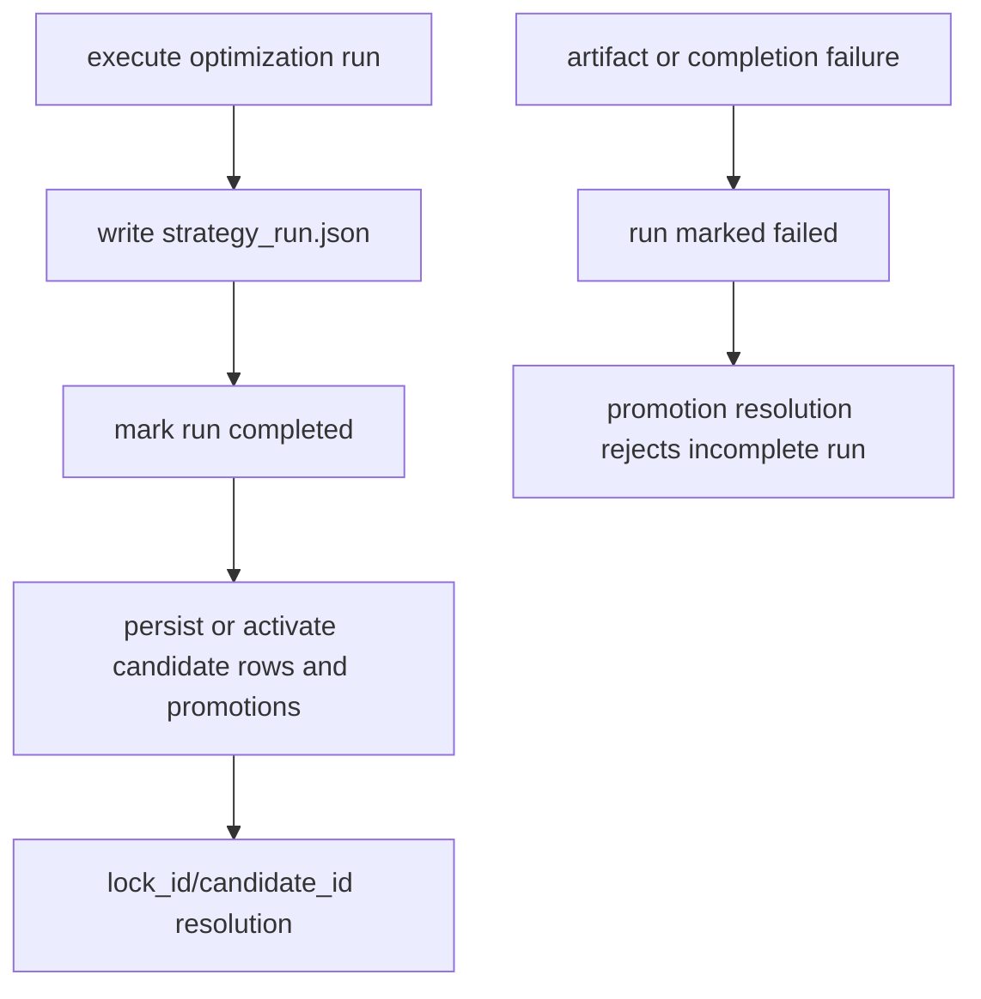

# fix: Resolve VBT Native Optimization Review Findings

## Summary

Fix the high-signal review findings from the VBT-native optimization branch before merge. The work hardens the new component-native optimization surface around artifact contracts, candidate-store durability, hidden-parameter identity, preflight accounting, locked-param validation, manifest evidence, pipeline source boundaries, agent automation, and low-risk maintainability cleanup.

This is a stabilization plan for the existing implementation, not a new feature expansion. The goal is to make the current branch merge-safe while preserving the forward-first component-native optimization direction.

---

## Problem Frame

The review found that the new optimization path mostly matches the intended architecture, but several merge-blocking seams still need tightening:

- Persistent candidate rows and promotion tokens can outlive a failed artifact completion.
- Artifact and manifest contracts still carry legacy strategy-sweep identifiers.
- Hidden VBT params can bypass generic validation through the component-native path and collapse candidate identity.
- Preflight accounting is not conservative enough for serialized artifact size and can overestimate conditioned grids.
- Locked refs accept authored params that runtime ignores.
- Source output coercion accepts extra metric/portfolio fields that the removed legacy boundary was meant to reject.
- Agent automation lacks component discovery and promotion handoff fields in CLI JSON.

The plan is intentionally ordered to fix data durability and public contracts before lower-risk cleanup and automation improvements.

---

## Requirements

- CR1. Completed optimization artifacts must use a new schema version and optimization-specific manifest role/evidence type.
- CR2. Candidate rows and promotion tokens must not become promotable unless the originating run completed its durable run artifact.
- CR3. Component param spaces must reject `vbt.Param(..., hide=True)` until hidden params are included in candidate identity.
- CR4. Preflight public artifact estimates must conservatively account for serialized metric rows, sampled rows, candidates, leaderboard rows, and promotion rows.
- CR5. Preflight combination estimates for conditioned VBT params must match VBT `combine_params` behavior closely enough to avoid rejecting valid conditioned jobs.
- CR6. Config validation must reject `params` on refs that also specify `lock_id` or `candidate_id`.
- CR7. Pipeline signal mapping must reject authoritative metric, portfolio, and candidate-axis fields instead of silently ignoring them.
- CR8. Leaderboard canonicalization must use a public evidence API rather than a private helper import.
- CR9. CLI JSON must give agents enough structured data to discover components and continue promotion workflows without path inference.
- CR10. Added regression tests must cover the reviewed failure modes, including failure injection for candidate-store publication ordering.

---

## Scope Boundaries

- Do not reintroduce legacy playbook or candidate-grid execution paths.
- Do not add hidden-param identity support in this fix; reject hidden params until a dedicated follow-up models `hidden_params` end to end.
- Do not implement partial per-param locking; whole-component locks remain the active scope.
- Do not replace local SQLite with another persistence layer.
- Do not broaden `optimization.execute` into a new optimizer engine or backend selector.

### Deferred to Follow-Up Work

- Add first-class hidden-param identity support if component authors need hidden axes later.
- Add advanced candidate-store batching if profiling shows per-row SELECTs are material at expected run sizes.
- Add portfolio-level `max_order_records` policy after deciding how it should be represented in `PortfolioConfig` and persisted evidence.

---

## Key Technical Decisions

- Candidate-store safety should be solved with an explicit activation/completion boundary, not by hoping artifact writes succeed after SQLite commits. Promotion resolution must only accept completed candidates/promotions.
- Artifact schema changes should be explicit. The optimization payload is not compatible with `strategy_run.v3`, so it needs a new schema constant and tests that assert the new value.
- Component param spaces should share the same VBT safety rules as the generic optimization source contract. In the short term, reject hidden params at component param-space load time.
- Preflight should delegate VBT-grid truth to VBT where practical. `vbt.combine_params(..., build_index=True)` is the authoritative way to resolve `condition`, `level`, random subset, and hidden-index behavior for bounded preflight scenarios.
- Agent-accessibility improvements belong in the CLI JSON surface rather than in undocumented artifact path conventions.

---

## High-Level Technical Design

> This illustrates the intended approach and is directional guidance for review, not implementation specification. The implementing agent should treat it as context, not code to reproduce.

The exact implementation can either move SQLite publication after artifact completion or persist candidate rows as pending and activate them only after completion. The invariant is what matters: promotion resolution must not succeed for a failed or incomplete run.

---

## Implementation Units

### U1. Version Optimization Artifacts And Manifest Evidence

**Goal:** Resolve findings #1 and #7 by making optimization artifacts and manifests accurately identify the new contract.

**Requirements:** CR1

**Dependencies:** None

**Files:**
- Modify: `research/aegis_research/strategy_runs.py`
- Modify: tests that assert artifact schema/manifest shape under `tests/integration/research/aegis_research/test_run_playbook_sources.py`
- Modify: docs that mention `strategy_run.json` schema or evidence shape, if present under `docs/`

**Approach:**
- Replace `strategy_run.v3` for this payload with a new optimization artifact schema version.
- Set initial `recorder.manifest.evidence["evidence_type"]` to `optimization` for this path.
- Change planned artifact role from `strategy_sweep_evidence` to an optimization-specific role.
- Keep artifact id/path stable if existing tooling expects `strategy.run` and `strategy_run.json`; version and role carry the contract change.

**Patterns to follow:**
- Existing artifact planning in `_plan_strategy_artifact_if_needed`.
- Existing integration assertions around `strategy_run.json` in `test_run_playbook_sources.py`.

**Test scenarios:**
- Happy path: a completed component optimization run writes `strategy_run.json` with the new schema version and `evidence_type: optimization`.
- Integration: the run manifest evidence type is `optimization` before and after completion.
- Integration: the planned/completed artifact record uses an optimization-specific role and the new schema version.

**Verification:**
- No artifact or manifest for the native optimization path advertises `strategy_sweep` or `strategy_run.v3`.

---

### U2. Gate Candidate Promotion On Completed Runs

**Goal:** Resolve finding #2 by preventing failed or incomplete runs from exposing promotable candidate rows or promotion tokens.

**Requirements:** CR2, CR10

**Dependencies:** U1

**Files:**
- Modify: `research/aegis_research/strategy_runs.py`
- Modify: `research/aegis_research/optimization/candidate_store.py`
- Modify: `research/aegis_research/optimization/promotion.py`
- Modify: `tests/integration/research/aegis_research/test_run_playbook_sources.py`
- Modify: `tests/unit/research/aegis_research/test_optimization_candidate_store.py`
- Modify: `tests/unit/research/aegis_research/test_optimization_promotion.py` if promotion tests are split out or added

**Approach:**
- Add an explicit publication state to candidate-store runs/rows/promotions. Candidate rows and promotion tokens are inserted as `pending` while the optimization result is being assembled, and all read APIs used for promotion resolution ignore pending records.
- After `strategy_run.json` is written and `mark_run_completed()` succeeds, activate the pending candidate rows and promotions in one candidate-store transaction.
- If artifact writing or run completion fails, leave any pending rows inactive so `lock_id`, `candidate_id`, and top-candidate queries cannot use them.
- If activation fails after run completion, let the run fail visibly rather than returning success with missing candidate-store publication; pending rows still remain non-promotable.
- Make promotion resolution verify the referenced candidate or promotion is active; direct `candidate_id` pins and `lock_id` pins must share the same active-record guard.
- Ensure candidate-store query APIs used by automation filter pending records consistently, not only promotion resolution.
- Preserve idempotent behavior for reruns with identical payloads where the current store already supports it.

**Patterns to follow:**
- Existing `CandidateStore.insert_completed_run` and `insert_promotion` transaction boundaries.
- Existing run-store status transitions in `RunStore`/recorder code.

**Test scenarios:**
- Error path: inject a failure in strategy artifact write after optimization execution and assert no `lock_id` resolves from that run.
- Error path: inject a failure in `mark_run_completed()` after artifact write and assert promotion resolution rejects that run.
- Happy path: a fully completed run still resolves `lock_id` and `candidate_id` exactly as before.
- Edge case: re-inserting identical candidate/promotion payloads remains idempotent if rerun semantics require it.
- Error path: re-inserting a promotion token with a different payload raises `CandidateStoreError`.

**Verification:**
- A run must be durably complete before any promotion token or candidate pin can be used by a later config.

---

### U3. Reject Hidden Component Params On The Active Path

**Goal:** Resolve finding #3 by making component-native param spaces enforce the same hidden-param safety rule as the generic optimization source validator.

**Requirements:** CR3

**Dependencies:** None

**Files:**
- Modify: `research/aegis_research/optimization/component_source.py`
- Modify: `tests/unit/research/aegis_research/test_optimization_component_source.py`
- Modify: `tests/integration/research/aegis_research/test_run_playbook_sources.py` if an integration-level component fixture is needed

**Approach:**
- In `_load_param_space`, reject any `vbt.Param` whose resolved `hide` field is true.
- Use the same rationale as `optimization/source.py`: hidden params are absent from the result index and can collapse candidate keys.
- Keep the rejection message actionable for component authors.

**Patterns to follow:**
- `validate_optimization_source` hidden-param rejection in `research/aegis_research/optimization/source.py`.
- Component param-space validation tests.

**Test scenarios:**
- Error path: a component `param_space_callable` returning `vbt.Param(..., hide=True)` fails before VBT execution.
- Happy path: visible params with `condition` and `level` remain accepted.
- Integration: the failure is surfaced through `aerd run --json` as a config/execution boundary error with no completed artifact.

**Verification:**
- No active component optimization source can generate hidden VBT parameter axes.

---

### U4. Make Preflight Match VBT Grid Semantics And Artifact Size

**Goal:** Resolve findings #4 and #5 by making preflight conservative for serialized output while avoiding false rejects for conditioned VBT params.

**Requirements:** CR4, CR5

**Dependencies:** U3 is useful but not required

**Files:**
- Modify: `research/aegis_research/optimization/preflight.py`
- Modify: `tests/unit/research/aegis_research/test_optimization_preflight.py`
- Modify: `tests/unit/research/aegis_research/test_optimization_runner.py` if sampled/evaluated-index parity tests need adjustment

**Approach:**
- Use VBT-derived sampled/effective index counts for params with `condition`, `level`, and `random_subset` where feasible.
- Keep raw theoretical product counts in diagnostics for pressure visibility, but distinguish them from executable sampled combinations.
- Include metric-row expansion in retained grid estimates because serialized selection/grid payloads include `metric_name` rows.
- Include sampled rows, candidate rows, leaderboard rows, selected held-out rows, and promotion rows in estimated public row/byte budgets.
- Keep estimates conservative when exact counts are too expensive or VBT refuses to build an enormous conditioned grid.

**Patterns to follow:**
- `execute_optimization._build_sampled_index` as the current VBT-backed sampled-index derivation.
- VBT MCP guidance for `combine_params`, `condition`, `random_subset`, and `cv_split(return_grid=...)`.

**Test scenarios:**
- Happy path: a conditioned fast/slow param space reports executable combinations matching `vbt.combine_params` rather than raw product size.
- Error path: a large serialized artifact estimate fails `max_public_artifact_bytes` when metric rows push it over budget.
- Happy path: `return_grid="off"`, `"first"`, and `"all"` produce distinct public row estimates that include sampled rows and candidate rows.
- Edge case: random search with a subset size uses sampled combinations for execution and artifact estimates while retaining theoretical counts in diagnostics.
- Regression: existing oversized-grid preflight failures still fail before pipeline execution.

**Verification:**
- Preflight diagnostics explain both theoretical pressure and retained public artifact pressure without undercounting persisted JSON rows.

---

### U5. Fail Fast On Locked Refs With Authored Params

**Goal:** Resolve finding #6 by rejecting config input that runtime currently ignores.

**Requirements:** CR6

**Dependencies:** None

**Files:**
- Modify: `research/aegis_research/configuration/validation.py`
- Modify: `tests/integration/research/aegis_research/test_config_contract.py`
- Modify: `tests/integration/research/aegis_research/test_run_playbook_sources.py` if lock/candidate integration fixtures need coverage

**Approach:**
- During component-ref validation, if `lock_id` or `candidate_id` is present and `params` is explicitly present and non-empty, add a validation issue.
- Keep `params: {}` either rejected for clarity or accepted as no-op; choose the stricter option if existing config style does not rely on empty mappings.
- Ensure the rule applies to strategy refs and indicator refs.

**Patterns to follow:**
- Existing mutual exclusion checks for `lock_id` and `candidate_id`.
- Existing path-specific validation issue messages.

**Test scenarios:**
- Error path: strategy ref with `lock_id` and non-empty `params` fails validation at `strategy.params` or `strategy`.
- Error path: indicator ref with `candidate_id`, `run_id`, and non-empty `params` fails validation.
- Happy path: unlocked refs with explicit params still validate.
- Happy path: locked refs without params still resolve and execute.

**Verification:**
- No accepted config can carry params that the locked runtime path ignores.

---

### U6. Reject Authoritative Fields In Pipeline Signal Mappings

**Goal:** Resolve finding #8 by preserving the fail-fast source boundary after moving to component-native pipelines.

**Requirements:** CR7

**Dependencies:** None

**Files:**
- Modify: `research/aegis_research/optimization/runner.py`
- Modify: `tests/unit/research/aegis_research/test_optimization_runner.py`
- Modify: `tests/integration/research/aegis_research/test_run_playbook_sources.py` if component-level behavior needs coverage

**Approach:**
- Before accepting a mapping with `entries` and `exits`, reject forbidden keys such as `metrics`, `metric_source`, `portfolio`, `portfolio_config`, `candidate_axis`, and related authoritative evidence fields.
- Reuse or expose the forbidden-key set from `optimization/source.py` if that avoids duplication without creating a circular dependency.
- Keep tuple `(entries, exits)` behavior unchanged.

**Patterns to follow:**
- `OPTIMIZATION_SOURCE_FORBIDDEN_KEYS` in `research/aegis_research/optimization/source.py`.
- Existing `test_runner_rejects_invalid_pipeline_signal_shape` style tests.

**Test scenarios:**
- Error path: pipeline mapping with `entries`, `exits`, and `metrics` raises `OptimizationRunnerError` before portfolio simulation.
- Error path: pipeline mapping with `portfolio` or `metric_source` raises the same boundary error.
- Happy path: mapping with only `entries` and `exits` still executes.
- Happy path: tuple `(entries, exits)` still executes.

**Verification:**
- Component strategy outputs cannot smuggle source-owned metrics or portfolio policy through the signal mapping path.

---

### U7. Publish Canonicalization API For Leaderboard Matching

**Goal:** Resolve finding #9 by removing the private helper import from leaderboard code.

**Requirements:** CR8

**Dependencies:** None

**Files:**
- Modify: `research/aegis_research/optimization/evidence.py`
- Modify: `research/aegis_research/optimization/leaderboard.py`
- Modify: `tests/unit/research/aegis_research/test_optimization_evidence.py`
- Modify: `tests/unit/research/aegis_research/test_optimization_leaderboard.py`

**Approach:**
- Promote the canonical value or canonical params-key behavior to a public function name in `evidence.py`.
- Update leaderboard to use the public API.
- Keep candidate-key serialization stable; this is an API cleanup, not an identity migration.

**Patterns to follow:**
- Existing deterministic value canonicalization and candidate-key tests in `test_optimization_evidence.py`.

**Test scenarios:**
- Happy path: leaderboard matching still finds candidate rows when params include VBT scalar types, tuples, or NaN-like canonical values already covered by evidence tests.
- Regression: importing leaderboard no longer relies on a private underscore-prefixed function.
- Stability: candidate keys generated before and after the API rename remain identical for representative inputs.

**Verification:**
- `leaderboard.py` no longer imports underscore-prefixed evidence helpers.

---

### U8. Add Agent-Accessible Component Discovery And Run Handoff JSON

**Goal:** Resolve agent-native gaps by making the component workflow automatable through CLI JSON.

**Requirements:** CR9

**Dependencies:** U1 is useful for final artifact naming consistency

**Files:**
- Modify: `research/aegis_research/cli_commands/show/__init__.py`
- Modify: `research/aegis_research/cli_commands/run.py`
- Modify: `research/aegis_research/component_registry/registry.py`
- Modify: tests under `tests/integration/research/aegis_research/test_cli.py`
- Modify: tests under `tests/integration/research/aegis_research/test_cli_docs.py` if command documentation is covered there
- Modify: docs under `docs/components.md` and `research/configs/README.md` if CLI examples are documented

**Approach:**
- Add `aerd show components --json` or equivalent existing-show subcommand support.
- Expose safe component manifest metadata needed to author configs: family, id, version, input/output/consume contracts, param names, defaults, param-space presence, source hash, and registry fingerprint.
- Extend `aerd run --json` to include the strategy artifact path, candidate store path, and generated promotion records or top lock tokens.
- Keep human output concise and backwards-compatible unless tests/docs indicate a deliberate contract update is needed.

**Patterns to follow:**
- Existing `aerd show splitters` command structure.
- Existing `_run_payload` JSON structure in `cli_commands/run.py`.
- `FrozenComponentRegistry.public_snapshot()` as the likely source for safe registry metadata.

**Test scenarios:**
- Happy path: `aerd show components --json` returns component metadata sufficient to choose a strategy id and inspect params/defaults.
- Happy path: `aerd run --json` includes `artifacts.strategy_artifact_path`, candidate store path, and promotion records/tokens for a successful optimization run.
- Edge case: components with no param space still report defaults and param-space absence clearly.
- Error path: malformed or missing components still surface existing registry errors without partial JSON success.

**Verification:**
- An agent can discover components, author a config, run optimization, and perform a follow-up locked run using only structured CLI JSON plus the config file it writes.

---

### U9. Fill Candidate Store Regression Coverage

**Goal:** Address review testing gaps around candidate-store ranking, privacy, and promotion idempotency while touching the store for durability fixes.

**Requirements:** CR10

**Dependencies:** U2

**Files:**
- Modify: `tests/unit/research/aegis_research/test_optimization_candidate_store.py`
- Modify: `research/aegis_research/optimization/candidate_store.py` only if tests expose behavior defects

**Approach:**
- Add tests for existing intended behavior first.
- Keep implementation changes minimal unless tests reveal a real defect.
- Do not batch-optimize candidate insertion in this unit unless profiling or tests make it necessary.

**Patterns to follow:**
- Existing candidate-store helper fixtures in `test_optimization_candidate_store.py`.

**Test scenarios:**
- Happy path: `top_candidates_by_metric(..., direction="asc")` ranks the smallest finite values first and leaves `None`/NaN-style values last.
- Error path: a group/other-readable candidate-store directory raises `CandidateStoreError` on POSIX.
- Error path: an existing group/other-readable SQLite file raises `CandidateStoreError` on POSIX.
- Happy path: re-inserting the same promotion token with an identical payload is a no-op.
- Error path: re-inserting the same promotion token with a different payload raises `CandidateStoreError`.

**Verification:**
- Candidate-store behavior is characterized before and after the durability changes.

---

## System-Wide Impact

- Research users get stricter config validation for locked refs and hidden params.
- Artifact consumers must recognize the new optimization artifact schema version instead of `strategy_run.v3`.
- Automation agents gain a structured CLI path for component discovery and promotion handoff.
- Candidate-store data written by incomplete runs becomes unavailable for promotion, which is the intended fail-closed behavior.

---

## Risk Analysis & Mitigation

- **Risk:** Moving candidate-store writes after artifact completion changes failure timing and may leave completed artifacts without candidate-store rows if SQLite fails afterward. **Mitigation:** either use pending activation or mark the run failed if final candidate publication fails; tests should cover this chosen behavior.
- **Risk:** VBT `combine_params` counting may be expensive for huge conditioned grids. **Mitigation:** use bounded/conservative fallback diagnostics when exact VBT-derived counting is unsafe.
- **Risk:** Schema-version bump may require updating more docs/tests than the immediate failing assertions. **Mitigation:** search for `strategy_run.v3` and artifact role references during implementation.
- **Risk:** CLI JSON additions could accidentally expose unsafe component metadata. **Mitigation:** expose manifest metadata and source hashes only, not callable paths beyond already-public repo-relative component identity.

---

## Verification Plan

- Run targeted unit and integration tests for optimization source, component source, preflight, runner, candidate store, promotion resolution, CLI, and strategy run integration.
- Run the full research test suite if runtime permits because these fixes cross config, execution, persistence, artifacts, and CLI surfaces.
- Run lint/format checks on touched Python paths.
- Re-run the code review after fixes to verify all primary findings are closed.

---

## Implementation Sequence

1. U1 and U2 first, because they are merge-blocking contract and persistence-safety issues.
2. U3, U4, U5, and U6 next, because they harden the active optimization boundary.
3. U7 and U9 after behavioral fixes, because they are contained cleanup/coverage improvements.
4. U8 last, because it expands the CLI JSON surface and should reflect the final artifact/promotion contract.
