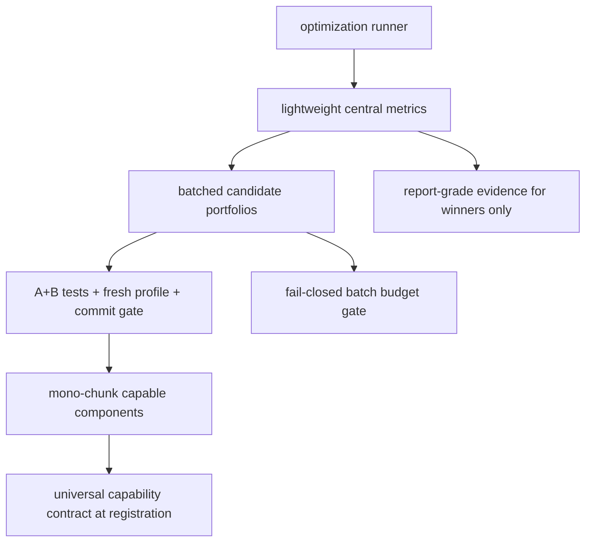

# feat: VBT-Native Optimization Performance Upgrade

## Summary

Speed up Aegis optimization in one integrated three-phase plan: Phase A replaces report-grade metric extraction in the hot path with lightweight VBT-native direct-accessor central metrics, Phase B replaces the scalar per-candidate path with a single batched candidate-portfolio execution path built on `vbt.PortfolioOptimizer` (PFO) — `@vbt.parameterized(merge_func="column_stack", mono_chunk_len=…)` around signal generation produces a wide allocations frame, fed into one `vbt.PFO.from_filled_allocations(...)` + `vbt.Portfolio.from_optimizer(..., pf_method="from_orders")` simulation per split — under fail-closed resource gating, and Phase C makes mono-chunk component execution the single optimization path with capability enforced at registration.

This plan keeps A, B, and C in one roadmap, but it ships A+B first, validates them with tests and a fresh profile, commits that checkpoint, and only then authorizes Phase C. There is no scalar fallback in the optimization runner at any phase: the runner runs the single forward path or fails closed at the contract boundary.

The portfolio substrate is owned by issue #35 (landed in PR #37). The batched path is built directly on the PFO substrate.

---

## Problem Frame

The profiled `aerd run` path spends most of its time in repeated candidate evaluation. The dominant hotspot is `portfolio_metrics`, with `simulate_portfolio` also material, while the surrounding code still treats ranking, portfolio simulation, and component signal generation as if they were one concern.

That shape is expensive for the wrong reason. Ranking needs a small set of central comparable values; full report-quality evidence is still needed, but only for selected winners. Portfolio simulation can be batched across candidates when the grouping and cash-sharing semantics are preserved. Component signal generation is likely the next bottleneck only after metric and portfolio overhead are reduced and re-profiled.

The plan therefore separates the work by concern and by checkpoint:
- Phase A: lightweight VBT-native direct-accessor central metrics for ranking
- Phase B: single batched candidate portfolio path on the PFO substrate (partial parameterization with `column_stack` + `mono_chunk_len` produces a wide allocations frame, wrapped via `vbt.PFO.from_filled_allocations(...)`, simulated via `vbt.Portfolio.from_optimizer(..., pf_method="from_orders")` per split); the scalar per-candidate path is removed from the optimization runner
- A+B checkpoint: tests, fresh profile, and commit-ready validation before C
- Phase C: mono-chunk component execution as the single path, enforced through a universal component capability contract at registration

---

## Evidence Used

- `docs/profiling/2026-05-22-aerd-run-cprofile.md` captures the profile commands, hotspots, and reviewer findings.
- `research/configs/local_component_e2e.yaml` is the valid profile config used to measure the hot path.
- VBT MCP checks resolved the key APIs for the plan: `vbt.cv_split`, `vbt.Param`, `vbt.combine_params`, `vbt.PFO.from_filled_allocations`, `vbt.Portfolio.from_optimizer` (with `pf_method="from_orders"`), `vbt.ExceptLevel`, and direct portfolio metric getters.
- Existing Aegis code already has the right seams for this upgrade: `research/aegis_research/optimization/runner.py`, `research/aegis_research/reports.py`, `research/aegis_research/portfolios.py`, `research/aegis_research/optimization/preflight.py`, `research/aegis_research/strategy_runs.py`, and `research/aegis_research/optimization/component_source.py`.

---

## Actors

- A1. Research user: wants materially faster optimization turnaround without losing reproducibility.
- A2. Aegis run lane: executes the optimization pipeline, portfolio policy, metrics, artifacts, and promotion evidence.
- A3. Strategy/component author: benefits from mono-chunk execution only when the component contract can support it.
- A4. Reviewer or automation agent: checks that speedups preserve leaderboard, candidate, and evidence semantics.
- A5. Planner/implementer: turns the staged performance scope into safe implementation units and checkpoints.

---

## Key Flows

- F1. Phase A: lightweight central metrics
  - **Trigger:** candidate ranking needs a central metric value.
  - **Outcome:** ranking uses a cheap VBT-native path, while full report evidence stays outside the hot loop.
- F2. Phase B: batched candidate portfolios
  - **Trigger:** portfolio simulation is still a material runtime cost after Phase A.
  - **Outcome:** candidate portfolios execute in batches with preserved shared-cash semantics, candidate identity, and row order.
- F3. A+B checkpoint
  - **Trigger:** Phase A and Phase B are implemented.
  - **Outcome:** tests pass, a new profile is recorded on the PFO substrate (not the legacy cProfile baseline), the before/after delta is reviewed, and the checkpoint is committed before C starts. If the post-A+B profile points to a bottleneck other than component/signal generation, Phase C as written pauses and the next bottleneck gets its own unit.
- F4. Phase C: mono-chunk allocation-native component execution as the single path
  - **Trigger:** the post-A+B profile on the PFO substrate shows component allocation generation is the residual bottleneck.
  - **Outcome:** every component produces a wide multi-candidate version of its declared allocation-native output (date × (candidate × symbol) frame of scores / ranks / active / target_weights) so the Phase B `@vbt.parameterized(merge_func="column_stack")` wrapper can pass merged parameter chunks to the component directly instead of looping. Components that cannot satisfy the capability contract fail at registration or preflight.

---

## Requirements

**Measurement and guardrails**
- R1. The upgrade must start from the existing profile evidence and use a fresh profile after A+B, not cProfile alone.
- R2. Every phase that changes execution shape must include behavior tests and a profile comparison against the prior checkpoint.
- R3. Speedups must not drop Aegis-owned portfolio policy, candidate identity, evidence, or reproducibility.

**Phase A: central metrics**
- R4. Candidate ranking must use a lightweight VBT-native central metric path instead of full report-quality extraction for every sampled candidate.
- R5. The central metric path must return the same official metric keys and normalized units needed by ranking and leaderboard construction.
- R6. Full report-quality metric evidence, warnings, and diagnostics must still be available for selected winners.
- R7. Phase A must include parity tests comparing lightweight values with report-derived values, including non-finite and warning-sensitive cases.

**Phase B: batched candidate portfolios**
- R8. Batched portfolio execution must preserve one shared cash pool per candidate across that candidate's symbols.
- R9. Candidate identity, sampled rows, split roles, and winner evidence must remain stable when moving from scalar to batched execution.
- R10. Batched execution must support chunking or resource gates so candidate-by-symbol expansion stays bounded.
- R11. Phase B must include scalar-versus-batched equivalence tests covering shared cash, fees, slippage, next-open execution, order/trade counts, and central metrics.

**A+B checkpoint**
- R12. Phase C must not begin until A+B pass tests, produce a new profile report, and reach a commit-ready checkpoint.
- R13. The post-A+B profile must identify the next bottleneck before mono-chunk component work is planned in detail.
- R14. If A+B do not materially reduce the original metric/portfolio hotspots, the plan must stop and reassess before moving to C.

**Phase C: mono-chunk capable components**
- R15. Mono-chunk capability is a universal component execution contract; every component registered for optimization must satisfy it.
- R16. Components that do not satisfy the mono-chunk capability contract fail at registration or preflight; no scalar or alternative chunked path exists.
- R17. Mono-chunk execution must preserve component outputs, candidate identity, split boundaries, and portfolio-policy ownership.
- R18. Phase C must include parity and profiling evidence proving the mono-chunk path targets the post-A+B bottleneck.

**Scope and ownership**
- R19. The plan must stay VBT-native and use VBT parameterization, grouping, chunking, and portfolio primitives where they fit.
- R20. Aegis remains responsible for data contracts, portfolio policy, evidence, diagnostics, candidate identity, promotion records, and fail-closed resource limits.

---

## Scope Boundaries

- Do not replace the entire optimization model in one uncheckpointed refactor.
- Do not require mono-chunk support before A+B can ship, validate, and be committed.
- Do not add non-VBT optimizers such as Optuna, Hyperopt, or Bayesian search as part of this upgrade.
- Do not drop Aegis-owned portfolio policy, evidence, diagnostics, candidate identity, or reproducibility guarantees for speed.
- Do not treat cProfile absolute runtime as the only performance measure; use it alongside wall-clock or sampling/timing evidence.
- Every component must satisfy the mono-chunk capability contract; capability is universal, not opt-in.
- Do not preserve per-losing-candidate optional diagnostics in the ranking hot path unless a concrete artifact contract requires them.

### Deferred to Follow-Up Work

- Add broader component param-space work if mono-chunk capability exposes a larger contract change.
- Add deeper rollout automation if A+B or C needs staged deployment support.
- Add any non-essential leaderboard/report cleanup that falls out of the performance work but is not required for correctness.

---

## Key Technical Decisions

- Phase A uses a direct VBT accessor (`pf.get_total_return`, `pf.get_sharpe_ratio`, `pf.get_max_drawdown`, `pf.get_calmar_ratio`, etc.) per official central metric. The ranking hot path never calls `pf.stats()` or `portfolio_metrics`. Direct accessors are substrate-agnostic: they work identically on a `Portfolio` produced by `from_optimizer(pf_method="from_orders")`.
- Phase B replaces the scalar per-candidate callback entirely with a single batched execution path on the PFO substrate: `@vbt.parameterized(merge_func="column_stack", mono_chunk_len=…)` around signal generation only produces a wide allocations frame (date × (candidate × symbol), NaN = no rebalance). The wide frame is wrapped via `vbt.PFO.from_filled_allocations(...)` and simulated via `vbt.Portfolio.from_optimizer(close, pfo, pf_method="from_orders", group_by=vbt.ExceptLevel(SYMBOL_LEVEL), cash_sharing=True, direction="longonly", call_seq="auto", **timing_kwargs)`. One simulation call per split. Candidate-grade evidence is extracted via `portfolio_metrics_by_candidate_group` on the resulting `Portfolio`, called once per run for winners only.
- The candidate/result contract for batching preserves the exact mapping back to candidate rows and sampled rows. PFO's multi-level column structure (`(candidate, symbol)`) carries candidate identity through the simulation. `random_subset` and `seed` move from the outer `vbt.parameterized` layer to the inner partial-parameterization layer (or to a precomputed sample fed via `vbt.Param`) so candidate identity stays stable.
- The batch budget gate fails closed before candidate-store publication or leaderboard completion if expansion would exceed the configured limit. There is no alternate slower path: `mono_chunk_len` is the only tuning knob and is computed inside preflight; it does not switch execution shapes.
- Phase C enforces a universal mono-chunk capability contract owned by the component registration boundary; non-conforming components fail preflight rather than fall back to a scalar path. There is no scalar or "ordinary chunked" alternative inside the optimization runner.
- The A+B checkpoint is a hard gate, not a soft recommendation: no C work starts until the new profile and tests show the hotspots moved.

---

## High-Level Technical Design

> This illustrates the intended approach and is directional guidance for review, not implementation specification. The implementing agent should treat it as context, not code to reproduce.

The core shape is: compute less in the ranking hot path, batch only where identity and portfolio semantics are preserved, then let post-A+B evidence decide whether component execution deserves its own fast path.

---

## Implementation Units

### U1. Define Lightweight Central Metric Contract

**Goal:** Replace report-grade metric extraction in the ranking hot path with a direct VBT-native central metric contract.

**Requirements:** R4, R5, R6, R7

**Dependencies:** None

**Files:**
- Modify: `research/aegis_research/optimization/runner.py`
- Modify: `research/aegis_research/reports.py`
- Modify: `research/aegis_research/metrics/stats.py` if the official metric contract needs to expose direct-accessor metadata
- Test: `tests/unit/research/aegis_research/test_optimization_runner.py`
- Test: `tests/unit/research/aegis_research/test_reports.py`

**Approach:**
- Define the exact direct VBT accessor (e.g., `pf.get_total_return`, `pf.get_sharpe_ratio`, `pf.get_max_drawdown`, `pf.get_calmar_ratio`) used for each official central metric. The ranking hot path never calls `pf.stats()` or `portfolio_metrics`; `_central_metric_series` calls the direct accessors only.
- Keep the report path (`portfolio_metrics` / `portfolio_metrics_by_candidate_group`) as the source of winner evidence, called once per run for selected winners only — not inside the ranking loop.
- Preserve the same metric keys and normalization rules so downstream ranking and leaderboard code do not need a second contract.
- Make non-finite and warning-sensitive cases explicit at the direct-accessor mapping layer so the lightweight path and report path cannot silently diverge on units, sign, or warning behavior.

**Patterns to follow:**
- Existing metric-source contract in `research/aegis_research/metrics/stats.py`.
- Existing report metric extraction in `research/aegis_research/reports.py`.
- Existing central-metric use in `research/aegis_research/optimization/runner.py`.

**Test scenarios:**
- Covers AE1. A finite candidate produces the same official central metric values through the direct-accessor path and the report path used for winner evidence.
- A non-finite candidate value is handled the same way by the direct-accessor path and the winner-evidence report path.
- Covers AE2. A warning-producing metric still preserves the selected winner's report-grade evidence, even though losing candidates no longer compute full diagnostics during ranking.
- A metric with different unit/normalization behavior is rejected at the direct-accessor mapping rather than silently reinterpreted.
- The ranking hot path no longer calls `pf.stats()` or `portfolio_metrics` on any candidate.

**Verification:**
- Ranking uses only direct central metrics.
- Winner evidence still comes from report-quality output.
- The metric contract is explicit enough that a reviewer can trace each official value to one accessor.

### U2. Replace Scalar Per-Candidate Path With Single PFO-Backed Batched Portfolio Path

**Goal:** Replace the scalar per-candidate callback in the optimization runner with a single batched portfolio execution path built on `vbt.PortfolioOptimizer` (PFO). One simulation call per split via `vbt.Portfolio.from_optimizer(..., pf_method="from_orders")`. Candidate identity, ordering, and shared-cash semantics are preserved through PFO's multi-level column structure. No scalar path remains in the optimization runner.

**Requirements:** R8, R9, R11

**Dependencies:** U1, issue #35 (portfolio substrate)

**Files:**
- Modify: `research/aegis_research/optimization/runner.py` — replace `_evaluate_cv_slice` scalar callback with a PFO-backed partial-parameterization callable; the runner no longer constructs one portfolio per candidate.
- Modify: `research/aegis_research/portfolios.py` — `simulate_portfolio_batch` is rewritten to wrap an allocations frame via `vbt.PFO.from_filled_allocations(...)` and call `vbt.Portfolio.from_optimizer(close, pfo, pf_method="from_orders", ...)`. The `from_signals(valuepercent)` path is removed.
- Modify: `research/aegis_research/strategy_runs.py` if the candidate/evidence handoff needs to consume PFO-shaped allocations and `pfo.alloc_records` diagnostics.
- Test: `tests/integration/research/aegis_research/test_portfolios.py`
- Test: `tests/unit/research/aegis_research/test_optimization_runner.py`

**Approach:**
- Use `@vbt.parameterized(merge_func="column_stack", mono_chunk_len=<from preflight>)` around signal generation only; the decorated callable returns a wide allocations frame (date × (candidate × symbol), NaN = no rebalance).
- Wrap the wide allocations frame in `vbt.PFO.from_filled_allocations(allocations)` and simulate with `vbt.Portfolio.from_optimizer(close, pfo, pf_method="from_orders", size_type="targetpercent", direction="longonly", cash_sharing=True, call_seq="auto", group_by=vbt.ExceptLevel(SYMBOL_LEVEL), **timing_kwargs)` — one simulation call per split.
- Remove the scalar per-candidate path from the optimization runner: `_evaluate_cv_slice` no longer calls `simulate_portfolio` and no longer constructs one portfolio per candidate.
- Move `random_subset` and `seed` from the outer `vbt.parameterized` layer (used by `vbt.cv_split`) to the inner partial-parameterization layer (or to a precomputed sample fed via `vbt.Param`) so candidate identity stays stable.
- Keep the batched output shape reversible to the original candidate rows and sampled rows. PFO's multi-level column structure (`(candidate_param_levels, symbol)`) carries candidate identity through. Do not coalesce or reorder candidates in a way that changes the evidence attached to a candidate.
- Apply split-aware executable masking to the allocations frame **before** wrapping in PFO so PFO never sees non-executable rows.
- Validate the new PFO-backed path against the captured pre-change scalar baseline values as a one-time historical parity comparison; the scalar path does not coexist with the new path at runtime.

**Patterns to follow:**
- Issue #35 PFO substrate (`vbt.PFO.from_filled_allocations` + `vbt.Portfolio.from_optimizer`).
- Existing `portfolio_metrics_by_candidate_group` in `research/aegis_research/reports.py:119` (substrate-agnostic; works on the resulting `Portfolio` object).
- Existing candidate row construction in `research/aegis_research/strategy_runs.py`.
- VBT cookbook "Total or partial?" partial-parameterization shape (column_stack signals → one simulation).

**Test scenarios:**
- Covers AE3. A small deterministic candidate set with multiple symbols produces the same shared-cash behavior, trades, fees, and central metrics through the single PFO-backed batched path as the captured pre-change scalar baseline values (within tolerances accounting for substrate change from `from_signals(valuepercent)` to `from_orders(targetpercent)`).
- The batched result order maps back to the original candidate row order through PFO's multi-level column structure.
- Two candidates with the same visible params but different identity metadata do not collapse into one evidence row.
- Next-open execution matches the expected substrate semantics (`price="nextopen"` shifts target rows to next bar for execution).
- Fees and slippage flow through `from_optimizer`'s `**kwargs` correctly.
- `simulate_portfolio` (scalar) and direct `Portfolio.from_signals` / `Portfolio.from_orders` calls are not present in any code path reachable from the optimization runner.
- `pfo.alloc_records` and `pfo.filled_allocations` are exposed in candidate diagnostics for review.

**Verification:**
- The batched path can be traced back to each candidate via PFO's column structure without ambiguity.
- Shared-cash semantics remain candidate-local (`group_by=vbt.ExceptLevel(SYMBOL_LEVEL)` + `cash_sharing=True`).
- There is one optimization execution path on the PFO substrate; no scalar fallback exists.

### U3. Add Fail-Closed Batch Budget Gate

**Goal:** Prevent batched candidate expansion from exceeding memory or artifact budgets before the run publishes incomplete evidence.

**Requirements:** R10, R12, R14, R20

**Dependencies:** U2

**Files:**
- Modify: `research/aegis_research/optimization/preflight.py`
- Modify: `research/aegis_research/optimization/runner.py`
- Modify: `research/aegis_research/strategy_runs.py` if publication timing needs to honor the gate
- Test: `tests/unit/research/aegis_research/test_optimization_runner.py`
- Test: `tests/integration/research/aegis_research/test_strategy_run.py`

**Approach:**
- Extend preflight accounting to consider batched candidate-by-symbol expansion: `symbols × candidates × bars × dtype` against the configured ceiling.
- Compute `mono_chunk_len` inside preflight as the only tuning knob for the single batched path. The chunk size scales; the execution path does not switch.
- Put the gate before candidate-store publication and leaderboard completion.
- Fail-closed only: if even `mono_chunk_len=1` would exceed the ceiling, the run aborts before any candidate publication. No alternate slower path exists.
- Keep the heuristic conservative enough that it protects the run lane without hiding real work behind arbitrary refusal.

**Patterns to follow:**
- Existing preflight estimates in `research/aegis_research/optimization/preflight.py`.
- Existing fail-fast config and evidence patterns in the repo's solution docs.

**Test scenarios:**
- Covers AE4. A run whose batch expansion would exceed budget fails before publishing completed leaderboard evidence.
- The budget gate triggers before candidate-store insertion or completion marking.
- A bounded batch still proceeds and writes complete evidence.
- The gate reports the same candidate/symbol expansion shape it used to make the decision.

**Verification:**
- Oversized jobs fail closed.
- Complete jobs still publish normally.
- The batch budget is visible enough to explain why a run was rejected.

### U4. Codify the A+B Checkpoint

**Goal:** Make the post-A+B validation checkpoint explicit through tests, profiling follow-up, and a commit-ready decision gate.

**Requirements:** R2, R12, R13, R14

**Dependencies:** U1, U2, U3

**Files:**
- Modify: `docs/profiling/2026-05-22-aerd-run-cprofile.md` if the follow-up profile summary is appended or revised
- Modify: `docs/plans/2026-05-22-002-feat-vbt-native-optimization-performance-upgrade-plan.md` if the checkpoint outcome needs to be recorded
- Test: `tests/unit/research/aegis_research/test_optimization_runner.py`
- Test: `tests/unit/research/aegis_research/test_reports.py`
- Test: `tests/integration/research/aegis_research/test_portfolios.py`

**Approach:**
- Treat A+B as the ship target and C as blocked until the new profile says the bottleneck shifted.
- The post-A+B profile is captured on the **PFO substrate**, not against the legacy cProfile baseline. A+B may move hotspots into the allocations-frame construction (portfolio policy), into PFO's column structure handling, or into the wider Phase B partial-parameterization wrapper itself. "Components are next" is an unproven assumption until the post-A+B profile actually points there.
- Make the checkpoint evidence-centered: behavior tests, before/after profile comparison, and a clear stop rule if the hotspot does not move.
- If the post-A+B profile points to a bottleneck other than component/signal generation, Phase C as written pauses and the next bottleneck gets its own dedicated unit. Phase C is not the only possible follow-up after A+B.
- Keep the checkpoint scope narrow so it validates the performance change instead of widening the implementation.

**Patterns to follow:**
- Existing profiling and evidence structure in `docs/profiling/2026-05-22-aerd-run-cprofile.md`.
- Existing test naming and coverage patterns in the research test suites.

**Test scenarios:**
- Covers AE5. After A+B, the profile evidence on the PFO substrate shows the dominant hotspot has moved before C is planned in detail.
- The checkpoint refuses to advance if tests pass but the original hotspots remain materially unchanged.
- The checkpoint preserves the same candidate and leaderboard semantics seen before the change.
- If the post-A+B profile points to a bottleneck other than component/signal generation, the checkpoint records the actual residual bottleneck and Phase C as written is paused.

**Verification:**
- There is a documented A+B stop/go decision based on PFO-substrate profile evidence.
- The next bottleneck is named from measured evidence, not guessed.
- C cannot start on intuition alone; it cannot start on a stale legacy-substrate profile either.

### U5. Enforce Universal Mono-Chunk Allocation-Native Capability Contract

**Goal:** Require every component to produce a wide multi-candidate version of its declared allocation-native output (date × (candidate × symbol) frame of scores / ranks / active / target_weights) so the Phase B `@vbt.parameterized(merge_func="column_stack", mono_chunk_len=…)` wrapper can pass merged parameter chunks directly to the component instead of looping over candidates one at a time. Capability is enforced at component registration. There is no scalar or per-candidate Python-loop fallback inside the optimization runner.

**Requirements:** R15, R16, R17, R18

**Dependencies:** U4. **Conditional trigger:** the post-A+B profile on the PFO substrate must show component allocation generation as the residual bottleneck. If it points elsewhere, this unit is paused per U4's stop rule.

**Files:**
- Modify: `research/aegis_research/optimization/component_source.py` — require every component to declare mono-chunk allocation-native capability as part of its registration contract.
- Modify: `research/aegis_research/strategy_runs.py` — surface the registration/preflight failure when a component does not satisfy the contract.
- Modify: component registry/manifest contracts to enforce the capability declaration at registration.
- Modify: in-tree components that today produce per-candidate allocations via Python loops — convert them to vectorized multi-candidate output of their declared shape.
- Test: `tests/unit/research/aegis_research/test_optimization_source.py`
- Test: `tests/integration/research/aegis_research/test_strategy_run.py`

**Approach:**
- Capability means: given a chunk of parameter combinations, the component returns a single wide allocation-native frame of shape date × (candidate × symbol) for its declared output (scores | ranks | active | target_weights), with `(candidate, symbol)` as a MultiIndex column structure that survives column-stacking and PFO grouping.
- Require every component to declare this capability in its registration contract; the declaration is part of the contract, not optional metadata, and is tied to the component's declared allocation-native output shape (from issue #35).
- Enforce the declaration at registration and preflight; a non-conforming component fails fast before any candidate work begins.
- Convert in-tree components that currently loop over candidates internally to produce a vectorized wide multi-candidate output. This is the substantive remainder of Phase C after Phase B's `@vbt.parameterized` orchestration is in place.
- Phase B's wrapper relies on this capability to avoid per-candidate Python looping inside the inner callable; without it the wrapper still works but degenerates to one component call per param combination — that is the bottleneck Phase C exists to remove.
- Run every component through the single mono-chunk allocation-native path. No scalar or "ordinary chunked" alternative inside the optimization runner.
- Preserve output semantics, candidate identity, and split boundaries through the single path. PFO's `(candidate, symbol)` column structure carries candidate identity from the wide allocation frame through to the resulting `Portfolio`.

**Patterns to follow:**
- Issue #35 allocation-native output contract (scores | ranks | active | target_weights).
- Existing component/source contracts in `research/aegis_research/optimization/component_source.py`.
- Existing manifest and registry shape validation patterns.
- VBT's `(param_levels, symbol)` MultiIndex column convention used by `vbt.PFO` and `vbt.Portfolio.from_optimizer`.

**Test scenarios:**
- Covers AE6. A capable component returns a date × (candidate × symbol) frame of its declared allocation-native output for a chunk of parameter combinations, and that frame composes with Phase B's `@vbt.parameterized(merge_func="column_stack")` wrapper without per-candidate looping.
- A run that registers a non-conforming component is rejected at registration or preflight before reaching the optimization runner.
- A component that today loops over candidates internally is converted to a vectorized multi-candidate output and produces results equivalent to the per-candidate loop within tolerance.
- The wide multi-candidate output's `(candidate, symbol)` MultiIndex column structure flows through PFO into `pf.wrapper.columns` and is recoverable for downstream candidate-identity tracking.
- A component without the capability declaration cannot be registered for optimization.

**Verification:**
- Capability is declared, not inferred.
- Every component produces wide multi-candidate allocation-native output natively; no per-candidate Python loop remains in the component layer.
- There is one optimization execution path; no scalar fallback exists at any layer.
- The single path lands only after A+B PFO-substrate profile evidence shows component allocation generation is the residual bottleneck.

---

## Alternatives Considered

- Keep batching hidden inside the scalar `cv_split` path. Rejected because it obscures candidate identity and makes the execution contract harder to test.
- Jump directly to mono-chunk components before fixing metrics and portfolio batching. Rejected because the profile shows metric and portfolio work dominate first.
- Fold report-quality evidence into every ranking evaluation. Rejected because it keeps the expensive path in the hot loop.
- Keep a scalar fallback path for non-conforming components or oversized batches. Rejected: two paths means twice the surface to test and profile, hides slow components and oversized runs behind a silent slow lane, and violates the project's Forward-First and No Defensive Garbage principles. The single path either runs or fails closed at the contract boundary.
- Use outer `@vbt.chunked` super-chunks as the default batching axis. Rejected: partial parameterization with `column_stack` + `mono_chunk_len` is the documented practitioner-preferred shape for this scale (cookbook "Total or partial?"); super-chunks are an unnecessary second axis.
- Use direct `vbt.Portfolio.from_orders(size_type="targetpercent")` as the substrate instead of PFO. Rejected: the 2026-05-18 portfolio simulation contract brainstorm explicitly named PortfolioOptimizer as the correct allocation substrate; VBT cookbook and maintainer guidance confirm PFO is the documented practitioner primitive for target-allocation work; PFO carries the allocations storage, alloc_records, group_configs, and stats/plotting ecosystem aegis would otherwise rebuild from scratch. Issue #35 owns this substrate decision.
- Use `pf_method="from_signals"` inside `Portfolio.from_optimizer`. Rejected for v1: it triggers PFO's dynamic-signal compilation (~1-minute first call). `pf_method="from_orders"` is the cached, fast path with equivalent simulation results.

---

## Success Criteria

- The ranking hot path no longer spends most of its time in full report-quality metric extraction.
- Batched portfolio execution reduces repeated portfolio construction while preserving shared-cash and evidence semantics.
- The A+B checkpoint produces a fresh profile and a commit-ready state before C.
- Phase C is driven by post-A+B evidence and targets the next measured bottleneck.

---

## Dependencies / Assumptions

- `docs/profiling/2026-05-22-aerd-run-cprofile.md` remains the baseline performance artifact for this plan.
- Issue #35 (PFO substrate) landed in PR #37. Phase B/U2 builds on that substrate directly.
- The current VBT PRO behavior for direct portfolio getters, `vbt.PFO.from_filled_allocations(...)`, `vbt.Portfolio.from_optimizer(..., pf_method="from_orders")`, `group_by=vbt.ExceptLevel("symbol")`, and `cash_sharing=True` remains the relevant execution model.
- Existing portfolio-policy requirements remain authoritative for timing, fees, slippage, and diagnostics.
- Exact helper names may shift during implementation, but the phase boundaries and contracts should not.

---

## Risk Analysis & Mitigation

- Risk: the lightweight metric path and the report path diverge on units or non-finite handling. Mitigation: define the accessor mapping explicitly and add parity tests.
- Risk: batched execution attaches evidence to the wrong candidate after reordering or deduplication. Mitigation: preserve the result-order contract and test candidate identity round-trips.
- Risk: batching blows memory or artifact budgets before the run can finish. Mitigation: fail closed in preflight before publication.
- Risk: mono-chunk capability becomes an implicit assumption. Mitigation: make it an explicit registration-time contract that fails closed at the boundary; no fallback path exists.

---

## Phased Delivery

### Phase A

- Land the direct-accessor central metric contract and its parity tests.
- Remove `pf.stats()` / `portfolio_metrics` from the ranking hot path.

### Phase B

- Land the single batched candidate portfolio path on the PFO substrate (partial parameterization with `column_stack` + `mono_chunk_len` produces a wide allocations frame; one `vbt.PFO.from_filled_allocations(...)` + `vbt.Portfolio.from_optimizer(..., pf_method="from_orders")` simulation per split).
- Remove the scalar per-candidate path (`simulate_portfolio`) from the optimization runner.
- Add the fail-closed batch budget gate with `mono_chunk_len` as the only tuning knob.

### A+B Checkpoint ✅ COMPLETE (2026-05-26, aegis-rd-kzx.4)

**Decision: GO → Phase C authorized.**

- Behavior tests pass for all U1-U3 deliverables.
- Fresh wall-clock profile recorded on the PFO substrate via
  `research.aegis_research.optimization.profile_timing`.
- Pre-A+B hotspots (`portfolio_metrics` at 70%, `simulate_portfolio` at 20%)
  are removed from the ranking hot path.
- Residual bottleneck confirmed: component allocation generation — matches
  Phase C scope (U5: universal mono-chunk capability contract).
- Profile evidence and full decision rationale in
  `docs/profiling/2026-05-26-a+b-checkpoint-pfo-profile.md`.
- Stop-rule check: all six conditions met; no pause required.

### Phase C (AUTHORIZED — residual bottleneck confirmed as component generation)

- Add the universal mono-chunk allocation-native capability contract enforced at component registration.
- Convert in-tree components that loop over candidates internally to produce wide multi-candidate allocation-native output (date × (candidate × symbol) of their declared shape).
- Run every component through the single merged-parameter path; non-conforming components fail at registration or preflight.

---

## Open Questions

### Resolved During Planning

- Phase B replaces the scalar per-candidate path entirely with a single batched execution path on the PFO substrate (`@vbt.parameterized(merge_func="column_stack", mono_chunk_len=…)` → wide allocations frame → `vbt.PFO.from_filled_allocations(...)` → `vbt.Portfolio.from_optimizer(..., pf_method="from_orders")` per split via the rewritten `simulate_portfolio_batch`).
- A+B must be checkpointed before C starts.
- Mono-chunk capability is a universal component registration contract, not opt-in.
- No scalar or alternative chunked path exists inside the optimization runner at any phase.

### Deferred to Implementation

- Exact internal helper names for the direct-accessor central metric mapping.
- The final budget heuristic constants for batch expansion and `mono_chunk_len` computation.
- Exact location of the mono-chunk capability declaration within the component registration contract.
