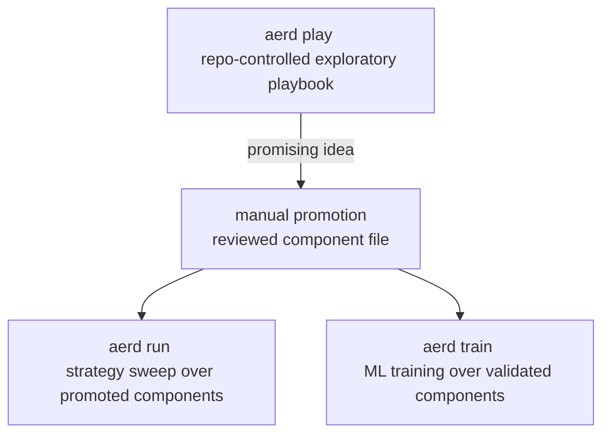

# Research Playbook Component Workflow

## Summary

Add a three-lane research workflow: `aerd play` runs repo-controlled exploratory playbooks by stable ID, `aerd run` runs reproducible strategy sweeps over promoted components, and `aerd train` runs reproducible ML training over promoted or validated labels, indicator-derived features, and model plugins. Labels, indicators, and strategies become file-scoped plugin-like components that are easy to add, remove, review, and discover without editing central runtime code.

---

## Problem Frame

Aegis RD currently feels too code/config-first for ordinary VectorBT-style research. Researchers cannot easily explore many indicator, threshold, or strategy variations in a fast sweep loop, and reusable feature/indicator work pushes them toward editing main registry code rather than adding a small reviewed component the way model plugins work.

This creates the wrong pressure at both ends of the research loop. Early exploration requires too much structure before an idea has proven itself, while reusable work still carries too much central-code editing after an idea is worth keeping. It also blurs the distinction between exploratory evidence, reproducible strategy validation, and ML training evidence.

Prose is authoritative if this diagram and the requirements disagree.

---

## Actors

- A1. Researcher: Explores label, indicator, threshold, and strategy ideas quickly before deciding what is worth keeping.
- A2. Component author: Promotes reusable labels, indicators, and strategies into reviewed component files with stable IDs and metadata.
- A3. Strategy run reviewer: Compares reproducible strategy sweep results and needs clear variant identity, ranking, metrics, and artifacts.
- A4. ML training reviewer: Runs explicit model-training workflows and needs labels/features/model plugins to be validated and auditable.
- A5. Automation agent: Executes CLI workflows and parses lane-specific outputs without guessing whether evidence is exploratory, strategy-run, or training evidence.

---

## Key Flows

- F1. Exploratory playbook run
  - **Trigger:** A researcher calls `aerd play <config>`.
  - **Actors:** A1, A5
  - **Steps:** The config selects a repo-controlled playbook by stable ID, chooses stages and sweep inputs, runs playbook-local exploratory logic, computes configured VectorBT metrics, and writes exploratory play artifacts.
  - **Outcome:** The researcher gets a last-run exploratory artifact and top-10 sweep leaderboard without creating reusable runtime dependencies.
  - **Covered by:** R1, R2, R3, R4, R5, R6, R7, R8, R9, R10
- F2. Manual promotion
  - **Trigger:** A play result or manual experiment produces logic worth reusing.
  - **Actors:** A1, A2
  - **Steps:** The author moves reusable logic into a reviewed label, indicator, or strategy component file with stable ID, metadata, callable behavior, and declared compatibility assumptions.
  - **Outcome:** Reusable research logic becomes a promoted component that `run` or `train` can reference reproducibly.
  - **Covered by:** R11, R12, R13, R14
- F3. Reproducible strategy sweep
  - **Trigger:** A reviewer calls `aerd run <config>`.
  - **Actors:** A2, A3, A5
  - **Steps:** The run config selects promoted indicator and strategy components by stable IDs, provides sweep parameters and portfolio assumptions, evaluates strategy variants, and records metrics and variant identity as reproducible run evidence.
  - **Outcome:** Strategy results are reproducible from promoted components and config, not from playbook or notebook state.
  - **Covered by:** R13, R14, R15, R16, R17
- F4. Reproducible ML training
  - **Trigger:** A reviewer calls `aerd train <config>`.
  - **Actors:** A2, A4, A5
  - **Steps:** The train config selects validated labels, indicator-derived features, and a model plugin, then runs the ML training lane with artifacts that are distinct from strategy-sweep evidence.
  - **Outcome:** Model training is explicit and reproducible, and it does not depend on playbook state.
  - **Covered by:** R18, R19, R20

---

## Requirements

**Lane contract**
- R1. The CLI must expose `aerd play <config>` as the exploratory playbook lane, `aerd run <config>` as the reproducible strategy-sweep lane, and `aerd train <config>` as the reproducible ML training lane.
- R2. Each lane must make its evidence type visible: `play` produces exploratory evidence, `run` produces reproducible strategy-sweep evidence, and `train` produces reproducible ML-training evidence.
- R3. `run` and `train` must not execute playbook notebooks, playbook scripts, inline Python from config, arbitrary external scripts, or unreviewed filesystem paths.
- R4. Configs may select IDs, stages, parameters, sweeps, ranking metrics, data inputs, and portfolio assumptions, but executable research logic must live in repo-controlled playbooks or promoted components.

**Playbook workflow**
- R5. `aerd play <config>` must select a repo-controlled playbook by stable ID, not by an arbitrary notebook or script path.
- R6. Playbooks may contain temporary exploratory label, indicator, threshold, strategy, or baseline ideas without requiring promotion up front.
- R7. A playbook run must write a lane-specific last-run exploratory artifact that is overwritten by the next run by default; an explicit backup option must preserve the previous artifact instead of replacing it.
- R8. Play sweep artifacts must include a top-10 leaderboard of sweep configurations ranked by one config-selected allowed VectorBT metric and direction.
- R9. A sweep configuration leaderboard row must identify the full configuration that was evaluated, including relevant indicator parameters, thresholds, strategy parameters, and portfolio assumptions used by the playbook.
- R10. When a playbook defines a playbook-local baseline, ranking may use direct delta versus that baseline on the configured primary metric; otherwise ranking uses the raw configured metric.

**Promoted components**
- R11. Labels, indicators, and strategies must be promoted as file-scoped plugin-like components with stable IDs, metadata, and callable behavior.
- R12. Adding or removing a promoted label, indicator, or strategy must be component-file-scoped and autodiscovered from project-controlled component locations, not require unrelated central registry edits.
- R13. Promoted component metadata must expose enough identity and compatibility information for reproducibility, including source kind, parameters, outputs, supported role, and relevant alignment or lookahead assumptions.
- R14. Promotion in v1 is manual: the researcher or component author moves reusable logic into a reviewed component file; play artifacts must not be promoted implicitly.

**Strategy sweeps**
- R15. `aerd run <config>` must select promoted strategy components by stable ID; it must not accept temporary playbook strategy logic or inline strategy rules as reproducible run behavior.
- R16. Strategy components must represent reusable signal or rule logic over data, labels, and indicator outputs; portfolio assumptions such as sizing, costs, execution timing, cash sharing, and direction are owned by config.
- R17. Run artifacts must preserve enough variant identity to compare promoted strategy IDs, consumed indicator IDs, parameter values, portfolio assumptions, VectorBT metrics, and ranking or survival outcomes.

**ML training lane**
- R18. `aerd train <config>` must be the explicit ML lane for model-plugin training, separate from strategy sweeps.
- R19. `train` must consume promoted or validated labels, indicator-derived model features, and model plugins; it must not depend on notebook, playbook, or prior `play` run state.
- R20. Features are not a separate first-class component family in v1; indicator outputs and transforms are the promoted source that can become model features for `train`.

---

## Acceptance Examples

- AE1. **Covers R1, R2, R5, R6.** Given a valid play config selecting a known playbook ID and sweep inputs, when a researcher runs `aerd play <config>`, the playbook executes as exploratory research and records that its outputs are exploratory evidence.
- AE2. **Covers R3, R5.** Given a play config that attempts to execute an arbitrary notebook or script path, when `aerd play` validates the config, it rejects the config instead of executing the path.
- AE3. **Covers R7, R8, R9.** Given a playbook sweep over indicator windows and strategy thresholds, when the run completes, the last-run exploratory artifact contains a top-10 leaderboard ranked by the configured VectorBT metric and each row identifies the evaluated sweep configuration.
- AE4. **Covers R7.** Given an existing last-run play artifact, when `aerd play` runs again without backup, the last-run artifact is replaced; when backup is requested, the previous artifact is preserved before the new last-run artifact is written.
- AE5. **Covers R10.** Given a playbook with a local baseline, when leaderboard ranking is requested, the ranked metric can be the delta from that baseline; given no baseline, ranking uses the raw configured metric.
- AE6. **Covers R11, R12, R13, R14.** Given a useful exploratory indicator, when it is promoted, it becomes a reviewed component file with stable ID and metadata and is discovered without editing unrelated label or strategy definitions.
- AE7. **Covers R15, R16, R17.** Given a run config selecting a promoted strategy ID and portfolio assumptions, when `aerd run` executes, it evaluates promoted strategy variants and records strategy/component IDs, parameters, portfolio assumptions, and metrics in reproducible artifacts.
- AE8. **Covers R18, R19, R20.** Given a train config selecting validated labels, indicator-derived features, and a model plugin, when `aerd train` executes, model training runs without depending on prior playbook state or a play artifact.

---

## Success Criteria

- Researchers can do VectorBT-style sweep exploration without editing central source files or promoting every idea before trying it.
- Promoted labels, indicators, and strategies are easy to add, review, remove, and discover as small component files.
- `play`, `run`, and `train` outputs make it obvious which evidence is exploratory, which is reproducible strategy-sweep evidence, and which is ML-training evidence.
- A promising play result has a clear manual promotion path into a stable component, followed by reproducible validation through `run` or `train`.
- A planner can implement the lane split without inventing product behavior around playbook selection, promotion, leaderboard ranking, component families, or portfolio ownership.

---

## Scope Boundaries

- No arbitrary notebook/script execution from config; playbooks are selected by stable ID from repo-controlled playbook definitions.
- No inline Python, formulas, or strategy rules in YAML/config for reproducible `run` or `train` behavior.
- No implicit promotion from a play artifact into a component; promotion is manual and reviewed in v1.
- No separate first-class feature component registry in v1; indicator outputs/transforms serve the feature role for `train`.
- No composite ranking score in v1; play leaderboards rank by one allowed VectorBT metric selected in config.
- No requirement to make play artifacts decision-grade survival evidence; they remain exploratory even when they include useful metrics.
- No GUI research builder, optimizer, AutoML system, or automatic strategy tuning in this issue.

---

## Key Decisions

- Three-lane split: `play`, `run`, and `train` need explicit commands because exploration, reproducible strategy sweeps, and ML training have different evidence contracts.
- Stable playbook IDs: Config-selected playbook IDs preserve ergonomics without opening arbitrary filesystem execution.
- File-scoped promoted components: Component files match the model-plugin mental model better than central registry edits.
- Manual promotion: A human-reviewed component file is the reproducibility boundary between exploratory play and reusable run/train behavior.
- Config-owned portfolio assumptions: Strategies produce reusable signal/rule logic, while configs own sizing, fees, slippage, timing, cash sharing, and direction so the same strategy can be evaluated under different assumptions.
- Single ranking metric first: VectorBT provides rich metrics and custom stats hooks, but v1 should rank by one validated metric rather than inventing a composite score prematurely.

---

## Dependencies / Assumptions

- Issue #23 establishes the need for `aerd run` to support reproducible strategy sweeps without forcing model training.
- Existing indicator and label contracts in `docs/brainstorms/2026-05-17-vectorbt-indicator-contract-requirements.md` and `docs/brainstorms/2026-05-17-vectorbt-label-contract-requirements.md` define native-first metadata and lookahead/alignment expectations this workflow should preserve.
- Current CLI wiring in `research/aegis_research/cli.py` exposes `run` and `exp`, but not `play` or `train`.
- Current run orchestration in `research/aegis_research/experiments.py` is still model-training-shaped and requires a model registry.
- Current indicator registration in `research/aegis_research/indicator_registry.py` is a central in-code registry, not file-scoped component autodiscovery.
- VectorBT PRO supports portfolio metrics and custom stats APIs that can supply the ranking metrics for play leaderboards.

---

## Outstanding Questions

### Deferred to Planning

- [Affects R5, R11, R12][Technical] What exact project-controlled locations and discovery protocol should playbooks and promoted components use?
- [Affects R8, R10][Technical] Which VectorBT metrics should be allowed for v1 leaderboard ranking, and how should metric direction be validated?
- [Affects R7, R17][Technical] What artifact layout and retention behavior should distinguish exploratory play artifacts from reproducible run/train artifacts while staying consistent with existing manifest/provenance conventions?
- [Affects R18, R19][Technical] How should the existing `run_experiment` path be split or reused so `run` becomes strategy-sweep oriented and `train` owns model-plugin training?
