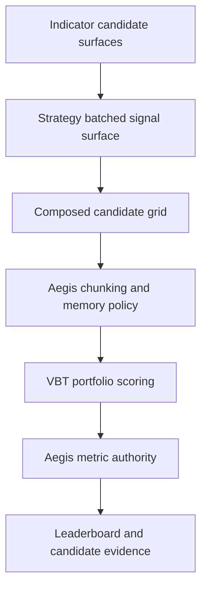

# VBT Native Batched Playbook Contract

## Summary

Aegis should replace per-record playbook sweeps with a VBT-native batched contract: indicator playbooks emit candidate-indexed indicator surfaces, strategy playbooks consume those surfaces and emit candidate-indexed signals, and Aegis centrally chunks, scores, ranks, and records the resulting composed candidates.

---

## Problem Frame

The composed candidate work makes ranking semantics correct, but the performance review surfaced a deeper mismatch with VectorBT-style optimization. The current shape treats each candidate combination as a Python record, materializes Cartesian contexts, copies indicator frames, and runs portfolio simulation candidate by candidate. That preserves correctness for small sweeps but leaves VectorBT's parameter dimensions, broadcasting, grouping, and chunking patterns largely unused.

VectorBT-native research works best when candidate axes are explicit dimensions before simulation. Large sweeps need visible parameter grids, bounded memory, batched signal surfaces, and chunked portfolio execution. Without a new contract, Aegis will keep adding safety patches around a record runner rather than becoming a scalable optimization runner.

Prose is authoritative if this diagram and the requirements disagree.

---

## Actors

- A1. Researcher: Runs large indicator and strategy sweeps to find candidates worth review or promotion.
- A2. Indicator playbook author: Defines candidate indicator outputs and parameter axes in a batched form.
- A3. Strategy playbook author: Defines batched signal logic that consumes raw data and batched indicator outputs.
- A4. Strategy run reviewer: Reads ranked results and needs each row to remain a complete, centrally scored strategy candidate.
- A5. Automation agent: Launches runs, checks scalability diagnostics, and consumes artifacts without guessing hidden matrix semantics.

---

## Key Flows

- F1. Batched indicator sweep authoring
  - **Trigger:** A researcher wants to explore many variants of an indicator family.
  - **Actors:** A1, A2
  - **Steps:** The indicator playbook exposes candidate-indexed outputs and candidate metadata. The outputs remain bar-aligned and symbol-aligned with runner data. The playbook does not emit signals, portfolio inputs, or leaderboard metrics.
  - **Outcome:** Indicator candidates are available as native batch dimensions for downstream strategy composition.
  - **Covered by:** R1, R2, R3, R5
- F2. Batched strategy signal generation
  - **Trigger:** A run selects batched indicator outputs and a strategy playbook.
  - **Actors:** A1, A3, A5
  - **Steps:** The strategy playbook consumes runner data and batched indicator surfaces, applies strategy parameter axes, and emits candidate-indexed entries/exits. Candidate metadata preserves strategy params separately from indicator params.
  - **Outcome:** Aegis receives one batched signal surface that represents many complete strategy candidates.
  - **Covered by:** R1, R4, R5, R6, R7
- F3. Chunked central scoring
  - **Trigger:** Aegis has a composed candidate grid to evaluate.
  - **Actors:** A4, A5
  - **Steps:** Aegis validates the grid, reports planned candidate counts, applies memory/chunk policy, runs candidates through central VBT portfolio scoring in batches, and extracts metrics under the existing Aegis authority boundary.
  - **Outcome:** The leaderboard compares complete strategy candidates without one portfolio simulation per candidate when batching is feasible.
  - **Covered by:** R8, R9, R10, R11, R12
- F4. Review and promotion evidence
  - **Trigger:** A run completes and a reviewer or agent inspects winners.
  - **Actors:** A1, A2, A3, A4, A5
  - **Steps:** Artifacts show candidate axes, source identities, chunk execution, metrics, and ranked rows. A reviewer can identify which indicator candidates and strategy candidate produced a winner without treating an indicator as globally best.
  - **Outcome:** Promotion remains manual and evidence-driven while performance artifacts stay machine-readable.
  - **Covered by:** R12, R13, R14, R15

---

## Requirements

**Batched playbook contracts**
- R1. Indicator and strategy playbook sweeps must use batched candidate surfaces as the forward contract, not lists of independently executable candidate records.
- R2. Indicator playbooks must emit candidate-indexed indicator outputs plus candidate metadata; they must not emit strategy signals, portfolio settings, or leaderboard metrics.
- R3. Indicator candidate outputs must remain aligned to the runner's bar index and symbol shape across every candidate dimension.
- R4. Strategy playbooks must consume batched runner data and batched indicator outputs, then emit candidate-indexed entry and exit signals plus strategy candidate metadata.
- R5. Candidate metadata must preserve indicator source identity, indicator params, strategy source identity, and strategy params as separate concepts so overlapping parameter names do not collide.
- R6. The batched contract must make candidate axes and planned candidate counts inspectable before portfolio simulation begins.

**VBT-native scoring semantics**
- R7. A ranked row must still represent a complete composed strategy candidate: selected indicator candidates, selected strategy candidate, centrally simulated portfolio, and Aegis-owned metrics.
- R8. Aegis must score batched candidates through central VBT portfolio execution in chunks or batches where feasible, instead of defaulting to one portfolio simulation per composed candidate.
- R9. Batched scoring must preserve per-candidate portfolio isolation and shared-cash semantics so candidate results remain comparable with the current central execution contract.
- R10. Metric extraction must operate at candidate-group scope and preserve the existing metric authority, metric evidence, and per-symbol evidence expectations.
- R11. Candidate-grid size, chunk execution, memory budget decisions, and skipped or failed chunks must be visible to reviewers and automation.

**Artifacts and failure policy**
- R12. Run artifacts must preserve complete candidate provenance in a form that remains practical for large candidate grids.
- R13. The top leaderboard may stay compact, but full candidate evidence must remain machine-readable without requiring agents to reconstruct hidden batch dimensions.
- R14. Official ranked artifacts must not publish partial winners as completed evidence when the run violates the configured completeness policy.
- R15. Failed or rejected candidate batches must include enough candidate context for reproduction and debugging without turning failed results into authoritative leaderboard rows.

**Transition and ownership boundaries**
- R16. The redesign should be forward-first: new playbooks should target the batched contract, and the per-record sweep contract should not remain the long-term strategy-playbook shape.
- R17. Fixed components remain fixed promoted implementations and must not become sweep/candidate-grid producers.
- R18. Promotion from a batched winner remains manual and source-specific; Aegis does not auto-write promoted components.

---

## Acceptance Examples

- AE1. **Covers R1, R2, R3, R6.** Given an indicator playbook with 100 moving-average candidates, when Aegis loads the playbook, the run can inspect the 100-candidate indicator axis before strategy scoring and no raw indicator candidate enters the leaderboard.
- AE2. **Covers R4, R5, R7.** Given a strategy playbook with 10 threshold candidates consuming the 100 indicator candidates, when the run composes the grid, each ranked candidate preserves both indicator params and strategy params without flattening them into one ambiguous map.
- AE3. **Covers R8, R9, R10.** Given a composed grid with many candidates and multiple symbols, when Aegis scores the run, candidates are evaluated in VBT-native batches or chunks while preserving candidate-level portfolio isolation and comparable central metrics.
- AE4. **Covers R11, R14, R15.** Given a composed grid that exceeds the configured memory or chunk policy, when the run starts scoring, Aegis fails visibly before publishing completed leaderboard evidence and records enough candidate-grid context for reproduction.
- AE5. **Covers R12, R13, R18.** Given a completed batched run, when a reviewer inspects the winner, the artifact identifies the winning indicator source/candidate and strategy source/candidate sufficiently for manual promotion.
- AE6. **Covers R2, R4, R14.** Given a playbook that tries to include playbook-owned metrics, portfolio settings, or unsupported signal fields in the wrong layer, when Aegis validates the batched contract, the run rejects the playbook instead of silently ignoring those fields.

---

## Success Criteria

- Representative large sweeps avoid one VBT portfolio simulation per composed candidate when batching is feasible.
- Candidate-grid memory use is bounded by explicit chunk or budget policy rather than eager full Cartesian materialization.
- Batched indicator and strategy playbooks remain understandable enough for authors to write without reverse-engineering internal runner behavior.
- Leaderboard rows remain semantically identical to current composed candidates: complete strategy candidates scored by Aegis/VBT metrics.
- Artifacts remain usable by automation for ranking, audit, reproduction, and manual promotion even when candidate counts are much larger than top leaderboard size.
- A downstream planner can design implementation phases without inventing contract ownership, failure policy, metric authority, or promotion semantics.

---

## Scope Boundaries

- Do not keep the current per-record strategy sweep contract as the long-term primary path.
- Do not make runner-owned stacking the primary authoring model for this redesign.
- Do not replace VBT with a custom simulator.
- Do not let playbooks provide authoritative portfolio metrics or leaderboard rows.
- Do not add automatic promotion from winning batched candidates into component files.
- Do not require this redesign to land inside the current composed-candidate PR.
- Do not solve every artifact-normalization concern unless it is necessary for large batched candidate evidence.
- Do not introduce component sweeps; components remain fixed implementations.

---

## Key Decisions

- Forward replacement over compatibility layering: A clean batched contract is preferred over preserving two first-class sweep shapes indefinitely.
- Both indicators and signals are batched: The redesign should make candidate dimensions native across the full research path, not only at final signal scoring.
- Aegis remains metric authority: VBT-native batching changes execution shape, not ownership of portfolio metrics or ranking.
- Chunking and memory visibility are product requirements: Large-grid behavior must be observable and bounded, not left as an implementation afterthought.
- Official leaderboards remain complete evidence: Failed or partial scoring can produce diagnostics, but must not masquerade as completed ranked results.

---

## Dependencies / Assumptions

- VectorBT can represent the needed candidate and symbol dimensions while preserving candidate-level portfolio isolation and metric extraction.
- Existing portfolio semantics around execution timing, sizing, shared cash, and per-symbol metrics remain authoritative for the redesign.
- Playbook authors are willing to adopt a stricter batched shape in exchange for scalability and clearer VBT semantics.
- Benchmarks with realistic rows, symbols, candidate counts, and signal densities will be needed before selecting default chunk sizes or memory budgets.
- Current composed-candidate provenance remains the semantic baseline even if artifact layout becomes more normalized for scale.

---

## Outstanding Questions

### Deferred to Planning

- [Affects R4, R8][Needs research] What exact VBT column/group convention best preserves candidate identity, symbol identity, and candidate-level portfolio isolation?
- [Affects R10][Needs research] How should grouped VBT metrics map back into existing metric evidence and per-symbol evidence without losing comparability?
- [Affects R11][Technical] What chunk and memory-budget knobs should be configured by users versus derived automatically by Aegis?
- [Affects R12, R13][Technical] Which artifact fields should be normalized into catalogs versus denormalized for top-leaderboard readability?
- [Affects R16][Technical] Should existing example playbooks be converted immediately when the batched contract lands, or should examples be replaced in a staged documentation pass?
