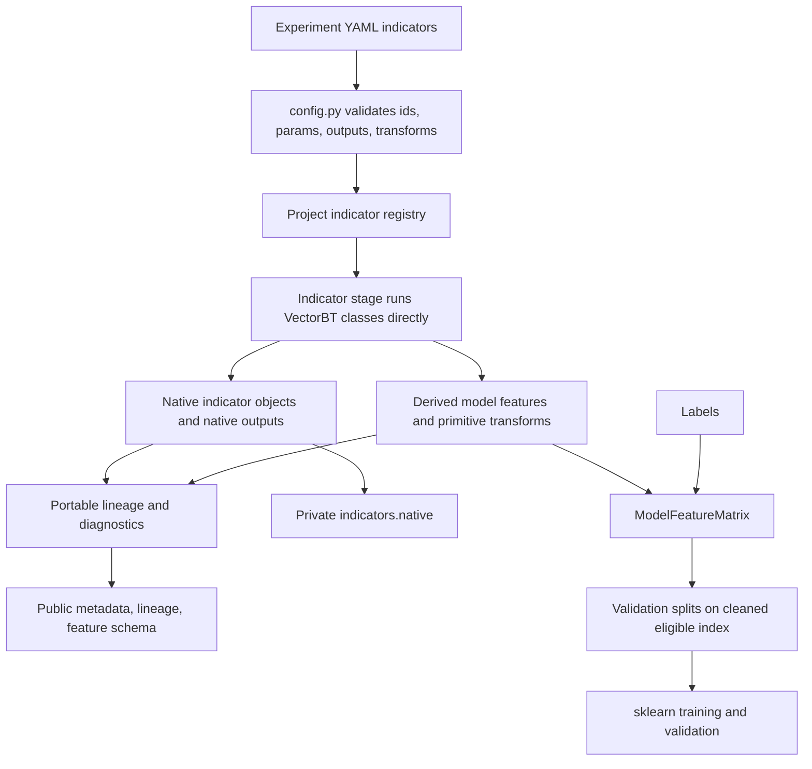

# feat: Implement VectorBT indicator contract

## Summary

Replace the current lossy indicator matrix builder with a VectorBT-first indicator stage: configs resolve through a project-owned registry, built-in and custom indicators run as native VectorBT classes with visible parameters, and sklearn receives only a derived model-feature matrix plus reversible lineage. The implementation should preserve native indicator objects and portable metadata through artifacts before flattening at the model boundary.

---

## Problem Frame

`research/aegis_research/indicators.py` currently defines the model input contract but hides VectorBT parameter levels, loops windows one at a time, mixes native outputs with derived transforms, and returns only a DataFrame plus compact metadata. Issue #5 and the origin requirements document require the stage to keep native VectorBT semantics intact until the modeling boundary.

---

## Requirements

- R1. Treat native VectorBT indicator objects as first-class indicator-stage outputs.
- R2. Preserve native indicator state through feature generation and artifact capture; flatten only at the model boundary.
- R3. Expose one built-in/custom indicator contract for input names, parameter names, output names, selected outputs, parameter values, transforms, and model-feature eligibility.
- R4. Preserve visible parameter levels by default for artifact and model-feature outputs.
- R5. Expose both native outputs and derived model-facing features without requiring downstream stages to infer semantics from column strings.
- R6. Run VectorBT parameter sweeps through `.run(...)` parameter lists where appropriate instead of one Python loop per value.
- R7. Make zipped versus Cartesian parameter-grid semantics explicit in config and artifacts.
- R8. Reserve `run_combs` for multiple-indicator-instance cases, not ordinary sweeps.
- R9. Make meaningful params such as MA/RSI `window` and `wtype` explicit in config, registry, and metadata.
- R10. Record grid size, parameter combinations, column expansion, random subset/execution controls when used, and memory-risk evidence.
- R11. Produce deterministic sklearn feature names with a reversible mapping back to indicator id, output, params, symbol, and transform.
- R12. Represent derived transforms separately from native outputs, including formulas such as MA distance and RSI scaling.
- R13. Allow primitive Pandas/accessor transforms when they still participate in lineage, diagnostics, and artifacts.
- R14. Define a path for reusable/domain transforms to graduate into `IndicatorFactory` indicators.
- R15. Preserve stable symbol identity for single-symbol and multi-symbol outputs and avoid duplicate flattened names.
- R16. Support trusted code-registered custom indicators as first-class definitions.
- R17. Require custom indicators to provide or wrap VectorBT-compatible indicator classes/factory outputs.
- R18. Reference custom indicators by stable id from config; do not execute inline Python snippets or arbitrary formulas from config.
- R19. Validate requested inputs, params, outputs, and transforms against the project registry before indicator-dependent side effects.
- R20. Give custom indicators the same lineage, warmup/NaN diagnostics, native-artifact metadata, and sklearn feature mapping as built-ins.
- R20a. Require custom `IndicatorFactory` indicators to be bar-aligned in v1: selected outputs must preserve the input index/symbol shape expected by VectorBT's wrapper model.
- R21. Report warmup and missing-value diagnostics per indicator/output/param combination/symbol/feature where practical.
- R22. Apply an explicit warmup/NaN policy consistently across indicators, primitive transforms, labels, and validation splits before training.
- R23. Verify feature, label, and validation-split alignment after warmup/NaN handling.
- R24. Make infinite-value replacement, drops, or invalid-feature states visible in metadata.
- R25. Write portable indicator metadata sufficient to reconstruct feature lineage without loading native artifacts.
- R26. Make native VectorBT indicator artifacts eligible for private persistence.
- R27. Keep public artifacts portable and secret-safe.
- R28. Cover multiple windows, multiple symbols, visible params, deterministic feature names, reversible feature mapping, warmup/NaN diagnostics, and built-in/custom parity in tests.

**Origin actors:** A1 experiment author, A2 experiment runner, A3 model training stage, A4 run reviewer or automation agent, A5 custom indicator author.

**Origin flows:** F1 build built-in indicator features, F2 build registered custom indicator features, F3 cross the modeling boundary.

**Origin acceptance examples:** AE1 MA windows preserve native parameter identity, AE2 grid semantics are explicit, AE3 flattened feature names reverse to lineage, AE4 custom indicators use the trusted registry, AE5 inline code is rejected, AE6 warmup/NaN/inf handling is reported and aligned, AE7 artifacts expose portable lineage and native roles, AE8 tests verify identity and mapping.

---

## Scope Boundaries

- Do not carry native VectorBT indicator objects into sklearn internals or validation algorithms.
- Do not support inline Python snippets, arbitrary formulas, or untrusted config code for v1 custom indicators.
- Do not build a public plugin marketplace, package-entry-point discovery system, or third-party extension ecosystem.
- Do not convert every primitive Pandas transform into a custom VectorBT indicator immediately.
- Do not force shape-changing transforms such as Renko bricks, event lists, compressed bars, trades, or arbitrary objects into the v1 indicator stage.
- Do not design the full large-scale optimization system now; expose grid and scale semantics, but defer exact chunking/execution architecture.
- Do not add backward-compatibility shims for the current lossy indicator output contract.
- Do not require portable metadata to replace private native persistence where native state materially affects reproducibility.
- Do not implement notebook/Data.run convenience mirroring into VectorBT's global registry in v1 unless a current experiment-path consumer requires it.

### Deferred to Follow-Up Work

- Full high-cardinality execution architecture: Defer advanced chunking, cache release, distributed execution, and artifact-size policies until large grids require them.
- Broader indicator authoring ergonomics: Defer notebook helpers, public examples, and optional `vbt.IF` mirror utilities beyond the minimal trusted registry path.
- Universe-aware feature eligibility: Carry universe/date scope in lineage where available, but defer full historical universe-membership enforcement unless a ranking/selection indicator needs it.
- Public model-feature matrix artifact persistence: Persist schema, lineage, diagnostics, and feature mapping in v1; defer full matrix artifact persistence until there is an explicit size/privacy policy.
- Non-bar-aligned feature pipelines: Use a separate future contract, likely around `vbt.parameterized` or purpose-built event/bar pipelines, for transforms whose output shape differs from the input data.

---

## Context & Research

### Relevant Code and Patterns

- `research/aegis_research/indicators.py` currently returns `IndicatorResult(frame, metadata)` and uses `vbt.MA.run(..., hide_params=True)` / `vbt.RSI.run(..., hide_params=True)` inside per-window loops.
- `research/aegis_research/config.py` centralizes path-aware validation through `ConfigValidationIssue`, `ConfigValidationError`, `_validate_raw_config`, and `_validate_indicators`.
- `research/aegis_research/experiments.py` owns stage orchestration and currently passes `indicator_result.frame` into label/split/validation work.
- `research/aegis_research/models.py` currently flattens indicator MultiIndex columns at `_stack_indicator_panel` by joining tuple parts with `__`.
- `research/aegis_research/provenance/experiment_artifacts.py` owns public JSON/CSV/model artifact writes and delegates private native object persistence to `NativeArtifactWriter`.
- `research/aegis_research/provenance/native.py` provides the private native artifact plus public sidecar pattern needed for `indicators.native`.
- `tests/research/aegis_research/test_config_contract.py`, `test_stage_provenance.py`, `test_experiment_provenance.py`, `test_vectorbt_artifacts.py`, and `test_validation_artifacts.py` contain the patterns to extend.

### Institutional Learnings

- `docs/solutions/architecture-patterns/config-contract-security-reproducibility-2026-05-16.md` requires fail-fast, schema-versioned config validation before side effects, redacted config evidence, path-aware issues, and explicit third-party library constraints.
- `docs/solutions/best-practices/nasdaq-100-backtest-universe-bias-2026-05-17.md` warns that feature generation should preserve decision-date/universe context where asset selection or ranking can introduce lookahead bias.

### External References

- VectorBT PRO docs: `IndicatorFactory.with_apply_func` is the default custom-indicator path when an apply function can operate on one parameter combination and VectorBT should handle parameter iteration/output concatenation.
- VectorBT PRO docs: `IndicatorFactory.with_custom_func` is lower-level and should be reserved for unusual output or concatenation control.
- VectorBT PRO support learning: `IndicatorFactory` outputs must match the input wrapper shape; shape-changing transforms should use a separate pipeline rather than the indicator stage.
- VectorBT PRO docs: `.run(...)` accepts parameter lists, uses zipped semantics by default, and uses `param_product=True` for Cartesian products.
- VectorBT PRO docs: `run_combs` should be used only when multiple indicator instances are required.
- VectorBT PRO docs and Discord: `vbt.IF.register_custom_indicator` registers indicator classes under global custom locations for lookup/Data.run convenience, but it is global mutable state and not sufficient as an experiment contract.
- VectorBT PRO docs and Discord: `Data.run(..., concat=True)` across mixed indicators can require `hide_params=True` when column levels differ, which conflicts with lineage-first artifacts.

---

## Key Technical Decisions

- Use a project-owned indicator registry as the authoritative experiment contract: VectorBT's global registry can store indicator classes for convenience in future ergonomics work, but the project registry owns selected outputs, transforms, eligibility, diagnostics, and lineage rules.
- Run built-ins and custom indicators through direct indicator class `.run(...)` calls: This preserves visible parameter levels and avoids `Data.run` concatenation pressure to hide params.
- Default custom indicator construction to `vbt.IF(...).with_apply_func(...)`: This matches VectorBT conventions while keeping project custom indicators simple and metadata-rich.
- Enforce IndicatorFactory output-shape discipline: v1 custom indicators must produce one bar-aligned output value per input bar/symbol/parameter combination; shape-changing transforms are out of scope for this stage.
- Persist one private native indicator bundle for v1: Store native VectorBT indicator instances together as `indicators.native` with public sidecar metadata; split into per-indicator native artifacts later only if size or inspection needs justify it.
- Use a model-boundary object rather than passing raw DataFrames everywhere: Downstream model/validation code should consume a derived model-feature matrix plus mapping, not native indicator outputs.
- Make the feature mapping authoritative over feature-name parsing: Use deterministic sklearn column names generated by one helper, store reversible lineage in a mapping artifact, and treat duplicate/colliding names as validation failures.
- Apply warmup/NaN/inf policy before split construction: Build a v1 date-level eligible modeling index after indicator features and labels are available, where a date is eligible only when all selected model features and labels across configured symbols pass policy. Defer per-symbol eligibility masks until validation/split APIs explicitly support them.
- Use strict v1 invalid-value policy: Replace or drop only through an explicit policy that records counts; all-NaN features, duplicate feature names, unsupported params, and unknown transforms fail fast.

---

## Open Questions

### Resolved During Planning

- Which registry should be authoritative? Use the project-owned registry. Treat any future `vbt.IF.register_custom_indicator(..., location="aegis")` mirroring as notebook/Data.run ergonomics only, not v1 experiment execution scope.
- Should the canonical stage path use `Data.run`? No. Use direct indicator class `.run(...)` calls because the artifact path needs visible params and per-definition lineage.
- What should happen with `run_combs`? Keep it out of ordinary sweeps; plan only direct `.run(...)` list params and `param_product=True` grids.
- Should primitive returns/volatility immediately become VectorBT indicators? No. Keep them primitive in v1 while giving them the same lineage and diagnostics schema.
- Are shape-changing custom indicators valid v1 custom indicators? No. `IndicatorFactory` custom indicators must be bar-aligned; non-bar-aligned transforms need a separate future contract.
- Should this bump `schema_version`? Keep `schema_version: 1` because this scaffold is still evolving forward-first with no established external config consumers; migrate shipped configs in place rather than adding compatibility shims.

### Deferred to Implementation

- Exact dataclass/helper names: Implementation should choose names that fit the edited modules while preserving the plan's boundaries.
- Exact flat feature-name string format: Implementation should define one deterministic helper and mapping schema; mapping must be authoritative and collision-tested.
- Exact native bundle serialization shape: Implementation should verify `NativeArtifactWriter` can persist the chosen bundle object and adjust to a simple serializable container if needed.
- Exact artifact-size thresholds: Record grid size and native artifact size evidence in v1; defer hard thresholds unless implementation reveals immediate failure risk.

---

## High-Level Technical Design

> *This illustrates the intended approach and is directional guidance for review, not implementation specification. The implementing agent should treat it as context, not code to reproduce.*



---

## Implementation Units

### U1. Define Project Indicator Registry And Config Contract

**Goal:** Add the authoritative indicator definition registry and update config validation so experiments reference built-in and custom indicators by stable ids with explicit params, outputs, transforms, grid semantics, and invalid-value policy.

**Requirements:** R3, R7, R9, R10, R16, R17, R18, R19, R20a, AE2, AE4, AE5.

**Dependencies:** None.

**Files:**
- Create: `research/aegis_research/indicator_registry.py`
- Modify: `research/aegis_research/config.py`
- Test: `tests/research/aegis_research/test_config_contract.py`
- Test: `tests/research/aegis_research/test_indicators.py`

**Approach:**
- Introduce a frozen indicator-definition model that stores stable id, definition kind, either a VectorBT indicator class or primitive transform runner, declared input names, param names, output names, selected outputs, supported transforms, default run kwargs, and model-feature eligibility.
- Register built-in definitions for MA and RSI, plus primitive transform definitions for returns and rolling volatility.
- Add at least one trusted custom test indicator built with `vbt.IF(...).with_apply_func(...)` for parity tests.
- Replace the current list-only `IndicatorConfig` shape with a list of indicator specs; use fixture configs in this unit and migrate shipped baseline configs in U5 when the experiment flow is wired through the new builder.
- Validate ids, params, outputs, transforms, grid mode, list lengths for zipped params, `param_product` usage, finite numeric params where applicable, categorical/enumerated params such as `wtype` against registry-allowed values, and no inline Python/formula fields before experiment execution.
- Validate that registry definitions used as `IndicatorFactory` indicators declare bar-aligned outputs only; reject or exclude shape-changing/event-style definitions from the v1 indicator registry.

**Technical design:** *(directional config shape, not implementation code)*

```yaml
indicators:
  invalid_value_policy: drop_rows
  specs:
    - id: returns
      params:
        window: [1, 5, 20]
      outputs: [returns]
      model_features:
        - output: returns

    - id: ma
      params:
        window: [10, 30]
        wtype: simple
      grid: zipped
      outputs: [ma]
      model_features:
        - output: ma
          transform: distance_to_close

    - id: rsi
      params:
        window: [14]
        wtype: wilder
      outputs: [rsi]
      model_features:
        - output: rsi
          transform: scale_0_1
```

**Execution note:** Start with config validation tests because invalid configs must fail before VectorBT calls or artifact side effects.

**Patterns to follow:**
- Path-aware `ConfigValidationIssue` aggregation in `research/aegis_research/config.py`.
- Config contract learning in `docs/solutions/architecture-patterns/config-contract-security-reproducibility-2026-05-16.md`.

**Test scenarios:**
- Covers AE4. Happy path: config referencing built-in `ma` and custom registry id validates and resolves definitions with declared params/outputs/transforms.
- Covers AE5. Error path: config containing inline Python, formula text, or arbitrary function/import fields under indicators fails before experiment execution.
- Error path: unknown indicator id, unknown param name, unknown output, and unknown transform are all reported with config paths.
- Error path: zipped param lists with unequal lengths fail unless the spec uses explicit scalar/list broadcasting rules accepted by the registry.
- Edge case: duplicate indicator ids or built-in/custom id conflicts fail deterministically.
- Edge case: Cartesian grids require explicit `param_product` and metadata records the requested grid mode.
- Error path: a custom definition marked as shape-changing or event-output is rejected from the v1 indicator registry with guidance to use a future non-bar-aligned pipeline.

**Verification:**
- Configs in `research/configs/experiments/` use the new explicit indicator spec shape.
- Invalid indicator configs aggregate path-aware validation issues and do not construct run artifacts.
- U1 does not need to keep end-to-end experiments runnable on its own; U1 through U3 are expected to land together if the branch must remain runnable after every commit.

### U2. Build Native-First Indicator Results

**Goal:** Replace the current indicator builder with a native-first stage result that runs VectorBT indicator classes with visible params, keeps native outputs, and derives model features with lineage rather than collapsing semantics into column names.

**Requirements:** R1, R2, R3, R4, R5, R6, R8, R9, R12, R13, R14, R16, R17, R20, R20a, AE1, AE2, AE4.

**Dependencies:** U1.

**Files:**
- Modify: `research/aegis_research/indicators.py`
- Modify: `research/aegis_research/indicator_registry.py`
- Test: `tests/research/aegis_research/test_indicators.py`
- Test: `tests/research/aegis_research/test_stage_provenance.py`

**Approach:**
- Expand `IndicatorResult` into a richer immutable result carrying native indicator instances, native output frames, model-feature candidates, feature lineage records, diagnostics, and portable metadata.
- Run `vbt.MA` and `vbt.RSI` once per definition with parameter lists where possible, `hide_params=None`, and `hide_default=False` so effective defaults such as `wtype` remain visible.
- Use direct `.run(...)` on registry-provided indicator classes for built-ins and custom indicators.
- Keep primitive returns and rolling volatility as local transforms for v1, but emit lineage records and diagnostics through the same schema as VectorBT-backed features.
- Represent derived transforms separately from native outputs: examples include MA distance `close / ma - 1` and RSI scaling `rsi / 100`.
- Treat custom `IndicatorFactory` outputs as valid only when their frames align with the source index and symbol axis; fail fast if an output cannot be mapped back to input bars.

**Patterns to follow:**
- Existing `IndicatorResult` stage-result pattern in `research/aegis_research/indicators.py`.
- `LabelResult` native-object metadata pattern in `research/aegis_research/labels.py`.

**Test scenarios:**
- Covers AE1. Happy path: MA windows `[10, 30]` produce one native MA indicator result with visible `window` and effective `wtype` levels.
- Covers AE2. Happy path: zipped parameter lists and `param_product=True` produce different recorded parameter combinations without using `run_combs`.
- Covers AE4. Happy path: a custom `IndicatorFactory.with_apply_func` indicator resolves through the project registry, runs via `.run(...)`, and exposes the same lineage shape as MA/RSI.
- Edge case: single-symbol and multi-symbol close inputs both keep a stable `symbol` identity in native outputs and lineage.
- Error path: indicator output requested by config but not produced by the native class fails with an explicit typed/path-aware error.
- Error path: custom indicator output with a different row count than the source data fails before model feature extraction.

**Verification:**
- Indicator stage output contains native objects and portable lineage before any sklearn flattening.
- Tests verify identity and metadata, not only numeric output values.

### U3. Implement Model Boundary, Feature Mapping, And Diagnostics

**Goal:** Create the explicit modeling boundary that converts eligible native/derived indicator outputs into sklearn-ready features with deterministic names, reversible mapping, invalid-value diagnostics, and aligned feature/label/split indexes.

**Requirements:** R5, R10, R11, R12, R13, R15, R21, R22, R23, R24, AE3, AE6, AE8.

**Dependencies:** U2.

**Files:**
- Modify: `research/aegis_research/indicators.py`
- Modify: `research/aegis_research/models.py`
- Modify: `research/aegis_research/validation.py`
- Modify: `research/aegis_research/experiments.py`
- Test: `tests/research/aegis_research/test_indicators.py`
- Test: `tests/research/aegis_research/test_validation_artifacts.py`

**Approach:**
- Add a model-boundary object or helper that takes `IndicatorResult` plus labels and returns a model-feature matrix, feature mapping, diagnostics, and cleaned date-level eligible index.
- Make the feature mapping the reversible source of truth. Feature names should be deterministic and collision-checked, but downstream audit should use the mapping rather than parsing strings.
- Apply v1 warmup/NaN/inf policy before validation splits are built: count warmup/missing/inf values per feature lineage, apply the configured drop/replace/reject policy, and build date-level splits from dates where all configured symbols/features/labels pass policy.
- Replace `_stack_indicator_panel` inference from arbitrary column strings with mapping-aware stacking that preserves symbol identity and validates label/feature symbol parity.
- Ensure model code receives only model-facing DataFrames and feature metadata, never native VectorBT objects.
- No changes are expected in `research/aegis_research/splits.py`; `experiments.py` should pass the cleaned date index into the existing split helpers.

**Patterns to follow:**
- Current multi-symbol stacking assumptions in `research/aegis_research/models.py`.
- Split construction flow in `research/aegis_research/experiments.py` and `research/aegis_research/splits.py`.

**Test scenarios:**
- Covers AE3. Happy path: multi-symbol MA distance and RSI features flatten to unique deterministic names and reverse-map to indicator id, output, params, symbol, and transform.
- Covers AE6. Happy path: MA, RSI, returns, and labels with different warmup horizons produce one cleaned eligible index before split construction.
- Error path: feature names that would collide fail before training.
- Error path: symbols present in labels but missing from features, or features but missing from labels, fail before training.
- Error path: derived transform producing `inf` records counts and applies the explicit policy; no silent replacement.
- Edge case: window larger than available history produces all-NaN diagnostics and fails or excludes the feature according to policy.
- Integration: `min_train_samples` validation uses sample counts after warmup/NaN handling, not before.

**Verification:**
- Downstream training/validation consumes a stable model-feature matrix with a mapping artifact, and split indexes match cleaned feature/label availability.

### U4. Persist Indicator Metadata, Lineage, Features, And Native Artifacts

**Goal:** Add indicator artifact writing so public metadata explains lineage and diagnostics while private native persistence preserves VectorBT objects when portable metadata is insufficient.

**Requirements:** R1, R2, R10, R11, R20, R21, R24, R25, R26, R27, AE7.

**Dependencies:** U2, U3.

**Files:**
- Modify: `research/aegis_research/provenance/experiment_artifacts.py`
- Modify: `research/aegis_research/provenance/native.py` if native bundle handling needs a small adapter
- Test: `tests/research/aegis_research/test_experiment_provenance.py`
- Test: `tests/research/aegis_research/test_vectorbt_artifacts.py`
- Test: `tests/research/aegis_research/test_provenance_manifest.py`

**Approach:**
- Add artifact writer methods for indicator metadata, feature mapping/lineage, diagnostics, feature schema, and private native bundle. U5 should invoke these methods from the finalized run lifecycle before validation/model artifacts.
- Do not add public persistence of the full model-feature matrix in v1. Persist public schema, lineage, diagnostics, and feature mapping only.
- Persist private native VectorBT indicator objects as `indicators.native` with a public `indicators.native.metadata` sidecar using `NativeArtifactWriter`.
- Ensure public metadata contains no native object reprs, absolute local paths, provider secrets, or private transport state.
- Link indicator artifacts upstream/downstream through manifest metadata consistently with existing data/labels/splits artifacts.

**Technical design:** *(directional artifact contract, not implementation code)*

| Artifact id | Visibility | Type | Producer stage | Path shape | Schema |
|---|---|---|---|---|---|
| `indicators.metadata` | public | json | indicators | `indicators/metadata.json` | `indicators_metadata.v1` |
| `indicators.lineage` | public | json | indicators | `indicators/lineage.json` | `indicator_lineage.v1` |
| `indicators.diagnostics` | public | json | indicators | `indicators/diagnostics.json` | `indicator_diagnostics.v1` |
| `indicators.features.schema` | public | json | indicators | `indicators/features.schema.json` | `model_feature_schema.v1` |
| `indicators.native` | private | native_vectorbt | indicators | `native/indicators.pkl` | `native.v1` |
| `indicators.native.metadata` | public | json | indicators | `native/indicators.pkl.metadata.json` | `native_metadata.v1` |

**Patterns to follow:**
- `write_data_metadata_artifact`, `write_data_native_artifact`, and `write_stage_native_artifacts` in `research/aegis_research/provenance/experiment_artifacts.py`.
- Private native sidecar behavior in `research/aegis_research/provenance/native.py`.

**Test scenarios:**
- Covers AE7. Happy path: a completed run writes public indicator metadata/lineage and private native indicator artifact sidecar without absolute paths.
- Error path: native indicator persistence failure marks the native artifact failed and does not leave a completed partial file.
- Error path: secret-like material in public indicator metadata is rejected by existing public safety checks.
- Integration: manifest lists indicator artifacts with correct producer stage, schema version, status, visibility, path, and upstream references.

**Verification:**
- Run manifests expose indicator evidence before validation artifacts, and public metadata can reconstruct every model feature's lineage without loading private native files.

### U5. Integrate Experiment Flow And Migrate Baseline Behavior

**Goal:** Wire the new indicator contract through `run_experiment`, labels, splits, validation, and baseline configs so existing synthetic experiments still exercise the same strategy intent through the new model boundary.

**Requirements:** R2, R5, R11, R15, R22, R23, R28, AE6, AE8.

**Dependencies:** U1, U2, U3, U4.

**Files:**
- Modify: `research/aegis_research/experiments.py`
- Modify: `research/aegis_research/validation.py`
- Modify: `research/aegis_research/models.py`
- Modify: `research/configs/experiments/synthetic_ml_baseline.yaml`
- Modify: `research/configs/experiments/synthetic_walkforward_baseline.yaml`
- Modify: `research/configs/experiments/synthetic_trendlb_baseline.yaml`
- Test: `tests/research/aegis_research/test_experiment_provenance.py`
- Test: `tests/research/aegis_research/test_validation_artifacts.py`

**Approach:**
- Change `run_experiment` to build indicators, build labels, derive the model feature matrix with label-aware cleanup, build validation splits from the cleaned eligible index, then run validation.
- Keep sklearn and validation internals receiving plain feature matrices, but pass feature mapping/metadata where artifacts or diagnostics need it.
- Update baseline YAML configs to the new explicit indicator list shape and preserve existing feature intent: returns, MA distance, volatility, and RSI scaling.
- Remove hidden dependence on `indicator_result.frame` as the only contract.

**Patterns to follow:**
- Existing run lifecycle and failure handling in `research/aegis_research/experiments.py`.
- Existing validation aggregate artifact structure in `research/aegis_research/validation.py` and `experiment_artifacts.py`.

**Test scenarios:**
- Integration: synthetic holdout run completes and manifest includes config, data, indicators, labels, splits, validation, portfolio, metrics, and report artifacts.
- Integration: synthetic multi-asset run preserves symbol identity through indicators, labels, probabilities, signals, portfolios, metrics, and report.
- Error path: invalid indicator config fails before data loading or run artifact side effects when passed through static config validation.
- Edge case: train/test sample counts after warmup/NaN cleanup still satisfy `min_train_samples`; failures explain the post-cleaning counts.

**Verification:**
- Current synthetic workflows run through the new indicator contract without lossy hidden-param behavior.

### U6. Document The Experiment-Facing Indicator Shape

**Goal:** Update project documentation so experiment authors and future agents understand how to add built-in and custom indicators without relying on inline code or VectorBT global registry state.

**Requirements:** R3, R12, R14, R16, R18, R19, R25, R28.

**Dependencies:** U1, U2, U3.

**Files:**
- Modify: `docs/vectorbt-scaffold.md`
- Test: `tests/research/aegis_research/test_config_contract.py`

**Approach:**
- Document the v1 indicator config shape with examples for MA, RSI, primitive returns/volatility, and one trusted custom indicator.
- Explain that experiment configs reference project registry ids; they do not define inline formulas or import arbitrary Python.
- Explain that `vbt.IF.register_custom_indicator(..., location="aegis")` is optional ergonomics for notebook/Data.run exploration only, not the experiment contract.
- Document when to keep a primitive transform local versus graduating it to `IndicatorFactory.with_apply_func`.
- Document that `IndicatorFactory` custom indicators must be bar-aligned, while shape-changing transforms belong in future non-bar-aligned pipelines.
- If implementation invalidates a planning assumption, document the change in implementation notes or a follow-up requirements amendment; do not silently edit the origin brainstorm as part of this unit.

**Patterns to follow:**
- Existing `docs/vectorbt-scaffold.md` contract-oriented sections.
- Requirements decisions in `docs/brainstorms/2026-05-17-vectorbt-indicator-contract-requirements.md`.

**Test scenarios:**
- Test expectation: none beyond config examples already covered in U1; this unit is documentation-focused.

**Verification:**
- Docs describe how an experiment author configures indicators and how a custom indicator author adds reviewed project code.

---

## System-Wide Impact

- **Interaction graph:** Config validation, indicator building, label building, split construction, model training, validation, artifact writing, and reporting all touch the indicator contract.
- **Error propagation:** Static config errors should remain `ConfigValidationError`; runtime indicator failures should fail the run with redacted diagnostics and artifact statuses consistent with existing provenance behavior.
- **State lifecycle risks:** Native indicator artifact writes must fail closed like other native artifacts; no completed manifest entry should point at missing or partial native files.
- **API surface parity:** CLI-driven experiments and direct `run_experiment` calls must see the same resolved config and indicator validation behavior.
- **Integration coverage:** Unit tests for registry/building are not enough; end-to-end experiment tests must prove artifacts, splits, and validation consume the new boundary correctly.
- **Unchanged invariants:** sklearn training remains a plain matrix consumer, configs remain schema version 1 for this forward-first scaffold change, and native objects remain private local artifacts by default.

---

## Risks & Dependencies

| Risk | Mitigation |
|------|------------|
| Feature cleanup after split construction changes validation sample counts | Move warmup/NaN/inf policy before split construction and assert post-cleaning counts. |
| Feature-name collisions or separator ambiguity break lineage | Make mapping authoritative, generate names with one helper, and fail on duplicate names. |
| VectorBT native artifacts become large for grid sweeps | Record grid size and native artifact size evidence in v1; defer advanced chunking/artifact-splitting until large grids require it. |
| Global `vbt.IF` registry creates import-order or mutation bugs | Keep it optional; experiments resolve from the project registry only. |
| Public metadata leaks native object details or secrets | Use existing public metadata safety checks and avoid object reprs, absolute paths, and provider/private state in JSON. |
| Strict forward-first contract breaks current configs | Migrate shipped configs in the same change and rely on tests instead of compatibility shims. |

---

## Documentation / Operational Notes

- Update `docs/vectorbt-scaffold.md` with the new config shape and custom-indicator authoring guidance.
- After implementation, consider documenting the solved pattern under `docs/solutions/` because no prior solution doc covers the custom indicator registry and VectorBT-native indicator artifact boundary.
- Public run artifacts should remain safe for git review; private native indicator artifacts stay under ignored run directories.

---

## Sources & References

- **Origin document:** [docs/brainstorms/2026-05-17-vectorbt-indicator-contract-requirements.md](../brainstorms/2026-05-17-vectorbt-indicator-contract-requirements.md)
- Related issue: #5
- Related code: `research/aegis_research/indicators.py`
- Related code: `research/aegis_research/config.py`
- Related code: `research/aegis_research/experiments.py`
- Related code: `research/aegis_research/models.py`
- Related code: `research/aegis_research/provenance/experiment_artifacts.py`
- Institutional learning: [docs/solutions/architecture-patterns/config-contract-security-reproducibility-2026-05-16.md](../solutions/architecture-patterns/config-contract-security-reproducibility-2026-05-16.md)
- Institutional learning: [docs/solutions/best-practices/nasdaq-100-backtest-universe-bias-2026-05-17.md](../solutions/best-practices/nasdaq-100-backtest-universe-bias-2026-05-17.md)
- VectorBT PRO MCP research: `IndicatorFactory`, `IndicatorFactory.with_apply_func`, `IndicatorFactory.with_custom_func`, `IndicatorBase.run`, `IndicatorBase.run_combs`, `Data.run`, `MA.run`, `RSI.run`, and custom-indicator registration docs/Discord context.
