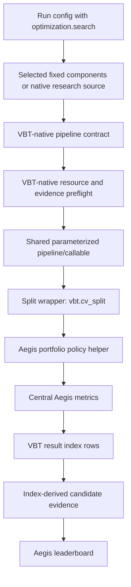

# feat: Add VBT-Native Optimization Runner

## Summary

Introduce one forward optimization path: a VBT-native split/CV runner that wraps one shared parameterized pipeline/callable with `vbt.cv_split`, derives candidate evidence from VBT result indexes, and keeps Aegis-owned portfolio policy, resource gates, metrics, diagnostics, and artifacts around that native execution boundary. Direct full-period `vbt.parameterized` remains an internal shape-test/smoke-test mechanism, not a separate public research optimization runner.

---

## Problem Frame

Aegis currently uses VectorBT PRO for data, split construction, and `Portfolio.from_signals`, but optimization orchestration still builds custom candidate axes, composes Cartesian candidates, batches them, materializes candidate-indexed signals, and manually selects split winners. That duplicates VBT parameterization, split, search, condition, level, lazy-grid, and result-index semantics, which makes search behavior and evidence drift away from the native VBT model (see origin: `docs/brainstorms/2026-05-21-vbt-native-only-optimization-requirements.md`).

The plan also resolves one direct planning conflict: the origin document inferred that `optimization.search` should not exist, but the issue-planning prompt explicitly requires `optimization.search` as the search policy field. This plan follows the latest user constraint while keeping `optimization.search` policy-only, not an optimizer backend or mode selector.

The plan also tightens the earlier top-level split direction: because #31 optimized research is now split/CV-only, the forward optimized-run contract nests CV split policy under `optimization.split` rather than coupling a top-level `optimization` block to a separate top-level `split` block.

---

## Requirements

**Native optimization contract**
- R1. Forward optimization must use VBT-native parameterization APIs directly, not Aegis-owned candidate-grid composition.
- R2. Public #31 optimization research configs must include `optimization.split`; `optimization` without `optimization.split` must fail validation instead of publishing an in-sample optimization leaderboard.
- R3. A config with no `optimization` block is a fixed/non-optimized run: it must not fail solely because optimization is absent, must not perform parameter search, and must not publish an in-sample optimization leaderboard.
- R4. Parameter values that vary across an optimized run must be represented as `vbt.Param` inputs in one shared parameterized pipeline/callable, including strategy thresholds, indicator windows, tied threshold pairs, constraints, and supported portfolio/risk arguments.
- R5. Aegis must not feed VBT-generated params back into `compose_candidate_grid` or `materialize_strategy_sweep_signals` as a compatibility adapter.
- R6. Split optimization must run through `vbt.cv_split` around the shared parameterized pipeline/callable rather than Aegis manually looping split windows, selecting candidate IDs, and re-simulating selected held-out candidates.
- R7. `optimization.split.method` must map to `vbt.cv_split(splitter=...)`, and `optimization.split.params` must map to `splitter_kwargs`; Aegis guardrails such as max split counts and public evidence limits remain outside VBT kwargs.

**Search and parameter semantics**
- P1. `optimization.search` is the explicit plan-specific search policy field required by the issue prompt. It must distinguish grid and random/lazy search while not becoming `optimization.engine`, `optimization.mode`, or any user-selectable Aegis optimizer backend.
- R8. Conditional parameter constraints must use VBT `condition` semantics rather than custom post-generation filtering where feasible.
- R9. Tied parameters must use VBT product `level` semantics rather than hand-built paired candidate IDs.
- R10. Random search must use VBT `random_subset` and lazy-grid behavior rather than Aegis-owned random sampling.
- R11. Mono-chunks must be available as the forward scaling path for pipelines that can accept merged parameter values; Aegis must not recreate mono-chunking through custom candidate batches.
- R12. VBT execution and chunking settings may be configurable only as VBT execution policy, not as an alternate Aegis optimization engine or mode.

**Split and selection semantics**
- R13. Aegis ranking metric and direction must map into VBT `selection` semantics for `cv_split`, including custom selection when the returned object contains multiple metrics.
- R14. Split evidence must distinguish selection sets from held-out sets using a canonical Aegis role string (`selection`, `held_out`) emitted positionally; raw VBT splitter labels (`set_0`, `train`, etc.) are internal lookup keys and must not leak into manifests, artifacts, or downstream filtering.
- R15. Split runs must persist enough grid evidence to prove which parameter rows were eligible and sampled for each split selection decision.
- R16. Held-out leaderboard rows must be derived from VBT-selected parameter combinations and held-out metrics, not from custom composed candidate IDs.

**Aegis portfolio ownership**
- R17. Aegis must remain the owner of portfolio simulation policy: long-only direction, entry budget sizing, next-open execution validation, shared-cash grouping, fees, slippage, and diagnostics.
- R18. Portfolio/risk params such as stops, fees, slippage, sizing knobs, or other supported `Portfolio.from_signals` arguments may be optimized with `vbt.Param` only when they still flow through the Aegis-owned portfolio policy boundary.
- R19. Playbooks or strategies must not provide authoritative portfolio metrics for optimized rows; official metrics remain central Aegis portfolio metrics.

**Evidence and identity**
- R20. Candidate evidence must be derived from VBT result indexes and source identity, not from `CandidateAxis`, `ComposedCandidate`, or hand-authored candidate ID strings.
- R21. Aegis must define canonical serialization for VBT parameter index rows, including tied levels, hidden params policy, `NaN` or no-stop values, enum-like values, symbol levels, split/set levels, and supported array-like or paramable values if supported.
- R22. Each candidate row must expose both a stable machine key and a readable params mapping suitable for review, ranking, and later manual promotion.
- R23. Random or lazy subset runs must persist the actual sampled parameter rows, not only the seed, subset size, and source parameter ranges.
- R24. Run artifacts must record the VBT version, source hashes, parameter specs, sampling policy, execution policy, split policy, and portfolio policy that affected the result.

**Resource gates and failure behavior**
- R25. Aegis must keep fail-closed preflight gates, but estimates must be based on VBT-native execution shape: theoretical combinations, sampled combinations, split count, set count, symbol count, expected result cells, artifact bytes, chunk settings, and mono-chunk settings.
- R26. Oversized VBT-native jobs must fail before execution or before publishing completed leaderboard evidence.
- R27. Partial, skipped, or errored VBT parameter combinations must produce visible diagnostics and must not silently disappear from completed evidence unless VBT `NoResult` semantics are intentionally recorded.

**Transition boundaries**
- R28. `candidate_grid` must stop being the forward user-facing optimization contract; replacement policy must express VBT search, sampling, execution, evidence retention, and resource limits.
- R29. New #31 optimization examples should use VBT-native parameter specs instead of explicit Python candidate loops; converting/removing existing playbooks, candidate persistence, promotion, and component unification are #32 work unless a narrow docs/config update is needed to avoid misleading users.
- R30. Components remain fixed promoted implementations in #31; component param spaces, component sweeps, and per-run component params belong to #32.

**Origin actors:** A1 Research user, A2 Strategy or playbook author, A3 Aegis run lane, A4 Reviewer or automation agent, A5 Future planner or implementer.
**Origin flows:** F1 Shared native parameterized pipeline, F2 Native split optimization, F3 Portfolio-owned parameterized backtest, F4 Random sampled optimization evidence.
**Origin acceptance examples:** AE1 VBT-indexed parameter rows, AE2 native split selection/held-out ranking, AE3 conditions and tied levels, AE4 persisted random sampled rows, AE5 optimized portfolio/risk params through Aegis policy, AE6 resource gates and mono-chunks, AE7 examples/config stop teaching custom candidate grids.

---

## Scope Boundaries

- Do not introduce `optimization.engine`, `optimization.mode`, or any Aegis optimizer backend selector.
- Do not preserve old custom candidate-axis behavior as a forward optimization path or compatibility adapter. If implementation finds a concrete persisted-data or external-consumer dependency, isolate it as legacy read/reporting support outside `optimization.search` execution; #31 optimized configs must still reject `candidate_grid`.
- Do not build an adapter that wraps VBT params only to feed them into `compose_candidate_grid` or `materialize_strategy_sweep_signals`.
- Do not expose full-period, no-split optimization as a valid research leaderboard in #31. Direct `vbt.parameterized` over full data is only a shape-test/smoke-test mechanism or non-promotable diagnostic outside the public optimization contract.
- Do not use top-level `split` as the forward optimized-run contract. #31 optimized configs use `optimization.split`; any remaining top-level `split` support is legacy/fixed-run behavior outside native optimized execution.
- Do not implement Aegis-owned random sampling, tied-parameter pairing, conditional filtering, or mono-chunk batching when VBT already provides those semantics.
- Do not let playbooks, strategies, or future source contracts own official portfolio metrics.
- Do not introduce component sweeps, component param spaces, per-run component params, or component unification in #31.
- Do not make Optuna, Hyperopt, Bayesian optimization, or another optimizer part of #31; a future issue can define those as VBT-native extensions.
- Do not require full-grid held-out evidence for every split when selection-grid evidence plus selected held-out evidence satisfies reproducibility and artifact budgets.
- Do not solve automatic promotion from winning params into component files.

### Deferred to Follow-Up Work

- #32 candidate persistence: immutable candidate-row storage, promotion records, manual promotion flow, and candidate rehydration from #31 evidence.
- #32 playbook removal/unification: removal or conversion of legacy playbook sweep contracts once the native runner and component-oriented model cover current behavior.
- #32 component param spaces: parameterized components and per-run component params.
- Advanced optimizers: Optuna, Hyperopt, Bayesian optimization, or adaptive search as separate VBT-native extension issues.
- Legacy code deletion: delete `CandidateAxis`, `ComposedCandidate`, `compose_candidate_grid`, and `materialize_strategy_sweep_signals` only after #32 confirms no artifact, docs, or external consumer requires read/reporting support. Until then, the legacy code may remain dormant, but it must not be reachable from #31 optimized configs.

---

## Context & Research

### Relevant Code and Patterns

- `research/aegis_research/strategy_runs.py` owns `run_strategy_sweep`, playbook/component routing, current custom sweep orchestration, split scoring, artifacts, manifests, and leaderboard handoff.
- `research/aegis_research/candidate_sweeps.py` owns the duplicate optimization model that the new #31 path must not call: `CandidateAxis`, `SweepCandidate`, `ComposedCandidate`, `compose_candidate_grid`, and `materialize_strategy_sweep_signals`.
- `research/aegis_research/configuration/schema.py`, `research/aegis_research/configuration/builders.py`, and `research/aegis_research/configuration/validation.py` own the run config dataclasses, raw config builders, unknown-field rejection, and path-aware validation. They currently expose `candidate_grid` and top-level `split` as first-class config.
- `research/aegis_research/run_splits.py` already validates exact VBT splitter method names and params. Reuse this safety/catalog boundary, but route split optimization execution through `vbt.cv_split` instead of manual split loops.
- `research/aegis_research/portfolios.py` owns `simulate_portfolio`, `simulate_portfolio_batch`, next-open validation, long-only settings, entry-budget sizing, fees/slippage/init-cash, shared cash, grouping diagnostics, and the `Portfolio.from_signals` call.
- `research/aegis_research/reports.py`, `research/aegis_research/run_leaderboard.py`, and `research/aegis_research/split_leaderboard.py` own central metrics, compact leaderboard rows, metric-source validation, and split held-out ranking semantics.
- `research/playbooks/strategies/rsi_reversion.py`, `research/playbooks/indicators/rsi_explore.py`, and `research/playbooks/indicators/ma_trend.py` currently teach explicit Python candidate loops and candidate IDs.
- `research/configs/rsi_playbook_dry_run.yaml` currently uses `candidate_grid` and top-level `split`; it should become the example proving `optimization.search` and nested `optimization.split` mapping.
- Existing tests to update or supplement include `tests/integration/research/aegis_research/test_config_contract.py`, `tests/integration/research/aegis_research/test_run_playbook_sources.py`, `tests/integration/research/aegis_research/test_strategy_run.py`, `tests/integration/research/aegis_research/test_portfolios.py`, `tests/unit/research/aegis_research/test_run_splits.py`, `tests/unit/research/aegis_research/test_run_leaderboard.py`, and `tests/unit/research/aegis_research/test_candidate_sweeps.py`.

### Institutional Learnings

- `docs/solutions/architecture-patterns/config-contract-security-reproducibility-2026-05-16.md`: config is a fail-fast public contract. `optimization.search`, VBT execution kwargs, resource limits, and evidence retention must validate before data loading, VBT calls, or artifact publication.
- `docs/solutions/best-practices/vectorbt-combine-params-conditions-levels-2026-05-17.md`: VBT `condition` and `level` semantics are the durable way to express constraints and tied parameters; tests should prove Aegis does not rebuild those combinations manually.
- `docs/solutions/logic-errors/vectorbt-label-contract-target-lineage-2026-05-17.md`: preserve native VBT semantics before deriving smaller Aegis evidence. The optimization path should persist VBT index rows before deriving candidate keys/leaderboards.
- `docs/solutions/performance-issues/vectorbt-large-from-signals-chunking-memory-2026-05-17.md`: large `from_signals` shapes need explicit memory/resource budgets, chunking and mono-chunk awareness, and fail-fast order/result estimates.
- `docs/solutions/best-practices/vectorbt-execution-timing-nextopen-2026-05-17.md`: execution timing must stay explicit; native parameterization cannot silently bypass next-open validation or Open-price diagnostics.
- `docs/solutions/best-practices/forward-first-long-only-signal-contract-2026-05-18.md`: removed legacy fields should fail loudly rather than becoming compatibility branches; unsupported simulator semantics belong in diagnostics, not active execution kwargs.

### External References

- GitHub issue #31: Move playbook sweeps to native VectorBT parameterization.
- VectorBT PRO `vbt.parameterized` docs/source: parameterizes ordinary functions, accepts `vbt.Param`, supports parameter indexes, selection, `random_subset`, `seed`, execution kwargs, and mono-chunks.
- VectorBT PRO `vbt.cv_split` docs/source: combines split and parameterized execution, uses `splitter`, `splitter_kwargs`, `parameterized_kwargs`, `selection`, and `return_grid`, and requires train/test sets within a split to execute in the same thread/process because grid results are shared.
- VectorBT PRO optimization generation docs: default Cartesian products, shared `level` for tied params, `condition` for invalid-combination filtering, `keys`/`hide` for index display, and `_random_subset` for random/lazy grids.
- VectorBT PRO cross-validation cookbook: `@vbt.cv_split` is the native way to evaluate parameter grids on selection sets, select winning params, and evaluate held-out sets.
- VectorBT PRO portfolio docs/maintainer guidance: `Portfolio.from_signals` supports broadcastable portfolio and stop arguments, including stop params wrapped in `vbt.Param`, but Aegis must still own official portfolio semantics.

---

## Key Technical Decisions

- Native runner boundary: add a new VBT-native optimization contract and split/CV runner rather than extending `CandidateAxis` or wrapping VBT params back into `compose_candidate_grid`. This directly enforces R1-R7 and keeps #31 forward-first.
- Split-required research path: `optimization` means research optimization and requires `optimization.split` in #31. A config without `optimization` remains a fixed/non-optimized run; direct full-period `vbt.parameterized` is retained only for focused tests/spikes that verify the shared parameterized pipeline used by `vbt.cv_split`.
- Config policy: use `optimization.search` as the explicit policy field with grid/random meanings; reject `optimization.engine` and `optimization.mode`, and do not expose a user-selectable backend. VBT execution settings stay under execution policy as VBT kwargs, not Aegis optimizer selection.
- Candidate-grid replacement: bump the run config contract and reject `candidate_grid` whenever `optimization` is present. Legacy code may remain unreachable/dormant for non-native coverage until #32, but resource/evidence limits move under native optimization policy so custom batching does not remain a parallel optimization abstraction.
- Source contract first: define how a research source exposes a VBT parameterized pipeline and parameter specs before wiring execution. The plan should not start by translating legacy RSI candidate loops because that would preserve the old authoring model.
- VBT result index first: persist normalized VBT parameter rows and derive stable Aegis keys afterward. Candidate identity should include source identity and behavior-affecting hidden metadata/portfolio policy fingerprint, while split/set labels remain metric/evidence coordinates rather than part of candidate identity.
- Portfolio policy wrapper: the parameterized function may vary indicator, signal, and supported portfolio/risk values, but official metrics must come from an Aegis-owned portfolio helper that preserves entry budget, next-open validation, long-only settings, shared cash, fees, slippage, and diagnostics.
- Split execution: move the optimized-run split contract under `optimization.split`, reuse existing split config validation and evidence, and execute split optimization with `vbt.cv_split`, mapping `optimization.split.method` to `splitter` and `optimization.split.params` to `splitter_kwargs`. Manual selection-window scoring and held-out re-simulation become legacy/non-forward for #31.
- Evidence retention default: persist actual sampled/eligible selection rows and selected held-out rows by default; full held-out grids are optional only when configured and within resource budgets.
- Failure policy: VBT `NoResult`, skipped rows, missing metrics, and runtime errors must surface as diagnostics. Completed leaderboards must not silently omit planned/sampled rows unless the omission is represented in evidence.
- #32 boundary: #31 artifacts must contain enough index-derived evidence for later candidate persistence and promotion, but #31 must not introduce durable candidate stores, auto-promotion, playbook removal, or component param spaces.

---

## Open Questions

### Resolved During Planning

- Should `optimization.search` exist despite the origin doc's inferred anti-goal? Yes. The user prompt explicitly requires it. It should be a policy field for grid versus random/lazy search, not an engine or mode selector.
- Should `candidate_grid` be preserved as a compatibility path? Not for #31 optimized execution. Existing tests/docs are internal and should be updated or scoped as legacy; any newly discovered persisted/external dependency must stay outside the `optimization.search` execution path.
- Should split optimization use manual Aegis selection loops? No. #31 should map `optimization.split` into `vbt.cv_split` and adapt VBT outputs into Aegis evidence.
- Should optimized research allow no-split, full-period leaderboards? No. That is in-sample optimization; #31 should reject `optimization` without `optimization.split` and keep direct `vbt.parameterized` as an internal shape-test/smoke-test mechanism only.
- Should split stay top-level? No for optimized runs. Since #31 optimization is always CV-backed, nesting split policy under `optimization.split` keeps the public contract cohesive and avoids a cross-section invariant between top-level `optimization` and top-level `split`.
- Should full held-out grids always be persisted? No. Persist selection-grid evidence plus selected held-out evidence by default; allow more only behind resource-gated evidence policy.
- Should portfolio/risk params be fixed-only? No. They can be VBT params when they flow through the Aegis portfolio policy helper.
- Should components become parameterized in #31? No. Components stay fixed; component param spaces belong to #32.

### Deferred to Implementation

- Exact native source contract names and module factoring: choose while implementing, but keep the contract separate from `candidate_sweeps.py` and avoid a file or field named `optimization.engine`.
- Exact parameterized return object: verify the smallest VBT-friendly metric object that preserves metric names, param index, split/set labels, and merge behavior before locking the adapter.
- Exact candidate key canonicalization details: finalize while implementing serialization tests for hidden params, `NaN`, enum-like values, array-like values, split/set levels, symbol levels, and behavior-affecting metadata.
- Exact VBT `return_grid` default string: choose after verifying the real `cv_split` return shape for the selected metric object; the evidence policy is settled, but the VBT flag value should be confirmed against tests.
- Exact resource estimator constants: derive conservative defaults during implementation from matrix shape, split count, symbol count, VBT chunk settings, and artifact row/byte estimates.

---

## High-Level Technical Design

> *This illustrates the intended approach and is directional guidance for review, not implementation specification. The implementing agent should treat it as context, not code to reproduce.*

Native run flow:



Config policy comparison:

| Field | Meaning | Allowed In #31 | Notes |
|---|---|---:|---|
| `optimization.search` | Explicit search policy: grid or random/lazy | Yes | Maps to VBT parameterization behavior, not an Aegis backend |
| `optimization.split` | VBT CV splitter policy for optimized research | Required with `optimization` | Replaces top-level `split` for native optimized configs |
| `optimization.random_subset` or equivalent nested random setting | VBT random/lazy subset size | Yes | Only valid for random/lazy search |
| `optimization.seed` | VBT random seed | Yes | Persisted as metadata, not sufficient evidence alone |
| `optimization.execute` | VBT execution/chunking kwargs | Yes | Must not imply Aegis optimizer engine selection |
| `optimization.engine` | Aegis optimizer backend selector | No | Reject in validation |
| `optimization.mode` | Native/custom mode switch | No | Reject in validation |
| `candidate_grid` | Custom composed-candidate batching/search contract | No for forward optimization | Replace with native resource/evidence policy |

Result identity flow:

```text
VBT parameter index row + source identity + hidden behavior-affecting metadata + portfolio policy fingerprint
  -> normalized public JSON value model
  -> stable machine key
  -> readable params mapping
  -> leaderboard and split metric refs
```

Split labels, set labels, symbols, and metrics remain evidence coordinates. They should be present on metric/evidence rows, but they should not make the same candidate become a different candidate across selection and held-out records.

---

## Phased Delivery

### Phase 0: VBT Return-Shape Spike

- Run a tiny, isolated VBT spike for the exact result shapes produced by `vbt.parameterized` and `vbt.cv_split` when returning one or more Aegis-style metrics.
- Decide the smallest metric return object and merge settings that preserve metric names, parameter indexes, split/set labels, and random sampled rows.
- Verify native ranking/selection behavior before designing Aegis leaderboard adaptation: selection-grid ranking from indexed metric outputs, and split winner selection through `cv_split(selection=...)`.
- Record the findings in tests or a short planning note before designing the evidence adapter, portfolio helper, or split adapter around assumed shapes.

### Phase 1: Public Contract And Native Boundary

- Add native optimization config and validation, including nested `optimization.split`.
- Add the native source/pipeline contract and result-index evidence models.
- Add tests that fail if the native path calls custom candidate composition.

### Phase 2: Native Preflight And CV Foundations

- Implement native resource/evidence preflight before native execution can publish results.
- Define the callable shape that `vbt.cv_split` will execute.
- Preserve Aegis portfolio policy and metrics inside CV execution.
- Persist VBT index-derived candidate rows and random sampled rows.

### Phase 3: Split Native Runner

- Implement the `vbt.cv_split` path.
- Map `optimization.split` and ranking into VBT split/selection semantics.
- Persist selection-grid and selected held-out evidence and adapt outputs into existing split leaderboard semantics.

### Phase 4: Resource Gates, Docs, And Example Migration

- Finish any post-run diagnostics refinements for VBT-native resource/evidence gates.
- Update docs/examples/configs that would otherwise teach the removed custom path.
- Keep #32-owned persistence/promotion/component-unification work out of this implementation.

---

## Implementation Units

Implementation should follow the dependency fields, not just the visual order below. In particular, U6's minimal preflight work must land before U5 executes native VBT work.

### U0. Spike VBT Parameterized And CV Return Shapes

**Goal:** Verify the exact VBT return shapes and ranking/selection semantics #31 should target before designing the evidence adapter, native runner, split adapter, leaderboard adapter, or portfolio helper around assumptions.

**Requirements:** R2, R6, R7, R13, R15, R20, R21, R23; F1, F2, F4; AE1, AE2, AE4

**Dependencies:** None

**Files:**
- Test: `tests/unit/research/aegis_research/test_vbt_native_return_shapes.py`
- Optional notes: `docs/plans/2026-05-21-003-feat-vbt-native-optimization-runner-plan.md` if findings need to be captured inline

**Approach:**
- Build tiny in-memory examples with a few rows, one or two symbols, two simple params, one tied-param example, and one random subset example.
- Inspect `vbt.parameterized` outputs for single metric returns, multi-metric returns, `merge_func="concat"`, parameter indexes, hidden params, tied levels, and random subset rows.
- Inspect selection-grid ranking from VBT-produced indexed metric outputs, including `idxmax`/`idxmin`, `sort_values`, top-N extraction, multi-metric tie-break inputs, and preservation of candidate index rows.
- Inspect `vbt.cv_split` outputs for the planned split config shape, native `selection` behavior, `return_grid` options, split/set labels, and selected held-out rows.
- Verify `ranking.metric` and `ranking.direction` can map to VBT `selection="max"`, `selection="min"`, or a custom `vbt.RepFunc`/`vbt.LabelSel` selector when the returned object contains multiple metrics.
- Decide the minimal return convention the native runner should require from source pipelines.
- Decide whether the evidence adapter should consume returned indexes directly, `return_param_index`, `return_grid`, or a small wrapper around VBT outputs.
- Keep this as a spike with assertions on observed shapes, not as the full native runner implementation.

**Test scenarios:**
- Direct `vbt.parameterized` shape tests return a metric series indexed by parameter levels.
- Direct `vbt.parameterized` multi-metric output preserves metric names in a shape the evidence adapter can consume.
- Selection-grid top-N rows can be derived from VBT metric outputs without losing parameter-index evidence.
- Tied product levels produce paired parameter rows rather than a Cartesian product.
- Random subset output exposes the actual sampled parameter rows to persist.
- Split ranking uses VBT `selection` to choose winners from selection-set metrics, including ascending and descending directions.
- `vbt.cv_split` maps split/set labels and selected parameter rows in a shape compatible with Aegis selection/held-out evidence.
- `return_grid` options are compared for artifact size and reproducibility tradeoffs.

**Verification:**
- Later units can reference concrete VBT output shapes instead of guessing.
- The plan has an explicit answer for metric return and ranking conventions before implementing candidate evidence, portfolio policy, leaderboard adaptation, or split adaptation.

---

### U1. Add Native Optimization Config Contract

**Goal:** Replace `candidate_grid` and top-level split coupling as the forward optimization policy surface with validated VBT-native optimization config, including required `optimization.search` and `optimization.split` semantics.

**Requirements:** P1, R2, R3, R7, R10, R12, R24, R25, R26, R28; F1, F2, F4; AE4, AE6, AE7

**Dependencies:** U0

**Files:**
- Modify: `research/aegis_research/configuration/schema.py`
- Modify: `research/aegis_research/configuration/builders.py`
- Modify: `research/aegis_research/configuration/validation.py`
- Modify: `research/aegis_research/config.py`
- Test: `tests/integration/research/aegis_research/test_config_contract.py`
- Test: `tests/integration/research/aegis_research/test_strategy_run.py`

**Approach:**
- Introduce an additive native optimization dataclass under the run config with `optimization.search` as the explicit search policy field and `optimization.split` as the required CV policy for optimized research.
- Add the routing contract that `optimization is not None` enters the native runner, while configs without `optimization` can remain on existing fixed/legacy paths until #32 removes them.
- Require `optimization.split` whenever `optimization` is present; `optimization` without `optimization.split` is rejected as in-sample optimization rather than published as research evidence.
- Accept grid search without Aegis sampling and random/lazy search by mapping the policy to VBT `random_subset`/seed behavior.
- Validate that random/lazy search includes a subset size and grid search does not carry random-only settings.
- Reject `optimization.engine` and `optimization.mode` as unknown/invalid fields.
- Reject `candidate_grid` when `optimization` is present rather than silently treating it as native execution policy. Do not remove the legacy field before native routing exists.
- Keep split guard fields under `optimization.split`, not under VBT `splitter_kwargs`.
- Keep VBT execution kwargs in an explicitly named execution-policy section and validate them as JSON-like, non-secret, non-executable config.

**Patterns to follow:**
- Path-aware config validation in `research/aegis_research/configuration/validation.py`.
- Fail-fast config guidance in `docs/solutions/architecture-patterns/config-contract-security-reproducibility-2026-05-16.md`.
- Forward-first removed-field behavior in `docs/solutions/best-practices/forward-first-long-only-signal-contract-2026-05-18.md`.

**Test scenarios:**
- Happy path: a config with `optimization.search: grid` and `optimization.split` resolves and records native optimization defaults without `candidate_grid`.
- Happy path: a config with `optimization.search: random`, `optimization.split`, a subset size, and a seed resolves and exposes the VBT random/lazy policy for the runner.
- Error path: `optimization.engine` fails validation before data loading and reports the path `optimization.engine`.
- Error path: `optimization.mode` fails validation before data loading and reports the path `optimization.mode`.
- Error path: random search without a subset size fails before run directory creation.
- Error path: grid search with random-only settings fails before run directory creation.
- Error path: `optimization` without `optimization.split` fails before run directory creation.
- Error path: a native optimized config with top-level `split` but no `optimization.split` fails with migration-oriented validation guidance.
- Error path: `candidate_grid` on a native optimization config fails with migration-oriented validation guidance.
- Error path: a config containing both `optimization.search` and `candidate_grid` cannot run even while legacy playbook code remains in the repo.
- Integration: a minimal validation fixture with `optimization.search` and `optimization.split` resolves without requiring the public RSI dry-run config to migrate before the runner exists.

**Verification:**
- Config validation has one forward optimization policy surface.
- Invalid optimization config fails before data loading, VBT calls, or artifact writes.
- Authored/resolved config evidence can preserve the search, execution, nested split, and portfolio policies without secrets.

---

### U2. Define Native Source And Runner Contract

**Goal:** Establish how #31 research sources expose VBT parameter specs and a portfolio-owned pipeline without using custom candidate axes.

**Requirements:** R1, R2, R4, R5, R17, R18, R19, R29, R30; F1, F3; AE1, AE3, AE5

**Dependencies:** U0, U1

**Files:**
- Create: `research/aegis_research/optimization/source.py`
- Modify: `research/aegis_research/strategy_runs.py`
- Modify: `research/aegis_research/playbook_registry/contracts.py` if a new result schema/manifest marker is needed for trusted native research sources
- Test: `tests/unit/research/aegis_research/test_optimization_source.py`
- Test: `tests/integration/research/aegis_research/test_optimization_source.py`
- Test: `tests/integration/research/aegis_research/test_run_playbook_sources.py`

**Approach:**
- Define a native runner contract that supplies source evidence, VBT params, a callable pipeline, and behavior-affecting hidden metadata needed for evidence.
- Design the contract for the current #31 native runner. Avoid component extension points; #32 can generalize the contract if component param spaces require it.
- Make the runner-owned pipeline call the Aegis portfolio helper to produce official metrics, or reject metric-shaped values that do not carry central Aegis portfolio provenance.
- Reject source outputs that provide metrics, portfolio policy, or candidate IDs as authoritative optimization evidence.
- Wire `strategy_runs.py` to route optimized configs into the native runner without invoking `compose_candidate_grid`, `composed_candidate_ids`, or `materialize_strategy_sweep_signals`.
- Treat legacy playbook candidate-axis execution as non-forward. Keep it only where existing non-native behavior remains intentionally untouched until #32, not as a path for #31 optimized configs.
- Do not modify existing playbook implementations in #31. Use synthetic/native test sources and docs/config-only examples; converting existing RSI/MA playbooks is #32.

**Execution note:** Start with contract and negative-call tests before integrating full VBT execution.

**Patterns to follow:**
- Existing playbook/component source evidence in `research/aegis_research/strategy_runs.py`.
- Metric-source rejection in `research/aegis_research/candidate_sweeps.py` and `validate_strategy_output`.
- VectorBT `vbt.Param` generation guidance in `docs/solutions/best-practices/vectorbt-combine-params-conditions-levels-2026-05-17.md`.

**Test scenarios:**
- Happy path: a native source exposes RSI window, MA window, and RSI threshold params as VBT params and the runner accepts the source contract.
- Happy path: tied threshold params share a VBT product level and produce paired rows rather than a full threshold product.
- Happy path: fast/slow or MA/RSI window constraints use VBT `condition` and exclude invalid combinations before evaluation.
- Error path: a native source tries to return authoritative portfolio metrics; validation rejects before leaderboard creation.
- Error path: a native source returns metric-shaped values without the Aegis portfolio-helper provenance stamp; validation rejects before leaderboard creation.
- Error path: a source exposes custom `CandidateAxis`/`ComposedCandidate` data for a native optimization config; validation rejects rather than adapting.
- Integration: monkeypatch `strategy_runs.compose_candidate_grid` and `strategy_runs.materialize_strategy_sweep_signals` to raise, run a native optimization config, and assert the run does not call either function.

**Verification:**
- Native optimization has a distinct contract from `candidate_sweeps.py`.
- Implementers can add VBT-native parameter specs without authoring candidate IDs.
- The #31 path is structurally incapable of feeding VBT params into custom candidate composition.

---

### U3. Add VBT Result-Index Evidence And Candidate Keys

**Goal:** Convert native VBT result indexes into stable Aegis candidate evidence after execution, including actual sampled rows for random/lazy grids.

**Requirements:** R20, R21, R22, R23, R24, R27; F1, F2, F4; AE1, AE4

**Dependencies:** U0, U2

**Files:**
- Create: `research/aegis_research/optimization/evidence.py`
- Modify: `research/aegis_research/strategy_runs.py`
- Modify: `research/aegis_research/provenance/manifest.py` if artifact shape metadata needs new counters
- Test: `tests/unit/research/aegis_research/test_optimization_evidence.py`
- Test: `tests/integration/research/aegis_research/test_optimization_source.py`
- Test: `tests/unit/research/aegis_research/test_run_leaderboard.py`

**Approach:**
- Normalize VBT result index rows into a public value model before hashing.
- Include source identity, VBT version/settings fingerprints, parameter specs, hidden behavior-affecting metadata, sampling policy, execution policy, split policy, and portfolio policy fingerprints in candidate evidence.
- Keep split/set/symbol/metric levels as evidence coordinates unless they affect candidate identity.
- Persist actual sampled parameter rows for random/lazy search and make leaderboard/split rows reference those row records.
- Represent VBT `NoResult`, missing metrics, skipped rows, and errors as visible diagnostics instead of silently dropping them from completed evidence.
- Maintain both stable machine keys and readable params mappings for each candidate row.

**Patterns to follow:**
- Existing normalized `catalogs` pattern in `research/aegis_research/strategy_runs.py`.
- Native-first lineage pattern in `docs/solutions/logic-errors/vectorbt-label-contract-target-lineage-2026-05-17.md`.
- Run artifact shape counters in `_strategy_artifact_shape`.

**Test scenarios:**
- Happy path: a MultiIndex row with RSI window, MA window, thresholds, and symbol evidence produces a stable machine key and readable params mapping.
- Happy path: tied params that share a VBT level preserve their readable relationship without creating duplicate Cartesian identity.
- Happy path: hidden behavior-affecting params are represented in evidence metadata so two behaviorally different rows cannot collide.
- Edge case: `NaN`, `None`, no-stop values, enum-like values, and array-like values serialize deterministically.
- Happy path: random/lazy optimization persists the actual sampled parameter rows and leaderboard rows reference those sampled rows.
- Error path: two rows with same visible params but different source hash or portfolio policy produce different stable keys.
- Error path: a row skipped by VBT `NoResult` is visible in diagnostics and does not become a successful candidate silently.
- Integration: direct `vbt.parameterized` shape-test output evidence is derived from VBT result indexes, not from `ComposedCandidate` IDs.

**Verification:**
- Candidate evidence can be inspected without loading VBT native objects.
- Random sampled rows are durable evidence, not reconstructive metadata.
- #32 can later consume candidate keys without requiring #31 to create persistent candidate stores.

---

### U4. Preserve Aegis Portfolio Policy For Parameterized Runs

**Goal:** Allow VBT-native strategy and portfolio/risk params to flow through the Aegis-owned portfolio policy layer without changing official metric ownership.

**Requirements:** R4, R17, R18, R19, R25, R27; F3; AE5, AE6

**Dependencies:** U0, U2, U3

**Files:**
- Modify: `research/aegis_research/portfolios.py`
- Modify: `research/aegis_research/reports.py` if metric extraction needs param-index-aware helpers
- Modify: `research/aegis_research/optimization/source.py`
- Test: `tests/integration/research/aegis_research/test_portfolios.py`
- Test: `tests/unit/research/aegis_research/test_reports.py`
- Test: `tests/integration/research/aegis_research/test_optimization_source.py`

**Approach:**
- Add or adapt a portfolio policy helper that accepts native parameterized signal/portfolio inputs while preserving current `simulate_portfolio`/`simulate_portfolio_batch` semantics.
- Require official metric rows to be produced through this helper or to carry its central portfolio provenance stamp; source-owned metric-shaped outputs are not sufficient for leaderboard evidence.
- Generalize candidate grouping from the current `candidate_id` assumption to arbitrary non-symbol parameter levels when needed, while keeping one cash-sharing group per candidate/parameter row across symbols.
- Keep generated entry sizing, next-open executable-mask validation, Open-price checks, long-only VBT settings, fees, slippage, init cash, and diagnostics in Aegis code.
- Allow supported `Portfolio.from_signals` kwargs such as stops, fees, slippage, or sizing knobs to vary only when the policy helper explicitly receives and records them.
- Reject portfolio/risk params that would bypass Aegis-owned semantics or make grouping ambiguous.

**Patterns to follow:**
- `simulate_portfolio` and `simulate_portfolio_batch` in `research/aegis_research/portfolios.py`.
- Existing candidate cash-sharing test `test_batched_portfolio_groups_cash_by_candidate`.
- Execution-timing learning in `docs/solutions/best-practices/vectorbt-execution-timing-nextopen-2026-05-17.md`.
- Large `from_signals` resource guidance in `docs/solutions/performance-issues/vectorbt-large-from-signals-chunking-memory-2026-05-17.md`.

**Test scenarios:**
- Happy path: optimized `sl_stop` and `tp_stop` values flow through the Aegis portfolio helper and official metrics still report `metric_source: central_portfolio`.
- Happy path: optimized fees or slippage are recorded as varied portfolio policy evidence and do not bypass central diagnostics.
- Happy path: two parameter rows over the same symbols have separate shared-cash groups; cash does not leak across parameter rows.
- Happy path: next-open execution uses Open prices and records non-executable terminal/gap signal diagnostics under native parameterization.
- Error path: next-open optimization without Open prices fails before `Portfolio.from_signals` produces official metrics.
- Error path: a strategy returns portfolio metrics or direct portfolio objects as authoritative results; the runner rejects it.
- Edge case: same-close execution remains explicit and does not require Open prices.

**Verification:**
- Native VBT parameterization changes search mechanics, not Aegis portfolio ownership.
- Portfolio diagnostics remain at least as auditable as the current `Portfolio.from_signals` wrapper.
- Existing long-only and entry-budget invariants are preserved for parameterized rows.

---

### U5. Implement Split `vbt.cv_split` Runner

**Goal:** Execute native split optimization by wrapping the shared parameterized pipeline with VBT CV, map `optimization.split` and ranking into VBT selection, and preserve Aegis split evidence and held-out leaderboard semantics.

**Requirements:** P1, R1, R2, R4, R5, R6, R7, R8, R9, R10, R11, R12, R13, R14, R15, R16, R20, R21, R22, R23, R24, R25, R26, R27; F1, F2, F4; AE1, AE2, AE3, AE4, AE6

**Dependencies:** U0, U1, U2, U3, U4, U6

**Files:**
- Modify: `research/aegis_research/optimization/source.py`
- Modify: `research/aegis_research/run_splits.py`
- Modify: `research/aegis_research/strategy_runs.py`
- Modify: `research/aegis_research/split_leaderboard.py` if native candidate keys require adaptation
- Modify: `research/aegis_research/provenance/manifest.py` if native optimization shape counters are added
- Test: `tests/unit/research/aegis_research/test_run_splits.py`
- Test: `tests/unit/research/aegis_research/test_run_leaderboard.py`
- Test: `tests/unit/research/aegis_research/test_optimization_source.py`
- Test: `tests/integration/research/aegis_research/test_optimization_source.py`
- Test: `tests/integration/research/aegis_research/test_strategy_run.py`

**Approach:**
- Reuse `run_splits.py` validation for `optimization.split.method`, `optimization.split.params`, denied/internal params, max split count, and public split membership evidence.
- Build the callable shape inline with the CV runner: it accepts VBT-provided parameter values and the current split/set data slice, calls the Aegis portfolio helper, and returns central metrics.
- Build VBT param arguments and `parameterized_kwargs` from the native source contract and `optimization.search` policy, including exhaustive grid or random/lazy subset behavior.
- Build the native CV wrapper around that callable with `splitter=config.optimization.split.method` and `splitter_kwargs=config.optimization.split.params`.
- Define the native CV callable signature and split kwargs before adapting results, including which time-indexed arguments are split-takeable. `close`, `open_prices`, and any time-indexed signal/indicator inputs must be sliced by VBT for each split/set, while the original full `market_index` remains available for next-open adjacency diagnostics.
- Pass search/random/execution policy through `parameterized_kwargs` and split execution kwargs according to VBT `cv_split` constraints.
- Pass execution/chunking/mono-chunk settings through VBT-native kwargs rather than custom candidate batches.
- Map `ranking.metric` and `ranking.direction` into `selection`, using a custom selection function when metric output has multiple metrics.
- Define split role mapping explicitly: exactly two sets are accepted; VBT set index 0 is always Aegis `selection`, VBT set index 1 is always Aegis `held_out`. `set_labels` is not a user-configurable knob — config validation rejects `set_labels` under any `split.params` (top-level legacy or `optimization.split`); each VBT splitter factory's natural defaults flow through unchanged and serve only as internal dict lookup keys into the set-indices map.
- Emit only the canonical Aegis role in evidence (`set: selection|held_out`, `sets[i].role`). Do not emit raw VBT labels as `native_set` or as keyed evidence fields — they would just leak the splitter family ("set_0/set_1" vs "train/test") into downstream code without semantic value.
- Persist eligible/sampled selection-grid rows for each split and selected held-out metric rows.
- Normalize VBT parameter indexes into candidate evidence records and preserve metric registry fingerprints, failure summaries, sampled rows, and portfolio diagnostics.
- Normalize `return_grid` output carefully. For `return_grid="first"`, deduplicate training-grid rows by split and parameter row and treat only set-0 grid rows as selection eligibility. For `return_grid="all"`, keep selection-grid and held-out-grid evidence roles separate and require resource gates before retaining the larger output.
- Adapt VBT `cv_split` outputs into existing split-leaderboard semantics without reintroducing manual candidate selection or held-out re-simulation.
- Respect VBT's warning that train/test sets within each split must execute in the same thread/process because grid results are shared.

**Execution note:** Use U0 findings for the real VBT return shape. Add a focused verification test here only if implementation discovers shape drift from the spike.

**Patterns to follow:**
- `build_run_splits_result` and `validate_run_split_config` in `research/aegis_research/run_splits.py`.
- `build_split_leaderboard` tests for selection-only winner choice and held-out ranking.
- VBT `cv_split` source/docs for `parameterized_kwargs`, `selection`, `return_grid`, and split/thread constraints.

**Test scenarios:**
- Covers AE2. Happy path: config with `optimization.split.method: from_rolling` maps to `vbt.cv_split(splitter="from_rolling", splitter_kwargs=...)` and uses native CV execution.
- Covers AE1. Happy path: VBT creates parameter index rows for RSI window, MA window, and thresholds, and Aegis writes index-derived candidate evidence.
- Covers AE3. Happy path: tied entry/exit thresholds use shared VBT `level` and produce paired rows only.
- Covers AE3. Happy path: conditional fast/slow params use VBT `condition` and invalid rows never execute.
- Covers AE4. Happy path: random/lazy search with `optimization.search: random`, subset size, and seed persists actual sampled parameter rows.
- Covers AE2. Happy path: ranking `total_return desc` selects winners from selection-set metrics and ranks final rows by held-out metrics.
- Happy path: VBT execution/mono-chunk kwargs are recorded as VBT execution policy and not as `optimization.engine`.
- Happy path: `optimization.split.params` values such as `length`, `offset`, and `split` are forwarded as VBT `splitter_kwargs`, while Aegis guard fields are not forwarded.
- Happy path: evidence emits the canonical Aegis role (`selection`, `held_out`) for every split×set record regardless of which VBT splitter factory was chosen; raw VBT splitter labels never appear in manifests or artifacts.
- Happy path: selection and held-out portfolio row counts equal the corresponding VBT split set lengths, not the full source index length.
- Happy path: `return_grid="first"` does not double-count duplicated training-grid rows as held-out eligibility.
- Happy path: random/lazy split optimization persists actual sampled/eligible selection rows per split.
- Edge case: ascending ranking maps to min selection and preserves held-out ranking behavior.
- Error path: `set_labels` authored under any `split.params` (top-level legacy or `optimization.split`) is rejected during validation with a message that set roles are Aegis-owned and assigned positionally.
- Error path: split output with one set, three sets, empty sets, or too many splits fails before native optimization execution.
- Error path: a config with `optimization` and no `optimization.split` fails validation rather than entering the native runner.
- Error path: oversized theoretical grid with no random subset fails before VBT execution.
- Error path: a huge theoretical grid with random subset can pass theoretical-size pressure only if sampled/result/evidence budgets pass.
- Error path: missing Open prices under split `next_open` execution fails through Aegis portfolio diagnostics rather than executing full-period data.
- Error path: `return_grid`/evidence policy that would exceed artifact limits fails before publishing completed evidence.
- Integration: monkeypatch `compose_candidate_grid` and `materialize_strategy_sweep_signals` to raise; split native run succeeds without calling either.
- Integration: a missing primary metric in one result row is visible in failure/exclusion evidence and does not produce a misleading completed row.
- Integration: partial native split failure writes visible diagnostics and does not publish a normal completed leaderboard.

**Verification:**
- Split optimization is natively handled by VBT CV rather than custom split loops.
- The callable used by `cv_split` has no dependency on custom candidate-grid composition.
- Each held-out row is traceable to eligible selection-grid evidence.
- Existing split leaderboard semantics are preserved with VBT-derived candidate keys.

---

### U6. Replace Resource Gates And Diagnostics Around VBT Shape

**Goal:** Replace custom candidate batch estimates with VBT-native preflight gates and diagnostics that fail closed before oversized jobs execute or publish evidence.

**Requirements:** P1, R10, R11, R12, R24, R25, R26, R27, R28; F1, F2, F4; AE6

**Dependencies:** U0, U1, U2, U3, U4

**Files:**
- Create: `research/aegis_research/optimization/preflight.py`
- Modify: `research/aegis_research/optimization/source.py`
- Modify: `research/aegis_research/strategy_runs.py`
- Modify: `research/aegis_research/configuration/schema.py`
- Modify: `research/aegis_research/configuration/validation.py`
- Test: `tests/unit/research/aegis_research/test_optimization_preflight.py`
- Test: `tests/integration/research/aegis_research/test_optimization_source.py`
- Test: `tests/integration/research/aegis_research/test_strategy_run.py`

**Approach:**
- Land this unit before U5 native execution, because native VBT work must not execute before minimal VBT-native preflight gates exist.
- Estimate theoretical combinations from VBT params, conditioned combinations where available, sampled combinations for random/lazy search, split/set count, symbol count, result cells, expected portfolio broadcast cells, expected artifact rows/bytes, and relevant VBT chunk/mono-chunk settings.
- Treat random/lazy search differently from exhaustive grid: a huge theoretical grid may be acceptable only when sampled execution and evidence budgets fit.
- Fail before VBT execution when resource estimates exceed configured limits.
- Fail before completed artifact publication if actual result/evidence size exceeds publication limits.
- Record resource estimates and actual result shape in manifest/artifact diagnostics.
- Keep custom `candidate_grid.batch_size` out of native resource diagnostics.

**Patterns to follow:**
- Current `_sweep_execution_preflight`, `_split_execution_preflight`, and split resource guards in `strategy_runs.py`/`run_splits.py`, but recalibrated around native VBT shapes.
- Memory/chunking learning in `docs/solutions/performance-issues/vectorbt-large-from-signals-chunking-memory-2026-05-17.md`.

**Test scenarios:**
- Happy path: a moderate grid reports theoretical combinations, sampled combinations, symbols, split count, expected cells, and artifact estimates.
- Happy path: mono-chunk settings are accepted as VBT-native execution policy and included in resource diagnostics.
- Error path: oversized exhaustive grid fails before VBT execution is invoked.
- Error path: oversized `cv_split` evidence retention fails before completed artifact publication.
- Error path: random/lazy sampled rows above evidence budget fail even when theoretical grid information is available.
- Integration: a preflight failure does not call the native pipeline or portfolio simulation and leaves no completed `strategy_run.json`.

**Verification:**
- Resource limits match the native execution shape rather than custom batches.
- Oversized native jobs fail closed with actionable diagnostics.
- Random/lazy grids are evaluated against sampled/evidence budgets, not only theoretical product size.

---

### U7. Update Docs, Examples, And Legacy Test Boundaries

**Goal:** Stop teaching the removed candidate-grid optimizer as the forward path while keeping #32 work explicitly deferred.

**Requirements:** R28, R29, R30; AE7

**Dependencies:** U0, U1, U2, U5, U6

**Files:**
- Modify: `docs/playbooks.md`
- Modify: `docs/vectorbt-scaffold.md`
- Modify: `docs/examples/playbooks/indicator_playbook_example.py`
- Modify: `docs/examples/playbooks/strategy_playbook_example.py`
- Modify: `research/playbooks/indicators/README.md`
- Modify: `research/playbooks/strategies/README.md`
- Modify: `research/configs/rsi_playbook_dry_run.yaml`
- Modify: `tests/integration/research/aegis_research/test_cli_docs.py`
- Modify: `tests/integration/research/aegis_research/test_run_playbook_sources.py` only where legacy assertions conflict with #31 native behavior
- Modify: `tests/unit/research/aegis_research/test_candidate_sweeps.py` only to mark legacy coverage or avoid implying it is the forward optimized path

**Approach:**
- Update public docs to describe VBT-native optimization, `optimization.search`, `vbt.Param`, `condition`, `level`, `random_subset`, `cv_split`, and mono-chunks as the forward path.
- Remove or clearly demote `candidate_grid.batch_size` examples from forward optimization docs.
- Update the RSI dry-run config to use `optimization.search` and nested `optimization.split` mapping.
- Keep docs explicit that #32 owns candidate persistence, promotion, playbook removal, and component unification.
- If old candidate sweep tests remain, label their scope as legacy contract coverage rather than #31 optimization path coverage.

**Patterns to follow:**
- `docs/playbooks.md` structure for source contracts and artifact explanation.
- `docs/vectorbt-scaffold.md` concise scaffold overview style.
- Current example files under `docs/examples/playbooks/`.

**Test scenarios:**
- Happy path: docs/config examples validate with `optimization.search`, `optimization.split`, and no `candidate_grid`.
- Error path: CLI/docs tests no longer expect `candidate_grid.batch_size` as the forward optimization instruction.
- Integration: RSI dry-run config can be parsed and routed to the native optimization path without invoking custom candidate composition.
- Documentation check: docs mention #32 boundaries and do not describe candidate persistence/promotion as part of #31.

**Verification:**
- New users see VBT-native parameterization as the only forward optimization path.
- Legacy custom candidate-axis code is not presented as the path to extend for optimization.
- #32 scope remains explicit and unimplemented in #31.

---

## System-Wide Impact

- **Interaction graph:** `aerd run` config loading, playbook/component source discovery, native optimization runner, split validation, portfolio simulation, metric extraction, leaderboard builders, manifest/artifact writing, and docs/examples all change or are touched by the new path.
- **Error propagation:** config errors must remain `ConfigValidationError`; preflight failures should fail before VBT execution; VBT row failures should become visible diagnostics; completed artifacts should fail closed when required rows/metrics are missing.
- **State lifecycle risks:** partial VBT execution may produce incomplete native outputs; the writer must avoid publishing a completed leaderboard unless evidence coverage is complete or exclusions are explicitly represented.
- **API surface parity:** CLI run output should remain compatible at the top level (`strategy.run` artifact, run refs, leaderboard summary), but artifact internals gain native optimization/evidence sections and may advance schema version.
- **Integration coverage:** unit tests alone will not prove `vbt.parameterized`, `vbt.cv_split`, artifact writing, portfolio diagnostics, and leaderboard adaptation interoperate; integration tests should execute small synthetic native runs.
- **Unchanged invariants:** Aegis still owns data loading, redacted config evidence, source hashes, metric registry fingerprints, portfolio policy, immutable artifacts, and manual promotion workflow. Components remain fixed promoted implementations in #31.

---

## Risks & Dependencies

| Risk | Mitigation |
|---|---|
| `optimization.search` conflicts with the origin doc assumption | Record the conflict as resolved by the user's latest prompt; validate the field as policy-only and reject engine/mode selectors |
| VBT return shapes are harder to adapt than expected | Complete U0 before native contract/evidence work and let later units reference observed return shapes instead of assumptions |
| Candidate keys collide when hidden params affect behavior | Include hidden behavior-affecting metadata and source/portfolio fingerprints in canonicalization tests |
| Portfolio grouping leaks cash across parameter rows | Treat grouping as a U4 blocker and add tests proving one shared-cash group per candidate/param row |
| `return_grid="all"` or random sampled rows create huge artifacts | Make evidence retention resource-gated and default to minimal reproducible selection-grid plus selected held-out evidence |
| VBT `cv_split` split/set execution violates thread/process constraints | Keep per-split train/test execution within VBT's documented constraints and do not pass execution policy that separates grid-results reuse unsafely |
| Existing docs/tests keep teaching `candidate_grid` | Update docs/examples/tests in U7 and add negative native-path tests in U2/U5/U6 |
| Legacy deletion happens too early | Keep deletion out of #31; #32 confirms removal after persistence/promotion/unification decisions |

---

## Documentation / Operational Notes

- Update public docs and examples as part of #31 because leaving `candidate_grid` examples in place would actively mislead users after the native runner lands.
- Do not add migration shims for old custom candidate axes. Config validation should explain the new `optimization.search` path instead of auto-translating.
- Artifact schema should advance if native evidence changes `strategy_run.json` structure materially.
- Run outputs should record VBT version/settings fingerprints so sampled random rows and selection behavior remain auditable across VBT upgrades.
- CI/test updates should include both unit evidence tests and integration smoke tests with tiny synthetic data to avoid relying only on mocked VBT calls.

---

## Sources & References

- **Origin document:** [docs/brainstorms/2026-05-21-vbt-native-only-optimization-requirements.md](../brainstorms/2026-05-21-vbt-native-only-optimization-requirements.md)
- **GitHub issue:** #31 Move playbook sweeps to native VectorBT parameterization
- Related code: `research/aegis_research/strategy_runs.py`
- Related code: `research/aegis_research/candidate_sweeps.py`
- Related code: `research/aegis_research/portfolios.py`
- Related code: `research/aegis_research/run_splits.py`
- Related code: `research/aegis_research/configuration/schema.py`
- Related code: `research/aegis_research/configuration/builders.py`
- Related code: `research/aegis_research/configuration/validation.py`
- Related examples/configs: `research/playbooks/strategies/rsi_reversion.py`, `research/playbooks/indicators/rsi_explore.py`, `research/playbooks/indicators/ma_trend.py`, `research/configs/rsi_playbook_dry_run.yaml`
- Institutional learning: `docs/solutions/architecture-patterns/config-contract-security-reproducibility-2026-05-16.md`
- Institutional learning: `docs/solutions/best-practices/vectorbt-combine-params-conditions-levels-2026-05-17.md`
- Institutional learning: `docs/solutions/logic-errors/vectorbt-label-contract-target-lineage-2026-05-17.md`
- Institutional learning: `docs/solutions/performance-issues/vectorbt-large-from-signals-chunking-memory-2026-05-17.md`
- Institutional learning: `docs/solutions/best-practices/vectorbt-execution-timing-nextopen-2026-05-17.md`
- Institutional learning: `docs/solutions/best-practices/forward-first-long-only-signal-contract-2026-05-18.md`
- VectorBT PRO docs: `vbt.parameterized`, `vbt.cv_split`, `vbt.Param`, optimization generation, random/lazy grids, and cross-validation cookbook pages cited in the origin document.
