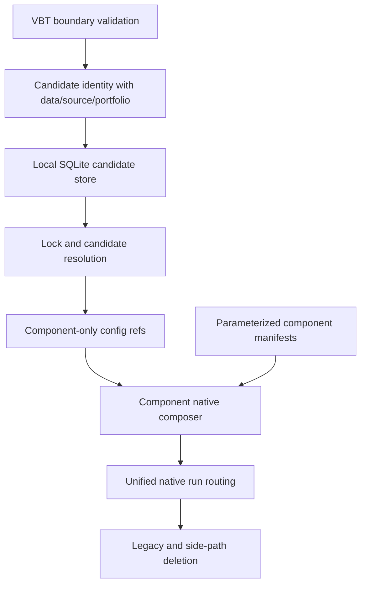

# feat: Add Component Candidate Promotion

## Summary

Validate the #31 native VectorBT execution boundary before extending it, then add a local SQLite candidate store, explicit per-component promotion locks, component-owned param spaces, and component-native composition. Components become the only forward authoring surface: remove `source:` selectors, active playbook/candidate-grid contracts, and separate fixed/non-optimized run branches after the component path covers one-candidate and multi-candidate execution.

---

## Problem Frame

Issue #32 sits immediately after #31: #31 introduces native VBT optimization evidence, but #32 makes those candidates durable, promotable, and component-owned. The main planning risk is assuming the #31 surface is automatically the correct VBT abstraction; this plan front-loads a validation/hardening unit so persistence and promotion do not lock in a flawed runner shape.

---

## Requirements

**Origin candidate persistence**
- R1. Optimization candidate rows must be persisted as first-class records derived from native VBT result-index evidence.
- R2. Persisted candidate identity must reuse the stable candidate key shape from native candidate evidence, not legacy candidate-axis or composed-candidate identifiers.
- R3. Candidate rows must preserve params, metrics, split metrics, rank, component identity, source identity, portfolio policy, data identity, and run provenance.
- R4. Candidate persistence must support querying top candidates by run, top candidates by metric, params by candidate key, params by promotion token, and provenance back to the originating run.
- R5. The first persistence implementation will use a local SQLite store managed with the run-store/provenance lifecycle, not only JSON leaderboard artifacts.
- R6. Candidate identity must include source, data, and portfolio identity so identical params from different datasets or policy contexts do not collide.

**Origin promotion and locked params**
- R7. Every completed optimization run must emit a stable, opaque promotion token for each ranked component's best candidate.
- R8. A promotion token identifies one run/component's promotable best candidate and must not identify mutable latest-best behavior.
- R9. Each strategy and indicator entry may lock params by either `lock_id` or `candidate_id`, but not both.
- R10. Promotion-token resolution must validate that the token belongs to the same component named by the config entry.
- R11. Locked components contribute fixed parameter values; unlocked components contribute VBT-native param spaces.
- R12. Locked-param runs must record the resolved candidate key, exact resolved params, and enough provenance to reproduce the run after the original artifact moves.
- R13. Direct candidate-key pinning must support reproducibility against non-rank-1 candidate rows.

**Origin parameterized components and composition, refined by planning**
- R14. Components must become the only forward authoring surface for research runs.
- R15. A component may expose a callable, optional VBT-native param space, defaults for single-candidate execution, and locked params resolved from config.
- R16. Superseding the origin `strategy.source: component` shape after planning feedback, run config must no longer require or accept `strategy.source: component`, `indicator.source: component`, or equivalent source selectors; component identity is implicit and entries name component ids directly.
- R17. Components without a param space may participate as constants; a run with no unlocked axes executes as one candidate through the same native VBT path rather than a separate non-optimized branch.
- R18. Indicator entries and the strategy entry jointly drive the composed optimization grid.
- R19. Strategy components must declare consumed indicator outputs, indicator components must declare produced outputs, and validation must fail when the configured set cannot satisfy the strategy.
- R20. Mixed locked and unlocked component entries must be supported in one native VBT optimization run.
- R21. Multiple unlocked components must compose into one native optimization grid rather than separate playbook sweeps.
- R22. Indicator outputs must pass into strategy execution through an explicit named-output contract.
- R23. Indicator config must support per-component locking clearly; batched shorthand such as `ids` must be removed from the forward schema rather than kept as a parallel convenience path.

**Origin playbook removal and migration**
- R24. Existing RSI/MA playbooks and the #31 optimization playbook example must migrate to component form before active playbook optimization removal.
- R25. Docs and examples must describe components as the canonical implementation surface after migration.
- R26. Playbook-specific optimization contracts, source selector fields, candidate-grid fields, top-level split fields for legacy sweeps, candidate-axis execution paths, and fixed/non-optimized side branches must be removed from active run contracts after component parity exists.
- R27. Historical artifact compatibility may exist only for concrete persisted-data or external-consumer needs; it must not preserve playbooks as an active authoring path.

**Planning refinements**
- P1. #32 implementation must validate and harden the #31 native optimization boundary against current VectorBT PRO guidance before building persistence, promotion, or component composition on top of it.
- P2. In composed grids, a promotion token locks a component parameter slice from the best joint candidate row and records the originating joint candidate key.
- P3. Partial locking of selected params inside one component is deferred; #32 plans whole-component locks only.
- P4. The final forward schema is component-only and source-selector-free, but active rejection of legacy syntax must be sequenced behind component execution and example parity unless the implementation lands as one atomic cutover.

**Origin actors:** A1 Research user, A2 Component author, A3 Aegis run lane, A4 Reviewer or automation agent, A5 Future planner or implementer.
**Origin flows:** F1 Persist optimization candidates, F2 Promote a best candidate through a lock reference, F3 Pin a non-best candidate explicitly, F4 Compose locked and unlocked components in one run, F5 Migrate away from playbooks.
**Origin acceptance examples:** AE1 persisted top candidates, AE2 `lock_id` best-candidate resolution, AE3 `candidate_id` non-best pinning, AE4 mixed locked/unlocked optimization grid, AE5 component param-space validation, AE6 missing consumed indicator output rejection, AE7 batched shorthand locking rejection, AE8 playbook docs/path removal.

---

## Scope Boundaries

- Do not implement persistence or promotion before validating the native VBT optimization boundary.
- Do not persist or promote the legacy `CandidateAxis` / `ComposedCandidate` model.
- Do not add latest-best or mutable promotion aliases.
- Do not preserve playbooks as an indefinite active authoring path.
- Do not keep `source:` selector fields once components are the only forward source.
- Do not maintain a separate non-optimized strategy-run branch; fixed/all-locked executions use the same component-native VBT path with one candidate.
- Do not store only top candidates without enough provenance to reproduce the run.
- Do not introduce a new optimizer engine or feed VBT params back into legacy candidate composition.
- Do not ship partial per-param locking in #32; whole-component locking is the active scope.
- Do not leave deprecated playbook examples as forward guidance once component parity exists.

### Deferred to Follow-Up Work

- Partial locking: support `lock_params` or equivalent only after whole-component promotion has shipped and users need subset locks.
- Advanced optimizer integrations: Optuna, Hyperopt, Bayesian search, or adaptive search remain separate VBT-native extension work.
- Historical artifact tooling beyond read/reporting: if old artifacts need migration or rehydration, plan it separately after identifying a concrete consumer.

---

## Context & Research

### Relevant Code and Patterns

- `research/aegis_research/optimization/runner.py` currently owns `execute_optimization`, wraps `vbt.cv_split`, builds sampled indexes with `vbt.combine_params`, maps ranking into a custom selection function, and canonicalizes VBT set labels.
- `research/aegis_research/optimization/evidence.py` owns `candidate_rows_from_param_index` and stable `cand_` keys, but current key identity includes source, params, hidden params, and portfolio policy, not data identity.
- `research/aegis_research/optimization/leaderboard.py` owns held-out leaderboard aggregation and carries `candidate_key`, but candidate rows do not currently persist ranks or top-N query records.
- `research/aegis_research/optimization/source.py` validates the #31 optimization source contract and rejects legacy candidate-axis/authoritative metric fields.
- `research/aegis_research/strategy_runs.py` currently routes optimization only through playbook strategies, passes `indicators={}` to the optimization source, and ignores configured indicators on the optimized path.
- `research/aegis_research/configuration/schema.py`, `research/aegis_research/configuration/builders.py`, and `research/aegis_research/configuration/validation.py` own strict run-config shape; current source refs and indicator `ids` batching must be removed from the forward component-only config while adding `lock_id` / `candidate_id`.
- `research/aegis_research/component_registry/contracts.py`, `research/aegis_research/component_registry/manifests.py`, and `research/aegis_research/component_registry/registry.py` provide static component manifest parsing, fingerprinting, and callable loading. Current manifests expose inputs, params, outputs, and strategy signals but not VBT param spaces, defaults, or consumes metadata.
- `research/aegis_research/candidate_sweeps.py` and playbook sweep functions in `research/aegis_research/strategy_runs.py` are the legacy paths to remove from active optimization after component parity.
- `docs/examples/components/indicator_component_example.py` and `docs/examples/components/strategy_component_example.py` are fixed examples to extend into parameterized components.
- `docs/examples/playbooks/optimization_playbook_example.py`, `docs/playbooks.md`, `docs/vectorbt-scaffold.md`, `research/configs/README.md`, and playbook READMEs need migration away from legacy playbook optimization guidance.

### Institutional Learnings

- `docs/solutions/best-practices/vectorbt-combine-params-conditions-levels-2026-05-17.md`: use VBT `condition`, `level`, and `combine_params` for parameter grids; do not rebuild VBT's grid semantics in Aegis.
- `docs/solutions/performance-issues/vectorbt-large-from-signals-chunking-memory-2026-05-17.md`: keep explicit memory/resource budgets and mono-chunk awareness around large `Portfolio.from_signals` runs.
- `docs/solutions/best-practices/vectorbt-execution-timing-nextopen-2026-05-17.md`: native parameterization must not bypass Aegis next-open execution timing validation.
- `docs/solutions/best-practices/forward-first-long-only-signal-contract-2026-05-18.md`: forward-first schema changes should reject removed fields loudly rather than preserving compatibility branches.

### VectorBT PRO References

- `vbt.Param`, `vbt.parameterized`, `vbt.cv_split`, and `vbt.combine_params` resolved through VectorBT PRO MCP.
- Cross-validation cookbook: `vbt.cv_split` is the VBT-native path for functions that take one parameter combination at a time, uses `takeable_args`, `parameterized_kwargs`, `merge_func`, custom `selection` via `vbt.RepFunc`, `vbt.LabelSel`, and `return_grid`.
- `cv_split` source: train and test sets within each split must execute in the same thread/process because stored grid results are reused; `return_grid="first"` duplicates train-grid results for each set, while `return_grid="all"` executes grids on each set.
- Optimization generation docs: default behavior is Cartesian products; shared `level` ties params; `condition` filters invalid combinations; `hide=True`, `keys`, `_random_subset`, and `combine_params` affect result indexes and evidence.
- IndicatorFactory support context: when apply functions cannot accept `vbt.Param`, pre-generate concrete parameter arrays with `vbt.combine_params`; Aegis components should not assume every indicator implementation can receive `Param` wrappers directly.

---

## Key Technical Decisions

- Validate before extending #31: The first implementation unit hardens the #31 runner against VBT guidance before persistence or promotion depends on it.
- Local SQLite persistence: The first durable candidate store uses stdlib SQLite, managed inside Aegis' local run/provenance environment, with normalized candidate, metric/rank, promotion, and provenance records.
- Candidate identity includes data identity: #32 bumps or extends the candidate identity payload so source, params, hidden params, portfolio policy, and data identity all participate before promotion ships.
- Composite source identity comes before persistence: Durable identity must include component strategy/indicator identities, behavior fingerprints, and component-param namespace rules before the SQLite store accepts component-native candidates.
- Promotion locks component slices: In a joint indicator + strategy grid, `lock_id` resolves a component-specific param slice from the rank-1 joint candidate while preserving the originating joint candidate key for provenance.
- Promotion token emission waits for component slicing: U4 defines resolver/store primitives, but per-component token emission happens only after U7/U8 can recover component slices from joint rows.
- Direct candidate pinning remains exact-row reproducibility: `candidate_id` pins a persisted candidate row and validates that the requested component slice exists.
- Whole-component locks only: Subset param locking is deferred to avoid expanding the contract before whole-component promotion is proven.
- Config becomes component-only: remove `source:` selectors, make strategy and indicator entries name component ids directly, and remove indicator `ids` batching so every lockable entry has one stable component slot.
- Component manifests stay static: New param-space/default/output-consumption metadata should fit the existing literal manifest and explicit callable resolver pattern rather than executing arbitrary config or discovery code.
- Playbook and side-path removal waits only for component parity: migrate examples and tests to parameterized components, then delete active playbook/candidate-grid routing, source selectors, and the separate non-optimized execution branch.

---

## Open Questions

### Resolved During Planning

- Should #32 blindly extend #31 native optimization surfaces? No. The plan first validates and hardens the #31 VBT boundary against current VBT guidance.
- What should the first persistence implementation use? Local SQLite, with normalized candidate, metric/rank, promotion, and provenance records.
- Should candidate identity include data identity? Yes. Otherwise identical params on different datasets can collide or resolve incorrectly.
- In a composed grid, does a promotion token lock a whole joint row or a component slice? It locks the component slice from the best joint row and records the joint key.
- Should partial locking ship in #32? No. Defer partial locking and ship whole-component locks only.
- Should failed runs create promotion tokens? No. Completed runs create promotion tokens; failed runs may keep diagnostic evidence but must not create promotable candidates.

### Deferred to Implementation

- Exact SQLite file placement and lifecycle hooks: choose while integrating with `RunStore`, but keep the store local, deterministic, and portable under Aegis' configured output/provenance area.
- Exact schema names and migration mechanics: finalize in tests while preserving the conceptual records named in this plan.
- Exact component param namespace encoding in VBT indexes: choose during implementation, but it must preserve component family/id/stable slot/param boundaries and remain stable for candidate keys without relying on config `source:` fields.
- Exact manifest field names for param-space and consumes metadata: choose while extending the static manifest parser; the behavior and validation rules are settled here.
- Exact historical artifact read/reporting support: include only if current tests or documented consumers prove a concrete need.

---

## High-Level Technical Design

> *This illustrates the intended approach and is directional guidance for review, not implementation specification. The implementing agent should treat it as context, not code to reproduce.*



Conceptual data flow:

```text
VBT result index row
  + component-aware param namespace
  + source identity
  + data identity
  + portfolio policy
  -> candidate key and candidate row
  -> rank/metric rows from leaderboard
  -> promotion token for rank-1 component slices
  -> locked config resolves constants for future runs
```

---

## Phased Delivery

### Phase 0: Validate Native VBT Foundation

- Confirm #31's `cv_split` usage, selection, return-grid handling, sampled-index evidence, and takeable args against VBT behavior.
- Fix or isolate any runner contract problems before persistence/promotion work starts.

### Phase 1: Persistence and Promotion Primitives

- Extend candidate identity to include data identity.
- Add local SQLite candidate store and query API.
- Define and resolve stable per-component lock references.

### Phase 2: Config and Component Contracts

- Add component-only lock/pin config validation and remove `source:` selectors.
- Extend component manifests with param spaces, single-candidate defaults, produced outputs, and consumed outputs.

### Phase 3: Component-Native Optimization

- Compose locked, unlocked, and defaulted components into one VBT-native execution source.
- Route all component strategy runs through the validated native runner, including one-candidate executions with no unlocked axes.

### Phase 4: Migration and Legacy Removal

- Migrate RSI/MA playbooks and docs examples to parameterized components.
- Remove active playbook/candidate-grid/source-selector contracts and separate fixed/non-optimized branches after parity tests pass.

---

## Implementation Units

### U1. Validate And Harden Native VBT Runner

**Goal:** Prove the #31 native optimization boundary follows current VBT best practices before #32 builds persistence and promotion on top of it.

**Requirements:** P1, R1, R2, R3, R4, R6, R11; F1; AE1

**Dependencies:** None

**Files:**
- Modify: `research/aegis_research/optimization/runner.py`
- Modify: `research/aegis_research/optimization/source.py`
- Test: `tests/unit/research/aegis_research/test_optimization_runner.py`
- Test: `tests/unit/research/aegis_research/test_optimization_return_shapes.py`
- Test: `tests/unit/research/aegis_research/test_optimization_execute_validation.py`
- Test: `tests/unit/research/aegis_research/test_optimization_source.py`

**Approach:**
- Characterize current `vbt.cv_split` behavior for `takeable_args`, `parameterized_kwargs`, custom `selection`, `vbt.LabelSel`, `return_grid="first"`, `return_grid="all"`, `NoResult`, and sampled-index extraction.
- Verify that the runner's precomputed sampled index matches VBT-generated evaluated rows for grid and random search.
- Verify that `return_grid="first"` does not accidentally persist duplicated held-out grid rows as selection evidence.
- Verify that multi-metric outputs and ranking metric extraction behave as VBT expects, not as an Aegis-invented result shape.
- Verify cardinality estimation for candidates x splits x sets x symbols x retained grids before VBT execution, especially for `return_grid="all"`.
- Confirm train/test execution constraints from `cv_split`; reject or avoid execution kwargs that would split train and held-out sets into incompatible execution contexts.
- Treat component composition requirements as downstream users of this runner, not U1 deliverables; U1 proves runner capabilities and resource gates only.
- Add hardening only where the current runner diverges from VBT guidance. If the runner is aligned, preserve it and document the evidence through tests.

**Execution note:** Characterization-first. Add tests around current VBT behavior before changing runner logic.

**Patterns to follow:**
- `tests/unit/research/aegis_research/test_optimization_return_shapes.py` for VBT return-shape probes.
- VectorBT PRO cross-validation cookbook examples for `cv_split`, `takeable_args`, `selection`, and `return_grid`.
- `docs/solutions/best-practices/vectorbt-combine-params-conditions-levels-2026-05-17.md` for VBT grid semantics.

**Test scenarios:**
- Happy path: grid optimization evaluates a one-combination pipeline through `cv_split` and returns canonical selection/held-out roles.
- Happy path: random optimization threads subset size and seed into VBT parameterization and persists actual sampled rows.
- Happy path: custom selection chooses the configured ranking metric for descending and ascending directions.
- Edge case: `return_grid="first"` retains only selection eligibility evidence even when VBT duplicates train-grid results.
- Edge case: `return_grid="all"` separates selection-grid and held-out-grid evidence and stays resource-gated.
- Edge case: oversized `return_grid="all"` run is rejected or clearly diagnosed before expensive execution.
- Error path: every sampled row returns non-finite ranking values and the runner emits visible diagnostics instead of a completed leaderboard.
- Error path: execution kwargs that violate VBT's train/test same-thread constraint are rejected or normalized before execution.
- Integration: current #31 runner tests remain green after hardening, proving #32 starts from a validated boundary.

**Verification:**
- The plan can safely reference the native runner as validated by tests rather than assumed correct.
- If a VBT mismatch is found, it is corrected before U2-U8 build on it.

---

### U2. Extend Candidate Identity With Data Provenance

**Goal:** Prevent candidate collisions across datasets, composed sources, component contracts, and portfolio policies before candidates become durable or promotable.

**Requirements:** R1, R2, R3, R6, P1; F1; AE1

**Dependencies:** U1

**Files:**
- Modify: `research/aegis_research/optimization/evidence.py`
- Modify: `research/aegis_research/strategy_runs.py`
- Test: `tests/unit/research/aegis_research/test_optimization_evidence.py`
- Test: `tests/unit/research/aegis_research/test_optimization_failure_paths.py`

**Approach:**
- Extend the candidate identity payload to include data identity alongside source identity, params, hidden params, and portfolio policy.
- Define the durable composed-source identity shape before persistence accepts component-native candidates, including strategy component identity, indicator component identities, component behavior fingerprints, and component-param namespace version.
- Bump the identity schema version or add a clear versioned payload marker so old artifact-only keys are not silently treated as durable #32 keys.
- Keep split, set, symbol, and metric levels as evidence coordinates unless they affect candidate behavior.
- Include the component implementation/source hash and manifest/param-space contract version or equivalent behavior fingerprint for any component-sourced candidate row.
- Preserve deterministic serialization for `NaN`, infinities, enums, timestamps, timedeltas, arrays, tuples, and hidden params.
- Update strategy-run optimization evidence generation to pass the run's data identity into candidate row derivation.

**Patterns to follow:**
- Existing `_canonical_value` and `_candidate_key` behavior in `research/aegis_research/optimization/evidence.py`.
- Data evidence construction in `_strategy_data_evidence_payload` within `research/aegis_research/strategy_runs.py`.

**Test scenarios:**
- Happy path: same params, same source, same portfolio, and same data produce the same candidate key.
- Edge case: same params with different data identity produce different candidate keys.
- Edge case: same visible params with different component source hash, manifest version, or param-space contract version produce different durable keys.
- Edge case: same params with different source hash or portfolio policy still produce different keys.
- Edge case: coordinate-only differences such as split/set/symbol do not create separate candidate identities.
- Error path: missing data identity in durable candidate persistence is rejected before promotion tokens can be generated.
- Error path: old #31 artifact-only candidate keys are rejected for #32 direct pinning unless explicitly rehydrated through scoped historical compatibility.

**Verification:**
- Candidate keys are safe to persist and resolve across runs with different datasets.
- Existing #31 artifact tests are updated intentionally rather than broken accidentally.

---

### U3. Add Local SQLite Candidate Store

**Goal:** Persist candidate rows, ranking/metric rows, promotion records, and provenance in a queryable local store.

**Requirements:** R1, R2, R3, R4, R5, R6; F1; AE1

**Dependencies:** U2

**Files:**
- Create: `research/aegis_research/optimization/candidate_store.py`
- Modify: `research/aegis_research/optimization/__init__.py`
- Modify: `research/aegis_research/provenance/run_store.py` if a store location helper belongs there
- Test: `tests/unit/research/aegis_research/test_optimization_candidate_store.py`
- Test: `tests/integration/research/aegis_research/test_strategy_run.py`

**Approach:**
- Use stdlib `sqlite3` and explicit transaction boundaries; do not introduce a new database dependency.
- Maintain a candidate-store schema version, verify compatibility on open, and fail fast or migrate forward explicitly when an unsupported version is encountered.
- Define deterministic store location under the configured Aegis output/provenance area so reruns and local queries find the same store without absolute-path assumptions.
- Define the store namespace used by `lock_id` and `candidate_id`: tokens resolve against the configured local candidate store, record their origin store/run namespace, and fail with a clear diagnostic if the required store is unavailable. Cross-store export/import is out of scope unless a concrete consumer appears.
- Create the candidate-store directory and SQLite file with owner-only permissions where the platform supports it; warn or fail on overly permissive existing stores according to the repo's local-sensitive-data policy.
- Store normalized candidate records derived from `candidate_rows_from_param_index`.
- Store rank and metric records derived from optimization leaderboard rows, including top-N query support.
- Store promotion-token records separately from candidate rows so token lookup is stable and auditable.
- Store ranking scope metadata with every rank/metric row so top-N queries do not silently mix incompatible ranking metrics, directions, split policies, symbol aggregation, or held-out policies.
- Store run/component/source/data/portfolio provenance needed to reconstruct why a row is distinct.
- Define unique boundaries for run, candidate key, component slot, rank scope, metric row, and promotion token so retries are deterministic.
- Add composite indexes for top candidates by run, top-N by metric, candidate lookup, and promotion lookup; large stores must not require JSON artifact scans.
- Define store growth expectations: estimate candidate rows, metric rows, split metrics, component slices, provenance rows, and bytes before writing promotable records.
- Normalize or reference repeated params/provenance where practical so candidate-store and artifact growth is bounded.
- Define SQLite concurrency policy, including single-writer assumptions, busy timeout or retry behavior, and visible diagnostics for lock contention.
- Define privacy/provenance retention expectations: avoid secrets and absolute paths in persisted provenance, store only data identity needed for reproducibility, and document deletion/export expectations.
- Document that the SQLite store is local-sensitive research data, even when secret values and absolute paths are excluded.
- Keep completed/promotable records distinct from diagnostic/non-promotable records; query helpers filter to promotable records by default.
- Ensure completed evidence, artifact status, and store records reconcile: no promotable rows are visible until the strategy artifact succeeds, store rows reference the run/artifact/schema/hash, and reruns can detect or repair partial writes deterministically.
- Provide query helpers for top 1 by run, top 5 by run, top N by metric, params by candidate key, params by promotion token, and provenance by candidate.

**Patterns to follow:**
- `RunStore` lifecycle and artifact status patterns in `research/aegis_research/provenance/`.
- Existing leaderboard summary/rank logic in `research/aegis_research/optimization/leaderboard.py`.

**Test scenarios:**
- Happy path: inserting a completed optimization run persists candidate, metric/rank, and provenance records in one transaction.
- Happy path: opening an existing candidate store validates schema version before reads or writes.
- Happy path: candidate-store file and directory are created with restrictive permissions on supported platforms.
- Happy path: top 1 and top 5 queries by run return rows ordered by leaderboard rank.
- Happy path: top N by metric returns rows across eligible runs with stable tie-breaking.
- Happy path: params by candidate key returns the canonical params and component slices.
- Happy path: provenance lookup returns origin run, component identity, source identity, data identity, and portfolio policy.
- Edge case: a large inserted candidate fixture uses SQLite indexes for top-N and lookup queries without scanning JSON artifacts.
- Edge case: concurrent completed-run writes use the defined locking policy and either serialize successfully or fail with visible diagnostics.
- Error path: duplicate insert for the same run/candidate is idempotent or rejected predictably without corrupting rankings.
- Error path: incompatible store schema version fails before writing candidate rows.
- Error path: promotion resolution against a missing or different local store fails with a clear unresolved-store diagnostic.
- Error path: overly permissive existing store permissions trigger the chosen warning or failure behavior.
- Error path: failed run diagnostics do not create promotion-token rows.
- Error path: diagnostic/non-promotable rows do not satisfy default top-N or promotion queries.
- Integration: a completed optimization run creates a local candidate store entry alongside `strategy_run.json` evidence.

**Verification:**
- Candidate persistence satisfies the origin query requirements without reading and scanning every JSON artifact.
- Store records are enough for promotion resolution and audit review.

---

### U4. Define Promotion Resolution Primitives

**Goal:** Define lock/candidate reference semantics, resolver APIs, and store primitives without emitting immutable per-component tokens before component slices are recoverable.

**Requirements:** R7, R8, R9, R10, R11, R12, R13, P2, P3; F2, F3; AE2, AE3

**Dependencies:** U3

**Files:**
- Modify: `research/aegis_research/optimization/candidate_store.py`
- Create or modify: `research/aegis_research/optimization/promotion.py`
- Modify: `research/aegis_research/strategy_runs.py`
- Test: `tests/unit/research/aegis_research/test_optimization_promotion.py`
- Test: `tests/integration/research/aegis_research/test_strategy_run.py`

**Approach:**
- Define the reference model for `lock_id` and `candidate_id`, including component family/id, component slot identity, origin store/run namespace, candidate key, and the fact that component param slices are required once U7 provides namespace encoding.
- Delay actual per-component lock-token emission until U8, after U7 establishes component namespaces and slice recovery from joint candidate rows.
- Resolve `lock_id` only when component family/id matches the config entry.
- Resolve `candidate_id` to a specific persisted candidate row and validate component family/id, stable component slot identity, source identity compatibility, and store namespace compatibility. Defer concrete component-slice extraction behavior to U7/U8.
- Treat `lock_id` and `candidate_id` as mutually exclusive references.
- Inline resolved params, resolved candidate key, origin run, source identity, data identity, portfolio policy, and reference metadata into every locked run's evidence.
- Do not generate lock tokens for failed, partial, all-NaN, missing-metric, or non-promotable runs.

**Patterns to follow:**
- Candidate-key canonicalization in `research/aegis_research/optimization/evidence.py`.
- Failure-sample visibility in `research/aegis_research/optimization/leaderboard.py`.

**Test scenarios:**
- Happy path: resolver primitives can read a stored promotion reference and return fixed params plus provenance for a matching component slot.
- Happy path: `candidate_id` pins a non-rank-1 row and records exact resolved params.
- Edge case: reference records can encode two distinct component slots from one joint candidate without requiring U4 to extract final component slices before U7.
- Error path: lock token generated for another component id is rejected before execution.
- Error path: `lock_id` and `candidate_id` together fail validation or resolution.
- Error path: direct candidate key for the wrong family, wrong component id, wrong component slot, or incompatible source identity fails before execution.
- Error path: missing token, missing candidate row, incompatible store namespace, or stale store entry fails before VBT execution; missing component slice is covered by U7/U8 once slice extraction exists.
- Error path: rank-1 row with missing ranking metric does not produce a lock token.

**Verification:**
- Promotion resolution is explicit, immutable, component-scoped, and reproducible from local evidence.
- No API resolves mutable latest-best concepts.

---

### U5. Redesign Run Config For Component-Only Refs

**Goal:** Define and add the component-only config contract for locks and direct candidate pins, while leaving active legacy removal to the parity-gated cutover unless the implementation lands atomically.

**Requirements:** R9, R10, R11, R12, R13, R16, R17, R20, R23; F2, F3, F4; AE2, AE3, AE4, AE7

**Dependencies:** U4, U6

**Files:**
- Modify: `research/aegis_research/configuration/schema.py`
- Modify: `research/aegis_research/configuration/builders.py`
- Modify: `research/aegis_research/configuration/validation.py`
- Modify: `research/aegis_research/config.py`
- Test: `tests/integration/research/aegis_research/test_config_contract.py`

**Approach:**
- Replace selector-backed strategy refs with a component strategy entry that names one component id directly and may include `lock_id` or `candidate_id`.
- Replace selector-backed indicator refs with entries that each name exactly one component id and may include `lock_id` or `candidate_id`.
- Define the removed-field validation for `source:` selectors and indicator `ids` batching, but activate it only in the new component-only schema/cutover. If U5-U10 do not land atomically, old active configs must not be broken before U8/U9 component parity exists.
- Remove the #31 validation rule that treats `strategy.source: component` as the way to enter component execution. After U6 metadata exists, validation should assume component entries and validate param-space/default/lock compatibility instead.
- Validate mutual exclusivity of `lock_id` and `candidate_id` before data loading.
- Validate component ids and lock syntax using existing path-aware config issue reporting.
- Keep hard rejection of playbook refs and source selectors as a U10 activation/cutover concern once the component-only schema is active.

**Patterns to follow:**
- `_validate_run_source_ref`, `_validate_indicator_sources`, and strict unknown-field validation in `research/aegis_research/configuration/validation.py`.
- Builder/dataclass mirroring in `research/aegis_research/configuration/builders.py`.

**Test scenarios:**
- Happy path: strategy component entry with `id` and `lock_id` resolves into a config object without a `source:` selector.
- Happy path: indicator component entry with one `id` and `candidate_id` resolves into a config object.
- Error path: `lock_id` and `candidate_id` together fail at the exact config path.
- Error path: in the component-only schema/cutover tests, authored `strategy.source`, `indicator.source`, `indicators[].source`, or `ids` fails clearly as removed forward schema.
- Error path: component entry with neither explicit params, resolved lock/candidate params, defaults, nor param space fails before data loading.
- Error path: playbook indicators cannot enter component composition.
- Integration: config validation accepts component strategy and indicators with optimization once components expose compatible param metadata, without any `source:` fields.
- Integration: if U5 ships before U8/U9, existing active configs remain executable until the parity-gated U10 cutover flips removed-field rejection.

**Verification:**
- Config can express every lock/pin flow from the requirements.
- Ambiguous batched locking is impossible.

---

### U6. Extend Component Manifest Contracts

**Goal:** Make components capable of single-candidate execution, native VBT param spaces, defaults, and named output/consumption validation.

**Requirements:** R14, R15, R16, R17, R18, R19, R22; F4; AE5, AE6

**Dependencies:** U1

**Files:**
- Modify: `research/aegis_research/component_registry/contracts.py`
- Modify: `research/aegis_research/component_registry/manifests.py`
- Modify: `research/aegis_research/component_registry/registry.py` if callable resolution needs additional static callable names
- Modify: `tests/support/research/aegis_research/component_fixtures.py`
- Test: `tests/unit/research/aegis_research/test_component_registry.py`
- Test: `tests/integration/research/aegis_research/test_component_autodiscovery.py`

**Approach:**
- Add optional static manifest metadata for VBT param space support, single-candidate defaults, produced output names, and consumed output names.
- Define default precedence for component execution: explicit config params or resolved lock/candidate params override component defaults; components without unlocked axes may execute with valid defaults as one candidate through the same native path.
- Add a callable resolver for component param spaces that mirrors existing `COMPONENT_CALLABLE` loading without executing code during discovery.
- Validate that manifest-declared defaults and lockable params line up with component param names and param-space callable outputs.
- Validate strategy consumed outputs against configured indicator produced outputs before execution.
- Keep strategy ownership boundaries: components emit signals/outputs, not authoritative portfolio metrics.
- Keep manifest parsing literal and deterministic; runtime callable loading remains opt-in after registry discovery.

**Patterns to follow:**
- Static manifest parsing in `parse_component_file` and `_read_static_declaration`.
- Strategy forbidden-key validation in `_strategy_manifest`.
- Existing component fixture generation in `tests/unit/research/aegis_research/test_component_registry.py`.

**Test scenarios:**
- Happy path: indicator component declares produced output names and optional param-space callable.
- Happy path: strategy component declares consumed indicator outputs and optional param-space callable.
- Happy path: component without param space remains valid for one-candidate native execution when defaults or explicit params are available.
- Happy path: one-candidate component run applies defaults when no explicit fixed params are supplied.
- Happy path: explicit config params or resolved lock/candidate params override defaults where both exist.
- Error path: optimization validation rejects a component whose param-space callable is missing or returns no VBT params.
- Error path: manifest declares consumed output that no configured indicator produces.
- Error path: non-literal manifest metadata is rejected during discovery without executing top-level code.
- Error path: strategy manifest attempts to own portfolio behavior and is rejected.

**Verification:**
- Component registry exposes enough metadata for component-native optimization without runtime side effects during discovery.
- Fixed/all-locked component behavior remains supported through the unified native path.

---

### U7. Compose Component Native Execution Sources

**Goal:** Build one VBT-native execution source from configured strategy and indicator components, mixing locked constants, defaults, and unlocked param spaces.

**Requirements:** R11, R14, R15, R17, R18, R19, R20, R21, R22, P2, P3; F4; AE4, AE5, AE6

**Dependencies:** U4, U5, U6

**Files:**
- Create or modify: `research/aegis_research/optimization/component_source.py`
- Modify: `research/aegis_research/optimization/source.py`
- Modify: `research/aegis_research/strategy_runs.py`
- Test: `tests/unit/research/aegis_research/test_optimization_component_source.py`
- Test: `tests/integration/research/aegis_research/test_strategy_run.py`

**Approach:**
- Resolve locked component params through the promotion/candidate resolver and treat them as constants.
- Resolve unlocked component param spaces into VBT `Param` axes using a stable component-aware namespace.
- Build a synthetic pipeline that runs indicator components first, collects named outputs, and calls the strategy component with named indicator outputs and strategy params.
- Reject duplicate produced output names unless the config introduces an explicit aliasing/namespacing rule; silent last-writer-wins behavior is not allowed.
- Keep fixed/all-locked components as constants and emit a one-row candidate index when no unlocked axes exist; do not route to a separate non-optimized branch.
- Preserve Aegis portfolio ownership by returning signal outputs to the validated native runner rather than component-owned metrics.
- Build source evidence that includes every contributing component's id, family, version, source hash, param-source mode, resolved lock/candidate references, and produced/consumed output contract.
- Ensure component param slices can be recovered from a joint candidate row for lock-token generation.
- Preserve VBT-native sharing/reuse where possible so indicator outputs are not recomputed for every full joint row when only strategy params vary.
- Add a focused U7 spike/test proving whether the chosen VBT parameterization shape actually reuses indicator outputs across strategy-only axes. If it does not, choose the fallback architecture explicitly and make preflight estimates assume recomputation.
- Add composition preflight estimates for indicator-axis cardinality, strategy-axis cardinality, joint cardinality, intermediate output shape, and expected output memory.
- Define whether named component outputs are persisted, retained only during execution, or summarized in evidence; large outputs must not be silently materialized beyond resource gates.

**Patterns to follow:**
- `OptimizationSource` contract in `research/aegis_research/optimization/source.py`.
- Existing fixed component indicator and strategy resolution in `research/aegis_research/strategy_runs.py`.
- Strategy indicator consumption tracking with `StrategyIndicatorInputs`.

**Test scenarios:**
- Happy path: unlocked strategy and unlocked indicator compose into one VBT param grid.
- Happy path: locked indicator plus unlocked strategy produces a grid over strategy axes only.
- Happy path: unlocked indicator plus locked strategy produces a grid over indicator axes only.
- Happy path: fixed-only or all-locked components contribute constants and evidence as one native candidate without creating an axis.
- Edge case: param-name collision across components is isolated by component namespace.
- Edge case: duplicate produced output names are rejected or require explicit aliases before execution.
- Edge case: large indicator outputs trip preflight diagnostics before VBT execution or materialization.
- Edge case: strategy-only axes either reuse indicator outputs as proven by tests or trigger the documented fallback/preflight behavior.
- Error path: no unlocked axes and missing explicit/resolved/default params fails before `cv_split` execution.
- Error path: component returns an undeclared output or omits a declared required output.
- Error path: strategy tries to consume an output not produced by configured indicators.

**Verification:**
- Component-native optimization can express mixed promoted and exploratory runs without playbooks.
- Joint candidate rows can be sliced back into component params for promotion.

---

### U8. Route All Component Runs Through Native Execution

**Goal:** Replace playbook-only optimization routing and separate fixed/non-optimized routing with one component-native VBT path while preserving artifacts, preflight, leaderboard, and diagnostics.

**Requirements:** R1, R3, R4, R7, R11, R12, R16, R18, R20, R21, R24, R26; F1, F2, F4; AE1, AE2, AE4, AE5

**Dependencies:** U3, U4, U5, U6, U7

**Files:**
- Modify: `research/aegis_research/strategy_runs.py`
- Modify: `research/aegis_research/optimization/preflight.py`
- Modify: `research/aegis_research/optimization/leaderboard.py`
- Modify: `research/aegis_research/provenance/manifest.py` if artifact shape counters change
- Test: `tests/unit/research/aegis_research/test_optimization_preflight.py`
- Test: `tests/unit/research/aegis_research/test_optimization_leaderboard.py`
- Test: `tests/integration/research/aegis_research/test_strategy_run.py`
- Test: `tests/integration/research/aegis_research/test_run_playbook_sources.py`

**Approach:**
- Update `run_strategy_sweep` so all component runs use the component source composer and validated native runner, with one candidate when no unlocked axes exist.
- Add a pre-data native resolution/preflight step for component refs, lock/candidate lookup, component-match validation, component output-contract validation, and one-candidate/param-space checks so invalid public contracts fail before data loading where possible.
- Stop passing empty indicators into optimized runs; configured component indicators become part of the composed source.
- Persist candidate rows and leaderboard/rank rows to SQLite after successful native execution and before emitting promotion tokens; one-candidate runs still produce normal candidate evidence.
- Emit `optimization.lock_ids` or equivalent promotion evidence for completed component runs only after candidate-store writes and component-slice recovery succeed.
- Emit lock ids for both strategy and indicator component slots when they participate in the completed joint candidate.
- Record locked-param resolution evidence for every locked component slot in `strategy_run.json`.
- Keep preflight based on VBT-native execution shape, including locked constants, unlocked axes, candidate count, metric-row count, split count, set count, symbols, retained grid policy, intermediate output memory, expected portfolio evaluations, and artifact/store byte expectations.
- Add hard gates for maximum candidate count, metric rows, estimated portfolio evaluations, intermediate memory, and artifact/store bytes, with diagnostics that show the dimension breakdown.
- Define finalization semantics: strategy artifact success, candidate-store writes, manifest evidence, and promotion-token creation must reconcile before the run is marked completed/promotable.
- If candidate-store persistence fails after VBT execution, mark the run non-promotable or failed with visible diagnostics; do not emit lock ids that cannot be resolved from the store.
- Keep failure paths visible: preflight failures, store failures, execution failures, all-NaN/all-NoResult paths, missing component outputs, and missing lock refs update manifest diagnostics without creating promotion tokens.
- Maintain existing artifact ids and manifest lifecycle unless a schema bump is required.

**Patterns to follow:**
- Existing `_run_optimization_strategy_sweep` artifact payload and manifest evidence shape.
- `build_preflight` diagnostics in `research/aegis_research/optimization/preflight.py`.
- `build_optimization_leaderboard` failure-sample behavior.

**Test scenarios:**
- Happy path: component optimization completes, writes `strategy_run.json`, persists candidates, and emits lock ids.
- Happy path: all-fixed or all-locked component run executes as one native candidate and writes standard component evidence without entering a side path.
- Happy path: completed joint run emits lock ids for strategy and indicator components.
- Happy path: mixed locked/unlocked config runs over only unlocked axes and records resolved locked params.
- Happy path: direct `candidate_id` pin resolves a non-best row and executes with that component constant.
- Error path: preflight oversize failure records diagnostics and writes no promotable rows.
- Error path: each preflight limit for candidate count, metric rows, estimated portfolio evaluations, intermediate memory, and artifact/store bytes rejects oversized work before execution.
- Error path: candidate-store write failure, locked DB, corrupt DB, or incompatible schema after VBT execution records non-promotable diagnostics and emits no lock ids.
- Error path: missing lock id fails before VBT execution and writes no promotion token.
- Error path: component output mismatch fails with manifest diagnostics and no completed leaderboard.
- Integration: monkeypatch legacy candidate sweep functions to raise and verify component optimization does not call them.
- Integration: old playbook optimization path and separate non-optimized path are no longer forward routes once component migration lands.

**Verification:**
- Component-native execution is the only supported forward run path.
- Completed runs are queryable and promotable through the local store.

---

### U9. Migrate Examples, Docs, And Configs To Components

**Goal:** Replace legacy playbook optimization examples with parameterized components and updated run configs.

**Requirements:** R14, R15, R16, R18, R19, R24, R25; F5; AE5, AE6, AE8

**Dependencies:** U6, U7, U8

**Files:**
- Modify: `docs/examples/components/indicator_component_example.py`
- Modify: `docs/examples/components/strategy_component_example.py`
- Delete or replace: `docs/examples/playbooks/optimization_playbook_example.py`
- Modify: `research/configs/rsi_playbook_dry_run.yaml`
- Modify: `docs/components.md`
- Modify: `docs/playbooks.md`
- Modify: `docs/vectorbt-scaffold.md`
- Modify: `research/configs/README.md`
- Modify or delete: `research/playbooks/indicators/README.md`
- Modify or delete: `research/playbooks/strategies/README.md`
- Test: `tests/integration/research/aegis_research/test_config_contract.py`
- Test: `tests/integration/research/aegis_research/test_component_autodiscovery.py`

**Approach:**
- Convert the #31 optimization playbook example into a strategy component with a param-space callable.
- Convert tracked RSI/MA indicator and strategy playbook examples into component equivalents or remove them after equivalent component examples land.
- Update the public dry-run config to use direct component entries, nested optimization policy, and component param spaces, with no `source:` selectors.
- Document `lock_id`, `candidate_id`, whole-component locking, and the non-goal of partial locking.
- Document local candidate-store queries at the user level without exposing storage internals as a public API unless intentional.
- Remove or rewrite playbook docs so they no longer read as forward optimization authoring guidance.

**Patterns to follow:**
- Current component example percent-cell style and literal manifest declarations.
- Documentation boundary language in the #31 plan and requirements docs.

**Test scenarios:**
- Happy path: component examples are discoverable by the component registry.
- Happy path: updated run config validates with component strategy and component indicators.
- Happy path: docs examples do not reference playbook optimization as the recommended path.
- Error path: stale docs/config examples using `candidate_grid` for optimization are caught by validation or docs tests if present.
- Integration: example component param spaces produce VBT params accepted by the component source composer.

**Verification:**
- A user reading docs sees components as the canonical path.
- Example configs and component examples match the active run contract.

---

### U10. Remove Active Legacy And Side Paths

**Goal:** Delete or deactivate playbook/candidate-grid/source-selector contracts and separate fixed/non-optimized branches after component parity exists, without preserving indefinite compatibility shims.

**Requirements:** R24, R25, R26, R27; F5; AE8

**Dependencies:** U8, U9

**Files:**
- Modify or delete: `research/aegis_research/candidate_sweeps.py`
- Modify: `research/aegis_research/strategy_runs.py`
- Modify: `research/aegis_research/playbook_registry/contracts.py`
- Modify: `research/aegis_research/playbook_registry/registry.py`
- Modify: `research/aegis_research/configuration/schema.py`
- Modify: `research/aegis_research/configuration/validation.py`
- Modify or delete: `tests/unit/research/aegis_research/test_candidate_sweeps.py`
- Modify: `tests/unit/research/aegis_research/test_playbooks.py`
- Modify: `tests/integration/research/aegis_research/test_run_playbook_sources.py`

**Approach:**
- Remove active routing to `playbook_sweep_result.v1` and `aegis.optimization_source.v1` playbook optimization contracts once component examples cover the workflows.
- Remove `source:` selectors, indicator `ids` batching, `candidate_grid`, and legacy top-level split fields from the forward schema, or reject them with clear removed-field validation paths if schema-version policy requires a transition.
- Activate the U5 removed-field validation only after U8 component execution and U9 examples/configs prove parity, unless the implementation ships U5-U10 as one atomic cutover.
- Delete custom candidate composition calls from active strategy-run execution.
- Delete or collapse separate fixed/non-optimized run routing so fixed/all-locked component configs execute through the same native component path as multi-candidate configs.
- Keep only explicitly scoped historical artifact read/reporting support if tests or documented consumers require it.
- Update tests from legacy-positive assertions to removal/negative assertions where behavior is no longer active.
- Preserve one-candidate component runs and native component optimization while reducing legacy code blast radius.

**Execution note:** Characterization-first for any legacy read/reporting behavior that remains; otherwise use deletion tests that prove active routes are gone.

**Patterns to follow:**
- Forward-first removed-field behavior in `docs/solutions/best-practices/forward-first-long-only-signal-contract-2026-05-18.md`.
- Existing negative-call test `test_optimization_routes_away_from_custom_candidate_grid` in `tests/integration/research/aegis_research/test_run_playbook_sources.py`.

**Test scenarios:**
- Happy path: component-native optimized run still succeeds after legacy route removal.
- Error path: playbook optimization config is rejected as removed forward behavior.
- Error path: authored `source:` selectors and indicator `ids` batching are rejected or absent from the forward schema.
- Error path: `candidate_grid` is rejected or absent from the schema according to the chosen schema bump.
- Error path: legacy top-level split fields for playbook sweeps are rejected or absent from the forward schema.
- Error path: active strategy-run execution cannot call `compose_candidate_grid` or `materialize_strategy_sweep_signals`.
- Integration: historical artifact read/reporting tests pass only for explicitly retained read-only compatibility.
- Regression: fixed/all-locked component strategy runs still work as one-candidate native executions.

**Verification:**
- Active run execution has one canonical component-native VBT path.
- Legacy playbook/candidate-axis code is removed or isolated to documented read-only compatibility.

---

## System-Wide Impact

- **Optimization runner:** #32 depends on a validated VBT runner; any mismatch found in U1 blocks persistence and promotion.
- **Persistence:** Local SQLite introduces durable state in the run/provenance area, so transaction boundaries, idempotency, and artifact/store consistency matter.
- **Concurrency:** Parallel research runs may share one local store, so SQLite locking, busy-timeout/retry behavior, and deterministic duplicate handling are part of the contract.
- **Config contract:** Strategy and indicator references change to component-only entries; once the parity-gated cutover is active, `source:` selectors, playbook refs, and indicator `ids` batching are removed or rejected before data loading.
- **Component registry:** Static manifest parsing expands but must remain side-effect free during discovery.
- **Performance:** Joint component grids can multiply candidate count, portfolio evaluations, stored metric rows, and intermediate indicator output memory.
- **Privacy/provenance:** Candidate records store enough source/data/portfolio identity for reproducibility, but must avoid secrets, unnecessary local paths, and raw data details.
- **Portfolio semantics:** Component optimization must continue to use Aegis-owned portfolio policy and diagnostics.
- **Docs and examples:** Forward guidance moves from playbooks and source selectors to direct component entries; stale examples become correctness risks.
- **Unchanged invariants:** No new optimizer engine, no mutable latest-best promotion, no component-owned official portfolio metrics, and no partial locking in #32.

---

## Risks & Dependencies

| Risk | Mitigation |
|------|------------|
| #31 native runner is not actually aligned with VBT best practices | U1 validates and hardens it before other units depend on it |
| Candidate keys collide across datasets | U2 includes data identity in the durable identity payload |
| SQLite store drifts from JSON artifacts | U3 uses transaction boundaries and integration tests around completed-run writes |
| SQLite schema changes corrupt or strand existing local stores | U3 adds schema version checks, forward migration or fail-fast behavior, and compatibility tests |
| Local candidate store leaks sensitive research provenance | U3 requires safe provenance retention, restrictive local permissions where supported, and local-sensitive-data documentation |
| Promotion refs cannot resolve outside the original local store | U3/U4 define store namespace semantics and explicit unresolved-store diagnostics; export/import stays out of scope unless a consumer appears |
| Parallel runs contend for the local candidate store | U3 defines SQLite locking/retry policy and tests concurrent writes or fail-fast diagnostics |
| Top-N queries cannot be answered from raw candidate rows | U3 persists separate rank/metric records from leaderboard evidence |
| Top-N queries degrade into table scans as records accumulate | U3 requires composite indexes and large-store query verification |
| Joint candidate promotion loses component boundaries | U4 and U7 preserve component param slices and originating joint candidate keys |
| Config lock syntax conflicts with batched indicators | U5 makes locking one-entry-per-component and rejects ambiguous batching |
| Source-selector removal breaks users before component parity | U5 defines the final component-only schema, while U10 activates hard removal after U8/U9 parity or as one atomic cutover |
| Components accidentally own portfolio metrics | U6-U8 keep portfolio metrics behind the Aegis portfolio policy boundary |
| VBT grid cardinality causes memory/runtime blowups | U1/U8 add cardinality, memory, metric-row, and artifact/store preflight gates |
| Component composition recomputes or materializes large indicator outputs | U7 proves VBT reuse behavior or documents a fallback and makes preflight assume recomputation |
| Candidate provenance leaks sensitive local context | U3 defines safe provenance retention and avoids secrets or absolute paths |
| Legacy deletion breaks fixed/all-locked component runs | U7-U10 require one-candidate native execution tests before deleting side paths |
| Historical artifacts have hidden consumers | U10 retains read-only compatibility only if tests or documented consumers prove the need |

---

## Alternative Approaches Considered

- Artifact-only persistence: Rejected for the first implementation because top-N and lookup queries would require scanning artifacts and would not behave like the durable candidate table required by R4/R5.
- Blindly extend #31 native optimization: Rejected after user feedback; #32 now starts with explicit VBT validation and hardening.
- Lock whole joint candidate rows only: Rejected because the requirement is per-component promotion and mixed locked/unlocked runs.
- Ship partial locking now: Deferred because it expands config, evidence, and resolution semantics before whole-component locking is proven.
- Preserve playbooks, source selectors, or fixed/non-optimized branches as permanent alternate paths: Rejected by the requirements and repo Forward-First guidance.

---

## Documentation / Operational Notes

- Update docs in the same change set that removes active playbook optimization routing; stale docs are a product correctness issue here.
- Document candidate-store location and query behavior as local tooling, not as a stable external database API unless intentionally promoted later.
- Make failure diagnostics explicit for missing locks, mismatched components, missing params/defaults in one-candidate runs, missing consumed outputs, and non-promotable runs.
- Keep release notes or PR summary clear that historical playbook artifacts are not a forward authoring path.

---

## Sources & References

- **Origin document:** [docs/brainstorms/2026-05-21-component-candidate-promotion-requirements.md](../brainstorms/2026-05-21-component-candidate-promotion-requirements.md)
- Related plan: `docs/plans/2026-05-21-003-feat-vbt-native-optimization-runner-plan.md`
- Related issue: #32 `Persist optimization candidates and unify playbooks into parameterized components`
- Dependency issue: #31 `Move playbook sweeps to native VectorBT parameterization`
- VBT docs: `https://vectorbt.pro/pvt_16ebf9ef/cookbook/cross-validation/#testing`
- VBT docs: `https://vectorbt.pro/pvt_16ebf9ef/cookbook/optimization/#generation`
- VBT docs: `https://vectorbt.pro/pvt_16ebf9ef/features/optimization/#cv-decorator`
- Institutional learning: `docs/solutions/best-practices/vectorbt-combine-params-conditions-levels-2026-05-17.md`
- Institutional learning: `docs/solutions/performance-issues/vectorbt-large-from-signals-chunking-memory-2026-05-17.md`
- Institutional learning: `docs/solutions/best-practices/vectorbt-execution-timing-nextopen-2026-05-17.md`
- Institutional learning: `docs/solutions/best-practices/forward-first-long-only-signal-contract-2026-05-18.md`
